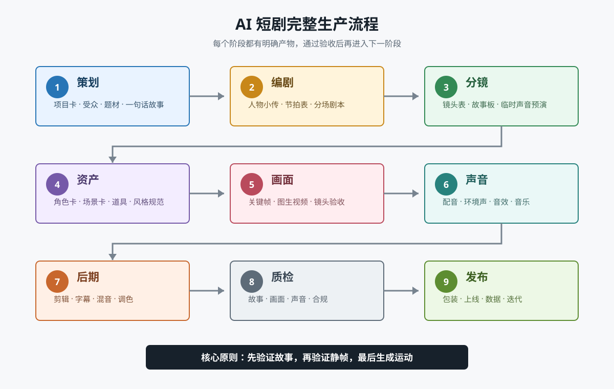
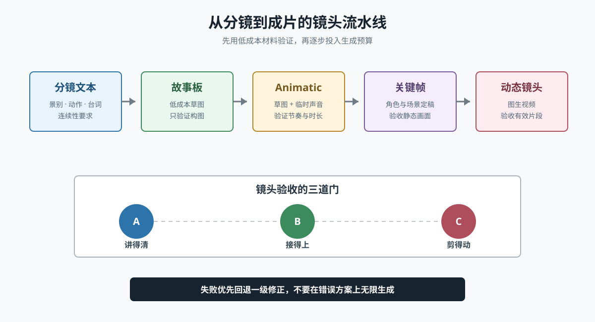
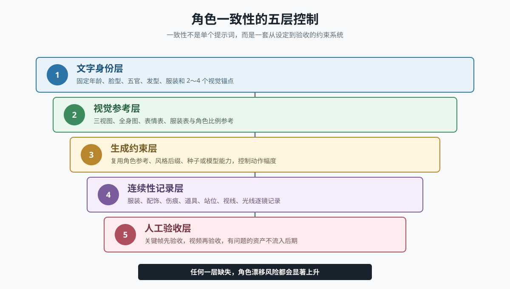
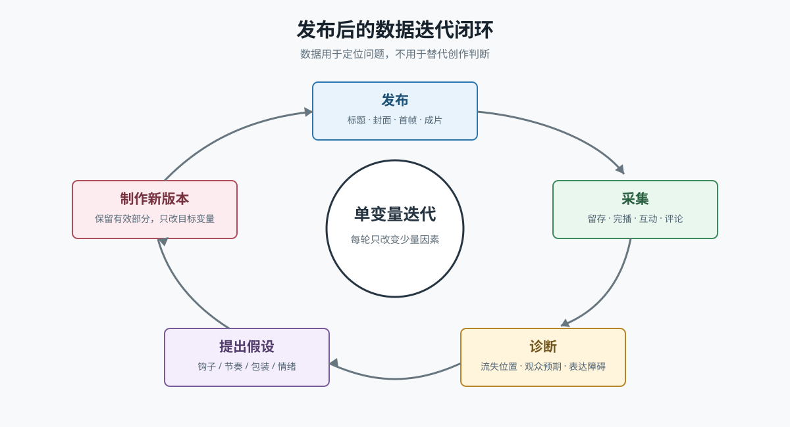
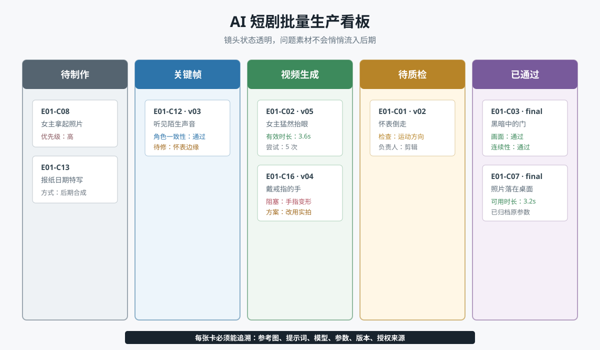

# AI 短剧创作保姆级教程：从一个想法到成片发布

> 本教程面向第一次制作 AI 短剧的创作者，也适合作为小团队的标准作业流程（SOP）。你将从零完成一部 **60～90 秒、9:16 竖屏、角色与场景相对一致、可公开发布** 的 AI 短剧样片。
>
> AI 工具的产品名称、套餐和界面经常变化，本文重点讲解可迁移的方法。实际制作时，可在同类工具中自由替换。

---

## 一、先理解：AI 短剧到底是怎样做出来的

AI 短剧并不是输入一句提示词，然后等待 AI 自动生成完整成片。稳定的生产方式是把影视制作拆成多个可控的小环节：



一部短剧的核心生产链路如下：

```text
选题定位
  ↓
故事梗概与人物小传
  ↓
分场剧本与台词
  ↓
分镜表和镜头提示词
  ↓
角色、场景、道具定妆
  ↓
首帧图/关键帧生成
  ↓
图生视频或文生视频
  ↓
配音、音乐、音效
  ↓
剪辑、字幕、调色
  ↓
质检、发布、数据复盘
```

这里最重要的观念是：

> **不要把整部短剧交给一次生成，而要把每个镜头变成一个可单独修改、替换和验收的最小生产单元。**

### 1. AI 短剧常见的三种生产路线

| 路线 | 做法 | 优点 | 缺点 | 适合场景 |
|---|---|---|---|---|
| 文生视频 | 直接用文字生成视频 | 快、探索性强 | 人物和场景一致性较弱 | 概念片、空镜、转场 |
| 图生视频 | 先生成定稿图，再让图片运动 | 可控、一致性较好 | 工序较多 | 剧情短剧的主力路线 |
| 真人/实拍 + AI | 真人拍摄后换景、换脸、扩图或特效 | 表演自然、动作稳定 | 需要拍摄条件和合规授权 | 商业项目、数字人短剧 |

新手建议以 **图生视频为主、文生视频为辅**：

- 角色对白、人物特写：优先图生视频；
- 城市航拍、环境空镜、梦境：可使用文生视频；
- 复杂打斗、多人互动：尽量拆镜，或考虑实拍结合 AI；
- 口型要求高的长台词：先生成稳定画面，再做口型驱动。

---

## 二、开工前准备：工具、目录与规格

### 1. 最小工具组合

你不需要同时购买所有工具。每个环节选择一种即可。

| 环节 | 工具类别 | 常见选择举例 | 主要用途 |
|---|---|---|---|
| 策划与编剧 | 大语言模型 | 豆包、DeepSeek、通义、ChatGPT、Claude | 选题、剧本、分镜、提示词 |
| 图片生成 | 文生图/图生图 | 即梦、Midjourney、Stable Diffusion、Flux | 角色定妆、场景、关键帧 |
| 视频生成 | 文生视频/图生视频 | 可灵、即梦、海螺、Runway、Veo 等 | 镜头动态化 |
| 配音 | TTS/声音克隆 | 剪映、微软 TTS、ElevenLabs 等 | 角色对白、旁白 |
| 音乐音效 | 音乐生成/素材库 | Suno、Udio、剪映素材库等 | 配乐、环境声、转场音效 |
| 剪辑合成 | 非线性剪辑 | 剪映专业版、Premiere Pro、DaVinci Resolve | 剪辑、字幕、混音、调色 |
| 项目管理 | 表格/看板 | Excel、飞书多维表格、Notion | 镜头状态、成本、版本管理 |

> 商业发布前，应逐项确认工具套餐是否允许商用，声音、字体、音乐、图片和模型是否拥有合法授权。

### 2. 本教程的成片规格

先固定规格，可以避免生成到一半才发现素材无法统一。

| 项目 | 建议值 |
|---|---|
| 画面比例 | 9:16 竖屏 |
| 成片分辨率 | 1080 × 1920 |
| 帧率 | 25 fps 或 30 fps，全片统一 |
| 时长 | 60～90 秒 |
| 单镜头时长 | 通常 2～5 秒 |
| 镜头数量 | 15～25 个 |
| 角色数量 | 新手控制在 1～3 人 |
| 场景数量 | 新手控制在 1～3 个 |
| 字幕安全区 | 避开顶部标题区和底部平台按钮区 |
| 导出格式 | MP4，H.264，AAC |

### 3. 建立项目目录

正式生成素材前，先建立固定目录：

```text
短剧项目名/
├── 00_策划/
│   ├── 项目卡.md
│   ├── 故事梗概.md
│   └── 参考作品/
├── 01_剧本/
│   ├── 分场剧本_v01.md
│   └── 台词表_v01.xlsx
├── 02_分镜/
│   ├── 分镜表_v01.xlsx
│   └── 故事板/
├── 03_设定/
│   ├── 角色/
│   ├── 场景/
│   └── 道具/
├── 04_图片素材/
│   ├── 原始生成/
│   └── 定稿关键帧/
├── 05_视频素材/
│   ├── 原始生成/
│   └── 通过镜头/
├── 06_声音素材/
│   ├── 配音/
│   ├── 音乐/
│   └── 音效/
├── 07_剪辑工程/
├── 08_成片/
└── 09_发布与数据/
```

素材命名统一使用：

```text
集数_场次_镜号_内容_版本.扩展名

示例：
E01_S02_C05_女主发现短信_v03.mp4
E01_S02_C05_女主发现短信_keyframe_v02.png
E01_林夏_对白_007_v01.wav
```

不要使用“最终版”“最终版2”“真的最终版”作为文件名。版本号必须递增，定稿状态由分镜表记录。

---

## 三、第一步：确定选题与受众

### 1. 用一句话定义项目

开工前填写一张项目卡：

```markdown
项目名：
类型：悬疑 / 甜宠 / 逆袭 / 科幻 / 治愈 / 喜剧
目标观众：
发布平台：
单集时长：
计划集数：
核心情绪：
一句话故事：
差异化卖点：
本集结尾钩子：
```

一个合格的一句话故事通常包含：

```text
主角 + 目标 + 阻碍 + 独特设定
```

示例：

> 能听见物品临终记忆的旧物修复师，必须在午夜前修好一块怀表，找出失踪父亲留下的真相。

这句话比“一个女孩寻找父亲的故事”更适合短剧，因为它同时给出了人物职业、超自然能力、时限和悬念。

### 2. 选择适合 AI 的题材

AI 擅长的内容：

- 单人或双人对话；
- 强氛围、强美术风格；
- 梦境、古风、科幻、奇幻；
- 以表情和构图推动的悬疑故事；
- 可拆成大量短镜头的叙事；
- 旁白主导、画面辅助的故事。

AI 暂时较难稳定完成的内容：

- 多人同时进行复杂肢体互动；
- 长时间一镜到底；
- 激烈打斗、精确舞蹈和复杂手部操作；
- 角色边走边说且口型必须完全同步；
- 大量具有连续空间关系的追逐场面；
- 每集频繁增加新角色和新场景。

不是不能制作，而是生成成本和返工率会明显上升。

### 3. 检查选题是否值得做

给每项打 1～5 分，低于 18 分时应重新打磨。

| 维度 | 检查问题 |
|---|---|
| 钩子强度 | 前 3 秒能否提出冲突、异常或利益点？ |
| 情绪价值 | 观众看完会爽、甜、怕、哭还是好奇？ |
| 视觉潜力 | 是否有容易被记住的角色、场景或道具？ |
| 制作可行性 | 能否控制在 3 名角色、3 个场景内？ |
| 连载空间 | 主线能否不断制造新问题？ |

---

## 四、第二步：搭建故事引擎

短剧的时间非常有限，不能照搬电影的慢节奏。60～90 秒单集可以使用以下结构：


| 时间 | 功能 | 观众应该获得什么 |
|---|---|---|
| 0～3 秒 | 强钩子 | “发生了什么？我必须继续看。” |
| 3～15 秒 | 建立人物与目标 | 主角是谁，现在要做什么 |
| 15～45 秒 | 冲突升级 | 计划受阻，信息持续增加 |
| 45～65 秒 | 反转或揭示 | 之前的理解被推翻 |
| 65～90 秒 | 结果与尾钩 | 得到阶段结果，同时产生更大问题 |

### 1. 钩子的常用写法

**异常钩子**

> 凌晨两点，已经去世三年的母亲给我打来了电话。

**倒计时钩子**

> 再过十分钟，这座城市里所有人都会忘记我的名字。

**身份反差钩子**

> 全公司都以为她是清洁工，直到董事会全体起立叫她董事长。

**危险预告钩子**

> 如果镜子里的我先眨眼，我就活不过今晚。

**结果前置钩子**

> 我结婚当天，亲手把新郎送进了监狱。

### 2. 每场戏只完成一个核心任务

场景不是越多越好。每一场必须至少完成一种任务：

- 推进目标；
- 增加阻碍；
- 揭示人物；
- 提供线索；
- 改变关系；
- 触发反转。

无法归入任何一项的场景，通常应该删除。

### 3. 用“但是 / 所以”检查因果

把剧情节点连接起来：

```text
女主收到父亲留下的怀表，
但是怀表已经损坏，
所以她连夜修复，
但是修复时听见怀表说“不要相信陈叔”，
所以她去翻父亲的旧档案，
但是陈叔突然出现在门口……
```

如果剧情只能用“然后”连接，往往说明事件只是堆叠，缺少因果推动。

---

## 五、第三步：让 AI 协助写出可拍的剧本

### 1. 不要直接要求“一次写完”

推荐按以下顺序与大语言模型协作：

1. 输出 10 个一句话创意；
2. 筛选 1 个创意并补充世界观；
3. 生成人物小传；
4. 生成整季故事弧；
5. 生成单集节拍表；
6. 生成分场剧本；
7. 压缩台词并检查可视化程度；
8. 人工定稿。

### 2. 创意生成提示词

```text
你是一名擅长竖屏短剧的编剧。

请为我设计 10 个【悬疑 + 轻科幻】AI 短剧创意。

制作限制：
1. 单集 60～90 秒；
2. 主要角色不超过 3 人；
3. 常驻场景不超过 3 个；
4. 避免大规模战争、复杂打斗和多人群戏；
5. 第一集前 3 秒必须出现异常事件；
6. 每个创意需要具备连续创作 20 集的潜力。

每个创意按以下格式输出：
- 剧名：
- 一句话故事：
- 核心设定：
- 主角目标：
- 持续冲突：
- 视觉记忆点：
- 第一集结尾钩子：
- AI 制作难点：
```

### 3. 人物小传提示词

```text
请根据下面的故事设定，为主要角色编写“表演可用、视觉可用”的人物小传。

【粘贴故事设定】

每名角色必须包含：
1. 姓名、年龄、职业；
2. 外在目标与内在需求；
3. 最大恐惧与性格缺陷；
4. 与其他角色的关系；
5. 说话节奏、口头禅、不会说的话；
6. 标志性动作；
7. 可视化外貌：脸型、五官、发型、服装、配饰；
8. 角色在第一季中的变化弧线；
9. 适合 AI 生成的稳定视觉锚点。

避免使用“很漂亮”“很有气质”等不可验证的空泛描述。
```

### 4. 单集剧本提示词

```text
你是一名短剧编剧和制片人。请写一集可由 AI 生成的竖屏短剧。

【项目资料】
类型：
人物小传：
上一集结尾：
本集目标：
本集必须揭示的信息：
本集结尾钩子：

【制作约束】
- 总时长 75 秒左右；
- 角色不超过 3 人；
- 场景不超过 2 个；
- 单句台词尽量不超过 15 个汉字；
- 开头 3 秒必须有冲突；
- 每 10～15 秒至少出现一次新信息；
- 避免复杂手部动作、多人打斗和长距离连续走位；
- 用能被镜头直接看到或听到的内容表达，不写抽象心理活动；
- 输出时标注场次、时间、地点、人物、动作、台词和预计时长。

【输出格式】
场次 1：内/外景，地点，时间
预计时长：
人物：
画面与动作：
角色名：台词
音效/音乐：
转场：
```

### 5. 从“文学剧本”改成“可拍剧本”

不可直接拍摄的描述：

> 林夏想起父亲多年的隐瞒，心中百感交集。

改成可视化表达：

> 林夏盯着照片中被剪掉的人影。她攥紧怀表，指节发白。  
> 林夏（低声）：“你到底瞒了我什么？”

转换原则：

| 抽象表达 | 可视化替代 |
|---|---|
| 她很紧张 | 呼吸加快、反复看门、握紧衣角 |
| 他想起童年 | 插入旧照片、童年闪回、熟悉的声音 |
| 气氛很压抑 | 冷色光、狭窄构图、低频环境声 |
| 时间紧迫 | 倒计时、钟声、快速切镜 |
| 两人关系疏远 | 站位拉开、不看对方、对话留白 |

### 6. 台词精修的四条规则

1. **删解释**：画面能表达的内容不要再用台词解释。
2. **删寒暄**：短剧中“你好、请坐、最近好吗”通常没有价值。
3. **加潜台词**：角色真实意图不必全部说出来。
4. **读出声**：一句台词读起来拗口，配音后只会更明显。

以 75 秒短剧为例，若对白持续不断，中文台词通常应控制在约 180～240 字以内；留有停顿、反应镜头和环境声时还要进一步减少。

---

## 六、第四步：把剧本拆成分镜表

分镜表是整个制作过程中最重要的控制文件。没有分镜表，后期很容易出现漏镜头、景别重复、动作接不上和预算失控。

### 1. 分镜表模板

| 镜号 | 时长 | 景别/机位 | 画面内容 | 人物动作 | 台词/旁白 | 声音 | 生成方式 | 状态 |
|---|---:|---|---|---|---|---|---|---|
| C01 | 3s | 大特写/俯拍 | 怀表秒针倒转 | 无 | 旁白：它又开始倒着走了 | 滴答声 | 文生视频 | 待生成 |
| C02 | 4s | 近景/平视 | 林夏猛然抬头 | 看向门口 | 林夏：谁在那里？ | 木门轻响 | 图生视频 | 待生成 |
| C03 | 3s | 特写/固定 | 门缝下滑入旧照片 | 照片停住 | 无 | 纸张摩擦 | 图生视频 | 待生成 |

建议增加以下生产字段：

```text
集数、场次、镜号、优先级、画幅、首帧路径、尾帧路径、
图片提示词、视频提示词、负面提示词、使用模型、生成参数、
生成次数、已选版本、负责人、版权来源、备注
```

### 2. 景别怎么选

| 景别 | 适合表达 | 使用建议 |
|---|---|---|
| 大远景 | 地点、规模、孤独感 | 开场建立环境，不宜过多 |
| 全景 | 人物和环境关系 | 适合进入场景、展示站位 |
| 中景 | 动作和双人关系 | 对话常用 |
| 近景 | 情绪和反应 | 竖屏短剧的主力景别 |
| 特写 | 眼神、道具、线索 | 强调关键信息 |
| 大特写 | 极端情绪、局部细节 | 少量使用，制造冲击 |

竖屏画面较窄，推荐多使用近景和特写，但不能整集都是“大头照”。可以按“全景建立空间 → 中近景推进 → 特写强调线索”的节奏变化。

### 3. 每个镜头只保留一个主要动作

不稳定的镜头描述：

> 女主从椅子上站起来，拿起杯子走到窗边，转身哭着说话，窗外下起大雨。

应拆成：

1. 女主闻声站起；
2. 手部特写：碰倒水杯；
3. 女主走到窗边的背影；
4. 近景：她转身落泪；
5. 窗外暴雨空镜。

拆镜后，每次生成只需要解决一个动作，成功率更高，也更方便剪辑控制节奏。

### 4. 保证镜头连续性



生成前逐镜检查：

- 上一镜人物看向画面右侧，下一镜被看对象应位于合理方向；
- 人物服装、发型、伤痕、手持道具不能突然变化；
- 门、窗、桌子等场景结构要保持大致一致；
- 同一时间段的光线方向和色温应一致；
- 上一镜抬手，下一镜不能无过渡地变成双手插袋；
- 重要动作至少准备“动作开始”和“动作结束”两个剪辑点。

---

## 七、第五步：建立角色、场景和道具设定

直接逐镜生成最大的风险，是同一个角色每个镜头都长得不一样。正确做法是先制作视觉资产，再进入镜头生产。



### 1. 制作角色设定卡

每个主要角色至少准备：

- 正面头像；
- 左右 45° 头像；
- 正面全身；
- 侧面全身；
- 喜、怒、哀、惊等表情；
- 常用服装；
- 标志性配饰；
- 固定色板；
- 一段不可随意改写的角色描述。

角色描述示例：

```text
林夏，25 岁的中国女性旧物修复师，鹅蛋脸，偏窄下颌，
单眼皮，深棕色瞳孔，鼻梁左侧有一颗小痣，
黑色齐肩直发，发尾轻微内扣，
穿墨绿色工装衬衫和黑色高腰长裤，
左手戴旧银色机械表，气质克制警觉。
```

其中“鼻梁左侧的小痣、墨绿色工装、旧银色机械表”都是视觉锚点。锚点应具体、稳定、易识别，数量控制在 2～4 个。

### 2. 生成角色设定图提示词

```text
角色设定表，三视图，同一个角色，
25 岁中国女性旧物修复师，鹅蛋脸，偏窄下颌，单眼皮，
鼻梁左侧一颗小痣，黑色齐肩直发，发尾轻微内扣，
墨绿色工装衬衫，黑色高腰长裤，左手旧银色机械表，
正面、左侧面、背面，全身站姿，中性表情，
纯浅灰背景，柔和均匀棚拍光，写实电影人物概念设计，
服装和五官高度一致，清晰细节，9:16
```

负面提示词可按工具支持情况填写：

```text
多人，重复人物，五官不一致，服装变化，多余手指，
手部畸形，肢体扭曲，文字，水印，标志，过度磨皮，
夸张妆容，模糊，低清晰度
```

> 负面提示词不能代替清晰的正向描述。先明确要什么，再排除不要什么。

### 3. 固定美术风格

建立一段全项目复用的风格后缀：

```text
写实电影质感，现代悬疑剧，克制的青绿色与暖黄色对比，
低饱和度，真实皮肤纹理，柔和电影光，浅景深，
细微胶片颗粒，高动态范围，竖屏构图
```

不要在同一集中混用“日系动漫、超写实摄影、油画、赛博朋克”等彼此冲突的风格，除非剧情明确要求。

### 4. 制作场景圣经

为每个常驻场景记录：

```markdown
场景名称：旧物修复店
空间布局：入口朝南，工作台靠东墙，北侧有一扇窄窗
主色：墨绿、深棕、旧黄铜
主光源：北侧窄窗冷光
辅光源：工作台右侧暖色台灯
固定物件：木质工作台、黄铜放大镜、绿色台灯、旧挂钟
时间状态：夜晚
禁止变化：窗户位置、工作台方向、墙面颜色
```

建议生成：

- 场景全景；
- 面向东、南、西、北的视角参考；
- 白天与夜晚版本；
- 空场版本；
- 人物在场景中的比例参考。

### 5. 关键道具必须单独定妆

推动剧情的怀表、戒指、信件、武器、手机界面等，都应单独生成清晰参考图。尤其是含文字的道具，最好在图片编辑或后期软件中人工制作文字，再合成到画面中，不要依赖生成模型准确书写。

---

## 八、第六步：生成每个镜头的关键帧

### 1. 先低成本预演，再高质量生成

推荐三轮生产：

1. **草图轮**：低成本生成故事板，只检查构图和叙事；
2. **定稿轮**：使用角色、场景参考生成高质量关键帧；
3. **修复轮**：局部重绘手部、五官、道具和背景错误。

如果故事板阶段发现镜头不成立，修改成本很低；视频生成后才改分镜，成本最高。

### 2. 图片提示词公式

```text
主体身份
+ 外貌与服装锚点
+ 当前动作和表情
+ 场景与时间
+ 景别、机位和构图
+ 光线
+ 美术风格
+ 画幅和质量要求
```

完整示例：

```text
林夏，25 岁中国女性旧物修复师，黑色齐肩直发，
穿墨绿色工装衬衫，左手戴旧银色机械表，
坐在木质工作台前，突然听见异响，抬眼看向画面右侧，
神情警觉，右手停在半空，
深夜的旧物修复店，背景有模糊的黄铜挂钟和绿色台灯，
近景，平视机位，人物位于画面左侧三分之一，
右侧保留视线空间，暖色台灯侧光，窗外微弱冷光，
写实电影质感，现代悬疑剧，低饱和度，真实皮肤纹理，
浅景深，细微胶片颗粒，9:16 竖屏
```

### 3. 构图必须服务于下一步运动

如果人物下一步要向右走，画面右侧需要留空间；如果镜头准备推进到怀表，怀表必须清晰可见；如果下一镜要切到门口，人物视线方向应能引导观众看向门。

### 4. 关键帧验收清单

进入视频生成前逐项检查：

- [ ] 是不是正确角色，而不是“长得相似的陌生人”；
- [ ] 发型、服装、配饰是否与设定卡一致；
- [ ] 手指、牙齿、耳朵、眼睛是否明显畸形；
- [ ] 关键道具是否正确；
- [ ] 人物视线和站位是否符合分镜；
- [ ] 场景光线是否与前后镜头一致；
- [ ] 构图是否为运动预留空间；
- [ ] 画面中是否出现乱码、水印或无意义标志；
- [ ] 是否留出了字幕区域；
- [ ] 放大到 100% 后主体是否足够清晰。

---

## 九、第七步：把关键帧变成视频

### 1. 视频提示词只描述“变化”

图片已经定义人物、服装、场景和构图。图生视频提示词的重点应是：

```text
主体动作 + 表情变化 + 镜头运动 + 环境运动 + 速度节奏 + 稳定约束
```

示例：

```text
女子先保持静止，听见声音后缓慢抬眼看向画面右侧，
眉头轻微收紧，呼吸变浅，右手停在半空。
镜头非常缓慢地向前推进，背景挂钟保持固定，
台灯光线轻微闪动。动作克制自然，真实物理运动，
人物身份、五官、服装和场景结构保持一致。
```

不推荐：

```text
让她动起来，电影感，震撼，高质量。
```

后者没有说明谁在何时做什么，也没有定义镜头如何运动。

### 2. 镜头运动的选择

| 镜头运动 | 叙事效果 | 使用场景 |
|---|---|---|
| 固定镜头 | 稳定、观察感 | 对话、悬疑等待 |
| 缓慢推近 | 强调发现与情绪 | 看见线索、产生怀疑 |
| 缓慢拉远 | 疏离、揭示环境 | 结尾、人物陷入困境 |
| 横移 | 展示空间或跟随 | 人物短距离移动 |
| 环绕 | 强烈戏剧化 | 关键反转，谨慎使用 |
| 手持微晃 | 紧张、临场感 | 追逐、危险，不宜过度 |

新手最稳妥的选择是固定镜头、轻微推近和轻微横移。每个镜头都大幅运镜，会使观众疲劳，也更容易出现背景变形。

### 3. 控制生成时长

即使工具支持更长视频，也建议把有效镜头控制在 2～5 秒：

- 动作越短，越容易稳定；
- 剪辑可以隐藏生成开头和结尾的不自然帧；
- 失败后重做成本更低；
- 多镜头组合比单镜头承担所有叙事更可靠。

### 4. 对白镜头的三种处理方式

**方案 A：画外音 + 反应镜头**

最稳定。说话者可以不露脸，画面展示听者反应、道具或环境。

**方案 B：短台词 + 口型驱动**

适合正面或 45° 近景。台词尽量短，避免遮挡嘴部和大幅转头。

**方案 C：先表演后换脸/数字人驱动**

表演自然度更高，但必须获得真人肖像和声音授权，并关注平台对合成内容的标识要求。

### 5. 失败镜头如何处理

不要无上限抽卡。按问题类型修复：

| 问题 | 优先修复方式 |
|---|---|
| 人脸漂移 | 降低动作幅度，增强角色参考，缩短时长 |
| 手部畸形 | 改构图隐藏手部，单独修图，拆分动作 |
| 背景融化 | 减少运镜，使用固定镜头，强化场景参考 |
| 动作方向错误 | 明确画面左/右，准备匹配动作的首帧 |
| 口型不自然 | 缩短台词，正面构图，改用画外音 |
| 节奏太慢 | 后期变速或提前切镜，不一定重新生成 |
| 镜头始终失败 | 改写分镜，用特写、影子、声音或插入镜头替代 |

一个实用的止损规则：

> 同一方案连续失败 3～5 次后，不再只改随机参数，而要修改动作、构图或分镜。

---

## 十、第八步：配音、音乐和音效

观众可以容忍局部画面瑕疵，但很难忍受听不清的对白、忽大忽小的音量和完全没有环境感的声音。

### 1. 先做声音小样

在批量生成视频前，用临时配音把静态故事板串起来，检查：

- 台词总时长是否超标；
- 角色说话是否符合年龄和性格；
- 信息是否太密；
- 哪里需要停顿；
- 哪些镜头实际不需要生成；
- 反转是否听得懂。

### 2. 配音提示参数

为每名角色建立声音卡：

```markdown
角色：林夏
音色：年轻女性，中低音，清晰但不甜腻
语速：正常偏慢
情绪基线：克制、警觉
停顿习惯：关键信息前短暂停顿
禁忌：播音腔、过度哭腔、句尾持续上扬
```

带表演意图的台词稿：

```text
【压低声音，短暂停顿】
这块表……不是我父亲的。

【先难以置信，随后变得确定】
照片里的人，一直是你。
```

不同 TTS 工具对情绪标签的支持不同。不支持标签时，可通过标点、分句、单句生成和后期拼接来控制节奏。

### 3. 声音分层

完整声音通常包含：

1. 对白或旁白；
2. 环境底噪，如风声、雨声、室内空间声；
3. 动作音效，如脚步、开门、衣料、物品落地；
4. 叙事音效，如线索出现、惊吓、转场；
5. 背景音乐。

没有环境声的画面容易显得“悬浮”。但环境声应自然存在，不要盖过对白。

### 4. 基础混音原则

- 对白永远是信息中心；
- 先把对白调清楚，再加入音乐和音效；
- 音乐在人声出现时适当降低；
- 同一角色不同句子的响度应一致；
- 切镜时保留少量连续环境声，可让画面连接更自然；
- 惊吓不等于突然把音量拉到极大；
- 使用耳机和手机外放各检查一次。

若剪辑软件支持响度表，可将网络视频的综合响度初步控制在约 `-16 LUFS` 至 `-14 LUFS`，真峰值不高于约 `-1 dBTP`；不同平台会再次标准化，最终仍需以实际试听和平台规范为准。

### 5. 音乐生成提示词示例

```text
现代悬疑短剧配乐，75 秒，无人声，
极简钢琴断奏、低频弦乐持续音、微弱机械滴答声，
前 15 秒克制，30 秒后逐渐增加张力，
55 秒出现短暂停顿，随后进入反转重音，
结尾留下未解决的悬念，不要宏大史诗感，不要抢对白。
```

---

## 十一、第九步：剪辑成片

### 1. 推荐剪辑顺序

```text
创建竖屏项目
→ 导入并整理素材
→ 根据配音搭建主时间线
→ 放入视频镜头
→ 修剪动作起止点
→ 补空镜、特写和转场
→ 加环境声与音效
→ 加音乐并混音
→ 制作字幕
→ 统一调色和画面处理
→ 全片质检
→ 导出
```

### 2. 先剪声音，再对画面

对白主导的短剧，可以先把配音和关键音效排成完整节奏，再用画面覆盖。这样能够更早发现时长、停顿和信息密度问题。

### 3. 用剪辑掩盖 AI 瑕疵

- 人物开始变形前提前切走；
- 动作衔接不上时插入道具特写；
- 口型不准时切到听者反应或环境；
- 复杂动作使用多个短镜头拼接；
- 用门框、前景、暗部遮挡不稳定区域；
- 对轻微抖动进行稳定，但避免过度裁切；
- 对无法修复的局部使用适度景深、裁切或重新构图。

### 4. 字幕规范

- 使用有授权的字体；
- 每行尽量简短，避免连续三行以上；
- 断句应符合语义，不要机械按字数切割；
- 字幕与画面底部平台 UI 保持距离；
- 白字配深色描边或阴影，确保明暗背景都可读；
- 重要词可少量变色，但不要每句都五颜六色；
- 检查错别字、人名、数字和标点。

### 5. 转场越少越好

大多数剧情镜头直接切换即可。以下情况才需要明显转场：

- 时间跨越；
- 地点切换；
- 梦境或回忆；
- 情绪或叙事阶段发生重大变化。

炫目的模板转场不能替代镜头逻辑，反而容易削弱沉浸感。

### 6. 基础调色

AI 生成的不同镜头经常颜色不统一。先做技术统一，再做风格：

1. 统一曝光；
2. 统一白平衡和肤色；
3. 统一对比度与饱和度；
4. 最后叠加全片风格；
5. 检查暗部是否死黑、高光是否过曝。

---

## 十二、第十步：成片质检与导出

### 1. 四遍质检法

**第一遍：只看故事**

- 不看脚本能否理解人物目标？
- 前 3 秒是否值得继续看？
- 反转是否有铺垫？
- 结尾是否产生下一集期待？

**第二遍：只看画面**

- 人物是否换脸、换装或忽胖忽瘦？
- 场景、道具、光线是否跳变？
- 手部、嘴部、眼睛是否有明显错误？
- 镜头方向和动作是否连贯？

**第三遍：只听声音**

- 闭眼能否听懂故事？
- 对白是否清晰、情绪是否自然？
- 音乐是否盖住人声？
- 是否存在爆音、断音和突兀静音？

**第四遍：模拟平台观看**

- 手机全屏观看；
- 手机静音观看，确认字幕能独立传递核心信息；
- 调低屏幕亮度，检查字幕和暗部；
- 检查封面、标题和首帧；
- 检查顶部、底部 UI 遮挡。

### 2. 发布前检查表

- [ ] 剧本、分镜、成片版本号一致；
- [ ] 无明显角色漂移和肢体畸形；
- [ ] 无乱码、生成水印和未授权商标；
- [ ] 对白、字幕和口型不存在严重冲突；
- [ ] 音乐、字体、图片、声音均可合法使用；
- [ ] 真人肖像和声音克隆已经获得明确授权；
- [ ] 未泄露身份证、电话、地址等个人信息；
- [ ] 未误导观众把虚构内容当作真实新闻或事实；
- [ ] 按法律法规及平台规则添加 AI 生成或合成内容标识；
- [ ] 封面和标题没有承诺成片中不存在的内容；
- [ ] 成片已在手机上完整播放至少两遍；
- [ ] 项目文件、提示词、原素材和授权证明已归档。

### 3. 建议导出参数

```text
容器：MP4
视频编码：H.264
分辨率：1080 × 1920
帧率：与项目一致，25 fps 或 30 fps
码率：建议 10～20 Mbps，可按平台要求调整
音频编码：AAC
音频采样率：48 kHz
```

上传平台后，再播放平台压缩后的版本，检查文字边缘、暗部色块和声音是否发生明显变化。

---

## 十三、发布包装与数据复盘

### 1. 标题、封面和首帧要表达同一承诺

例如：

- 标题：`去世三年的父亲，今晚给我的怀表上了发条`
- 封面：女主手持倒走的怀表，门外出现模糊人影
- 首帧：怀表秒针倒转的大特写

三者都围绕“去世的父亲 + 异常怀表”，观众点击后不会产生预期落差。

### 2. 常见数据及含义

| 指标 | 可能说明什么 | 优先调整方向 |
|---|---|---|
| 前 3 秒流失高 | 开头慢、信息不清、首帧弱 | 更早给异常、冲突或结果 |
| 播放中段下跌 | 解释过多、镜头重复、冲突停滞 | 删除废话，每 10 秒增加新信息 |
| 结尾前流失 | 高潮来得太晚或观众已猜到 | 提前反转，压缩铺垫 |
| 完播高但互动低 | 故事完整但缺少讨论点 | 增加选择、争议或未解线索 |
| 点击高但完播低 | 标题封面与内容不匹配 | 修正内容承诺 |
| 评论频繁问同一问题 | 可能是悬念，也可能是表达不清 | 判断问题是否属于预期讨论 |

### 3. 复盘表

```markdown
作品：
发布时间：
版本：

数据：
- 3 秒留存：
- 5 秒留存：
- 平均播放时长：
- 完播率：
- 点赞率：
- 评论率：
- 分享率：
- 关注转化：

观众最常提到：
观众没有看懂：
表现最好的镜头：
流失最明显的时间点：
下一集保留：
下一集删除：
下一集只改变的一个变量：
```



一次只改变少量变量。例如第二版只更换开头，不要同时更换标题、配乐、字幕、剧情和封面，否则无法判断究竟是什么产生了效果。

---

## 十四、完整实战：制作《午夜怀表》第 1 集

下面用一部约 75 秒的悬疑短剧串联整个流程。

### 1. 项目卡

```markdown
剧名：《午夜怀表》
类型：都市悬疑 + 轻科幻
目标观众：喜欢悬疑、反转和都市奇谈的年轻观众
单集时长：约 75 秒
主角：旧物修复师林夏
核心设定：她能听见旧物保存的最后一段记忆
本集目标：确认父亲留下的怀表为何倒走
本集反转：怀表的原主人不是父亲
结尾钩子：门外的人戴着与怀表主人相同的戒指
```

### 2. 75 秒节拍表

| 时间 | 剧情 |
|---|---|
| 0～3s | 怀表秒针倒走，传出父亲的声音：“别开门。” |
| 3～12s | 林夏确认店里只有自己，门外响起三下敲门声 |
| 12～25s | 她尝试打开怀表后盖，发现一张微型照片 |
| 25～40s | 照片中父亲站在陌生男人身后，怀表属于陌生男人 |
| 40～55s | 怀表再次播放记忆：“林夏看到照片了吗？” |
| 55～67s | 林夏意识到记忆发生在父亲失踪之后 |
| 67～75s | 门缝伸进一只手，戴着照片中相同的黑石戒指 |

### 3. 分场剧本

```text
场次 1：内景，旧物修复店，深夜
预计时长：67 秒
人物：林夏

大特写：旧银色怀表的秒针逆时针转动。
父亲的声音（失真）：别开门。

林夏猛然抬头。门外响起三下敲门声。
林夏：谁？

无人回答。

林夏用工具撬开怀表后盖，一张微型照片掉在桌上。
照片里，父亲站在一个戴黑石戒指的男人身后。

林夏（低声）：这不是你的表……

怀表传出新的声音。
陌生男人（录音）：林夏看到照片了吗？

林夏僵住。她看向父亲失踪日期的报纸。
报纸日期比这段录音早了整整一年。

场次 2：内景，修复店门口，连续
预计时长：8 秒

门缝下缓慢伸进一只男人的手。
手指上戴着照片中相同的黑石戒指。

陌生男人（门外）：现在，可以开门了吗？

切黑。
```

### 4. 镜头清单

| 镜号 | 时长 | 画面 | 生成重点 |
|---|---:|---|---|
| C01 | 3s | 怀表秒针倒走 | 道具特写，秒针运动 |
| C02 | 4s | 林夏猛然抬眼 | 克制表情，轻推镜 |
| C03 | 3s | 门在黑暗中静止 | 固定镜头，声音制造事件 |
| C04 | 4s | 林夏问“谁” | 短口型或画外音 |
| C05 | 4s | 她靠近门又停下 | 侧面中景，一个动作 |
| C06 | 4s | 工具撬开表盖 | 手部特写，必要时实拍替代 |
| C07 | 3s | 照片落在桌面 | 道具插入镜头 |
| C08 | 5s | 林夏拿起照片 | 近景，先看照片后皱眉 |
| C09 | 4s | 照片内容 | 后期合成确保人物和戒指准确 |
| C10 | 4s | 林夏说出发现 | 近景，短台词 |
| C11 | 3s | 怀表震动 | 特写，轻微振动 |
| C12 | 5s | 林夏听见陌生声音 | 缓慢推近，表情变化 |
| C13 | 4s | 墙上旧报纸 | 日期和标题后期制作 |
| C14 | 5s | 林夏在报纸与怀表间确认 | 眼神变化 |
| C15 | 4s | 门缝出现阴影 | 固定镜头 |
| C16 | 5s | 戴戒指的手伸入门缝 | 拆分生成或实拍 |
| C17 | 4s | 林夏惊恐特写 | 极轻推镜 |
| C18 | 4s | 戒指特写，门外台词 | 结尾钩子 |
| C19 | 2s | 切黑与剧名 | 保留声音尾巴 |

### 5. 先做 Animatic

把 19 张草图按上述时长放入时间线，加入临时配音和敲门声。此时重点检查：

- 0～3 秒能否立刻理解“怀表异常”；
- 照片和报纸的关系是否看得懂；
- “录音晚于父亲失踪”是否需要更多视觉提示；
- 戒指是否在照片和结尾各清晰出现一次；
- 75 秒内是否有停顿空间。

只有 Animatic 通过，才开始高质量图片和视频生成。

### 6. 一个镜头的完整生产示例

以 C12“林夏听见陌生声音”为例。

**关键帧提示词**

```text
林夏，25 岁中国女性旧物修复师，黑色齐肩直发，
墨绿色工装衬衫，左手戴旧银色机械表，
坐在旧物修复店工作台前，右手拿着打开的银色怀表，
听见怀表中传来陌生男人的声音，身体僵住，
眼睛微微睁大，嘴唇停止动作，
近景，平视，人物居中略偏左，怀表位于画面下方清晰可见，
背景为虚化的黄铜挂钟和绿色台灯，
暖色台灯侧光与窗外冷光形成对比，
写实电影质感，现代悬疑剧，低饱和度，
真实皮肤纹理，浅景深，9:16
```

**视频提示词**

```text
女子起初低头看怀表，听见声音后动作突然停止，
随后非常缓慢地抬眼，眼睛微微睁大，呼吸变浅，
手中的怀表保持稳定。镜头缓慢向前推进约半步，
背景和服装保持不变，动作克制自然，无大幅转头。
```

**验收标准**

- 人脸与角色卡一致；
- 怀表没有变形或消失；
- 反应从平静到警觉，有清晰起止点；
- 镜头可剪出至少 3 秒稳定素材；
- 背景没有明显流动或新增物体；
- 可与前一镜怀表特写、后一镜报纸特写顺畅连接。

---

## 十五、批量生产：从样片走向连续剧

完成第一集后，不要立即盲目生成 20 集。先建立资产库和生产看板。



### 1. 资产复用

建立可检索的资产库：

- 角色参考图与声音卡；
- 常用表情和姿势；
- 场景多角度参考；
- 道具设定；
- 已验证的提示词；
- 可复用空镜；
- 环境声、脚步声和转场声；
- 字幕、片头和片尾模板；
- 调色预设；
- 授权证明和来源记录。

### 2. 分阶段放行

推荐设置生产关卡：

| 关卡 | 必须通过的内容 | 未通过的处理 |
|---|---|---|
| G1 策划 | 钩子、冲突、结尾、制作可行性 | 重写梗概 |
| G2 剧本 | 时长、台词、场景和角色数量 | 压缩剧本 |
| G3 分镜 | 叙事完整、连续性、生成方式 | 调整镜头 |
| G4 资产 | 角色、场景、道具定妆 | 不进入批量生成 |
| G5 关键帧 | 构图、一致性、无明显畸形 | 修图或重做 |
| G6 视频 | 动作稳定、可剪、无严重漂移 | 换方案或拆镜 |
| G7 成片 | 故事、画面、声音、字幕、合规 | 返修并复检 |

不要让有问题的资产流入后续环节。角色定妆错误一旦进入 20 个镜头，返工会成倍增加。

### 3. 成本表

每集记录：

```text
图片生成次数
视频生成次数
成功镜头数
单镜头平均尝试次数
工具订阅或点数成本
人工修图时长
剪辑时长
总制作时长
最终可复用资产数量
```

关键指标不是“生成了多少素材”，而是：

```text
有效镜头率 = 最终采用镜头数 ÷ 总生成镜头数
```

有效镜头率持续过低，说明问题更可能出在分镜、资产或提示词，而不是点数不足。

---

## 十六、新手最常见的 12 个错误

### 1. 一上来就做 10 分钟

先完成 30 秒测试片，再完成 60～90 秒样片，最后才考虑连续剧。先验证流程和角色一致性。

### 2. 剧本角色太多

新手第一集控制在 1～3 个主要角色。角色越多，视觉、声音、关系和连续性管理成本越高。

### 3. 提示词堆满形容词

“高级、震撼、唯美、电影感、杰作”不能替代具体的景别、机位、动作、光线和构图。

### 4. 一条提示词要求五个动作

每个镜头只保留一个主要动作，复杂行为拆成多个镜头。

### 5. 未定妆就逐镜生成

先完成角色、场景和道具设定，再生产镜头。

### 6. 只看单帧漂亮

短剧镜头必须能与前后镜头连接。漂亮但方向、动作、光线不连续的画面未必可用。

### 7. 所有问题都靠重新生成

有些问题更适合剪辑、修图、遮挡、插入镜头、音效或实拍解决。

### 8. 过度依赖口型

用画外音、反应镜头、背影和道具特写分担对白，既自然又节省成本。

### 9. 每个镜头都大幅运动

运动幅度越大，人物和背景越容易变形。把大运动留给真正重要的时刻。

### 10. 忽视声音

声音不是最后随便配上去的装饰。临时配音应在批量生成前进入 Animatic。

### 11. 没有版本管理

提示词、模型、参数、参考图和结果必须能对应，否则无法复现好镜头。

### 12. 忽视版权和标识

“AI 生成”不等于“自动拥有完整版权”。训练素材争议、工具条款、肖像权、声音权、字体和音乐授权都需要单独确认。

---

## 十七、可直接复用的提示词模板

### 1. 剧本诊断

```text
你是一名竖屏短剧剧本医生。请审查下面的剧本，不要直接重写。

【剧本】
粘贴剧本

请按以下维度逐项评分（1～10 分）并给出具体证据：
1. 前 3 秒钩子；
2. 主角目标是否清晰；
3. 因果链是否成立；
4. 每 10～15 秒是否有新信息；
5. 反转是否有铺垫；
6. 结尾是否能推动下一集；
7. 台词是否口语化；
8. 是否存在无法被镜头表现的心理描写；
9. 是否适合 AI 制作；
10. 是否存在角色、场景或复杂动作过多的问题。

最后输出：
- 必须修改的问题；
- 可以优化的问题；
- 建议删除的台词；
- 建议拆分的复杂镜头；
- 不改变核心故事的最小修改方案。
```

### 2. 自动拆分分镜

```text
请把下面的分场剧本拆成可供 AI 图生视频制作的分镜表。

约束：
- 9:16 竖屏；
- 单镜头 2～5 秒；
- 每个镜头只保留一个主要动作；
- 优先使用近景、特写和少量中景；
- 复杂动作拆镜；
- 对话可使用说话者镜头、听者反应、道具特写和环境空镜；
- 明确人物在画面左侧或右侧以及视线方向；
- 为动作衔接设计可剪辑的起止点。

输出字段：
镜号、预计时长、景别、机位、构图、画面内容、
人物动作、表情、台词/旁白、音效、镜头运动、
首帧描述、视频运动描述、连续性注意事项、推荐生成方式。

【剧本】
粘贴剧本
```

### 3. 图片提示词生成器

```text
请根据角色卡、场景卡和分镜，为一个镜头编写图片生成提示词。

要求：
- 不改变角色视觉锚点；
- 明确人物数量和身份；
- 明确动作发生前的静态瞬间；
- 明确景别、机位、人物位置、视线方向和留白；
- 明确主光方向、色温和时间；
- 保持项目美术风格；
- 输出正向提示词、负面提示词和一致性风险。

【角色卡】
【场景卡】
【项目风格】
【分镜】
```

### 4. 视频提示词生成器

```text
请根据关键帧和分镜编写图生视频提示词。

只描述从关键帧开始后发生的变化，内容包括：
1. 主体动作的先后顺序；
2. 表情变化；
3. 镜头运动；
4. 环境中的次要运动；
5. 动作速度和节奏；
6. 必须保持不变的角色、服装、道具和场景结构。

每个镜头只允许一个主要动作，避免抽象形容词。

【关键帧描述】
【分镜目标】
【下一镜衔接要求】
```

### 5. 连续性检查

```text
你是一名影视场记。请审查下面连续镜头的场记信息。

逐镜检查：
- 角色外貌、服装、配饰；
- 伤痕、污渍和湿润状态；
- 道具由谁持有、在哪只手；
- 人物位置、视线和运动方向；
- 场景布局；
- 时间、天气和光线；
- 动作起止状态；
- 台词和情绪是否连续。

输出所有冲突，并为每个冲突给出最低成本修复方式：
重新生成 / 修图 / 调整剪辑顺序 / 插入镜头 / 改台词 / 加音效。

【镜头列表】
```

---

## 十八、最终工作流速查表

```text
□ 用一句话定义主角、目标、阻碍和独特设定
□ 固定画幅、时长、帧率、角色数和场景数
□ 写出 0～3 秒钩子和结尾钩子
□ 完成人物小传、单集节拍表和分场剧本
□ 删除不可视化心理描写，压缩台词
□ 拆成 2～5 秒的单动作镜头
□ 完成角色、场景、道具定妆
□ 用草图、临时配音制作 Animatic
□ Animatic 通过后再生成高质量关键帧
□ 逐张验收关键帧的一致性和构图
□ 用图生视频完成主镜头，文生视频补空镜
□ 同一方案连续失败时修改分镜
□ 完成配音、环境声、音效和音乐
□ 按声音节奏剪辑并隐藏生成瑕疵
□ 校对字幕，统一曝光、色温和响度
□ 完成故事、画面、声音、平台四遍质检
□ 检查所有授权、隐私和 AI 内容标识
□ 导出并检查平台压缩后的实际播放效果
□ 记录留存、完播、互动和观众反馈
□ 下一版只改变少量变量并继续验证
```

---

## 结语

AI 短剧的竞争力不在于“使用了多少 AI 工具”，而在于是否建立了稳定的叙事、视觉资产和生产流程。

对新手而言，最有效的起步方式不是策划一部长篇巨制，而是完成一部 **角色少、场景少、钩子清楚、约 60 秒** 的样片。把第一部作品跑通后，将角色卡、场景卡、分镜表、提示词、声音卡和质检表沉淀为模板，下一集才会真正变快。

始终记住这条生产原则：

> **先用故事板证明故事成立，再用关键帧证明画面成立，最后才让画面动起来。**
