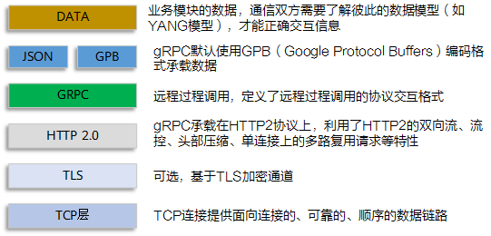
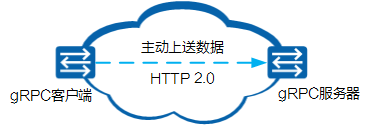
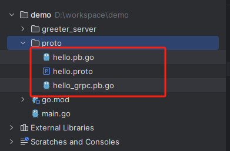

## gRPC 的使用与最佳实践

### 什么是 gRPC 
gRPC 是一个现代开源高性能远程过程调用 (RPC) 框架，可在任何环境中运行。它能够高效地连接数据中心内和跨数据中心的服务，并提供可插拔的负载平衡、跟踪、健康检查和身份验证支持。



### gRPC 工作原理
gRPC 采用客户端和服务器模型，以网络设备为 gRPC 客户端，gRPC 的交互过程如下：  


客户端主动和服务端建立gRPC连接，将设备上配置的订阅数据推送给服务器。在整个gRPC交互的过程中，客户端和服务器都需要使用 ProtoBuf 来定义 Proto 文件。

### 什么是gRPC ProtoBuf?
gRPC ProtoBuf是gRPC协议的接口描述语言，是一种与语言无关、平台无关、扩展性好的用于通信协议、数据存储的序列化结构数据格式。gRPC ProtoBuf编码格式也称为GPB（Google Protocol Buffers）编码格式。GPB提供了一种灵活、高效、自动序列化结构数据的机制。GPB与XML、JSON编码类似，也是一种编码方式，但不同的是，它是一种二进制编码，性能好，效率高。目前，GPB包括v2和v3两个版本，设备当前支持的GPB版本是v3。

其主要作用为：定义传输数据结构、定义服务接口、通过序列化和反序列化提升传输效率。

### 什么是Proto文件?
gRPC 协议用 GPB 编码格式承载数据，GPB 编码格式的文件名后缀为 .proto ，即为 Proto 文件。

GPB 通过 “.proto” 文件描述编码使用的字典，即数据结构描述。采集器可以利用 Protoc 等工具软件根据 “.proto” 文件自动生成代码（例如go代码），然后用户基于自动生成的代码进行二次开发对获取到的数据进行解析，从而实现与设备的数据对接。

Proto 文件包含公共 Proto 文件和业务数据 Proto 文件。

### 如何生成相关代码
首先需要安装对应的工具：
```bash
go install google.golang.org/protobuf/cmd/protoc-gen-go
go install google.golang.org/grpc/cmd/protoc-gen-go-grpc
```

定义 proto 文件：
```proto
syntax = "proto3";
package hello;

option go_package = "./proto/;greeter";

message HelloRequest {
  string name = 1;
}

message HelloReply {
  string message = 1;
}

service Greeter {
  rpc SayHello(HelloRequest) returns (HelloReply) {}
}
```

执行命令生成对应的源文件
```bash
protoc --go_out=. --go-grpc_out=. .\proto\hello.proto
```


创建服务端并执行：
```go
package main

import (
	"context"
	"demo/proto"
	"fmt"
	"google.golang.org/grpc"
	"google.golang.org/grpc/status"
	"log"
	"net"
)

type GreeterServer struct {
	greeter.UnimplementedGreeterServer
}

func (s *GreeterServer) SayHello(ctx context.Context, in *greeter.HelloRequest) (*greeter.HelloReply, error) {
	if in.Name == "debug" {
		return nil, status.Error(400, "you are debug now")
	}

	return &greeter.HelloReply{Message: fmt.Sprintf("Hello %s!", in.Name)}, nil
}

func main() {
	app := &GreeterServer{}
	srv := grpc.NewServer()
	greeter.RegisterGreeterServer(srv, app)

	listener, err := net.Listen("tcp", ":8080")
	if err != nil {
		panic(err)
	}
	log.Println("server running on 0.0.0.0:8080")
	if err = srv.Serve(listener); err != nil {
		panic(err.Error())
	}
}
```

客户端连接访问：
```go
package main

import (
	"context"
	greeter "demo/proto"
	"google.golang.org/grpc"
	"google.golang.org/grpc/credentials/insecure"
	"log"
)

func main() {
	ctx := context.Background()
	c, err := grpc.NewClient("127.0.0.1:8080", grpc.WithTransportCredentials(insecure.NewCredentials()))
	if err != nil {
		panic(err)
	}
	rpc := greeter.NewGreeterClient(c)
	log.Println(rpc.SayHello(ctx, &greeter.HelloRequest{Name: "Stan"}))
	log.Println(rpc.SayHello(ctx, &greeter.HelloRequest{Name: "debug"}))
}

// 2024/06/24 15:50:29 message:"Hello Stan!" <nil>
// 2024/06/24 15:50:29 <nil> rpc error: code = Code(400) desc = you are debug now
```