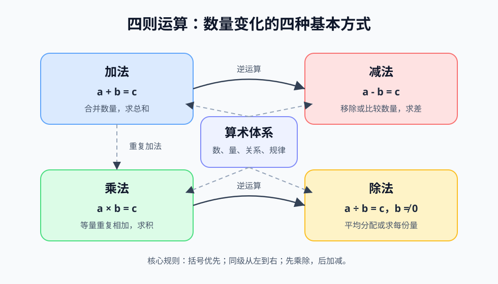

## 什么是四则运算

四则运算是指加法、减法、乘法、除法四种最基础的算术运算。它们用于描述数量的合并、减少、重复累加和平均分配，是小学算术、初等代数、方程、函数、概率统计以及后续高等数学的基础。



四则运算的核心不是单纯“算出答案”，而是用符号表达数量之间的关系。例如 `3 + 2 = 5` 表示两个数量合并后的总量，`12 ÷ 3 = 4` 表示把 12 平均分成 3 份后每份为 4。

## 1. 加法

### 定义

加法是把两个或多个数量合并成一个总量的运算。若有两个数 `a` 和 `b`，它们的和记作 `a + b`。

### 作用

- 表示数量的合并，例如 `3 个苹果 + 2 个苹果 = 5 个苹果`。
- 表示数轴上的正向移动，例如从 `3` 向右移动 `2` 个单位得到 `5`。
- 为乘法提供基础，因为乘法可以理解为等量的重复加法。

### 公式

```text
a + b = c
```

其中：

- `a` 和 `b` 是加数。
- `c` 是和。

常见性质：

```text
a + b = b + a                加法交换律
(a + b) + c = a + (b + c)    加法结合律
a + 0 = a                    加法单位元
```

### 拓展发展

加法从自然数范围扩展到整数、有理数、实数、复数乃至向量和矩阵。在代数中，加法不再只表示“数量增加”，也可以表示对象之间的合成关系。例如向量加法表示位移合成，矩阵加法表示对应位置元素相加。

## 2. 减法

### 定义

减法是从一个数量中去掉另一个数量，或比较两个数量相差多少的运算。若有两个数 `a` 和 `b`，它们的差记作 `a - b`。

### 作用

- 表示数量减少，例如 `10 - 4 = 6`。
- 表示两个数量之间的差距，例如 `身高 180 cm 与 170 cm 相差 10 cm`。
- 作为加法的逆运算，用于根据总量和其中一部分求另一部分。

### 公式

```text
a - b = c
```

其中：

- `a` 是被减数。
- `b` 是减数。
- `c` 是差。

减法与加法的关系：

```text
a - b = c  等价于  c + b = a
a - b = a + (-b)
```

### 拓展发展

减法推动了负数的引入。当 `3 - 5` 在自然数范围内无法表示时，需要扩展到整数，得到 `-2`。在代数中，减法通常被统一为“加上相反数”，这使得方程变形、函数分析和线性代数中的运算规则更加统一。

## 3. 乘法

### 定义

乘法是等量重复相加的简写。若 `a × b = c`，可以理解为把 `a` 连续加 `b` 次，或把 `b` 连续加 `a` 次。

### 作用

- 表示等量分组，例如 `每组 4 个，共 3 组`，即 `4 × 3 = 12`。
- 表示面积、比例、倍数等关系，例如长方形面积 `长 × 宽`。
- 为幂运算、比例计算、函数增长模型等内容提供基础。

### 公式

```text
a × b = c
```

其中：

- `a` 和 `b` 是因数。
- `c` 是积。

常见性质：

```text
a × b = b × a                    乘法交换律
(a × b) × c = a × (b × c)        乘法结合律
a × (b + c) = a × b + a × c      乘法对加法的分配律
a × 1 = a                        乘法单位元
a × 0 = 0                        零乘任何数等于零
```

### 拓展发展

乘法从重复加法发展为更抽象的“结构变换”。在比例问题中，它描述倍数关系；在几何中，它描述面积和体积；在代数中，它描述多项式展开；在线性代数中，矩阵乘法表示线性变换的复合。

## 4. 除法

### 定义

除法是把一个数量平均分成若干份，或求一个数量中包含多少个另一个数量的运算。若 `a ÷ b = c`，表示 `a` 被 `b` 除后得到 `c`，其中 `b` 不能等于 `0`。

### 作用

- 表示平均分配，例如 `12 个苹果平均分给 3 人，每人 4 个`。
- 表示包含关系，例如 `12 里面有 3 个 4`。
- 作为乘法的逆运算，用于根据总量和倍数求单位量。

### 公式

```text
a ÷ b = c，b ≠ 0
```

其中：

- `a` 是被除数。
- `b` 是除数。
- `c` 是商。

除法与乘法的关系：

```text
a ÷ b = c  等价于  c × b = a
a ÷ b = a × (1 / b)，b ≠ 0
```

### 拓展发展

除法促进了分数和有理数的形成。比如 `1 ÷ 2` 不能在整数范围内完整表示，需要使用 `1/2`。在更高层次的数学中，除法常被理解为“乘以倒数”，这让分式、比例、斜率、概率、极限和微积分中的比值关系具有统一表达。

## 四则运算的运算顺序

当一个算式中同时出现加、减、乘、除时，需要按照固定顺序计算：

```text
1. 先算括号内的内容
2. 再算乘法和除法
3. 最后算加法和减法
4. 同一级运算从左到右依次计算
```

例如：

```text
3 + 4 × 2 = 3 + 8 = 11
(3 + 4) × 2 = 7 × 2 = 14
12 ÷ 3 × 2 = 4 × 2 = 8
```

括号可以改变默认运算顺序，因此在复杂表达式中，括号不仅是计算工具，也是表达结构和优先级的重要符号。

## 四则运算之间的关系

四则运算可以看作两组互逆关系：

```text
加法 ↔ 减法
乘法 ↔ 除法
```

加法和减法描述数量的增减，乘法和除法描述数量的倍数、分组和比例。乘法可以看作重复加法，除法可以看作乘法的逆运算。

```text
5 + 3 = 8     所以 8 - 3 = 5
4 × 6 = 24    所以 24 ÷ 6 = 4
```

## 从四则运算到更高数学

四则运算是数学体系继续发展的起点：

- 从加法发展出数列、累加、求和符号。
- 从减法发展出负数、相反数、差值、变化量。
- 从乘法发展出幂运算、多项式、面积、比例和线性变换。
- 从除法发展出分数、比值、斜率、概率、极限和导数。

因此，四则运算不仅是基础计算方法，也是理解“数如何变化、量如何关联、结构如何表达”的入口。
