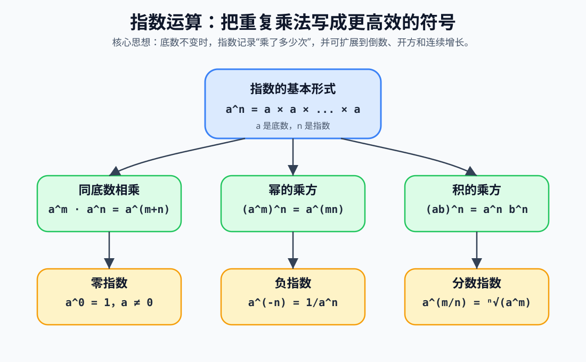

# 什么是指数运算

指数运算是乘法的进一步抽象，用来表示“同一个数重复相乘”的过程。它的基本形式是：

```text
a^n
```

读作“a 的 n 次方”或“a 的 n 次幂”。

其中：

- `a` 称为底数，表示被重复相乘的数。
- `n` 称为指数，表示重复相乘的次数。
- `a^n` 称为幂，表示指数运算的结果。



例如：

```text
2^4 = 2 × 2 × 2 × 2 = 16
```

这里 `2` 是底数，`4` 是指数，`16` 是幂。

## 1. 正整数指数

### 定义

当 `n` 是正整数时，`a^n` 表示 `n` 个 `a` 连续相乘：

```text
a^n = a × a × a × ... × a
```

右边一共有 `n` 个 `a`。

### 例子

```text
3^5 = 3 × 3 × 3 × 3 × 3 = 243
```

### 作用

正整数指数用于简化重复乘法。比如面积、体积、倍数增长、排列组合、计算机中的二进制容量等场景都会用到指数。

```text
10^3 = 1000
2^10 = 1024
```

## 2. 同底数幂相乘

### 公式

```text
a^m × a^n = a^(m+n)
```

### 适用条件

当底数相同，并且指数运算有意义时，该公式成立。初学阶段可以先理解为 `m`、`n` 是正整数。

### 公式解释

两个同底数的幂相乘，本质上就是把重复相乘的次数合并。

例如：

```text
2^3 × 2^4
= (2 × 2 × 2) × (2 × 2 × 2 × 2)
= 2^7
```

所以：

```text
2^3 × 2^4 = 2^(3+4) = 2^7
```

### 推导证明

根据正整数指数定义：

```text
a^m = a × a × ... × a    一共有 m 个 a
a^n = a × a × ... × a    一共有 n 个 a
```

两者相乘：

```text
a^m × a^n
= (m 个 a 相乘) × (n 个 a 相乘)
= (m + n) 个 a 相乘
= a^(m+n)
```

因此：

```text
a^m × a^n = a^(m+n)
```

## 3. 同底数幂相除

### 公式

```text
a^m ÷ a^n = a^(m-n)
```

也可以写成：

```text
a^m / a^n = a^(m-n)
```

### 适用条件

```text
a ≠ 0
```

因为除法中分母不能为 `0`。

### 公式解释

同底数幂相除，本质上是把相同的因数约掉。

例如：

```text
2^5 / 2^2
= (2 × 2 × 2 × 2 × 2) / (2 × 2)
= 2 × 2 × 2
= 2^3
```

所以：

```text
2^5 / 2^2 = 2^(5-2) = 2^3
```

### 推导证明

当 `m > n` 时：

```text
a^m / a^n
= (a × a × ... × a) / (a × a × ... × a)
```

分子中有 `m` 个 `a`，分母中有 `n` 个 `a`。上下约去 `n` 个相同因数后，分子还剩 `m - n` 个 `a`：

```text
a^m / a^n = a^(m-n)
```

因此：

```text
a^m ÷ a^n = a^(m-n)
```

## 4. 零指数

### 公式

```text
a^0 = 1
```

### 适用条件

```text
a ≠ 0
```

`0^0` 在初等数学中通常不定义。

### 公式解释

任何非零数的零次方都等于 `1`。这不是随意规定，而是为了让同底数幂相除公式保持一致。

### 推导证明

根据同底数幂相除公式：

```text
a^m / a^m = a^(m-m) = a^0
```

但同一个非零数除以自身等于 `1`：

```text
a^m / a^m = 1
```

因此：

```text
a^0 = 1
```

### 例子

```text
2^0 = 1
10^0 = 1
(-3)^0 = 1
```

## 5. 负整数指数

### 公式

```text
a^(-n) = 1 / a^n
```

### 适用条件

```text
a ≠ 0
n 是正整数
```

### 公式解释

负指数表示倒数。指数为负，并不是结果一定为负，而是表示把对应的正指数幂放到分母中。

例如：

```text
2^(-3) = 1 / 2^3 = 1/8
```

### 推导证明

根据同底数幂相除公式：

```text
a^0 / a^n = a^(0-n) = a^(-n)
```

又因为：

```text
a^0 = 1
```

所以：

```text
a^0 / a^n = 1 / a^n
```

因此：

```text
a^(-n) = 1 / a^n
```

### 例子

```text
10^(-2) = 1 / 10^2 = 1/100 = 0.01
3^(-1) = 1 / 3
```

## 6. 幂的乘方

### 公式

```text
(a^m)^n = a^(mn)
```

### 适用条件

当指数运算有意义时成立。初学阶段可以先理解为 `m`、`n` 是正整数。

### 公式解释

幂的乘方表示：先计算 `a^m`，再把这个整体重复相乘 `n` 次。

例如：

```text
(2^3)^4
= 2^3 × 2^3 × 2^3 × 2^3
= 2^(3+3+3+3)
= 2^12
```

所以：

```text
(2^3)^4 = 2^(3×4)
```

### 推导证明

根据正整数指数定义：

```text
(a^m)^n = a^m × a^m × ... × a^m
```

右边一共有 `n` 个 `a^m`。

再根据同底数幂相乘公式：

```text
a^m × a^m × ... × a^m = a^(m+m+...+m)
```

其中 `m` 被加了 `n` 次：

```text
m + m + ... + m = mn
```

因此：

```text
(a^m)^n = a^(mn)
```

## 7. 积的乘方

### 公式

```text
(ab)^n = a^n b^n
```

### 适用条件

当指数运算有意义时成立。初学阶段可以先理解为 `n` 是正整数。

### 公式解释

两个数的乘积再进行乘方，等于每个因数分别乘方后再相乘。

例如：

```text
(2 × 3)^4 = 2^4 × 3^4
```

### 推导证明

根据正整数指数定义：

```text
(ab)^n = (ab) × (ab) × ... × (ab)
```

右边一共有 `n` 个 `(ab)`。

利用乘法交换律和结合律，把所有 `a` 放在一起，把所有 `b` 放在一起：

```text
(ab)^n
= (a × a × ... × a) × (b × b × ... × b)
= a^n b^n
```

因此：

```text
(ab)^n = a^n b^n
```

## 8. 商的乘方

### 公式

```text
(a / b)^n = a^n / b^n
```

### 适用条件

```text
b ≠ 0
```

### 公式解释

分式整体乘方，等于分子和分母分别乘方。

例如：

```text
(2 / 3)^3 = 2^3 / 3^3 = 8 / 27
```

### 推导证明

根据正整数指数定义：

```text
(a / b)^n
= (a / b) × (a / b) × ... × (a / b)
```

右边一共有 `n` 个 `a / b`。

把分子与分母分别相乘：

```text
(a / b)^n
= (a × a × ... × a) / (b × b × ... × b)
= a^n / b^n
```

因此：

```text
(a / b)^n = a^n / b^n
```

## 9. 分数指数

### 公式

```text
a^(1/n) = ⁿ√a
```

更一般地：

```text
a^(m/n) = ⁿ√(a^m) = (ⁿ√a)^m
```

### 适用条件

在实数范围内，通常要求：

```text
n 是正整数
当 n 是偶数时，a ≥ 0
当 n 是奇数时，a 可以为任意实数
```

如果只在正实数范围讨论，则常取：

```text
a > 0
```

### 公式解释

分数指数表示开方。指数的分母表示开几次方，指数的分子表示再乘几次方。

例如：

```text
8^(1/3) = ³√8 = 2
16^(3/2) = (√16)^3 = 4^3 = 64
```

### 推导证明

设：

```text
x = a^(1/n)
```

根据幂的乘方公式：

```text
x^n = (a^(1/n))^n = a^((1/n)×n) = a^1 = a
```

因此 `x` 是一个满足 `x^n = a` 的数，也就是 `a` 的 `n` 次方根：

```text
x = ⁿ√a
```

所以：

```text
a^(1/n) = ⁿ√a
```

进一步：

```text
a^(m/n)
= (a^(1/n))^m
= (ⁿ√a)^m
```

也可以写作：

```text
a^(m/n) = ⁿ√(a^m)
```

## 10. 指数为 1

### 公式

```text
a^1 = a
```

### 公式解释

指数为 `1`，表示只有一个底数 `a`，没有发生重复相乘。

### 推导证明

根据正整数指数定义：

```text
a^1
```

表示一个 `a`，所以：

```text
a^1 = a
```

也可以从同底数幂相除推导：

```text
a^2 / a^1 = a^(2-1) = a^1
```

而：

```text
a^2 / a = a
```

所以：

```text
a^1 = a
```

## 11. 指数运算常用公式汇总

| 公式 | 名称 | 条件 |
| --- | --- | --- |
| `a^m × a^n = a^(m+n)` | 同底数幂相乘 | 底数相同 |
| `a^m / a^n = a^(m-n)` | 同底数幂相除 | `a ≠ 0` |
| `(a^m)^n = a^(mn)` | 幂的乘方 | 运算有意义 |
| `(ab)^n = a^n b^n` | 积的乘方 | 运算有意义 |
| `(a / b)^n = a^n / b^n` | 商的乘方 | `b ≠ 0` |
| `a^0 = 1` | 零指数 | `a ≠ 0` |
| `a^(-n) = 1 / a^n` | 负指数 | `a ≠ 0` |
| `a^(1/n) = ⁿ√a` | 分数指数 | 根式有意义 |
| `a^(m/n) = ⁿ√(a^m)` | 一般分数指数 | 根式有意义 |

## 12. 常见误区

### 误区一：负指数不是负数

```text
2^(-3) ≠ -2^3
```

正确理解是：

```text
2^(-3) = 1 / 2^3 = 1/8
```

### 误区二：零指数有条件

```text
a^0 = 1
```

前提是：

```text
a ≠ 0
```

`0^0` 在初等数学中通常不定义。

### 误区三：指数不能随意分配到加法上

下面这个式子一般不成立：

```text
(a + b)^n ≠ a^n + b^n
```

例如：

```text
(2 + 3)^2 = 25
2^2 + 3^2 = 13
```

所以：

```text
(2 + 3)^2 ≠ 2^2 + 3^2
```

正确展开应使用乘法分配律：

```text
(a + b)^2 = a^2 + 2ab + b^2
```

## 13. 指数运算的意义

指数运算的价值在于把重复乘法压缩成简洁符号，并进一步支持更复杂的数学建模：

- 在算术中，指数表示重复乘法。
- 在代数中，指数用于化简幂式和解方程。
- 在几何中，平方和立方分别对应面积和体积。
- 在科学计数法中，指数用于表示极大或极小的数。
- 在函数中，指数函数描述增长和衰减。
- 在机器学习中，指数函数常出现在 Softmax、Sigmoid、交叉熵等公式中。

指数运算从 `a^n` 这样的简单符号开始，最终连接到增长模型、对数、极限、微积分和概率统计，是基础数学中非常核心的一类运算。
