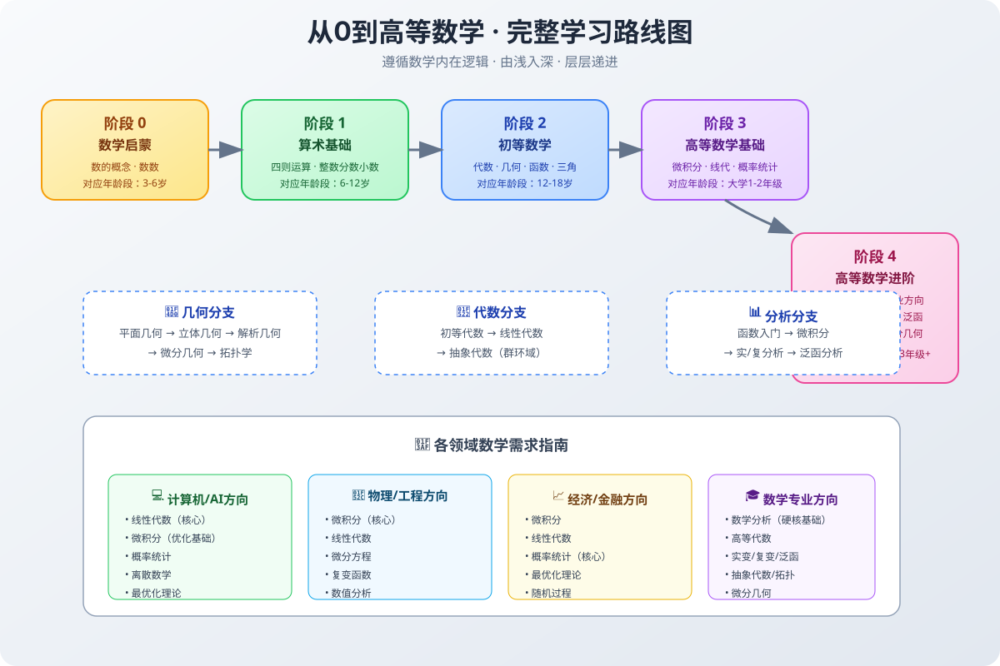
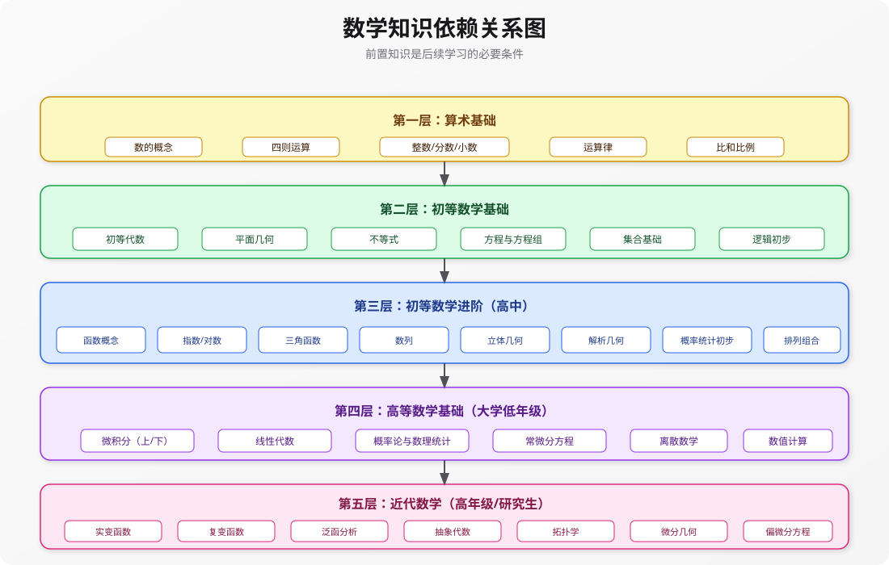
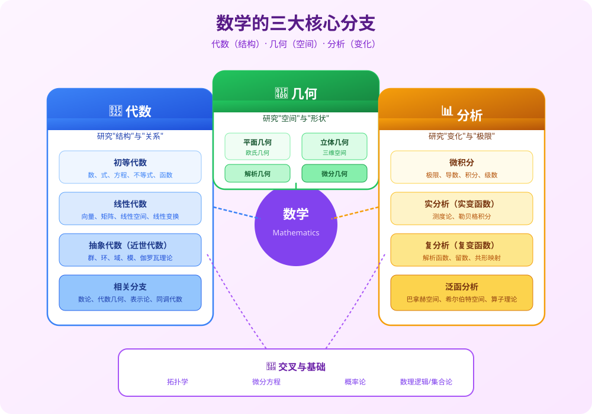

# 数学学习路线图：从0到高等数学

数学是自然科学的皇后，是逻辑思维的基石，也是计算机科学、人工智能、物理学、经济学等众多学科的核心工具。本文档提供一条**遵循数学内在逻辑、由浅入深、层层递进**的完整学习路径。

---

## 📋 学习原则

在开始之前，请牢记以下核心原则：

1. **循序渐进**：数学是一门高度依赖前置知识的学科，跳过基础直接学习高阶内容往往事倍功半
2. **理解优先**：不要死记硬背公式，要理解每个概念"为什么"是这样
3. **动手练习**：数学是"做"出来的，不是"看"出来的。每学一个知识点都要配合足够的习题
4. **建立直觉**：几何直观、数值例子、实际应用是建立数学直觉的三大法宝
5. **多问为什么**：遇到每个定义、定理都问自己："为什么要定义这个？""这个定理解决了什么问题？"

---

## 🏗️ 数学知识体系总览

现代数学主要分为**三大核心分支**，所有其他分支都是这三大分支的交叉与延伸：

| 分支 | 核心问题 | 研究对象 | 关键词 |
|------|----------|----------|--------|
| **代数** | 结构是什么？ | 集合上的运算结构 | 数、式、方程、向量、矩阵、群、环、域 |
| **几何** | 空间是什么样？ | 空间中的形状与位置 | 点、线、面、体、坐标、曲率、拓扑 |
| **分析** | 如何变化？ | 极限与连续变化 | 函数、极限、导数、积分、级数 |

---

## 🎯 阶段 0：数学启蒙（3-6岁）

### 学习目标
建立数的概念，理解数量对应关系。

### 核心内容

| 知识点 | 说明 | 掌握标准 |
|--------|------|----------|
| 数数 | 从1数到100，理解数的顺序 | 能准确点数物体数量 |
| 数的认识 | 认识0-100的数字 | 看到数字能读出，能写出数字 |
| 多少比较 | 比较两组物体的多少 | 能判断"哪个多""哪个少""一样多" |
| 简单分类 | 按颜色、形状、大小分类 | 能给物体归类 |
| 简单图形 | 认识圆形、正方形、三角形 | 能识别并命名基本图形 |
| 方位概念 | 上下、前后、左右、里外 | 能理解并使用方位词 |
| 规律感知 | 发现简单的重复规律 | 能按规律继续排列 |

### 学习建议
- **在生活中学**：数水果、数楼梯、分餐具，让数与实物对应
- **游戏化学习**：积木、拼图、桌游是最好的启蒙工具
- **不追求进度**：建立数感比会算题重要得多

---

## 📚 阶段 1：算术基础（6-12岁，小学）

这是整个数学大厦的地基，**必须100%掌握**，不然后续所有内容都会成为空中楼阁。

### 1.1 整数与四则运算

| 知识点 | 重点 | 常见误区 |
|--------|------|----------|
| 整数认识 | 数位（个十百千万）、进制 | 数位顺序混淆 |
| 加法/减法 | 进位、退位、加减法互逆 | 忘记进位/退位 |
| 乘法/除法 | 乘法口诀表、乘除法互逆、余数 | 乘法口诀不熟练 |
| 四则混合运算 | 运算顺序（先乘除后加减，括号优先） | 运算顺序错误 |
| 运算律 | 交换律、结合律、分配律 | 分配律漏乘 |

**核心要求**：多位数加减乘除必须做到**准确、快速**，这是后续所有计算的基础。

### 1.2 数的扩展：分数、小数、百分数

| 知识点 | 重点 | 常见误区 |
|--------|------|----------|
| 分数 | 分数的意义（整体与部分）、约分、通分 | 分数意义理解不清 |
| 分数四则运算 | 异分母加减、分数乘除 | 分数除法忘记取倒数 |
| 小数 | 小数的意义、小数性质、小数四则运算 | 小数点位置错误 |
| 百分数 | 百分数意义、百分数与分数/小数互化 | 百分比计算错误 |
| 比和比例 | 比的意义、比例的基本性质、正反比例 | 比例关系判断错误 |

**重要概念**：理解"分数是除法的另一种表示形式"，建立分数、小数、百分数之间的灵活转换能力。

### 1.3 算术应用题

- 行程问题（路程=速度×时间）
- 工程问题
- 浓度问题
- 利润问题
- 和差倍问题
- 植树问题、鸡兔同笼等经典问题

**关键**：不是背题型，而是学会**分析数量关系**，用画图（线段图）的方法辅助理解。

### 1.4 简单几何与计量

- 长度、面积、体积单位及换算
- 长方形、正方形、三角形、圆的周长与面积
- 长方体、正方体的表面积与体积
- 角的认识、角度测量
- 轴对称、平移、旋转

### 1.5 统计初步

- 简单的数据收集与整理
- 条形统计图、折线统计图、扇形统计图的认识
- 平均数

---

## 📖 阶段 2：初等数学（12-18岁，中学）

这个阶段是从"算术"到"数学"的飞跃，开始系统学习**代数、几何、分析入门**三大分支。

---

### 2.1 初等代数（初中）

#### 2.1.1 有理数与实数

| 知识点 | 重点 |
|--------|------|
| 有理数 | 正数、负数、数轴、相反数、绝对值 |
| 有理数运算 | 加减乘除、乘方、混合运算 |
| 实数 | 平方根、立方根、无理数、实数分类 |

**关键突破**：引入负数，数的范围从算术数扩展到有理数，再到实数。建立**数轴**的几何直观。

#### 2.1.2 代数式与整式

- 用字母表示数
- 整式（单项式、多项式）
- 整式的加减乘除
- 乘法公式：
  - 平方差：$(a+b)(a-b) = a^2 - b^2$
  - 完全平方：$(a±b)^2 = a^2 ± 2ab + b^2$
- 因式分解：提公因式法、公式法、十字相乘法

#### 2.1.3 方程与不等式

| 类型 | 解法要点 |
|------|----------|
| 一元一次方程 | 移项、合并同类项、系数化为1 |
| 二元一次方程组 | 代入消元法、加减消元法 |
| 一元一次不等式（组） | 注意不等号方向改变问题 |
| 一元二次方程 | 配方法、公式法、因式分解法 |
| 分式方程 | 注意验根 |

**核心思想**：方程是解决实际问题的强大工具，关键是找到**等量关系**。

#### 2.1.4 函数入门（初中阶段）

- 函数的概念：变量与常量、定义域、值域
- 一次函数：$y = kx + b$（图像是直线）
- 反比例函数：$y = \frac{k}{x}$（图像是双曲线）
- 二次函数入门：$y = ax^2 + bx + c$（图像是抛物线）

**关键突破**：从"静态的数"到"动态的函数关系"，建立**数形结合**的思维——每一个函数对应一个图像，每一个图像背后是一个代数关系。

---

### 2.2 平面几何（初中）

平面几何是训练**逻辑推理能力**的最佳素材。

| 模块 | 核心内容 |
|------|----------|
| 几何基础 | 点、线、面、角、相交线、平行线 |
| 三角形 | 三角形性质、全等三角形、相似三角形、勾股定理 |
| 四边形 | 平行四边形、矩形、菱形、正方形、梯形 |
| 圆 | 圆的性质、点/直线/圆与圆的位置关系、圆周角定理 |
| 几何变换 | 平移、旋转、轴对称、位似 |
| 尺规作图 | 基本作图方法 |

**学习要点**：
- 熟记定义、公理、定理
- 学会"看图说话"：从图形中提取已知条件
- 掌握证明的基本格式：因为...所以...（∵...∴...）
- 学会添加辅助线的常见思路

---

### 2.3 初等数学进阶（高中）

高中数学是初等数学的集大成，也是高等数学的直接预备。

#### 2.3.1 集合与逻辑

- 集合的概念与表示
- 集合的运算：交集、并集、补集
- 充分条件、必要条件、充要条件
- 全称量词与存在量词
- 命题与量词否定

**重要性**：集合是现代数学的语言，逻辑是数学推理的基础。

#### 2.3.2 函数概念深化

- 函数的现代定义（映射观点）
- 函数的性质：单调性、奇偶性、周期性、对称性
- 函数的图像变换：平移、伸缩、对称
- 复合函数、反函数
- 基本初等函数：
  - 指数函数：$y = a^x$
  - 对数函数：$y = \log_a x$
  - 幂函数：$y = x^α$

**指数与对数运算性质**：

$$
\begin{aligned}
a^m \cdot a^n &= a^{m+n} \\
(a^m)^n &= a^{mn} \\
\log_a(xy) &= \log_a x + \log_a y \\
\log_a x^n &= n \log_a x \\
a^{\log_a N} &= N
\end{aligned}
$$

#### 2.3.3 三角函数

三角函数是连接**代数与几何**的桥梁，也是描述周期现象的基本工具。

- 任意角与弧度制
- 任意角的三角函数定义（单位圆定义）
- 同角三角函数基本关系
- 诱导公式
- 三角恒等变换：
  - 和差公式：$\sin(α±β) = \sinα\cosβ ± \cosα\sinβ$
  - 二倍角公式
- 三角函数的图像与性质：$y = A\sin(ωx + φ)$
- 解三角形：正弦定理、余弦定理

#### 2.3.4 数列

数列是定义在正整数集上的函数。

- 等差数列：通项公式、前n项和公式
- 等比数列：通项公式、前n项和公式
- 数列求和的常用方法：裂项相消、错位相减、倒序相加
- 数学归纳法（证明与正整数n有关的命题）

#### 2.3.5 不等式

- 不等式的基本性质
- 一元二次不等式
- 基本不等式（均值不等式）：
  $$\frac{a+b}{2} ≥ \sqrt{ab} \quad (a,b>0)$$
- 简单线性规划
- 不等式证明选讲

#### 2.3.6 立体几何与空间向量

- 空间几何体：柱、锥、台、球的结构特征与体积表面积
- 空间点、线、面的位置关系
- 空间中的平行与垂直判定与性质
- 空间向量及其运算
- 用空间向量解决立体几何问题：求角度、求距离、证明平行垂直

**方法对比**：
- **几何法**：需要空间想象能力，辅助线技巧性强
- **向量法**：程序化操作，把几何问题转化为代数计算，推荐掌握

#### 2.3.7 平面解析几何

解析几何的核心思想：**用代数方法研究几何问题**。

- 直线与方程：斜率、直线方程、距离公式、位置关系
- 圆与方程
- 圆锥曲线：
  - 椭圆
  - 双曲线
  - 抛物线
- 曲线与方程的概念
- 直线与圆锥曲线的位置关系

**重要思想**：坐标法——建立坐标系，把点转化为坐标，把线转化为方程，把几何关系转化为代数方程求解。

#### 2.3.8 概率与统计初步

- 计数原理：分类加法、分步乘法
- 排列与组合
- 二项式定理
- 随机事件的概率
- 古典概型、几何概型
- 条件概率、独立性
- 随机变量及其分布（离散型）
- 期望与方差
- 正态分布初步
- 统计：抽样方法、用样本估计总体、相关性分析

---

## 🎓 阶段 3：高等数学基础（大学1-2年级）

这是大部分理工科、经管类学生需要掌握的数学基础，也是**AI/计算机相关专业最重要的数学阶段**。

### 3.1 微积分（Calculus）

微积分是研究**变化与运动**的数学，是高等数学的核心。

#### 3.1.1 极限与连续

- 数列极限：ε-N定义
- 函数极限：ε-δ定义
- 极限的运算法则
- 两个重要极限：
  $$\lim_{x→0}\frac{\sin x}{x} = 1, \quad \lim_{x→∞}(1+\frac{1}{x})^x = e$$
- 无穷小与无穷大
- 函数的连续性
- 闭区间上连续函数的性质：有界性、最值定理、介值定理

**为什么重要**：极限是微积分的基础，导数和积分都是用极限定义的。

#### 3.1.2 一元函数微分学

- 导数的概念：切线斜率、瞬时变化率
  $$f'(x) = \lim_{Δx→0}\frac{f(x+Δx)-f(x)}{Δx}$$
- 求导法则：
  - 基本初等函数求导公式
  - 四则运算求导
  - 复合函数链式法则
  - 隐函数求导
  - 参数方程求导
- 高阶导数
- 微分：$dy = f'(x)dx$
- 微分中值定理：罗尔定理、拉格朗日中值定理、柯西中值定理
- 洛必达法则（求$\frac{0}{0}$或$\frac{∞}{∞}$型极限）
- 泰勒公式：用多项式逼近函数
- 导数的应用：
  - 函数单调性判断
  - 极值与最值
  - 凹凸性与拐点
  - 函数图像描绘
  - 相关变化率
  - 曲率

**AI中的应用**：神经网络的反向传播算法本质就是链式法则的反复应用！

#### 3.1.3 一元函数积分学

- 不定积分：原函数概念
- 基本积分公式
- 积分方法：
  - 换元积分法（第一类、第二类）
  - 分部积分法
  - 有理函数积分
- 定积分：黎曼和的极限
  $$\int_a^b f(x)dx = \lim_{λ→0}\sum_{i=1}^n f(ξ_i)Δx_i$$
- 牛顿-莱布尼茨公式（微积分基本定理）：
  $$\int_a^b f(x)dx = F(b) - F(a)$$
- 定积分的应用：
  - 平面图形面积
  - 旋转体体积
  - 弧长
  - 物理应用（功、压力、引力）
- 反常积分（广义积分）

#### 3.1.4 多元函数微积分

- 空间解析几何与向量代数
- 多元函数的概念、极限与连续
- 偏导数与全微分
- 多元复合函数求导、隐函数求导
- 方向导数与梯度
- 多元函数极值与条件极值（拉格朗日乘数法）
- 二重积分、三重积分
- 曲线积分、曲面积分
- 格林公式、高斯公式、斯托克斯公式

**AI中的应用**：梯度下降算法、多元函数优化——这是机器学习训练模型的核心！

#### 3.1.5 无穷级数

- 常数项级数：敛散性判断（正项级数、交错级数）
- 幂级数：收敛半径、收敛域
- 函数展开成幂级数（泰勒级数、麦克劳林级数）
- 傅里叶级数初步

---

### 3.2 线性代数（Linear Algebra）

线性代数是AI/机器学习最核心的数学基础，可以说没有线性代数就没有现代AI。

> 详细内容请参考：[线性代数：AI的数学基石](./线性代数.md)

#### 核心内容概览

| 模块 | 关键概念 | AI中的应用 |
|------|----------|------------|
| 行列式 | n阶行列式定义、性质、计算 | 判断矩阵可逆性 |
| 矩阵 | 矩阵运算、逆矩阵、初等变换、矩阵的秩 | 数据表示、线性变换 |
| 向量 | n维向量、线性相关/无关、向量组的秩 | 特征表示（词向量、图像特征） |
| 线性方程组 | 解的存在性、解的结构、高斯消元法 | 线性回归等算法求解 |
| 特征值与特征向量 | 特征值、特征向量、相似对角化 | PCA降维、谱分析 |
| 二次型 | 二次型矩阵化、标准形、正定矩阵 | 优化问题、距离度量 |
| 线性空间 | 线性空间定义、基与维数、坐标变换 | 抽象理解向量空间 |
| 线性变换 | 线性变换的矩阵表示、核与像 | 理解神经网络的线性层 |
| 内积空间 | 内积、正交性、正交变换、正交投影 | 余弦相似度、Attention机制 |

**关键直觉**：
- **矩阵 = 线性变换**：矩阵乘法就是对向量做伸缩、旋转、投影等操作
- **特征向量 = 变换后方向不变的向量**：特征值表示伸缩倍数
- **秩 = 信息维度**：矩阵秩表示真正"有用"的信息有多少维

---

### 3.3 概率论与数理统计

概率论研究**不确定性**，是机器学习、数据分析的核心语言。

#### 3.3.1 概率论

- 随机事件与概率
- 条件概率、全概率公式、贝叶斯公式
  $$P(A|B) = \frac{P(B|A)P(A)}{P(B)}$$
- 随机变量及其分布：
  - 离散型：0-1分布、二项分布、泊松分布
  - 连续型：均匀分布、指数分布、正态分布
- 多维随机变量：联合分布、边缘分布、条件分布
- 随机变量的数字特征：
  - 数学期望（均值）
  - 方差、标准差
  - 协方差、相关系数
  - 矩
- 大数定律、中心极限定理

**贝叶斯公式**：贝叶斯统计、朴素贝叶斯分类器、贝叶斯网络的基础。

#### 3.3.2 数理统计

- 总体与样本、统计量
- 参数估计：点估计、区间估计
- 假设检验
- 回归分析：一元线性回归、多元线性回归
- 方差分析

---

### 3.4 常微分方程（可选但推荐）

- 微分方程基本概念
- 一阶微分方程：可分离变量、齐次、一阶线性
- 可降阶的高阶微分方程
- 二阶常系数线性微分方程
- 微分方程的应用（建立数学模型）

---

### 3.5 离散数学（计算机方向必修）

- 数理逻辑：命题逻辑、谓词逻辑
- 集合论：集合、关系、函数
- 代数结构：群、环、域初步
- 图论：图的基本概念、欧拉图、哈密顿图、树、最短路径
- 组合数学：组合计数、容斥原理、鸽巢原理

---

## 🏛️ 阶段 4：高等数学进阶（大学3年级+）

这部分是数学专业或需要深入数学理论的方向（如AI理论研究、理论物理、量化金融等）需要学习的内容。

### 4.1 数学分析 vs 高等数学

如果你是数学专业，你会学**数学分析**而不是**高等数学**：
- 高等数学：侧重计算与应用，讲"怎么算"
- 数学分析：侧重理论与证明，讲"为什么能这样算"，严格化实数理论、极限理论、微积分理论

### 4.2 近代数学核心课程

#### 4.2.1 实变函数（实分析）

- 勒贝格测度
- 可测函数
- 勒贝格积分
- 微分与不定积分
- Lp空间

**核心思想**：把"长度/面积/体积"的概念推广，建立更强大的积分理论，解决黎曼积分的很多缺陷。

#### 4.2.2 复变函数（复分析）

- 复数与复变函数
- 解析函数
- 复积分、柯西积分定理
- 级数：泰勒级数、洛朗级数
- 留数定理及其应用
- 共形映射

**特点**：复变函数的理论非常优美，结论也很强——解析函数只要一阶可导则任意阶可导，且在收敛域内可以展开成幂级数。

#### 4.2.3 泛函分析

- 距离空间、赋范线性空间、内积空间
- 巴拿赫空间、希尔伯特空间
- 线性算子理论
- 有界线性算子、谱理论

**一句话理解**：把函数看作"无穷维空间中的点/向量"，把线性代数推广到无穷维空间。

#### 4.2.4 抽象代数（近世代数）

- 群论：群、子群、正规子群、商群、群同态
- 环论：环、理想、商环、环同态
- 域论：域扩张、伽罗瓦理论

**核心思想**：研究各种"代数结构"本身的性质，而不是具体的数或矩阵。

#### 4.2.5 拓扑学

- 拓扑空间、连续映射
- 连通性、紧致性
- 可数性、分离性
- 同伦、基本群
- 代数拓扑初步（同调论选讲）

**直觉**：拓扑学研究"在连续变形下不变的性质"——咖啡杯和甜甜圈在拓扑学家看来是一样的。

#### 4.2.6 微分几何

- 曲线论：曲率、挠率
- 曲面论：第一基本形式、第二基本形式、测地线
- 微分流形
- 黎曼几何初步

**应用**：广义相对论用黎曼几何描述时空；深度学习中的流形假设。

---

### 4.3 面向应用的进阶课程

| 方向 | 推荐课程 | 应用领域 |
|------|----------|----------|
| **AI/机器学习方向** | 最优化理论、矩阵论、随机过程、信息论、图论 | 深度学习、强化学习、NLP、CV |
| **工程/物理方向** | 偏微分方程、数值分析、有限元、张量分析 | 力学、电磁学、计算流体 |
| **金融/经济方向** | 随机过程、时间序列分析、随机微分方程、金融数学 | 量化交易、风险管理 |
| **计算机理论方向** | 可计算性理论、计算复杂性、形式语言与自动机 | 算法、编程语言、密码学 |

---

## 🎯 不同目标的学习建议

### 💻 如果你想做 AI/机器学习/数据科学

**必须精通**：
1. **线性代数**（重中之重！！！）—— 理解向量、矩阵、线性变换、特征值、SVD
2. **微积分**（尤其是多元微积分）—— 梯度、链式法则、优化
3. **概率统计** —— 概率分布、期望方差、贝叶斯、极大似然估计
4. **最优化理论** —— 梯度下降、凸优化、拉格朗日对偶

**推荐学习顺序**：
线性代数 → 微积分（一元→多元）→ 概率统计 → 最优化 → （根据方向选学：随机过程、矩阵论、信息论）

### 🔬 如果你想做工程/物理类

**重点掌握**：
1. **微积分**（包括多元、级数、微分方程）
2. **线性代数**
3. **复变函数**
4. **微分方程**（常微分、偏微分）
5. **数值分析**

### 📈 如果你想做经济/金融类

**重点掌握**：
1. **微积分**
2. **线性代数**
3. **概率统计**（核心！）
4. **最优化理论**
5. **随机过程**（衍生品定价等需要）

### 🎓 如果你是数学专业

按数学系培养方案走，顺序是：
数学分析 → 高等代数 → 解析几何 → 常微分方程 → 复变函数 → 实变函数 → 泛函分析 → 抽象代数 → 拓扑学 → 微分几何 → 概率论/数理统计 → 专业选修课

---

## 📚 推荐学习资源

### 基础阶段（小学-中学）
- **教材**：学校教材 + 《新概念几何》（张景中）
- **课外读物**：《数学帮帮忙》《什么是数学》（适合中学生阅读部分章节）

### 大学基础（微积分、线代、概率）

| 课程 | 推荐教材 | 推荐视频/公开课 |
|------|----------|----------------|
| **微积分/高数** | 《高等数学》（同济版）、《普林斯顿微积分读本》（非常友好）、《托马斯微积分》 | 3Blue1Brown《微积分的本质》（B站有）、张宇高数 |
| **线性代数** | 《线性代数及其应用》（Gilbert Strang，强烈推荐！）、《线性代数应该这样学》（理论向） | MIT 18.06（Strang老爷爷的课）、3Blue1Brown《线性代数的本质》 |
| **概率统计** | 《概率论与数理统计》（浙大盛骤）、《概率论基础教程》（Ross） | MIT 6.041 |

### 进阶课程
- **实分析**：《实变函数论》（周民强）、《陶哲轩实分析》
- **复分析**：《复变函数》（钟玉泉）、Visual Complex Analysis
- **泛函分析**：《泛函分析讲义》（张恭庆）
- **抽象代数**：《近世代数引论》（冯克勤）、《代数》（Artin）
- **面向AI**：《深度学习》（花书，Goodfellow等）前几章的数学基础、《机器学习的数学》

---

## ⚠️ 常见学习误区

1. **❌ 只看视频不做题**
   - 数学必须动手！看10遍视频不如自己做10道题。

2. **❌ 追求进度不求甚解**
   - 基础不牢，地动山摇。前面没懂的地方一定要搞懂再往下学。

3. **❌ 只记公式不理解**
   - 每个公式要理解它的几何意义/物理意义/直觉，而不是死记硬背符号。

4. **❌ 害怕证明**
   - 不要跳过证明！证明过程帮你理解"为什么"，是训练逻辑思维最好的方式。

5. **❌ 孤立看待知识点**
   - 数学是一个整体，要建立知识点之间的联系。比如：矩阵和线性变换的关系，导数和切线/斜率的关系，积分和面积的关系。

---

## 🎉 最后的话

数学不是少数天才的专利，而是任何人通过正确的方法和足够的练习都能掌握的思维工具。学习数学的过程也是锻炼逻辑思维、抽象能力、问题解决能力的过程——这些能力会让你在任何领域都受益终身。

不要急于求成，一步一个脚印，享受这个思维升级的过程吧！

---

**中英术语对照表**

| 中文 | 英文 | 中文 | 英文 |
|------|------|------|------|
| 算术 | Arithmetic | 代数 | Algebra |
| 几何 | Geometry | 分析 | Analysis |
| 数 | Number | 整数 | Integer |
| 分数 | Fraction | 小数 | Decimal |
| 实数 | Real number | 复数 | Complex number |
| 方程 | Equation | 函数 | Function |
| 变量 | Variable | 极限 | Limit |
| 导数 | Derivative | 积分 | Integral |
| 微分 | Differential | 级数 | Series |
| 向量 | Vector | 矩阵 | Matrix |
| 线性代数 | Linear Algebra | 概率 | Probability |
| 统计 | Statistics | 拓扑 | Topology |
| 群 | Group | 环 | Ring |
| 域 | Field | 流形 | Manifold |
