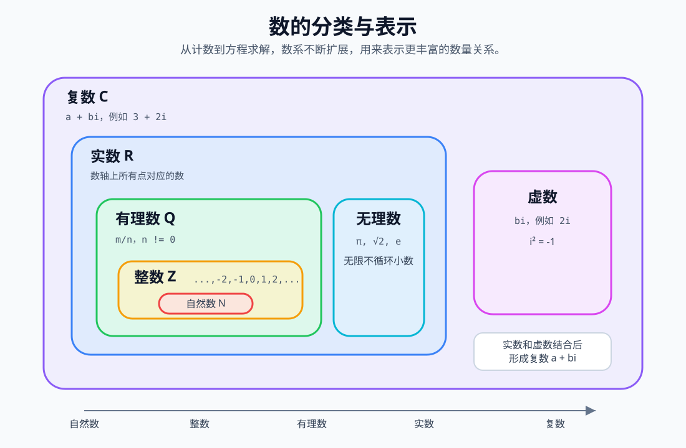

# 数的分类与表示

数是数学中最基础的对象，用来表示数量、顺序、大小、比例、变化和结构。人类最早使用数来计数，后来为了处理减法、分数、测量、方程和几何问题，逐步扩展出自然数、整数、有理数、无理数、实数、虚数和复数等不同类型。



理解各种数的关键，不是死记符号，而是理解一个问题为什么会迫使我们引入新的数。例如，自然数可以表示“有几个”，但不能完整表示 `3 - 5`；整数可以表示负数，但不能完整表示 `1 ÷ 2`；有理数可以表示分数，但不能精确表示 `√2`；实数可以表示数轴上的连续量，但不能在实数范围内解出 `x² + 1 = 0`。

## 1. 自然数

### 定义

自然数是最早用于计数的数，通常表示非负整数，也就是 `0, 1, 2, 3, ...`。在部分教材中，自然数也可能从 `1` 开始，是否包含 `0` 需要看具体约定。

### 表示符号

```text
N 或 ℕ
```

常见写法：

```text
N = {0, 1, 2, 3, ...}
```

如果需要强调正自然数，可以写作：

```text
N+ = {1, 2, 3, ...}
```

### 典型例子

```text
0, 1, 2, 3, 100
```

### 作用

- 表示数量，例如 `5 本书`。
- 表示顺序，例如 `第 1 名、第 2 名`。
- 是加法、乘法、计数、排列组合的起点。

### 拓展理解

自然数适合描述“有多少个”，但无法表达亏欠、方向相反或低于基准的情况。例如温度低于 `0°C`、账户欠款、海拔低于海平面，都需要引入负数。

## 2. 整数

### 定义

整数是在自然数基础上加入负数后形成的数，包括负整数、零和正整数。

### 表示符号

```text
Z 或 ℤ
```

常见写法：

```text
Z = {..., -3, -2, -1, 0, 1, 2, 3, ...}
```

### 典型例子

```text
-10, -1, 0, 1, 25
```

### 作用

- 表示相反方向的量，例如收入和支出、上升和下降。
- 表示相对于基准的变化，例如 `-5°C`。
- 让减法在更大范围内成立，例如 `3 - 5 = -2`。

### 拓展理解

整数解决了减法不封闭的问题。在自然数中，`3 - 5` 没有结果；在整数中，它有明确结果 `-2`。这说明数学中的数系扩展，往往是为了让某种运算更完整、更通用。

## 3. 有理数

### 定义

有理数是可以写成两个整数之比的数。若 `m` 和 `n` 都是整数，并且 `n ≠ 0`，那么 `m / n` 就是有理数。

### 表示符号

```text
Q 或 ℚ
```

常见写法：

```text
Q = {m / n | m, n ∈ Z, n ≠ 0}
```

### 典型例子

```text
1/2, -3/4, 0.25, 2, -6
```

整数也属于有理数，因为任何整数 `a` 都可以写成：

```text
a = a / 1
```

### 作用

- 表示分割后的数量，例如半个苹果 `1/2`。
- 表示比例和比值，例如 `3:4`。
- 表示有限小数和无限循环小数，例如 `0.5`、`0.333...`。

### 拓展理解

有理数解决了除法不封闭的问题。例如 `1 ÷ 2` 在整数中不能得到整数结果，但在有理数中可以表示为 `1/2`。不过，有理数仍然不能精确表示某些几何长度，例如边长为 `1` 的正方形对角线长度 `√2`。

## 4. 无理数

### 定义

无理数是不能写成两个整数之比的数。它的小数形式是无限不循环小数。

### 表示符号

无理数通常没有单独固定的集合符号，常写作：

```text
R \ Q
```

含义是：实数集合中去掉有理数后剩下的部分。

### 典型例子

```text
√2, √3, π, e
```

### 作用

- 表示几何中的精确长度，例如正方形对角线。
- 表示圆周率、自然常数等重要数学常数。
- 补充有理数无法覆盖的连续量。

### 公式示例

```text
边长为 1 的正方形，对角线长度为 √2
圆的周长 C = 2πr
自然指数函数 y = e^x
```

### 拓展理解

无理数的出现说明，数轴上并不只有分数。即使有理数非常密集，任意两个有理数之间还能找到新的有理数，但它们仍然不能填满整条数轴。无理数与有理数共同构成实数。

## 5. 实数

### 定义

实数是有理数和无理数的统称，可以理解为数轴上所有点对应的数。

### 表示符号

```text
R 或 ℝ
```

集合关系：

```text
R = Q ∪ (R \ Q)
```

也就是：

```text
实数 = 有理数 + 无理数
```

### 典型例子

```text
-3, 0, 1/2, 2.75, √2, π
```

### 作用

- 表示连续变化的量，例如长度、时间、速度、温度。
- 支撑函数、极限、微积分、解析几何等内容。
- 让数轴成为完整的连续模型。

### 拓展理解

实数适合描述现实世界中的连续量。测量长度、计算面积、研究速度变化，都离不开实数。不过，有些方程在实数范围内没有解，例如：

```text
x² + 1 = 0
```

因为任何实数的平方都不可能等于 `-1`。为了解决这类问题，需要引入虚数和复数。

## 6. 虚数

### 定义

虚数是包含虚数单位 `i` 的数，其中：

```text
i² = -1
```

也可以写成：

```text
i = √-1
```

形如 `bi` 的数称为纯虚数，其中 `b` 是实数且 `b ≠ 0`。

### 表示符号

虚数一般不单独用一个固定集合符号表示，常作为复数的一部分出现。

### 典型例子

```text
i, 2i, -5i, √3i
```

### 作用

- 解决实数范围内无法求解的方程，例如 `x² + 1 = 0`。
- 描述二维平面上的旋转和周期变化。
- 应用于电路分析、信号处理、控制理论、量子力学等领域。

### 拓展理解

虚数并不是“假的数”，而是一种扩展出来的数学对象。它不能直接放在普通数轴上，但可以和实数一起放在复平面中：横轴表示实部，纵轴表示虚部。

## 7. 复数

### 定义

复数是由实部和虚部组成的数，标准形式为：

```text
z = a + bi
```

其中：

- `a` 是实部。
- `b` 是虚部系数。
- `i` 是虚数单位，满足 `i² = -1`。

### 表示符号

```text
C 或 ℂ
```

常见写法：

```text
C = {a + bi | a, b ∈ R, i² = -1}
```

### 典型例子

```text
3 + 2i, -1 + 5i, 4 - i, 7
```

其中，实数也可以看作虚部为 `0` 的复数：

```text
7 = 7 + 0i
```

### 作用

- 让多项式方程的解更加完整。
- 表示二维平面上的点和向量。
- 描述振动、波、旋转、电磁信号等周期性现象。

### 拓展理解

复数把数从一维数轴扩展到二维平面。实数只能表示一条线上的位置，而复数可以表示平面上的位置、长度和旋转角度。在高等数学、工程学和物理学中，复数是非常重要的工具。

## 数系之间的包含关系

从浅到深，常见数系之间有如下关系：

```text
N ⊂ Z ⊂ Q ⊂ R ⊂ C
```

含义是：

- 自然数属于整数。
- 整数属于有理数。
- 有理数属于实数。
- 实数属于复数。

需要注意的是，无理数也属于实数，但不属于有理数：

```text
无理数 ⊂ R
无理数 ∩ Q = ∅
```

## 常见数字表示方式

### 十进制表示

日常生活中最常用的是十进制，使用 `0` 到 `9` 十个数字符号。

```text
2026, 3.14, -15
```

### 分数表示

分数用于表示整体的一部分或两个量之间的比。

```text
1/2, 3/4, -7/5
```

### 小数表示

小数可以分为有限小数、无限循环小数和无限不循环小数。

```text
0.5        有限小数，属于有理数
0.333...   无限循环小数，属于有理数
3.14159... 无限不循环小数，属于无理数
```

### 科学计数法

科学计数法用于表示特别大或特别小的数。

```text
6.02 × 10^23
1.6 × 10^-19
```

### 集合符号表示

数学中常用集合符号统一表达一类数：

```text
N  自然数
Z  整数
Q  有理数
R  实数
C  复数
```

## 学习顺序建议

学习各种数时，可以按问题驱动理解：

```text
计数问题        -> 自然数
减法不够用      -> 整数
除法不够用      -> 有理数
几何长度不够用  -> 无理数
连续量建模      -> 实数
方程求解不够用  -> 虚数与复数
```

这种扩展路线说明：新的数不是凭空发明的，而是为了让数学能表达更多问题、保持运算规则统一，并建立更完整的理论体系。
