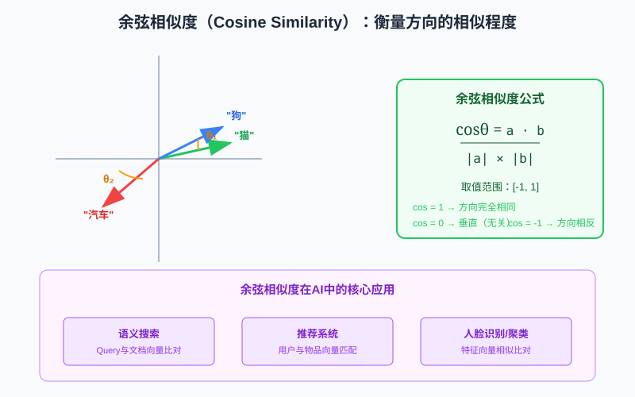

# 线性代数：AI 的数学基石

线性代数是人工智能、机器学习、深度学习最核心的数学基础。如果说编程是AI的"语言"，那么线性代数就是AI的"语法"——所有前沿模型（CNN、RNN、Transformer、大语言模型、Diffusion扩散模型）的底层运算，本质上都是向量和矩阵的线性变换。

## 文章导航

本目录下包含线性代数的系列专题文章：

| 文章 | 内容简介 | 难度 |
|------|----------|------|
| [向量：从几何箭头到AI数据表示](向量.md) | 从四种视角理解向量，详解向量运算（加法、数乘、点积、投影）、基与线性组合，包含Python/NumPy代码实战和6大AI应用场景 | ⭐⭐ 基础→进阶 |

---

## 快速概览

本文用最直观的方式讲解线性代数的五大核心概念：**向量、维度、矩阵乘法、点积、余弦相似度**，并重点说明每个知识点在AI中的具体作用。

> 💡 推荐先阅读专题文章 [向量.md](向量.md) 进行深入系统学习，再阅读本概览进行知识串联。

---

## 一、向量（Vector）：AI世界的"原子"

向量是一组有序排列的数字，表示一个有方向和大小的量。

向量是AI表示一切数据的基本方式：

| AI场景 | 向量表示 | 维度 |
|--------|----------|------|
| 词向量（Word Embedding） | 每个词用一个向量表示 | 128 ~ 4096维 |
| 图像特征 | 一张图片/一个区域用向量表示 | 512 ~ 2048维 |
| Transformer隐藏状态 | Token的语义表示 | 4096 ~ 12288维 |

在词向量空间中，语义相近的词，它们的向量在方向上也接近：`"国王" - "男人" + "女人" ≈ "女王"`

---

## 二、维度（Dimension）：描述世界的"特征数"

维度就是描述一个事物需要用多少个数字。

| 应用场景 | 典型维度 | 维度高低的影响 |
|----------|----------|----------------|
| 词向量 | 128 / 256 / 768 / 1536 | 维度太低→信息丢失；太高→计算慢、过拟合 |
| LLM隐藏层 | 4096(GPT-2) / 5120(GPT-3) / 12288(GPT-4) | 更高维度→更强表达能力→更大模型 |

---

## 三、矩阵与矩阵乘法：AI的"计算引擎"

矩阵就是按行和列排列的数字表格，可以看作"向量的组合"。矩阵乘法规则：**行乘列，点积求和**。

矩阵乘法是神经网络中最频繁、计算量最大的运算：

| AI组件 | 矩阵乘法的作用 | 公式 |
|--------|----------------|------|
| 全连接层（Dense/Linear） | 特征变换、维度升降 | Y = XW + b |
| 注意力机制（QKV） | 计算Query与Key的相似度 | Attention = Q × Kᵀ |

GPU就是为矩阵乘法优化的硬件！

---

## 四、点积（Dot Product）：AI的"匹配计分器"

点积是两个向量之间最基础的运算：**对应位置相乘，再全部加起来**，结果是一个标量。

几何意义：`a · b = |a| × |b| × cosθ`

点积结果越大，说明两个向量方向越一致！Transformer的核心——缩放点积注意力：`Attention(Q, K, V) = softmax(Q·Kᵀ / √dₖ) · V`

---

## 五、余弦相似度（Cosine Similarity）：衡量"方向有多像"

余弦相似度用两个向量夹角的余弦值来衡量它们的相似程度，是点积的"归一化版本"。

公式：`cosθ = (a·b) / (|a| × |b|)`，取值范围 **[-1, 1]**。

余弦相似度是向量检索、匹配、聚类的标配工具，广泛应用于RAG检索、语义搜索、推荐系统、人脸识别等场景。向量数据库的核心能力就是高效做余弦相似度Top-K检索。

---

## 术语对照表

| 中文术语 | 英文术语 | 符号 | AI中的核心用途 |
|----------|----------|------|----------------|
| 向量 | Vector | v, x, a | 数据表示（词、图、特征） |
| 维度 | Dimension | n, d | 特征数量/模型容量 |
| 矩阵 | Matrix | A, W, Q, K, V | 权重、线性变换 |
| 矩阵乘法 | Matrix Multiplication | A×B, AB | 全连接层、注意力、特征变换 |
| 点积 | Dot Product / Inner Product | a·b, ⟨a,b⟩, aᵀb | 匹配计分、注意力分数 |
| 余弦相似度 | Cosine Similarity | cosθ, cos_sim | 相似性检索、匹配、聚类 |

---

## 总结：线性代数为什么是AI的基础

线性代数之所以是AI的数学基石，可以用三句话总结：

1. **万物皆向量**：在AI眼中，文字、图片、语音、用户行为——一切都可以编码为向量。
2. **变换靠矩阵**：神经网络层与层之间的信息传递，本质上是矩阵乘法做线性变换（再加非线性激活）。
3. **匹配算点积**：计算"相关程度"、"注意力权重"、"相似度"——所有"匹配"逻辑的底层都是点积/余弦相似度。

如果你想系统深入学习向量，请阅读专题文章：[向量：从几何箭头到AI数据表示](向量.md)
