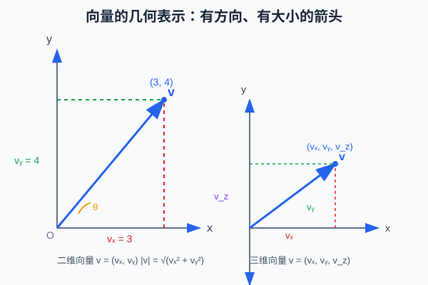
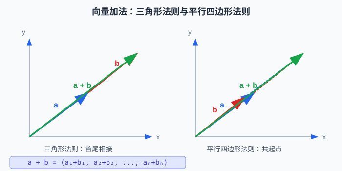
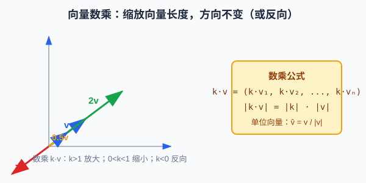
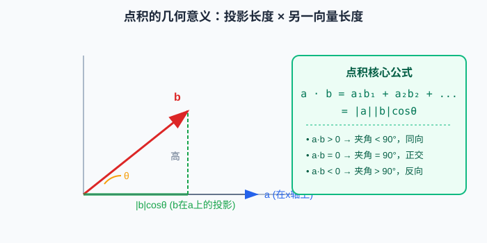
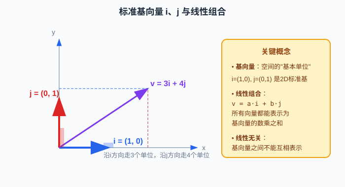
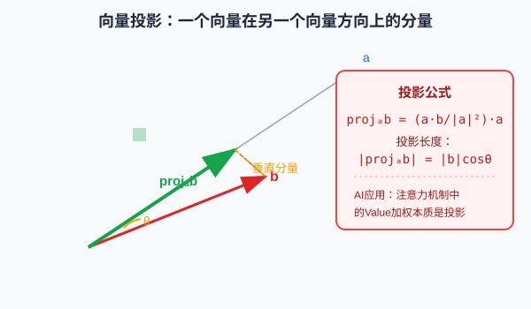
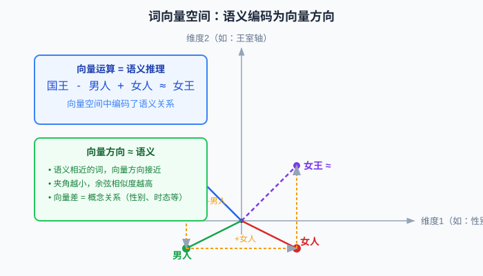

# 向量（Vector）：从几何箭头到 AI 数据表示

向量是线性代数最基础、最核心的概念，也是人工智能时代描述一切数据的"通用语言"。从词向量到图像特征，从 Transformer 的注意力机制到 RAG 的相似度检索——所有 AI 应用的底层，都是向量在运算。

本文将从**几何直觉**到**代数定义**，从**基本运算**到**AI 实战**，系统讲解向量的完整知识体系，让你不仅"知道向量是什么"，更能"理解向量为什么重要、怎么用"。



---

## 目录

1. [什么是向量：四种视角理解](#一什么是向量四种视角理解)
2. [向量的基本属性](#二向量的基本属性)
3. [向量运算：从几何到代数](#三向量运算从几何到代数)
4. [核心进阶概念](#四核心进阶概念)
5. [编程实战：Python/NumPy 向量操作](#五编程实战pythonnumpy-向量操作)
6. [AI 中的向量：实际应用场景](#六ai-中的向量实际应用场景)
7. [术语对照表](#七术语对照表)
8. [附录：NumPy 向量操作函数详解](#八附录numpy-向量操作函数详解)

---

## 一、什么是向量：四种视角理解

"向量"这个概念在不同领域有不同的表现形式，但本质是同一个东西。理解这四种视角，你就掌握了向量的精髓。

### 1.1 几何视角：带箭头的线段

这是最直观的理解：**向量是一个有方向、有长度的箭头**。

- 起点不重要，**方向和长度**才重要。一个向量可以在空间中自由平移，只要方向和长度不变，它就是同一个向量。
- 在二维平面中，向量用 `(x, y)` 表示；在三维空间中用 `(x, y, z)` 表示。

```text
二维向量 v = (3, 4)
→ 从原点出发，向右走 3，向上走 4

三维向量 v = (1, 2, 3)
→ 从原点出发，沿 x 走 1，沿 y 走 2，沿 z 走 3
```

### 1.2 物理视角：有方向的物理量

物理学中，很多量不仅有大小还有方向：

| 物理量 | 标量（只有大小） | 向量（大小+方向） |
|--------|------------------|-------------------|
| 例子 | 温度、质量、时间、速率 | 位移、速度、加速度、力 |
| 表示 | 一个数字 | 带箭头的线段 |

例如：
- "车开了 60km/h"——这是**速率**（标量）
- "车以 60km/h **向北**开"——这是**速度**（向量）

### 1.3 代数视角：有序数字列表

数学家把向量抽象为：**一组有序排列的数字**。

```text
n 维向量 v = (v₁, v₂, v₃, ..., vₙ)
```

- 每个数字 `vᵢ` 称为向量的一个**分量**（component）或**坐标**（coordinate）
- `n` 称为向量的**维度**（dimension）
- 分量的**顺序很重要**：`(1, 2)` 和 `(2, 1)` 是不同的向量

这是计算机科学中最常用的定义——在代码里，向量就是一个数组/列表。

### 1.4 计算机/AI 视角：数据的特征表示

在 AI 中，向量是**表示一切事物的通用格式**：

| 事物 | 如何表示为向量 | 典型维度 |
|------|----------------|----------|
| 一个词 | 词向量（Word Embedding） | 128 ~ 4096 |
| 一张图片 | CNN 提取的特征向量 | 512 ~ 2048 |
| 一个用户 | 用户画像向量 | 64 ~ 512 |
| 一句话 | BERT/GPT 输出的句向量 | 768 ~ 4096 |
| 一个商品 | 推荐系统中的物品向量 | 64 ~ 256 |

> **关键洞察**：在 AI 看来，世界上的一切都是高维空间中的一个点（向量）。语义相近的事物，它们的向量在空间中距离也近。

---

## 二、向量的基本属性

### 2.1 模长（Magnitude / Norm）：向量的长度

模长（也叫范数）是向量的大小/长度，记作 `|v|` 或 `‖v‖`。

**计算公式（勾股定理的推广）**：

```text
对于二维向量 v = (v₁, v₂):
|v| = √(v₁² + v₂²)

对于 n 维向量 v = (v₁, v₂, ..., vₙ):
|v| = √(v₁² + v₂² + ... + vₙ²)
```

**计算示例**：

```text
v = (3, 4)
|v| = √(3² + 4²) = √(9 + 16) = √25 = 5

v = (1, 2, 2)
|v| = √(1² + 2² + 2²) = √(1 + 4 + 4) = √9 = 3
```

### 2.2 方向（Direction）

方向由向量各分量的比例决定，与长度无关。两个向量方向相同当且仅当其中一个是另一个的正数倍。

例如 `(1, 2)` 和 `(2, 4)` 和 `(0.5, 1)` 方向都相同。

### 2.3 单位向量（Unit Vector）：长度为 1 的向量

模长为 1 的向量称为**单位向量**，用于纯粹表示方向。

任何非零向量都可以通过**归一化**（normalize）变成单位向量：

```text
v̂ = v / |v|
```

即：把向量的每个分量除以它的模长。

**计算示例**：

```text
v = (3, 4)，|v| = 5
v̂ = (3/5, 4/5) = (0.6, 0.8)
|v̂| = √(0.6² + 0.8²) = √(0.36 + 0.64) = √1 = 1 ✓
```

在余弦相似度计算中，我们经常需要先把向量归一化，因为我们关心的是方向是否一致，而不是长度。

### 2.4 零向量（Zero Vector）

所有分量都是 0 的向量 `(0, 0, ..., 0)` 称为零向量，记作 `0` 或 `0⃗`。

- 零向量的模长为 0
- 零向量没有确定的方向
- 零向量是向量加法的单位元：`v + 0 = v`

---

## 三、向量运算：从几何到代数

向量不是孤立的数字列表，它们之间可以进行丰富的运算。

### 3.1 向量加法：首尾相接

两个向量相加，就是**对应分量分别相加**：

```text
a + b = (a₁ + b₁, a₂ + b₂, ..., aₙ + bₙ)
```

**几何意义**：有两种等价的理解方式：



1. **三角形法则**：把向量 `b` 的起点移到向量 `a` 的终点，然后从 `a` 的起点画到 `b` 的终点，就是 `a+b`。
2. **平行四边形法则**：把 `a` 和 `b` 起点放在一起，以它们为邻边作平行四边形，对角线就是 `a+b`。

**运算性质**：
- 交换律：`a + b = b + a`
- 结合律：`(a + b) + c = a + (b + c)`
- 单位元：`a + 0 = a`

**计算示例**：

```text
a = (1, 2)，b = (3, -1)
a + b = (1+3, 2+(-1)) = (4, 1)
```

### 3.2 向量减法：加上相反向量

向量减法 `a - b` 等于 `a + (-b)`，其中 `-b` 是 `b` 的相反向量（所有分量取负）。

代数上同样是对应分量相减：

```text
a - b = (a₁ - b₁, a₂ - b₂, ..., aₙ - bₙ)
```

几何意义：`a - b` 是从 `b` 的终点指向 `a` 的终点的向量。

### 3.3 数乘（Scalar Multiplication）：缩放向量

向量与一个数字（标量）相乘，就是把每个分量都乘以这个数字：

```text
k · v = (k·v₁, k·v₂, ..., k·vₙ)
```



**数乘的几何效果**：
- 当 `k > 1` 时：向量**变长**（放大），方向不变
- 当 `0 < k < 1` 时：向量**变短**（缩小），方向不变
- 当 `k = -1` 时：向量长度不变，**方向相反**
- 当 `k < 0` 时：向量反向缩放

**数乘的模长性质**：

```text
|k·v| = |k| · |v|
```

**计算示例**：

```text
v = (2, -1)
3v = (6, -3)
-0.5v = (-1, 0.5)
```

### 3.4 点积（Dot Product / Inner Product）：向量的乘法

点积是两个向量之间最重要的运算，结果是一个**标量**（单个数字）。

**代数定义**：对应位置相乘，再全部加起来。

```text
a · b = a₁b₁ + a₂b₂ + ... + aₙbₙ = Σ aᵢbᵢ
```



**几何意义**：点积与两个向量的夹角有关：

```text
a · b = |a| × |b| × cosθ
```

其中 `θ` 是两个向量之间的夹角（0° ≤ θ ≤ 180°）。

这个公式极其重要，它告诉我们点积衡量的是两个向量**方向上的一致性**：

| 点积结果 | 夹角范围 | 几何含义 | 直觉理解 |
|----------|----------|----------|----------|
| `a·b > 0` | θ < 90° | 夹角是锐角 | 两个向量方向大致相同 |
| `a·b = 0` | θ = 90° | 夹角是直角 | 两个向量**垂直/正交**，方向完全无关 |
| `a·b < 0` | θ > 90° | 夹角是钝角 | 两个向量方向大致相反 |

**点积越大，两个向量方向越一致！**

**计算示例**：

```text
a = (3, 4)，b = (4, 3)
a·b = 3×4 + 4×3 = 12 + 12 = 24

|a| = 5，|b| = 5
cosθ = 24/(5×5) = 24/25 = 0.96
θ ≈ 16.3°（方向很接近）
```

**点积的重要性质**：
- 交换律：`a·b = b·a`
- 分配律：`a·(b + c) = a·b + a·c`
- 与数乘兼容：`(ka)·b = k(a·b) = a·(kb)`
- 自身点积：`a·a = |a|²`（向量模长的平方等于自身点积）

### 3.5 叉积（Cross Product）：二维/三维专用

叉积是三维向量特有的运算（二维可以看作三维的特例），结果是一个**新的向量**，这个向量与原来两个向量都垂直。

```text
对于三维向量 a = (a₁, a₂, a₃), b = (b₁, b₂, b₃):
a × b = (a₂b₃ - a₃b₂, a₃b₁ - a₁b₃, a₁b₂ - a₂b₁)
```

叉积的方向由**右手定则**确定：右手四指从 `a` 转到 `b`，大拇指指向就是 `a×b` 的方向。

叉积的模长：

```text
|a × b| = |a||b|sinθ
```

几何意义：叉积的模长等于以 `a` 和 `b` 为邻边的**平行四边形面积**。

> **注意**：AI 中最常用的是点积，叉积在计算机图形学（如计算法向量）中更常用。本文重点讲解 AI 相关知识，叉积了解即可。

---

## 四、核心进阶概念

掌握了基本运算后，这些进阶概念是理解线性代数（以及 AI 模型）的关键。

### 4.1 线性组合（Linear Combination）

给定向量 `v₁, v₂, ..., vₖ` 和标量 `c₁, c₂, ..., cₖ`，向量：

```text
c₁v₁ + c₂v₂ + ... + cₖvₖ
```

称为这组向量的一个**线性组合**。

简单说：线性组合就是"数乘后相加"——这是向量空间中最基本的构造方式。

### 4.2 基向量（Basis Vectors）：空间的"坐标轴"

**基**是一组特殊的向量，空间中的**任何向量**都可以唯一表示为它们的线性组合。基向量就像空间的"基本建筑块"。

二维平面最常用的是**标准基**（Standard Basis）：

```text
i = (1, 0)  → 沿 x 轴方向的单位向量
j = (0, 1)  → 沿 y 轴方向的单位向量
```



任何二维向量都能写成 `i` 和 `j` 的线性组合：

```text
v = (3, 4) = 3i + 4j = 3(1,0) + 4(0,1)
```

这就是坐标的本质：坐标 `(3, 4)` 表示"用 3 个 `i` 和 4 个 `j` 组合出这个向量"。

同理，三维标准基是 `i=(1,0,0), j=(0,1,0), k=(0,0,1)`。

> **AI 视角**：Embedding 层的本质就是学习一组"基"，让每个词/图片都能表示为这组基的线性组合。Transformer 中的各种投影，就是在不同的基之间变换。

### 4.3 线性无关（Linear Independence）

一组向量 `v₁, ..., vₖ` 是**线性无关**的，如果其中任何一个向量都**不能**表示为其他向量的线性组合。

- 二维平面中，两个不共线的向量是线性无关的（可以作基）
- 如果两个向量共线（方向相同或相反），它们是线性相关的

基向量必须是线性无关的，否则就有"冗余"。

### 4.4 正交（Orthogonal）与标准正交基

两个向量**正交**就是它们的点积为 0（互相垂直）：

```text
a ⊥ b  ⟺  a·b = 0
```

如果一组基向量两两正交，且每个都是单位向量，就称为**标准正交基**（Orthonormal Basis）。

标准基 `i, j, k` 就是标准正交基。

正交基有很多优良性质（计算简单、数值稳定），所以在 AI 中非常重要：
- PCA 主成分分析得到的主成分是正交的
- 正交矩阵保持向量长度不变（旋转变换）

### 4.5 投影（Projection）：一个向量在另一个向量上的"影子"

向量 `b` 在向量 `a` 上的投影，想象成一束垂直于 `a` 的平行光照射下，`b` 在 `a` 方向上投下的影子。



投影向量公式：

```text
projₐb = (a·b / |a|²) · a
```

投影长度（标量）：

```text
|projₐb| = |b|cosθ = (a·b) / |a|
```

> **AI 中的投影**：Transformer 注意力机制中，Value 的加权求和本质上就是投影——把 Query 投影到 Key 方向上得到权重，再对 Value 加权。理解了投影，你就理解了注意力的几何本质。

---

## 五、编程实战：Python/NumPy 向量操作

理论结合代码，让我们看看如何用 Python 和 NumPy 实际操作向量。

### 5.1 创建向量

```python
import numpy as np

# 用列表创建向量
v = np.array([1, 2, 3])
print(v)        # [1 2 3]
print(v.shape)  # (3,) → 表示这是长度为3的一维向量

# 创建特殊向量
zeros = np.zeros(5)       # 零向量: [0. 0. 0. 0. 0.]
ones = np.ones(4)         # 全1向量: [1. 1. 1. 1.]
unit = np.array([3, 4])
unit_vec = unit / np.linalg.norm(unit)  # 归一化为单位向量
```

### 5.2 向量基本运算

```python
a = np.array([1, 2, 3])
b = np.array([4, 5, 6])

# 向量加法
print(a + b)          # [5 7 9]

# 向量减法
print(a - b)          # [-3 -3 -3]

# 数乘
print(2 * a)          # [2 4 6]
print(-0.5 * a)       # [-0.5 -1.  -1.5]

# 点积（三种方式）
dot1 = np.dot(a, b)               # 32
dot2 = a @ b                       # 32 (Python 3.5+ 矩阵乘法运算符)
dot3 = np.sum(a * b)              # 32（对应相乘再求和）
print(dot1, dot2, dot3)           # 32 32 32

# 模长（范数）
norm_a = np.linalg.norm(a)
print(norm_a)                      # √(1+4+9) = √14 ≈ 3.7417

# 归一化（得到单位向量）
a_normalized = a / np.linalg.norm(a)
print(a_normalized)                # [0.267..., 0.534..., 0.801...]
print(np.linalg.norm(a_normalized)) # 1.0
```

### 5.3 计算夹角与余弦相似度

```python
def cosine_similarity(a, b):
    """计算两个向量的余弦相似度"""
    dot = np.dot(a, b)
    norm_a = np.linalg.norm(a)
    norm_b = np.linalg.norm(b)
    return dot / (norm_a * norm_b)

# 示例
v1 = np.array([1, 0])
v2 = np.array([0, 1])
v3 = np.array([1, 1])
v4 = np.array([2, 0])

print(cosine_similarity(v1, v2))  # 0.0 (正交，完全无关)
print(cosine_similarity(v1, v4))  # 1.0 (方向完全相同)
print(cosine_similarity(v1, v3))  # ≈0.707 (夹角45度)
```

### 5.4 投影计算

```python
def project(b, a):
    """计算 b 在 a 上的投影向量"""
    return (np.dot(a, b) / np.dot(a, a)) * a

a = np.array([2, 0])  # 沿x轴
b = np.array([1, 1])
proj = project(b, a)
print(proj)  # [1. 0.] → b在a上的投影确实是(1,0)
```

---

## 六、AI 中的向量：实际应用场景

向量在 AI 中无处不在。以下是最核心的几个应用场景，帮你建立直觉。

### 6.1 词向量（Word Embedding）：词语的向量化

NLP 中最基础的操作：把每个词映射成一个高维向量（如 768 维）。



**核心思想**：语义相近的词，它们的向量在空间中距离近、方向相似。

经典例子：向量运算可以捕捉语义关系：

```text
国王 - 男人 + 女人 ≈ 女王
北京 - 中国 + 法国 ≈ 巴黎
跑 - 走 + 走（过去式）≈ 跑（过去式）
```

这说明向量空间中编码了丰富的语义和语法关系！

常见词向量模型：
- Word2Vec（2013）：经典预测式词向量
- GloVe（2014）：基于全局词频统计
- BERT（2018）：上下文相关词向量（同一个词在不同语境下向量不同）

### 6.2 特征向量（Feature Vector）：一切数据的表示

机器学习模型的输入必须是数值型向量。把原始数据转化为向量的过程叫**特征提取**：

| 原始数据 | 如何变成向量 |
|----------|--------------|
| 一张图片 | CNN 最后一层输出（如 2048 维），或直接展平像素 |
| 一段文本 | 用词袋模型、TF-IDF、或 BERT 句向量 |
| 音频信号 | 提取 MFCC 特征、或用 Whisper 编码 |
| 用户行为 | 统计点击、浏览、购买等行为，拼成向量 |
| 图结构数据 | 用 Graph Neural Network 得到节点嵌入 |

> **关键洞察**：AI 模型（神经网络）的本质就是一个**向量变换函数**：输入一个向量，经过层层变换，输出另一个向量（分类结果、生成的词等）。

### 6.3 Transformer 注意力机制中的向量

Transformer（GPT、BERT 的核心架构）中到处是向量运算：

1. **Q、K、V 向量**：每个 Token 被投影成三个向量——Query（我在找什么）、Key（我是什么）、Value（我的内容）。
2. **注意力分数 = Q·Kᵀ**：Query 和所有 Key 做点积，计算"我应该关注谁"的分数。
3. **Softmax 归一化**：把分数转成权重（和为 1）。
4. **加权求和 = Attention 输出**：权重乘以对应的 Value 向量再相加。

```text
Attention(Q, K, V) = softmax(Q·Kᵀ / √dₖ) · V
```

整个过程完全是向量点积和线性组合！理解了向量运算，你就理解了注意力机制的 80%。

### 6.4 RAG 检索：向量相似度匹配

RAG（检索增强生成）是当前大模型应用最火的范式之一，其核心就是向量检索：

```text
┌──────────────┐     ┌──────────────┐     ┌──────────────┐
│ 用户问题      │────→│ 编码为向量 q │────→│ 与知识库中所有│
│ "什么是向量？"│     │    (768维)   │     │ 文档向量比对  │
└──────────────┘     └──────────────┘     └──────┬───────┘
                                                  │
                    ┌──────────────┐     ┌────────▼───────┐
                    │ 送给大模型    │←────│ 取Top-K最相似  │
                    │ 生成回答      │     │ 的文档片段     │
                    └──────────────┘     └────────────────┘
```

这里的"比对"就是用**余弦相似度**计算查询向量和文档向量的相似程度。向量数据库（FAISS、Milvus、Pinecone、Chroma）的核心能力就是高效地在百万/亿级向量中做最近邻检索。

### 6.5 推荐系统：用户向量与物品向量匹配

现代推荐系统（如抖音、淘宝、Netflix）大量使用向量召回：

1. 每个用户学习一个**用户向量** `u`（表示用户兴趣）
2. 每个物品学习一个**物品向量** `v`（表示物品特征）
3. 预测用户对物品的兴趣分数：`score = u·v`（点积）或 `cos(u, v)`（余弦相似度）
4. 取分数最高的 Top-N 个物品推荐给用户

你刷抖音时看到的每一条视频，背后都有向量相似度计算在发挥作用！

### 6.6 人脸识别与图像检索

人脸识别同样是向量比对：

1. 用 CNN（如 FaceNet）把每张人脸图片编码为 128/256/512 维特征向量
2. 比对时，计算两张人脸向量的余弦相似度（或 L2 距离）
3. 相似度超过阈值（如 0.7）就判定为同一人

同一张脸的不同照片，向量方向应该非常接近；不同人的脸，向量方向应该差异很大。

---

## 七、术语对照表

| 中文术语 | 英文术语 | 常用符号 | 简要说明 |
|----------|----------|----------|----------|
| 向量 | Vector | v, x, a, b | 有序数字列表，表示方向和大小 |
| 标量 | Scalar | k, c, α, β | 单个数字，只有大小没有方向 |
| 分量/坐标 | Component / Coordinate | vᵢ, xᵢ | 向量中的每个数字 |
| 维度 | Dimension | n, d | 向量中分量的个数 |
| 模长/范数 | Magnitude / Norm | \|v\|, ‖v‖ | 向量的长度 |
| 点积/内积 | Dot Product / Inner Product | a·b, ⟨a,b⟩, aᵀb | 对应相乘求和，结果为标量 |
| 叉积/外积 | Cross Product | a × b | 三维专用，结果为向量 |
| 单位向量 | Unit Vector | v̂, ê | 模长为1的向量，表示方向 |
| 零向量 | Zero Vector | 0, 0⃗ | 所有分量为0的向量 |
| 归一化 | Normalization | v / \|v\| | 将向量缩放为单位向量 |
| 线性组合 | Linear Combination | Σcᵢvᵢ | 数乘后相加 |
| 基 | Basis | {e₁, ..., eₙ} | 可以表示空间中所有向量的一组线性无关向量 |
| 标准基 | Standard Basis | i, j, k / e₁, e₂,... | (1,0,...0), (0,1,...0), ... |
| 线性无关 | Linear Independence | — | 没有向量能被其他向量线性表示 |
| 正交 | Orthogonal | ⊥ | 点积为0（垂直） |
| 标准正交基 | Orthonormal Basis | — | 两两正交且都是单位向量的基 |
| 投影 | Projection | projₐb | 一个向量在另一个向量方向上的分量 |
| 余弦相似度 | Cosine Similarity | cosθ, cos_sim | 归一化后的点积，衡量方向相似性 |
| 词向量 | Word Embedding | — | 词语的向量表示 |
| 特征向量 | Feature Vector | — | 表示数据特征的向量 |

---

## 八、附录：NumPy 向量操作函数详解

以下是本文代码示例中涉及的 NumPy 函数，按用途分类详解。

### 8.1 向量创建

| 函数 | 作用 | 示例 | 注意事项 |
|------|------|------|----------|
| `np.array(list)` | 从列表创建向量 | `np.array([1,2,3])` | 最常用的创建方式 |
| `np.zeros(n)` | 创建n维零向量 | `np.zeros(5)` → `[0,0,0,0,0]` | 常用于初始化 |
| `np.ones(n)` | 创建n维全1向量 | `np.ones(3)` → `[1,1,1]` | 常用于偏置初始化 |
| `np.arange(start,stop,step)` | 创建等差序列 | `np.arange(0,10,2)` → `[0,2,4,6,8]` | 浮点步长可能有精度误差 |
| `np.linspace(start,stop,num)` | 创建均匀间隔的向量 | `np.linspace(0,1,5)` → `[0,0.25,0.5,0.75,1]` | 包含端点，适合画图 |
| `np.random.randn(n)` | 创建n维标准正态分布随机向量 | `np.random.randn(3)` | 均值0，方差1 |

### 8.2 向量运算

| 函数 | 作用 | 示例 | 说明 |
|------|------|------|------|
| `a + b` / `np.add(a,b)` | 向量加法 | `[1,2]+[3,4]` → `[4,6]` | 对应元素相加，形状必须相同 |
| `a - b` / `np.subtract(a,b)` | 向量减法 | `[3,4]-[1,2]` → `[2,2]` | 对应元素相减 |
| `k * a` / `np.multiply(k,a)` | 数乘 | `2*[1,2,3]` → `[2,4,6]` | 每个元素乘以标量 |
| `a * b` | 逐元素乘法（Hadamard积） | `[1,2]*[3,4]` → `[3,8]` | 注意不是点积！形状必须相同 |
| `np.dot(a,b)` / `a @ b` | 点积（内积） | `np.dot([1,2],[3,4])` → `11` | 结果是标量 |
| `np.linalg.norm(v)` | 向量范数（默认L2范数即模长） | `np.linalg.norm([3,4])` → `5` | `ord=1`是L1范数，`ord=2`是L2范数 |
| `v / np.linalg.norm(v)` | 归一化为单位向量 | 见示例 | 零向量不能归一化 |

### 8.3 统计与聚合

| 函数 | 作用 | 说明 |
|------|------|------|
| `np.sum(v)` | 所有分量求和 | 点积本质是先逐元素乘再sum |
| `np.mean(v)` / `v.mean()` | 平均值 | 所有分量求平均 |
| `np.max(v)` / `v.max()` | 最大值 | 返回分量中的最大值 |
| `np.min(v)` / `v.min()` | 最小值 | 返回分量中的最小值 |
| `np.argmax(v)` | 最大值位置索引 | Softmax后取argmax得到分类结果 |
| `np.argmin(v)` | 最小值位置索引 | — |
| `np.dot(a,a)` | 自身点积 = 模长平方 | 等于`np.linalg.norm(a)**2` |

### 8.4 角度与距离

| 函数/公式 | 作用 | 说明 |
|-----------|------|------|
| `np.dot(a,b)/(norm(a)*norm(b))` | 余弦相似度 | 取值范围[-1,1]，1最相似 |
| `np.linalg.norm(a - b)` | L2距离（欧氏距离） | 两个向量端点的直线距离 |
| `np.sum(np.abs(a - b))` | L1距离（曼哈顿距离） | 各分量差的绝对值之和 |
| `np.arccos(cos_sim)` | 反余弦得到夹角（弧度） | 可用`np.degrees`转角度 |

### 8.5 常用代码片段

```python
import numpy as np

def cosine_similarity(a, b):
    """计算两个向量的余弦相似度"""
    return np.dot(a, b) / (np.linalg.norm(a) * np.linalg.norm(b))

def euclidean_distance(a, b):
    """计算两个向量的欧氏距离"""
    return np.linalg.norm(a - b)

def normalize(v):
    """归一化为单位向量"""
    norm = np.linalg.norm(v)
    return v / norm if norm > 1e-10 else v  # 避免除以零

def softmax(scores):
    """Softmax：把分数转为概率分布（和为1）"""
    exp = np.exp(scores - np.max(scores))  # 减去最大值防止溢出
    return exp / exp.sum()
```

---

## 总结

向量是线性代数的基石，也是 AI 的"原子"。回顾本文核心要点：

1. **四种视角理解向量**：几何上是箭头，物理上是有方向的量，代数上是有序数组，计算机中是数据表示。
2. **核心运算**：加法（首尾相接）、数乘（缩放）、点积（衡量方向一致性）是最基础的三个运算。
3. **关键概念**：基向量是空间的坐标轴，线性组合是构造向量的基本方式，投影是理解注意力的几何关键。
4. **AI 实战**：词向量、特征向量、QKV 注意力、RAG 检索、推荐系统——所有这些的底层都是向量运算。

当你真正理解了向量，再去看神经网络、Transformer、RAG 等 AI 技术时，你看到的不再是一堆神秘的公式，而是一个个向量在空间中变换、投影、计算相似度——一切都变得清晰而直观。
