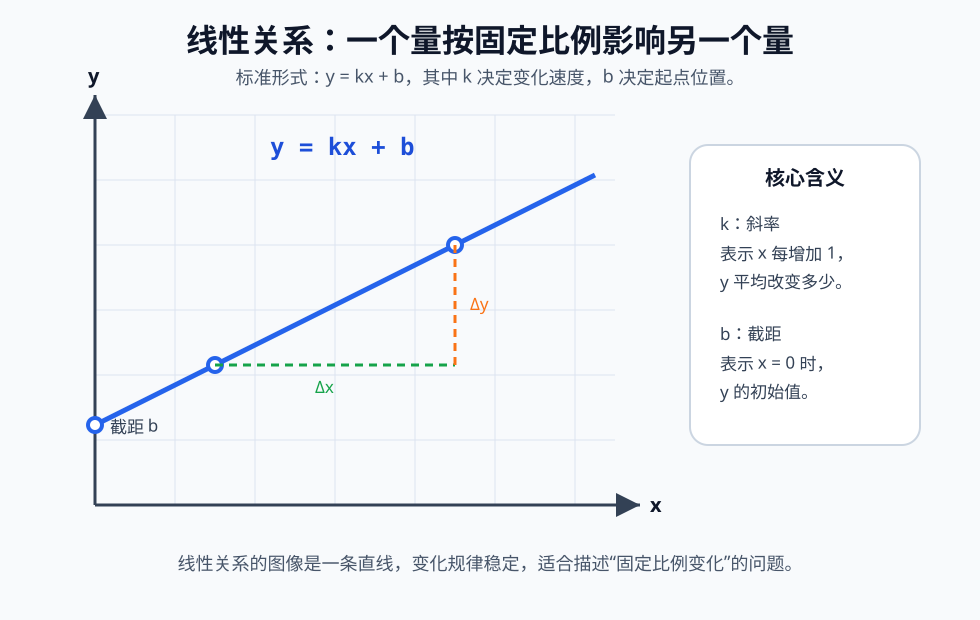

# 什么是线性关系

线性关系是指两个变量之间按照固定比例变化的关系。简单说，当一个量 `x` 每增加固定的数值时，另一个量 `y` 也会按照固定的规律增加或减少，这种关系就叫线性关系。



线性关系最常见的表达形式是一次函数：

```text
y = kx + b
```

其中：

- `x`：自变量，表示主动变化的量。
- `y`：因变量，表示随着 `x` 改变而改变的量。
- `k`：斜率，表示变化速度。
- `b`：截距，表示 `x = 0` 时 `y` 的值。

## 直观理解

线性关系可以理解为“稳定变化”。例如：

```text
每买 1 支笔花 2 元。
买 1 支笔花 2 元。
买 2 支笔花 4 元。
买 3 支笔花 6 元。
```

这里笔的数量是 `x`，总价是 `y`，每增加 1 支笔，总价都固定增加 2 元，因此它们之间是线性关系：

```text
y = 2x
```

如果再加上固定包装费 3 元，那么关系变成：

```text
y = 2x + 3
```

这仍然是线性关系，因为每多买 1 支笔，总价仍然固定增加 2 元。

## 线性关系的标准公式

线性关系通常写作：

```text
y = kx + b
```

这个公式由两部分组成：

```text
kx：随 x 变化的部分
b ：固定不变的初始值
```

例如：

```text
y = 3x + 5
```

含义是：

- 当 `x = 0` 时，`y = 5`。
- 当 `x` 每增加 `1`，`y` 增加 `3`。
- `3` 是斜率，`5` 是截距。

## 斜率的作用

斜率表示线性关系中“变化有多快”。它的计算公式是：

```text
k = Δy / Δx
```

其中：

- `Δx` 表示 `x` 的变化量。
- `Δy` 表示 `y` 的变化量。
- `k` 表示单位 `x` 变化对应的 `y` 变化。

例如，已知两个点：

```text
(1, 4)
(3, 10)
```

斜率为：

```text
k = (10 - 4) / (3 - 1)
k = 6 / 2
k = 3
```

这说明 `x` 每增加 `1`，`y` 增加 `3`。

## 截距的作用

截距 `b` 表示当 `x = 0` 时，`y` 的初始值。

例如：

```text
y = 4x + 7
```

当 `x = 0` 时：

```text
y = 4 × 0 + 7 = 7
```

所以 `b = 7`。在图像上，截距就是直线与 `y` 轴相交的位置。

## 图像特征

线性关系的图像是一条直线。

```text
y = kx + b
```

不同的 `k` 和 `b` 会影响直线的形态：

- `k > 0`：直线向右上方倾斜，表示正相关。
- `k < 0`：直线向右下方倾斜，表示负相关。
- `k = 0`：直线水平，表示 `y` 不随 `x` 改变。
- `b` 越大，直线整体越靠上。
- `b` 越小，直线整体越靠下。

## 如何判断是不是线性关系

判断两个变量是否存在线性关系，可以看它们是否满足以下特征：

```text
1. 公式能写成 y = kx + b
2. 图像是一条直线
3. x 每增加相同数量，y 的变化量也相同
4. 变化率 k 保持不变
```

例如：

```text
x: 1, 2, 3, 4
y: 3, 5, 7, 9
```

每当 `x` 增加 `1`，`y` 都增加 `2`，所以这是线性关系：

```text
y = 2x + 1
```

再看一个非线性关系：

```text
x: 1, 2, 3, 4
y: 1, 4, 9, 16
```

这里 `y = x²`，`y` 的增加量不是固定的，因此不是线性关系。

## 常见应用

线性关系在现实中非常常见：

- **购物总价**：总价 = 单价 × 数量。
- **匀速运动**：路程 = 速度 × 时间。
- **工资计算**：总收入 = 固定底薪 + 单件提成 × 件数。
- **摄氏度和华氏度转换**：`F = 1.8C + 32`。
- **机器学习中的线性回归**：用直线拟合数据趋势。

## 线性关系与正比例关系

正比例关系是线性关系的一种特殊情况。

正比例关系写作：

```text
y = kx
```

线性关系写作：

```text
y = kx + b
```

两者区别在于：

- 正比例关系必须经过原点 `(0, 0)`。
- 一般线性关系不一定经过原点。
- 当 `b = 0` 时，线性关系就是正比例关系。

例如：

```text
y = 2x      是正比例关系，也是线性关系
y = 2x + 3  是线性关系，但不是正比例关系
```

## 总结

线性关系描述的是两个变量之间稳定、固定比例的变化规律。它的核心公式是：

```text
y = kx + b
```

其中，`k` 决定变化速度，`b` 决定初始位置。只要一个关系的变化率保持不变，并且图像是一条直线，就可以认为它是线性关系。
