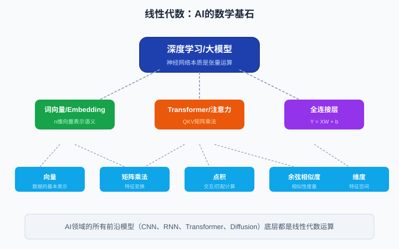
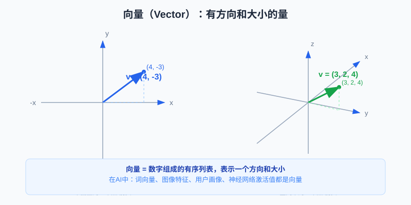
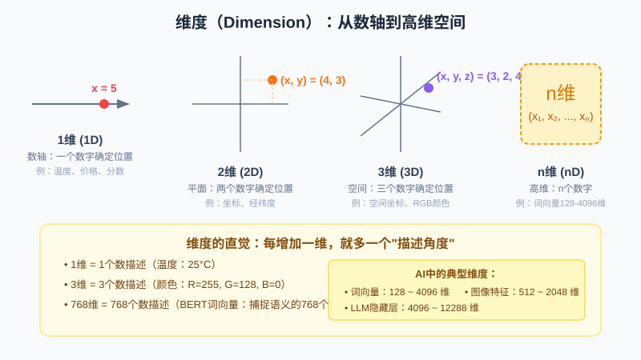
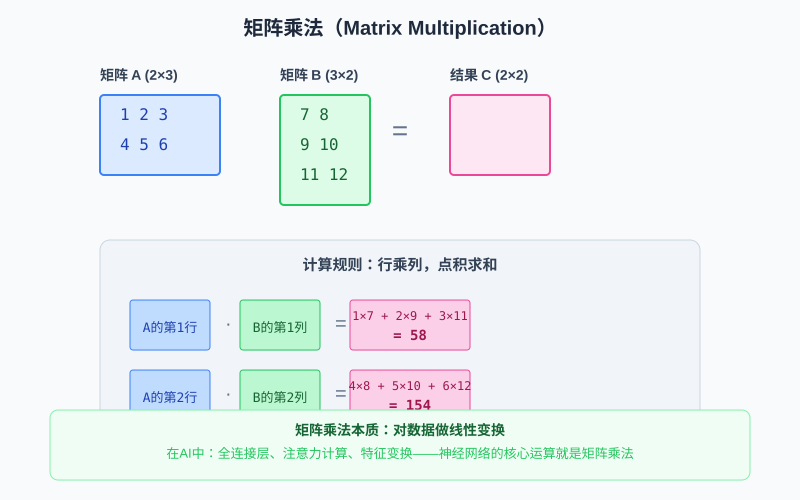

# 线性代数：AI 的数学基石

线性代数是人工智能、机器学习、深度学习最核心的数学基础。如果说编程是AI的"语言"，那么线性代数就是AI的"语法"——所有前沿模型（CNN、RNN、Transformer、大语言模型、Diffusion扩散模型）的底层运算，本质上都是向量和矩阵的线性变换。



本文将用最直观的方式讲解线性代数的五大核心概念：**向量、维度、矩阵乘法、点积、余弦相似度**，并重点说明每个知识点在AI中的具体作用。

---

## 一、向量（Vector）：AI世界的"原子"

### 1.1 什么是向量

向量是一组有序排列的数字，表示一个有方向和大小的量。

在几何中，向量可以理解为从原点出发的一个箭头：

- 二维向量：平面上的箭头，用 `(x, y)` 两个数字表示
- 三维向量：空间中的箭头，用 `(x, y, z)` 三个数字表示
- n维向量：高维空间中的"箭头"，用 `(x₁, x₂, ..., xₙ)` n个数字表示



例如：

```text
二维向量 v = (4, -3)
表示：x方向走4，y方向走-3

三维向量 v = (3, 2, 4)
表示：x方向走3，y方向走2，z方向走4
```

### 1.2 向量的关键性质

向量有两个核心要素：

1. **方向**：箭头指向哪里
2. **大小（模长）**：箭头有多长，计算公式：

```text
|v| = √(x₁² + x₂² + ... + xₙ²)
```

例如向量 `(3, 4)` 的模长是：

```text
|v| = √(3² + 4²) = √25 = 5
```

### 1.3 向量在AI中的具体作用

向量是AI表示一切数据的基本方式：

| AI场景 | 向量表示 | 维度 |
|--------|----------|------|
| 词向量（Word Embedding） | 每个词用一个向量表示 | 128 ~ 4096维 |
| 图像特征 | 一张图片/一个区域用向量表示 | 512 ~ 2048维 |
| 用户画像 | 用户行为偏好编码为向量 | 64 ~ 512维 |
| 神经网络激活值 | 某层神经元的输出 | 任意维度 |
| Transformer隐藏状态 | Token的语义表示 | 4096 ~ 12288维 |

**举例说明词向量**：

在词向量空间中，语义相近的词，它们的向量在方向上也接近：

```text
"国王" - "男人" + "女人" ≈ "女王"
```

这个著名的向量运算例子说明：向量空间中编码了语义关系。

---

## 二、维度（Dimension）：描述世界的"特征数"

### 2.1 什么是维度

维度就是描述一个事物需要用多少个数字。

- 0维：一个点，不需要数字描述
- 1维：一个数字就能确定位置（数轴）
- 2维：两个数字确定位置（平面坐标）
- 3维：三个数字确定位置（空间坐标）
- n维：n个数字确定位置（高维空间）



生活中的例子：

```text
温度 = 25°C                          → 1维
位置 = (经度116.4, 纬度39.9)         → 2维
颜色 = (R=255, G=128, B=0)           → 3维
一个人的信息 = (年龄, 身高, 体重, 收入) → 4维
```

### 2.2 高维空间的直觉

人类只能直观理解3维空间，但AI经常处理成百上千维的数据。理解高维空间的关键直觉：

> **每增加一个维度，就多一个"描述角度"或"特征轴"。**

例如描述一个人：
- 1维：只能区分"年龄大小"
- 3维：可以区分"年龄、身高、体重"
- 100维：可以从100个角度描述（消费习惯、兴趣偏好、社交特征...）
- 768维：BERT词向量，从768个微妙角度捕捉词语的语义

### 2.3 维度在AI中的具体作用

维度选择是AI模型设计的核心决策之一：

| 应用场景 | 典型维度 | 维度高低的影响 |
|----------|----------|----------------|
| 词向量 | 128 / 256 / 768 / 1536 | 维度太低→信息丢失；太高→计算慢、过拟合 |
| LLM隐藏层 | 4096(GPT-2) / 5120(GPT-3) / 12288(GPT-4) | 更高维度→更强表达能力→更大模型 |
| 图像特征 | 512 / 1024 / 2048 | 高维特征更细致，低维特征更泛化 |
| 向量数据库索引 | 通常降至128~1024维 | 平衡检索精度和速度 |

**维度灾难与降维**：

当维度过高时，数据会变得稀疏（高维空间中所有点看起来都"很远"），这叫"维度灾难"。AI中常用PCA、t-SNE等方法把高维数据降到2维或3维进行可视化。

---

## 三、矩阵与矩阵乘法：AI的"计算引擎"

### 3.1 什么是矩阵

矩阵就是按行和列排列的数字表格，可以看作"向量的组合"。

一个 `m×n` 的矩阵有m行n列：

```text
A = [1  2  3]    ← 第1行
    [4  5  6]    ← 第2行
    ↑  ↑  ↑
    列1 列2 列3

这是一个 2×3 的矩阵（2行3列）
```

### 3.2 矩阵乘法规则

矩阵乘法不是简单的对应位置相乘！它的规则是：**行乘列，点积求和**。



如果 A 是 `m×n` 矩阵，B 是 `n×p` 矩阵，那么结果 C = A×B 是 `m×p` 矩阵，其中：

```text
C[i][j] = A的第i行 · B的第j列
        = A[i][1]×B[1][j] + A[i][2]×B[2][j] + ... + A[i][n]×B[n][j]
```

注意：
- 矩阵乘法要求：A的列数 = B的行数
- 矩阵乘法不满足交换律：A×B ≠ B×A（通常）

**计算示例**：

```text
[1 2 3]   [7  8]        [1×7+2×9+3×11  1×8+2×10+3×12]   [58  64]
[4 5 6] × [9  10]    =   [4×7+5×9+6×11  4×8+5×10+6×12] = [139 154]
          [11 12]
```

### 3.3 矩阵乘法的本质：线性变换

从几何角度看，矩阵乘法的本质是对向量做**线性变换**：
- 旋转
- 缩放
- 剪切
- 投影

一个矩阵代表一种"空间变形方式"，把一个向量从一个空间"变换"到另一个空间。

### 3.4 矩阵乘法在AI中的具体作用

矩阵乘法是神经网络中最频繁、计算量最大的运算：

| AI组件 | 矩阵乘法的作用 | 公式 |
|--------|----------------|------|
| 全连接层（Dense/Linear） | 特征变换、维度升降 | Y = XW + b |
| 注意力机制（QKV） | 计算Query与Key的相似度 | Attention = Q × Kᵀ |
| 卷积层（CNN） | 本质是特殊的矩阵乘法（im2col） | Y = Conv(X, W) |
| RNN/LSTM | 时间步的状态更新 | hₜ = σ(W·[hₜ₋₁, xₜ] + b) |
| 批量数据处理 | 同时计算多个样本 | (batch, in_dim) × (in_dim, out_dim) |

**全连接层详解**：

神经网络中最基本的层：

```text
Y = XW + b

X: 输入，形状 (batch_size, input_dim)
W: 权重矩阵，形状 (input_dim, output_dim)
b: 偏置向量，形状 (output_dim,)
Y: 输出，形状 (batch_size, output_dim)
```

这就是一次矩阵乘法加向量加法——而GPT-3有96层这样的计算，每一次前向传播要做亿万次矩阵乘法。GPU就是为矩阵乘法优化的硬件！

---

## 四、点积（Dot Product）：AI的"匹配计分器"

### 4.1 什么是点积

点积是两个向量之间最基础的运算：**对应位置相乘，再全部加起来**，结果是一个标量（一个数字）。


公式：

```text
a · b = a₁b₁ + a₂b₂ + ... + aₙbₙ
```

**计算示例**：

```text
a = (4, -3), b = (2, 4)

a · b = 4×2 + (-3)×4
      = 8 - 12
      = -4
```

### 4.2 点积的几何意义

点积有一个非常重要的几何解释：

```text
a · b = |a| × |b| × cosθ
```

其中 θ 是两个向量之间的夹角。

这个公式告诉我们：点积衡量的是两个向量在**方向上的一致性**：

| 点积结果 | 几何含义 | 直觉理解 |
|----------|----------|----------|
| > 0 | 夹角 < 90° | 两个向量方向大致相同 |
| = 0 | 夹角 = 90° | 两个向量垂直，方向完全无关（正交） |
| < 0 | 夹角 > 90° | 两个向量方向大致相反 |

点积结果越大，说明两个向量方向越一致！

### 4.3 点积在AI中的具体作用

点积是AI中"匹配度计算"的核心工具：

| AI场景 | 点积的作用 |
|--------|------------|
| 注意力机制（Self-Attention） | Q和K做点积，计算"应该关注谁"的分数 |
| 推荐系统 | 用户向量与物品向量做点积，预测评分 |
| 语义搜索 | Query向量与文档向量做点积，衡量相关性 |
| 二分类逻辑回归 | w·x 计算正类的得分 |
| 相似度计算 | 点积是余弦相似度的分子 |

**注意力机制中的点积**：

Transformer的核心——缩放点积注意力：

```text
Attention(Q, K, V) = softmax(Q·Kᵀ / √dₖ) · V
```

这里 `Q·Kᵀ` 就是用点积计算每个Query和每个Key的相关性分数，分数越高说明越应该关注这个位置。这就是大模型"注意力"的数学本质！

---

## 五、余弦相似度（Cosine Similarity）：衡量"方向有多像"

### 5.1 什么是余弦相似度

余弦相似度用两个向量夹角的余弦值来衡量它们的相似程度，是点积的"归一化版本"。


公式：

```text
            a · b
cosθ = —————————————
          |a| × |b|
```

余弦相似度的取值范围是 **[-1, 1]**：

| cosθ值 | 含义 | 相似程度 |
|--------|------|----------|
| 1 | 夹角0°，方向完全相同 | 完全相似 |
| (0, 1) | 夹角在0°~90°之间 | 有一定相似性 |
| 0 | 夹角90°，正交 | 完全无关 |
| (-1, 0) | 夹角在90°~180°之间 | 有相反趋势 |
| -1 | 夹角180°，方向完全相反 | 完全相反 |

### 5.2 为什么需要余弦相似度（而不是点积）

点积受向量长度影响：如果一个向量很长，即使方向不完全一致，点积也可能很大。

余弦相似度先把两个向量都归一化为长度1（单位向量），消除了长度的影响，只关注**方向是否一致**。

举个例子：
```text
a = (1, 0)  → 模长1
b = (2, 0)  → 模长2
c = (1, 0.1) → 模长约1.005

a·b = 2，cosθ = 1（方向完全一样）
a·c = 1，cosθ ≈ 0.995（方向几乎一样）
```

在语义理解中，我们关心的是"语义方向是否一致"，而不是向量有多长，所以余弦相似度更合适。

### 5.3 余弦相似度在AI中的具体作用

余弦相似度是向量检索、匹配、聚类的标配工具：

| AI应用场景 | 余弦相似度的作用 |
|------------|------------------|
| RAG检索增强生成 | 用户Query向量与知识库文档向量比对，找最相关的Top-K |
| 语义搜索 | 查询与文档的语义匹配度排序 |
| 推荐系统（向量召回） | 用户向量与物品向量匹配，召回候选集 |
| 人脸识别 | 两张人脸的特征向量比对，判断是否为同一人 |
| 聚类（K-Means等） | 衡量样本与聚类中心的距离（方向距离） |
| 去重/相似文章检测 | 文章向量两两比对，找出重复或高度相似的内容 |
| Few-Shot示例选择 | 从样本库中找与当前输入最相似的示例 |

**RAG中的余弦相似度检索流程**：

```text
1. 用户提问："什么是线性代数？"
2. 将问题编码为向量 q (768维)
3. 知识库中每个文档块预先编码为向量 d₁, d₂, ..., dₙ
4. 计算 cos(q, dᵢ)，取相似度最高的3-5个文档
5. 把这些文档拼接到Prompt中送给大模型回答
```

向量数据库（Pinecone、Milvus、Chroma、FAISS）的核心能力之一，就是高效地在百万/亿级向量中做余弦相似度Top-K检索。

---

## 六、术语对照表

| 中文术语 | 英文术语 | 符号 | AI中的核心用途 |
|----------|----------|------|----------------|
| 向量 | Vector | v, x, a | 数据表示（词、图、特征） |
| 维度 | Dimension | n, d | 特征数量/模型容量 |
| 矩阵 | Matrix | A, W, Q, K, V | 权重、线性变换 |
| 矩阵乘法 | Matrix Multiplication | A×B, AB | 全连接层、注意力、特征变换 |
| 点积 | Dot Product / Inner Product | a·b, ⟨a,b⟩, aᵀb | 匹配计分、注意力分数 |
| 余弦相似度 | Cosine Similarity | cosθ, cos_sim | 相似性检索、匹配、聚类 |
| 模长/范数 | Norm | \|v\|, ‖v‖ | 向量长度计算 |
| 转置 | Transpose | Aᵀ, Aᵀ | 矩阵行列互换 |
| 单位向量 | Unit Vector | â = a/\|a\| | 归一化 |
| 正交 | Orthogonal | a·b = 0 | 特征无关 |

---

## 七、总结：线性代数为什么是AI的基础

线性代数之所以是AI的数学基石，可以用三句话总结：

1. **万物皆向量**：在AI眼中，文字、图片、语音、用户行为——一切都可以编码为向量。
2. **变换靠矩阵**：神经网络层与层之间的信息传递，本质上是矩阵乘法做线性变换（再加非线性激活）。
3. **匹配算点积**：计算"相关程度"、"注意力权重"、"相似度"——所有"匹配"逻辑的底层都是点积/余弦相似度。

如果你理解了向量、矩阵乘法、点积、余弦相似度、维度这五个概念，你就理解了AI模型底层在"算什么"。剩下的只是各种架构（CNN/RNN/Transformer/Diffusion）在这个基础上的排列组合。
