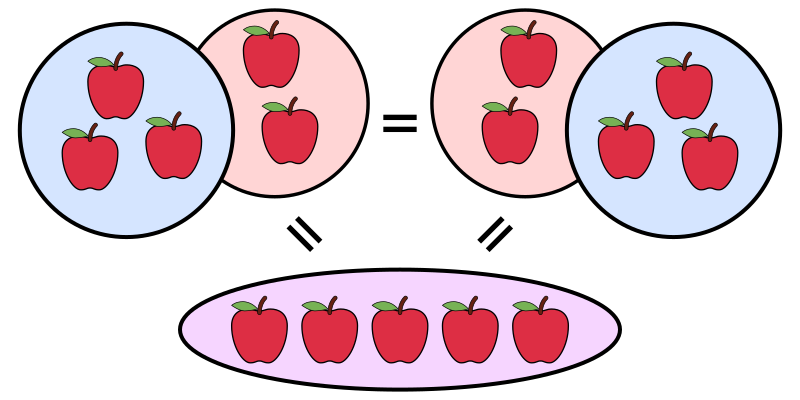

## 基本概念

在我们启蒙阶段，源于对于事物的好奇心，在生活和游戏中会对这个世界的不同事物建立对“数”、“形”、“量”的初步感知。例如数数，数手指、数楼梯、数水果等；能对应具体数字的量。

## 计数

计数（counting）是重复加（或减）“一”或其他“计数单位”的数学行为。即用来区别不同对象的，口语中称为“数数”，计数亦可以被用来学习数字的名称和计数系统的知识。除了用
1 来作为计算单位外，还可以使用 2（0,2,4,6,8,...），5（0,5,10,15,20,...），10（0,10,20,30,40,...），等不同的数来作为单位。

## 计算

计算（Calculation）是将一个或者多个输入变成一个或者多个的输出结果的一种思考过程。

## 度量

度量（measurement）又称测量、计量，是指对于一个物体或是事件的某个性质给予一个数值及单位，使其量化而可以和其他物体或是事件的相同性质比较。
>
度量的过程为估计“某一数量的多寡”和“相同类型一个单位量的多寡”之间的比例，而量值即为此过程的数字结果，但必须加上计量单位体现为“数字加上单位”，
其中实数数字为估计的比例；如：9米，其便包含物体长度和长度单位，即其与一米之间的比例，而9米的物理意义为距离，必须以多少米或多少英尺来表示。

度量可以是对某一“物理量”（如时间、长度、容量、重量等）的估计或测定，此时必须以某一标准或度量衡表示；度量也可以是其他较抽象的特质，
例如给定一个“数学量”。一个完整的度量过程应包括四个要素：测量对象、测量单位、测量方法、测量精度。
> 物理量（英语：physical quantity）在物理学中是指物质、物体、系统、现象、过程等，能用严谨的操作型（可观察、可测量、可操作）定义来度量，进而可量化的“性质”。

## 自然数

最常用的数为自然数(N)，指非负整数；在十进制数字系统里，自然数的标记符号为0至9等十个数字，将以十为基数的进位制使用在大于九的数上。
因此，大于九的数会有两个或两以上的位数。表示所有自然数的集合为n、N。
例如：0，1，2，3，4....

## 整数

整数用Z来表示，小于0的表示负整数，大于0的是正整数。

## 有理数

有理数是可以表示为整数分子（m）和整数分母（n），其中 n 大于 0。

## 无理数

不能写作两整数之比。若将它写成小数形式，小数点后有无限多位，并且不会循环，即无限不循环小数（任何有限或无限循环小数可表示成两整数的比）。常见无
理数有大部分的平方根、π、e

## 实数

实数由所有能被十进制数表示的数所组成，不论其为有理数或无理数，所有实数可以分成正数、零和负数。

## 分数

是用分式（分数式）表达成 a/b，其中 a，b 属于整数，b 不等于 0;可视为某件事物平均分成 b 份中占 a 份。其中 a 叫分子，b 叫分母，读作
b分之a，中间的线称为分线或分数线。有时人们会用 a/b 来表示分数。

## 小数

小数，是实数的一种特殊的表现形式。所有分数都可以表示成小数，小数中的圆点叫做小数点，它是一个小数的整数部分和小数部分的分界号。其中整数部分是零
的小数称为纯小数，整数部分不是零的小数称为带小数。

## 四则运算

四则运算，即加减乘除，是数学最基本的算术运算。如果加减乘除放在同一个算式列中的话，其计算的顺序是“先乘除，后加减”，括号内先算。四则运算的起源很
早，几乎在数学产生时就有了。

- 结合律（英语：associative property）是二元运算可以有的一个性质，意指在一个包含有二个以上的可结合运算子的表示式，只要运算数的位置没有改变，
  其运算的顺序就不会对运算出 来的值有影响。亦即，重新排列表示式中的括号并不会改变其值。  
    
  

- 交换律（英语：Commutative property）是被普遍使用的一个数学名词，意指能改变某物的顺序而不改变其最终结果。
  

- 分配律（distributive property）是二元运算的一个性质，它起源于基本代数运算，同时部分抽象代数运算亦符合该定律
    
  

## 幂运算

幂是重复连乘的运算，即是乘方的结果；由此，若 n 为正整数，n 个相同的数 b 连续相乘（即 b 自乘 n 次），就可将 b^{n} 看作乘方的结果
——“幂”。
