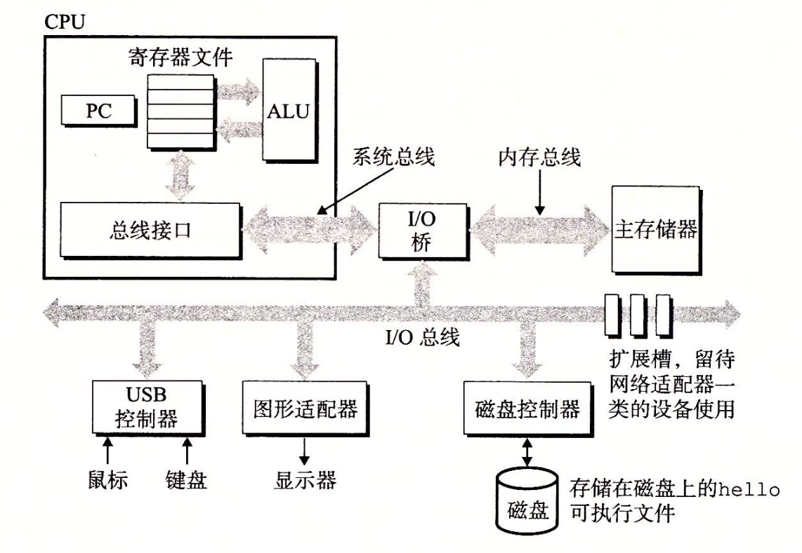

# 深入理解计算机系统学习笔记

## 前言
计算机系统由硬件和系统软件组成，这本书是为了让我们深入的了解这些组件是如何影响程序的正确性和性能的。
### 完成打卡后可掌握知识
- 编译器是如何实现过程调用的
- 如何避免缓冲区溢出引起的安全漏洞问题
- 如何编写自己的 Unix Shell、动态存储分配包、实现Web服务器

### 程序是如何编译成可执行的目标程序的
位是信息的基本单位：它是由0和1组成的，也叫Bit（比特），由8位组成的一组序列成为Byte（字节）。将二进制转化为对应的十进制数字来编码常见的字母符号的表叫ASCII表，高级语言的编写的源码在计算机上存储的时候就需要转化为对应的二进制序列才能被计算机保存。
> 即：源码 -> 编译 -> 二进制序列。

在 C 语言程序开发中，我们需要将编写好的源码通过编译器 GCC 编译后才能变成计算机可执行的目标程序文件。

1. 预处理  
比如我们的源文件中引用了标准库的，我们就预先把引用的文件插入到目标程序中，这个阶段就是预处理。
2. 将预处理的结果编译成汇编语言程序。  
作用就是统一高级语言的输出结果。
3. 将汇编程序翻译为机器指令   
生成的结果是可重定位目标程序（二进制）
4. 链接阶段
如果源程序中引用了其他程序，我们需要将其合并到我们的程序中，完成这个的就是连接器（ld），结果就是一个可执行程序文件被存储到磁盘上，它可以被加载到系统内存中由系统执行。

### 系统的硬件结构
#### 总线
总线是连接整个系统的一组电子管道，用来给各个部件传递数据，通常被设计位定长的字节块，用 word（字）来表示，字中的字节数表示字长。目前大部分机器的字长度是4字节（32位）或者8字节（64位）。

#### I/O 设备
I/O 即输入和输出，是系统和外界的联系通道，输入通常是：鼠标、键盘；输出是：显示器，以及存储数据的存储设备。
- 适配器  
适配器是用来转化不同设备之间的数据格式的设备，分为硬件适配器和软件适配器；硬件适配器例如常见的显卡、网卡、USP转Type-C等。软件适配器例如驱动程序，虚拟声卡等。

- 控制器  
控制器是管理硬件设备的专用电路或芯片，直接控制设备的操作，通常集成在主板或设备内部。

#### 主存
主存是一个临时存储设备，在处理器执行程序时，用来存放程序和程序处理的数据。从物理上来说，主存是由一组动态随机存取存储器（DRAM）芯片组成的。从逻辑上来说，存储器是一个线性的字节数组，每个字节都有其唯一的地址（数组索引），这些地址是从零开始的。一般来说，组成程序的每条机器指令都由不同数量的字节构成。与 C 程序变量相对应的数据项的大小是根据类型变化的。比如，在运行 Linux 的 x86-64 机器上，short 类型的数据需要 2 个字节，int 和 float 类型需要 4 个字节，而 long 和 double 类型需要 8 个字节。 第 6 章将具体介绍存储器技术，比如 DRAM 芯片是如何工作的，它们又是如何组合起来构成主存的。 

#### 处理器
中央处理单元（CPU），简称处理器，是解释（或执行）存储在主存中指令的引擎。处理器的核心是一个大小为一个字的存储设备（或寄存器），称为程序计数器（PC）。在任何时刻，PC 都指向主存中的某条机器语言指令（即含有该条指令的地址）。
从系统通电开始，直到系统断电，处理器一直在不断地执行程序计数器指向的指令，再更新程序计数器，使其指向下一条指令。处理器看上去是按照一个非常简单的指令执行模型来操作的，这个模型是由指令集架构决定的。在这个模型中，指令按照严格的顺序执行，而执行一条指令包含执行一系列的步骤。处理器从程序计数器指向的内存处读取指令，解释指令中的位，执行该指令指示的简单操作，然后更新 PC，使其指向下一条指令，而这条指令并不一定和在内存中刚刚执行的指令相邻。

这样的简单操作并不多，它们围绕着主存、寄存器文件（register file）和算术/逻辑单元（ALU）进行。寄存器文件是一个小的存储设备，由一些单个字长的寄存器组成，每个寄存器都有唯一的名字。ALU 计算新的数据和地址值。下面是一些简单操作的例子，CPU 在指令的要求下可能会执行这些操作。

加载：从主存复制一个字节或者一个字到寄存器，以覆盖寄存器原来的内容。

存储：从寄存器复制一个字节或者一个字到主存的某个位置，以覆盖这个位置上原 来的内容。 

操作：把两个寄存器的内容复制到 ALU，ALU 对这两个字做算术运算，并将结果存放到一个寄存器中，以覆盖该寄存器中原来的内容。 

跳转：从指令本身中抽取一个字，并将这个字复制到程序计数器（PC）中，以覆盖 PC 中原来的值。

 处理器看上去是它的指令集架构的简单实现，但是实际上现代处理器使用了非常复杂的机制来加速程序的执行。因此，我们将处理器的指令集架构和处理器的微体系结构区分开来：指令集架构描述的是每条机器代码指令的效果；而微体系结构描述的是处理器实际上是如何实现的。在第 3 章研究机器代码时，我们考虑的是机器的指令集架构所提供的抽象性。第 4 章将更详细地介绍处理器实际上是如何实现的。第 5 章用一个模型说明现代处理器是如何工作的，从而能预测和优化机器语言程序的性能。
 
#### 高速缓存
