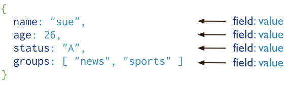

## 简介
MongoDB 中的记录是一个文档（BSON 文档），它是由字段和值对组成的数据结构。MongoDB 文档类似于 JSON 对象。字段值可以包含其他文档、数组和文档数组。
  
这些文档。

MongoDB 将文档存储在集合（collection）中。集合类似于关系数据库中的表。

- MongoDB 提供高性能数据持久性。
- 基本的CURD操作。
- 数据聚合
- 文本搜索
- 地理空间查询
- 支持副本集（组 MongoDB 服务器），可自动故障转移、数据冗余。
- 支持横向可扩展性（分片）
- 支持多种存储引擎