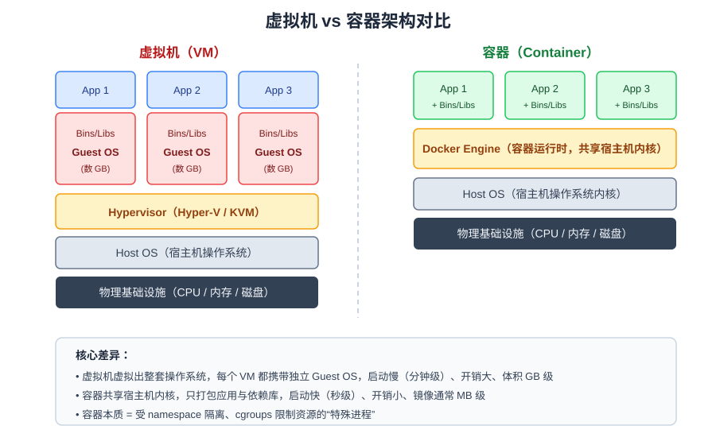
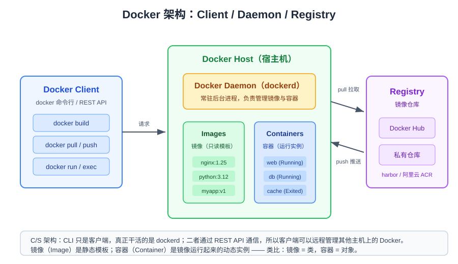
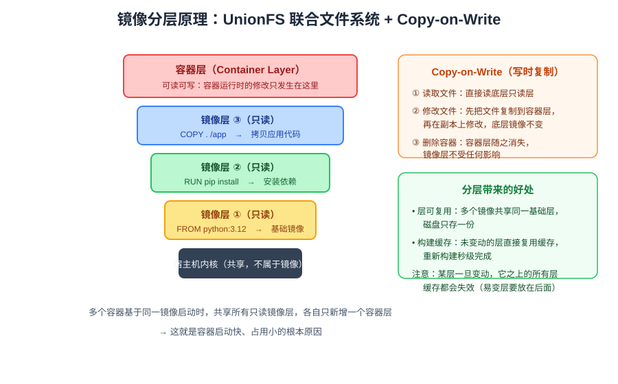
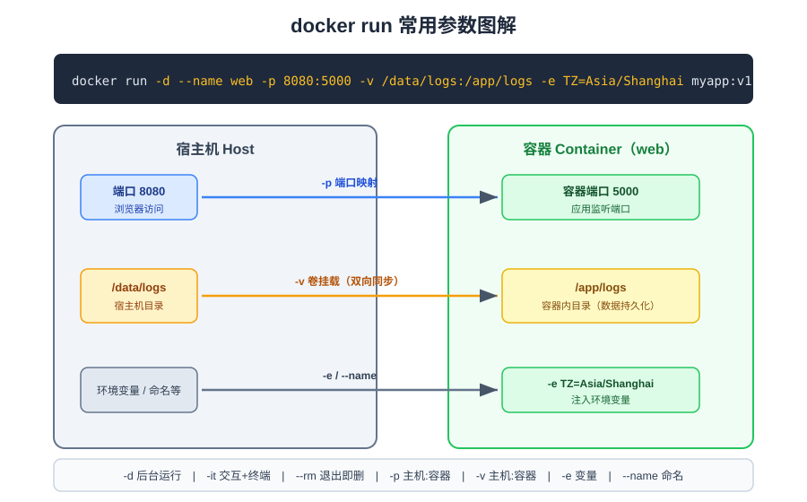
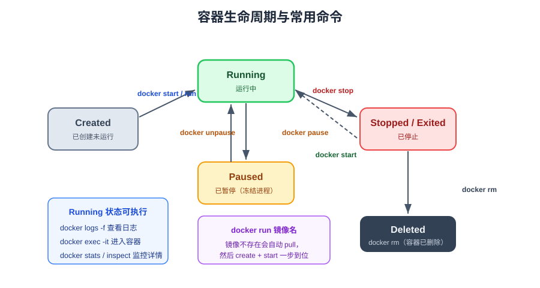

# Docker 入门手册：编写 Dockerfile、构建镜像与容器管理

> 本篇目标：理解容器与镜像的本质，掌握 **编写 Dockerfile → 构建镜像 → 运行容器 → 调试容器** 的完整工作流，
> 熟练使用 `docker build`、`docker run`、`docker exec`、`docker logs` 等核心命令。

---

## 一、Docker 解决了什么问题

软件开发中最经典的协作难题是：**"在我机器上明明能跑啊？"**

代码在开发、测试、生产环境之间流转时，操作系统版本、运行时版本、系统依赖、环境变量的任何差异都可能导致故障。
Docker 的思路是：**把应用连同它的整个运行环境（代码、运行时、系统库、配置）一起打包成一个标准化的单元——镜像，
任何安装了 Docker 的机器上运行这个镜像，表现都完全一致。**

这个运行起来的单元就是**容器（Container）**。

### 容器与虚拟机的区别

很多人会把容器和虚拟机混为一谈，但它们的架构有本质区别：



| 对比项 | 虚拟机（VM） | 容器（Container） |
| --- | --- | --- |
| 隔离级别 | 硬件级隔离（Hypervisor 虚拟硬件） | 进程级隔离（namespace + cgroups） |
| 操作系统 | 每个 VM 携带完整 Guest OS | 共享宿主机内核，只打包应用和依赖 |
| 体积 | GB 级 | MB 级 |
| 启动速度 | 分钟级（要启动整套 OS） | 秒级甚至毫秒级（就是启动一个进程） |
| 性能损耗 | 较大（额外 OS 开销） | 极小（接近原生进程） |

> 本质理解：**容器不是"轻量级虚拟机"，而是一个被 namespace 隔离视图、被 cgroups 限制资源的特殊进程。**

---

## 二、核心概念与 Docker 架构

学习 Docker 先记住三个核心概念：

- **镜像（Image）**：只读的模板，包含运行应用所需的一切（文件系统 + 启动配置）。镜像分层构建、可复用。
- **容器（Container）**：镜像运行起来的实例。一个镜像可以同时启动多个容器。
  类比面向对象编程：**镜像是类，容器是对象**。
- **仓库（Registry）**：存放和分发镜像的服务，默认是 [Docker Hub](https://hub.docker.com/)，企业内常用 Harbor、阿里云 ACR 等私有仓库。

Docker 采用 **C/S（客户端/服务端）架构**：



- **Docker Client**：我们敲的 `docker` 命令只是一个命令行客户端，它通过 REST API 与守护进程通信；
- **Docker Daemon（dockerd）**：宿主机上常驻的后台服务，真正负责构建镜像、管理容器生命周期；
- **Registry**：Daemon 执行 `pull` 时从仓库拉取镜像，执行 `push` 时把镜像推送到仓库。

> 正因为是 C/S 架构，客户端可以远程管理另一台机器上的 Docker（`DOCKER_HOST` 指向远程 daemon 即可）。

---

## 三、镜像分层原理（重点理解）

Docker 镜像并不是一个大的压缩包，而是由**多层只读层（Read-only Layer）** 堆叠而成，底层依赖
**UnionFS（联合文件系统）** 把多个目录"联合挂载"成一个统一的文件系统视图。



关键机制有两个：

### 1. 分层构建

Dockerfile 中的**每一条文件操作指令（`FROM`、`RUN`、`COPY`、`ADD`）都会产生一层**，层与层自上而下堆叠。
而 `ENV`、`EXPOSE`、`CMD` 等指令只写入元数据，不产生文件层。

### 2. Copy-on-Write（写时复制，CoW）

- 容器启动时，Docker 在所有只读镜像层之上加一个**可读可写的容器层**；
- 容器**读取**文件：直接从底层只读层读取；
- 容器**修改/删除**已有文件：先把该文件从只读层"复制"到容器层，再修改副本，底层镜像层不受影响；
- 容器删除后，容器层随之消失——所以**容器内写入的数据默认是临时的**（持久化需要用卷挂载 `-v`）。

### 分层带来的实际好处

1. **层复用**：多个镜像共享相同的基础层，磁盘上只存一份。比如 10 个应用都基于 `python:3.12-slim`，
   基础层只占一份空间。
2. **构建缓存**：重新构建镜像时，未发生变化的层直接命中缓存，无需重复执行。
   **注意：某一层一旦变化，它之上的所有层缓存全部失效**——这决定了 Dockerfile 的指令排序原则
   （把变化频繁的层，如拷贝源码，放在后面，详见下文）。

可以用 `docker history 镜像名` 查看一个镜像的每一层及大小：

```bash
docker history nginx:1.25
```

---

## 四、编写 Dockerfile

Dockerfile 是一个文本文件（无扩展名），描述了**如何一步步构建镜像**。

### 4.1 一个完整示例

以一个 Python Flask 应用为例，项目目录结构：

```text
myapp/
├── app.py
├── requirements.txt
└── Dockerfile
```

`requirements.txt`：

```text
flask==3.0.3
```

`app.py`：

```python
from flask import Flask
app = Flask(__name__)

@app.route("/")
def hello():
    return "Hello, Docker!"

if __name__ == "__main__":
    app.run(host="0.0.0.0", port=5000)
```

`Dockerfile`：

```dockerfile
# 1. 基础镜像：一切镜像的起点
FROM python:3.12-slim

# 2. 设置工作目录（不存在会自动创建，后续指令都在此目录下执行）
WORKDIR /app

# 3. 设置环境变量（python 不缓冲输出，日志能实时打印）
ENV PYTHONUNBUFFERED=1

# 4. 先拷贝依赖清单并安装依赖（利用缓存：源码变动不会重装依赖）
COPY requirements.txt .
RUN pip install --no-cache-dir -r requirements.txt

# 5. 拷贝项目源码
COPY . .

# 6. 声明容器监听端口（仅文档作用，实际放行靠 -p 映射）
EXPOSE 5000

# 7. 容器启动时执行的默认命令
CMD ["python", "app.py"]
```

### 4.2 常用指令速查

| 指令 | 作用 | 示例 |
| --- | --- | --- |
| `FROM` | 指定基础镜像（每条 Dockerfile 必须以它开头） | `FROM node:20-alpine` |
| `WORKDIR` | 设置工作目录，相当于 `cd`（建议用它替代 `RUN cd`） | `WORKDIR /app` |
| `COPY` | 把构建上下文中的文件复制进镜像 | `COPY . /app` |
| `ADD` | 类似 COPY，额外支持自动解压 tar、远程 URL（一般优先用 COPY） | `ADD app.tar.gz /opt/` |
| `RUN` | 构建时执行命令，产生一个镜像层 | `RUN apt-get update && apt-get install -y curl` |
| `ENV` | 设置环境变量（构建期和运行期都生效） | `ENV TZ=Asia/Shanghai` |
| `ARG` | 构建参数（仅构建期生效，可用 `--build-arg` 传值） | `ARG VERSION=1.0` |
| `EXPOSE` | 声明容器端口（元数据，不自动映射） | `EXPOSE 8080` |
| `CMD` | 容器启动的**默认**命令，可被 `docker run` 参数覆盖 | `CMD ["python", "app.py"]` |
| `ENTRYPOINT` | 容器启动的**固定**入口命令，`docker run` 后的参数会追加给它 | `ENTRYPOINT ["python"]` |
| `VOLUME` | 声明匿名卷，提示该目录数据应持久化 | `VOLUME /data` |
| `USER` | 切换运行后续指令/容器进程的用户（安全实践：不用 root 跑应用） | `USER appuser` |

### 4.3 CMD 与 ENTRYPOINT 的区别（高频面试题）

- `CMD` 给出**默认命令**，运行容器时如果追加了命令会整体覆盖它：

  ```bash
  docker run myapp:v1 echo hi   # echo hi 覆盖了 CMD ["python","app.py"]
  ```

- `ENTRYPOINT` 定义**固定入口**，不会被覆盖，`docker run` 后面的参数会作为参数追加给它：

  ```dockerfile
  ENTRYPOINT ["python", "app.py"]
  ```

  ```bash
  docker run myapp:v1 --debug    # 实际执行：python app.py --debug
  ```

> 两者都推荐使用 **exec 形式**（JSON 数组 `["executable", "arg1"]`），
> 它不走 shell 包装，信号能正确传递给应用进程（`docker stop` 才能优雅停止）。

### 4.4 .dockerignore 文件

与 `.gitignore` 类似，构建时排除不需要的文件，**减小构建上下文体积、避免把敏感文件打进镜像**：

```text
__pycache__/
*.pyc
.git/
.env
node_modules/
venv/
*.log
```

### 4.5 Dockerfile 最佳实践

1. **选择精简基础镜像**：优先 `alpine` / `slim` 变体，攻击面和体积都更小；
2. **指令排序：变化少的放前面，变化频繁的放后面**——先拷贝依赖清单装依赖，最后才拷源码，
   这样改代码后重新构建时依赖层命中缓存；
3. **合并 RUN 指令**：每条 RUN 都会产生一层，用 `&&` 串起来，并在同一条里清理包管理器缓存：

   ```dockerfile
   RUN apt-get update \
       && apt-get install -y --no-install-recommends curl \
       && rm -rf /var/lib/apt/lists/*
   ```

4. **一个容器只跑一个主进程**；
5. **不要在镜像里打包密钥**，运行期用 `-e` 或挂载 secret 文件注入。

---

## 五、构建镜像：docker build

### 5.1 基本命令

在 Dockerfile 所在目录执行：

```bash
docker build -t myapp:v1 .
```

- `-t myapp:v1`：给镜像打标签（`仓库名/镜像名:标签`，标签省略时默认为 `latest`）；
- 末尾的 `.`：**构建上下文（build context）**——Docker 会把该目录打包发给 daemon，
  `COPY`/`ADD` 只能引用上下文内的文件。上下文路径也可以是 Git 仓库 URL。

也可以用 `-f` 指定其他路径的 Dockerfile：

```bash
docker build -t myapp:v1 -f docker/Dockerfile .
```

### 5.2 构建过程与分层的对应关系

构建时可以看到每一步都对应一个中间层 ID，成功后逐层提交：


观察构建日志会发现：第二次构建时未改动的步骤会打印 `CACHED`，这就是分层缓存在起作用。

常用构建参数：

| 参数 | 作用 |
| --- | --- |
| `-t, --tag` | 镜像名称与标签，可多次指定（如同时打 `v1` 和 `latest`） |
| `-f` | 指定 Dockerfile 路径 |
| `--build-arg KEY=VALUE` | 传入 `ARG` 定义的构建参数 |
| `--no-cache` | 禁用缓存，从头构建 |
| `--platform linux/amd64` | 指定目标平台（跨架构构建时使用） |

### 5.3 多阶段构建（进阶）

编译型语言（Go、Java、前端打包等）的构建工具在运行时完全不需要，可以用**多阶段构建**
只把最终产物拷贝进精简的运行镜像：

```dockerfile
# 阶段一：构建
FROM golang:1.22 AS builder
WORKDIR /src
COPY . .
RUN CGO_ENABLED=0 go build -o /app/server .

# 阶段二：运行（最终镜像里不含 Go 工具链）
FROM gcr.io/distroless/static-debian12
COPY --from=builder /app/server /server
ENTRYPOINT ["/server"]
```

---

## 六、运行容器：docker run

`docker run` 是最高频的命令，它等价于 **create（创建）+ start（启动）** 两步合一；
如果本地没有对应镜像，还会自动先 `pull`。

### 6.1 跑通第一个容器

```bash
docker run -d -p 8080:80 --name mynginx nginx:1.25
```

浏览器访问 `http://localhost:8080` 即可看到 Nginx 欢迎页。

### 6.2 常用参数图解



| 参数 | 含义 | 示例 |
| --- | --- | --- |
| `-d` | 后台运行（detached），返回容器 ID | `-d` |
| `-p` | 端口映射，格式 `宿主机端口:容器端口` | `-p 8080:5000` |
| `-v` | 卷挂载，格式 `宿主机路径:容器内路径`，数据持久化/双向同步 | `-v /data/logs:/app/logs` |
| `-e` | 注入环境变量 | `-e TZ=Asia/Shanghai` |
| `--name` | 给容器命名（不填会随机分配一个名字） | `--name web` |
| `-it` | 交互式运行（`-i` 保持输入打开 + `-t` 分配终端），常用于进入 shell | `-it ubuntu bash` |
| `--rm` | 容器停止后自动删除（适合一次性任务） | `--rm python:3.12 python -c "print(1)"` |
| `--network` | 指定容器网络 | `--network mynet` |
| `--restart` | 重启策略（`no`/`always`/`unless-stopped`） | `--restart=always` |

运行我们前面构建的 Flask 应用：

```bash
docker run -d --name myapp -p 8080:5000 -v $(pwd)/logs:/app/logs -e TZ=Asia/Shanghai myapp:v1
```

> Windows PowerShell 下没有 `$(pwd)`，写法为：
> `docker run -d --name myapp -p 8080:5000 -v "${PWD}/logs:/app/logs" myapp:v1`

### 6.3 容器内的程序为什么要监听 0.0.0.0

容器有自己独立的网络命名空间，`-p 8080:5000` 是把宿主机流量转发到**容器的 IP** 上。
如果应用只监听 `127.0.0.1`，则只接受容器内部回环访问，端口映射会"不通"。
所以 Flask 要写 `host="0.0.0.0"`，其他框架同理。

---

## 七、进入运行中的容器：docker exec

容器后台运行后，经常需要进去排查问题（看文件、执行调试命令）：

```bash
docker exec -it myapp bash
```

- `-i`：保持标准输入打开；`-t`：分配一个伪终端；两者组合即可获得交互式 shell；
- `myapp`：容器名或容器 ID；
- `bash`：要执行的命令（精简镜像里可能没有 bash，可用 `sh`）。

退出容器但**不停止**容器：按 `Ctrl + D` 或输入 `exit` —— 这只会结束 exec 启动的 shell 进程，
容器主进程（你的应用）仍在运行。

exec 也可以非交互式地直接执行单条命令，非常适合脚本化：

```bash
docker exec myapp cat /app/config.ini      # 查看容器内文件
docker exec myapp pip list                 # 查看已装依赖
docker exec -u root myapp apt install -y vim   # 指定用户执行
```

### exec 与 attach 的区别

- `docker exec -it 容器 bash`：**新开一个进程**进入容器，退出不影响容器，日常调试首选；
- `docker attach 容器`：直接接到容器主进程的终端上，按 `Ctrl+C` 可能导致容器停止，一般只用于交互式前台程序。

---

## 八、查看容器日志：docker logs

容器的日志就是**容器主进程的标准输出/标准错误**（stdout/stderr）。
所以最佳实践是：应用不要把日志只写文件，而要直接打印到控制台，Docker 自动收集。

```bash
docker logs myapp            # 查看全部日志
docker logs -f myapp         # 持续跟踪（类似 tail -f），Ctrl+C 退出不影响容器
docker logs --tail 100 myapp # 只看最后 100 行
docker logs -t myapp         # 每行显示时间戳
docker logs --since 10m myapp # 只看最近 10 分钟
```

常用组合：

```bash
docker logs -f --tail 200 myapp
```

> 如果在 Dockerfile 里设置了 `ENV PYTHONUNBUFFERED=1`（Python）或对应语言的关闭缓冲配置，
> 日志才能实时出现在 `docker logs -f` 中，否则会因输出缓冲延迟显示。

日志排查思路：容器一启动就退出时，**第一时间执行 `docker logs 容器名` 看报错**，
这是定位容器启动失败（端口占用、配置错误、依赖缺失）最直接的手段。

---

## 九、镜像与容器管理命令速查



### 容器操作

```bash
docker ps                 # 查看运行中的容器
docker ps -a              # 查看所有容器（包括已停止的）
docker stop 容器名         # 停止容器（发 SIGTERM，优雅停止）
docker start 容器名        # 启动已停止的容器
docker restart 容器名      # 重启容器
docker rm 容器名           # 删除容器（必须先停止，或加 -f 强制）
docker rm -f $(docker ps -aq)   # 强制删除所有容器（谨慎！）
docker stats              # 实时查看容器 CPU/内存/网络占用
docker inspect 容器名      # 查看容器详细信息（IP、挂载、环境变量等，JSON）
docker cp 容器名:/app/a.txt ./   # 容器与宿主机之间拷贝文件
```

### 镜像操作

```bash
docker images             # 查看本地镜像列表
docker pull nginx:1.25    # 从仓库拉取镜像
docker rmi 镜像名          # 删除镜像（有容器使用时需先删容器）
docker tag myapp:v1 registry.example.com/myapp:v1  # 重命名/打标签
docker push registry.example.com/myapp:v1          # 推送到远程仓库
docker history 镜像名      # 查看镜像分层
docker system df          # 查看磁盘占用
docker system prune       # 清理无用容器、网络、悬空镜像（加 -a 更彻底）
```

---

## 十、完整实战：从零容器化一个应用

把前面的内容串起来，完整走一遍工作流：

```bash
# 1. 准备项目
mkdir myapp && cd myapp
# （创建 app.py、requirements.txt、Dockerfile、.dockerignore）

# 2. 构建镜像
docker build -t myapp:v1 .

# 3. 确认镜像已存在
docker images myapp

# 4. 后台运行容器，映射端口
docker run -d --name myapp -p 8080:5000 myapp:v1

# 5. 验证服务
curl http://localhost:8080

# 6. 跟踪日志确认正常
docker logs -f myapp

# 7. 需要排查时进入容器
docker exec -it myapp bash

# 8. 查看容器状态与资源占用
docker ps
docker stats myapp

# 9. 停止并清理
docker stop myapp
docker rm myapp
docker rmi myapp:v1
```

日常开发中最常用的调试三连：

```bash
docker ps -a          # 容器还活着吗？状态是什么？
docker logs myapp     # 报了什么错？
docker exec -it myapp bash   # 进去看看现场
```

---

## 十一、小结

| 知识点 | 一句话总结 |
| --- | --- |
| 容器本质 | 共享宿主机内核、被 namespace/cgroups 隔离限制的进程 |
| 镜像与容器 | 镜像是只读模板（类），容器是运行实例（对象） |
| 镜像分层 | 每条文件指令产生一个只读层，容器层可写，CoW 机制保证镜像不被修改 |
| Dockerfile 排序 | 变化少的指令在前、变化频繁的在后，最大化利用构建缓存 |
| `docker build` | 按 Dockerfile 逐层构建，`.` 是构建上下文 |
| `docker run` | create + start，核心参数 `-d -p -v -e --name --rm` |
| `docker exec` | 在运行中的容器里新开进程，`-it ... bash` 进入调试 |
| `docker logs` | 查看主进程 stdout/stderr，`-f` 跟踪、`--tail` 看尾部 |
| 数据持久化 | 容器层随容器删除，重要数据必须用 `-v` 挂载到宿主机 |

掌握本篇后，下一步可以继续学习：**Docker 网络与容器互联**、**Docker Compose 多容器编排**、
**数据卷（Volume）管理** 以及 **镜像安全扫描与多阶段构建优化**。
