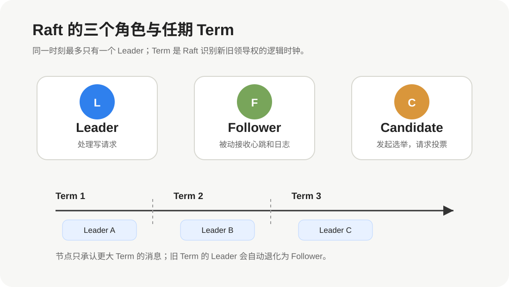
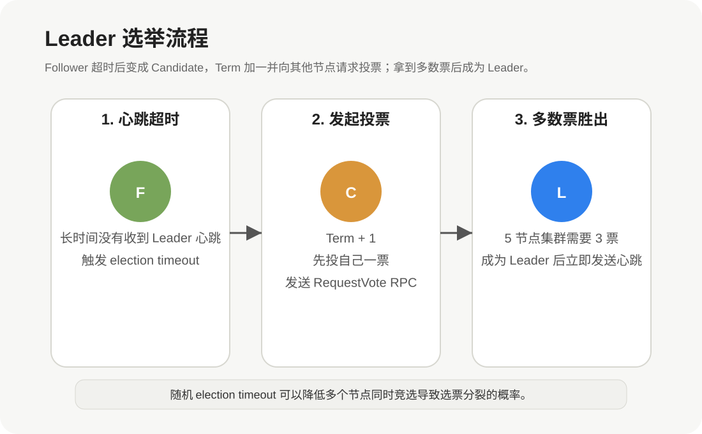
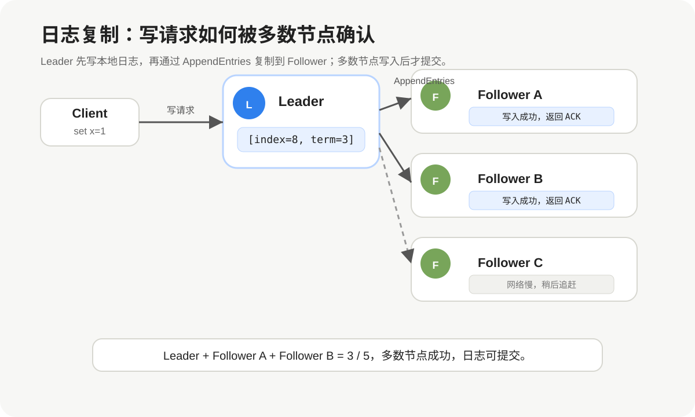
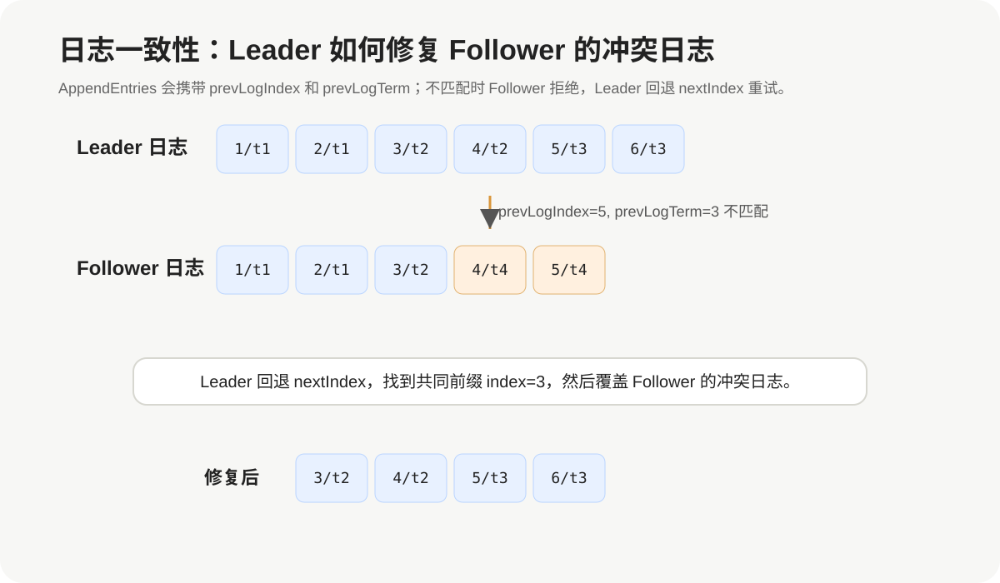

# Raft 协议详解

## 1. Raft 是什么

Raft 是一种**分布式一致性算法**，用于让多台机器在不可靠网络中，对同一份状态达成一致。

它解决的核心问题是：

> 多个节点共同维护一份数据，即使部分节点宕机、网络抖动、消息乱序，系统仍然能对外表现得像一个可靠的单机状态机。

Raft 常见于：

- etcd
- Consul
- TiKV / PD
- CockroachDB
- HashiCorp Nomad
- 一些自研配置中心、元数据服务、分布式锁服务

Raft 的目标不是追求最高性能，而是追求**正确性、可理解性和可工程实现性**。

---

## 2. Raft 要解决的问题

假设有一个配置中心，里面保存一条配置：

```text
feature_x_enabled = false
```

如果只有一台机器，写入很简单：

```text
client -> server -> 写入本地磁盘 -> 返回成功
```

但如果有 3 台机器：

```text
Node A
Node B
Node C
```

客户端写入：

```text
feature_x_enabled = true
```

就会出现一堆问题：

1. 应该写哪台机器？
2. 写入一台成功算不算成功？
3. 如果写到一半 Leader 宕机怎么办？
4. 如果网络分区，两个节点都以为自己是主怎么办？
5. 节点恢复后，如何追上最新数据？
6. 多个客户端并发写入，顺序如何保证？

Raft 的答案是：

```text
通过 Leader 统一处理写入；
通过日志复制把写入同步到多数节点；
通过任期和投票保证同一任期只有一个 Leader；
通过日志匹配和提交规则保证状态机顺序一致。
```

---

## 3. Raft 的核心思想

Raft 可以拆成三个核心问题：

| 问题 | Raft 的解决方式 |
|---|---|
| 谁来处理写请求 | Leader 选举 |
| 写入如何同步到其他节点 | 日志复制 |
| 怎样保证崩溃恢复后仍然一致 | 日志匹配、提交规则、快照 |

Raft 把复杂的一致性问题拆成几个更容易理解的子问题：

```text
Leader Election  -> 选出唯一 Leader
Log Replication  -> Leader 把日志复制到 Follower
Safety           -> 保证已提交日志不会丢失或被覆盖
Membership       -> 支持集群成员变更
Snapshot         -> 压缩日志，避免无限增长
```

---

## 4. Raft 的节点角色

Raft 中每个节点只会处于三种角色之一：



| 角色 | 说明 |
|---|---|
| Leader | 集群领导者，处理客户端写请求，向 Follower 复制日志 |
| Follower | 默认角色，被动接收 Leader 的心跳和日志 |
| Candidate | 候选者，Leader 超时后发起选举 |

### 4.1 Follower

Follower 是最普通的状态。

它不主动发起写入，也不主动复制日志，只做三件事：

1. 接收 Leader 的心跳。
2. 接收 Leader 发来的日志。
3. 在选举时给 Candidate 投票。

如果 Follower 在一段时间内没有收到 Leader 心跳，就会认为 Leader 可能宕机，然后转为 Candidate 发起选举。

### 4.2 Candidate

Candidate 是选举期间的临时角色。

节点变成 Candidate 后会：

1. 增加自己的 `currentTerm`。
2. 给自己投一票。
3. 向其他节点发送 `RequestVote` 请求。
4. 如果拿到多数票，就成为 Leader。

### 4.3 Leader

Leader 是集群中唯一对外处理写请求的节点。

Leader 负责：

1. 接收客户端写请求。
2. 把写请求转成日志条目。
3. 复制日志到 Follower。
4. 在多数节点确认后提交日志。
5. 定期发送心跳，维持领导权。

---

## 5. Term：Raft 的逻辑任期

Raft 使用 `Term` 表示逻辑时间。

可以把 Term 理解为“第几届领导任期”：

```text
Term 1: Node A 是 Leader
Term 2: Node B 是 Leader
Term 3: Node C 是 Leader
```

Term 有几个关键规则：

1. 每次发起新选举，Term 加一。
2. 节点只承认 Term 更大或相同的消息。
3. 如果 Leader 收到更大 Term 的消息，必须退化为 Follower。
4. 同一个 Term 中最多只能有一个 Leader。

Term 是 Raft 防止旧 Leader 继续作恶的关键机制。

例如：

```text
Node A 曾经是 Term 3 的 Leader。
后来网络分区，Node B 在 Term 4 当选 Leader。
Node A 网络恢复后，如果还想用 Term 3 发送日志，会被其他节点拒绝。
```

因为 Term 4 比 Term 3 新，旧 Leader 必须让位。

---

## 6. Leader 选举

Leader 选举解决的问题是：

> 当前 Leader 不可用时，集群如何选出新的 Leader，并保证同一任期最多只有一个 Leader？



### 6.1 选举触发条件

Follower 会等待 Leader 的心跳。

如果超过 `election timeout` 还没有收到心跳，Follower 就认为 Leader 不可用，开始选举。

```text
Follower 等待心跳
  -> 超过 election timeout
  -> 转为 Candidate
  -> 发起选举
```

### 6.2 随机选举超时

Raft 的 election timeout 通常是随机值，例如：

```text
150ms ~ 300ms
```

为什么要随机？

因为如果所有 Follower 同时超时，就可能同时变成 Candidate，然后互相抢票，导致谁也拿不到多数票。

随机超时可以降低“同时竞选”的概率。

### 6.3 投票规则

Candidate 发起投票时，会向其他节点发送 `RequestVote RPC`。

Follower 是否投票，主要看两个条件：

1. 当前 Term 内还没有投过票。
2. Candidate 的日志至少和自己一样新。

这里第二点很关键。

Raft 不能让日志落后的节点当 Leader，否则它可能覆盖掉已经提交的日志。

### 6.4 多数派原则

Candidate 必须拿到多数票才能成为 Leader。

| 集群节点数 | 多数票数量 |
---|---|
| 3 | 2 |
| 5 | 3 |
| 7 | 4 |

为什么是多数派？

因为两个多数派一定会有交集。

以 5 节点为例：

```text
多数派至少 3 个节点。

任意两个 3 节点集合，一定至少有 1 个节点重叠。
```

这个交集保证了新 Leader 不会完全绕过旧的已提交日志。

### 6.5 选票分裂

选票分裂指多个 Candidate 同时参选，票数被分散：

```text
5 节点集群：

Node A 得 2 票
Node B 得 2 票
Node C 得 1 票

没有人拿到 3 票，选举失败。
```

此时会进入下一轮 Term，重新选举。

随机 election timeout 会让某个节点更早发起下一轮选举，从而更容易拿到多数票。

---

## 7. 日志复制

Leader 选出来之后，所有写请求都交给 Leader。

Raft 不直接把数据写入状态机，而是先写入日志：

```text
客户端命令 -> Leader 日志 -> Follower 日志 -> 多数确认 -> 提交 -> 应用到状态机
```



### 7.1 日志条目的结构

Raft 的每条日志通常包含：

| 字段 | 说明 |
|---|---|
| index | 日志位置，单调递增 |
| term | 生成该日志时的 Leader 任期 |
| command | 客户端命令 |

例如：

```text
index=8, term=3, command="set x=1"
```

`index` 用来表示顺序，`term` 用来判断这条日志来自哪一任 Leader。

### 7.2 写入流程

一次写请求大致经历以下步骤：

1. Client 向 Leader 发送写请求。
2. Leader 把命令追加到本地日志。
3. Leader 通过 `AppendEntries RPC` 发送给 Follower。
4. Follower 校验通过后追加日志。
5. Follower 返回成功。
6. Leader 收到多数节点成功响应。
7. Leader 标记该日志为 committed。
8. Leader 把命令应用到状态机。
9. Leader 返回客户端写入成功。

### 7.3 为什么要多数节点确认

如果只写 Leader 就返回成功，那么 Leader 宕机后，这条日志可能丢失。

Raft 要求日志被多数节点保存后才能提交：

```text
5 节点集群：

Leader 本地写入成功
Follower A 写入成功
Follower B 写入成功

共 3 个节点写入成功，达到多数派，可以提交。
```

即使 Leader 随后宕机，新 Leader 也一定能从多数派交集中看到这条日志。

---

## 8. committed、applied 和状态机

Raft 中有两个容易混淆的概念：

| 概念 | 说明 |
|---|---|
| committed | 日志已经被多数节点确认，可以认为不会丢 |
| applied | 日志已经被应用到本地状态机 |

一个日志条目可能已经 committed，但还没 applied。

流程是：

```text
日志复制成功
  -> 多数确认
  -> committed
  -> 按顺序应用到状态机
  -> applied
```

状态机可以理解为真正的数据存储逻辑。

例如日志是：

```text
index=8, command="set x=1"
```

应用到状态机后，才会真正变成：

```text
x = 1
```

Raft 保证所有节点以相同顺序应用相同日志，所以最终状态一致。

---

## 9. 日志一致性检查

网络故障、Leader 崩溃、Follower 掉线都会导致节点日志不一致。

Raft 通过 `prevLogIndex` 和 `prevLogTerm` 修复冲突。



### 9.1 AppendEntries 的关键字段

Leader 向 Follower 复制日志时，不只是发送新日志，还会带上前一条日志的信息：

```text
prevLogIndex
prevLogTerm
entries
leaderCommit
```

含义：

| 字段 | 说明 |
|---|---|
| prevLogIndex | 新日志前一条日志的 index |
| prevLogTerm | 新日志前一条日志的 term |
| entries | 要复制的新日志 |
| leaderCommit | Leader 当前已提交的位置 |

Follower 收到后会检查：

```text
我本地 prevLogIndex 位置的日志 term 是否等于 prevLogTerm？
```

如果相等，说明前缀一致，可以追加。

如果不相等，说明日志冲突，拒绝追加。

### 9.2 冲突修复过程

假设 Leader 的日志是：

```text
1/t1  2/t1  3/t2  4/t2  5/t3  6/t3
```

Follower 的日志是：

```text
1/t1  2/t1  3/t2  4/t4  5/t4
```

从 index=4 开始冲突。

Leader 会不断回退该 Follower 的 `nextIndex`，直到找到共同前缀：

```text
共同前缀：1/t1  2/t1  3/t2
```

然后 Leader 用自己的日志覆盖 Follower 的冲突部分：

```text
Follower 修复后：
1/t1  2/t1  3/t2  4/t2  5/t3  6/t3
```

### 9.3 日志匹配性质

Raft 有一个重要性质：

> 如果两个日志条目拥有相同的 index 和 term，那么它们之前的所有日志也相同。

这就是日志一致性检查的基础。

Leader 每次复制日志都检查前一条日志是否匹配，最终可以保证所有 Follower 的日志逐渐向 Leader 对齐。

---

## 10. Leader 完整性

Raft 有一个非常重要的安全性质：

> 如果某条日志在某个 Term 被提交，那么未来所有 Leader 都必须包含这条日志。

这叫 **Leader Completeness**。

它靠两个机制保证：

1. Candidate 必须拥有足够新的日志，Follower 才会投票。
2. Leader 只有在当前 Term 的日志被多数复制后，才能推进 commit。

### 10.1 什么叫日志足够新

投票时，Follower 会比较 Candidate 的日志新旧：

1. 先比较最后一条日志的 `term`。
2. 如果 `term` 相同，再比较最后一条日志的 `index`。

规则：

```text
lastLogTerm 更大，日志更新。
lastLogTerm 相同但 lastLogIndex 更大，日志更新。
```

如果 Candidate 的日志比 Follower 还旧，Follower 不会投票。

### 10.2 为什么旧日志不能随便提交

Raft 对提交有一个细节：

> Leader 不能仅通过多数复制来提交旧 Term 的日志；必须通过提交当前 Term 的日志，间接提交之前的日志。

这个规则是为了避免某些极端故障场景下，旧 Leader 的未提交日志被错误认为已提交。

实际理解时可以记住：

```text
当前 Leader 只有把自己当前 Term 的日志复制到多数派后，才能安全推进 commitIndex。
```

---

## 11. 心跳机制

Raft 的心跳本质上是空的 `AppendEntries RPC`。

Leader 会定期向所有 Follower 发送心跳：

```text
Leader -> Follower: AppendEntries(entries=[])
```

心跳有两个作用：

1. 告诉 Follower：Leader 还活着，不要发起选举。
2. 携带 `leaderCommit`，通知 Follower 推进提交位置。

如果 Follower 在 election timeout 内持续收到心跳，就会一直保持 Follower 状态。

---

## 12. 读请求如何处理

写请求必须走 Leader，这点很清楚。

读请求有几种处理方式。

### 12.1 读 Leader 本地状态

最简单的方式是直接读 Leader 的状态机。

但这里有风险：

```text
旧 Leader 可能因为网络分区已经失去领导权，
却还不知道自己已经不是 Leader。
```

如果它直接返回本地旧数据，可能产生过期读。

### 12.2 ReadIndex

更安全的方式是 ReadIndex。

Leader 在返回读结果前，先向多数节点确认自己仍然是 Leader：

```text
Leader 发起心跳确认
  -> 多数节点响应
  -> 证明自己仍是合法 Leader
  -> 等待本地 apply 到 readIndex
  -> 返回读结果
```

etcd 的线性一致读就使用类似机制。

### 12.3 Lease Read

Lease Read 基于时间租约：

```text
只要 Leader 租约未过期，就认为自己仍是 Leader，可以直接读本地状态。
```

它性能更好，但依赖时钟假设。

如果系统时钟漂移严重，Lease Read 的正确性会受影响。

---

## 13. 快照与日志压缩

Raft 日志不能无限增长。

如果系统运行很久，日志可能达到：

```text
index=1 ... index=100000000
```

全部保留会浪费磁盘，并且新节点追赶日志会非常慢。

所以 Raft 会使用快照。

### 13.1 快照是什么

快照是状态机在某个日志位置的完整状态。

例如：

```text
lastIncludedIndex = 10000
lastIncludedTerm = 8
state = 当前所有 key-value 数据
```

有了快照后，节点就可以删除 10000 之前的旧日志。

```text
旧日志：
1 ... 10000 ... 12000

压缩后：
snapshot(index=10000) + log(10001 ... 12000)
```

### 13.2 InstallSnapshot

如果某个 Follower 落后太多，Leader 已经没有它需要的旧日志，就会发送快照：

```text
Leader -> Follower: InstallSnapshot
```

Follower 安装快照后，从快照位置继续接收后续日志。

---

## 14. 集群成员变更

Raft 集群有时需要增加或删除节点。

例如：

```text
3 节点 -> 5 节点
5 节点 -> 3 节点
```

成员变更不能简单地直接修改配置，否则可能出现两个不同多数派，导致脑裂。

Raft 论文中使用 **Joint Consensus** 处理成员变更。

### 14.1 Joint Consensus

Joint Consensus 会经历两个阶段：

```text
旧配置 Cold
  -> 联合配置 Cold,new
  -> 新配置 Cnew
```

在联合配置阶段，一条日志必须同时被旧配置多数派和新配置多数派确认，才算提交。

这样可以保证配置切换期间不会出现两个互不相交的多数派。

### 14.2 工程中的简化方案

很多实现会使用更容易工程化的方式：

```text
一次只变更一个节点
```

例如：

```text
3 节点 A/B/C
先添加 D -> A/B/C/D
再添加 E -> A/B/C/D/E
```

不要一次性大规模替换节点。

---

## 15. Raft 的安全性总结

Raft 的正确性依赖几个关键安全性质：

| 安全性质 | 含义 |
|---|---|
| Election Safety | 同一个 Term 最多只有一个 Leader |
| Leader Append-Only | Leader 只追加日志，不覆盖自己的日志 |
| Log Matching | 相同 index 和 term 的日志拥有相同历史前缀 |
| Leader Completeness | 已提交日志一定会出现在未来 Leader 中 |
| State Machine Safety | 如果某节点在某 index 应用了日志，其他节点不会在同 index 应用不同日志 |

这些性质共同保证：

```text
只要一条命令被提交，它就不会丢失，也不会被另一条命令替换。
```

---

## 16. Raft 与 Paxos 的区别

Raft 和 Paxos 都是共识算法，但设计目标不同。

| 对比项 | Raft | Paxos |
|---|---|---|
| 设计目标 | 易理解、易实现 | 理论简洁但较抽象 |
| 领导者 | 强 Leader 模型 | Multi-Paxos 中通常也有 Leader |
| 日志复制 | 围绕 Leader 展开 | 由多个 Paxos instance 组成 |
| 工程可读性 | 更友好 | 学习成本更高 |
| 常见应用 | etcd、Consul、TiKV PD | Chubby、Spanner 等系统思想基础 |

Raft 并不是比 Paxos “更强”，而是更适合工程学习和落地。

---

## 17. Raft 与主从复制的区别

很多人会把 Raft 理解成“主从复制”，但二者差别很大。

| 对比项 | 普通主从复制 | Raft |
|---|---|---|
| Leader 选举 | 可能依赖人工或外部组件 | 协议内置 |
| 写入确认 | 可同步也可异步 | 多数派确认后提交 |
| 脑裂处理 | 依赖额外机制 | Term + 多数派约束 |
| 故障恢复 | 实现差异大 | 有明确日志修复规则 |
| 一致性语义 | 通常较弱 | 可提供强一致基础 |

普通主从复制关注“把数据复制过去”，Raft 关注“在故障下仍能确定哪份数据是被提交的真相”。

---

## 18. 常见故障场景分析

### 18.1 Leader 宕机

流程：

```text
Leader 宕机
  -> Follower 收不到心跳
  -> election timeout
  -> 发起选举
  -> 新 Leader 当选
  -> 继续处理写入
```

只要多数节点还活着，集群就能恢复服务。

### 18.2 少数节点宕机

以 5 节点为例：

```text
宕机 1 个：剩余 4 个，仍有多数派
宕机 2 个：剩余 3 个，仍有多数派
宕机 3 个：剩余 2 个，没有多数派
```

没有多数派时，Raft 不能提交新日志。

这是正确性的代价。

### 18.3 网络分区

假设 5 节点分裂为：

```text
分区 A：3 个节点
分区 B：2 个节点
```

只有分区 A 能选出 Leader，因为它拥有多数派。

分区 B 即使有旧 Leader，也无法提交新日志。

当网络恢复后，分区 B 的节点会发现更高 Term 或更新日志，然后追随新 Leader。

### 18.4 旧 Leader 恢复

旧 Leader 恢复后，如果发现别人的 Term 更大：

```text
旧 Leader -> Follower
```

它不能继续接受写入。

如果它有未提交的旧日志，这些日志可能会被新 Leader 覆盖。

注意：**只有未提交日志可以被覆盖，已提交日志不能被覆盖。**

---

## 19. 工程实现中的关键字段

一个 Raft 节点通常需要维护以下状态。

### 19.1 所有节点持久化状态

这些状态必须持久化到磁盘，崩溃恢复后不能丢：

| 字段 | 说明 |
|---|---|
| currentTerm | 当前任期 |
| votedFor | 当前任期投给了谁 |
| log[] | 日志条目 |

如果 `votedFor` 没有持久化，节点重启后可能在同一个 Term 投两票，破坏 Election Safety。

### 19.2 所有节点易失状态

| 字段 | 说明 |
|---|---|
| commitIndex | 已知已提交的最高日志 index |
| lastApplied | 已应用到状态机的最高日志 index |

### 19.3 Leader 专属状态

Leader 会为每个 Follower 维护：

| 字段 | 说明 |
|---|---|
| nextIndex[] | 下一次要发送给该 Follower 的日志 index |
| matchIndex[] | 该 Follower 已复制成功的最高日志 index |

例如：

```text
Follower A matchIndex = 10
Follower B matchIndex = 12
Follower C matchIndex = 8
```

Leader 根据这些值判断哪些日志已经被多数节点复制。

---

## 20. 实现 Raft 时容易踩的坑

### 20.1 忘记持久化 currentTerm 和 votedFor

这是严重 Bug。

如果节点重启后忘记自己投过票，可能在同一 Term 给多个 Candidate 投票。

后果：

```text
同一 Term 可能出现多个 Leader
```

### 20.2 收到更大 Term 没有立刻降级

任何节点只要看到更大的 Term，都应该更新自己的 Term 并转为 Follower。

包括：

- Leader
- Candidate
- Follower

### 20.3 提交旧 Term 日志

Leader 不应该仅凭“某条旧 Term 日志被多数复制”就直接提交它。

正确方式是：

```text
通过提交当前 Term 的日志，间接提交之前的旧日志。
```

### 20.4 apply 顺序错误

状态机必须按日志 index 顺序 apply。

不能出现：

```text
先 apply index=10
再 apply index=9
```

否则不同节点状态可能不一致。

### 20.5 锁粒度和 RPC 死锁

实现 Raft 时经常会遇到：

```text
持有 Raft 锁 -> 发 RPC -> RPC 回调里又要拿锁
```

这容易造成死锁或性能问题。

常见实践是：

1. 在锁内复制必要状态。
2. 释放锁。
3. 发起 RPC。
4. RPC 返回后重新加锁校验状态是否仍然有效。

---

## 21. Raft 的性能特点

### 21.1 写入延迟

Raft 写入至少需要：

```text
Client -> Leader
Leader -> Follower
Follower -> Leader
Leader -> Client
```

也就是一次多数派复制往返。

因此 Leader 和多数 Follower 的网络延迟会直接影响写入延迟。

### 21.2 读性能

读性能取决于一致性要求：

| 读类型 | 性能 | 一致性 |
|---|---|---|
| Follower 本地读 | 高 | 可能读到旧数据 |
| Leader 本地读 | 高 | 需要防旧 Leader |
| ReadIndex | 中 | 线性一致 |
| Lease Read | 高 | 依赖时钟假设 |

### 21.3 集群规模

Raft 不适合把集群节点数做得很大。

常见规模：

```text
3 节点：容忍 1 个节点故障
5 节点：容忍 2 个节点故障
7 节点：容忍 3 个节点故障
```

节点越多：

- 复制开销越大
- Leader 维护的连接越多
- 多数派确认可能更慢

生产中 3 或 5 节点最常见。

---

## 22. Raft 在 etcd 中的直观理解

etcd 是 Kubernetes 的核心元数据存储，底层使用 Raft。

当 Kubernetes API Server 写入一个对象，例如创建 Pod：

```text
kubectl apply -f pod.yaml
  -> kube-apiserver
  -> etcd Leader
  -> Raft 日志复制
  -> 多数 etcd 节点确认
  -> 提交成功
  -> 返回 API Server
```

这就是为什么 etcd 集群要求奇数节点，通常是 3 或 5 个。

如果 etcd 失去多数派，Kubernetes 控制面就无法可靠写入状态。

---

## 23. 常用排查思路

### 23.1 频繁 Leader 切换

可能原因：

- 网络延迟或丢包
- election timeout 设置过小
- Leader 节点 CPU 或磁盘压力大
- GC 停顿导致心跳延迟

排查方向：

```text
查看 Leader 变更次数
查看节点网络延迟
查看磁盘 fsync 延迟
查看 CPU / 内存 / GC
```

### 23.2 Follower 长期落后

可能原因：

- Follower 网络慢
- Follower 磁盘写入慢
- Leader 发送日志积压
- Follower 重启后需要安装快照

排查方向：

```text
查看 raft apply index
查看 raft commit index
查看 snapshot 发送情况
查看磁盘 IO
```

### 23.3 写入延迟高

可能原因：

- Leader 到多数节点 RTT 高
- 磁盘 fsync 慢
- 日志复制批量过小
- Leader 负载过高

优化方向：

```text
把 Raft 节点部署在低延迟网络中
使用稳定低延迟磁盘
避免跨地域组成单个 Raft 集群
控制集群节点数量
```

---

## 24. 面试常见问题

### Q1：Raft 为什么需要多数派

多数派的核心价值是保证任意两个成功决策集合有交集。

这个交集能把已经提交的日志传递到未来 Leader 选举中，避免已提交数据丢失。

### Q2：Raft 如何避免脑裂

Raft 通过以下机制避免脑裂：

1. 同一 Term 每个节点最多投一票。
2. Candidate 必须拿到多数票。
3. 两个多数派必然有交集。
4. 旧 Term Leader 收到更大 Term 后必须退化。

### Q3：Leader 宕机时，已经写入 Leader 但还没复制到多数派的日志怎么办

这类日志没有 committed，不保证成功。

新 Leader 产生后，可能会覆盖这些未提交日志。

客户端如果没有收到成功响应，需要重试。

### Q4：Follower 能不能处理写请求

一般不能。

Follower 收到写请求后通常会：

```text
返回 Leader 地址，让客户端重定向到 Leader。
```

所有写入都由 Leader 排序，才能保证日志顺序一致。

### Q5：Raft 为什么通常使用奇数节点

因为偶数节点不会提升容错能力，反而增加成本。

例如：

| 节点数 | 多数派 | 可容忍故障数 |
|---|---|---|
| 3 | 2 | 1 |
| 4 | 3 | 1 |
| 5 | 3 | 2 |

4 节点和 3 节点一样只能容忍 1 个故障，但 4 节点需要更多资源。

---

## 25. 学习 Raft 的抓手

学习 Raft 时，不要一开始陷入所有 RPC 细节。

可以按下面顺序理解：

1. **先理解 Leader 模型**：所有写入都走 Leader。
2. **再理解多数派**：提交必须被多数节点确认。
3. **再理解 Term**：新任期压制旧任期。
4. **再理解日志匹配**：用 index + term 找共同前缀。
5. **最后理解安全性**：为什么已提交日志不会丢。

记住这句话：

```text
Raft 的本质是：用 Leader 排序，用多数派确认，用 Term 区分新旧权力，用日志匹配修复分歧。
```

---

## 26. 总结

Raft 是一种工程上非常重要的一致性算法。

它的核心机制可以概括为：

| 机制 | 作用 |
|---|---|
| Leader 选举 | 选出唯一写入入口 |
| Term | 区分新旧领导权 |
| 日志复制 | 把客户端命令复制到多数节点 |
| 多数派提交 | 保证已提交日志不会丢失 |
| 日志匹配 | 修复 Follower 的冲突日志 |
| 快照 | 压缩历史日志，提升恢复效率 |
| 成员变更 | 安全调整集群节点 |

如果只记一句话：

> Raft 通过一个 Leader 给所有写请求排序，再把日志复制到多数节点；只要日志被多数节点确认，它就会被提交，并且未来 Leader 必须包含它。

理解了这条主线，再看 etcd、Consul、TiKV 这类系统的高可用设计，就会清楚很多。
