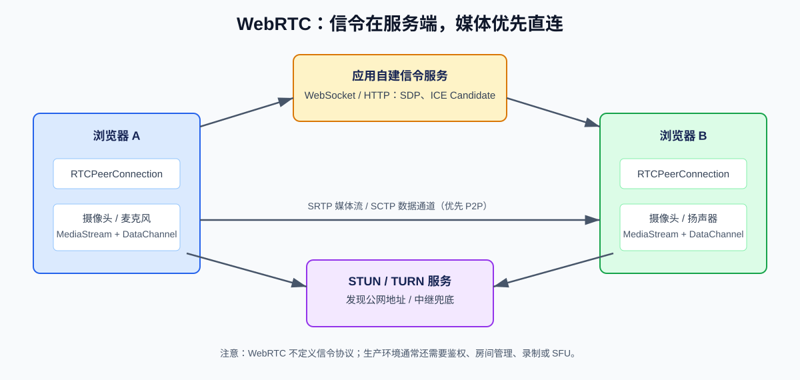
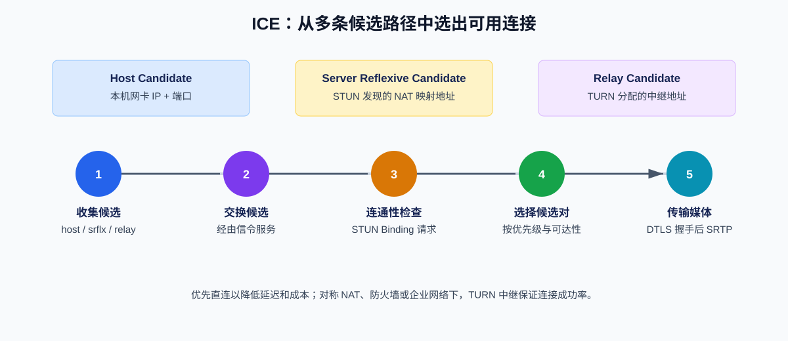
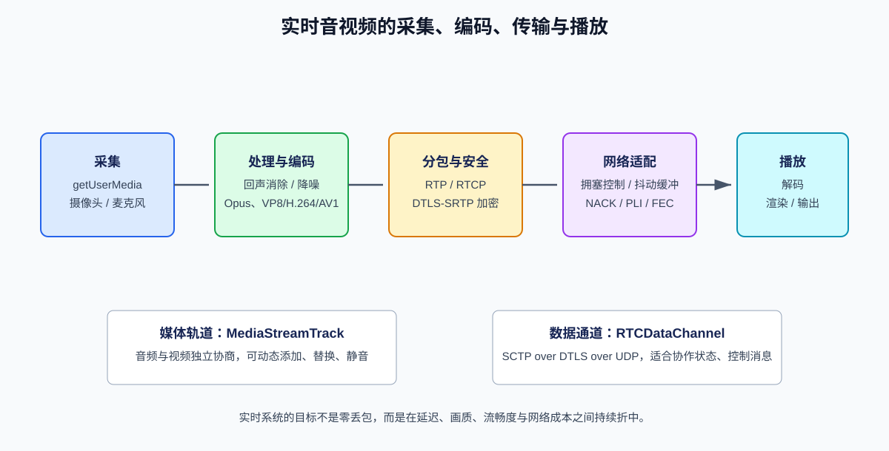
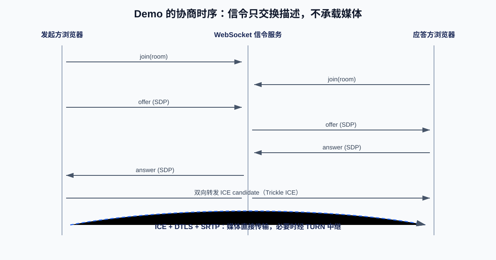

# WebRTC 底层工作原理详解

> WebRTC（Web Real-Time Communication）是一组开放的实时通信标准与浏览器 API。它让网页、移动端和原生应用可以在较低延迟下传输音频、视频和任意二进制数据，并把设备采集、网络穿透、加密传输、拥塞控制等复杂工作交给运行时实现。

## 一、先建立全局认识

### 1.1 什么是 WebRTC

WebRTC 不是一个“视频聊天服务器”，也不是一个单独的 JavaScript 库。它由浏览器、操作系统和网络协议共同实现，向应用暴露一组 API：

- `getUserMedia()`：请求摄像头、麦克风、屏幕等媒体输入。
- `RTCPeerConnection`：协商两个端点的能力，建立和维护音视频连接。
- `RTCDataChannel`：在端点间发送可靠或不可靠的数据消息。
- `MediaStream` / `MediaStreamTrack`：表示一组媒体流及其中的音频、视频轨道。

浏览器实现中通常集成了编解码器、回声消除、自动增益、降噪、网络抖动缓冲、拥塞控制及 DTLS/SRTP 加密。应用开发者不必从 UDP 包开始实现实时通信，却仍可获取统计数据并控制媒体轨道、码率和连接状态。



### 1.2 它主要解决什么问题

传统 Web 应用擅长“请求后得到响应”，例如加载页面、提交表单或下载文件。实时音视频则有不同约束：

1. **端到端延迟敏感**：对话通常希望端到端延迟控制在数百毫秒内；积压后再可靠重传，可能比丢掉旧帧更糟。
2. **网络环境复杂**：家庭路由器、企业防火墙和移动网络中的 NAT 往往阻止外部主机直接访问设备。
3. **网络质量持续变化**：带宽、抖动、丢包率可在数秒内突变，编码器必须随之调整。
4. **媒体处理成本高**：回声消除、降噪、编码、解码及音画同步都需要成熟实现。
5. **安全要求高**：摄像头和麦克风访问必须经用户授权；媒体流在网络上必须加密。

WebRTC 将这些共性能力标准化，使应用可以关注房间、成员、权限、业务状态和产品交互。

### 1.3 WebRTC 不解决什么

WebRTC 也有清晰边界：

- **不定义信令协议**：SDP 与 ICE Candidate 如何在双方间转发，由应用自行选择 WebSocket、HTTP、Socket.IO、MQTT 等实现。
- **不替代业务后端**：鉴权、房间管理、权限控制、消息持久化、计费和审核仍需应用服务器。
- **不保证总能 P2P 直连**：受限网络中需要 TURN 中继服务器。
- **不天然适合大型直播分发**：多人场景常需 SFU 转发服务器；面向海量观众的直播一般使用 CDN 和 HLS/DASH/LL-HLS 等分发体系。

## 二、使用场景、领域与系统位置

### 2.1 典型场景

| 场景 | WebRTC 承担的能力 | 为什么合适 |
| --- | --- | --- |
| 一对一或多人会议 | 摄像头、麦克风、屏幕共享 | 低延迟互动，浏览器直接加入 |
| 在线教育 | 师生连麦、白板同步、屏幕共享 | 音视频与 DataChannel 协作数据并行 |
| 在线问诊 | 医患音视频、候诊状态 | 支持端到端加密传输链路和设备授权 |
| 客服坐席 | 用户与坐席通话、网页嵌入 | 减少插件安装与电话网络依赖 |
| 云游戏与远程桌面 | 控制消息、屏幕视频、音频回传 | 可将交互延迟压得较低 |
| 物联网监控 | 设备或网关实时视频 | 适合小规模、强交互预览 |
| 协同编辑和多人游戏 | `RTCDataChannel` | 可选有序、无序、可靠或部分可靠传输 |

### 2.2 在系统中的位置

以多人会议为例，WebRTC 位于**客户端实时媒体层**和**媒体基础设施层**之间：

```text
浏览器 / 移动 App
  ├─ 业务 UI：会议、成员、聊天、权限
  ├─ WebRTC：采集、编码、传输、解码、播放
  └─ WebSocket：信令、房间状态、控制命令
          │
应用后端：鉴权、房间、令牌、业务事件
          │
媒体基础设施：STUN / TURN / SFU / 录制 / 转码 / 质量监控
```

一对一时媒体尽量点对点传输。多人会议中，每个客户端若向所有其他客户端分别上行一份流，上传带宽会快速耗尽。因此生产系统通常使用 **SFU（Selective Forwarding Unit，选择性转发单元）**：客户端只上行一路或多路流，SFU 按订阅关系转发给其他成员。SFU 通常不解码媒体，延迟和算力成本比 MCU 更低。

| 模式 | 链路 | 适用规模 | 主要取舍 |
| --- | --- | --- | --- |
| P2P | 客户端直连 | 1 对 1，小规模 | 成本低；穿透失败需要 TURN |
| Mesh | 每人连每人 | 2 至 4 人左右 | 简单；带宽随人数快速增长 |
| SFU | 客户端 <-> 转发服务器 | 会议、课堂、互动直播 | 主流方案；需部署媒体服务器 |
| MCU | 客户端 <-> 混流服务器 | 兼容性或合成画面需求 | 下行简单；服务器转码开销高 |

## 三、核心协议和连接建立

### 3.1 信令：让两个陌生端点交换“连接说明书”

建立 WebRTC 连接前，两端需要交换：

- **Offer SDP**：发起方支持的音视频编解码器、媒体方向、传输参数等描述。
- **Answer SDP**：应答方基于自身能力生成的回应。
- **ICE Candidate**：本端可用于通信的地址与端口候选。

这些内容不应该被理解为媒体数据。它们只用于建立连接，通常通过已有的 WebSocket 长连接转发。信令服务只需可靠地把消息路由给正确房间中的正确用户。

### 3.2 SDP：会话能力描述

SDP（Session Description Protocol）是文本格式的会话描述。例如它会包含 `m=audio`、`m=video` 媒体行，所支持的编解码器（Opus、VP8、H.264、AV1 等）、RTP Payload Type、ICE 参数与 DTLS 指纹。

现代浏览器通常通过“统一计划”（Unified Plan）按轨道协商。实际开发中应使用浏览器生成的 SDP，不应手工拼接 SDP；只有在对接特殊网关或排障时才分析其细节。

### 3.3 ICE、STUN 与 TURN：跨越 NAT

ICE（Interactive Connectivity Establishment）负责收集候选路径并进行连通性检查。它会优先寻找直连路径，失败时回退到中继：



候选类型如下：

| 候选 | 来源 | 特征 |
| --- | --- | --- |
| `host` | 本机网络接口 | 局域网内常可直接使用 |
| `srflx` | STUN 服务返回的公网映射 | 可帮助 NAT 后设备发现对外地址 |
| `relay` | TURN 服务分配 | 通过服务器中继，成功率最高但有带宽成本 |

- **STUN**：回答“服务器看到我的公网 IP 和端口是什么”。它不转发媒体，成本较低。
- **TURN**：当双方无法直连时，转发媒体数据。生产环境必须部署 TURN，才能获得稳定连接成功率。

ICE 连通性检查底层使用 STUN Binding 请求。双方会尝试候选对，并根据优先级与连通性选出可用路径。候选可在 SDP 生成后持续收集和交换，这叫 **Trickle ICE**，能缩短首帧时间。

### 3.4 DTLS、SRTP 与 SCTP：安全传输

WebRTC 强制保护通信内容：

- **DTLS**：在 UDP 上完成握手与密钥协商，并用 SDP 中的指纹校验对端身份。
- **SRTP / SRTCP**：承载加密后的 RTP 媒体数据与 RTCP 控制反馈。
- **SCTP over DTLS over UDP**：`RTCDataChannel` 的常见传输栈，支持多路数据流和部分可靠传输。

媒体内容默认不会明文通过网络。需要注意的是：常规 SFU 能解密并转发媒体；若要让 SFU 也无法看到内容，需采用 Insertable Streams 实现端到端加密（E2EE），这会增加密钥管理、录制与服务端处理的复杂度。

## 四、音视频如何在低延迟下传输

### 4.1 从采集到播放



一条视频轨道大致经历：

1. 浏览器向用户请求摄像头或屏幕权限，获得 `MediaStreamTrack`。
2. 前处理模块执行回声消除、自动增益控制和噪声抑制等操作。
3. 编码器使用协商后的编码格式压缩帧。
4. RTP 将编码数据切为网络包，DTLS-SRTP 加密后通过选定的 ICE 路径发送。
5. 接收端根据序列号、时间戳与 RTCP 反馈处理乱序、丢包和抖动。
6. 解码器还原媒体帧，浏览器同步后渲染到 `<video>` 或输出到扬声器。

### 4.2 RTP、RTCP 和拥塞控制

- **RTP**：承载音频、视频包，包含序列号、时间戳、SSRC 等信息。
- **RTCP**：反馈接收质量，如丢包、往返时延、抖动、关键帧请求（PLI/FIR）等。
- **拥塞控制**：发送端依据反馈动态调整可用码率、帧率、分辨率和层级，避免持续塞满网络。

实时通信的原则不是“绝不丢包”。对过期视频帧进行重传可能增加延迟，因此 WebRTC 会在可靠性、清晰度和实时性之间权衡。音频通常更重视连续性；视频可降帧、降分辨率或请求关键帧。

### 4.3 Simulcast 与 SVC

多人会议中，每个人的网络条件不同：

- **Simulcast**：同一视频编码多个不同分辨率/码率的独立流，例如低、中、高三层，SFU 按订阅者网络选择转发。
- **SVC（可伸缩视频编码）**：一个编码流包含基础层和增强层，接收端按能力解出相应层。

这两项能力是大规模会议中“弱网不拖垮全场”的重要基础。浏览器与 SFU 对具体编解码器、层级方式的兼容性需要实际验证。

## 五、浏览器 API 速览

```js
// 采集本地音视频
const stream = await navigator.mediaDevices.getUserMedia({
  audio: true,
  video: { width: 1280, height: 720, frameRate: { ideal: 30 } },
});

// 创建连接，并将媒体轨道加入连接
const pc = new RTCPeerConnection({
  iceServers: [{ urls: "stun:stun.example.com:3478" }],
});

for (const track of stream.getTracks()) {
  pc.addTrack(track, stream);
}

// 接收远端轨道
pc.ontrack = (event) => {
  remoteVideo.srcObject = event.streams[0];
};

// 创建数据通道
const channel = pc.createDataChannel("control", { ordered: true });
channel.onmessage = (event) => console.log(event.data);
```

浏览器只有在安全上下文（HTTPS 或 `localhost`）下才允许访问摄像头和麦克风。用户拒绝权限、设备不存在或设备被其他应用占用时，都应在 UI 中提供明确处理。

## 六、实战案例：两人浏览器视频通话

### 6.1 目标与目录

下面的最小 Demo 实现两人房间的视频通话。信令服务仅转发 `offer`、`answer`、`candidate` 消息；浏览器直接建立 WebRTC 连接。

```text
webrtc-demo/
├─ server.mjs       # WebSocket 信令服务
└─ public/
   └─ index.html    # 浏览器页面
```



### 6.2 信令服务：`server.mjs`

初始化项目并安装依赖：

```bash
npm init -y
npm install ws@8.18.0
```

创建如下服务。它限制每个房间最多两人，并且**只转发消息，不信任客户端传来的身份字段**：

```js
import { createServer } from "node:http";
import { WebSocketServer, WebSocket } from "ws";
import { readFile } from "node:fs/promises";
import { join } from "node:path";

const publicDir = join(process.cwd(), "public");
const rooms = new Map();

const server = createServer(async (request, response) => {
  if (request.url !== "/" && request.url !== "/index.html") {
    response.writeHead(404).end();
    return;
  }

  try {
    const html = await readFile(join(publicDir, "index.html"));
    response.writeHead(200, { "Content-Type": "text/html; charset=utf-8" });
    response.end(html);
  } catch {
    response.writeHead(500).end("页面加载失败");
  }
});

const wss = new WebSocketServer({ server });

function leaveRoom(socket) {
  const room = rooms.get(socket.roomId);
  if (!room) return;

  room.delete(socket);
  if (room.size === 0) rooms.delete(socket.roomId);
  for (const peer of room) {
    if (peer.readyState === WebSocket.OPEN) {
      peer.send(JSON.stringify({ type: "peer-left" }));
    }
  }
}

function relay(socket, payload) {
  const room = rooms.get(socket.roomId);
  if (!room) return;

  for (const peer of room) {
    if (peer !== socket && peer.readyState === WebSocket.OPEN) {
      peer.send(JSON.stringify(payload));
    }
  }
}

wss.on("connection", (socket) => {
  socket.on("message", (buffer) => {
    let message;
    try {
      message = JSON.parse(buffer.toString());
    } catch {
      socket.close(1008, "无效 JSON");
      return;
    }

    if (message.type === "join") {
      const roomId = String(message.roomId ?? "").trim();
      if (!/^[a-zA-Z0-9_-]{1,64}$/.test(roomId)) {
        socket.close(1008, "无效房间号");
        return;
      }

      const room = rooms.get(roomId) ?? new Set();
      if (room.size >= 2) {
        socket.send(JSON.stringify({ type: "room-full" }));
        return;
      }

      socket.roomId = roomId;
      room.add(socket);
      rooms.set(roomId, room);
      socket.send(JSON.stringify({ type: "joined", initiator: room.size === 1 }));
      if (room.size === 2) relay(socket, { type: "peer-ready" });
      return;
    }

    if (!socket.roomId || !["offer", "answer", "candidate"].includes(message.type)) {
      return;
    }

    relay(socket, message);
  });

  socket.on("close", () => leaveRoom(socket));
});

server.listen(3000);
```

> 生产服务应接入结构化日志、限流、鉴权和监控。示例为了聚焦信令流程，省略了日志基础设施。

### 6.3 客户端：`public/index.html`

```html
<!doctype html>
<html lang="zh-CN">
  <head>
    <meta charset="utf-8">
    <meta name="viewport" content="width=device-width, initial-scale=1">
    <title>WebRTC 双人通话</title>
    <style>
      body { max-width: 960px; margin: 32px auto; font-family: system-ui, sans-serif; }
      .toolbar, .videos { display: flex; gap: 12px; flex-wrap: wrap; }
      input, button { padding: 8px 12px; font-size: 16px; }
      video { width: min(460px, 100%); background: #111; aspect-ratio: 16 / 9; }
      #status { color: #475569; }
    </style>
  </head>
  <body>
    <h1>WebRTC 双人通话</h1>
    <div class="toolbar">
      <input id="roomId" value="demo-room" maxlength="64" aria-label="房间号">
      <button id="joinButton">加入房间</button>
      <button id="hangupButton" disabled>挂断</button>
      <span id="status">未连接</span>
    </div>
    <div class="videos">
      <section><h2>本地</h2><video id="localVideo" autoplay muted playsinline></video></section>
      <section><h2>远端</h2><video id="remoteVideo" autoplay playsinline></video></section>
    </div>

    <script>
      const localVideo = document.querySelector("#localVideo");
      const remoteVideo = document.querySelector("#remoteVideo");
      const roomIdInput = document.querySelector("#roomId");
      const joinButton = document.querySelector("#joinButton");
      const hangupButton = document.querySelector("#hangupButton");
      const status = document.querySelector("#status");

      let socket;
      let peerConnection;
      let localStream;
      let isInitiator = false;
      let pendingCandidates = [];

      const iceServers = [
        // 本地同网段测试可留空；生产环境替换为自建 STUN/TURN。
        { urls: "stun:stun.l.google.com:19302" },
      ];

      function setStatus(text) {
        status.textContent = text;
      }

      function send(message) {
        if (socket?.readyState === WebSocket.OPEN) {
          socket.send(JSON.stringify(message));
        }
      }

      async function getLocalStream() {
        if (localStream) return localStream;
        localStream = await navigator.mediaDevices.getUserMedia({
          audio: true,
          video: { width: { ideal: 1280 }, height: { ideal: 720 } },
        });
        localVideo.srcObject = localStream;
        return localStream;
      }

      async function ensurePeerConnection() {
        if (peerConnection) return peerConnection;
        const stream = await getLocalStream();
        peerConnection = new RTCPeerConnection({ iceServers });

        for (const track of stream.getTracks()) {
          peerConnection.addTrack(track, stream);
        }

        peerConnection.ontrack = ({ streams }) => {
          remoteVideo.srcObject = streams[0];
        };

        peerConnection.onicecandidate = ({ candidate }) => {
          if (candidate) send({ type: "candidate", candidate });
        };

        peerConnection.onconnectionstatechange = () => {
          setStatus(`连接状态：${peerConnection.connectionState}`);
          if (["failed", "closed"].includes(peerConnection.connectionState)) {
            closePeerConnection();
          }
        };

        return peerConnection;
      }

      async function createOffer() {
        const pc = await ensurePeerConnection();
        const offer = await pc.createOffer();
        await pc.setLocalDescription(offer);
        send({ type: "offer", sdp: pc.localDescription });
        setStatus("已发送 Offer，等待对方加入");
      }

      async function addCandidate(candidate) {
        if (!peerConnection?.remoteDescription) {
          pendingCandidates.push(candidate);
          return;
        }
        await peerConnection.addIceCandidate(candidate);
      }

      async function flushCandidates() {
        for (const candidate of pendingCandidates) {
          await peerConnection.addIceCandidate(candidate);
        }
        pendingCandidates = [];
      }

      async function handleSignal(message) {
        if (message.type === "joined") {
          isInitiator = message.initiator;
          setStatus(isInitiator ? "已加入，等待对方" : "已加入，等待 Offer");
          return;
        }

        if (message.type === "peer-ready" && isInitiator) {
          await createOffer();
          return;
        }

        if (message.type === "offer") {
          const pc = await ensurePeerConnection();
          await pc.setRemoteDescription(message.sdp);
          await flushCandidates();
          const answer = await pc.createAnswer();
          await pc.setLocalDescription(answer);
          send({ type: "answer", sdp: pc.localDescription });
          return;
        }

        if (message.type === "answer") {
          await peerConnection.setRemoteDescription(message.sdp);
          await flushCandidates();
          return;
        }

        if (message.type === "candidate") {
          await addCandidate(message.candidate);
          return;
        }

        if (message.type === "peer-left") {
          remoteVideo.srcObject = null;
          setStatus("对方已离开");
        }

        if (message.type === "room-full") {
          setStatus("房间已满");
          socket.close();
        }
      }

      function closePeerConnection() {
        peerConnection?.close();
        peerConnection = undefined;
        pendingCandidates = [];
        remoteVideo.srcObject = null;
      }

      joinButton.addEventListener("click", async () => {
        try {
          await getLocalStream();
          const roomId = roomIdInput.value.trim();
          socket = new WebSocket(`ws://${location.host}`);
          socket.onopen = () => send({ type: "join", roomId });
          socket.onmessage = (event) => handleSignal(JSON.parse(event.data))
            .catch((error) => setStatus(`信令处理失败：${error.message}`));
          socket.onerror = () => setStatus("信令连接失败");
          socket.onclose = () => { if (!peerConnection) setStatus("信令已断开"); };
          joinButton.disabled = true;
          hangupButton.disabled = false;
        } catch (error) {
          setStatus(`无法启用设备：${error.message}`);
        }
      });

      hangupButton.addEventListener("click", () => {
        closePeerConnection();
        socket?.close();
        localStream?.getTracks().forEach((track) => track.stop());
        localStream = undefined;
        localVideo.srcObject = null;
        joinButton.disabled = false;
        hangupButton.disabled = true;
        setStatus("已挂断");
      });
    </script>
  </body>
</html>
```

### 6.4 运行与验证

```bash
node server.mjs
```

在同一台设备的两个浏览器窗口中打开 `http://localhost:3000`，输入相同房间号并点击“加入房间”。第二个客户端加入后，发起方创建 Offer，双方即可开始协商。首次访问时允许浏览器使用摄像头与麦克风。

> 该示例适合学习连接流程。跨公网测试时，公共 STUN 只用于演示，不能保证可用；应配置受控的 TURN 服务，并把页面和 WebSocket 升级为 HTTPS/WSS。

## 七、生产落地清单

### 7.1 网络和安全

- 使用 HTTPS 与 WSS，配置受信任证书。
- 部署 STUN/TURN，TURN 使用短期凭据（如 time-limited HMAC credentials），不要把长期密码写入前端。
- 限制 TURN 的可用端口范围和中继带宽，配合防火墙、配额和监控。
- 在信令连接建立前验证用户身份和房间权限；校验所有信令消息大小、类型与速率。
- 对录制、转写和媒体留存明确告知并符合隐私与合规要求。

### 7.2 质量监控

通过 `RTCPeerConnection.getStats()` 定期采集下列指标：

| 指标 | 意义 | 常见处理 |
| --- | --- | --- |
| `packetsLost` / 丢包率 | 网络是否拥塞或不稳定 | 降码率、启用更低层流 |
| `jitter` | 到包时间波动 | 观察弱网、调整缓冲策略 |
| `roundTripTime` | 往返时延 | 就近部署 TURN/SFU |
| `framesPerSecond` | 实际渲染或编码帧率 | 降分辨率、检查 CPU |
| `availableOutgoingBitrate` | 可用上行带宽估计 | 调整发送编码参数 |
| `candidate-pair` 类型 | 是否走 TURN 中继 | 分析 NAT 穿透成功率与成本 |

不要只用“是否接通”衡量体验。首帧耗时、音频卡顿率、视频冻结率、重连成功率、TURN 使用率和不同地区的网络质量都应进入可观测体系。

## 八、未来发展趋势

1. **AV1 与硬件编码普及**：在同等画质下更节省带宽，但设备硬件能力与兼容性仍决定实际策略。
2. **端到端加密能力增强**：Insertable Streams 让会议产品能够在 SFU 架构中提供更强的内容保密性。
3. **WebCodecs、WebTransport 协同**：WebCodecs 提供更细的编解码控制；WebTransport 适合需要自定义传输语义的低延迟应用。它们扩展 WebRTC 的能力边界，而非简单替代。
4. **面向 AI 的实时媒体处理**：实时字幕、语音识别、虚拟背景、智能降噪、翻译与会议纪要会更多嵌入媒体链路，但需谨慎处理延迟、隐私和算力成本。
5. **更成熟的大规模媒体基础设施**：SFU 的自适应转发、多区域调度、录制、转写和质量分析会成为标准能力；客户端仍以 WebRTC 承担最后一公里实时交互。

## 九、总结

WebRTC 的核心价值是把实时媒体最难的通用问题标准化：浏览器负责采集、编码、抗弱网、安全传输与播放；应用负责信令、身份、房间和业务规则；STUN/TURN 解决可达性，SFU 解决多人扩展。

理解 WebRTC 时，始终抓住这条主线：

```text
信令交换 Offer / Answer / Candidate
        ↓
ICE 选择直连或 TURN 中继路径
        ↓
DTLS 建立密钥，SRTP 加密 RTP 媒体
        ↓
RTCP 反馈网络状态，编码器持续自适应
```

## 参考资料

- [WebRTC 官方站点](https://webrtc.org/)
- [MDN：WebRTC API](https://developer.mozilla.org/zh-CN/docs/Web/API/WebRTC_API)
- [RFC 8445：Interactive Connectivity Establishment (ICE)](https://www.rfc-editor.org/rfc/rfc8445)
- [RFC 5766：Traversal Using Relays around NAT (TURN)](https://www.rfc-editor.org/rfc/rfc5766)
- [RFC 8825：Overview: Real-Time Protocols for Browser-Based Applications](https://www.rfc-editor.org/rfc/rfc8825)
