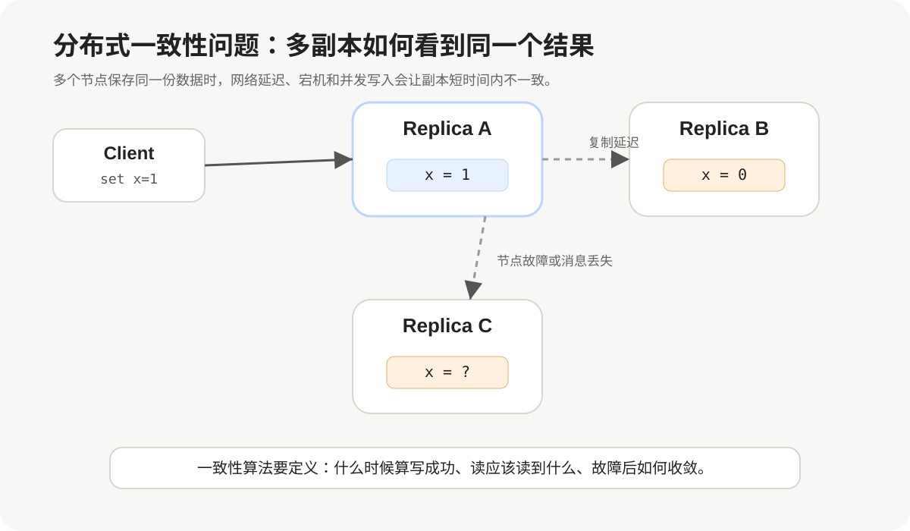
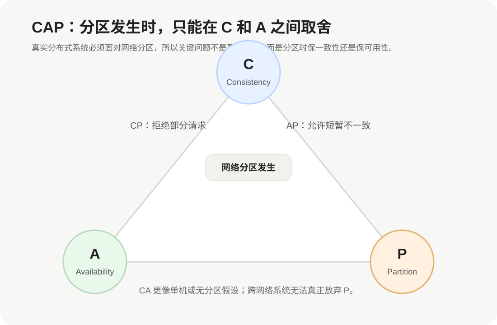
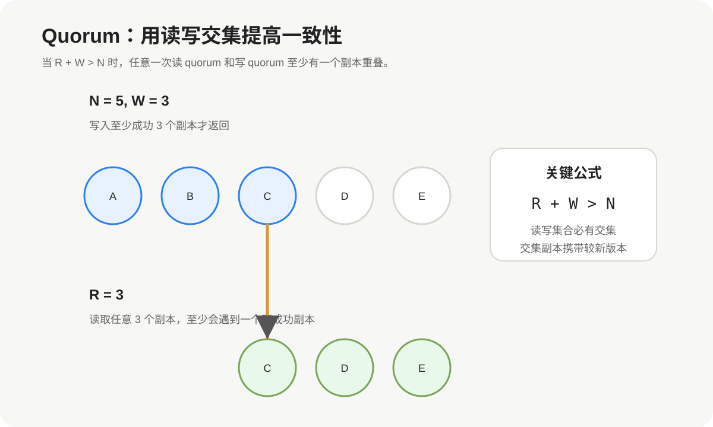
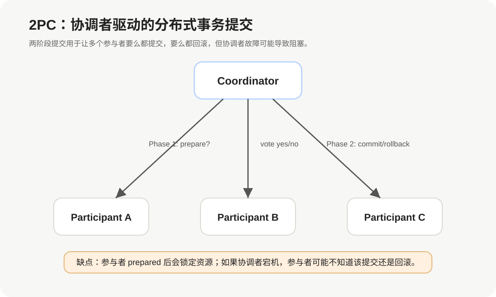
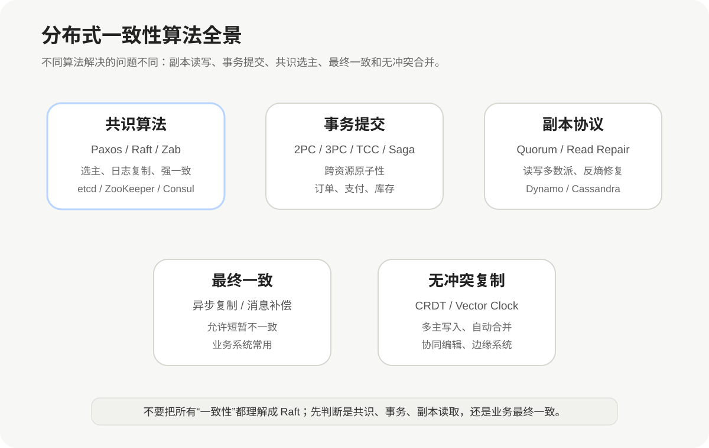

# 分布式一致性算法

## 1. 一致性到底在解决什么

分布式系统最核心的矛盾是：

> 数据被复制到了多台机器上，但用户希望它看起来像只有一份。

如果只有一台机器，写入和读取都很简单：

```text
Client -> Server -> Disk
```

但在分布式系统中，为了高可用和容灾，我们通常会保存多个副本：

```text
Replica A
Replica B
Replica C
```

这时问题就来了：

- 写入 A 成功，但 B 还没同步，读 B 应该返回旧值还是新值？
- A 宕机了，B 能不能接管？
- 网络分区后，两边都能写，会不会产生冲突？
- 多个客户端同时写入，最终顺序如何确定？
- 写入返回成功后，未来是否一定能读到？



分布式一致性算法就是为了解决这些问题。它不只是“同步数据”，而是定义：

1. **写入什么时候算成功**。
2. **读取应该看到什么结果**。
3. **节点故障后如何恢复一致**。
4. **多个副本出现冲突时谁说了算**。

---

## 2. 先区分几个容易混淆的概念

### 2.1 一致性不是一种东西

“一致性”在不同语境下含义不完全一样。

| 概念 | 关注点 | 示例 |
|---|---|---|
| 数据一致性 | 多个副本数据是否相同 | Redis 主从、MySQL 主从 |
| 事务一致性 | 事务执行前后是否满足约束 | 转账后总金额不变 |
| 线性一致性 | 操作看起来像按真实时间顺序在单机上执行 | etcd 写后读 |
| 最终一致性 | 短时间可不一致，但最终收敛 | DNS、异步缓存 |
| 共识 Consensus | 多节点对一个值或日志顺序达成一致 | Raft、Paxos |

工程里说“一致性算法”，通常可能指三类东西：

```text
副本一致性：Quorum、Read Repair、Gossip
事务一致性：2PC、3PC、TCC、Saga
共识算法：Paxos、Raft、Zab
```

这几类问题相关，但不能混为一谈。

### 2.2 一致性和可用性经常冲突

分布式系统会遇到网络分区：

```text
一部分节点互相能通信，另一部分节点互相能通信，
但两部分之间暂时无法通信。
```

这时系统面临选择：

- 为了保证一致性，拒绝一部分请求。
- 为了保证可用性，允许不同分区短暂产生不同数据。

这就是 CAP 理论讨论的核心。



---

## 3. CAP 理论

CAP 指三个属性：

| 属性 | 含义 |
|---|---|
| C - Consistency | 一致性，所有节点看到同样的新数据 |
| A - Availability | 可用性，每个请求都能收到非错误响应 |
| P - Partition Tolerance | 分区容错，网络分区时系统仍能继续工作 |

CAP 的关键不是“三选二”这么简单，而是：

> 真实分布式系统必须面对网络分区，所以发生分区时，只能在 C 和 A 之间做取舍。

### 3.1 CP 系统

CP 系统优先保证一致性。

当网络分区发生时，如果某个分区没有多数派，它会拒绝写入。

典型系统：

- etcd
- ZooKeeper
- Consul
- HBase 的元数据协调

适合场景：

- 配置中心
- 分布式锁
- 元数据管理
- 选主协调
- 金融核心账务的关键状态

CP 系统的态度是：

```text
宁可暂时不可用，也不能返回错误的新状态。
```

### 3.2 AP 系统

AP 系统优先保证可用性。

网络分区时，各个分区仍然可以处理请求，但可能产生短暂不一致，之后再通过冲突解决、版本合并、异步修复来收敛。

典型系统：

- Dynamo 风格系统
- Cassandra
- Riak
- 某些多活业务系统

适合场景：

- 用户动态
- 点赞计数
- 推荐特征
- 日志采集
- 可容忍短暂不一致的业务数据

AP 系统的态度是：

```text
先让请求成功，之后再修复冲突。
```

### 3.3 CA 系统

CA 通常只在没有网络分区的假设下成立，例如单机数据库或局域网内强假设系统。

但只要是真正跨网络的分布式系统，就不能假设永远没有 P。

因此工程里更常见的问题是：

```text
我这个业务在分区时应该偏 CP，还是偏 AP？
```

---

## 4. 一致性模型

不同业务对“一致”的要求不同。

### 4.1 强一致性

强一致性通常指写入成功后，后续读取一定能读到最新结果。

例如：

```text
用户修改密码成功后，下一次登录必须使用新密码。
```

强一致适合：

- 账号密码
- 权限配置
- 分布式锁
- 库存扣减的关键链路
- 金融账务

代价：

- 延迟更高
- 可用性更低
- 需要协调多数节点或中心节点

### 4.2 线性一致性

线性一致性是非常强的一致性模型。

它要求所有操作看起来像按照真实时间顺序，在一台单机上串行执行。

如果操作 A 在时间上先完成，操作 B 后开始，那么 B 必须看到 A 的结果。

```text
T1: write x=1 完成
T2: read x 开始

线性一致要求：
read x 必须返回 1
```

Raft、Paxos 这类共识算法通常可以构建线性一致的读写服务。

### 4.3 顺序一致性

顺序一致性要求所有节点看到相同的操作顺序，但这个顺序不一定符合真实时间。

它比线性一致性弱。

例如真实时间上 A 先完成，B 后开始，但系统内部可以表现为 B 在 A 前面，只要所有节点看到的顺序一致即可。

### 4.4 因果一致性

因果一致性只保证有因果关系的操作顺序。

例如：

```text
用户发布帖子
  -> 另一个用户评论该帖子
```

评论依赖帖子存在，所以所有人都应该先看到帖子，再看到评论。

但两个互不相关的帖子，可以在不同节点上以不同顺序出现。

### 4.5 最终一致性

最终一致性允许短时间不一致，但如果没有新的写入，所有副本最终会收敛到同一个值。

例如：

- DNS 解析
- CDN 缓存
- 用户头像缓存
- 商品搜索索引
- 订单状态异步同步到数据仓库

最终一致的核心是：

```text
短期允许不一致，但必须有补偿、重试、修复和对账机制。
```

---

## 5. Quorum 算法

Quorum 是一种常见的副本读写机制。

它通过设置读写副本数量，让读集合和写集合产生交集，从而提高一致性。



### 5.1 N、R、W

Quorum 通常用三个参数描述：

| 参数 | 含义 |
|---|---|
| N | 副本总数 |
| W | 写入成功需要的副本数 |
| R | 读取需要的副本数 |

只要满足：

```text
R + W > N
```

任意一次读和任意一次写就一定有交集。

### 5.2 示例

假设：

```text
N = 3
W = 2
R = 2
```

写入时至少写成功 2 个副本。

读取时至少读 2 个副本。

因为：

```text
R + W = 4 > 3
```

所以读到的两个副本里，至少有一个副本包含最近一次成功写入。

### 5.3 Quorum 的常见配置

| 配置 | 特点 | 适用场景 |
|---|---|---|
| W=N, R=1 | 写很慢，读很快 | 读多写少、要求读最新 |
| W=1, R=N | 写很快，读很慢 | 写多读少 |
| W=多数, R=多数 | 读写平衡 | 常见配置 |
| W=1, R=1 | 性能好，一致性弱 | 缓存、日志类数据 |

### 5.4 Quorum 不等于强一致

Quorum 只是提供读写交集，但还需要版本号、时间戳、向量时钟等机制判断哪个值更新。

如果存在并发写入：

```text
Client A 写 x=1
Client B 写 x=2
```

不同副本可能看到不同顺序。

这时仅有 Quorum 不够，还需要冲突检测和解决策略。

---

## 6. 两阶段提交 2PC

2PC 全称是 Two-Phase Commit，用来解决分布式事务的原子提交问题。

它关注的是：

> 多个资源参与同一个事务时，要么全部提交，要么全部回滚。



### 6.1 2PC 的两个阶段

#### 第一阶段：Prepare

协调者询问所有参与者：

```text
这笔事务你能不能提交？
```

参与者会做本地检查：

- 资源是否可用
- 约束是否满足
- 是否能写入 undo/redo 日志
- 是否可以锁定相关资源

如果可以提交，返回 `YES`。

如果不能提交，返回 `NO`。

#### 第二阶段：Commit / Rollback

如果所有参与者都返回 `YES`：

```text
Coordinator -> Participants: COMMIT
```

只要有一个参与者返回 `NO`：

```text
Coordinator -> Participants: ROLLBACK
```

### 6.2 2PC 的优点

2PC 的优点是语义清晰：

```text
所有参与者统一提交或统一回滚。
```

适合对原子性要求高的场景，例如传统数据库 XA 事务。

### 6.3 2PC 的问题

2PC 最大的问题是阻塞。

如果参与者已经 Prepare 成功，它就必须等待协调者的最终决定。

这期间资源通常被锁住：

```text
参与者已经 prepared
  -> 锁住资源
  -> 协调者宕机
  -> 不知道该提交还是回滚
  -> 阻塞等待
```

所以 2PC 在高并发互联网业务中使用要谨慎。

---

## 7. 三阶段提交 3PC

3PC 是对 2PC 的改进，试图降低阻塞风险。

它把 2PC 的 Prepare 阶段拆得更细：

```text
CanCommit
  -> PreCommit
  -> DoCommit
```

### 7.1 3PC 的三个阶段

| 阶段 | 说明 |
|---|---|
| CanCommit | 询问参与者是否具备提交条件 |
| PreCommit | 参与者预提交，写入必要日志 |
| DoCommit | 真正提交 |

3PC 引入超时机制，参与者在某些阶段等待超时后可以自行决策。

### 7.2 3PC 的局限

3PC 仍然不能完全解决网络分区下的一致性问题。

在复杂故障场景中，参与者可能做出不同决定。

因此 3PC 在真实工程中不如 2PC、TCC、Saga、Raft 这类方案常见。

---

## 8. TCC

TCC 是 Try-Confirm-Cancel 的缩写，常用于业务层分布式事务。

它不是数据库协议，而是一种业务补偿模式。

### 8.1 TCC 三个阶段

| 阶段 | 作用 | 示例 |
|---|---|---|
| Try | 预留资源 | 冻结库存、冻结余额 |
| Confirm | 确认提交 | 真正扣库存、扣余额 |
| Cancel | 取消回滚 | 释放冻结库存、释放冻结余额 |

以订单支付为例：

```text
Try:
  冻结用户余额
  冻结商品库存

Confirm:
  扣减余额
  扣减库存
  创建订单

Cancel:
  解冻余额
  解冻库存
```

### 8.2 TCC 的优点

- 不需要长时间锁数据库事务
- 业务可控性强
- 适合核心交易链路

### 8.3 TCC 的缺点

- 每个接口都要实现 Try / Confirm / Cancel
- 业务侵入性强
- 要处理幂等、空回滚、悬挂等问题

常见坑：

| 问题 | 说明 |
|---|---|
| 幂等 | Confirm 或 Cancel 可能被重复调用 |
| 空回滚 | Try 没执行成功，但 Cancel 被调用 |
| 悬挂 | Cancel 先到，Try 后到 |

---

## 9. Saga

Saga 是另一种业务层最终一致方案。

它把一个大事务拆成多个本地事务，每个本地事务都有对应补偿操作。

例如下单流程：

```text
创建订单
  -> 扣减库存
  -> 扣减余额
  -> 发送消息
```

如果扣减余额失败，就执行补偿：

```text
退还库存
取消订单
```

### 9.1 Saga 的两种模式

| 模式 | 说明 |
|---|---|
| 编排式 Orchestration | 有一个中心协调器控制流程 |
| 协同式 Choreography | 服务之间通过事件驱动推进流程 |

### 9.2 Saga 适合什么场景

Saga 适合长流程业务：

- 订单履约
- 物流调度
- 审批流程
- 跨服务状态流转

它不适合要求强一致瞬时完成的账务核心逻辑。

---

## 10. 共识算法：Paxos、Raft、Zab

共识算法解决的问题是：

> 多个节点如何对同一个值，或同一串日志顺序达成一致。

它比普通副本同步更严格。

常见共识算法包括：



| 算法 | 典型系统 | 特点 |
|---|---|---|
| Paxos | Chubby、Spanner 思想基础 | 理论经典，但理解和实现难 |
| Raft | etcd、Consul、TiKV PD | 强 Leader，易理解，工程常用 |
| Zab | ZooKeeper | 面向主备复制和原子广播 |

### 10.1 Paxos

Paxos 是经典共识算法，用于在不可靠网络中让多数节点对一个值达成一致。

它有几个角色：

| 角色 | 说明 |
|---|---|
| Proposer | 提案者，提出值 |
| Acceptor | 接受者，对提案投票 |
| Learner | 学习者，学习最终被选定的值 |

Paxos 的核心思想是：

```text
通过编号递增的提案，让多数 Acceptor 选择同一个值。
```

Paxos 理论非常强，但工程实现复杂。

实际系统通常使用 Multi-Paxos，通过稳定 Leader 减少通信轮次。

### 10.2 Raft

Raft 的设计目标是更容易理解。

它把共识问题拆成：

```text
Leader 选举
日志复制
安全性约束
成员变更
日志压缩
```

Raft 的核心逻辑：

1. 所有写请求交给 Leader。
2. Leader 把写请求转成日志。
3. 日志复制到多数节点后提交。
4. 新 Leader 必须包含已提交日志。

关于 Raft 的完整细节，可以参考同目录文章：[Raft 协议详解](Raft%20协议详解.md)。

### 10.3 Zab

Zab 是 ZooKeeper 使用的原子广播协议。

它和 Raft 类似，也有 Leader，也通过日志复制保证顺序一致。

Zab 更贴近 ZooKeeper 的设计：

- Leader 负责广播事务 Proposal
- Follower 写入日志并 ACK
- 多数 ACK 后 Leader 提交
- 恢复阶段保证新 Leader 拥有最新已提交事务

可以粗略理解为：

```text
Zab 是 ZooKeeper 体系下的主从日志复制共识协议。
```

---

## 11. Gossip 协议

Gossip 不是强一致共识算法，而是一种去中心化的信息传播协议。

它的思路类似“流言传播”：

```text
每个节点周期性随机找几个节点交换信息。
```

经过多轮传播后，信息会扩散到整个集群。

### 11.1 Gossip 适合什么

Gossip 适合：

- 节点发现
- 状态传播
- 故障探测
- 最终一致副本同步

典型系统：

- Cassandra
- Consul 的成员发现
- Redis Cluster 节点状态传播

### 11.2 Gossip 的特点

优点：

- 去中心化
- 扩展性好
- 单点故障少
- 适合大规模集群

缺点：

- 收敛需要时间
- 不保证强一致
- 消息传播有冗余

---

## 12. Vector Clock

Vector Clock 用于判断事件之间的因果关系。

在多主写入系统中，不同节点可能同时写同一个 key：

```text
Node A: x = 1
Node B: x = 2
```

如果没有全局时钟，很难判断谁先谁后。

Vector Clock 用每个节点的版本向量表示因果历史。

例如：

```text
value1: {A: 3, B: 1}
value2: {A: 2, B: 2}
```

如果两个版本互相不能覆盖，就说明它们是并发冲突，需要业务合并。

适合场景：

- 多主复制
- 离线写入同步
- Dynamo 风格系统
- 协同系统冲突检测

---

## 13. CRDT

CRDT 全称是 Conflict-free Replicated Data Type，即无冲突复制数据类型。

它的目标是：

> 多个副本可以独立更新，之后自动合并，并且最终收敛到同一个结果。

CRDT 常见类型：

| 类型 | 示例 |
|---|---|
| G-Counter | 只增计数器 |
| PN-Counter | 可增可减计数器 |
| OR-Set | 可添加删除集合 |
| LWW-Register | 最后写入获胜寄存器 |

CRDT 适合：

- 协同编辑
- 离线优先应用
- 多地域边缘写入
- 点赞、计数、集合类数据

CRDT 不适合所有业务。

例如金融账户余额不能简单用 CRDT 自动合并，因为业务约束比数据结构合并更复杂。

---

## 14. 常见算法对比

| 方案 | 一致性强度 | 可用性 | 延迟 | 业务侵入 | 典型场景 |
|---|---|---|---|---|---|
| Raft | 强 | 中 | 中 | 低 | 元数据、配置、锁 |
| Paxos | 强 | 中 | 中 | 低 | 共识内核 |
| Zab | 强 | 中 | 中 | 低 | ZooKeeper |
| Quorum | 可强可弱 | 中高 | 可调 | 低 | 多副本存储 |
| 2PC | 强原子性 | 低 | 高 | 中 | XA 事务 |
| TCC | 最终一致/业务强约束 | 中 | 中 | 高 | 交易核心链路 |
| Saga | 最终一致 | 高 | 中高 | 中高 | 长业务流程 |
| Gossip | 最终一致 | 高 | 低 | 低 | 状态传播 |
| CRDT | 最终一致 | 高 | 低 | 中 | 多主协同 |

---

## 15. 如何选型

### 15.1 配置中心、注册中心、分布式锁

推荐：

```text
Raft / Zab
```

原因：

- 数据量通常不大
- 一致性要求高
- 写入频率相对可控
- 不能出现两个 Leader 或两把锁同时成功

典型系统：

- etcd
- ZooKeeper
- Consul

### 15.2 订单、支付、库存

推荐根据链路拆分：

```text
核心状态：本地事务 + 强约束
跨服务流程：TCC / Saga / 可靠消息
关键配置：Raft / ZooKeeper / etcd
```

例如下单：

```text
库存预占：TCC Try
支付扣款：本地事务 + 幂等
订单状态流转：可靠消息 + Saga 补偿
```

不要为了“分布式事务”直接套 2PC 到所有服务上。

### 15.3 缓存和搜索索引

推荐：

```text
最终一致 + 异步修复
```

例如：

```text
数据库写入成功
  -> 发送消息
  -> 更新缓存/索引
  -> 失败后重试
  -> 定期对账修复
```

搜索索引和缓存通常不需要强一致。

### 15.4 多地域多活

多地域多活的核心难点是跨地域延迟高。

如果所有写入都走强一致共识，延迟会很高。

常见策略：

```text
关键数据：单主写入或分区归属
非关键数据：最终一致
可合并数据：CRDT
冲突数据：业务规则解决
```

不要轻易在跨地域之间跑一个强一致 Raft 集群。

---

## 16. 工程实践中的关键问题

### 16.1 幂等

分布式系统中，重试是常态。

只要有重试，就必须考虑幂等：

```text
同一个请求执行一次和执行多次，结果应该一致。
```

常见做法：

- 请求携带唯一 `request_id`
- 服务端记录处理结果
- 重复请求直接返回第一次结果
- 数据库加唯一索引防重复

### 16.2 超时

超时不等于失败。

调用方看到超时，只能说明：

```text
我不知道对方成功了还是失败了。
```

所以超时后不能简单执行反向操作，而要查询状态或通过幂等重试确认。

### 16.3 补偿

最终一致系统必须有补偿机制。

补偿不是“随便写个回滚接口”，而是完整的异常处理链路：

- 失败重试
- 死信队列
- 人工介入
- 定期对账
- 状态机约束

### 16.4 对账

对账是最终一致的兜底手段。

例如订单系统和支付系统：

```text
订单显示未支付
支付系统显示已扣款
```

这时需要定时任务扫描差异并修复。

没有对账的最终一致，通常只是“最终不一定一致”。

### 16.5 状态机设计

业务状态流转应该显式建模。

例如订单状态：

```text
CREATED -> PAID -> SHIPPED -> FINISHED
CREATED -> CANCELED
```

不要允许任意状态跳转。

状态机可以避免乱序消息、重复消息导致非法状态。

---

## 17. 常见误区

### 17.1 误区一：强一致一定最好

强一致不是免费午餐。

它会带来：

- 更高延迟
- 更低可用性
- 更复杂的协调
- 更高运维成本

业务真正需要强一致的地方通常没有想象中多。

### 17.2 误区二：最终一致就是不可靠

最终一致不是不可靠。

可靠的最终一致需要：

- 可靠消息
- 幂等处理
- 重试机制
- 补偿机制
- 对账机制

如果这些都没有，那不是最终一致，而是数据随缘。

### 17.3 误区三：Raft 能解决所有分布式一致性问题

Raft 解决的是共识和日志复制问题。

它不直接解决：

- 跨服务业务事务
- 余额扣减的业务约束
- 搜索索引延迟
- 缓存双写
- 多主写冲突自动合并

这些问题需要结合业务设计。

### 17.4 误区四：2PC 适合所有分布式事务

2PC 的阻塞和锁资源问题很明显。

高并发业务中，长事务会拖垮吞吐。

大多数互联网业务更偏向：

```text
本地事务 + 消息 + 幂等 + 补偿 + 对账
```

---

## 18. 面试常见问题

### Q1：CAP 中为什么不是简单三选二

因为没有网络分区时，C 和 A 可以同时满足。

真正发生取舍是在网络分区时：

```text
分区发生后，要么拒绝部分请求保证一致性，
要么继续响应请求但允许短暂不一致。
```

所以更准确地说：

```text
分区发生时，在 C 和 A 之间取舍。
```

### Q2：Raft 和 2PC 有什么区别

Raft 是共识算法，用来让多个节点对日志顺序达成一致。

2PC 是事务提交协议，用来让多个参与者对一个事务统一提交或回滚。

区别：

| 对比项 | Raft | 2PC |
|---|---|---|
| 目标 | 多副本共识 | 分布式事务原子提交 |
| 角色 | Leader / Follower | Coordinator / Participant |
| 容错 | 多数派可用即可继续 | 协调者故障可能阻塞 |
| 典型场景 | etcd、配置、锁 | XA、跨库事务 |

### Q3：强一致和最终一致怎么选

看业务能否接受短暂不一致。

必须强一致：

- 扣款
- 权限变更
- 分布式锁
- 唯一资源分配

可以最终一致：

- 搜索索引
- 缓存
- 消息通知
- 统计计数
- 用户画像

### Q4：Quorum 为什么要求 R + W > N

因为这样读集合和写集合必然有交集。

交集副本可以携带最新写入的信息，从而让读取有机会发现最新版本。

但注意，Quorum 仍然需要版本比较和冲突解决。

### Q5：为什么分布式事务要强调幂等

因为网络调用可能超时、重试、重复投递。

如果接口不幂等，同一个请求重复执行可能造成：

- 重复扣款
- 重复发货
- 重复创建订单
- 重复释放库存

幂等是分布式系统的基础防线。

---

## 19. 学习路线建议

学习分布式一致性，可以按这个顺序：

1. 先理解 CAP、BASE、强一致、最终一致这些概念。
2. 再理解 Quorum，掌握读写副本交集。
3. 学习 2PC、TCC、Saga，理解分布式事务。
4. 学习 Raft，掌握 Leader 选举和日志复制。
5. 再看 Paxos、Zab，建立共识算法全局视角。
6. 最后学习 Gossip、Vector Clock、CRDT，理解 AP 和多主复制。

对应实践：

```text
业务系统一致性：TCC / Saga / 消息 / 补偿
元数据强一致：Raft / Zab
大规模状态传播：Gossip
多副本读写：Quorum
多主冲突合并：Vector Clock / CRDT
```

---

## 20. 总结

分布式一致性不是单一算法，而是一组围绕“多副本、多节点、多故障”的解决方案。

可以这样理解：

| 问题 | 常用方案 |
|---|---|
| 多副本读写如何避免读旧值 | Quorum |
| 多个资源如何一起提交 | 2PC、TCC、Saga |
| 多节点如何选主并复制日志 | Raft、Paxos、Zab |
| 大规模节点如何传播状态 | Gossip |
| 多主写入如何识别冲突 | Vector Clock |
| 多副本如何自动合并 | CRDT |

最终选型要回到业务问题：

```text
能不能接受短暂不一致？
是否必须写后立刻读到？
故障时更重视正确性还是可用性？
冲突能否被业务补偿或合并？
延迟和吞吐是否能接受？
```

如果只记一句话：

> 分布式一致性算法的本质，是在网络不可靠、节点会故障的前提下，定义多个副本如何对“顺序、结果和状态”达成可接受的一致。
