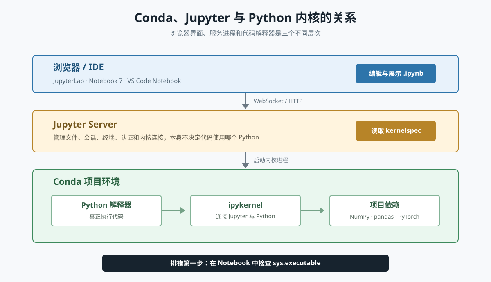
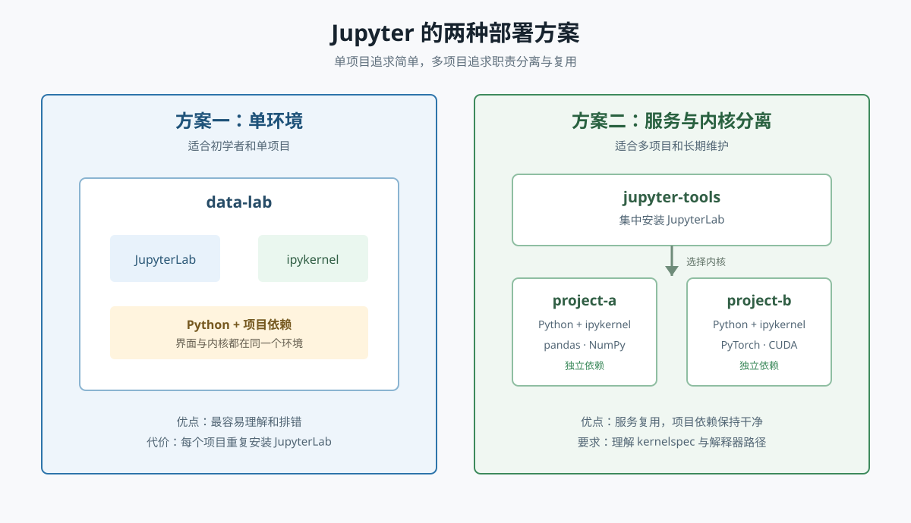
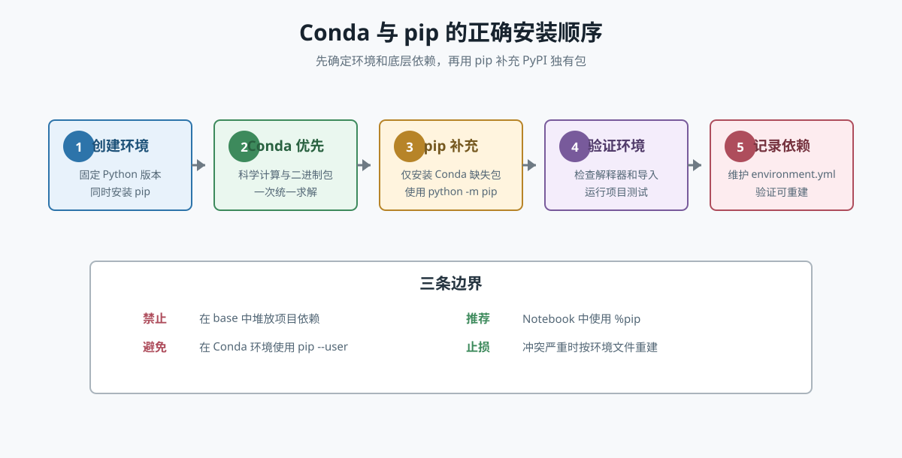
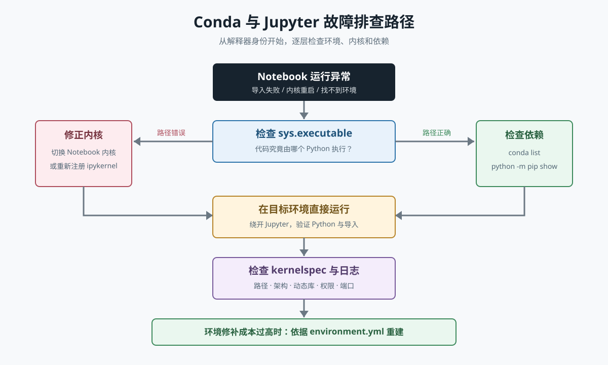

# 搭建 Conda + Jupyter 开发环境：Windows、macOS 与 Linux 完整指南

> 本文从零搭建一套可复现、可维护的 Python 数据分析与交互式开发环境，详细说明 Windows、macOS 和 Linux 的安装差异，并讲清楚 Conda 环境、Jupyter 服务与 Python 内核之间的关系。
>
> 文中默认使用命令行操作。初学者可以直接按“快速路线”执行；需要维护多个项目时，建议采用后文的“服务环境与项目内核分离”方案。

***

## 一、先理解 Conda、Jupyter 与内核

在安装之前，必须先分清几个经常被混为一谈的组件。

| 组件             | 作用                               | 是否执行 Notebook 代码 |
| -------------- | -------------------------------- | ---------------- |
| Conda          | 管理 Python 版本、依赖包和隔离环境            | 否                |
| JupyterLab     | 提供浏览器中的文件、编辑器和 Notebook 界面       | 否                |
| Jupyter Server | 管理会话、文件、终端和内核连接                  | 否                |
| IPython        | Python 的交互式运行环境                  | 是                |
| ipykernel      | 让某个 Python 环境能作为 Jupyter 内核运行    | 是                |
| kernelspec     | 告诉 Jupyter“内核名称、启动命令和 Python 路径” | 否                |



### 1. Conda 是什么

Conda 同时承担两种职责：

1. **环境管理器**：为不同项目创建相互隔离的 Python 与依赖环境；
2. **包管理器**：安装 Python 包以及 CUDA、C/C++ 动态库等非 Python 依赖。

例如：

```text
base
├── project-a：Python 3.11 + pandas 2.x
├── project-b：Python 3.12 + PyTorch
└── legacy-app：Python 3.9 + 旧版依赖
```

每个环境拥有独立的解释器和依赖，不需要反复覆盖系统 Python。

### 2. Jupyter 是什么

Jupyter 是一套交互式计算体系。常用前端包括：

- **JupyterLab**：功能完整，支持 Notebook、终端、文本编辑器和扩展，推荐使用；
- **Jupyter Notebook 7**：界面更聚焦 Notebook；
- **VS Code Notebook**：由 VS Code 提供界面，仍需选择正确的 Python 内核。

`.ipynb` 文件只保存代码单元、Markdown、输出结果和元数据，它本身不携带 Python 解释器与完整依赖。

### 3. 为什么“启动 Jupyter 的环境”不一定是“执行代码的环境”

假设在 `jupyter-tools` 环境启动 JupyterLab：

```bash
conda activate jupyter-tools
jupyter lab
```

页面中仍然可以选择 `project-a` 内核。此时：

- JupyterLab 服务进程来自 `jupyter-tools`；
- Notebook 中的代码由 `project-a` 的 Python 执行；
- `import pandas` 查找的是 `project-a` 中的包；
- 在终端里执行裸 `pip`，却可能修改另外一个环境。

这正是大量“终端中可以导入，Notebook 中却找不到包”问题的根源。

***

## 二、选择 Conda 发行版

Conda 不是只能通过 Anaconda Distribution 获得。常见选择如下。

| 发行版                   | 默认内容                | 默认软件源        | 体积 | 适合人群               |
| --------------------- | ------------------- | ------------ | -: | ------------------ |
| Miniconda             | Conda、Python 和少量基础包 | Anaconda 默认源 | 较小 | 希望按需安装的个人用户        |
| Miniforge             | Conda、Mamba 和基础包    | conda-forge  | 较小 | 偏好社区源、跨架构或组织使用     |
| Anaconda Distribution | 数据科学常用包、Navigator 等 | Anaconda 默认源 | 较大 | 希望开箱即用且接受较多预装包的初学者 |

本文以 **Miniconda** 为主要示例，Miniforge 的安装与日常命令基本相同。

### 1. 推荐策略

- 个人学习、希望最少预装内容：Miniconda；
- 主要使用 `conda-forge`、重视 Apple Silicon 与多架构支持：Miniforge；
- 不想手动安装常见科学计算包：Anaconda Distribution；
- 企业或组织环境：先审查软件源服务条款，再决定使用 `defaults` 还是 `conda-forge`。

> Miniconda 和 Anaconda Distribution 默认连接 Anaconda Repository。组织使用前应核对最新服务条款和授权要求；Miniforge 默认使用社区维护的 `conda-forge`。

### 2. 不建议直接使用系统 Python

系统 Python 可能被操作系统组件依赖。在 Linux 和 macOS 中使用 `sudo pip install` 修改系统环境，容易导致包管理器冲突、权限混乱或系统工具损坏。

推荐边界：

```text
操作系统 Python：留给系统
Conda base：只维护 Conda 自身
项目环境：安装项目依赖
Jupyter tools：可选，集中安装 JupyterLab
```

***

## 三、安装前检查

### 1. 确认 CPU 架构

下载与 CPU 架构不匹配的安装包，可能无法运行，或只能通过模拟层低效运行。

**Windows PowerShell**

```powershell
$env:PROCESSOR_ARCHITECTURE
```

常见结果：

- `AMD64`：选择 Windows x86\_64；
- `ARM64`：优先选择 Windows ARM64 安装器；若发行版暂未提供，再评估 x86\_64 模拟。

**macOS**

```bash
uname -m
```

- `arm64`：Apple Silicon，选择 `MacOSX-arm64`；
- `x86_64`：Intel Mac，选择 `MacOSX-x86_64`。

**Linux**

```bash
uname -m
```

- `x86_64`：选择 `Linux-x86_64`；
- `aarch64` 或 `arm64`：选择 `Linux-aarch64`；
- 其他架构：先确认所选发行版是否提供安装器和软件包。

### 2. 规划安装位置

Conda 不要求管理员或 root 权限。推荐安装到当前用户可写目录。

| 系统      | 常见位置                        |
| ------- | --------------------------- |
| Windows | `C:\Users\<用户名>\miniconda3` |
| macOS   | `/Users/<用户名>/miniconda3`   |
| Linux   | `/home/<用户名>/miniconda3`    |

注意事项：

- 安装路径尽量避免特殊符号；
- Windows 下部分旧工具对空格和非 ASCII 路径支持不佳；
- 不要为了省事安装到系统目录后长期使用管理员权限；
- 预留足够空间，环境和包缓存可能增长到数 GB 甚至数十 GB。

### 3. 从官方地址下载

- Conda 安装指南：<https://docs.conda.io/projects/conda/en/latest/user-guide/install/>
- Miniconda：<https://www.anaconda.com/docs/getting-started/miniconda/install>
- Miniforge：<https://conda-forge.org/download/>
- Jupyter 安装指南：<https://jupyter.org/install>

不要从不可信的网盘、论坛附件或脚本镜像下载安装器。

### 4. 校验 SHA-256

下载后，将计算结果与官方发布的 SHA-256 比较。任何一个字符不同都不应继续安装。

**Windows PowerShell**

```powershell
Get-FileHash .\Miniconda3-latest-Windows-x86_64.exe -Algorithm SHA256
```

**macOS**

```bash
shasum -a 256 Miniconda3-latest-MacOSX-arm64.sh
```

**Linux**

```bash
sha256sum Miniconda3-latest-Linux-x86_64.sh
```

> `latest` 安装器便于个人安装，但自动化部署应锁定明确版本和校验值，避免同一脚本在不同时间得到不同结果。

***

## 四、Windows 安装

Windows 推荐使用图形安装器，再通过 Miniconda Prompt 完成初始化。

### 1. 图形界面安装

1. 下载与架构匹配的 `.exe` 安装器；
2. 双击运行安装程序；
3. 安装范围选择 **Just Me**；
4. 安装位置使用当前用户目录；
5. 完成安装后，从开始菜单打开 **Miniconda Prompt**。

安装选项建议：

| 选项                                   | 建议       | 原因                          |
| ------------------------------------ | -------- | --------------------------- |
| Add Miniconda to PATH                | 不勾选      | 避免覆盖系统中已有 Python 与命令        |
| Register Miniconda as default Python | 按需，通常不勾选 | IDE 可以单独选择解释器，无需接管全局 Python |
| Clear package cache                  | 初次安装无需   | 后续可用 Conda 命令清理             |

不加入系统 `PATH` 并不影响使用。Miniconda Prompt 会加载所需环境。

### 2. 验证安装

在 **Miniconda Prompt** 中执行：

```bat
conda --version
conda info
conda list
where conda
where python
```

输出路径应指向 Miniconda 安装目录。

### 3. 初始化 PowerShell

```powershell
conda init powershell
```

关闭全部 PowerShell 窗口，再重新打开。

验证：

```powershell
conda info --envs
conda activate base
python --version
Get-Command python
```

若 PowerShell 报“无法加载配置文件，因为系统禁止运行脚本”，先查看策略：

```powershell
Get-ExecutionPolicy -List
```

仅为当前用户设置较温和的策略：

```powershell
Set-ExecutionPolicy -Scope CurrentUser RemoteSigned
```

这会修改当前用户的脚本执行策略，应理解组织安全要求后再执行。受管设备应由管理员按策略处理，不要绕过企业控制。

### 4. 初始化 CMD

若主要使用传统命令提示符：

```bat
conda init cmd.exe
```

关闭并重新打开 CMD 后测试：

```bat
conda activate base
where python
```

### 5. Windows 静默安装

适用于自动化部署。参数区分大小写，`/D` 必须放在最后，且安装路径不加引号。

```bat
start /wait "" Miniconda3-latest-Windows-x86_64.exe ^
  /InstallationType=JustMe ^
  /RegisterPython=0 ^
  /AddToPath=0 ^
  /S ^
  /D=%UserProfile%\miniconda3
```

自动化脚本不要长期使用 `latest` 文件名，应锁定安装器版本、下载地址和 SHA-256。

### 6. Git Bash

先在 Miniconda Prompt 中初始化 Bash：

```bat
conda init bash
```

重新打开 Git Bash。若仍无法识别，可直接调用安装目录中的初始化脚本进行诊断：

```bash
source ~/miniconda3/etc/profile.d/conda.sh
conda activate base
```

具体路径取决于 Git Bash 如何映射 Windows 用户目录。

***

## 五、macOS 安装

macOS 需要先区分 Apple Silicon 与 Intel。

### 1. 确认架构

```bash
uname -m
```

Apple Silicon 应优先安装原生 `arm64` 版本。只有依赖明确不支持 ARM 时，才考虑通过 Rosetta 使用 `osx-64` 环境。

### 2. 使用 Shell 安装器

以下以 Apple Silicon 为例：

```bash
cd ~/Downloads
shasum -a 256 Miniconda3-latest-MacOSX-arm64.sh
bash Miniconda3-latest-MacOSX-arm64.sh
```

Intel Mac 替换为：

```bash
bash Miniconda3-latest-MacOSX-x86_64.sh
```

安装过程：

1. 按 Enter 阅读协议；
2. 输入 `yes` 接受协议；
3. 确认安装目录；
4. 同意运行 `conda init`；
5. 关闭并重新打开终端。

### 3. 初始化 Zsh

现代 macOS 默认使用 Zsh：

```bash
~/miniconda3/bin/conda init zsh
exec zsh
```

验证：

```bash
conda --version
conda info
which conda
which python
```

### 4. 使用 Bash

```bash
~/miniconda3/bin/conda init bash
exec bash
```

### 5. Apple Silicon 与 Intel 依赖

原生 ARM 环境：

```bash
conda create -n native-py python=3.12
```

只有确有需要时才创建 Intel 环境：

```bash
conda create --platform osx-64 -n intel-py python=3.11
```

注意：

- `--platform` 应在创建环境时指定；
- Intel 包通常需要 Rosetta 2；
- 不要在同一个环境中混装 `osx-arm64` 与 `osx-64` 包；
- 首选原生 ARM 依赖，模拟环境仅作为兼容方案；
- 跨平台求解成功不代表二进制能在当前系统原生运行。

检查当前 Conda 平台：

```bash
conda info | grep platform
```

***

## 六、Linux 安装

以下步骤适用于常见桌面版和服务器发行版，如 Ubuntu、Debian、Fedora、Rocky Linux 等。Conda 用户级安装通常与系统包管理器无关。

### 1. 确认架构并下载对应安装器

```bash
uname -m
```

以 x86\_64 为例：

```bash
cd /tmp
curl -fLO https://repo.anaconda.com/miniconda/Miniconda3-latest-Linux-x86_64.sh
```

ARM64 使用：

```bash
curl -fLO https://repo.anaconda.com/miniconda/Miniconda3-latest-Linux-aarch64.sh
```

若系统没有 `curl`，可使用 `wget`：

```bash
wget https://repo.anaconda.com/miniconda/Miniconda3-latest-Linux-x86_64.sh
```

下载前应从官方页面取得当前 SHA-256，随后校验：

```bash
sha256sum Miniconda3-latest-Linux-x86_64.sh
```

### 2. 交互式安装

```bash
bash Miniconda3-latest-Linux-x86_64.sh
```

安装完成后重新打开终端，或加载配置：

```bash
source ~/.bashrc
```

### 3. 初始化不同 Shell

**Bash**

```bash
~/miniconda3/bin/conda init bash
exec bash
```

**Zsh**

```bash
~/miniconda3/bin/conda init zsh
exec zsh
```

**Fish**

```fish
fish_add_path ~/miniconda3/condabin
conda init fish
exec fish
```

查看 `conda init` 将修改什么，而不真正写入：

```bash
conda init --dry-run --verbose bash
```

撤销初始化：

```bash
conda init --reverse bash
```

### 4. 无交互安装

适合服务器、CI 和开发容器：

```bash
bash Miniconda3-latest-Linux-x86_64.sh \
  -b \
  -p "$HOME/miniconda3"

"$HOME/miniconda3/bin/conda" init bash
```

参数含义：

- `-b`：批处理模式，不进入交互提示；
- `-p`：指定安装目录。

自动化环境中也可以不执行 `conda init`，而直接使用完整路径或 `conda run`：

```bash
"$HOME/miniconda3/bin/conda" create -y -n notebook python=3.12
"$HOME/miniconda3/bin/conda" run -n notebook python --version
```

这种方式不会修改 Shell 配置，更适合 CI。

### 5. 服务器权限原则

- 不使用 `sudo bash Miniconda...` 进行个人安装；
- 不把个人环境放入 `/usr`；
- 多用户共用环境时，需要统一规划只读基础环境和可写缓存；
- 生产服务器不要直接暴露无认证的 Jupyter；
- 避免在网络文件系统中创建大量环境，包链接和小文件操作可能很慢。

***

## 七、安装后的基础配置

### 1. 更新 Conda

```bash
conda update -n base conda
```

先查看计划，再确认执行。自动化场景可使用 `-y`，交互使用时不建议盲目跳过变更审查。

### 2. 禁止自动激活 base

默认终端前缀可能出现 `(base)`。为避免误把包安装到 base：

```bash
conda config --set auto_activate_base false
```

重新打开终端后生效。需要时再执行：

```bash
conda activate base
```

### 3. 查看配置来源

```bash
conda config --show-sources
conda config --show
```

常见配置文件是用户目录下的 `.condarc`。Windows 中也可能显示其他层级的配置来源。

### 4. 软件源策略

同一个环境应尽量保持渠道一致，避免混合渠道产生 ABI 或依赖冲突。

如果决定使用 `conda-forge`：

```bash
conda config --add channels conda-forge
conda config --set channel_priority strict
```

检查：

```bash
conda config --show channels
conda config --show channel_priority
```

如果使用 Miniforge，通常已经预配置 `conda-forge`。不要在不了解影响时反复调整全局 channel 顺序。

### 5. 基础诊断

```bash
conda info
conda config --show-sources
conda info --envs
conda list -n base
```

***

## 八、推荐方案一：单项目快速搭建

该方案把 JupyterLab 和项目依赖装在同一个环境中，概念简单，适合第一次使用。



### 1. 创建环境

本文示例固定 Python 的主次版本，不直接追随最新版本：

```bash
conda create -n data-lab python=3.12 pip
```

激活：

```bash
conda activate data-lab
```

确认解释器：

```bash
python --version
python -c "import sys; print(sys.executable)"
```

### 2. 安装 JupyterLab 与常用依赖

使用默认 channel：

```bash
conda install jupyterlab ipykernel numpy pandas matplotlib
```

明确使用 `conda-forge`：

```bash
conda install -c conda-forge jupyterlab ipykernel numpy pandas matplotlib
```

不要在同一条指南中一会儿使用 `defaults`、一会儿使用 `conda-forge`。选定渠道后尽量保持一致。

### 3. 启动 JupyterLab

切换到项目目录：

**Windows PowerShell**

```powershell
Set-Location D:\workspace\my-data-project
jupyter lab
```

**macOS / Linux**

```bash
cd ~/workspace/my-data-project
jupyter lab
```

默认会：

1. 在本机启动 Jupyter Server；
2. 监听本地回环地址；
3. 打开浏览器；
4. 显示当前目录中的文件。

若不希望自动打开浏览器：

```bash
jupyter lab --no-browser
```

指定端口：

```bash
jupyter lab --port 8890
```

### 4. Notebook 中验证环境

新建 Notebook 后执行：

```python
import os
import sys
import platform

print("Python:", sys.version)
print("解释器:", sys.executable)
print("系统:", platform.platform())
print("工作目录:", os.getcwd())
```

再验证依赖：

```python
import numpy as np
import pandas as pd
import matplotlib

print("NumPy:", np.__version__)
print("pandas:", pd.__version__)
print("Matplotlib:", matplotlib.__version__)
```

`sys.executable` 应位于 `data-lab` 环境目录。

### 5. 停止服务

在启动 JupyterLab 的终端中按：

```text
Ctrl + C
```

根据提示确认关闭。关闭浏览器标签页并不会自动停止服务器。

***

## 九、推荐方案二：Jupyter 服务与项目内核分离

维护多个项目时，不必在每个环境重复安装完整 JupyterLab。推荐：

```text
jupyter-tools：只安装 JupyterLab
project-a：安装项目依赖 + ipykernel
project-b：安装项目依赖 + ipykernel
```

### 1. 创建 Jupyter 服务环境

```bash
conda create -n jupyter-tools python=3.12 jupyterlab
```

### 2. 创建项目环境

```bash
conda create -n project-a python=3.12 pip ipykernel numpy pandas matplotlib
conda activate project-a
```

### 3. 注册项目内核

```bash
python -m ipykernel install \
  --user \
  --name project-a \
  --display-name "Python (project-a)"
```

Windows CMD 不支持反斜杠续行，可写成一行：

```bat
python -m ipykernel install --user --name project-a --display-name "Python (project-a)"
```

参数含义：

| 参数               | 含义                     |
| ---------------- | ---------------------- |
| `--user`         | 将 kernelspec 注册到当前用户范围 |
| `--name`         | 内部唯一名称，建议只用字母、数字、连字符   |
| `--display-name` | Jupyter 界面中显示的名称       |

### 4. 启动集中式 JupyterLab

```bash
conda activate jupyter-tools
jupyter lab
```

新建 Notebook 时选择 `Python (project-a)`。

### 5. 检查内核

```bash
jupyter kernelspec list
```

在 Notebook 中验证：

```python
import sys

print(sys.executable)
```

路径必须指向 `project-a`，而不是 `jupyter-tools`。

### 6. 删除内核

先查看名称：

```bash
jupyter kernelspec list
```

再删除：

```bash
jupyter kernelspec remove project-a
```

删除 kernelspec 只移除 Jupyter 菜单项，不会删除 Conda 环境。

### 7. 环境删除前先清理内核

```bash
jupyter kernelspec remove project-a
conda remove -n project-a --all
```

否则 Jupyter 中可能残留一个指向不存在 Python 的“幽灵内核”。

***

## 十、Conda 环境日常管理

### 1. 创建与激活

```bash
conda create -n my-project python=3.12 pip
conda activate my-project
```

### 2. 退出环境

```bash
conda deactivate
```

### 3. 查看环境

```bash
conda env list
conda info --envs
```

星号表示当前激活环境。

### 4. 查看与搜索包

```bash
conda list
conda list pandas
conda search pandas
```

### 5. 安装、更新与删除包

```bash
conda install pandas
conda update pandas
conda remove pandas
```

指定环境而不激活：

```bash
conda install -n my-project pandas
```

### 6. 克隆环境

```bash
conda create -n my-project-test --clone my-project
```

适合升级大型依赖前做临时验证，但不应代替可版本控制的环境定义文件。

### 7. 删除环境

先退出目标环境：

```bash
conda deactivate
conda remove -n my-project --all
```

### 8. 清理缓存

先查看可清理内容：

```bash
conda clean --dry-run --all
```

确认后：

```bash
conda clean --all
```

缓存可以加速新环境创建。磁盘空间不紧张时，无需频繁清理。

***

## 十一、正确处理 Conda 与 pip

Conda 和 pip 可以共存，但需要明确规则。



### 1. 推荐顺序

1. 创建独立 Conda 环境；
2. 优先用 Conda 安装二进制和科学计算依赖；
3. Conda 找不到的包，再使用该环境的 pip；
4. pip 安装完成后，尽量不要再大规模修改底层 Conda 依赖；
5. 环境冲突严重时，依据环境文件重建，不要无限修补。

### 2. 永远确认 pip 属于哪个 Python

推荐：

```bash
python -m pip install package-name
```

不推荐直接假设：

```bash
pip install package-name
```

检查：

**Windows**

```powershell
where.exe python
where.exe pip
python -m pip --version
```

**macOS / Linux**

```bash
which python
which pip
python -m pip --version
```

### 3. Notebook 中安装包

优先使用 IPython 的 `%pip` 魔法：

```python
%pip install package-name
```

需要使用 Conda 时：

```python
%conda install pandas
```

相比 `!pip install`，`%pip` 更能确保安装目标与当前内核一致。安装涉及底层库或导入缓存时，完成后重启内核。

### 4. 避免用户级 pip 污染

不要在 Conda 环境中随意执行：

```bash
pip install --user package-name
```

`--user` 会把包安装到用户级目录，可能越过 Conda 环境边界，造成环境不可复现。

***

## 十二、环境复现与版本锁定

“我的电脑能运行”不是完成标准。项目应包含环境定义。

### 1. 手写 environment.yml

推荐维护一个简洁、以直接依赖为主的文件：

```yaml
name: data-lab
channels:
  - conda-forge
dependencies:
  - python=3.12
  - jupyterlab=4
  - ipykernel
  - numpy=2
  - pandas=2
  - matplotlib=3
  - pip
  - pip:
      - some-pypi-only-package==1.2.3
```

设计原则：

- 锁定 Python 主次版本；
- 核心库至少锁定主版本，生产项目应更严格；
- Conda 依赖写在 `pip` 之前；
- `pip:` 中只放 Conda 渠道没有或必须从 PyPI 安装的包；
- 不把本机路径、密钥和临时开发包写入共享文件。

### 2. 从文件创建

兼容性最广的命令：

```bash
conda env create -f environment.yml
```

激活：

```bash
conda activate data-lab
```

更新已有环境：

```bash
conda env update -n data-lab -f environment.yml --prune
```

`--prune` 会删除文件中不再声明的 Conda 包，执行前应检查变更和备份重要环境。

### 3. 导出环境

较新版本 Conda 支持：

```bash
conda export --file environment.yml
```

传统兼容命令：

```bash
conda env export --from-history > environment.yml
```

`--from-history` 主要记录主动安装的顶层 Conda 依赖，更适合跨平台共享，但可能不完整记录 pip 包，需要人工补充检查。

完整快照：

```bash
conda env export > environment-full.yml
```

完整快照包含大量平台相关的传递依赖和构建编号，适合同平台诊断，不适合作为唯一的跨平台项目定义。

### 4. 精确复现与跨平台复现的区别

| 目标                    | 推荐文件                 | 特点                 |
| --------------------- | -------------------- | ------------------ |
| 跨 Windows、macOS、Linux | 精简 `environment.yml` | 声明直接依赖，允许各平台求解     |
| 同平台近似复现               | 完整环境 YAML            | 包含传递依赖，约束较多        |
| 同架构精确复现               | explicit 规格或锁文件      | 含具体构建与 URL，不可直接跨平台 |

不要把 Windows 导出的底层构建列表直接当成 macOS 或 Linux 的通用环境定义。

### 5. 跨平台项目结构

```text
my-project/
├── environment.yml
├── notebooks/
├── src/
├── data/
│   └── README.md
├── .gitignore
└── README.md
```

`.gitignore` 示例：

```gitignore
.ipynb_checkpoints/
__pycache__/
*.py[cod]
.env
.venv/
data/raw/
```

不要把 Conda 环境目录提交到 Git。提交环境定义，而不是整个解释器和 `site-packages`。

***

## 十三、VS Code 与 Jupyter

### 1. 安装扩展

通常需要：

- Microsoft Python 扩展；
- Microsoft Jupyter 扩展。

### 2. 选择解释器

打开命令面板：

```text
Python: Select Interpreter
```

选择目标 Conda 环境。

### 3. 选择 Notebook 内核

打开 `.ipynb`，点击右上角内核选择器，选择对应环境或已注册的 kernelspec。

编辑器解释器与 Notebook 内核是两个选择，必须分别检查。

### 4. VS Code 找不到环境

先在外部终端验证：

```bash
conda env list
conda run -n project-a python -c "import sys; print(sys.executable)"
```

然后：

1. 重启 VS Code；
2. 重新扫描解释器；
3. 从已激活环境启动 VS Code；
4. 确认远程窗口、WSL 窗口和本机窗口没有混淆。

从环境启动：

```bash
conda activate project-a
code .
```

***

## 十四、Windows、WSL 与容器边界

Windows 本机、WSL 和 Docker 是三个不同的运行环境。

| 场景         | Conda 安装位置   | Python 路径形式                   |
| ---------- | ------------ | ----------------------------- |
| Windows 本机 | Windows 文件系统 | `C:\Users\...\miniconda3\...` |
| WSL        | Linux 文件系统   | `/home/user/miniconda3/...`   |
| Docker 容器  | 容器文件系统       | 由镜像定义                         |

不要直接让 WSL 使用 Windows Conda 的 Python，也不要反过来使用。二者的二进制格式、路径、动态库和权限模型不同。

推荐：

- Windows 开发：安装 Windows 版 Conda；
- WSL 开发：在 WSL 内独立安装 Linux 版 Conda；
- VS Code Remote - WSL：选择 WSL 内的解释器；
- 容器开发：在 Dockerfile 或镜像中创建环境；
- Notebook 文件可以共享，但解释器与依赖必须在各自系统中重建。

***

## 十五、Jupyter 安全与远程访问

### 1. 本机使用

默认只在本机访问：

```bash
jupyter lab --ip 127.0.0.1
```

不要为了方便关闭 token、密码或身份验证。

查看正在运行的服务：

```bash
jupyter server list
```

### 2. 远程服务器推荐使用 SSH 隧道

服务器上启动：

```bash
jupyter lab \
  --no-browser \
  --ip 127.0.0.1 \
  --port 8888
```

本机建立隧道：

```bash
ssh -L 8888:127.0.0.1:8888 user@server.example.com
```

然后在本机浏览器访问：

```text
http://127.0.0.1:8888
```

这样 Jupyter 仍只监听服务器回环地址，外部访问通过加密 SSH 隧道完成。

### 3. 不安全示例

不要在公网主机上直接执行类似配置：

```bash
jupyter lab \
  --ip 0.0.0.0 \
  --ServerApp.token='' \
  --ServerApp.password=''
```

这可能让任何能访问端口的人执行代码、读取文件和使用终端。

### 4. 团队与生产场景

多人使用不应共享一个个人 JupyterLab 进程。应考虑：

- JupyterHub；
- 反向代理与 HTTPS；
- 单点登录和访问控制；
- 每用户隔离环境；
- 资源配额；
- 审计、日志和密钥管理；
- 容器或调度平台隔离。

Notebook 具有执行任意代码的能力，应按开发服务器而不是静态文档处理。

***

## 十六、常见问题排查



### 1. `conda: command not found` 或“conda 不是内部命令”

先直接调用安装目录中的 Conda。

**Windows**

打开 Miniconda Prompt，执行：

```bat
conda init powershell
```

**macOS / Linux**

```bash
~/miniconda3/bin/conda --version
~/miniconda3/bin/conda init bash
```

Zsh 用户改成：

```bash
~/miniconda3/bin/conda init zsh
```

重新打开终端。

### 2. `conda activate` 提示先运行 `conda init`

```bash
conda init
```

更明确地指定 Shell：

```bash
conda init powershell
conda init bash
conda init zsh
conda init fish
```

执行后必须重新启动对应终端。

### 3. Notebook 中 `ModuleNotFoundError`

先在 Notebook 中检查：

```python
import sys

print(sys.executable)
```

再在终端检查目标环境：

```bash
conda run -n project-a python -c "import sys; print(sys.executable)"
conda list -n project-a
```

如果路径不同：

1. 切换 Notebook 内核；
2. 或在目标环境安装并注册 `ipykernel`；
3. 不要先在多个环境反复安装同一个包。

### 4. Jupyter 中看不到新环境

```bash
conda activate project-a
conda install ipykernel
python -m ipykernel install \
  --user \
  --name project-a \
  --display-name "Python (project-a)"
jupyter kernelspec list
```

重启 JupyterLab 后再检查。

### 5. 内核不断重启

在目标环境直接测试：

```bash
conda activate project-a
python -c "import ipykernel; print(ipykernel.__version__)"
python -m ipykernel --version
```

再查看内核定义：

```bash
jupyter kernelspec list
jupyter kernelspec list --json
```

重点检查：

- kernelspec 中的 Python 路径是否存在；
- 环境是否被移动或删除；
- `ipykernel`、`jupyter_client`、`pyzmq` 是否损坏；
- 原生扩展是否因架构或动态库冲突崩溃；
- 杀毒软件、权限或磁盘空间是否阻止进程启动。

### 6. 端口被占用

直接换端口：

```bash
jupyter lab --port 8890
```

查看现有服务：

```bash
jupyter server list
```

**Windows 查看端口**

```powershell
Get-NetTCPConnection -LocalPort 8888 -ErrorAction SilentlyContinue
```

**macOS / Linux**

```bash
lsof -i :8888
```

### 7. 浏览器没有自动打开

```bash
jupyter lab --no-browser
```

复制终端输出中包含 token 的本地 URL 到浏览器。不要把 token 发到公开聊天、工单或截图中。

### 8. Conda 求解很慢或发生依赖冲突

先查看渠道和优先级：

```bash
conda config --show channels
conda config --show channel_priority
```

处理顺序：

1. 明确 Python 和关键库版本；
2. 一次安装相关依赖，让求解器统一计算；
3. 避免在同一环境混用多个不兼容渠道；
4. 新建最小环境验证；
5. 根据 `environment.yml` 重建，而不是长期修补；
6. 不要把升级所有包当成第一反应。

### 9. SSL、代理或证书错误

不要通过长期关闭 SSL 验证来“解决”：

```bash
conda config --set ssl_verify false
```

这会降低供应链安全。正确方向是：

- 检查系统时间；
- 配置组织 HTTP/HTTPS 代理；
- 导入组织 CA 证书；
- 将 `ssl_verify` 指向可信 CA 文件；
- 请网络或安全管理员确认 TLS 检查设备配置。

查看相关配置：

```bash
conda config --show proxy_servers
conda config --show ssl_verify
```

### 10. `pip` 安装成功但导入失败

Notebook 内检查：

```python
import sys
print(sys.executable)
```

然后执行：

```python
%pip show package-name
```

如果安装位置不属于当前 `sys.executable` 对应环境，说明包装错了环境。切换内核或在当前内核中使用 `%pip` 安装。

### 11. Matplotlib 不显示图

Jupyter 中通常可直接显示：

```python
import matplotlib.pyplot as plt

plt.plot([1, 2, 3], [1, 4, 9])
plt.show()
```

必要时：

```python
%matplotlib inline
```

若远程服务器报 GUI 后端错误，使用非 GUI 后端或直接在 Notebook 中内嵌显示，不要依赖服务器桌面环境。

### 12. 环境名称存在但目录损坏

查看环境路径：

```bash
conda info --envs
```

若环境无法修复，优先使用环境定义重建：

```bash
conda remove -n broken-env --all
conda env create -f environment.yml
```

删除前确认其中没有未导出的依赖信息或重要文件。

***

## 十七、升级、备份与卸载

### 1. 升级前备份

```bash
conda env export -n data-lab > data-lab-full.yml
conda env export -n data-lab --from-history > data-lab-history.yml
jupyter kernelspec list
```

大型升级建议克隆环境验证：

```bash
conda create -n data-lab-upgrade --clone data-lab
```

### 2. 更新 JupyterLab

```bash
conda activate jupyter-tools
conda update jupyterlab
```

更新后检查：

```bash
jupyter lab --version
jupyter server --version
jupyter kernelspec list
```

### 3. Windows 卸载

1. 导出需要保留的环境；
2. 执行 `conda init --reverse --all`；
3. 在 Windows“已安装的应用”中卸载 Miniconda；
4. 检查并按需删除用户配置与缓存。

不要误删项目代码和 Notebook。

### 4. macOS / Linux 卸载

先撤销 Shell 初始化：

```bash
conda init --reverse --all
```

关闭终端后，删除实际安装目录。假设安装在 `~/miniconda3`：

```bash
rm -rf ~/miniconda3
```

可选的用户配置和缓存包括：

```text
~/.condarc
~/.conda/
~/.continuum/
~/.jupyter/
~/.local/share/jupyter/
```

这些位置可能包含其他 Conda 发行版、Jupyter 配置或内核。逐项确认用途后再删除，不要直接批量清理。

***

## 十八、推荐的最终实践

### 1. 个人单项目

```bash
conda create -n data-lab python=3.12 pip
conda activate data-lab
conda install jupyterlab ipykernel numpy pandas matplotlib
jupyter lab
```

### 2. 多项目

```bash
# Jupyter 服务环境
conda create -n jupyter-tools python=3.12 jupyterlab

# 项目环境
conda create -n project-a python=3.12 pip ipykernel numpy pandas
conda activate project-a
python -m ipykernel install \
  --user \
  --name project-a \
  --display-name "Python (project-a)"

# 启动服务
conda activate jupyter-tools
jupyter lab
```

### 3. 团队项目

项目仓库至少包含：

- 人工维护的 `environment.yml`；
- 明确的 Python 版本；
- 统一的 Conda channel；
- Conda 与 pip 的依赖边界；
- 启动与内核注册说明；
- 数据集来源和下载方式；
- 不进入版本库的敏感信息清单；
- CI 中的环境重建验证。

### 4. 生产检查清单

- [ ] 安装器来自官方渠道并完成 SHA-256 校验；
- [ ] CPU 架构与安装器、依赖架构一致；
- [ ] Conda 安装在用户可写目录，不依赖管理员权限；
- [ ] `base` 只维护 Conda，不承载项目依赖；
- [ ] 每个项目拥有独立环境；
- [ ] `python`、`pip` 和 Notebook `sys.executable` 指向预期环境；
- [ ] 内核名称清晰且能追溯到项目环境；
- [ ] 依赖通过 `environment.yml` 维护；
- [ ] 跨平台文件不包含平台专属构建列表；
- [ ] 优先使用一个统一 channel；
- [ ] Conda 包先安装，pip 包后安装；
- [ ] Notebook 中使用 `%pip`，避免误装到其他解释器；
- [ ] Jupyter 只监听需要的网络接口；
- [ ] 远程访问使用 SSH 隧道、HTTPS 或受控网关；
- [ ] 未关闭 token、密码和 TLS 校验来规避问题；
- [ ] 升级前已导出环境并验证可重建；
- [ ] 密钥、token、原始敏感数据不保存在 Notebook 输出中。

***

## 十九、命令速查

| 任务            | 命令                                                                                |
| ------------- | --------------------------------------------------------------------------------- |
| 查看 Conda 版本   | `conda --version`                                                                 |
| 查看完整信息        | `conda info`                                                                      |
| 查看环境          | `conda env list`                                                                  |
| 创建环境          | `conda create -n myenv python=3.12 pip`                                           |
| 激活环境          | `conda activate myenv`                                                            |
| 退出环境          | `conda deactivate`                                                                |
| 删除环境          | `conda remove -n myenv --all`                                                     |
| 查看包           | `conda list`                                                                      |
| 安装包           | `conda install package-name`                                                      |
| 安装 PyPI 包     | `python -m pip install package-name`                                              |
| 从 YAML 创建     | `conda env create -f environment.yml`                                             |
| 更新环境          | `conda env update -f environment.yml --prune`                                     |
| 导出直接依赖        | `conda env export --from-history > environment.yml`                               |
| 安装内核          | `python -m ipykernel install --user --name myenv --display-name "Python (myenv)"` |
| 查看内核          | `jupyter kernelspec list`                                                         |
| 删除内核          | `jupyter kernelspec remove myenv`                                                 |
| 启动 JupyterLab | `jupyter lab`                                                                     |
| 不打开浏览器        | `jupyter lab --no-browser`                                                        |
| 查看 Jupyter 服务 | `jupyter server list`                                                             |
| 查看配置路径        | `jupyter --paths`                                                                 |
| 清理 Conda 缓存   | `conda clean --dry-run --all`                                                     |

***

## 二十、参考资料

- Conda 安装指南：<https://docs.conda.io/projects/conda/en/latest/user-guide/install/>
- Conda 入门指南：<https://docs.conda.io/projects/conda/en/latest/user-guide/getting-started.html>
- Conda 环境管理：<https://docs.conda.io/projects/conda/en/latest/user-guide/tasks/manage-environments.html>
- `conda init` 参考：<https://docs.conda.io/projects/conda/en/latest/commands/init.html>
- Conda 环境导出：<https://docs.conda.io/projects/conda/en/latest/commands/export.html>
- Miniforge：<https://conda-forge.org/download/>
- Jupyter 安装指南：<https://jupyter.org/install>
- Jupyter 内核指南：<https://docs.jupyter.org/en/latest/install/kernels.html>
- IPython 内核安装：<https://ipython.readthedocs.io/en/stable/install/kernel_install.html>

***

## 结语

一套稳定的 Conda + Jupyter 环境，关键不在于安装了多少工具，而在于边界是否清晰：

```text
Conda 管理环境
JupyterLab 提供界面
ipykernel 连接项目 Python
environment.yml 保证环境可重建
```

遇到问题时，首先检查 Notebook 中的 `sys.executable`，再检查 Conda 环境、kernelspec 和包安装位置。只要解释器路径与环境边界正确，大多数“包已安装却无法导入”“Jupyter 找不到环境”的问题都能快速定位。
