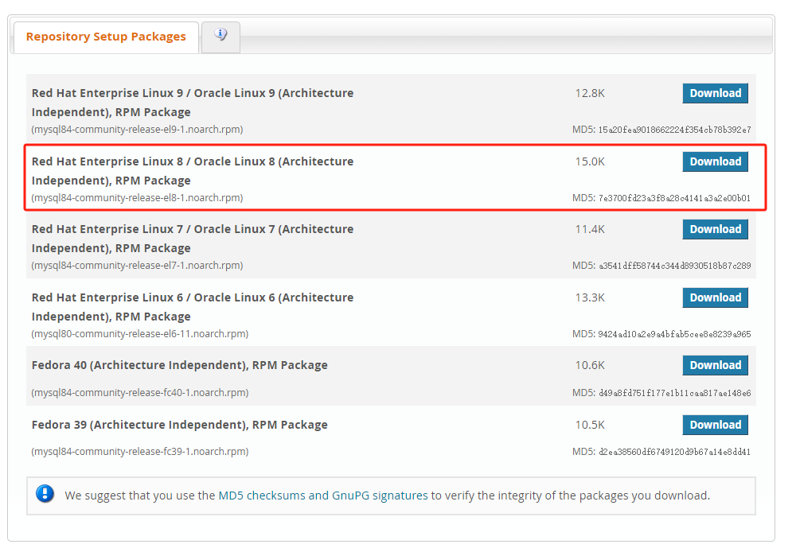

## 前言
MySQL发展至今已经存在了很多个版本，比较常用的就是：5.7、8.x，以及最新的 9.x。MySQL大部分都是向下兼容的，所以我们学习还是以最新版的MySQL。下面是MySQL在不同操作系统的安装：

> 注意：我本地都是在 VMware 虚拟机上跑的，操作系统是 CentosStream8

## Linux Centos 上安装mysql
常用的方式是通过 yum 安装，下面是基本安装步骤
### 添加 MySQL Yum 存储库
将 MySQL Yum 存储库添加到系统的存储库列表中。这通常是通过安装 MySQL 提供的 RPM 来执行的一次性操作。
查看当前操作系统发行版本：
```bash
cat /etc/redhat-release 

# CentOS Linux release 8.5.2111
```
下载对应的MySQL库：https://dev.mysql.com/downloads/mysql/
例如我的发行版对应的：

```bash
wget https://repo.mysql.com/mysql84-community-release-el8-1.noarch.rpm
yum localinstall mysql84-community-release-el8-1.noarch.rpm
yum repolist enabled | grep mysql.*-community
yum repolist all | grep mysql
yum-config-manager --disable mysql-8.4-lts-community
yum-config-manager --enable  mysql80-community
yum repolist enabled | grep mysql
yum module disable mysql
yum install mysql-community-server
systemctl start mysqld
systemctl enable mysqld
systemctl status mysqld
```