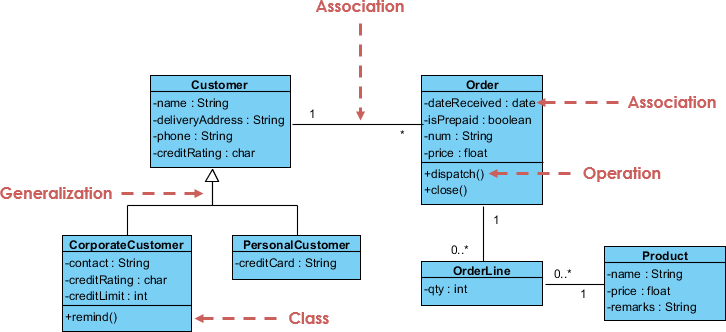

## 一、什么是UML
统一建模语言（英语：Unified Modeling Language，缩写UML）是非专利的第三代建模和规约语言。UML是一种开放的方法，用于说明、可视化、构建和编写一个正在开发的、面向对象的、软件密集系统的制品的开放方法。UML展现了一系列最佳工程实践，这些最佳实践在对大规模，复杂系统进行建模方面，特别是在软件架构层次已经被验证有效。

UML 的目标是提供一个标准的符号，可以被所有面向对象的方法使用，并选择和整合前兆符号的最佳元素。UML可用于广泛的应用程序，它为不同的系统和活动（如分布式系统，分析，系统设计和部署）提供​​了构造。

## 二、基本概念
在我们开始研究 UML 的理论之前，我们将简单介绍一下 UML 的一些主要概念。 UML 涉及很多不同的图表（模型）可大致分为结构性图表和行为性图表两种。

**结构性图表** 显示了系统在不同抽象层次和实现层次上的静态结构以及它们之间的相互关系。结构性图表中的元素表示系统中具意义的概念，可能包括抽象的、现实的和实际的概念。结构性图表有七种类型：
- 类图 (Class Diagram)
- 组件图 (Component Diagram)
- 部署图 (Deployment Diagram)
- 对象图 (Object Diagram)
- 包图 (Package Diagram)
- 复合结构图 (Composite Structure Diagram)
- 轮廓图 (Profile Diagram)

**行为性图表** 显示了系统中对象的动态行为 ，可用以表达系统随时间的变化。行为性图表有七种类型：
- 用例图 (Use Case Diagram)
- 活动图 (Activity Diagram)
- 状态机图 (State Machine Diagram)
- 序列图 (Sequence Diagram)
- 通訊圖 (Communication Diagram)
- 交互概述图 (Interaction Overview Diagram)
- 时序图 (Timing Diagram)

### 2.1 类图
统一建模语言 (UML)中的类图是一种静态结构图，通过显示系统的类、其属性、操作（或方法）以及对象之间的关系来描述系统的结构。类图是一切面向对象方法的核心建模工具。

#### 2.1.1 特征
- 关联（代表类型之间的关系，例如：一个人为公司工作，一间公司有多个办事处）
- 继承（专为将实例关系图 (ERD) 应用于面向对象设计而设的一种关系。它在面向对象设计中的继承概念互相呼应。）
- 聚合（面向对象设计中的一种对象组合的形式）

#### 2.1.2 用例
类图就是编程对象，包括类名、属性、操作三个部分，也可以看作抽象数据类型。  
  
类名（出现在第一个分区中）
类属性  
属性显示在第二个分区中  
属性类型显示在冒号后  

