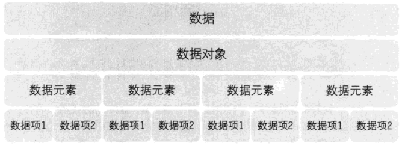

## 数据结构
数据结构是存在一种或者多种特定关系的数据元素之间的集合。
> 它是一门研究非数值计算的程序设计问题中的操作对象，以及操作对象之间的关系和操作等相关问题的学科。

## 数据
数据是描述客观事物的抽象符号，是可以被计算机识别、操作处理的符号集合。常见的数据包括整形、实型（浮点型）、声音、图像、视频等。

### 数据元素
数据元素是组成数据的基本单位。

### 数据项
数据项是组成数据元素的基本单位，且是数据不可分割的最小单位。

### 数据对象
数据对象是具有相同性质的数据元素的集合，是数据的子集。

## 数据类型
数据类型是一组具有相同性质的值的集合以及定义在该集合上的相关操作的总称。

### 原子类型
原子类型是指不可再分的基本数据类型，如：整型、实型、字符型等。

### 结构类型
结构类型是指由若干个类型组合而成，是可以再分解的。如：整形数组是由若干个整形数据组成的。

### 抽象数据类型
抽象是抽取事物具有的普遍性质的本质，即不必考虑复杂的细节，只需要考虑实现目标的必须信息。

抽象数据类型（Abstract Data Type, ADT）是指一个数学模型以及定义在该模型上的一组操作。

