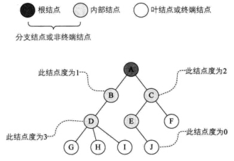
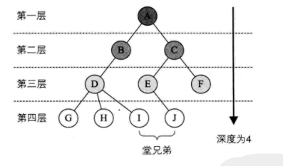
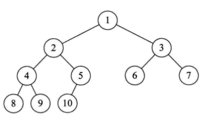
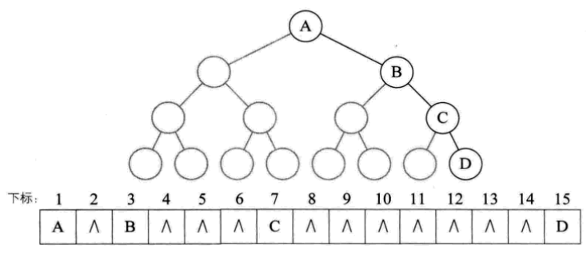
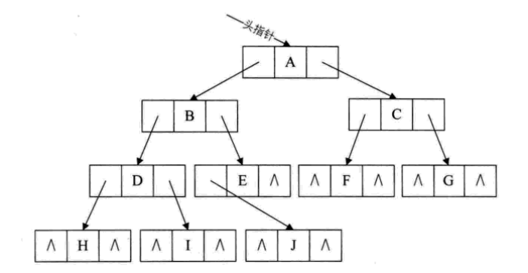

## 一、基本概念
> 树（Tree）是一种非线性的数据结构，它是由 n（n >= 0）个有限节点组成一个具有层次关系的集合。
> 
**根节点（Root）**：树中没有父节点的节点。一棵树有且仅有一个根节点，当树为空时，没有根节点。  
**子节点（Child）与父节点（Parent）**：如果节点 A 有子节点 B，则称 A 是 B 的父节点，B 是 A 的子节点。  
**兄弟节点（Sibling）**：具有相同父节点的节点互为兄弟节点。  
**叶子节点（Leaf Node）**：没有子节点的节点称为叶子节点。  
**节点的度（Degree of Node）**：一个节点的子节点个数称为该节点的度（度为0的节点就是叶子节点或者终端节点，
反之被称为分支节点或者内部节点）。  
**树的度（Degree of Tree）**：树中节点的最大度数称为树的度。  
  
**层次（Level）**：根节点的层次为 1，其余节点的层次等于其父节点的层次加 1。  
**树的深度（Depth of Tree）**：树中节点的最大层次数（深度为0的树是一颗空树）。  
  
**森林（Forest）** 森林是 m（m >= 0）棵互不相交的树的集合。

## 二、线性结构和树结构的区别
### 2.1 线性结构
- 首个元素（无前驱）
- 最后一个元素（无后继）
- 中间元素（一个前驱和一个后继）

### 2.2 树结构
- 根节点（唯一、无双亲节点）
- 叶节点（多个，无子节点）
- 中间节点（一个双亲节点，多个子节点）

## 三、二叉树
- 二叉树的每个节点最多有两棵子树，即树的度 <= 2。
- 左子树和右子树有顺序的概念，即使子节点只有一个也要区分是左节点还是右节点。

### 3.1 五种形态的二叉树
- 空树
- 仅有根节点
- 根节点只有左子树
- 根节点只有右子树
- 根节点左右子树都有

### 3.2 特殊的二叉树
#### 斜树
**左斜树**：所有节点都只有左子树。
**右斜树**：所有节点都只有右子树。

#### 满二叉树
在一棵二叉树中，所有节点都存在左子树和右子树，并且所有叶子节点都在同一层，这样的二叉树被称为满二叉树。

#### 完全二叉树
完全二叉树就是一棵满二叉树 + 一层全部靠左排列的叶子节点构成的树。除了最后一层，其他层的节点数都达到最大。最后一层的节点都靠左排列。
特点如下：
- 叶子节点只能出现在最下面两层
- 最下层叶子节点全部靠左连续排列
- 若节点度为1，该节点只有左孩子
- 完全二叉树是深度最小的二叉树

### 3.3 二叉树的性质
#### 性质一
在树的第 `i` 层上最多只有 2i-1 个节点。

#### 性质二
深度为 `k` 的二叉树最多有 2k - 1 个节点。

#### 性质三
任何一棵二叉树，如果终端节点数为 `n0`，度为2的节点数为 `n2`，那么得到 `n0 = n2 + 1`。

#### 性质四
具有 `n` 个节点的完全二叉树的深度为 log2n + 1。

#### 性质五
具有 `n` 个节点的完全二叉树（深度为：log2n + 1），将其节点按层编号，对与任意节点 `i` 有：
- i == 1，则 i 是二叉树的根，若 i > 1，则双亲节点为 i/2
- 2i > n，则 i 无左孩子，是叶子节点；否则其左孩子是节点：2i
- 2i+1 > n，则 i 无右孩子；否则其右孩子是节点：2i + 1  

  

## 四、存储
### 4.1 顺序存储
使用数组顺序存储树时，通常是按逐层按编号依次存储对应的节点，遇到不存在的节点是使用 `^` 表示不存在该节点。但是极端情况下
右斜树就会导致空间浪费，非常不适用该方式存储。  
    

### 4.2 链式存储
链式存储结构是由数据域和两个指针域组成，其中两个指针用来指向左孩子和右孩子。  
     
我们将这种链式存储结构称为：二叉链表。