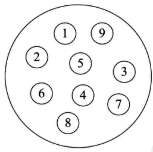
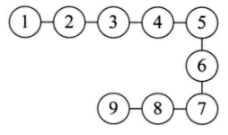

## 前言
我把数据结构分为逻辑结构和物理结构

## 逻辑结构
逻辑结构是指数据对象中数据元素之间的相互关系。

### 集合结构
数据元素属于同一个集合，他们之间相互平等没有其他任何关系。
 

### 线性结构
线性结构是一个有序的、一一对应的数据元素的集合。
例如：一维数组、队列、栈
  

### 非线性结构
非线性结构中的一个数据元素可能对应多个直接前驱和多个后继。
例如：图形结构和树形结构。

## 物理结构
物理结构是指逻辑结构数据在计算机中的存储方式：顺序存储、链式存储。

### 顺序存储结构
数据元素放在连续的存储单元，数据元素的逻辑关系和物理关系一致。

### 链式存储结构
数据元素可以存储在任意的物理存储单元，可是连续也可以是不连续的。通常用指针存放数据元素的地址。