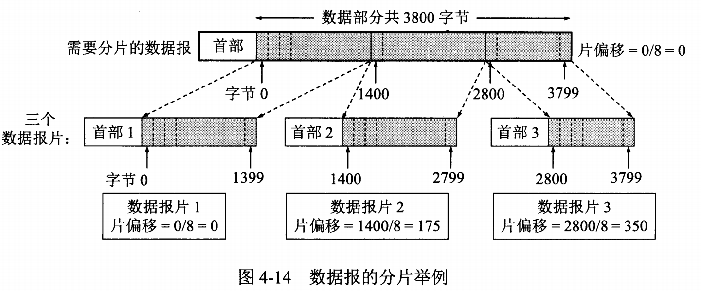
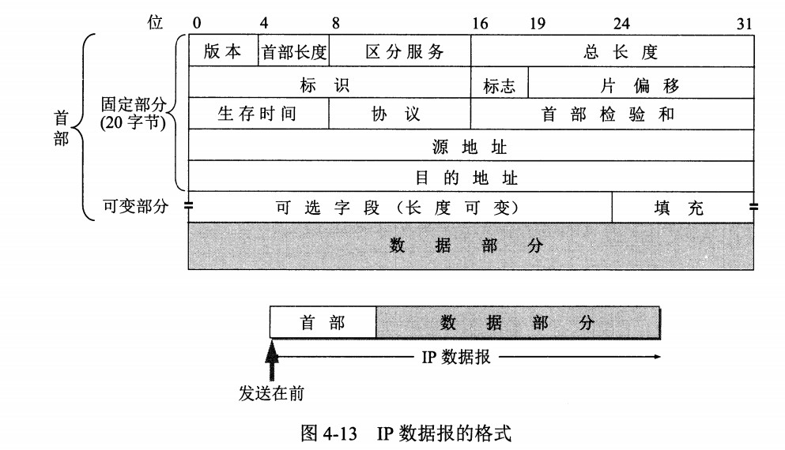
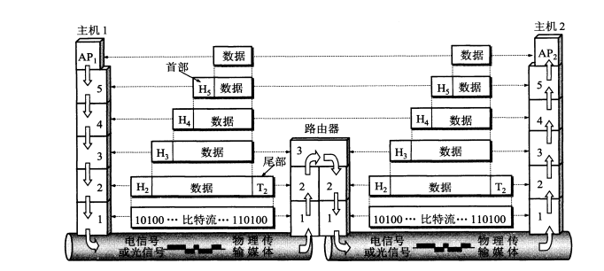

## 什么是 TCP/IP
TCP/IP（Transmission Control Protocol/Internet Protocol，传输控制协议/网际协议）是指能够在多个不同网络间实现信息传输的协议簇。TCP/IP协议不仅仅指的是TCP 和IP两个协议，而是指一个由FTP、SMTP、TCP、UDP、IP等协议构成的协议簇， 只是因为在TCP/IP协议中TCP协议和IP协议最具代表性，所以被称为TCP/IP协议。

## 数据包
计算机网络体系结构分为3种：OSI体系结构（七层），TCP/IP体系结构（四层），五层体系结构。不难看出，TCP/IP 与 OSI 在分层模块上稍有区别。OSI 参考模型注重“通信协议必要的功能是什么”，而 TCP/IP 则更强调“在计算机上实现协议应该开发哪种程序”。
  
而数据包作用于不同的网络层其叫法也不同，大致有：包、帧、数据包、段、消息：
- 包可以说是全能性术语；
- 帧用于表示数据链路层中包的单位；
- 数据包是 IP 和 UDP 等网络层以上的分层中包的单位；
- 段则表示 TCP 数据流中的信息；
- 消息是指应用协议中数据的单位。

每个分层中，都会对所发送的数据附加一个首部，在这个首部中包含了该层必要的信息，如发送的目标地址以及协议相关信息。通常，为协议提供的信息为包首部，所要发送的内容为数据。在下一层的角度看，从上一层收到的包全部都被认为是本层的数据。
  
简单来说数据包由：首部 + 数据组成，首部是每一层数据结构的标识，方便各层独立处理。

## TCP 和 UDP
TCP/IP 中有两个具有代表性的传输层协议，分别是 TCP 和 UDP。