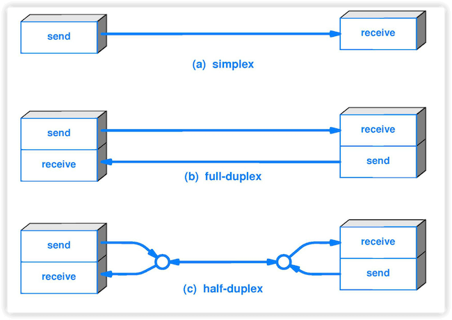
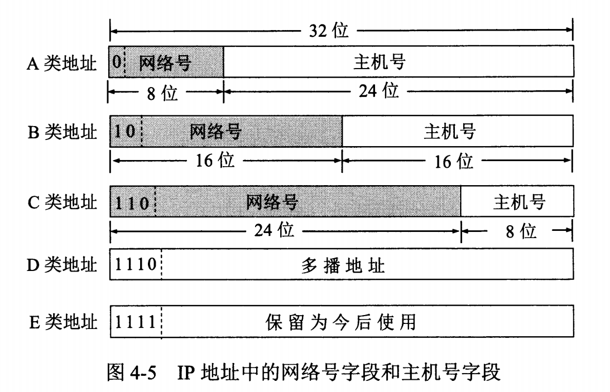

## 一、前言
开放系统互连（OSI，Open System Interconnect）模型是一个概念框架，用于理解和设计计算机网络系统。它由国际标准化组织（ISO）于1984年提出，将网络通信过程分为七个独立的层，每一层都负责特定的网络功能。这种分层结构有助于标准化网络硬件和软件的设计，使得不同厂商的产品能够互操作。


## 二、物理层（Physical Layer）
物理层是OSI（开放系统互连）模型的第一个层，也是最底层。物理层负责实际的物理连接，处理比特（0和1）在网络设备之间的传输。它定义了网络的硬件部分，包括电缆、连接器、电压、信号时序等。

### 2.1 通信方式
根据信息在传输线上的传送方向，分为三种通信方式：单工通信、半双工通信、全双工通信，具体概念如下：

单工通信（simplex）：
只能有一个方向的通信而没有反方向的交互。

半双工通信（half duplex）：通信的双方都可以发送信息，但不能双方同时发送(当然也就不能同时接收)。

全双工（full duplex）：通信的双方可以同时发送和接收信息。


### 2.2 数据是怎么在物理媒介上传输的
数据在计算机中传输是将数字信息（比特流）转换为适合通过物理介质（如电缆、光纤或无线电波）传输的信号。这个过程包括信号编码、调制、传输、接收和解码。

#### 2.2.1 数据编码
数据编码就是将二进制数据（0和1）转换为适合在物理媒介上传输的信号形式，常见的编码方式包括曼彻斯特编码、NRZ（Non-Return to Zero）编码等。

#### 2.2.2 调制
调制的目的是将编码后的数字信号转换为适合传输的模拟信号。常见的调制技术包括：
幅移键控（ASK）：通过改变载波信号的幅度来表示数据。  
频移键控（FSK）：通过改变载波信号的频率来表示数据。  
相移键控（PSK）：通过改变载波信号的相位来表示数据。  

#### 2.2.3 信号传输
不同的传输介质，传输信号的速度、质量都不同，常用的传输介质有：
双绞线（Twisted Pair）：常用于以太网和电话线。  
同轴电缆（Coaxial Cable）：用于电视信号和高速数据传输。  
光纤（Optical Fiber）：使用光信号传输数据，适合长距离和高带宽传输。  
无线介质：包括无线电波、微波和红外线，用于Wi-Fi、蓝牙和卫星通信。  

#### 2.2.4 信号接收和解调
信号接收：
接收端设备（如计算机、路由器或无线接入点）从物理介质中接收传输的信号，接收设备的物理层硬件，如网卡、调制解调器或无线接收器，将信号转换为电信号或光信号。

解调：
解调是接收端将接收到的模拟信号转换回数字信号的过程，使用与发送端相同的调制技术来反向转换信号。

#### 2.2.5 数据解码
解码是将解调后的数字信号恢复为原始的二进制数据，使用与发送端相同的数据编码方式来反向转换信号。

#### 2.2.6 示例
- 以太网（Ethernet）
编码：曼彻斯特编码或4B/5B编码  
传输介质：双绞线或光纤。  
设备：网卡（NIC）、交换机。  

- Wi-Fi
调制：使用正交频分复用（OFDM）。  
传输介质：无线电波。  
设备：无线网卡、无线接入点（AP）。  

- 光纤通信
调制：使用脉冲编码调制（PCM）或密集波分复用（DWDM）。  
传输介质：光纤。  
设备：光纤收发器、光调制器。  

#### 2.2.7 信号质量和干扰
噪声和干扰：  
传输过程中，信号可能受到电磁干扰（EMI）、射频干扰（RFI）和其他噪声源的影响。物理层需要具备抗干扰能力和误差检测/纠正机制。

信号衰减：  
信号在传输过程中会逐渐衰减，特别是在长距离传输时。中继器和放大器可以用来增强信号。

误码率：  
在信号传输中出现的错误比率，物理层需要通过各种技术（如信道编码和纠错码）来尽量减少误码率。

### 2.3 总结
数据在物理媒介上的传输过程包括将数据编码成适合传输的信号，通过物理介质传输信号，并在接收端解码和恢复数据。物理层在这一过程中扮演关键角色，确保数据能够可靠地在设备之间传输。

## 三、数据链路层
数据链路层（Data Link Layer）是OSI（开放系统互连）模型的第二层，负责在相邻节点之间传输数据帧，并确保数据传输的可靠性和无错误。它位于物理层之上，网络层之下，起着重要的作用。其中链路是从一个结点到相邻结点的一段物理链路。

该层的主要作用为：帧封装和拆装、差错检测和纠正、物理地址管理、流量控制、访问控制等。

### 3.1 子层
数据链路层由逻辑链路控制（LLC）子层和媒体访问控制（MAC）子层组成。

#### 3.1.1 逻辑链路层
逻辑链路控制（LLC，Logical Link Control）：提供逻辑链路控制服务，处理帧同步、流量控制和差错控制，使得不同类型的网络协议（如IP、IPX）能够在同一网络上通信。

- 封装成帧
在数据链路层，帧是数据传输的基本单位，帧封装了来自上层（如网络层）的数据包，并添加了必要的头部和尾部信息以确保可靠传输。不同的数据链路层协议有不同的帧结构，但它们一般都包含以下部分：
帧头（Frame Header）：包含控制信息，如目的地址和源地址，用于帧的路由和传输控制。
数据（Data）：实际的数据负载，来自上层协议（如网络层的IP数据包）。
帧尾（Frame Trailer）：包含差错检测码（如CRC校验码），用于检测传输错误。


- 透明传输
帧使用首部和尾部进行定界，如果帧的数据部分含有和首部尾部相同的内容，那么帧的开始和结束位置就会被错误的判定。需要在数据部分出现首部尾部相同的内容前面插入转义字符。如果数据部分出现转义字符，那么就在转义字符前面再加个转义字符。在接收端进行处理之后可以还原出原始数据。这个过程透明传输的内容是转义字符，用户察觉不到转义字符的存在。

- 差错检测
目前数据链路层广泛使用了循环冗余检验（CRC）来检查比特差错。

#### 3.1.2 媒体访问控制
媒体访问控制（MAC，Media Access Control）：负责介质访问控制和物理地址管理、确保设备在共享介质上能够无冲突地发送和接收数据。

### 3.2 主要协议

- 以太网（Ethernet）
最常用的数据链路层协议，定义了MAC地址和CSMA/CD介质访问控制机制、标准包括IEEE 802.3。

- 无线局域网（Wi-Fi）
定义了无线通信的MAC和物理层标准、标准包括IEEE 802.11。

- 点对点协议（PPP）
用于点对点连接，如拨号和VPN连接，提供链路控制、认证和差错检测功能。

- HDLC（高级数据链路控制）
用于广域网和专线连接，提供帧同步、差错控制和流量控制。

### 3.3 主要设备
- 交换机（Switch）
工作在数据链路层，根据MAC地址转发帧，建立和维护MAC地址表；提供全双工通信，减少冲突域，提高网络效率。

交换机的交换表中存储着 MAC 地址到接口的映射，发送数据时会从交换表中查找接收设备的MAC对应的接口，若不存在表中时会通过广播帧的形式告诉所有设备，接受设备在回应发送端后会将自己的映射接口注册到交换表中。

- 网桥（Bridge）
连接两个或多个网络段，根据MAC地址转发帧，过滤和隔离流量。

### 3.4 基本处理流程
- 1. 帧封装
网络层的数据包被封装成帧，加入帧头和帧尾。
帧头通常包括源MAC地址、目的MAC地址和帧类型。
帧尾通常包括差错检测码（如CRC校验码）。

- 2.介质访问控制
MAC子层决定什么时候发送帧，以避免冲突（在共享介质上）。例如，以太网使用CSMA/CD（载波监听多路访问/碰撞检测）机制，Wi-Fi使用CSMA/CA（载波监听多路访问/碰撞避免）机制。

- 3.传输和接收
帧通过物理层介质传输到接收端。
接收端数据链路层检查帧的完整性（如通过CRC校验码），并解封装帧，将数据包传递给网络层。

- 4.差错控制和流量控制
在传输过程中，如果检测到错误，接收端可以请求发送端重传。
流量控制机制（如窗口控制）确保数据传输速率与接收端处理能力匹配。

### 3.5 总结
数据链路层在网络通信中扮演着至关重要的角色，确保数据帧能够在相邻节点之间可靠地传输，并为上层协议提供稳定和高效的传输服务。

### 四、网络层
网络层（Network Layer）是OSI（开放系统互连）模型的第三层，负责在源和目的节点之间进行数据包的传输和路由选择。它决定数据包如何通过多个网络从源端到达目的端，确保数据传输的效率和可靠性。

网络层使用IP协议可以把异构的物理网络连接起来，使得在网络层看起来好像是一个统一的网络；因为网络层是整个互联网的核心，因此应当让网络层尽可能简单。网络层向上只提供简单灵活的、无连接的、尽最大努力交互的数据报服务。

与 IP 协议配套使用的还有三个协议：
- 地址解析协议 ARP（Address Resolution Protocol）
- 网际控制报文协议 ICMP（Internet Control Message Protocol）
- 网际组管理协议 IGMP（Internet Group Management Protocol）

### 4.1 IP 数据报格式

- 版本：有 4（IPv4）和 6（IPv6）两个值；
- 首部长度: 占 4 位，因此最大值为 15。值为 1 表示的是 1 个 32 位字的长度，也就是 4 字节。因为固定部分长度为 20 字节，因此该值最小为 5。如果可选字段的长度不是 4 字节的整数倍，就用尾部的填充部分来填充。
- 区分服务: 用来获得更好的服务，一般情况下不使用。
- 总长度: 包括首部长度和数据部分长度。
- 生存时间：TTL，它的存在是为了防止无法交付的数据报在互联网中不断兜圈子。以路由器跳数为单位，当 TTL 为 0 时就丢弃数据报。
- 协议：指出携带的数据应该上交给哪个协议进行处理，例如 ICMP、TCP、UDP 等。
- 首部检验和：因为数据报每经过一个路由器，都要重新计算检验和，因此检验和不包含数据部分可以减少计算的工作量。
- 标识符: 在数据报长度过长从而发生分片的情况下，相同数据报的不同分片具有相同的标识符。
- 片偏移: 和标识符一起，用于发生分片的情况。片偏移的单位为 8 字节。


### 4.2 IP 地址编址方式
IP 地址的编址方式经历了三个历史阶段：分类、子网划分、无分类

#### 4.2.1 分类
由两部分组成，网络号和主机号，其中不同分类具有不同的网络号长度，并且是固定的，固定格式为：
```bash
{< 网络号 >, < 主机号 >}
```
