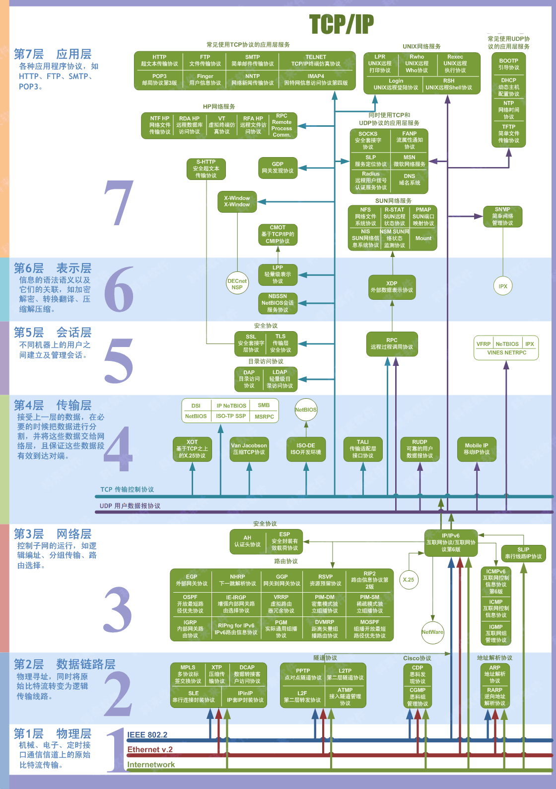
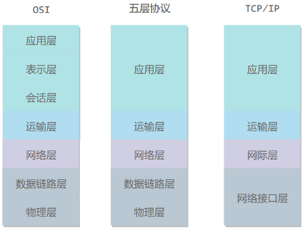

## 一、什么是计算机网络
计算机网络简称网络，其的主要目的是实现不同设备之间的资源共享和数据传输，而互联网（Internet）是一个将所有网络连接在一起的网络的总称。而不同网络之间能够有效通信所需要遵守的通信规则称为网络协议（可以是任意的）。

Internet（互联网）它指全球最大的，开放的，由众多网络相互连接而成的特定的互联网，并采用 `TCP/IP` 协议作为通信规则，其前身为 `ARPANET`；Internet 推荐译名为因特网，现在一般流行称为互联网。

### 1.1 基本术语
节点（Node）：理论上计算机网络中的节点可以是任意设备，但目前主要是指计算机，集线器，交换机或路由器等。

链路（Link）：链路是从一个节点到另一个节点的物理线路，中间没有其他任何交点。

主机（Host）：连接到网络的计算机。

ISP（Internet Service Provider）：因特网服务提供商。

IXP（Internet eXchange Point）：允许两个网络直接相连并交换分组，而不需要再通过第三个网络来转发分组。

RFC（Request For Comments）：包含了关于 Internet 几乎所有的重要的文字资料。

局域网（LAN，Local Area Network）：覆盖相对小范围区域的网络，通常用于家庭、办公室、学校或小型企业。

城域网（MAN，Metropolitan Area Network）：是覆盖一个城市或大都市区域的计算机网络，通常连接多个局域网（LAN），以提供广泛的通信和数据传输服务。

广域网（WAN，Wide Area Network）：是覆盖大范围地理区域的计算机网络，可以跨越城市、国家甚至洲际，连接多个局域网（LAN）和城域网（MAN）。

个人区域网（PAN，Personal Area Network）：是覆盖个人工作空间的小型网络，通常用于连接个人设备，如手机、平板电脑、笔记本电脑、智能手表等。

分组（packet ）：因特网中传送的数据单元。由首部 `header` 和数据段组成。分组又称为包，首部可称为包头。

存储转发（store and forward ）：路由器收到一个分组，先检查分组是否正确，并过滤掉冲突或错误的包。确定包正确后，取出目的地址，通过查找表找到想要发送的输出端口地址，然后将该包发送出去。

带宽（bandwidth）：单位时间内从网络中的某一点到另一点所能通过的 “最高数据率”。常用来表示网络的通信线路的数据传输能力。单位是：“比特每秒”，记为：`b/s`。

吞吐量（throughput ）：单位时间内通过某个网络（或信道、接口）的数据量。吞吐量更经常地用于对现实世界中的网络的一种测量，以便知道实际上到底有多少数据量能够通过网络。吞吐量受网络的带宽或网络的额定速率的限制。

### 1.2 重要知识点
互联网按工作方式可划分为边缘部分和核心部分。主机在网络的边缘部分，其作用是进行信息处理。由大量网络和连接这些网络的路由器等设备组成核心部分，其作用是提供连通性和交换。

- 计算机中的通信主要是指计算机应用程序（进程）之间的通信，计算机网络采用的通信方式是：客户-服务器方式（C/S 方式）和对等连接方式（P2P 方式），无论是客户端还是服务端其本质还是运行在计算机中的进程之间的通信。通常提供资源或服务的计算机称为：服务端或者服务器，而请求并使用服务器资源的计算机称为客户端。

- 作用范围的不同，计算机网络分为广域网 WAN，城域网 MAN，局域网 LAN，个人区域网 PAN。

- 路由器主要目的是连接不同网络并转发数据包的设备，是实现分组交换的关键构件，其任务是转发收到的分组，这是网络核心部分最重要的功能。
> 分组交换采用存储转发技术，即把需要发送的数据分段进行发送，而每段数据都加上必要的控制信息（目的地址、源地址等）组成的首部从而构成了一个分组（包），这是每个分组能在互联网中独立的选择传输路径根本原因。

- 计算机网络最常用的性能指标是：速率，带宽，吞吐量，时延（发送时延，处理时延，排队时延），时延带宽积，往返时间和信道利用率。

- 网络协议按作用的不同由下至上被分为七层：物理层、数据链路层、网络层、传输层、会话层、表示层、应用层。而在五层体系结构中：表示层和会话层同属于应用层。

