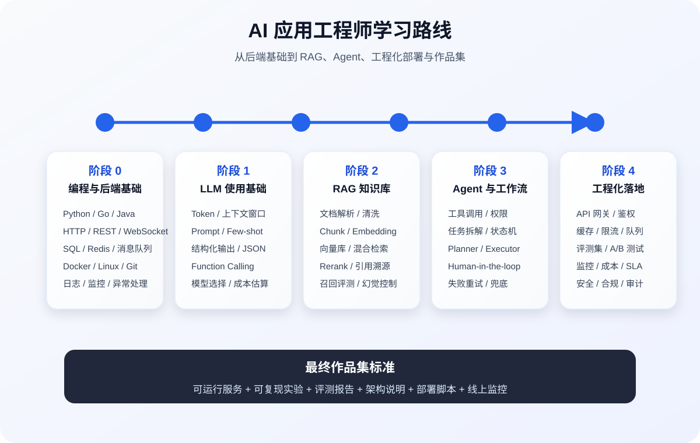
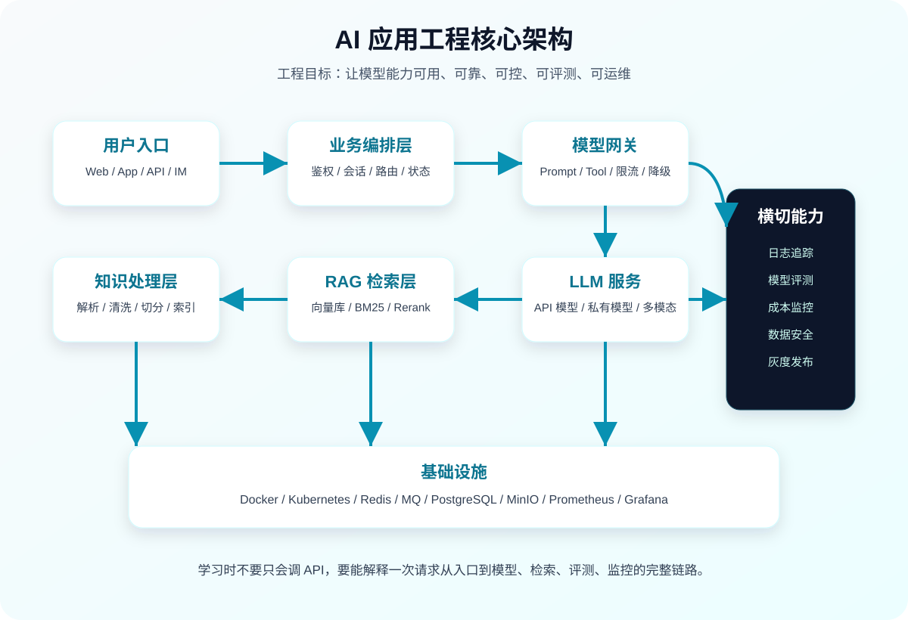

# AI 应用工程师从入门到实战的最佳学习路线

## 目标定位

AI 应用工程师不是纯算法研究岗，也不是只会调用大模型 API 的业务开发岗。核心职责是：**把模型能力、业务数据、工程系统组合成稳定可用的 AI 产品**。

这条路线面向零基础或后端基础较弱的人，从编程、后端、机器学习常识、大模型应用、RAG、Agent、工程化部署、评测监控一路推进。最终目标不是“看懂 AI”，而是能独立做出可上线的 AI 应用。



## 一、岗位能力模型

AI 应用工程师需要同时具备 5 类能力：

| 能力层 | 必须掌握 | 不必一开始深挖 |
|---|---|---|
| 编程与后端 | Python/Go/Java 任一门、HTTP、数据库、缓存、异步任务、Docker、日志监控 | 编译原理、复杂分布式共识 |
| AI 基础 | 机器学习基本概念、Embedding、Transformer、Token、上下文窗口、模型评估 | 从零训练大模型、论文级算法推导 |
| 大模型应用 | Prompt、结构化输出、Function Calling、RAG、Agent、模型网关 | 自研大模型预训练 |
| 数据工程 | 文档解析、清洗、切分、索引、向量检索、权限过滤、数据质量 | 大数据平台全家桶 |
| 工程化落地 | 鉴权、限流、缓存、队列、灰度、评测、监控、成本、安全、审计 | 过早追求复杂平台化 |

判断是否达到岗位要求，看 6 个问题：

1. 能否把一个业务问题拆成“确定性代码 + 模型推理 + 数据检索”三部分。
2. 能否设计一次 AI 请求的完整链路：入口、鉴权、上下文、检索、模型、工具、输出校验、日志。
3. 能否让模型输出稳定格式，并处理超时、失败、幻觉、越权、成本过高等问题。
4. 能否构建一个带权限、引用来源、效果评测的 RAG 知识库。
5. 能否让 Agent 安全调用工具，而不是无限循环、乱调用、越权调用。
6. 能否把应用部署起来，并用指标证明它是否好用。

## 二、阶段 0：编程与后端基础

如果没有工程基础，不要直接学 LangChain、RAG、Agent。AI 应用本质还是软件系统，模型只是其中一个能力节点。

### 1. 编程语言

优先选择 Python。原因是 AI 生态最完整，文档解析、Embedding、向量库、模型 SDK、评测工具都更成熟。

必须掌握：

| 知识点 | 学到什么程度 |
|---|---|
| 基础语法 | 函数、类、异常、模块、类型标注、虚拟环境 |
| 常用库 | requests/httpx、pydantic、pathlib、logging、pytest |
| 异步编程 | async/await、并发请求、超时控制 |
| 数据处理 | JSON、CSV、Markdown、PDF 文本抽取、正则基础 |
| 代码质量 | 分层结构、配置管理、单元测试、错误处理 |

练习任务：

1. 写一个命令行工具，读取本地 Markdown 文件，统计标题、字数、代码块数量。
2. 写一个 HTTP 客户端，支持超时、重试、错误日志。
3. 用 pytest 给核心函数补测试。

验收标准：

1. 项目可以通过 `README` 一键运行。
2. 配置不写死在代码里。
3. 失败时有明确错误信息。

### 2. 后端基础

AI 应用常见形态是 API 服务、知识库服务、任务处理服务、管理后台。后端基础必须够用。

必须掌握：

| 方向 | 知识点 |
|---|---|
| Web 协议 | HTTP、REST、SSE、WebSocket、状态码、请求超时 |
| API 开发 | FastAPI / Gin / Spring Boot 任一套 |
| 数据库 | PostgreSQL/MySQL 表设计、索引、事务、分页 |
| 缓存 | Redis 缓存、限流、分布式锁基础 |
| 异步任务 | Celery / RQ / MQ，用于文档解析、索引构建、批量评测 |
| 文件存储 | 本地文件、对象存储、文件元数据管理 |
| 工程运维 | Docker、环境变量、日志、健康检查 |

练习项目：做一个“文件管理 API”。

必须包含：

1. 文件上传、下载、删除。
2. 文件元数据入库。
3. 后台异步任务解析文件。
4. 查询任务状态。
5. Docker Compose 启动数据库和服务。

这个项目是后续知识库系统的地基。

## 三、阶段 1：AI 与大模型基础

AI 应用工程师不需要一开始推导所有算法，但必须知道模型为什么会出错、为什么需要检索、为什么需要评测。

### 1. 机器学习最小知识集

必须掌握：

| 概念 | 重点 |
|---|---|
| 监督学习 | 输入、标签、训练、预测、泛化 |
| 分类与回归 | 分类指标、回归指标、过拟合 |
| 向量表示 | 文本如何变成向量，相似度如何计算 |
| Embedding | 语义相似、召回、聚类、推荐 |
| 评估指标 | Accuracy、Precision、Recall、F1、Hit Rate、MRR |

不建议一开始深挖：

1. 手写反向传播。
2. 从零实现 CNN/RNN。
3. 大量刷 Kaggle。

这些对 AI 应用工程的直接收益不如 RAG、评测、工程化高。

### 2. 大模型基本原理

必须掌握：

| 概念 | 工程含义 |
|---|---|
| Token | 成本、上下文长度、截断问题都和 Token 有关 |
| 上下文窗口 | 一次请求能放多少历史、文档和指令 |
| Temperature | 控制随机性，问答系统通常低温，创作任务可略高 |
| Top-p | 控制候选词范围，影响输出发散程度 |
| System Prompt | 设定角色、边界、格式和安全约束 |
| Few-shot | 给示例让模型模仿格式和判断标准 |
| JSON Mode | 要求模型输出机器可解析结构 |
| Function Calling | 让模型选择工具，由代码执行真实动作 |

练习任务：

1. 同一个问题分别用不同 temperature 测试 20 次，观察稳定性。
2. 设计一个分类 Prompt，把用户问题分成“售前咨询、售后问题、投诉、其他”。
3. 要求模型输出 JSON，并用代码校验 schema。
4. 故意输入恶意指令，测试 Prompt 是否容易被绕过。

验收标准：

1. 输出格式不合法时能自动重试或返回可解释错误。
2. 模型回答不能直接写入数据库，必须经过业务校验。
3. Prompt、模型参数、版本号要可追踪。

## 四、阶段 2：大模型 API 应用开发

这一阶段的目标是：不用 RAG 和 Agent，也能做一个稳定的大模型功能。

### 1. 模型调用封装

不要在业务代码里到处直接调用厂商 SDK。应该封装模型客户端。

基础接口设计：

```python
class ChatModel:
    def chat(self, messages: list[dict], *, temperature: float = 0.2) -> str:
        ...

    def chat_json(self, messages: list[dict], schema: dict) -> dict:
        ...
```

必须处理：

1. API Key 不写死。
2. 超时控制。
3. 重试策略。
4. 错误分类：限流、认证失败、上下文超限、服务不可用。
5. 请求日志脱敏。
6. Token 用量统计。
7. 模型供应商可替换。

### 2. Prompt 工程

Prompt 不要写成一段自然语言散文，要写成可维护的模板。

推荐结构：

```text
角色：
你是一个合同审核助手。

任务：
根据输入合同条款识别风险点。

输入：
{{contract_text}}

判断标准：
1. 是否存在付款周期过长
2. 是否缺少违约责任
3. 是否存在单方解除条款

输出格式：
{
  "risk_level": "low|medium|high",
  "risks": [
    {
      "title": "...",
      "evidence": "...",
      "suggestion": "..."
    }
  ]
}

限制：
只能基于输入文本判断，不能编造合同中不存在的内容。
```

Prompt 管理要求：

| 要求 | 说明 |
|---|---|
| 版本化 | Prompt 改动要记录版本 |
| 参数化 | 业务变量通过模板注入 |
| 可测试 | 每个 Prompt 有测试样例 |
| 可回滚 | 新 Prompt 效果差时能切回旧版 |
| 可观测 | 日志记录 prompt_version 和 model_name |

练习项目：智能工单分类器。

功能要求：

1. 用户输入一段问题描述。
2. 模型判断工单类型、紧急程度、是否需要人工介入。
3. 输出结构化 JSON。
4. 后端校验 JSON，不合法自动重试一次。
5. 保存请求、输出、模型、耗时、Token 成本。

验收标准：

1. 准备 100 条测试工单。
2. 统计分类准确率。
3. 找出错误样本，调整 Prompt。
4. 写出评测报告。

## 五、阶段 3：RAG 知识库系统

RAG 是 AI 应用工程师最核心的实战能力之一。它解决的问题是：模型不知道你的私有知识，或者知道但不可靠。

RAG 基本链路：

```text
文档上传 -> 文档解析 -> 文本清洗 -> Chunk 切分 -> Embedding -> 向量索引
用户问题 -> Query 改写 -> 检索召回 -> Rerank -> 拼接上下文 -> LLM 生成 -> 引用溯源
```



### 1. 文档处理

必须掌握：

| 环节 | 关键点 |
|---|---|
| 文档解析 | PDF、Word、Markdown、HTML、Excel 的文本抽取 |
| 文本清洗 | 去页眉页脚、去重复、保留标题层级 |
| 元数据 | 文件 ID、章节、页码、权限、更新时间 |
| Chunk 切分 | 按标题、段落、Token 长度切分 |
| 增量更新 | 文档更新后只重建相关索引 |

Chunk 设计原则：

1. 每块文本要能独立表达一个完整语义。
2. 保留标题路径，例如“产品手册 > 计费规则 > 退款规则”。
3. 不要只按固定字符数硬切。
4. 需要 overlap，但不能过大，否则召回重复严重。
5. 每个 chunk 必须带 source，方便引用溯源。

### 2. Embedding 与向量库

必须掌握：

| 方向 | 知识点 |
|---|---|
| Embedding 模型 | 通用模型、中文模型、领域模型、多语言模型 |
| 相似度 | Cosine、Dot Product、Euclidean |
| 向量库 | Milvus、Qdrant、pgvector、FAISS、Chroma |
| 索引 | HNSW、IVF 基本概念 |
| 过滤 | tenant_id、user_id、doc_id、permission |

最小选型建议：

| 场景 | 推荐 |
|---|---|
| 本地学习 | Chroma / FAISS |
| 中小型项目 | PostgreSQL + pgvector |
| 大规模检索 | Milvus / Qdrant |
| 快速原型 | 托管向量数据库 |

### 3. 检索策略

只做向量检索通常不够。生产系统一般需要混合检索。

常见策略：

| 策略 | 解决问题 |
|---|---|
| 向量检索 | 语义相似问题 |
| BM25 | 精确关键词、编号、专有名词 |
| Hybrid Search | 同时兼顾语义和关键词 |
| Query Rewrite | 用户问题太短或表达不清时改写 |
| Multi Query | 生成多个等价问题扩大召回 |
| Rerank | 对召回结果重新排序，提高上下文质量 |
| Metadata Filter | 按租户、权限、文档类型过滤 |

RAG 最容易出问题的点：

1. 文档解析质量差，垃圾文本进入索引。
2. Chunk 太大，召回后上下文噪声多。
3. Chunk 太小，语义不完整。
4. 只用向量检索，召回不到精确条款。
5. 没做权限过滤，导致越权问答。
6. 没有引用来源，用户无法验证答案。
7. 没有评测集，只凭主观感觉调参数。

练习项目：企业制度知识库问答。

功能要求：

1. 上传 Markdown/PDF 文档。
2. 自动解析、切分、向量化。
3. 支持用户提问。
4. 返回答案、引用片段、来源文件、页码或章节。
5. 支持 tenant_id 或 user_id 权限过滤。
6. 提供检索调试页面：展示 query、召回 chunk、分数、rerank 结果。
7. 提供评测脚本：输入问题集，输出召回率和答案质量。

验收指标：

| 指标 | 合格线 |
|---|---|
| Top-5 召回率 | 80% 以上 |
| 答案引用命中率 | 80% 以上 |
| 无依据回答率 | 低于 5% |
| 平均响应时间 | 业务可接受范围内 |
| 越权召回 | 必须为 0 |

## 六、阶段 4：Agent 与工具调用

Agent 不是让模型自由发挥，而是让模型在受控边界内调用工具完成任务。

### 1. Agent 的本质

典型结构：

```text
用户目标 -> 任务理解 -> 计划生成 -> 工具选择 -> 工具执行 -> 观察结果 -> 继续或结束
```

工程上要明确：

1. 模型只负责“判断和生成参数”。
2. 真实动作必须由代码执行。
3. 工具调用必须有权限、参数校验和审计日志。
4. 高风险动作必须人工确认。
5. 必须限制循环次数和最大执行时间。

### 2. 工具设计

工具定义要清晰，不要暴露万能工具。

好的工具：

```json
{
  "name": "query_order_status",
  "description": "根据订单号查询订单状态",
  "parameters": {
    "order_id": "string"
  }
}
```

危险工具：

```json
{
  "name": "run_sql",
  "description": "执行任意 SQL"
}
```

工具调用安全清单：

| 风险 | 控制方式 |
|---|---|
| 越权查询 | user_id、tenant_id 强制注入，不能由模型生成 |
| 参数伪造 | pydantic/schema 校验 |
| 高风险操作 | 人工确认、二次校验 |
| 无限循环 | max_steps、timeout |
| 提示注入 | 工具说明和系统指令隔离 |
| 敏感数据泄露 | 输出脱敏、权限过滤 |

练习项目：订单售后 Agent。

功能要求：

1. 用户输入自然语言，例如“帮我查一下订单 A123 为什么还没发货”。
2. Agent 判断需要调用订单查询工具。
3. 工具返回订单状态、物流状态、异常原因。
4. Agent 生成给用户的解释。
5. 如果需要退款或改地址，必须进入人工确认。
6. 全链路记录工具调用日志。

验收标准：

1. 不能查询当前用户无权限的订单。
2. 模型不能直接编造订单状态。
3. 工具失败时有兜底话术。
4. 高风险动作不会自动执行。

## 七、阶段 5：工程化部署与稳定性

AI 应用上线后，真正的问题是稳定性、成本、延迟、可观测性和安全。

### 1. 标准架构

一个可落地的 AI 应用通常包含：

| 模块 | 职责 |
|---|---|
| API 服务 | 用户请求入口、鉴权、参数校验 |
| 模型网关 | 统一封装模型供应商、重试、限流、降级 |
| RAG 服务 | 文档解析、索引、检索、rerank |
| Agent 服务 | 工具注册、任务编排、执行控制 |
| 任务队列 | 文档索引、批量评测、异步生成 |
| 数据库 | 用户、文档、会话、日志、评测数据 |
| 缓存 | 热点问题、会话状态、限流计数 |
| 对象存储 | 原始文件、解析结果、报告 |
| 监控系统 | 延迟、错误率、Token、成本、召回质量 |

### 2. 必备工程能力

| 能力 | 具体做法 |
|---|---|
| 超时 | 模型请求、检索请求、工具调用分别设置 timeout |
| 重试 | 只对可重试错误重试，避免重复执行高风险动作 |
| 降级 | 模型不可用时返回模板答案或转人工 |
| 缓存 | 对高频问答、Embedding、检索结果做缓存 |
| 限流 | 按用户、租户、接口、模型维度限流 |
| 成本控制 | 记录 input_tokens、output_tokens、请求次数 |
| 灰度发布 | 新模型、新 Prompt、新检索策略小流量验证 |
| 监控告警 | 错误率、P95 延迟、成本突增、无答案率 |
| 审计 | 记录用户请求、模型输出、工具调用、人工确认 |

### 3. 评测体系

没有评测，就没有优化。AI 应用不能只靠“看起来还行”。

RAG 评测：

| 指标 | 含义 |
|---|---|
| Recall@K | 正确文档是否被召回 |
| MRR | 正确结果排得是否靠前 |
| Context Precision | 召回上下文是否干净 |
| Faithfulness | 答案是否忠于上下文 |
| Citation Accuracy | 引用是否真的支持答案 |

大模型输出评测：

| 指标 | 含义 |
|---|---|
| 格式合法率 | JSON/schema 是否可解析 |
| 任务成功率 | 是否完成业务目标 |
| 幻觉率 | 是否编造事实 |
| 拒答准确率 | 不该回答时是否拒答 |
| 人工满意度 | 业务人员打分 |

评测集构建方法：

1. 从真实用户问题中抽样。
2. 标注标准答案和依据文档。
3. 覆盖正常问题、模糊问题、越权问题、恶意问题、无答案问题。
4. 每次改 Prompt、模型、Embedding、切分策略都跑评测。
5. 保存每次实验结果，形成对比表。

## 八、阶段 6：安全与合规

AI 应用比普通后端更容易出现“看不见的风险”，因为模型会生成内容、调用工具、处理私有数据。

必须掌握：

| 风险 | 例子 | 防护 |
|---|---|---|
| Prompt Injection | 文档里写“忽略之前指令” | 系统指令隔离、检索内容降权、输出校验 |
| 数据泄露 | 回答了其他租户的文档 | 强制权限过滤、审计日志 |
| 幻觉 | 编造制度、价格、订单状态 | 引用溯源、无依据拒答 |
| 工具滥用 | 模型调用删除接口 | 权限控制、人工确认、工具白名单 |
| 成本攻击 | 大量长文本请求 | 限流、Token 上限、用户配额 |
| 敏感信息输出 | 输出手机号、身份证 | 脱敏、敏感词检测 |

安全底线：

1. 模型不能决定用户权限。
2. 模型不能直接执行高风险动作。
3. 私有知识检索必须先过滤权限，再参与生成。
4. 所有工具调用必须可审计。
5. 输出给用户前必须做业务规则校验。

## 九、推荐技术栈

### 1. 入门实战栈

| 层级 | 推荐 |
|---|---|
| 语言 | Python |
| Web 框架 | FastAPI |
| 数据库 | PostgreSQL |
| 向量检索 | pgvector / Chroma |
| 缓存 | Redis |
| 文档解析 | pymupdf、python-docx、markdown、beautifulsoup4 |
| 模型调用 | OpenAI-compatible SDK / LiteLLM |
| 任务队列 | Celery / RQ |
| 部署 | Docker Compose |
| 测试 | pytest |

### 2. 进阶生产栈

| 层级 | 推荐 |
|---|---|
| 服务治理 | API Gateway、限流、鉴权 |
| 向量数据库 | Milvus / Qdrant |
| Rerank | bge-reranker、厂商 rerank API |
| 监控 | Prometheus、Grafana、OpenTelemetry |
| 日志 | ELK / Loki |
| 对象存储 | MinIO / S3 |
| 容器编排 | Kubernetes |
| 评测 | RAGAS、自研评测脚本、人工标注平台 |

不要一开始堆框架。学习顺序应该是：

```text
裸 API 调用 -> 自己封装模型客户端 -> 自己写 RAG 链路 -> 再看 LangChain/LlamaIndex
```

先理解链路，再使用框架。否则出了问题不知道是 Prompt、检索、切分、Embedding、Rerank 还是框架默认配置导致的。

## 十、实战项目路线

按下面顺序做项目，每个项目都要可运行、可测试、可部署。

| 项目 | 目标能力 | 必做功能 |
|---|---|---|
| 1. 智能工单分类器 | Prompt、结构化输出、评测 | 分类、紧急度、JSON 校验、准确率统计 |
| 2. 文档解析与索引服务 | 数据处理、异步任务 | 上传、解析、切分、Embedding、索引状态 |
| 3. 企业知识库问答 | RAG 全链路 | 检索、rerank、引用来源、权限过滤 |
| 4. 售后 Agent | 工具调用、任务编排 | 查询订单、生成解释、高风险动作人工确认 |
| 5. AI 应用网关 | 工程化 | 模型路由、限流、成本统计、日志追踪 |
| 6. 评测平台雏形 | 持续优化 | 问题集、批量评测、版本对比、报告导出 |

作品集最低标准：

1. Git 仓库结构清晰。
2. README 写明架构、启动方式、接口示例。
3. Docker Compose 一键启动。
4. 提供测试数据和评测脚本。
5. 有架构图和核心流程图。
6. 有失败案例分析，而不是只展示成功样例。
7. 有成本、延迟、准确率等指标。

## 十一、学习顺序与时间安排

### 第 1 阶段：0 到 4 周

目标：补齐 Python 和后端基础。

任务：

1. Python 基础和类型标注。
2. FastAPI 写增删改查接口。
3. PostgreSQL 表设计和索引。
4. Redis 缓存和限流。
5. Docker Compose 部署服务。

产出：

1. 文件管理 API。
2. 异步文档解析任务。
3. 基础单元测试。

### 第 2 阶段：第 5 到 8 周

目标：掌握大模型 API、Prompt、结构化输出。

任务：

1. 封装模型客户端。
2. 实现 JSON 输出校验和重试。
3. 做智能工单分类器。
4. 建立 100 条样本评测集。

产出：

1. Prompt 版本管理。
2. 分类准确率报告。
3. Token 成本统计。

### 第 3 阶段：第 9 到 14 周

目标：做出可用 RAG 知识库。

任务：

1. 文档解析、清洗、切分。
2. Embedding 和向量库。
3. 混合检索和 rerank。
4. 引用溯源。
5. 权限过滤。
6. RAG 评测。

产出：

1. 企业制度知识库问答系统。
2. 检索调试页面。
3. 评测报告。

### 第 4 阶段：第 15 到 20 周

目标：掌握 Agent 和工程化。

任务：

1. 工具注册和 schema 校验。
2. Agent 任务编排。
3. 人工确认机制。
4. 限流、缓存、降级、监控。
5. 灰度 Prompt 和模型版本。

产出：

1. 售后 Agent。
2. 模型网关。
3. 监控面板。
4. 完整作品集。

## 十二、面试准备清单

### 1. 必会问题

| 问题 | 回答要点 |
|---|---|
| RAG 为什么能减少幻觉？ | 引入外部可靠上下文，但不能完全消除幻觉，仍需引用和评测 |
| Chunk 怎么切？ | 按语义结构、标题层级、Token 长度、overlap、元数据综合设计 |
| 向量检索和关键词检索区别？ | 语义相似 vs 精确匹配，生产常用混合检索 |
| Rerank 有什么用？ | 对粗召回结果重排，提高进入上下文的内容质量 |
| Function Calling 是否等于函数执行？ | 不是，模型只生成调用意图和参数，代码负责执行 |
| 如何防止越权问答？ | 检索前强制 metadata 权限过滤，模型不能决定权限 |
| 如何评估 AI 应用效果？ | 构建评测集，统计召回、格式合法、任务成功、幻觉、满意度 |
| 如何控制成本？ | Token 统计、缓存、模型分级、限流、摘要压缩、批处理 |

### 2. 项目讲解模板

面试讲项目时按这个顺序：

1. 业务问题：为什么需要 AI。
2. 系统架构：入口、数据、检索、模型、工具、存储、监控。
3. 核心难点：比如召回差、幻觉、权限、延迟、成本。
4. 解决方案：切分策略、混合检索、rerank、引用、评测。
5. 指标结果：准确率、召回率、延迟、成本、人工满意度。
6. 失败案例：哪些问题没解决好，如何迭代。

不要只说“用了 LangChain”。要能讲清楚每一步为什么这么设计。

## 十三、常见误区

| 误区 | 正确做法 |
|---|---|
| 一上来学深度学习数学推导 | 先学工程链路和大模型应用，数学按需补 |
| 只会调 API | 封装模型网关，处理错误、限流、成本、日志 |
| 认为 RAG 就是向量库 | RAG 包括解析、切分、召回、重排、生成、引用、评测 |
| 迷信 Agent | 能用确定性流程解决的，不要交给 Agent |
| 不做评测 | 每次改模型、Prompt、切分策略都要跑评测 |
| 忽略权限 | 多租户知识库必须先权限过滤再召回 |
| 过早用复杂框架 | 先手写最小链路，再引入框架提高效率 |

## 十四、最终能力验收

学完这条路线，至少应该能独立完成：

1. 封装一个支持多模型供应商的 LLM 客户端。
2. 设计稳定输出 JSON 的 Prompt，并做 schema 校验。
3. 构建一个支持文档上传、解析、切分、索引的知识库。
4. 实现带引用来源和权限过滤的 RAG 问答。
5. 实现一个可控 Agent，让它安全调用业务工具。
6. 建立评测集，对 Prompt、检索、模型版本做对比。
7. 部署完整应用，提供日志、监控、限流、成本统计。
8. 写出项目架构文档和技术复盘。

一句话标准：**不要只证明你会用 AI，要证明你能把 AI 做成可靠的软件系统。**
