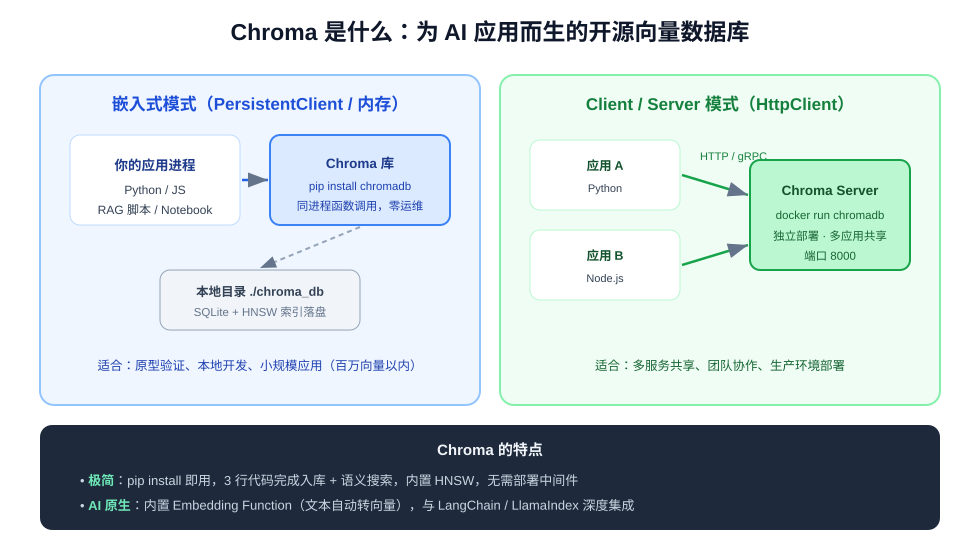
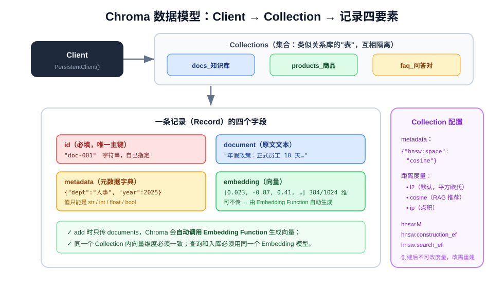
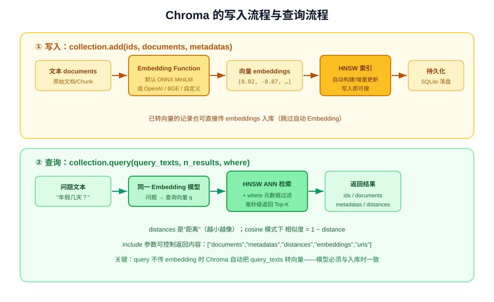
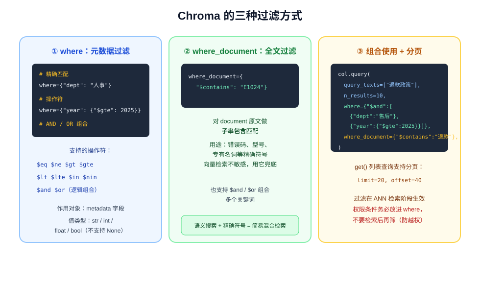
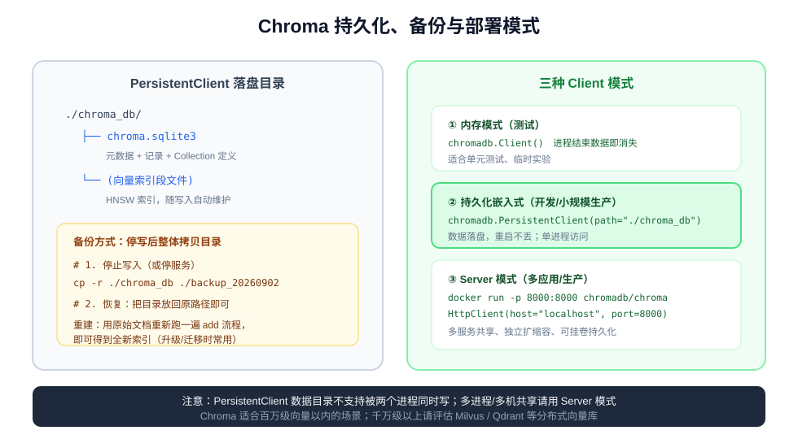

# Chroma 入门手册：从零上手最轻量的向量数据库

> **Chroma** 是一款开源的 AI 原生向量数据库，主打"**pip install 即用、3 行代码完成语义搜索**"。
> 它内置 Embedding（自动把文本转向量）、内置 HNSW 索引、数据自动落盘，是学习 RAG 和搭建小型语义搜索系统的最佳起点。
> 本篇从安装、核心概念、CRUD、查询过滤到 LangChain 实战与部署排错，带你从入门到实战。
> （原理背景可参阅同目录《向量数据库》《什么是RAG》。）

---

## 一、Chroma 是什么

在向量数据库家族（Milvus、Qdrant、pgvector、Chroma……）中，Chroma 的定位非常明确：**为开发者和 AI 应用
提供最低门槛的向量存储与检索**。



核心特点：

1. **极简**：一条 `pip install chromadb` 装好，无需部署任何中间件；以 Python/JS 库的形式直接嵌入应用进程；
2. **AI 原生**：内置 Embedding Function——你只需要传入**文本**，Chroma 自动完成"文本 → 向量"的转换与索引；
3. **自带持久化**：`PersistentClient` 一条指定目录，数据自动落盘为 SQLite + 索引文件，重启不丢；
4. **生态友好**：LangChain / LlamaIndex 官方一等集成，RAG 教程中出现率最高的向量库；
5. **可平滑演进**：原型用嵌入式模式，上生产后可切换为 Docker 部署的 Server 模式（HttpClient），业务代码几乎不变。

**适用规模**：个人项目、原型验证、百万级向量以内的应用。千万级以上或需要分布式集群时，再评估 Milvus / Qdrant。

---

## 二、安装与环境准备

### 2.1 基本安装

```bash
pip install chromadb
```

建议 Python 3.10+。安装后验证：

```bash
python -c "import chromadb; print(chromadb.__version__)"
```

### 2.2 Windows 环境的常见坑（重要）

Chroma 的**默认 Embedding 模型基于 ONNX Runtime**，在 Windows 上首次导入/使用时可能报错：

```text
ImportError: DLL load failed while importing onnxruntime.capi._pybind_state
```

按以下顺序排查解决：

1. **安装 Visual C++ 运行库**：安装 [Microsoft Visual C++ Redistributable](https://learn.microsoft.com/cpp/windows/latest-supported-vc-redist)（2019/2022 版，64 位）；
2. **显式安装 onnxruntime**：

   ```bash
   pip install onnxruntime
   ```

3. **确认 Python 环境**：使用 64 位 Python 3.10~3.12；32 位 Python 无法加载 onnxruntime；
4. **代码侧规避**：业务代码中可以**延迟导入** chromadb（在函数内部 import），并在创建 Collection 时
   **显式传入 Embedding Function**（见第五节），避免任何路径意外触发默认 ONNX 组件初始化。

用最小脚本定位问题（先确认是"导入期"还是"调用期"失败，保留完整 traceback）：

```python
# 最小复现脚本：分别验证 chromadb 导入、默认 Embedding、检索三件事
import chromadb
client = chromadb.Client()
col = client.get_or_create_collection("test")
col.add(ids=["1"], documents=["hello world"])
print(col.query(query_texts=["hello"], n_results=1))
```

> 💡 **中文用户的额外建议**：Chroma 默认模型 `all-MiniLM-L6-v2` 是**英文模型**，中文语义检索效果较差。
> 中文项目建议直接换用 BGE 系列中文模型（见 5.2 节），可以同时绕开默认 ONNX 依赖问题。

---

## 三、5 分钟快速上手

```python
import chromadb

# 1. 创建客户端：PersistentClient 数据落盘到本地目录
client = chromadb.PersistentClient(path="./chroma_db")

# 2. 创建（或获取）集合：类似关系数据库里的"表"
collection = client.get_or_create_collection(
    name="faq",
    metadata={"hnsw:space": "cosine"},   # RAG 场景推荐余弦距离
)

# 3. 写入数据：只传文本，向量由内置 Embedding 模型自动生成
collection.add(
    ids=["1", "2", "3"],
    documents=[
        "年假政策：正式员工每年 10 天带薪年假，司龄满 5 年为 15 天。",
        "报销流程：差旅费需在出差结束后 10 个工作日内提交发票。",
        "考勤制度：标准工作时间为 9:00-18:00，午休 1 小时。",
    ],
    metadatas=[
        {"dept": "人事", "year": 2025},
        {"dept": "财务", "year": 2025},
        {"dept": "人事", "year": 2024},
    ],
)

# 4. 语义搜索：问"休假几天？"也能命中"年假"那条（不依赖字面匹配）
results = collection.query(
    query_texts=["入职六年能休多久年假？"],
    n_results=2,
)

print(results["documents"][0])   # 最相关的文档
print(results["distances"][0])   # 距离（越小越相似）
```

注意第 3 步：我们**没有手动提供向量**，Chroma 自动调用 Embedding Function 把文本转为向量、写入 HNSW 索引——
这就是"AI 原生"的含义。

---

## 四、核心概念与数据模型



### 4.1 Client（客户端）

Client 是操作 Chroma 的入口，有三种形态（详见第八节）：

```python
chromadb.Client()                               # 内存模式：进程结束数据消失，用于测试
chromadb.PersistentClient(path="./chroma_db")   # 持久化嵌入式：开发/单机生产
chromadb.HttpClient(host="localhost", port=8000)  # Server 模式：连接独立部署的 Chroma 服务
```

### 4.2 Collection（集合）

Collection 类似关系库中的**表**，一个 Client 下可以有多个 Collection（如 `faq`、`products`、`docs`），
彼此数据隔离。每个 Collection 在创建时绑定：

- 一个 **Embedding Function**（不指定则用默认 ONNX MiniLM）；
- 距离度量（通过 metadata 配置，**创建后不可改**，改需删表重建）：

```python
collection = client.get_or_create_collection(
    name="docs",
    embedding_function=my_ef,
    metadata={
        "hnsw:space": "cosine",      # l2（默认）/ cosine / ip
        "hnsw:M": 32,                # HNSW 图节点最大连边数
        "hnsw:construction_ef": 200, # 建索引搜索宽度
        "hnsw:search_ef": 128,       # 查询搜索宽度，越大召回越高、越慢
    },
)
```

### 4.3 记录（Record）的四个字段

| 字段 | 必填 | 说明 |
| --- | --- | --- |
| `ids` | ✅ | 唯一主键，字符串列表，如 `["doc-1", "doc-2"]`，重复 id 会报错 |
| `documents` | 二选一 | 原文文本，Chroma 自动调用 Embedding Function 转向量 |
| `embeddings` | 二选一 | 手动提供向量（已用其他模型算好时），则跳过自动 Embedding |
| `metadatas` | 可选 | 每个记录一个字典，值只支持 `str / int / float / bool`，用于过滤 |

关键约束：

- **同一 Collection 内所有向量维度必须一致**（由 Embedding 模型决定，如 MiniLM 是 384 维、BGE-small 是 512 维）；
- **入库与查询必须使用同一个 Embedding 模型**，否则向量不在同一空间，结果完全错乱。

---

## 五、Embedding Function：文本如何变成向量



### 5.1 默认 Embedding Function

不显式指定时，Chroma 使用 `all-MiniLM-L6-v2`（ONNX 本地推理，384 维，**英文为主**）。
优点是离线、免费、无 API Key；缺点是中文效果一般，且依赖 onnxruntime（见 2.2 节）。

### 5.2 常用 Embedding Function 配置

**OpenAI（效果稳定，需 API Key）：**

```python
from chromadb.utils import embedding_functions

ef = embedding_functions.OpenAIEmbeddingFunction(
    api_key="sk-xxx",
    model_name="text-embedding-3-small",   # 1536 维
    # api_base="https://your-proxy/v1",     # 走代理/兼容服务时配置
)
col = client.get_or_create_collection("docs", embedding_function=ef)
```

**中文场景推荐：BGE 系列（本地推理、免费、中文效果优秀）：**

```bash
pip install sentence-transformers
```

```python
ef = embedding_functions.SentenceTransformerEmbeddingFunction(
    model_name="BAAI/bge-small-zh-v1.5",   # 512 维，中文轻量首选
    # model_name="BAAI/bge-m3",            # 多语言、长文本、混合检索，更重更强
)
```

### 5.3 自定义 Embedding Function

接入任何向量模型（本地模型、公司内部 API）只需实现 `__call__`，输入文本列表、返回向量列表：

```python
from chromadb import Documents, EmbeddingFunction, Embeddings

class MyEmbeddingFunction(EmbeddingFunction):
    def __call__(self, input: Documents) -> Embeddings:
        # 示例：调用任意模型/服务，把 List[str] 转为 List[List[float]]
        return [my_model.encode(text) for text in input]

ef = MyEmbeddingFunction()
col = client.get_or_create_collection("docs", embedding_function=ef)
```

> 注意：自定义类在 Server 模式下需要在服务端可导入；嵌入式模式直接使用即可。

---

## 六、数据的增删改查

### 6.1 写入 add / 更新 update / 插入或更新 upsert

```python
# 新增（id 已存在会报错）
collection.add(ids=["1"], documents=["..."], metadatas=[{"dept": "人事"}])

# 更新：必须针对已存在的 id，可只更新部分字段
collection.update(ids=["1"], metadatas={"dept": "人力资源"})
collection.update(ids=["1"], documents=["更新后的原文……"])  # 文本变了会自动重算向量

# upsert：存在则更新、不存在则插入（同步数据时最常用）
collection.upsert(ids=["1", "4"], documents=["...", "..."], metadatas=[...])
```

> `documents` 或 `embeddings` 更新时，对应向量会**自动重新计算**，无需手动维护索引。

### 6.2 删除 delete

```python
collection.delete(ids=["1", "2"])                       # 按 id 删
collection.delete(where={"dept": "财务"})                # 按元数据条件删
collection.delete(where_document={"$contains": "草稿"})  # 按原文内容删
```

### 6.3 查询 get（按条件取原始数据，不做向量搜索）

```python
# get 不做相似度搜索，按 id / 过滤条件取记录，支持分页
res = collection.get(
    ids=["1", "2"],
    where={"year": {"$gte": 2025}},
    limit=20,
    offset=0,
    include=["documents", "metadatas"],
)
```

---

## 七、语义查询与过滤



### 7.1 基础语义查询

```python
results = collection.query(
    query_texts=["年假有多少天？"],   # 自动转向量；也可直接传 query_embeddings
    n_results=5,
    include=["documents", "metadatas", "distances"],
)

# 返回结构：每个 key 对应一个"按查询分组"的列表
results["ids"][0]        # ["3", "1", ...]
results["documents"][0]  # 文本
results["metadatas"][0]  # 元数据
results["distances"][0]  # 距离：越小越相似；cosine 模式下 相似度 ≈ 1 − distance
```

### 7.2 where：元数据过滤

操作符：`$eq` `$ne` `$gt` `$gte` `$lt` `$lte` `$in` `$nin`，逻辑组合用 `$and` / `$or`：

```python
collection.query(
    query_texts=["退款政策"],
    n_results=10,
    where={"$and": [
        {"dept": "售后"},            # $eq 可简写为键值对
        {"year": {"$gte": 2025}},
        {"status": {"$in": ["published", "effective"]}},
    ]},
)
```

### 7.3 where_document：全文子串过滤

向量检索对**错误码、型号、专有名词**等精确符号不敏感，可用 `$contains` 兜底（简易混合检索）：

```python
collection.query(
    query_texts=["这个错误怎么处理"],
    n_results=5,
    where_document={"$contains": "E1024"},
)
```

> ⚠️ **权限过滤必须写在 `where` 里**（如 `{"user_id": 当前用户}`），在检索阶段就排除无权数据；
> 绝不能"先检索、再在代码里筛"，那会造成越权泄露。

---

## 八、Collection 管理、持久化与部署



### 8.1 Collection 管理

```python
client.list_collections()                      # 列出所有集合
col = client.get_collection("docs")            # 获取已有集合
client.delete_collection("temp")               # 删除集合（连同数据，谨慎！）
col.modify(name="docs_v2", metadata={...})     # 重命名/修改配置
col.count()                                    # 记录数
col.peek(10)                                   # 预览前 10 条，调试用
```

### 8.2 持久化与备份

- `PersistentClient(path="./chroma_db")` 的数据落在目录中（`chroma.sqlite3` 元数据 + 索引文件），
  **写入即落盘，无需手动 persist**；
- **备份**：停止写入后整体拷贝目录即可，恢复时放回原路径；
- **迁移/升级**：用原始文档重新跑一遍 `add` 流程重建索引，是最稳妥的方式（Embedding 模型变更后也必须重建）。

### 8.3 Server 模式部署（多应用共享 / 生产）

```bash
docker run -d --name chroma -p 8000:8000 \
  -v $(pwd)/chroma_data:/chroma/chroma \
  chromadb/chroma
```

应用侧把 Client 换成 HttpClient，**业务代码完全不变**：

```python
client = chromadb.HttpClient(host="localhost", port=8000)
```

> 注意：持久化目录**不支持两个进程同时写入**；多进程/多机共享时必须走 Server 模式。

---

## 九、实战：用 Chroma + LangChain 搭建 RAG

Chroma 最常见的用途是作为 RAG 的向量存储层。安装集成包：

```bash
pip install langchain langchain-chroma langchain-openai pypdf
```

```python
from langchain_community.document_loaders import DirectoryLoader, PyPDFLoader
from langchain_text_splitters import RecursiveCharacterTextSplitter
from langchain_openai import OpenAIEmbeddings, ChatOpenAI
from langchain_chroma import Chroma
from langchain.chains import create_retrieval_chain
from langchain.chains.combine_documents import create_stuff_documents_chain
from langchain_core.prompts import ChatPromptTemplate

# 1. 加载并切分文档
docs = DirectoryLoader("docs/", glob="**/*.pdf", loader_cls=PyPDFLoader).load()
chunks = RecursiveCharacterTextSplitter(chunk_size=500, chunk_overlap=80).split_documents(docs)

# 2. 写入 Chroma（persist_directory 自动持久化，无需调用 persist()）
vectorstore = Chroma.from_documents(
    documents=chunks,
    embedding=OpenAIEmbeddings(model="text-embedding-3-small"),
    collection_name="company_docs",
    persist_directory="./chroma_db",
    collection_metadata={"hnsw:space": "cosine"},
)

# 3. 语义检索（带元数据过滤）
hits = vectorstore.similarity_search(
    "年假有多少天？", k=5, filter={"dept": "人事"}
)

# 4. 组装 RAG 链
retriever = vectorstore.as_retriever(search_kwargs={"k": 5})
llm = ChatOpenAI(model="gpt-4o-mini", temperature=0)
prompt = ChatPromptTemplate.from_template(
    "请只根据下面资料回答，没有依据就说'根据现有资料无法回答'：\n\n{context}\n\n问题：{input}"
)
rag_chain = create_retrieval_chain(
    retriever, create_stuff_documents_chain(llm, prompt)
)
print(rag_chain.invoke({"input": "年假有多少天？"})["answer"])
```

LangChain 的 `Chroma` 底层就是 `PersistentClient`，`filter=` 参数对应原生 `where`，
因此第七节讲的过滤写法全部适用。

---

## 十、常见坑与排错清单

| 现象 | 原因 | 解决 |
| --- | --- | --- |
| Windows 导入报 `DLL load failed: onnxruntime` | 缺 VC++ 运行库 / 32 位 Python | 装 VC++ Redist、`pip install onnxruntime`、用 64 位 Python |
| 中文搜索"感觉不智能" | 默认 MiniLM 是英文模型 | 换 `bge-small-zh-v1.5` 等中文 Embedding Function |
| 改了距离度量/模型后结果混乱 | 度量与 Embedding 在建表后绑定，旧向量与新配置不匹配 | 删除 Collection，用新配置重新 add 全量数据 |
| `add` 报维度不一致错误 | 同一 Collection 混用了不同模型的向量 | 一个 Collection 只用一个 Embedding 模型 |
| 入库后查不到新数据 | 误把内存 `Client()` 当持久化 | 用 `PersistentClient(path=...)` |
| 检索结果被权限外数据污染 | 权限过滤写在检索之后 | 权限条件放进 `where`，检索阶段过滤 |
| `id` 冲突报错 | 重复 add 相同 id | 增量同步用 `upsert` 而非 `add` |
| 查询慢/召回低 | HNSW 默认参数保守 | 建表时调大 `hnsw:search_ef`（查询期）和 `M` |
| metadata 存 None / list 报错 | metadata 值只支持 str/int/float/bool | 复杂结构序列化为 JSON 字符串存储 |
| 多进程同时写目录损坏 | 持久化目录不支持多写者 | 改用 Server 模式（HttpClient） |

**排错方法论**（源自实战经验）：遇到问题先用最小脚本把失败定位在"导入期 / 初始化期 / 调用期"哪一层，
保留完整 traceback；根因是底层依赖问题时，优先做最小侵入的规避（显式指定 Embedding Function、延迟导入），
而不是大范围重写业务代码；**严禁在初始化逻辑里做 `delete_collection` 之类的破坏性操作**，删除应做成
显式管理函数由人工/上层调用。

---

## 十一、小结

| 知识点 | 一句话总结 |
| --- | --- |
| Chroma 定位 | 最轻量的 AI 原生向量数据库，嵌入式起步、Server 模式演进 |
| 三种 Client | `Client` 内存测试、`PersistentClient` 落盘单机、`HttpClient` 连 Docker 服务 |
| 数据模型 | Client → Collection（表）→ 记录四要素：ids / documents / embeddings / metadatas |
| 自动 Embedding | 只传 documents 即可自动转向量；中文项目换 BGE 模型 |
| 距离度量 | RAG 用 `cosine`，建表时指定、之后不可改；返回的 distance 越小越像 |
| 写操作 | `add` 新增、`update` 更新、`upsert` 存在即更新（同步首选）、`delete` 删除 |
| 查询 | `query` 语义搜索 + `where` 元数据过滤 + `where_document` 全文过滤 |
| 权限 | 权限条件必须进 `where` 在检索阶段生效，禁止先查后筛 |
| 备份 | 停写拷目录；换模型必须全量重建索引 |
| RAG 集成 | `langchain-chroma` 的 `Chroma.from_documents` 一步入库，filter 对应 where |

Chroma 把向量数据库的使用门槛降到了"和操作一个 Python 列表差不多"的程度，非常适合用来吃透 RAG 的
完整链路：**切块 → Embedding → 入库 → 语义检索 → 拼 Prompt**。等数据规模、并发或多服务共享的需求
超出单机边界时，你在 Chroma 上学到的数据模型、过滤、距离度量、Embedding 选型等概念，可以零成本迁移到
Milvus、Qdrant、pgvector 等生产级向量库。
