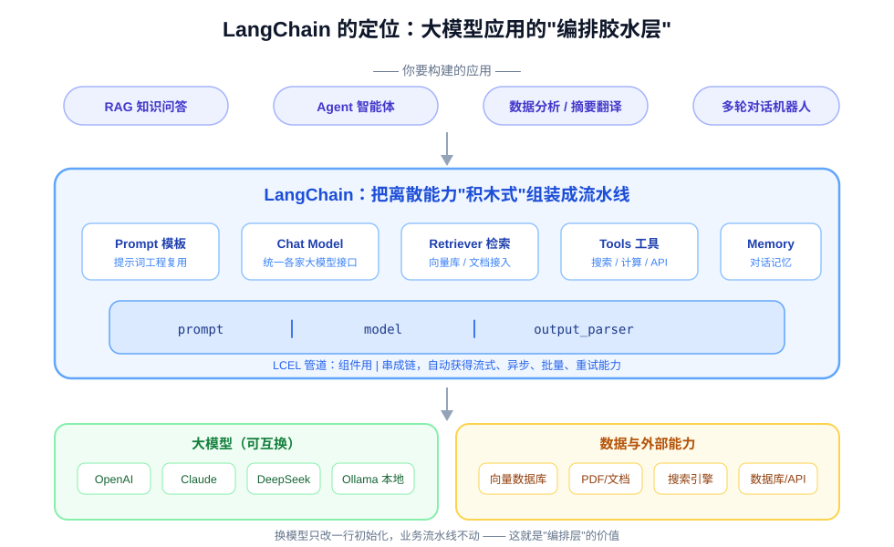
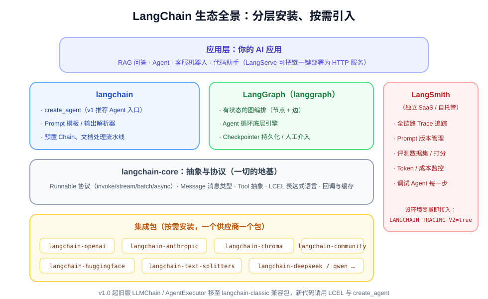
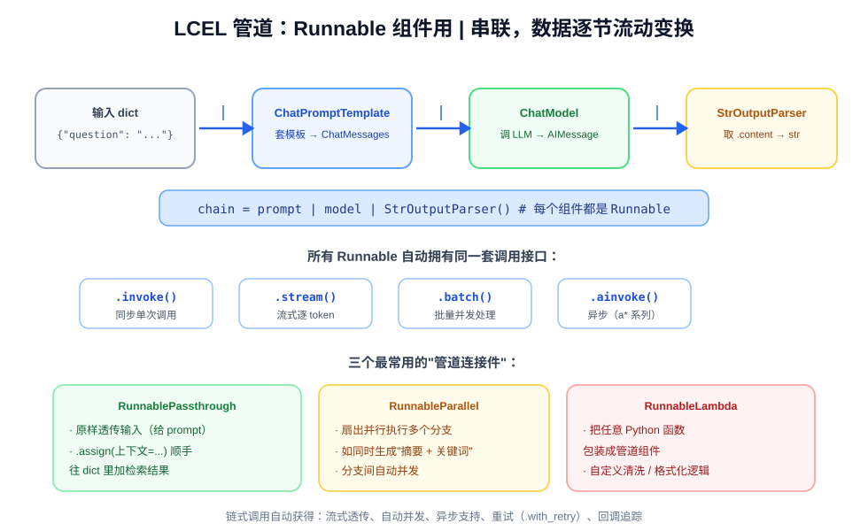
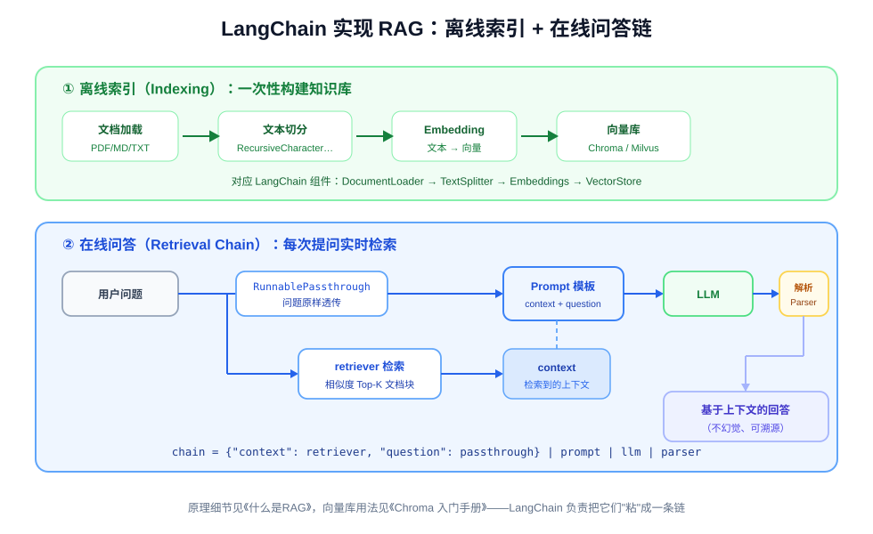
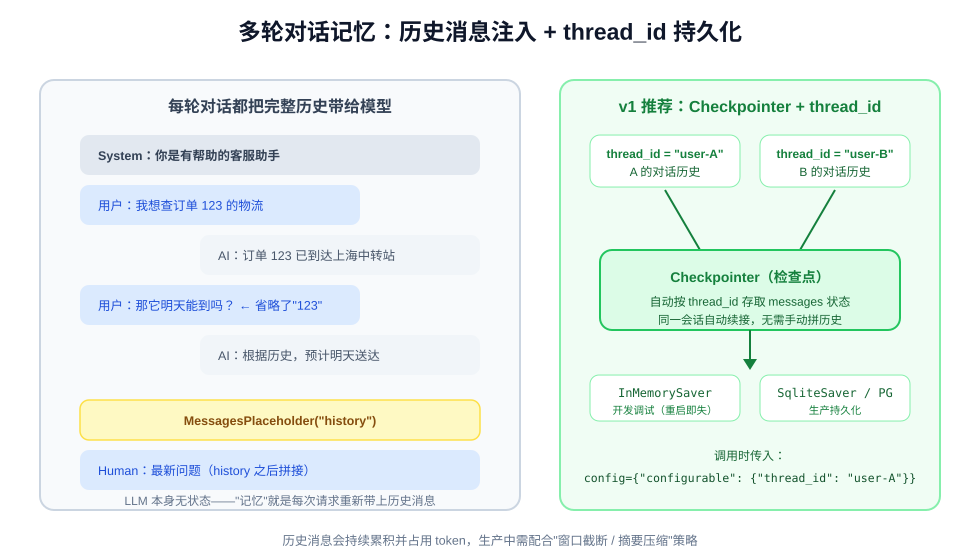
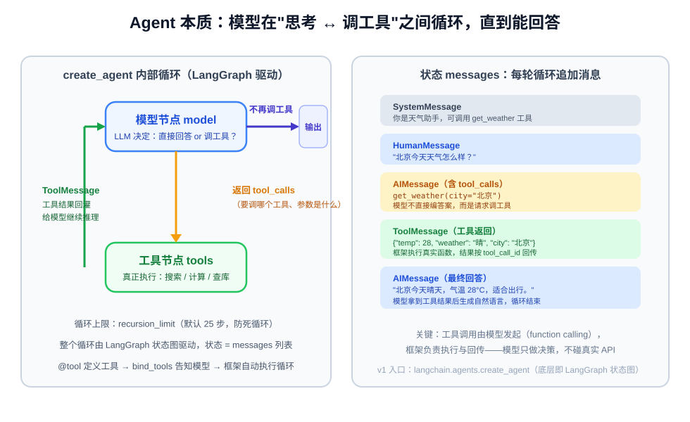

# LangChain 入门手册：用搭积木的方式编排大模型应用

> **LangChain** 是目前最主流的大模型应用开发框架，提供一套统一抽象，把**提示词模板、大模型、文档检索、工具调用、对话记忆**等能力封装成可组合的"积木"。
> 用一根管道符 `|` 就能把它们串成完整流水线（LCEL），并自动获得**流式输出、异步、批量、重试、链路追踪**等工程能力；复杂场景再升级到 **LangGraph** 状态图和 **Agent** 自主循环。
> 本篇基于 **LangChain v1.x**（2025 年 10 月发布 1.0），从安装、核心抽象、LCEL、RAG、记忆到 Agent 与排错，带你从入门到实战。
> （原理背景可参阅同目录《什么是RAG》《Chroma 入门手册》《如何搭建一个Agent》。）

---

## 一、LangChain 是什么

裸调大模型 API 时，开发者很快就会遇到一堆重复劳动：提示词怎么组织和复用、多轮对话历史怎么管理、RAG 检索结果怎么拼进上下文、工具调用的循环怎么写、输出怎么解析成结构化数据、流式/异步怎么统一处理、调用链怎么观测调试……

LangChain 的定位就是**大模型应用的编排胶水层**：它不提供模型，也不提供向量库，而是定义一套标准接口，让你像搭积木一样把"模型、数据、工具"组装成应用。



核心价值：

1. **统一接口**：OpenAI、Claude、DeepSeek、通义千问、本地 Ollama……换模型只改一行初始化，业务代码不动；
2. **组件化**：Prompt、Model、Parser、Retriever、Tool 都是标准组件，可自由组合；
3. **LCEL 管道**：`prompt | model | parser` 一行成链，自动支持流式、异步、批量；
4. **工程化开箱即用**：缓存、回调、重试、日志追踪（LangSmith）一应俱全；
5. **进阶路径清晰**：固定流程用 LCEL 链，需要自主决策用 Agent，复杂状态机用 LangGraph。

> **什么时候*不*该用 LangChain？** 如果只是"单次调一下模型拿个回答"，直接用官方 SDK 更简单。LangChain 的价值在**多步骤、多组件、需要编排**的场景（RAG、Agent、多轮对话）。别为了一个 API 请求引入整个框架。

---

## 二、生态全景与版本说明



LangChain 从 0.2 起拆分为多个包，**按需安装**即可：

| 包 | 职责 | 必装？ |
|----|------|--------|
| `langchain-core` | 地基：Runnable 协议、Message、Tool 抽象、LCEL | 自动依赖 |
| `langchain` | 高层 API：`create_agent`、Prompt 模板、预置链 | ✅ |
| `langchain-openai` / `langchain-anthropic` / `langchain-deepseek` … | 各模型供应商集成 | 按模型选装 |
| `langchain-chroma` / `langchain-huggingface` | 向量库、Embedding 模型集成 | 按需 |
| `langchain-text-splitters` | 文档切分（RAG 用） | 按需 |
| `langchain-community` | 社区维护的大量第三方集成 | 按需 |
| `langgraph` | 有状态图编排，Agent 的底层引擎（v1 随 agent 能力引入） | Agent 场景 |
| **LangSmith** | 独立 SaaS/自托管平台：链路追踪、Prompt 管理、评测 | 可选 |

### ⚠️ 版本说明（重要）

LangChain 演进很快，网上教程新旧混杂。**v1.0 的关键变化**：

- `AgentExecutor`、`initialize_agent`、`LLMChain`、`ConversationChain` 等旧 API **已移除**，迁移到独立兼容包 `langchain-classic`；新代码统一用 **LCEL 链**和 **`create_agent`**；
- 旧教程中的 `langgraph.prebuilt.create_react_agent` 推荐改用 **`langchain.agents.create_agent`**（底层仍是 LangGraph）；
- `.predict()` / `.apply()` 等旧方法移除，统一为 **`.invoke()` / .batch()**；
- Python 要求 **3.10+**；
- LCEL（`|` 管道）和 `ChatPromptTemplate`、`StrOutputParser` 等核心用法**保持不变**，是最值得先学的部分。

本文所有代码均按 v1.x 编写；第十二节有新旧 API 对照速查表。

---

## 三、安装与环境准备

### 3.1 安装

```bash
# 核心 + OpenAI 兼容模型（DeepSeek、通义、Kimi、本地 vLLM 等都走这套）
pip install langchain langchain-openai

# RAG 全家桶（第七节用）
pip install langchain-chroma langchain-text-splitters langchain-community

# Agent 的持久化记忆（第八节用，SqliteSaver）
pip install langgraph-checkpoint-sqlite
```

建议使用 **Python 3.10~3.12 的虚拟环境**（venv / conda）。安装后验证版本：

```bash
python -c "import langchain; print(langchain.__version__)"
```

### 3.2 配置密钥与接口地址（环境变量，勿硬编码）

```bash
# Windows PowerShell
$env:OPENAI_API_KEY = "sk-你的密钥"
$env:OPENAI_BASE_URL = "https://api.deepseek.com/v1"   # 用 DeepSeek 等兼容服务时
```

```bash
# Linux / macOS
export OPENAI_API_KEY="sk-你的密钥"
export OPENAI_BASE_URL="https://api.deepseek.com/v1"
```

也可在项目根目录放 `.env` 文件（配合 `python-dotenv` 的 `load_dotenv()` 加载）。**永远不要把真实密钥提交到 Git。**

### 3.3 Windows 环境常见坑

1. **`ModuleNotFoundError` / 导入失败**：先确认命令行提示符前有虚拟环境标识（如 `(.venv)`），IDE（VS Code / PyCharm）也要选到同一个解释器——全局/虚拟环境装错位置是最常见原因；
2. **pydantic 版本冲突**：LangChain v1 依赖 **Pydantic v2**，若老项目锁了 v1 会报各种校验错误，升级或新建干净的 venv；
3. **中文文件读取乱码**：`TextLoader("a.md", encoding="utf-8")` 显式指定编码；
4. **HuggingFace 本地 Embedding 模型**首次使用会下载权重，国内可设置镜像：`$env:HF_ENDPOINT = "https://hf-mirror.com"`。

---

## 四、5 分钟快速上手

第一个 LCEL 链：**Prompt 模板 → 聊天模型 → 字符串解析器**，用 `|` 串起来。

```python
import os
from langchain_openai import ChatOpenAI
from langchain_core.prompts import ChatPromptTemplate
from langchain_core.output_parsers import StrOutputParser

# 1. 模型：api_key / base_url 统一从环境变量读取（DeepSeek、通义等兼容 OpenAI 协议）
model = ChatOpenAI(
    model="deepseek-chat",                 # 或 "gpt-4o-mini"
    temperature=0.3,
    api_key=os.getenv("OPENAI_API_KEY"),
    base_url=os.getenv("OPENAI_BASE_URL"),  # 不用第三方时可省略
)

# 2. 提示词模板：{question} 是占位符，调用时填入
prompt = ChatPromptTemplate.from_messages([
    ("system", "你是一个简洁的技术助手，回答不超过三句话。"),
    ("human", "{question}"),
])

# 3. LCEL 管道：组件像 Unix 管道一样串联
chain = prompt | model | StrOutputParser()

# 4. 调用：invoke 传入 dict，输出直接是字符串
answer = chain.invoke({"question": "用一句话解释什么是 RAG？"})
print(answer)
# RAG（检索增强生成）是先从知识库中检索相关文档，再让大模型基于这些资料作答的技术。
```

数据在管道中的变换过程：

```text
{"question": "..."}      →   ChatPromptTemplate   →   ChatModel        →   StrOutputParser
(dict)                        (List[Message])         (AIMessage)          (str)
```

**跨供应商切换模型**还可以用工厂函数，模型名写成 `"供应商:模型名"`：

```python
from langchain.chat_models import init_chat_model

model = init_chat_model("openai:gpt-4o-mini", temperature=0)   # 需装 langchain-openai
# model = init_chat_model("anthropic:claude-sonnet-4-5")       # 需装 langchain-anthropic
```

---

## 五、模型 I/O 三件套

### 5.1 Chat Models 与消息类型

聊天模型的输入/输出都是**消息（Message）**，共四种角色：

| 消息类型 | 角色 | 典型内容 |
|----------|------|----------|
| `SystemMessage` | 系统 | 人设、规则、约束 |
| `HumanMessage` | 用户 | 人的提问 |
| `AIMessage` | 助手 | 模型回复（可能携带 `tool_calls`） |
| `ToolMessage` | 工具 | 工具执行结果（Agent 用） |

```python
from langchain_core.messages import SystemMessage, HumanMessage

resp = model.invoke([
    SystemMessage(content="你是翻译助手，只输出译文。"),
    HumanMessage(content="把这句话翻译成英文：今天天气不错。"),
])
print(resp.content)          # 回复文本
print(resp.usage_metadata)   # {'input_tokens': ..., 'output_tokens': ..., 'total_tokens': ...}
```

常用参数：`temperature`（随机性，RAG/Agent 建议 0~0.3）、`max_tokens`、`timeout`、`max_retries`。

### 5.2 Prompt 模板

`ChatPromptTemplate.from_messages` 支持元组简写和消息对象混用，`{变量}` 即占位符：

```python
from langchain_core.prompts import ChatPromptTemplate, MessagesPlaceholder

prompt = ChatPromptTemplate.from_messages([
    ("system", "你是{role}专家，用{style}风格回答。"),
    MessagesPlaceholder(variable_name="history"),   # 多轮对话历史插在这里（第八节）
    ("human", "{question}"),
])

msgs = prompt.format_messages(
    role="Python", style="通俗",
    history=[], question="列表和元组有什么区别？",
)
```

> **坑：模板里的花括号冲突**。Prompt 模板用 `{}` 标记变量，如果提示词里本身包含 JSON 示例（如 `{"name": "xxx"}`），会被误解析。两种解法：
> 1. 花括号转义：`{{"name": "xxx"}}`；
> 2. **更推荐**：把示例 JSON 作为普通字符串变量传进去（模板里只写 `{example}`），避免双层花括号地狱。

### 5.3 输出解析：字符串、JSON 与结构化输出

- `StrOutputParser()`：只取 `AIMessage.content`，最常用；
- `JsonOutputParser()`：要求模型输出 JSON 并解析为 dict（需在 prompt 中嵌入格式说明）；
- **`with_structured_output()`**（推荐）：利用模型原生 function calling 保证结构，直接返回 Pydantic 对象：

```python
from pydantic import BaseModel, Field

class Person(BaseModel):
    """从文本中抽取的人物信息"""
    name: str = Field(description="姓名")
    age: int = Field(description="年龄，未知填 0")
    occupation: str = Field(default="", description="职业")

structured_model = model.with_structured_output(Person)
person = structured_model.invoke("李明今年 28 岁，是一名后端工程师。")
print(person)   # Person(name='李明', age=28, occupation='后端工程师')
```

---

## 六、LCEL：表达式语言与 Runnable 协议



LCEL（LangChain Expression Language）是 LangChain 的灵魂。管道符 `|` 之所以能工作，是因为所有组件都实现了统一的 **Runnable 协议**——`a | b` 的含义就是"用 `a` 的输出作为 `b` 的输入"：

```python
chain = prompt | model | parser
# 等价于：parser.invoke(model.invoke(prompt.invoke(input)))
```

### 6.1 一套接口，五种调用方式

任何 Runnable（包括整条链）都自动拥有：

```python
chain.invoke({"question": "..."})          # 同步单次
chain.batch([{"question": "q1"}, {"question": "q2"}])   # 批量（内部并发）
for chunk in chain.stream({"question": "..."}):         # 流式逐 token
    print(chunk, end="", flush=True)
await chain.ainvoke({"question": "..."})    # 异步
async for chunk in chain.astream(...): ...  # 异步流式
```

### 6.2 三个最常用的"管道连接件"

```python
from langchain_core.runnables import (
    RunnablePassthrough, RunnableParallel, RunnableLambda,
)

# ① RunnablePassthrough：原样透传输入（RAG 链里把问题原封不动带给 prompt）
#    .assign() 还能在透传的同时往 dict 里塞新字段
passthrough = RunnablePassthrough.assign(extra=lambda x: "附加信息")

# ② RunnableParallel：扇出并行执行多个分支（自动并发）
parallel = RunnableParallel(
    summary=prompt_summarize | model | StrOutputParser(),
    keywords=prompt_keywords | model | StrOutputParser(),
)
print(parallel.invoke({"text": "长文章..."}))
# {'summary': '...', 'keywords': '...'}

# ③ RunnableLambda：把任意 Python 函数包装成管道组件
def format_docs(docs):
    return "\n\n".join(d.page_content for d in docs)

clean = RunnableLambda(lambda s: s.strip())
```

### 6.3 管道还能挂工程能力

```python
chain.with_retry(stop_after_attempt=3)          # 失败自动重试
chain.with_config({"tags": ["rag"], "callbacks": [...]})  # 打标签、挂回调
chain.with_fallbacks([backup_model | parser])   # 主模型失败走备用模型
```

**设计哲学**：业务逻辑用组件组合表达，流式/异步/并发/重试这些横切能力由框架自动处理——这正是手写 SDK 调用最难补齐的部分。

---

## 七、RAG 实战：接向量库做知识问答

LangChain 是 RAG 模式的"发源地"和最成熟实现。原理（分块、Embedding、检索、Rerank）见同目录《什么是RAG》，向量库细节见《Chroma 入门手册》；这里专注**用 LCEL 把检索和生成粘成链**。



### 7.1 离线索引：文档 → 切块 → 向量库

```python
# pip install langchain-chroma langchain-text-splitters langchain-community
from langchain_community.document_loaders import DirectoryLoader, TextLoader
from langchain_text_splitters import RecursiveCharacterTextSplitter
from langchain_openai import OpenAIEmbeddings
from langchain_chroma import Chroma

# 1. 加载文档（md/txt；PDF 用 PyPDFLoader，需 pip install pypdf）
loader = DirectoryLoader(
    "./docs", glob="**/*.md",
    loader_cls=TextLoader, loader_kwargs={"encoding": "utf-8"},
)
docs = loader.load()

# 2. 递归切分：优先按段落/句子边界切，块大小 500、重叠 50
splitter = RecursiveCharacterTextSplitter(chunk_size=500, chunk_overlap=50)
chunks = splitter.split_documents(docs)

# 3. Embedding + 存入 Chroma（国内中文场景可换 BGE 本地模型）
embedding = OpenAIEmbeddings(model="text-embedding-3-small")
vectorstore = Chroma.from_documents(
    chunks, embedding, persist_directory="./chroma_db",
)
```

> 中文场景也可用本地 Embedding（免 API 费用）：`pip install langchain-huggingface`，
> 然后 `from langchain_huggingface import HuggingFaceEmbeddings`，
> 模型选 BGE 系列如 `BAAI/bge-small-zh-v1.5`（设置 `HF_ENDPOINT=https://hf-mirror.com` 加速下载）。

### 7.2 在线问答链：检索 → 拼上下文 → 生成

```python
from langchain_core.runnables import RunnablePassthrough, RunnableLambda
from langchain_core.prompts import ChatPromptTemplate
from langchain_core.output_parsers import StrOutputParser

retriever = vectorstore.as_retriever(search_kwargs={"k": 3})

prompt = ChatPromptTemplate.from_messages([
    ("system",
     "你是知识库问答助手。只能根据下面提供的上下文回答；上下文没有就说不知道，不要编造。\n\n"
     "上下文：\n{context}"),
    ("human", "{question}"),
])

def format_docs(docs):
    return "\n\n".join(f"[来源{i+1}] {d.page_content}" for i, d in enumerate(docs))

# 输入是问题字符串：retriever 拿问题去检索，RunnablePassthrough 把问题原样透传
chain = (
    {
        "context": retriever | RunnableLambda(format_docs),
        "question": RunnablePassthrough(),
    }
    | prompt
    | model
    | StrOutputParser()
)

print(chain.invoke("入职六年能休几天年假？"))
```

这条链就是 RAG 的最小完整形态：`retriever` 负责"开卷查资料"，`prompt` 负责"带着资料答题"。要加**混合检索、Rerank、多路召回**，只需把 `retriever` 换成自定义 Runnable（参考《什么是RAG》进阶章节）。

---

## 八、多轮对话与记忆

LLM 本身是**无状态**的：所谓"记忆"，本质是每次请求把历史消息重新带上。



### 8.1 入门做法：手动维护消息列表

```python
from langchain_core.messages import HumanMessage, AIMessage

history = [
    HumanMessage(content="我想查订单 123 的物流。"),
    AIMessage(content="订单 123 已到达上海中转站。"),
]

# 第三轮：把历史 + 新问题一起发给模型
history.append(HumanMessage(content="那它明天能到吗？"))  # 新问题里省略了"123"
resp = model.invoke(history)
print(resp.content)   # 模型结合历史知道"它"指订单 123
```

在 LCEL 链中用 `MessagesPlaceholder` 注入历史：

```python
from langchain_core.prompts import MessagesPlaceholder

chat_prompt = ChatPromptTemplate.from_messages([
    ("system", "你是客服助手。"),
    MessagesPlaceholder(variable_name="history"),
    ("human", "{question}"),
])
chat_chain = chat_prompt | model | StrOutputParser()

chat_chain.invoke({"history": history, "question": "后天呢？"})
```

历史太长会撑爆上下文窗口，可用 `langchain_core.messages.trim_messages` 按 token 数**窗口截断**，或定期让模型**摘要压缩**历史。

### 8.2 生产做法：LangGraph Checkpointer + thread_id

v1 推荐的持久化方案：由 **Checkpointer** 按会话 ID 自动存取状态，不用手动拼历史：

```python
from langchain.agents import create_agent
from langgraph.checkpoint.memory import InMemorySaver      # 开发用；生产用 SqliteSaver

agent = create_agent(
    model=model,
    tools=[],                          # 纯对话也可以不带工具
    system_prompt="你是客服助手。",
    checkpointer=InMemorySaver(),      # 生产：SqliteSaver.from_conn_string("memory.db")
)

config = {"configurable": {"thread_id": "user-123"}}      # 每个用户一个 thread_id

agent.invoke({"messages": [{"role": "user", "content": "我叫小明，订单号是 123。"}]}, config=config)
# 换一次请求，只要 thread_id 相同，历史自动续上：
r = agent.invoke({"messages": [{"role": "user", "content": "我叫什么？我的订单号呢？"}]}, config=config)
print(r["messages"][-1].content)      # 模型记得"小明"和"123"
```

> 旧教程里的 `ConversationBufferMemory`、`RunnableWithMessageHistory` 等 Memory 类在 v1 中已归入 `langchain-classic`。新项目直接用上面的 **messages 历史 + Checkpointer** 模式，概念更少、能力更强（天然支持断点续跑、人工介入）。

---

## 九、工具调用与 Agent

### 9.1 什么是 Tool Calling

现代大模型可以**决定调用某个工具**（函数），并输出结构化的调用参数；框架负责真正执行函数、把结果回灌给模型，模型再据此生成最终回答。Agent 就是把这个"思考 → 调工具 → 观察结果 → 再思考"的过程**循环**起来。



### 9.2 用 @tool 定义工具

```python
from langchain_core.tools import tool

@tool
def get_weather(city: str) -> str:
    """查询指定城市的实时天气。当用户询问天气时调用。city 参数为中文城市名。"""
    # 真实场景这里调用天气 API，演示直接返回
    return f"{city} 今天晴，气温 28°C，西北风 2 级。"

print(get_weather.name)         # get_weather
print(get_weather.description)  # docstring 会被发给模型，决定"何时调用"
print(get_weather.invoke({"city": "北京"}))
```

要点：**类型注解 + docstring 就是工具的全部说明书**。模型靠 docstring 判断何时调用、靠参数名和注解生成调用参数，所以一定要写清楚。

### 9.3 v1 推荐：create_agent 三行成 Agent

```python
from langchain.agents import create_agent

agent = create_agent(
    model=model,
    tools=[get_weather],
    system_prompt="你是天气助手。涉及天气信息必须调用 get_weather 工具，不要凭记忆编造。",
)

result = agent.invoke(
    {"messages": [{"role": "user", "content": "北京和上海今天天气怎么样？适合出门吗？"}]},
)
print(result["messages"][-1].content)
```

框架自动完成了：`bind_tools`（把工具 schema 发给模型）→ 解析模型返回的 `tool_calls` → 执行工具 → 回灌 `ToolMessage` → 循环直到模型给出不带工具调用的最终回答。输入输出统一是 `{"messages": [...]}`，最后一条 `AIMessage` 即答案。

**结构化输出**也可以直接挂在 Agent 上：

```python
from pydantic import BaseModel

class Report(BaseModel):
    summary: str
    cities: list[str]

agent = create_agent(model=model, tools=[get_weather], response_format=Report)
r = agent.invoke({"messages": [{"role": "user", "content": "对比北京上海天气"}]})
print(r["structured_response"])   # Report(summary=..., cities=['北京', '上海'])
```

### 9.4 理解原理：手写一次工具循环

`create_agent` 是"自动驾驶"，理解底层循环有助于调试（Agent 概念详解见《如何搭建一个Agent》）：

```python
from langchain_core.messages import HumanMessage, ToolMessage

llm_with_tools = model.bind_tools([get_weather])
messages = [HumanMessage(content="北京今天天气怎么样？")]

for _ in range(5):                                  # 最多 5 轮，防死循环
    ai_msg = llm_with_tools.invoke(messages)
    messages.append(ai_msg)
    if not ai_msg.tool_calls:                       # 模型不再要求调工具 → 结束
        break
    for tc in ai_msg.tool_calls:                    # 模型要求调工具
        tool_result = get_weather.invoke(tc["args"])  # 真正执行
        messages.append(ToolMessage(content=tool_result, tool_call_id=tc["id"]))

print(messages[-1].content)
```

> **v0.3 vs v1 对照**：旧写法是 `create_tool_calling_agent` + `AgentExecutor`（v1 已移除，仅存在于 `langchain-classic`）；新写法就是上面的 `create_agent`，它本质是一个封装好的 LangGraph 状态图，循环上限对应图的 `recursion_limit`（默认 25）。

---

## 十、流式、异步与批量

面向用户的产品中，**流式输出**（打字机效果）几乎是刚需：

```python
# LCEL 链：逐 token 流式
for chunk in chain.stream("用三句话介绍 Python"):
    print(chunk, end="", flush=True)

# Agent 流式：stream_mode="messages" 拿到模型逐 token 输出
for msg, metadata in agent.stream(
    {"messages": [{"role": "user", "content": "北京天气？"}]},
    stream_mode="messages",
):
    if msg.content:
        print(msg.content, end="", flush=True)
```

高并发服务端用**异步**（FastAPI 的 `async def` 里直接 `await`）：

```python
async def ask(question: str):
    return await chain.ainvoke({"question": question})

# 批量处理（如对 1000 条评论批量摘要），内部自动并发
results = chain.batch([{"question": q} for q in questions], config={"max_concurrency": 10})
```

> Windows 注意：Python 3.8+ 的 `asyncio.run()` 默认使用 Proactor 事件循环，一般无需特殊设置；若在 Jupyter 中跑异步代码，直接 `await chain.ainvoke(...)` 即可（Jupyter 自带事件循环）。

---

## 十一、缓存、回调与 LangSmith 可观测

### 11.1 LLM 缓存：重复问题不花第二次钱

```python
from langchain_core.globals import set_llm_cache
from langchain_core.caches import InMemoryCache

set_llm_cache(InMemoryCache())          # 进程内缓存；重启失效，适合开发
# 生产可用 SQLiteCache（langchain_community.cache）或 Redis 缓存

chain.invoke({"question": "什么是闭包？"})   # 首次：真实调用
chain.invoke({"question": "什么是闭包？"})   # 再次：命中缓存，瞬间返回
```

### 11.2 LangSmith：全链路追踪与评测

LangChain 应用链一多，"模型到底走了哪几步、检索到了什么、工具调了几次、token 花在哪"就成了黑盒。设置两个环境变量即可接入 LangSmith（有免费额度）：

```bash
$env:LANGCHAIN_TRACING_V2 = "true"
$env:LANGCHAIN_API_KEY = "lsv2_你的密钥"
$env:LANGCHAIN_PROJECT = "my-rag-demo"
```

之后每次 `invoke` 的完整链路（每一步的输入/输出/耗时/token）都会出现在 LangSmith 面板，可回放、可对比、可做数据集评测。**做 Agent 调试时这是最有用的工具**。

代码内也可以挂回调做轻量观测。回调必须是 `BaseCallbackHandler` 的实例（不能直接传裸函数）：

```python
from langchain_core.callbacks import BaseCallbackHandler, StdOutCallbackHandler

class PrintChainStart(BaseCallbackHandler):
    def on_chain_start(self, serialized, inputs, **kwargs):
        print("开始执行链，输入：", str(inputs)[:100])

# 自定义回调；StdOutCallbackHandler() 则会打印每一步的完整输入输出，调试最方便
chain.invoke({"question": "..."}, config={"callbacks": [PrintChainStart(), StdOutCallbackHandler()]})
```

---

## 十二、常见坑与排错速查

### 12.1 新旧 API 对照表（90% 的 ImportError 都在这）

| 报错 / 旧教程写法（0.x） | v1 正确姿势 |
|--------------------------|-------------|
| `from langchain.agents import AgentExecutor` | 已移除 → `from langchain.agents import create_agent` |
| `initialize_agent(...)` | 已移除 → `create_agent(model=, tools=, system_prompt=)` |
| `langgraph.prebuilt.create_react_agent` | 改用 `langchain.agents.create_agent` |
| `LLMChain(llm=, prompt=)` | LCEL：`prompt \| model \| StrOutputParser()` |
| `ConversationChain` / `ConversationBufferMemory` | messages 历史 + Checkpointer（第八节） |
| `from langchain import hub` | 独立包 `langchain-hub`（新代码可不用） |
| `llm.predict(...)` / `llm.apply(...)` | `llm.invoke(...)` / `llm.batch(...)` |
| 老代码实在跑不通 | `pip install langchain-classic` 临时过渡，但新功能不再更新 |

**排查原则**：遇到 `ImportError` 先 `pip show langchain` 看大版本，再对照上表；不要用正则自己解析模型文本来模拟工具调用，`bind_tools` / `create_agent` 才是官方路径。

### 12.2 其他高频坑

1. **PromptTemplate 解析报错**（`KeyError` / 模板异常）：模板里的 JSON 花括号 `{}` 与变量语法冲突 → 转义为 `{{}}` 或把示例作为变量传入（见 5.2）；
2. **401 / 连接失败**：检查 `OPENAI_API_KEY`、`OPENAI_BASE_URL` 是否在**运行代码的同一个环境**中生效；用第三方兼容服务时 base_url 要带 `/v1`；
3. **工具从不被调用**：① 模型要支持 function calling（部分小模型/本地模型不支持）；② 工具的 docstring 写清"什么时候用"；③ `temperature` 调低；④ 确认工具已传进 `tools=[...]`；
4. **Agent 死循环 / 超步数**：调大 `recursion_limit`（`config={"recursion_limit": 50}`），并检查工具是否总返回报错信息导致模型反复重试；
5. **RAG 答非所问**：先单独测 `retriever.invoke("问题")` 看检索到的块对不对——八成是切分策略或 Embedding 模型问题，不在生成端；
6. **中文乱码**：文档加载显式 `encoding="utf-8"`；Windows 终端可设 `$env:PYTHONUTF8 = "1"`；
7. **依赖装了还报 ModuleNotFoundError**：确认 IDE / 终端用的是同一个虚拟环境解释器（见 3.3）。

---

## 十三、选型建议与学习路线

按复杂度选择武器，不要过度工程：

| 场景 | 推荐方案 |
|------|----------|
| 单次问答、翻译、摘要 | 直接用模型官方 SDK，不必上 LangChain |
| 固定流程：RAG 问答、多步流水线 | **LCEL 链**（`prompt \| model \| parser`） |
| 需要模型自主决策、调工具循环 | **create_agent**（第九节） |
| 多 Agent 协作、人工审批、复杂状态/分支 | **LangGraph** 手写状态图（见《如何搭建一个Agent》） |
| 生产级可观测、评测 | **LangSmith** 全程追踪 |

推荐学习顺序：

1. 跑通第四节的最小链，理解 Message / Prompt / Parser 三件套；
2. 吃透第六节 LCEL 与 Runnable（`invoke/stream/batch`、三个连接件）；
3. 按第七节做一个本地知识库 RAG（联动《Chroma 入门手册》《什么是RAG》）；
4. 第九节用 `@tool` + `create_agent` 做一个能查天气/搜索的 Agent；
5. 需要多轮持久化时再上 Checkpointer / LangGraph；
6. 上线前接 LangSmith 做追踪与评测。

---

## 附：最小知识自检清单

- [ ] 能说清 `prompt | model | StrOutputParser()` 每一步的输入输出类型
- [ ] 能独立用 `ChatPromptTemplate` 写带变量和 `MessagesPlaceholder` 的模板
- [ ] 知道 `with_structured_output` 怎么把输出约束成 Pydantic 对象
- [ ] 能用 `RunnablePassthrough / RunnableParallel / RunnableLambda` 组装 RAG 链
- [ ] 能解释 RAG 链里 `retriever` 和 `RunnablePassthrough()` 各自承担什么
- [ ] 能用 `@tool` 定义工具并说出 docstring 的作用
- [ ] 能说清 Agent 循环中 `AIMessage.tool_calls` 和 `ToolMessage` 的关系
- [ ] 知道 v1 为什么用 `create_agent` 取代 `AgentExecutor`，记忆为什么用 Checkpointer
- [ ] 遇到 ImportError 会先查版本并对照第十二节速查表
