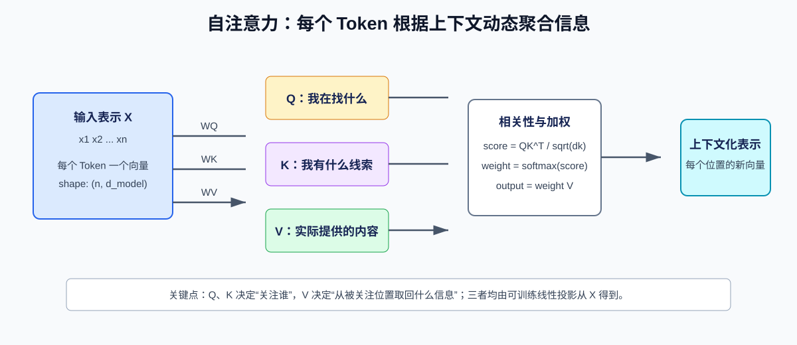
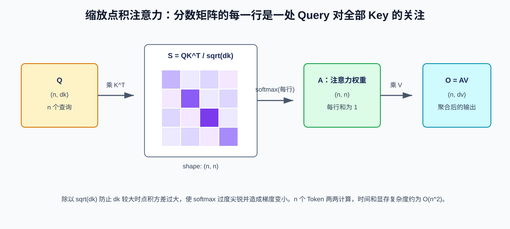
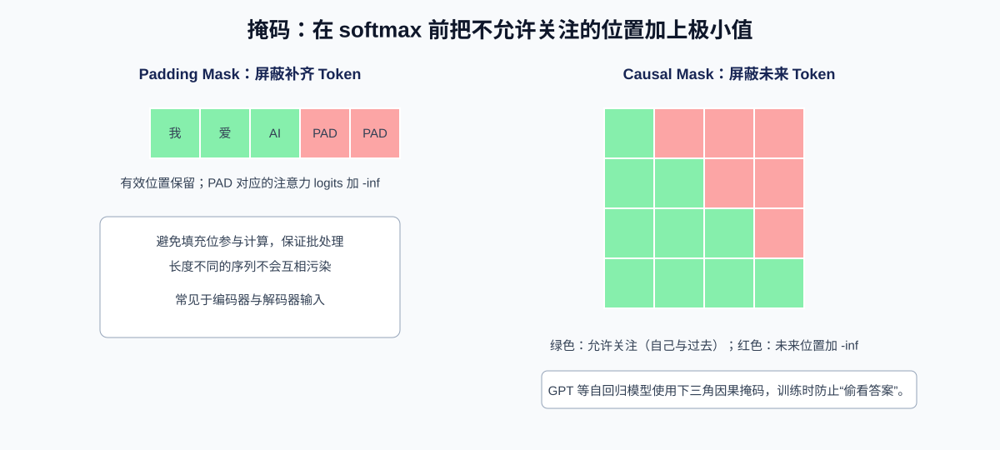
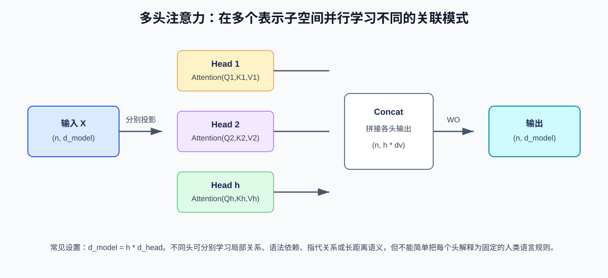

# Transformer 注意力机制详解

> 注意力机制（Attention）让模型在处理一个位置时，动态决定应从序列中哪些位置取回多少信息。Transformer 以自注意力（Self-Attention）为核心，摆脱了 RNN 必须按时间步串行计算的限制，成为大语言模型、视觉 Transformer、多模态模型的基础结构。

## 一、为什么需要注意力机制

### 1.1 固定长度语义瓶颈

早期序列到序列模型通常使用编码器将整句压缩为一个固定长度向量，再交给解码器生成输出。短文本尚可，但随着输入变长，这个向量必须承载全部信息，容易丢失细节。

例如机器翻译时，生成目标句中的一个词，往往只与源句某些词强相关。理想机制应该允许模型在每一步都“回看”输入，并为不同位置分配不同权重。

### 1.2 RNN 的长期依赖与并行限制

RNN/LSTM 通过隐藏状态传播上下文，但仍存在两个限制：

1. **路径长度长**：句首信息要影响句尾，需经过很多时间步，长期依赖难以学习。
2. **训练难并行**：第 `t` 个状态依赖第 `t-1` 个状态，GPU 无法同时计算所有 Token。

自注意力让任意两个 Token 直接建立连接，最大路径长度为常数；在训练阶段，还能一次计算整个序列的注意力矩阵。

## 二、注意力的直觉：查询、索引与内容

### 2.1 从一句话开始理解

先不要急着看公式。假设模型看到一句话：

```text
动物没有穿过街道，因为它太累了。
```

人类读到“它”时，会自然回头判断：“它”更可能指“动物”，而不是“街道”。这件事在模型里不是靠手写规则完成的，而是靠注意力机制学出来的。

如果把句子切成 Token，可以简化理解为：

```text
[动物] [没有] [穿过] [街道] [因为] [它] [太] [累了]
```

每个 Token 进入模型后，都会先变成一个向量。向量不是词典解释，而是一串数字，用来表示这个 Token 当前携带的信息。比如“它”这个 Token 的向量里，可能包含“这是一个代词”“需要寻找指代对象”等潜在特征。

注意力要解决的问题是：

> 当模型正在处理“它”这个位置时，应该从前面的哪些 Token 里拿信息？拿多少？

### 2.2 Q、K、V 分别是什么

把注意力类比为一次检索：

- **Query（查询，Q）**：当前位置“想找什么”。例如“它”这个位置可能想找“可以被代词指代的名词”。
- **Key（键，K）**：每个候选位置“用什么特征让别人找到我”。例如“动物”的 Key 可能暴露出“名词、实体、可被指代”等线索。
- **Value（值，V）**：每个候选位置“真正贡献出去的内容”。如果“它”最终关注“动物”，拿回来的不是 Key 本身，而是“动物”位置的 Value。

更直白地说：

```text
Q：我需要什么信息？
K：我这里有什么可匹配的标签？
V：如果你关注我，我能给你什么内容？
```

同一个 Token 会同时产生 Q、K、V 三个向量。它们来自同一个输入向量，但经过三套不同的线性变换：

```text
Q = X × WQ
K = X × WK
V = X × WV
```

其中 `X` 是所有 Token 的输入向量矩阵，`WQ`、`WK`、`WV` 是训练得到的参数矩阵。模型训练的过程，本质上会不断调整这三套矩阵，让“该互相关注的位置”分数更高。

### 2.3 为什么不直接用原始 Token 向量

一个 Token 在注意力里有三种不同角色：

1. 作为当前位置时，它要主动发问：“我需要从上下文找什么？”
2. 作为被别人关注的候选位置时，它要提供匹配线索：“我是否符合你的查询？”
3. 一旦被关注，它要提供内容：“我能贡献什么语义信息？”

这三种角色不同，因此不能只用同一个向量硬扛。Q/K/V 就是把同一个 Token 的表示拆成三种用途：

| 角色 | 面向的问题 | 类比 |
| --- | --- | --- |
| Q | 我想找谁 | 搜索框里的查询词 |
| K | 谁能被我匹配到 | 文档索引、标签、关键词 |
| V | 匹配后拿回什么 | 文档正文、真实内容 |

注意力的关键不是“某个词固定关注某个词”，而是**每一层、每个头、每个位置都会根据当前向量动态算一遍关注关系**。

对于 Query `q`，先计算它与所有 Key 的相似度，再对相似度归一化得到权重，最后对 Value 加权求和。也就是说，**Q 与 K 决定关注程度，V 提供被聚合的内容**。



在“动物没有穿过街道，因为它太累了”中，代词“它”需要关注“动物”而不是“街道”。训练后的模型可以通过自注意力将代词位置的 Query 与“动物”位置的 Key 匹配，并吸收对应的 Value。

> 注意：注意力权重能反映模型内部的一个计算路径，但不等同于可靠的因果解释。不能只凭某个头的热力图就断言模型“理解了”某种语法规则。

### 2.4 一轮 QKV 计算到底发生了什么

以“它”这个位置为例，一轮注意力可以拆成四步：

1. “它”的 Query 分别和所有 Token 的 Key 做相似度计算。
2. 得到一排分数：对“动物”可能高，对“街道”可能低。
3. 对这排分数做 Softmax，变成总和为 1 的注意力权重。
4. 用这些权重对所有 Token 的 Value 做加权求和，得到“它”位置的新向量。

如果注意力权重简化为：

```text
动物: 0.60
街道: 0.10
因为: 0.05
它:   0.20
其他: 0.05
```

那么“它”的新表示就会大量吸收“动物”的 Value。下一层 Transformer 再基于这个新表示继续推理，“它太累了”就更容易和“动物”建立语义关系。

### 2.5 为什么用 Q 和 K 打分

Q 和 K 的打分通常使用点积。点积可以粗略理解为“两个向量方向是否相近”：

```text
方向越相近 -> 点积越大 -> 注意力分数越高
方向越不相关 -> 点积越小 -> 注意力分数越低
```

训练会让相关语义在 Q/K 空间里更容易对齐。比如“它”的 Q 如果在寻找“可指代对象”，那么“动物”的 K 就应该比“街道”的 K 更匹配。

这里有一个容易混淆的点：**V 不参与匹配打分**。原因是注意力分成两件事：

1. 先用 Q 和 K 决定“看谁”。
2. 再用权重从 V 中决定“拿什么”。

这就像查资料时，先用标题、标签、索引判断哪些文档相关；真正阅读时，读的是文档正文。K 更像索引，V 更像正文。

### 2.6 QKV 是人工规定的吗

Q/K/V 这三个名字是人为设计的抽象，但具体每个维度表示什么不是人工写死的。模型一开始随机初始化 `WQ`、`WK`、`WV`，训练时根据预测错误反向传播更新参数。

所以更准确地说：

```text
人规定了结构：输入向量分别乘 WQ、WK、WV，得到 Q、K、V。
模型学会了含义：哪些 Q 应该匹配哪些 K，以及匹配后应该从 V 取回什么。
```

这也是 Transformer 强大的地方：它没有内置“主语”“宾语”“指代对象”等语法规则，却能在大量数据训练中，让某些注意力头逐渐形成类似功能。

## 三、缩放点积注意力的数学推导

### 3.1 从单个 Query 到矩阵形式

设有 `n` 个 Key-Value 对：

$$
Attention(q,K,V)=\sum_{i=1}^{n}\alpha_i v_i
$$

其中权重为：

$$
\alpha_i=\frac{\exp(qk_i^T/\sqrt{d_k})}{\sum_{j=1}^{n}\exp(qk_j^T/\sqrt{d_k})}
$$

这里：

- $q \in \mathbb{R}^{d_k}$：一个 Query 向量。
- $k_i \in \mathbb{R}^{d_k}$：第 $i$ 个 Key 向量。
- $v_i \in \mathbb{R}^{d_v}$：第 $i$ 个 Value 向量。
- $d_k$：Key/Query 的维度。
- $\alpha_i$：第 $i$ 个位置的注意力权重，非负且总和为 1。

一次处理 `n` 个 Query 时，写成矩阵：

$$
Attention(Q,K,V)=softmax(QK^T/\sqrt{d_k}+M)V
$$

其中 $M$ 是可选掩码矩阵：允许的位置加 $0$，禁止的位置加一个极小值（实现中常用 `-inf` 或该数据类型可表示的最小有限值）。

如果预览器对公式支持有限，可以直接按下面的等价计算流程理解：

```text
分数矩阵 S = Q × K转置 / sqrt(d_k)
如果有掩码，把禁止关注的位置改成 -inf
权重矩阵 A = 对 S 的每一行做 softmax
输出矩阵 O = A × V
```



### 3.2 每一步的形状

忽略批次维度时，设序列长度为 `n`：

| 张量 | 形状 | 含义 |
| --- | --- | --- |
| $Q$ | $(n, d_k)$ | n 个查询 |
| $K$ | $(n, d_k)$ | n 个键 |
| $V$ | $(n, d_v)$ | n 个值 |
| $QK^T$ | $(n, n)$ | 任意 Query 对任意 Key 的相关性分数 |
| $A=softmax(\cdot)$ | $(n, n)$ | 注意力权重，每一行和为 1 |
| $AV$ | $(n, d_v)$ | 上下文化后的输出 |

加入批量大小 `B` 和头数 `H` 后，常见实现布局为：

```text
Q, K: (B, H, L, d_head)
V:    (B, H, L, d_head)
Score: (B, H, L, L)
Output:(B, H, L, d_head)
```

其中 `L` 是序列长度。不同框架可能选择不同维度顺序，但矩阵乘法的语义相同。

### 3.3 为什么要除以 $\sqrt{d_k}$

假设 Q 和 K 的每个分量独立、均值为 0、方差为 1，则点积：

$$
s = qk^T = \sum_{r=1}^{d_k}q_rk_r
$$

近似有：

$$
Var(s) \approx d_k
$$

当 $d_k$ 增大，分数的绝对值往往变大，Softmax 容易变得极端：某个位置概率接近 1，其余接近 0。Softmax 的饱和区域导数很小，会让训练梯度变弱。

缩放后：

$$
Var(s/\sqrt{d_k}) \approx 1
$$

这使不同维度设置下的分数尺度更稳定，是“Scaled Dot-Product Attention”中 `Scaled` 的含义。

### 3.4 一个可手算例子

令一个 Query、两个 Key、两个 Value 为。为兼容 Markdown 预览器，这里同时给出数学写法和等价的文本矩阵：

$$
q=[1,0], \quad K=[[1,0],[0,1]], \quad V=[[10,1],[2,20]]
$$

```text
q = [1, 0]
K = [[1, 0],
     [0, 1]]
V = [[10, 1],
     [ 2,20]]
```

此时 $d_k=2$，分数为：

$$
\frac{qK^T}{\sqrt{2}}=[0.707, 0]
$$

Softmax 权重约为：

$$
softmax([0.707,0]) \approx [0.670,0.330]
$$

输出：

$$
[0.670,0.330] \times [[10,1],[2,20]] \approx [7.36,7.27]
$$

Query 与第一个 Key 更相似，因此输出更偏向第一个 Value；但第二个 Value 仍贡献约 33%。

## 四、自注意力、交叉注意力与掩码

### 4.1 三类常见注意力

| 类型 | Q 来源 | K、V 来源 | 用途 |
| --- | --- | --- | --- |
| Self-Attention | 当前序列 | 当前序列 | 建模序列内部关系 |
| Cross-Attention | 解码器序列 | 编码器或其他模态序列 | 翻译、文本生成参考图像/检索结果 |
| Causal Self-Attention | 当前序列 | 当前序列 | 自回归生成，禁止看未来 |

自注意力不是说所有位置得到同一输出，而是同一个输入序列分别投影出 Q、K、V。每个位置都有自己的 Query，因此每一行权重分布不同。

### 4.2 Padding Mask：忽略补齐 Token

批量训练时，为使不同长度序列组成规则张量，通常用 `PAD` Token 补齐。Padding Mask 避免真实 Token 对补齐位置分配权重，也避免补齐位置污染聚合结果。

### 4.3 Causal Mask：防止训练时偷看未来

自回归语言模型的训练目标是根据过去 Token 预测下一个 Token。例如预测第 3 个位置时，模型只能读取位置 1 到 3，不能读取位置 4 及之后的真实答案。



给出长度为 4 的因果掩码（`0` 表示允许，`-inf` 表示禁止）：

```text
M = [
  [0, -inf, -inf, -inf],
  [0,    0, -inf, -inf],
  [0,    0,    0, -inf],
  [0,    0,    0,    0],
]
```

它在 Softmax 之前加入分数。由于 $\exp(-\infty)=0$，禁止位置的最终权重为 0。虽然训练可并行计算整个下三角矩阵，生成时仍要逐 Token 推理，因为未来 Token 尚不存在。

## 五、多头注意力：让模型从多个子空间看关系

单个注意力头在一个表示子空间中计算相关性。多头注意力将 `d_model` 切分或投影为多个 `d_head` 维子空间，分别执行注意力，再拼接投影回模型维度：

$$
head_i=Attention(XW_i^Q,XW_i^K,XW_i^V)
$$

$$
MHA(X)=Concat(head_1,\ldots,head_h)W^O
$$



若 `d_model = 768`、`h = 12`，常见设置是：

$$
d_{head}=768/12=64
$$

多头机制提供了多个独立的投影和注意力分布。实验中不同头可能对局部邻近、指代、分隔符或长距离关联呈现不同偏好，但这种分工并不是硬编码规则，也不保证每个头都具有容易解释的功能。

## 六、注意力在 Transformer 层中的位置

一个典型 Pre-LayerNorm Transformer Block 为：

$$
H'=H+Dropout(MHA(LN(H)))
$$

$$
H_{out}=H'+Dropout(FFN(LN(H')))
$$

其中：

- **LayerNorm（LN）**：在特征维度归一化，稳定训练。
- **残差连接**：保留原信息并改善梯度传播。
- **FFN/MLP**：对每个 Token 独立地做非线性变换，常见为扩张后再投影回 `d_model`。
- **Dropout**：训练时正则化；推理时关闭。

注意力负责 Token 之间的信息交换，FFN 负责每个 Token 内部的特征变换。两者交替堆叠，逐层构建更复杂的表征。

## 七、位置：注意力为什么还需要位置编码

纯自注意力对输入顺序具有置换等变性：交换两个输入 Token 的位置，输出也相应交换，但模型本身不知道谁在前谁在后。因此必须注入位置信息。

常见方案：

| 方案 | 思路 | 常见使用 |
| --- | --- | --- |
| 绝对位置嵌入 | 为每个位置学习或固定一个向量，加到 Token Embedding | 早期 Transformer、BERT |
| 正弦位置编码 | 用不同频率的 sin/cos 构造固定位置向量 | 原始 Transformer |
| 相对位置偏置 | 注意力分数依赖 Token 相对距离 | T5 等 |
| RoPE | 对 Q/K 施加随位置旋转的变换，使点积包含相对位置信息 | 多数现代 LLM |
| ALiBi | 按距离向注意力分数加线性偏置 | 长上下文外推研究 |

位置机制改变的通常是输入表示或 Q/K 的计算，不改变“QK^T -> Softmax -> V”的核心骨架。

## 八、从零实现缩放点积注意力

以下是一个仅使用 PyTorch 张量操作的教学实现。它假设输入已经拆分为多头，形状为 `(B, H, L, D)`：

```python
import math

import torch
import torch.nn.functional as F


def scaled_dot_product_attention(
    query: torch.Tensor,
    key: torch.Tensor,
    value: torch.Tensor,
    attention_mask: torch.Tensor | None = None,
    dropout_p: float = 0.0,
    training: bool = False,
) -> tuple[torch.Tensor, torch.Tensor]:
    """计算缩放点积注意力。

    参数:
        query, key, value: 形状均为 (B, H, L, D)。
        attention_mask: 可广播到 (B, H, L, L) 的布尔掩码；
            True 表示允许注意，False 表示屏蔽。
        dropout_p: 注意力权重的 Dropout 概率。
        training: 是否处于训练模式。
    """
    d_head = query.size(-1)
    scores = (query @ key.transpose(-2, -1)) / math.sqrt(d_head)

    if attention_mask is not None:
        scores = scores.masked_fill(~attention_mask, float("-inf"))

    weights = F.softmax(scores, dim=-1)
    weights = F.dropout(weights, p=dropout_p, training=training)
    output = weights @ value
    return output, weights


batch_size, num_heads, length, d_head = 2, 4, 8, 16
q = torch.randn(batch_size, num_heads, length, d_head)
k = torch.randn(batch_size, num_heads, length, d_head)
v = torch.randn(batch_size, num_heads, length, d_head)

# 下三角为 True：当前位置只能关注自己和过去位置。
causal_mask = torch.ones(length, length, dtype=torch.bool).tril()
output, weights = scaled_dot_product_attention(q, k, v, causal_mask)
print(output.shape)   # torch.Size([2, 4, 8, 16])
print(weights.shape)  # torch.Size([2, 4, 8, 8])
```

### 8.1 数值稳定性与全屏蔽行

直接计算 `exp(scores) / exp(scores).sum()` 可能上溢。框架的 `softmax` 通常内部会先减去每行最大值。实际工程还要确保每个 Query 至少存在一个允许的位置：如果某一整行都被填成 `-inf`，Softmax 的结果会是 `NaN`。

现代 PyTorch 应优先使用 `torch.nn.functional.scaled_dot_product_attention`，它可在满足条件时选择 FlashAttention 等高效内核。自行实现主要用于理解和调试。

## 九、实现一个多头自注意力层

下面以教学为目的实现一个简化的 Causal Multi-Head Self-Attention。生产模型还需考虑张量并行、混合精度、缓存布局与内核选择。

```python
import math

import torch
from torch import nn
import torch.nn.functional as F


class CausalMultiHeadAttention(nn.Module):
    def __init__(self, d_model: int, num_heads: int, dropout_p: float = 0.0) -> None:
        super().__init__()
        if d_model % num_heads != 0:
            raise ValueError("d_model 必须能被 num_heads 整除")

        self.num_heads = num_heads
        self.d_head = d_model // num_heads
        self.query_key_value = nn.Linear(d_model, 3 * d_model, bias=False)
        self.output = nn.Linear(d_model, d_model, bias=False)
        self.dropout_p = dropout_p

    def forward(self, hidden_states: torch.Tensor) -> torch.Tensor:
        """输入和输出形状均为 (B, L, d_model)。"""
        batch_size, length, d_model = hidden_states.shape
        qkv = self.query_key_value(hidden_states)
        q, k, v = qkv.chunk(3, dim=-1)

        def split_heads(tensor: torch.Tensor) -> torch.Tensor:
            return tensor.view(
                batch_size,
                length,
                self.num_heads,
                self.d_head,
            ).transpose(1, 2)

        q, k, v = map(split_heads, (q, k, v))
        scores = (q @ k.transpose(-2, -1)) / math.sqrt(self.d_head)

        causal_mask = torch.ones(
            length,
            length,
            dtype=torch.bool,
            device=hidden_states.device,
        ).tril()
        scores = scores.masked_fill(~causal_mask, float("-inf"))

        weights = F.softmax(scores, dim=-1)
        weights = F.dropout(weights, p=self.dropout_p, training=self.training)
        context = weights @ v

        merged = context.transpose(1, 2).contiguous().view(
            batch_size,
            length,
            d_model,
        )
        return self.output(merged)
```

关键步骤：

1. 一次线性层计算 Q、K、V，减少三次独立投影的调用开销。
2. 将 `(B, L, d_model)` 重排为 `(B, H, L, d_head)`，使每个头独立计算。
3. 对每个头应用因果掩码与 Softmax。
4. 拼接各头的上下文向量，再经输出投影混合。

`transpose()` 后张量内存布局通常不连续，调用 `.contiguous()` 后才可安全使用 `.view()`；也可改用能够处理非连续张量的 `.reshape()`，但应理解它在必要时可能创建副本。

## 十、训练与推理中的注意力

### 10.1 训练：全序列并行

给定一段 Token 序列，训练可一次性计算整个 $L \times L$ 的因果注意力矩阵。掩码确保每个位置只能访问历史，因此既满足自回归目标，又能发挥 GPU 的矩阵并行能力。

### 10.2 推理：KV Cache

自回归生成时，第 $t$ 步只新增一个 Token。若每步都重新计算全部历史 Token 的 K/V，会产生大量重复工作。**KV Cache** 将历史 Token 的 K 和 V 缓存起来：

```text
第 t 步：
新 Token -> Q_t, K_t, V_t
K_cache <- concat(K_cache, K_t)
V_cache <- concat(V_cache, V_t)
输出 <- Attention(Q_t, K_cache, V_cache)
```

这样每个新 Token 只需计算自己的 Q/K/V 投影，但仍要与所有历史 K 计算分数。KV Cache 显著减少计算，却带来显存占用。

对标准多头注意力，单层 KV Cache 的近似字节数为：

$$
2 \times B \times L \times H_{kv} \times d_{head} \times bytes
$$

其中前面的 `2` 代表 K 和 V，`bytes` 表示单个元素占用字节数，例如 FP16/BF16 通常是 2 字节。多层、长上下文和高并发会使 KV Cache 成为推理显存规划的核心变量。

### 10.3 MQA 与 GQA

标准 MHA 中每个 Query 头都有一组 K/V 头。为降低缓存和带宽成本：

- **MQA（Multi-Query Attention）**：多个 Query 头共享一组 K/V。
- **GQA（Grouped-Query Attention）**：多个 Query 头按组共享少量 K/V 头，在质量与成本间折中。

它们通常保留较多 Query 头以维持表达能力，同时减少 `H_kv`，从而降低 KV Cache。

## 十一、复杂度与长上下文优化

标准全注意力需要构造或等价计算 $L \times L$ 分数：

| 阶段 | 时间复杂度（单层近似） | 显存/中间量压力 |
| --- | --- | --- |
| QKV 线性投影 | $O(Ld_{model}^2)$ | $O(Ld_{model})$ |
| 注意力分数与加权 | $O(L^2d_{head})$ | 显式权重为 $O(L^2)$ |
| KV Cache（推理） | 单步计算随 $L$ 线性增加 | 总量随 $L$ 线性增加 |

长上下文常用优化包括：

1. **FlashAttention**：通过分块计算和在线 Softmax 避免物化完整注意力矩阵，主要降低显存访问和中间显存，并不改变精确注意力的 $O(L^2)$ 算术复杂度。
2. **稀疏/滑动窗口注意力**：每个 Token 只关注局部或少数全局位置，降低有效计算量，但改变可见性模式。
3. **线性注意力近似**：重构或近似 Softmax 注意力，理论上可降低复杂度，但数值稳定性与质量需要验证。
4. **分块、检索与压缩记忆**：不是让所有历史 Token 两两注意，而是选择或压缩相关上下文。
5. **GQA/MQA 与 KV Cache 量化/分页**：主要降低推理内存和带宽压力。

## 十二、常见误区与排错清单

| 现象 | 常见原因 | 排查方向 |
| --- | --- | --- |
| 注意力权重为 NaN | 一行全部被 mask；混合精度溢出 | 检查掩码方向、每行是否有可见 Key、使用稳定内核 |
| 训练损失异常低 | 因果掩码缺失或方向错误，模型看到了未来 | 验证上三角是否被屏蔽 |
| 张量乘法形状错误 | Q/K 维度或转置轴不正确 | 写出每一步 shape，确认 `K.transpose(-2, -1)` |
| 输出全相同或训练不动 | Softmax 维度错、位置编码缺失、学习率不当 | Softmax 必须在 Key 长度维 `-1` 上执行 |
| 显存爆炸 | 序列长度过大，显式保存 $L^2$ 权重 | FlashAttention、梯度检查点、缩短序列或稀疏模式 |
| 生成越来越慢 | 未使用 KV Cache 或缓存频繁复制 | 评估 prefill 与 decode，检查缓存管理 |
| 模型在 PAD 上分配概率 | Padding Mask 未应用到 Key 侧 | 使 PAD 对应的 Key logits 为极小值 |

## 十三、总结

注意力机制的本质是一个可学习的、内容相关的加权聚合：

$$
softmax(QK^T/\sqrt{d_k}+M)V
$$

掌握 Transformer 注意力机制，关键是能清楚回答：

1. Q、K、V 各自来自哪里，分别负责什么。
2. 为什么 `QK^T` 的形状是 `(L, L)`，Softmax 为什么按最后一维执行。
3. 缩放项和掩码分别解决什么训练问题。
4. 多头、位置编码、残差、FFN 如何与注意力共同组成 Transformer Block。
5. 为什么全注意力受 $O(L^2)$ 制约，以及 KV Cache、GQA、FlashAttention 如何改善实际推理和训练成本。

## 参考资料

- Vaswani et al., [Attention Is All You Need](https://arxiv.org/abs/1706.03762)
- [PyTorch `scaled_dot_product_attention` 文档](https://docs.pytorch.org/docs/stable/generated/torch.nn.functional.scaled_dot_product_attention.html)
- Dao et al., [FlashAttention](https://arxiv.org/abs/2205.14135)
- Shazeer, [Multi-Query Attention](https://arxiv.org/abs/1911.02150)
- Ainslie et al., [Grouped-Query Attention](https://arxiv.org/abs/2305.13245)
