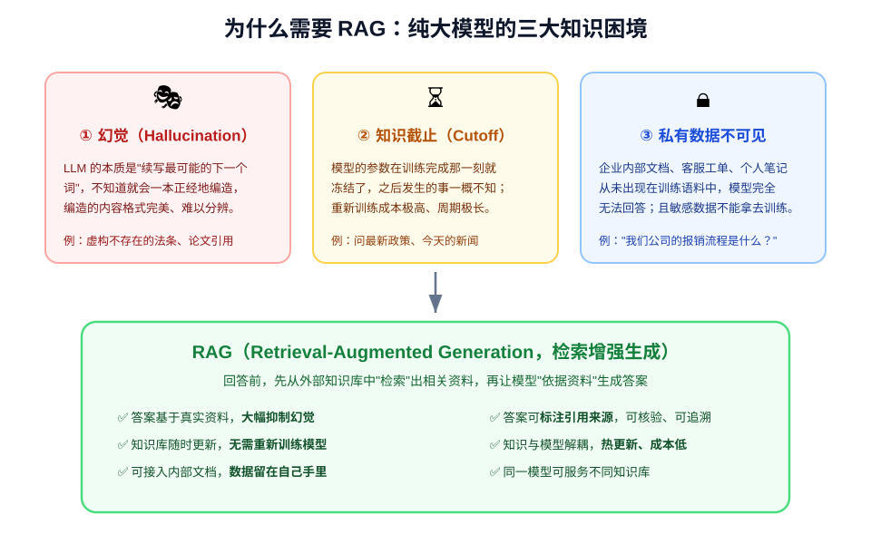
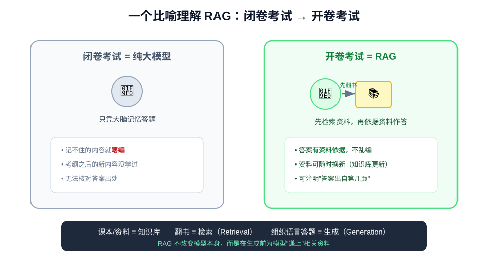
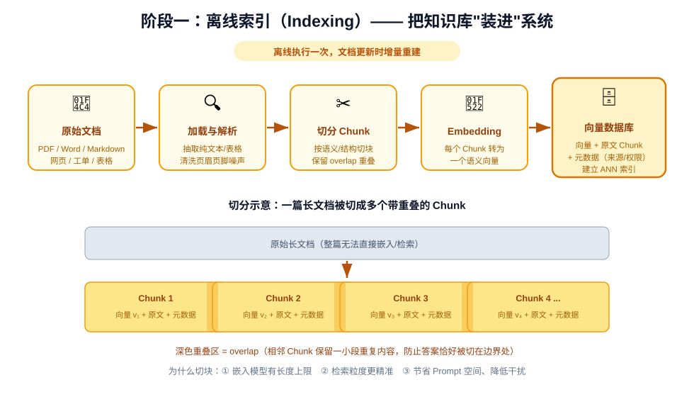
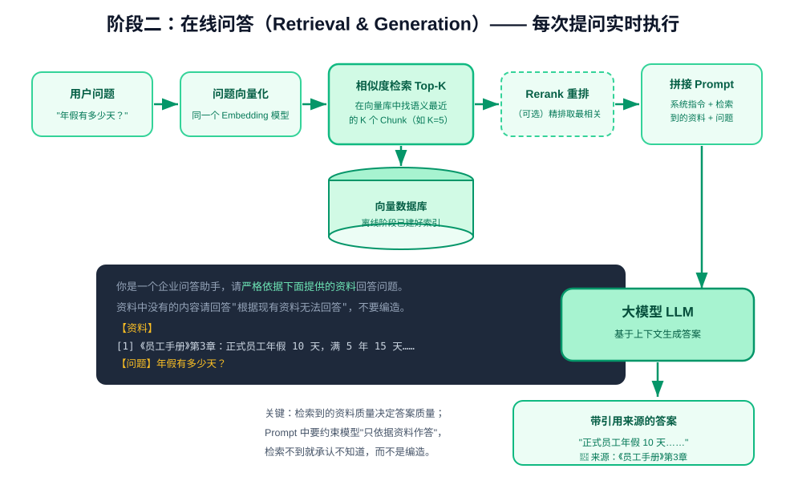
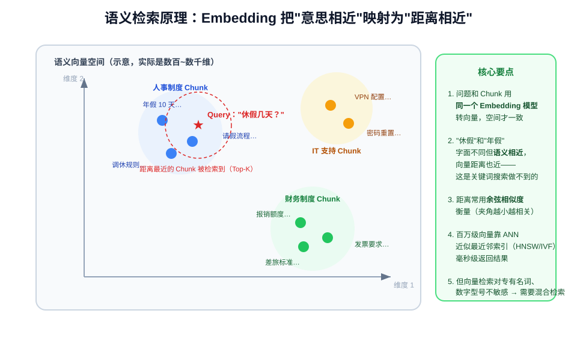
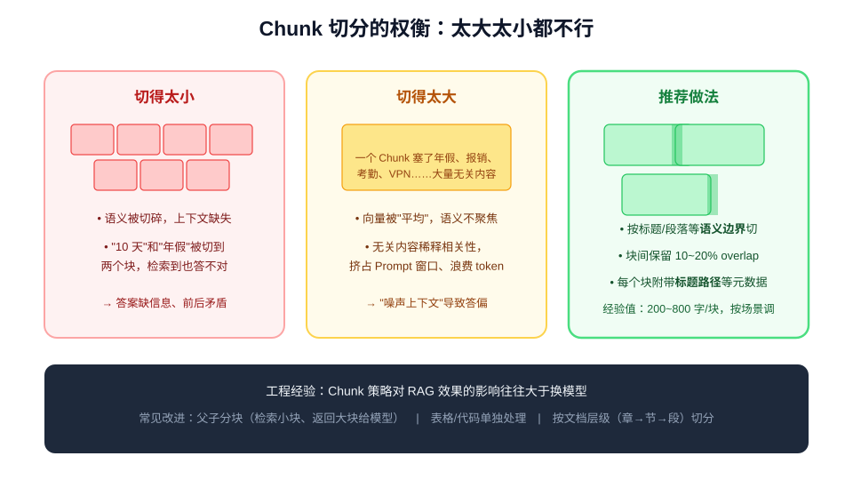

# 什么是 RAG：检索增强生成从原理到实战

> **RAG（Retrieval-Augmented Generation，检索增强生成）** 是目前让大模型"用上私有知识、减少幻觉、答案可溯源"
> 的主流工程方案。本文讲透三件事：**RAG 是什么、它内部如何运转、实际中如何搭建与优化**。

---

## 一、为什么需要 RAG

大模型（LLM）的知识全部储存在**模型参数**里——训练完成的那一刻，知识就"冻结"了。这带来三个绕不开的困境：



1. **幻觉（Hallucination）**：LLM 的工作机制是"预测最可能的下一个词"，当它不知道答案时，不会说"我不知道"，
   而是会**一本正经地编造**，且编造内容格式严谨、语气自信，极难分辨。
2. **知识截止（Knowledge Cutoff）**：模型不知道训练截止日之后发生的事，而重新训练/微调模型成本高、周期长。
3. **私有数据不可见**：企业内部文档、客服记录、个人笔记从未出现在训练语料中，模型根本无法回答
   "我们公司的年假有几天"这类问题；敏感数据也不能拿去训练。

RAG 的思路非常朴素：**既然模型记不住也不该记所有知识，那就让它在回答前先"查资料"，查到什么就依据什么回答。**

一个最好的比喻是**考试**：



- 纯大模型像**闭卷考试**：全凭记忆作答，记不准就编；
- RAG 像**开卷考试**：先翻书找到相关章节，再组织语言答题，答完还能标注"出自课本第几页"。

这个概念由 Facebook AI（Meta）在 2020 年的论文 *Retrieval-Augmented Generation for Knowledge-Intensive NLP Tasks*
中正式提出，如今已成为企业级大模型应用的标准架构。

---

## 二、RAG 的整体工作流程

RAG 由两个阶段构成：**离线索引**（把知识库"装进"系统）和**在线问答**（用户提问时实时检索 + 生成）。

### 2.1 阶段一：离线索引（Indexing）

这一步在用户提问之前完成，本质上是一条 **ETL 数据管道**：



```text
原始文档 → 加载解析 → 切分 Chunk → Embedding 向量化 → 存入向量数据库（建立索引）
```

1. **文档加载（Loading）**：读取 PDF、Word、Markdown、网页、数据库记录等，抽取纯文本（表格、图片需特殊处理）；
2. **切分（Chunking）**：把长文档切成一段段文本块（Chunk），通常每块几百字，相邻块之间保留一小段重叠（overlap）；
3. **向量化（Embedding）**：用 Embedding 模型把每个 Chunk 转换成一个高维向量（如 1024 维浮点数数组），
   向量的几何距离代表语义相似度；
4. **入库（Indexing）**：把"向量 + 原文 Chunk + 元数据（来源、页码、权限）"一起写入向量数据库，
   并建立 ANN（近似最近邻）索引以支持毫秒级检索。

文档更新时，只需对新增/变更的部分**增量重建**索引，模型本身一行参数都不用动——这就是 RAG 知识热更新的秘密。

### 2.2 阶段二：在线问答（Retrieval & Generation）

用户每提一个问题，实时执行：



```text
用户问题
  → 问题向量化（同一个 Embedding 模型）
  → 在向量库中检索语义最相近的 Top-K 个 Chunk
  →（可选）Rerank 重排序，精选最相关的几块
  → 把"系统指令 + 检索到的资料 + 用户问题"拼成 Prompt
  → LLM 依据资料生成答案，并标注引用来源
```

最终发给大模型的 Prompt 大致长这样：

```text
你是一个企业问答助手，请严格依据下面提供的资料回答问题。
资料中没有的内容请回答"根据现有资料无法回答"，不要编造。

【资料】
[1]《员工手册》第3章：正式员工年假 10 天，司龄满 5 年为 15 天……
[2]《考勤制度》：年假需提前 3 个工作日在 OA 系统申请……

【问题】年假有多少天？
```

可以看到，**RAG 并没有训练或修改模型，它只是改变了模型的"输入"**——把外部知识在推理时动态注入 Prompt。
这也是它被称为"检索**增强**生成"的原因：生成能力来自 LLM，知识来自检索。

---

## 三、核心概念逐个讲透

### 3.1 Embedding：把语义变成向量

Embedding（嵌入）是 RAG 的基石：它把一段文本映射为一个稠密向量，**语义相近的文本在向量空间中距离也近**。



关键点：

- "年假有几天"和"休假多少天"**字面不同但语义相同**，它们的向量距离很近——这是向量检索相比传统关键词搜索
  （如 `LIKE '%年假%'`）的根本优势：能理解"意思"而非匹配"字面"；
- 问题和文档 Chunk **必须使用同一个 Embedding 模型**转向量，两者才处于同一个向量空间，距离才有意义；
- 向量间的相似度常用**余弦相似度**（衡量向量夹角）计算，取值 [-1, 1]，越接近 1 越相关；
- Embedding 模型的选择直接决定检索质量。常用的有 OpenAI `text-embedding-3-small/large`、
  开源的 `bge-large-zh`（中文效果优秀）、`m3e`、`GTE` 等。维度越高表达能力越强，但存储和检索成本也越高。

> 想深入理解词向量的训练原理（Word2Vec、上下文向量等），可参阅同目录《什么是词向量》。

### 3.2 向量数据库

向量数据库负责存储向量并提供"按相似度找 Top-K"的能力。百万级向量下不可能逐个计算距离（暴力检索太慢），
实际使用 **ANN（Approximate Nearest Neighbor，近似最近邻）索引**，主流算法是 **HNSW**（图索引）和 **IVF**（倒排聚类）：


| 向量库 | 特点 | 适用场景 |
| --- | --- | --- |
| **Chroma** | 轻量、嵌入式、零配置，`pip install` 即用 | 本地开发、原型验证、小规模应用 |
| **FAISS** | Meta 开源的向量检索库（非完整数据库） | 本地高性能检索、研究实验 |
| **pgvector** | PostgreSQL 插件，向量与业务数据同库 | 已有 PG 技术栈、需要事务/JOIN/权限过滤 |
| **Milvus / Zilliz** | 专业分布式向量数据库，支持海量数据 | 企业级、十亿级向量、高并发 |
| **Qdrant** | Rust 编写，性能强，过滤能力好 | 中大型生产系统 |
| **Elasticsearch / OpenSearch** | 全文检索 + 向量检索一体 | 需要混合检索的团队 |

### 3.3 Chunk 切分：最影响效果却最容易被忽视

RAG 圈有一句经验之谈：**"垃圾进，垃圾出"——检索质量的上限在数据处理阶段就决定了，而 Chunk 策略是其中
影响最大的变量之一。**



- **切太小**：语义被切碎。"年假 10 天"可能被切成两块——一块有"10 天"、一块有"年假"，检索到任何一块都无法回答；
- **切太大**：一个 Chunk 混入考勤、报销、VPN 等无关内容，向量语义被"稀释"，既浪费 token 又干扰模型；
- **推荐做法**：
  - 按**标题/段落等语义边界**切分，而非按固定字符数硬切；
  - 相邻块保留 **10%~20% 的 overlap**，防止答案恰好落在切分边界上；
  - 每个 Chunk 附带**标题路径**（如"第三章 考勤制度 > 3.2 年假"）作为元数据，帮助模型理解上下文；
  - 表格、代码、问答对等结构化内容应单独成块，不要打散；
  - 经验起始值：每块 300~800 个汉字，再用评测集调参。

进阶技巧是**父子分块（Parent-Child / Small-to-Big）**：用小块做检索（匹配精准），实际喂给模型时返回它所属的
大块（上下文完整），兼得两者优点。

### 3.4 检索、Top-K 与 Rerank

- **Top-K**：每次检索返回最相关的 K 个 Chunk（K 常取 3~10）。K 太小可能漏掉关键信息，K 太大会引入噪声并
  增加 token 成本；
- **Rerank（重排序）**：向量检索速度快但粒度粗（双塔模型，问题和文档各自独立编码）。可以在初筛出较多
  候选（如 Top-50）后，用 **Cross-Encoder 重排模型**（如 `bge-reranker`）把问题和每个候选拼在一起精细打分，
  取前 5 块喂给 LLM。这是生产系统性价比极高的一步优化。

---

## 四、动手搭建一个 RAG 系统

### 4.1 不依赖框架的极简实现（理解原理）

先用最朴素的代码理解 RAG 的本质——RAG 没有魔法，核心就是"切块 → 转向量 → 算相似度 → 拼 Prompt"：

```python
import numpy as np
from openai import OpenAI

client = OpenAI()

# ---------- 1. 准备知识库 ----------
documents = [
    "年假政策：正式员工每年享有 10 天带薪年假，司龄满 5 年增加至 15 天。",
    "报销流程：差旅费需在出差结束后 10 个工作日内提交，附发票和审批单。",
    "考勤制度：标准工作时间为 9:00-18:00，午休 1 小时，每月迟到不超过 3 次免责。",
]

def embed(texts: list[str]) -> list[list[float]]:
    """调用 Embedding 模型把文本批量转向量"""
    resp = client.embeddings.create(model="text-embedding-3-small", input=texts)
    return [item.embedding for item in resp.data]

def cosine(a: list[float], b: list[float]) -> float:
    """余弦相似度：向量夹角越小越相似"""
    a, b = np.array(a), np.array(b)
    return float(a @ b / (np.linalg.norm(a) * np.linalg.norm(b)))

# ---------- 2. 离线索引：文档转向量 ----------
doc_vectors = embed(documents)

# ---------- 3. 在线问答 ----------
def ask(question: str, top_k: int = 2) -> str:
    # 3.1 问题向量化
    q_vec = embed([question])[0]
    # 3.2 算相似度，取 Top-K
    scores = sorted(
        ((cosine(q_vec, dv), i) for i, dv in enumerate(doc_vectors)),
        reverse=True
    )[:top_k]
    context = "\n".join(f"[{i+1}] {documents[i]}" for _, i in scores)
    # 3.3 拼 Prompt
    prompt = f"""请严格依据以下资料回答问题，资料中没有就说"根据现有资料无法回答"。

资料：
{context}

问题：{question}"""
    # 3.4 生成
    resp = client.chat.completions.create(
        model="gpt-4o-mini",
        messages=[{"role": "user", "content": prompt}],
    )
    return resp.choices[0].message.content

print(ask("入职 6 年可以休几天年假？"))
# → 根据资料[1]，司龄满 5 年年假为 15 天，因此您可享有 15 天年假。
```

实际系统只是在此基础上替换了三个部件：文件加载器、向量数据库（替代内存数组）、更完善的切分与重排。

### 4.2 使用 LangChain 搭建生产级 RAG

LangChain（或同类的 LlamaIndex）把文档加载、切分、向量库、检索、Prompt 模板都封装成了可组合的模块：

```bash
pip install langchain langchain-openai langchain-chroma chromadb pypdf
```

```python
from langchain_community.document_loaders import DirectoryLoader, PyPDFLoader
from langchain_text_splitters import RecursiveCharacterTextSplitter
from langchain_openai import OpenAIEmbeddings, ChatOpenAI
from langchain_chroma import Chroma
from langchain.chains import create_retrieval_chain
from langchain.chains.combine_documents import create_stuff_documents_chain
from langchain_core.prompts import ChatPromptTemplate

# ---------- 阶段一：离线索引 ----------
# 1. 加载 docs/ 目录下所有 PDF（按页解析）
loader = DirectoryLoader("docs/", glob="**/*.pdf", loader_cls=PyPDFLoader)
docs = loader.load()

# 2. 切分：RecursiveCharacterTextSplitter 优先按段落/句子边界切，尽量保持语义完整
splitter = RecursiveCharacterTextSplitter(
    chunk_size=500,          # 每块目标字符数
    chunk_overlap=80,        # 相邻块重叠 80 字符
    separators=["\n\n", "\n", "。", "！", "？", "，", " ", ""],
)
chunks = splitter.split_documents(docs)

# 3. 向量化并写入 Chroma（persist_directory 让索引落盘，下次直接加载）
vectorstore = Chroma.from_documents(
    documents=chunks,
    embedding=OpenAIEmbeddings(model="text-embedding-3-small"),
    persist_directory="./chroma_db",
)

# ---------- 阶段二：在线问答 ----------
retriever = vectorstore.as_retriever(
    search_type="similarity",
    search_kwargs={"k": 5},          # Top-5
)

llm = ChatOpenAI(model="gpt-4o-mini", temperature=0)   # RAG 场景温度建议调低

prompt = ChatPromptTemplate.from_template(
    "你是一个严谨的企业知识助手。请只根据下面资料回答问题，并在答案末尾标注引用来源；"
    "资料中没有依据时直接回答'根据现有资料无法回答'，禁止编造。\n\n"
    "资料：\n{context}\n\n问题：{input}"
)

# 检索链 + 生成链组合成完整 RAG
combine_chain = create_stuff_documents_chain(llm, prompt)
rag_chain = create_retrieval_chain(retriever, combine_chain)

result = rag_chain.invoke({"input": "年假有多少天？"})
print(result["answer"])
# result["context"] 里是实际命中的 Chunk，可用于向用户展示"引用来源"
```

> LlamaIndex 的设计理念类似但更专注 RAG 场景，提供了更丰富的文档解析和索引结构（如 Tree Index、
> Auto-Retrieval），两者可按团队熟悉度选择。

### 4.3 落地步骤清单

```text
① 明确语料范围：哪些文档需要进知识库？权限如何隔离？
② 数据接入与解析：PDF/Word/网页加载，表格图片专项处理，清洗页眉页脚噪声
③ 切分与元数据：按语义边界切块，保留 overlap，标注来源/章节/权限
④ 选型 Embedding 模型与向量库：中文优先 BGE 系列；原型用 Chroma，生产用 Milvus/Qdrant/pgvector
⑤ 检索调试：先肉眼检查"给定问题，Top-K 检索回来的块对不对"
⑥ 拼 Prompt 并约束模型：只依据资料作答、无依据拒答、标注引用
⑦ 建立评测集，量化迭代（见第六节）
```

---

## 五、进阶优化：从"能跑"到"好用"

基础版 RAG 跑通后，效果往往差强人意。生产系统通常在链路上增加以下增强（工程全景见下图）：


1. **混合检索（Hybrid Search）**：向量检索擅长语义匹配，但对**专有名词、产品型号、数字编号**不敏感
   （"SLA 99.99"、错误码、人名）。实践中应把**向量检索 + BM25 全文检索**的结果融合（RRF 算法），
   两者优势互补；
2. **Rerank 重排**：如 3.4 节所述，Cross-Encoder 精排是投入产出比最高的单点优化；
3. **Query 改写**：用户真实提问往往很短、口语化（"那个几天？"）。可用 LLM 先把问题改写/扩展为更适合检索
   的形式，或生成多个子查询分别检索再合并（Multi-Query）；
4. **HyDE（假设文档嵌入）**：先让 LLM 根据问题"假装"生成一份答案，再用这份假答案去检索——
   因为答案和文档的文体更接近，向量距离反而更准；
5. **元数据过滤前置**：检索前先按权限、部门、文档类型、时间过滤，既安全又能显著提升准确率
   （**权限过滤必须在检索前执行**，不能检索后再筛）；
6. **引用溯源与答案核验**：让模型在答案中标注引用编号，前端展示来源文档链接；可进一步让模型对每条论断
   给出支撑片段，实现可核验；
7. **多路召回与迭代检索**：复杂问题可拆成多个子问题分别检索（类似 Agent 的 ReAct 循环），
   检索不足时自动换关键词再查。

---

## 六、RAG vs 微调 vs 长上下文：如何选型

三种让模型"获得知识"的方式经常被拿来比较，实际是互补而非互斥：

| 维度 | RAG 检索增强 | Fine-tuning 微调 | 长上下文（直接塞全文） |
| --- | --- | --- | --- |
| 知识更新 | 改库即可，**实时热更新** | 需重新训练，周期长 | 每次请求都要提供 |
| 幻觉控制 | 强（有资料依据，可溯源） | 弱（知识仍在参数里） | 中（材料在但模型可能忽略） |
| 适配能力 | 注入外部知识 | 调整语气、风格、领域语言、新技能 | 处理单篇长文档 |
| 数据要求 | 文档即可 | 需要高质量标注数据集 | 无需预处理 |
| 成本 | 检索 + 较长 Prompt | 训练贵，推理便宜 | token 成本最高，且有"大海捞针"问题 |
| 适用场景 | 知识问答、客服、文档助手 | 固定风格输出、领域格式化任务 | 单次合同审查、单篇论文分析 |

**经验结论**：知识类问题优先 RAG；风格/格式/技能固化用微调；单篇文档的一次性分析用长上下文。
三者也常组合使用（微调过的模型 + RAG 知识库）。

### 常见的坑

- **只做向量检索不做关键词检索**，专业术语命中率低；
- **固定字符数硬切**，表格代码被打散、语义被截断；
- **不调 Prompt 约束**，模型把检索资料当参考而非依据，照样幻觉；
- **没有评测集凭感觉调参**——今天觉得好、明天换批问题就崩；
- **忽视文档解析质量**，PDF 表格乱码、页眉页脚混入，检索再强也救不回垃圾输入；
- **敏感文档不做权限隔离**，所有用户检索同一个库，造成越权泄露。

### 效果评测

RAG 的评测要**拆成两段**分别度量：

1. **检索质量**（决定答案上限）：
   - **Recall@K / Hit Rate**：标准答案所在的 Chunk 是否出现在 Top-K 中；
   - **MRR**：正确 Chunk 的排名是否靠前；
2. **生成质量**：
   - **Faithfulness（忠实度/可信度）**：答案是否都能在检索资料中找到依据（衡量幻觉）；
   - **Answer Relevancy**：答案是否切题；
   - **Context Precision/Recall**：喂给模型的上下文是否精准、是否齐全。

工具可用 RAGAS、TruLens，或用 LLM-as-Judge 自动评分；但**先人工标注 50~100 条问答对**作为黄金评测集，
是所有优化的前提——没有评测集的调参都是玄学。

---

## 七、小结

| 知识点 | 一句话总结 |
| --- | --- |
| RAG 是什么 | 回答前先从外部知识库**检索**资料，再让 LLM **依据资料生成**答案 |
| 解决什么问题 | 幻觉、知识截止、私有数据接入、答案可溯源 |
| 两大阶段 | 离线索引（加载→切分→Embedding→入库）+ 在线问答（检索→Rerank→拼 Prompt→生成） |
| Embedding | 把文本映射为向量，语义距离 = 几何距离；问题与文档必须用同一模型 |
| 向量库 | 用 HNSW/IVF 等 ANN 索引实现毫秒级相似度检索 |
| Chunk 策略 | 按语义边界切、保留 overlap、附带元数据；其效果影响常大于换模型 |
| 生成约束 | Prompt 中要求"只依据资料、无据拒答、标注来源" |
| 核心优化 | 混合检索 + Rerank + Query 改写 + 权限过滤 + 评测驱动 |
| 选型建议 | 知识问答用 RAG，风格技能用微调，单篇分析用长上下文 |

**RAG 的本质不是 AI 算法创新，而是一个"传统数据系统 + LLM 接口"的工程问题**：ETL 管道、索引、权限过滤、
缓存、监控、评测——后端工程师的既有技能几乎全部可复用，需要新增的只是 Embedding 选型、向量索引原理、
Prompt 构建与 LLM 评测指标。掌握本文流程后，建议进阶学习多文档路由、Agentic RAG（Agent 自主决策检索）、
以及图 RAG（GraphRAG，用知识图谱建模实体关系）等方向。
