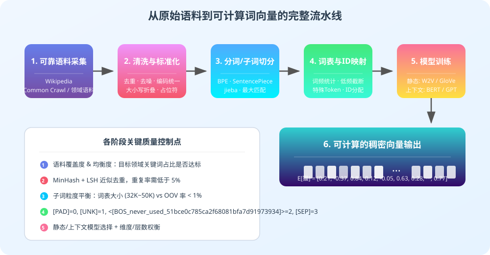
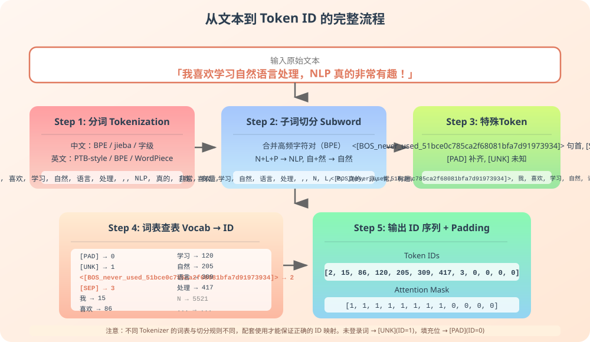
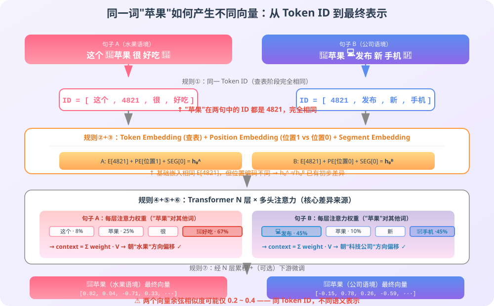

# 什么是词向量

词向量（Word Vector，也称 Word Embedding）是把自然语言中的词映射为实数向量的方法。

从原始文本到最终可用的词向量，需要经过一条严格的流水线：

```text
可靠语料采集
  → 文本清洗与标准化
  → 分词与子词切分
  → 构建词表与编号映射
  → 模型训练（静态/上下文）
  → 生成可计算向量
```



---

## 1. 获取可靠的原始文本

词向量的质量上限由训练语料的质量决定。垃圾进、垃圾出（Garbage In, Garbage Out），这是所有 NLP 模型的铁律。

### 1.1 语料数据源的分级

不同来源的语料在可信度、领域覆盖和版权合规性上差异极大，实际使用时应分层评估：

| 语料来源 | 典型代表 | 可信度 | 适用场景 | 风险提示 |
| --- | --- | --- | --- | --- |
| 权威出版物 | 人民出版社、剑桥大学出版社 | ★★★★★ | 基础语义训练、学术研究 | 版权严格，需合规授权 |
| 官方公开语料 | 维基百科、政府公报、人民日报 | ★★★★☆ | 通用语义词向量 | 时效性略弱，需要清洗引用标记 |
| 开放学术语料 | Common Crawl、OSCAR、CLUECorpus | ★★★☆☆ | 大规模预训练 | 噪声大，需多层过滤去重 |
| 垂直领域语料 | 医学文献、法律判决书、行业白皮书 | ★★★★☆ | 领域专用词向量 | 专业术语密度高，需领域专家校验 |
| 社区UGC内容 | 论坛、博客、问答平台 | ★★☆☆☆ | 口语化表达、热点词捕捉 | 错别字多、存在灌水与低质内容 |
| 爬虫爬取的未知网站 | — | ★☆☆☆☆ | 不建议直接使用 | 版权风险、数据污染、重复率极高 |

### 1.2 语料的质量评估指标

拿到一份语料后，至少评估以下指标再决定是否进入训练：

**覆盖度（Coverage）**
```text
目标领域关键词的出现率。
如果训练的是医疗词向量，但语料中极少出现"靶点""预后"等关键词，说明覆盖度不足。
```

**均衡度（Balance）**
```text
不同主题、不同体裁、不同时期文本的比例是否合理。
如果 90% 都是体育新闻，那"病毒"学到的可能主要是"计算机病毒"而非医学病毒。
```

**清洁度（Cleanliness）**
```text
- 乱码占比（UTF-8 解码错误、编码混杂）
- 模板噪声占比（网页导航、广告横幅、Cookie 提示）
- 重复文本比例（Exact Duplicate / Near Duplicate）
- 非目标语言混入比例
```

**合规性（Compliance）**
```text
- 版权许可类型（CC0 / CC-BY / 专有许可）
- 是否包含个人隐私信息（PII）
- 是否涉及敏感或违法内容
```

### 1.3 语料清洗的标准化步骤

原始语料通常像一块原石，需要经过多道工序才能成为可用的数据。

**第一步：编码与格式统一**
```python
# 1. 统一字符编码，修复乱码
text = text.encode("latin-1", errors="ignore").decode("utf-8", errors="replace")

# 2. 统一全角/半角字符
#    全角 Ａ → 半角 A
#    全角 １２３ → 半角 123

# 3. 统一换行与空白
#    \r\n → \n
#    多个连续空格合并为一个
```

**第二步：模板与噪声剔除**
```text
需要剔除的典型噪声：
├── HTML 标签（<div>、<script>、内联样式）
├── 页面导航条（"首页 / 新闻 / 国际 / 正文"）
├── 广告与推荐位（"猜你喜欢""相关推荐"）
├── 版权声明与页脚（"© 2024 All Rights Reserved"）
├── 引用标记（[1]、[2]、参考资料链接）
├── Cookie 弹窗、登录提示
├── 重复的页眉页脚
└── 社交平台分享按钮、评论数等界面元素
```

**第三步：内容级过滤**
```python
def should_discard(text: str) -> bool:
    # 过短的文本通常没有有效上下文
    if len(text) < 50:
        return True

    # 乱码字符比例过高
    if ratio_of_garbage_chars(text) > 0.05:
        return True

    # 大写字母/符号占比过高（通常是代码或配置文件混入）
    if non_text_ratio(text) > 0.3:
        return True

    # 重复句子比例过高
    if duplicate_sentence_ratio(text) > 0.5:
        return True

    return False
```

**第四步：去重（Deduplication）**

语料中的重复会严重扭曲词的共现统计，导致高频词的向量被重复样本主导。

| 去重级别 | 方法 | 说明 |
| --- | --- | --- |
| 精确去重 | MD5 / SHA-256 哈希 | 去掉完全相同的文档 |
| 段落级去重 | 滑动窗口 + 哈希 | 检测文档内部重复段落 |
| 近似去重（Near-Dup） | MinHash + LSH | 相似度 > 阈值的文档视为重复 |
| 子串去重 | 公共子串检测 | 剔除不同文档共享的大段模板文本 |

典型的近似去重算法 MinHash + LSH 的思路：
```text
1. 将文档拆成 shingle（如连续 5 个词构成的子串）
2. 对每个 shingle 计算多个哈希值，得到签名
3. 通过 LSH（Locality-Sensitive Hashing）把相似签名分到同一桶
4. 同一桶内的文档做细粒度相似度比较，超过阈值则去重
```

**第五步：隐私与敏感内容过滤**
```text
- 个人身份信息（姓名、身份证号、手机号、邮箱、住址）使用 NER 或正则识别并打码
- 违法违规、涉黄涉暴内容使用文本分类器拦截
- 涉及商业机密的文本必须在源头脱敏
```

### 1.4 语料标准化：让同一含义的文本看起来一致

标准化的目的是减少无意义的表示差异，让模型聚焦于真正的语义信息。

**大小写折叠（Case Folding）**
```text
"Apple" → "apple"
"iPhone" → "iphone"  （注意：专有名词有时需要保留，取决于任务）
```

**标点与符号统一**
```text
"你好！！！"   → "你好！"  （过度重复标点归一化）
"你好~~~"     → "你好"
中文引号 「」 → ""
全角逗号 ，   → ，（中文文本中保留全角标点通常更自然）
```

**数字标准化**
```text
"1234567"    → "[数字]"  或保留为具体数字（取决于是否需要数值语义）
"2024年3月"  → "[日期]"  或保持原格式
```

**特殊占位符**
```text
URL      → "[URL]"
邮箱     → "[邮箱]"
电话号码 → "[电话]"
@用户名  → "[用户]"
```

> **需要警惕的过度标准化**：过度清洗可能破坏语义信息。例如在医学文本中，数字"38.5℃"如果被替换成"[数字]℃"，模型就无法学习到"高烧"与具体温度范围之间的关联。清洗策略必须与目标任务对齐。

### 1.5 典型数据集示例

| 数据集 | 语言 | 规模 | 特点 |
| --- | --- | --- | --- |
| Wikipedia Dump | 多语言 | 数十亿词 | 质量高、领域广、权威 |
| Common Crawl | 多语言 | 万亿级 Token | 规模极大、噪声极高 |
| OSCAR | 多语言 | 数万亿 Token | Common Crawl 清洗版 |
| CLUECorpus | 中文 | 100GB+ | 中文通用语料 |
| CSL (Chinese Scientific Literature) | 中文 | 科研领域 | 中文学术文本 |
| THUCNews | 中文 | ~74万篇 | 中文新闻分类 |

---

## 2. 为什么计算机需要词向量

计算机擅长处理数字，但原始文本由字符和符号组成，不能直接参与矩阵乘法、梯度下降等数值运算。

例如，模型不会直接把“猫”理解成一种动物，而是把它表示成一组数字：

```text
猫 → [0.21, -0.37, 0.84, 0.12, ...]
狗 → [0.25, -0.31, 0.79, 0.18, ...]
汽车 → [-0.62, 0.44, 0.05, -0.73, ...]
```

这些数字不是词典释义，而是词在向量空间中的坐标。由于“猫”和“狗”经常出现在相似语境中，它们的向量通常比较接近；“猫”和“汽车”的使用语境差别较大，向量通常相距较远。

词向量解决的核心问题是：

```text
如何把离散的语言符号转换成神经网络可以计算、比较和学习的连续数值表示？
```


假设有一句话：

```text
我喜欢自然语言处理
```

文本模型通常先将其切分为词或子词：

```text
["我", "喜欢", "自然", "语言", "处理"]
```

再将每个词或子词转换成编号：

```text
[15, 86, 120, 205, 309]
```

编号只能标识词的身份，编号之间的大小没有语义：

```text
“狗”的编号是 18，“猫”的编号是 200
```

这不代表“猫”比“狗”大，也不代表二者相差 `182` 个语义单位。因此，模型还需要把离散编号转换成能够表达语义关系的向量。

---

## 3. 文本分词与编号

清洗好的原始文本仍然是连续的字符流。计算机无法直接理解"我喜欢学习"是四个词还是四个字，需要先进行**分词（Tokenization）**，再把切分后的单元映射为整数**编号（ID）**。

这个过程是从文本到向量的关键桥梁，任何一个环节出问题，后续的词向量都会偏离预期。



### 3.1 什么是分词单位（Token）

在正式讨论算法之前，先明确切分后的最小单元不一定是"词"。

| 分词粒度 | 示例（中文："我喜欢学习自然语言处理"） | 示例（英文："unbelievable results"） | 优点 | 缺点 |
| --- | --- | --- | --- | --- |
| 字/字符级 | ["我", "喜", "欢", "学", "习", ...] | ["u", "n", "b", "e", "l", ...] | 词表最小、无OOV | 序列过长、语义单元过于细碎 |
| 词级 | ["我", "喜欢", "学习", "自然", "语言", "处理"] | ["unbelievable", "results"] | 符合人类直觉 | 未登录词多、词表难以控制 |
| 子词级 | ["我", "喜欢", "学", "习", ...] | ["un", "believ", "able", "result", "s"] | 平衡词表与OOV | 切分结果不总是符合语言学直觉 |
| 字节级 | 每个UTF-8字节分别作为Token | 同上 | 绝对无OOV，完全跨语言 | 序列极长、效率低 |

现代大模型几乎都采用**子词（Subword）** 方案，兼顾了词表规模和未登录词问题。

### 3.2 英文分词：从空格切分到子词

英文天然有空格作为分隔，但真正的分词远不止 `split()`。

**基础空格切分的问题**
```python
raw = "Don't stop believin', hold on to that feelin'!"

# 简单 split 切出了不规范的 token
print(raw.split())
# → ["Don't", "stop", "believin',", "hold", "on", "to", "that", "feelin'!"]
#    标点被错误地附着在单词上
```

**基于规则的英文分词（Penn Treebank 风格）**
```python
import re

def ptb_tokenize(text: str) -> list[str]:
    # 分离标点
    text = re.sub(r"([.,!?;:])", r" \1 ", text)
    # 缩约词拆分（简化版）
    text = re.sub(r"n't", " n't", text)
    text = re.sub(r"'s", " 's", text)
    text = re.sub(r"'ve", " 've", text)
    text = re.sub(r"'re", " 're", text)
    text = re.sub(r"'ll", " 'll", text)
    text = re.sub(r"'d", " 'd", text)
    text = re.sub(r"'m", " 'm", text)
    # 多空格合并
    text = re.sub(r"\s+", " ", text)
    return text.strip().split()

print(ptb_tokenize("Don't stop believin', hold on!"))
# → ["Do", "n't", "stop", "believin", "'", ",", "hold", "on", "!"]
```

**现代子词分词：BPE 算法详解**

BPE（Byte Pair Encoding，字节对编码）最初是压缩算法，被 OpenAI、Google 等广泛用于大模型分词。它的核心思想非常朴素：

```text
把语料中最常共同出现的字符对，合并成一个新的符号。
重复这个过程直到词表大小达到预设上限。
```

**BPE 训练步骤（简化版）：**

```text
步骤 0：初始化词表，包含所有基础字符。
        例如英文：a b c ... z A B C ... Z 0 1 ... 9 , . ! ? ...

步骤 1：将训练语料中的每个词拆成字符序列，并在末尾加 </w> 标记词边界。
        "low"      →  ["l", "o", "w", "</w>"]     频率：5
        "lower"    →  ["l", "o", "w", "e", "r", "</w>"]   频率：2
        "newest"   →  ["n", "e", "w", "e", "s", "t", "</w>"]   频率：3
        "widest"   →  ["w", "i", "d", "e", "s", "t", "</w>"]   频率：2

步骤 2：统计所有相邻字符对的出现频率，找到最高频的一对。
        例如 "e" + "s" 在 "newest" 和 "widest" 中各出现一次，
        总共频率 3+2 = 5，假设这是最高频对。

步骤 3：将 "es" 合并为一个新符号，加入词表。
        重新计算语料：
        "newest" →  ["n", "e", "w", "es", "t", "</w>"]
        "widest" →  ["w", "i", "d", "es", "t", "</w>"]

步骤 4：重复步骤 2 和步骤 3，直到词表大小达到目标（如 32000、50257）。
```

**BPE 编码（推理时切分新文本）：**

```text
假设已训练好的 BPE 词表包含以下合并规则：
  er  →  <er>
  st  →  <st>
  est →  <est>
  low →  <low>

对新词 "lowest" 进行编码：

初始字符拆分：l o w e s t </w>
     应用合并规则：l o w → <low>
          →  <low> e s t </w>
     应用合并规则：s t → <st>
          →  <low> e <st> </w>
     应用合并规则：e <st> → <est>
          →  <low> <est> </w>

最终结果：["<low>", "<est>", "</w>"]
```

BPE 的优势在于：**从未见过的词也能通过已有子词组合出合理的切分。** 例如新词"Transformer"虽然训练时没见过，但只要词表里有"Trans""form""er"等子词，就能正确切分。

### 3.3 中文分词：从词典匹配到深度学习

中文没有天然空格分隔，分词难度显著高于英文。

**基于词典的正向最大匹配（FMM）**
```python
def forward_max_match(text: str, word_dict: set[str], max_len: int = 4) -> list[str]:
    result = []
    i = 0
    while i < len(text):
        matched = None
        # 从最长可能长度开始尝试
        for length in range(max_len, 0, -1):
            if i + length > len(text):
                continue
            chunk = text[i : i + length]
            if chunk in word_dict:
                matched = chunk
                break
        if matched is None:
            # 词典中没有匹配，单字作为回退
            matched = text[i]
            length = 1
        result.append(matched)
        i += length
    return result

word_dict = {"我", "喜欢", "学习", "自然", "语言", "处理", "自然语言处理"}
print(forward_max_match("我喜欢学习自然语言处理", word_dict))
# → ["我", "喜欢", "学习", "自然语言处理"]
```

匹配方向会影响歧义切分。例如"北京大学生前来应聘"：
```text
正向最大匹配：北京 / 大学 / 生前 / 来 / 应聘    ← "生前" 切错
反向最大匹配：北京 / 大学生 / 前来 / 应聘    ← 正确
双向匹配同时失败时，再通过统计概率或规则裁决。
```

**基于统计模型的分词（HMM / CRF）**

经典的 `jieba` 分词使用隐马尔可夫模型（HMM）处理未登录词：

```python
import jieba

# 精确模式：最常用
words = jieba.lcut("小明硕士毕业于中国科学院计算所")
print(words)
# → ['小明', '硕士', '毕业', '于', '中国科学院', '计算所']

# 搜索引擎模式：对长词再次切分，适合检索
words = jieba.lcut_for_search("小明硕士毕业于中国科学院计算所")
print(words)
# → ['小明', '硕士', '毕业', '于', '中国', '科学', '学院', '科学院',
#    '中国科学院', '计算', '计算所']
```

**现代大模型的中文分词策略**

| 模型系列 | 分词方案 | 词表示例 |
| --- | --- | --- |
| BERT 中文（Google） | 字级切分 | "自然语言处理" → ["自", "然", "语", "言", "处", "理"] |
| LLaMA、GPT-NeoX | 字节级 BPE | 支持中文，但子词粒度不稳定 |
| Qwen、Baichuan、ChatGLM | 中文优化的 BPE / SentencePiece | 词表中包含大量中文整词和高频子词 |

> **重要经验**：不同模型的分词器（Tokenizer）对同一段中文文本的切分结果可能不同，进而导致下游任务效果差异。迁移预训练模型时，**必须使用与之配套的 Tokenizer**，不能混用。

### 3.4 SentencePiece：统一多语言分词方案

SentencePiece 是 Google 提出的一种**与语言无关**的分词框架，被 T5、LLaMA 2 等广泛采用。

它的两个关键创新：
- **把空格当作普通字符处理**：用 `▁`（U+2581）代替空格，输入连中文也不需要先做词级分词。
- **直接从原始字节序列训练**：不依赖语言的分词知识，理论上支持任何语言。

```text
原始文本："我喜欢NLP"

SentencePiece 处理流程：
  1. 空格替换："我喜欢NLP" → "▁我喜欢NLP"
  2. 训练 BPE / Unigram LM：在字符序列上学习合并规则
  3. 输出（示例）：["▁我", "喜欢", "N", "L", "P"]
```

Unigram LM 是 SentencePiece 默认使用的子词算法，与 BPE 的核心区别：

| 对比项 | BPE | Unigram LM |
| --- | --- | --- |
| 合并规则 | 贪心合并最高频字符对 | 基于概率模型选择最优切分 |
| 切分结果确定性 | 确定，每次相同 | 取概率最大的切分路径 |
| 替换回退策略 | 无 | 提供多个备选切分方案 |
| 词表大小控制 | 通过合并次数 | 通过词汇概率修剪 |

### 3.5 构建词表与特殊 Token

完成分词后，需要把所有出现过的 Token 整理成一张映射表（词表 / Vocabulary）。

**词表构建流程：**

```text
步骤 1：词频统计。遍历全部语料，统计每个 Token 的出现次数。
步骤 2：低频截断。词频 < min_freq 的 Token 通常丢弃，否则词表过大且信息不足。
步骤 3：加入特殊 Token。
步骤 4：为每个 Token 分配一个唯一的整数 ID。通常 0 留给 padding。
```

**必备的特殊 Token：**

| 特殊 Token | 含义 | 典型 ID | 作用 |
| --- | --- | --- | --- |
| `[PAD]` | 填充 | 0 | 批次内句子长度不一致时，用 PAD 补齐到相同长度 |
| `[UNK]` | 未知词（unknown） | 1 | 词表中没有的 Token 用 UNK 代替，避免崩溃 |
| `<[BOS_never_used_51bce0c785ca2f68081bfa7d91973934]>` / `<s>` | 句子开始 | 2 | 标记输入序列的起始位置 |
| `[SEP]` / `</s>` | 句子结束/分隔 | 3 | 标记句子结束或分隔两个句子（如 QA 的问题和答案） |
| `<[BOS_never_used_51bce0c785ca2f68081bfa7d91973934]>` | 分类位 | 4 | BERT 等模型的分类任务使用，<[BOS_never_used_51bce0c785ca2f68081bfa7d91973934]> 的向量代表整句语义 |
| `[MASK]` | 掩码位 | 5 | MLM 预训练任务中，用来替换被预测的词 |

```python
def build_vocab(token_counter: dict[str, int], min_freq: int = 3) -> dict[str, int]:
    # 1. 先放特殊 Token，ID 固定
    vocab = {
        "[PAD]": 0,
        "[UNK]": 1,
        "<[BOS_never_used_51bce0c785ca2f68081bfa7d91973934]>": 2,
        "[SEP]": 3,
        "<[BOS_never_used_51bce0c785ca2f68081bfa7d91973934]>": 4,
        "[MASK]": 5,
    }
    next_id = len(vocab)

    # 2. 按词频从高到低加入词表
    sorted_tokens = sorted(token_counter.items(), key=lambda x: -x[1])
    for token, freq in sorted_tokens:
        if freq < min_freq:
            continue
        if token in vocab:
            continue
        vocab[token] = next_id
        next_id += 1

    return vocab
```

### 3.6 从 Token 到 ID：编号映射

词表构建完成后，每个 Token 都有唯一的整数 ID。编号映射就是查表过程：

```python
def tokens_to_ids(tokens: list[str], vocab: dict[str, int]) -> list[int]:
    unk_id = vocab["[UNK]"]
    return [vocab.get(token, unk_id) for token in tokens]

# 假设词表：
# "我" → 15
# "喜欢" → 86
# "自然语言处理" → 309
# "[UNK]" → 1

tokens = ["我", "喜欢", "一个陌生的词"]
ids = tokens_to_ids(tokens, vocab)
# → [15, 86, 1]   陌生词被映射为 [UNK] 的 ID 1
```

**反向映射（ID → Token）用于调试和解码：**
```python
def ids_to_tokens(ids: list[int], id2token: dict[int, str]) -> list[str]:
    return [id2token[id] for id in ids]
```

### 3.7 处理批输入与序列长度对齐

实际训练时数据是成批进入模型的，同一批次内的序列长度必须相同。

```text
批次内的三条句子（已转 ID）：
句子 A：[2, 15, 86, 309, 3]            长度 5
句子 B：[2, 233, 86, 520, 128, 77, 3]  长度 7
句子 C：[2, 42, 1024, 3]               长度 4

补齐到最大长度 7（用 PAD=0 填充）：
句子 A：[2, 15, 86, 309, 3, 0, 0]
句子 B：[2, 233, 86, 520, 128, 77, 3]
句子 C：[2, 42, 1024, 3, 0, 0, 0]

同时生成 attention_mask 告诉模型哪些位置是填充（0=PAD，1=真实内容）：
句子 A：[1, 1, 1, 1, 1, 0, 0]
句子 B：[1, 1, 1, 1, 1, 1, 1]
句子 C：[1, 1, 1, 1, 0, 0, 0]
```

如果不使用 mask，模型会把 PAD 位置的 0 向量也当作真实语义参与注意力计算，导致错误的上下文聚合。

---

## 4. 从独热编码到词向量

### 4.1 独热编码

独热编码（One-Hot Encoding）为词表中的每个词分配一个维度。假设词表为：

```text
["猫", "狗", "苹果", "汽车"]
```

对应表示为：

```text
猫   → [1, 0, 0, 0]
狗   → [0, 1, 0, 0]
苹果 → [0, 0, 1, 0]
汽车 → [0, 0, 0, 1]
```

这种表示能区分词，但存在三个明显问题。

#### 维度过高

如果词表有 `100000` 个词，每个向量就有 `100000` 维。

#### 数据稀疏

向量中只有一个位置是 `1`，其余全是 `0`，存储和计算效率较低。

#### 无法表达语义相似性

任意两个不同词的独热向量都互相正交：

```text
猫 · 狗 = 0
猫 · 汽车 = 0
```

从独热编码看，“猫”和“狗”与“猫”和“汽车”同样不相似，这显然不符合语言直觉。

### 4.2 稠密词向量

词向量通常是几十维到数千维的稠密实数向量：

```text
猫 → [0.21, -0.37, 0.84, ...]
```

与独热编码相比，它具有以下特点：

| 对比项 | 独热编码 | 词向量 |
| --- | --- | --- |
| 维度 | 等于词表大小，通常很高 | 通常为几十到数千维 |
| 数据形式 | 稀疏，大部分为 `0` | 稠密，大部分维度有值 |
| 是否学习得到 | 通常不是 | 通常通过训练学习 |
| 语义关系 | 无法直接表达 | 可用距离或方向近似表达 |
| 未登录词处理 | 无法处理 | 可结合子词方法处理 |

## 5. 词向量的数学表示

设词表大小为 `V`，每个词向量的维度为 `d`，所有词向量可以组成一个嵌入矩阵：

```text
E ∈ R^(V×d)
```

其中：

- `V`：词表中的词或 Token 数量。
- `d`：每个向量的维度。
- `E`：嵌入矩阵（Embedding Matrix）。
- `E[i]`：第 `i` 个词对应的向量。

假设：

```text
V = 50000
d = 300
```

那么嵌入矩阵形状为：

```text
E.shape = (50000, 300)
```

当输入词的编号为 `203` 时，模型执行的核心操作就是查表：

```text
词向量 = E[203]
```

如果使用独热向量 `x` 表示该词，查表也可以写成矩阵乘法：

```text
v = xE
```

因为 `x` 只有第 `203` 个位置为 `1`，所以乘法结果正好取出 `E` 的第 `203` 行。实际工程通常直接使用索引查表，不会真的构造巨大的独热向量。

## 6. 词向量为什么能够表达语义

词向量背后的重要思想是分布假设（Distributional Hypothesis）：

> 一个词的含义，可以由它经常共同出现的上下文来刻画。

例如：

```text
小猫是一种可爱的宠物
小狗是一种忠诚的宠物
小猫喜欢吃鱼
小狗喜欢吃肉
```

“猫”和“狗”经常与“宠物”“可爱”“吃”等相似上下文共同出现。训练模型为了完成上下文预测任务，会对它们进行相似的参数更新，最终让二者的向量逐渐接近。

这并不意味着某个维度一定能直接解释为“可爱程度”或“动物程度”。语义通常分布在多个维度的组合中，这也是“分布式表示”名称的来源。


## 7. 如何衡量两个词是否相似

### 7.1 余弦相似度

词向量最常用的相似度指标是余弦相似度（Cosine Similarity）：

```text
cos(u, v) = (u · v) / (||u|| × ||v||)
```

其中：

- `u · v`：两个向量的点积。
- `||u||`：向量 `u` 的长度。
- `||v||`：向量 `v` 的长度。
- `cos(u, v)`：两个向量夹角的余弦值。

通常可以这样理解：

```text
接近 1  → 方向接近，语义通常较相似
接近 0  → 方向接近垂直，相关性通常较弱
接近 -1 → 方向相反
```

余弦相似度关注向量方向，而弱化向量长度的影响，适合比较文本向量的语义方向。

### 7.2 计算示例

```python
import numpy as np


def cosine_similarity(left: np.ndarray, right: np.ndarray) -> float:
    denominator = np.linalg.norm(left) * np.linalg.norm(right)
    if denominator == 0:
        raise ValueError("不能计算零向量的余弦相似度")
    return float(np.dot(left, right) / denominator)


cat = np.array([0.8, 0.6, 0.1], dtype=np.float64)
dog = np.array([0.75, 0.65, 0.12], dtype=np.float64)
car = np.array([-0.2, 0.1, 0.95], dtype=np.float64)

cat_dog_similarity = cosine_similarity(cat, dog)
cat_car_similarity = cosine_similarity(cat, car)

assert cat_dog_similarity > cat_car_similarity
```

这个例子中的向量是人工构造的，只用于说明计算过程。真实词向量应由模型从语料中学习。

### 7.3 欧氏距离

也可以使用欧氏距离：

```text
distance(u, v) = √Σ(ui - vi)²
```

距离越小，两个向量越接近。但欧氏距离会受到向量长度影响，因此文本检索中常先对向量做归一化，或直接使用余弦相似度。

## 8. Word2Vec 如何学习词向量

Word2Vec 是经典的静态词向量训练方法，主要包含两种架构：

- CBOW：根据上下文预测中心词。
- Skip-gram：根据中心词预测上下文。

### 8.1 训练样本如何产生

假设句子为：

```text
我 喜欢 学习 自然 语言 处理
```

窗口大小为 `2`，中心词为“自然”，它附近的上下文为：

```text
["学习", "语言"]
```

Skip-gram 会构造正样本：

```text
(自然, 学习)
(自然, 语言)
```

滑动窗口遍历整个语料，就能产生大量“中心词—上下文词”训练对。

### 8.2 CBOW

CBOW（Continuous Bag of Words）使用周围词预测中心词：

```text
输入：["我", "喜欢", "语言", "处理"]
目标："自然"
```

基本过程：

```text
上下文词向量
    ↓
求和或取平均
    ↓
预测中心词的概率分布
```

CBOW 通常训练较快，对高频词表现较好。

### 8.3 Skip-gram

Skip-gram 使用中心词预测周围词：

```text
输入："自然"
目标：["学习", "语言"]
```

给定中心词 `w`，预测上下文词 `c` 的概率可写为：

```text
P(c | w) = exp(u_c · v_w) / Σ exp(u_j · v_w)
```

其中：

- `v_w`：中心词 `w` 的输入向量。
- `u_c`：上下文词 `c` 的输出向量。
- `u_c · v_w`：二者的点积。
- 分母：对词表中所有候选词进行归一化。

当真实上下文词和中心词的点积变大时，其预测概率会提高。训练完成后，模型保留学到的向量作为词向量。

Skip-gram 对低频词和较小数据集通常更友好，但计算成本可能高于 CBOW。

## 9. Softmax 与负采样

### 9.1 完整 Softmax 的问题

Skip-gram 的完整 Softmax 需要计算词表中每个词的分数：

```text
Σ exp(u_j · v_w)
```

如果词表有几十万项，每个训练样本都遍历整个词表，计算成本非常高。

### 9.2 负采样

负采样（Negative Sampling）的思路是：

```text
不与词表中的所有词比较，
只选择一个真实上下文词和少量随机错误词进行训练。
```

对一个中心词 `w`、真实上下文词 `c` 和负样本 `n_i`，常见目标函数为：

```text
J = log σ(u_c · v_w)
  + Σ log σ(-u_ni · v_w)
```

其中 Sigmoid 函数为：

```text
σ(z) = 1 / (1 + e^(-z))
```

两部分作用分别是：

- `log σ(u_c · v_w)`：增大中心词与真实上下文词的点积。
- `log σ(-u_ni · v_w)`：减小中心词与随机负样本的点积。

直观上可以理解为：

```text
真实搭配拉近，随机搭配推远。
```

经过大量训练后，具有相似上下文的词会聚集到相近区域。

## 10. 其他经典静态词向量

### 10.1 GloVe

GloVe（Global Vectors for Word Representation）利用整个语料库中的词共现统计。

它关注的问题是：

```text
词 i 和词 j 在整个语料中共同出现了多少次？
```

简化后的优化目标可以写成：

```text
J = Σ f(Xij)(wi · wj + bi + bj - log Xij)²
```

其中：

- `Xij`：词 `i` 和词 `j` 的共现次数。
- `wi`、`wj`：两个词的向量。
- `bi`、`bj`：偏置项。
- `f(Xij)`：权重函数，避免极高频共现主导训练。

Word2Vec 更偏向局部上下文预测，GloVe 更显式地使用全局共现统计。

### 10.2 FastText

FastText 不只为完整词学习向量，还把词拆成字符级子串（Character N-gram）。

例如：

```text
“学习”可以由“学”“习”“学习”等子串共同表示
```

它的优势是：

- 能利用词内部结构。
- 对低频词更友好。
- 可以为部分未登录词组合出向量。
- 对形态变化丰富的语言尤其有效。

## 11. 静态词向量的主要局限

Word2Vec、GloVe、FastText 通常属于静态词向量：一个词在所有句子中只有一个固定向量。

### 11.1 一词多义

例如“苹果”出现在两个句子中：

```text
这个苹果很好吃。
苹果发布了新手机。
```

第一个“苹果”表示水果，第二个“苹果”表示公司。但静态词向量只能为它们提供同一个向量，通常会把多个义项混合在一起。

### 11.2 无法充分表示语序

单独的词向量不包含完整句子的顺序关系：

```text
狗咬人
人咬狗
```

两句话包含相同的词，但含义不同。仅对词向量求平均会得到相同或非常接近的句子表示。

### 11.3 训练语料中的偏见

词向量会学习语料中的统计规律，也可能同时学习性别、职业、地域和文化偏见。词向量反映的是语料分布，不等于客观事实。

### 11.4 领域迁移问题

同一个词在不同领域可能含义不同：

```text
“病毒”在医学、网络安全和社交传播中的含义不同。
```

在新闻语料上训练的词向量，不一定适合医疗、法律或安全领域。

---

## 12. 从静态词向量到上下文词向量

ELMo、BERT、GPT 等模型会根据上下文动态生成 Token 向量。

对于下面两个句子：

```text
这个苹果很好吃。
苹果发布了新手机。
```

上下文模型产生的"苹果"向量不同：

```text
Embedding("苹果" | 水果语境) ≠ Embedding("苹果" | 公司语境)
```

这是因为 Transformer 会让每个 Token 通过注意力机制读取句子中的其他 Token，从而把上下文信息融入表示。

### 12.1 静态与上下文词向量对比

| 对比项 | 静态词向量 | 上下文词向量 |
| --- | --- | --- |
| 代表方法 | Word2Vec、GloVe、FastText | ELMo、BERT、GPT |
| 一个词的向量数量 | 通常固定一个 | 随上下文变化 |
| 一词多义 | 表达能力有限 | 能根据语境区分 |
| 计算方式 | 查固定词向量表 | 需要经过神经网络 |
| 计算成本 | 较低 | 较高 |
| 语义表达能力 | 基础语义 | 上下文和句法语义更丰富 |

---

## 13. 同一词如何产生不同的向量：深入上下文表示规则

第 11 章提到了静态词向量无法处理一词多义，第 12 章引入了上下文词向量的概念。但"上下文"具体是如何让同一个 Token ID 映射出不同向量的？这背后有一套精确的规则和计算流程，不是"模型自己领悟了语义"的黑魔法。



### 13.1 规则一：同一 Token ID 始终先查同一个基础嵌入表

无论出现在什么上下文中，同一个 Token ID 对应的**基础嵌入向量（Token Embedding / Input Embedding）** 始终是同一张表里的同一行。

```python
# 假设词表大小 V=50000，嵌入维度 d=768
token_embedding = nn.Embedding(num_embeddings=50000, embedding_dim=768)

# "苹果"的 Token ID 假设是 4821
# 无论在什么句子里，先做的都是同一查表操作
base_apple_vec_1 = token_embedding(torch.tensor(4821))  # 水果句
base_apple_vec_2 = token_embedding(torch.tensor(4821))  # 公司句

# → base_apple_vec_1 == base_apple_vec_2
```

这意味着：**在进入 Transformer 之前，"苹果"在两个句子里的向量是完全相同的。** 差异是之后逐层加上去的。

### 13.2 规则二：叠加位置编码，让"同一个词在句中不同位置"也不同

基础嵌入只告诉你"这是什么词"，但模型还需要知道"这个词出现在第几个位置"。

以 BERT 的可学习位置编码为例：

```python
# BERT-base 最大支持 512 个位置
position_embedding = nn.Embedding(num_embeddings=512, embedding_dim=768)

# 句子 A："这个 苹果 很 好吃 。"
# 索引：    0    1    2   3    4
apple_pos_in_A = torch.tensor(1)   # "苹果"在位置 1
pos_vec_A = position_embedding(apple_pos_in_A)

# 句子 B："苹果 发布 了 新 手机 。"
# 索引：    0    1    2  3   4    5
apple_pos_in_B = torch.tensor(0)   # "苹果"在位置 0
pos_vec_B = position_embedding(apple_pos_in_B)

# 此时加上位置后就已经不同了
input_A = base_apple_vec + pos_vec_A
input_B = base_apple_vec + pos_vec_B
```

除了**可学习位置编码**（BERT、GPT-2/3 使用），还有**正弦位置编码**（原始 Transformer、T5 使用）：

```text
对于位置 pos、维度 i（偶数维度 i=2k，奇数维度 i=2k+1）：

PE(pos, 2k)     = sin( pos / 10000^(2k/d) )
PE(pos, 2k+1)   = cos( pos / 10000^(2k/d) )
```

正弦编码是固定的数学函数，不需要训练；可学习位置编码则通过数据学出更灵活的位置偏好。二者的目标一致：**让"苹果"放在句首和句中时，输入到后续层的初始表示就已经有所区分。**

> **注意**：位置编码只解决"位置不同"的问题，还不能解决"语境不同但位置相同"的词义消歧。真正做语义融合的是注意力机制。

### 13.3 规则三：段/类型编码区分句子边界（可选）

在 BERT 的 NSP（Next Sentence Prediction）预训练任务中，还会叠加**段编码（Segment Embedding / Token Type Embedding）**：

```python
# 单句任务：全部是 0
# 句子对任务（如 QA）：问句 A=0，答句 B=1
segment_embedding = nn.Embedding(num_embeddings=2, embedding_dim=768)

# QA 示例：问题是"苹果是什么？"，答案是"一种水果"
# 问句中的 "苹果" 是 segment 0
# 答案中的 "水果" 是 segment 1
```

加上段编码后，输入层的最终向量为：

```text
h_0 = Token Embedding + Position Embedding + Segment Embedding
```

### 13.4 规则四：自注意力让每个词读取上下文，逐层融入语境信息

这是"同一词产生不同向量"的**核心机制**。

#### 自注意力的一次计算拆解（单层单头）

以句子"这个 苹果 很好吃"为例，观察"苹果"如何通过注意力读取上下文：

```text
步骤 1：每个 Token 从当前层向量 h 投影出 Q（查询）、K（键）、V（值）
        "这个"  → Q_这个, K_这个, V_这个
        "苹果"  → Q_苹果, K_苹果, V_苹果
        "很好吃" → Q_很好吃, K_很好吃, V_很好吃

步骤 2：Q_苹果 与每个 K 做点积，得到注意力分数
        score_苹果→这个   = Q_苹果 · K_这个     = 0.3
        score_苹果→苹果   = Q_苹果 · K_苹果     = 1.2    ← 通常对自己分数较高
        score_苹果→很好吃 = Q_苹果 · K_很好吃   = 2.4    ← 注意！这个分数远高于其他

步骤 3：Softmax 归一化，得到注意力权重（和为 1）
        weight_苹果→这个   = 0.08
        weight_苹果→苹果   = 0.25
        weight_苹果→很好吃 = 0.67    ← 70% 的注意力集中在"很好吃"

步骤 4：用权重加权求和 V 向量
        context_苹果 = 0.08 × V_这个 + 0.25 × V_苹果 + 0.67 × V_很好吃

步骤 5：与原"苹果"向量残差相加，再经过 LayerNorm 和 FFN
        得到更新后的 "苹果" 向量 h_new_苹果
```

由于"很好吃"这个上下文提供了强烈的水果信号，**更新后的"苹果"向量就朝着"水果苹果"的方向被拉动了**。

对比"苹果 发布 新手机"：

```text
同样是 "苹果"：
  score_苹果→发布  = 2.1
  score_苹果→新手机 = 2.3

context_苹果 ≈ 0.1 × V_苹果 + 0.45 × V_发布 + 0.45 × V_新手机
              ↓
  更新后的 "苹果" 朝着 "科技公司" 的方向被拉动
```

经过 12 层（BERT-base）或更多层（GPT-3 96 层、LLaMA-70B 80 层）的**反复迭代**，每一层都会重新计算注意力、重新融合上下文信息。到最后一层输出时，两个"苹果"的向量已经相距甚远——尽管它们最初查的是 Token Embedding 表中的同一行。

### 13.5 规则五：多层叠加产生的表示差异，通常底层偏向句法、高层偏向语义

学术界通过探针（Probing）实验发现，Transformer 不同层捕获的信息类型不同：

```text
第 1-2 层（底层）：
  - 主要做浅层语义 + 句法信息融合
  - 相邻词依赖、大小写、标点等局部特征最清晰
  - 同词在不同语境的向量差异仍较小

第 3-8 层（中层）：
  - 词义消歧逐渐明显
  - "苹果（水果）" 和 "苹果（公司）" 开始拉开距离
  - 依存句法关系、指代关系逐步建立

第 9-12 层（高层）：
  - 深度语义融合
  - 同形多义词的向量几乎完全分离
  - 与任务标签直接相关的表示最突出
```

因此，如果下游任务只需要区分"水果 vs 公司"，可以使用倒数第 2-3 层的向量；如果需要更细微的语义（如情感极性），使用最后一层通常更好。

### 13.6 规则六：多头注意力从不同子空间并行读取不同类型的上下文

Transformer 不会只用一组 Q/K/V，而是把维度分成多组「头」（Head），**不同头关注不同类型的关系**。

以 BERT-base（12 头，768 维 → 每头 64 维）为例：

```text
头 1：关注形容词修饰关系  → "苹果" 更关注 "好吃/新鲜/美味"
头 2：关注主谓宾搭配     → "苹果" 更关注 "发布/推出/收购"
头 3：关注指代           → "它" 更关注前面提到的实体
头 4：关注否定           → "不" 对被修饰词的影响
...
头 12：关注全局话题
```

每头计算完各自的上下文向量后，再拼接（Concatenate）成 768 维，再通过线性投影混合。这就是为什么同一"苹果"能同时综合"水果属性""公司属性""语法属性"等多维度信息——不是一个维度变了，而是**多个子空间各自被不同上下文重新加权**。

### 13.7 规则七：同一词在同一上下文中，不同任务微调后的向量也会不同

即使是同一句"苹果很好吃"，经过不同目标微调后，"苹果"的输出向量也可能不同：

| 微调任务 | "苹果"向量关注的重点 |
| --- | --- |
| 情感分类 | 与"好吃"的正面情绪绑定更强 |
| 命名实体识别（NER） | 判断是否为食物类实体 |
| 机器翻译 | 与前后词的对齐关系、目标语言词形变化 |
| 问答抽取 | 是否为答案的一部分、与问题词的关联 |

这是因为微调会调整 Transformer 的参数（有时是全部参数，有时只调 LoRA 适配器），导致注意力权重的分布发生变化，进而改变最终的输出表示。

### 13.8 一个完整的数字示例（简化）

```text
设：
  V=4（词表只有 PAD/UNK/苹果/好吃），"苹果"ID=2，"好吃"ID=3
  d=4（简化维度，真实模型通常 768+）

步骤 A：查表得到基础 Token Embedding
  E[2] = [0.5, 0.3, 0.1, 0.8]   ← "苹果"
  E[3] = [0.2, 0.9, 0.4, 0.3]   ← "好吃"

步骤 B：加上位置编码（苹果在位置1，好吃在位置2）
  PE[1] = [0.1, 0.2, 0.0, 0.1]
  PE[2] = [0.0, 0.1, 0.2, 0.0]
  h0_苹果 = [0.6, 0.5, 0.1, 0.9]
  h0_好吃 = [0.2, 1.0, 0.6, 0.3]

步骤 C：进入第1层 Transformer
  假设投影后 Q_苹果=[1,0,0,0]，K_好吃=[2,0,0,0]（点积=2 >> 其他）
  → 注意力权重：苹果→好吃 = 0.8，苹果→苹果 = 0.2
  → context_苹果 = 0.2·V_苹果 + 0.8·V_好吃
  → 残差+FFN 后得到 h1_苹果 ≈ [0.3, 0.8, 0.4, 0.5]   ← 明显朝"好吃"方向偏移

如果换句子"苹果 发布 手机"：
  "发布"的 K 与 Q_苹果 点积最高
  → context_苹果 朝"发布/公司"方向偏移
  → 最终 h1_苹果（公司） ≠ h1_苹果（水果）

经过 12 层累积，差异被放大为语义空间中显著的距离。
```

### 13.9 总结：同一词产生不同向量的七条规则

| 规则序号 | 机制 | 使向量不同的原因 |
| --- | --- | --- |
| 1 | 基础 Token Embedding | 查表层不区分，但这是计算起点 |
| 2 | 位置编码（正弦/可学习） | 同一词在句中位置不同 → 初始输入就不同 |
| 3 | 段/类型编码（可选） | 同词出现在问句 vs 答句 → 段编码不同 |
| 4 | 自注意力加权融合上下文 | **核心机制**：不同上下文中 Q·K 的相似度不同 → 加权和不同 → 向量不同 |
| 5 | 多层堆叠 | 差异逐层累积；底层偏句法，高层偏语义消歧 |
| 6 | 多头并行 | 不同头在不同子空间读取不同关系；最终拼接混合 |
| 7 | 下游任务微调 | 微调改变注意力权重，向量分布因任务目标而异 |

理解了这七条规则，就能明白"上下文词向量"不是什么神秘魔法，而是一套可解释、可复现的精确计算流程。每个数字的变化都有明确的计算路径。

---

## 14. 词、Token 与子词向量

现代大语言模型通常不直接以完整“词”为最小单位，而是使用 Token。

Token 可能是：

- 一个完整汉字。
- 一个完整英文单词。
- 英文单词的一部分。
- 标点符号。
- 特殊控制符号。

例如英文单词可能被拆分为：

```text
unbelievable → ["un", "believ", "able"]
```

因此在现代大模型中，更准确的术语通常是 Token Embedding，而不是传统意义上的 Word Embedding。

子词方案的优势包括：

- 控制词表规模。
- 降低未登录词问题。
- 复用词根、前缀和后缀。
- 可以组合表示从未完整见过的新词。

## 15. 词向量、句向量和文本嵌入的区别

这些概念相关，但粒度不同。

| 名称 | 表示对象 | 常见用途 |
| --- | --- | --- |
| 词向量 | 一个词或 Token | 序列模型输入、词义分析 |
| 句向量 | 一个句子 | 句子相似度、语义匹配 |
| 段落向量 | 一个段落 | 聚类、分类、检索 |
| 文档向量 | 一篇文档 | 文档检索、推荐、去重 |
| 多模态向量 | 文本、图像等 | 跨模态搜索、图文匹配 |

不能简单地认为“把所有词向量取平均”就是高质量句向量。平均池化会丢失语序、否定关系和重点信息。

例如：

```text
我喜欢这部电影。
我不喜欢这部电影。
```

两句话只有一个词不同，简单平均后的向量可能仍然很接近，但实际语义相反。现代句向量模型会专门针对语义匹配任务进行训练。

## 16. 词向量中的类比关系

经典词向量常展示下面的向量关系：

```text
国王 - 男人 + 女人 ≈ 女王
北京 - 中国 + 日本 ≈ 东京
```

这表示某些语义关系可能近似对应向量空间中的方向。

但是需要注意：

- 类比关系不是严格代数定律。
- 结果依赖训练语料、分词方式和训练参数。
- 向量空间可能包含社会偏见。
- 并不是每种语义关系都能用简单加减表达。

因此，类比运算适合帮助建立直觉，不应被理解为模型真正掌握了形式逻辑。

## 17. 词向量的常见应用

### 17.1 语义相似度

比较两个词是否语义接近：

```text
相似词推荐、同义词发现、术语归一化
```

### 17.2 文本分类

词向量作为神经网络输入，用于：

```text
情感分析、垃圾邮件识别、主题分类、意图识别
```

### 17.3 信息检索

把查询和文档映射到向量空间，根据距离召回相关内容：

```text
用户问题 → 查询向量
知识库内容 → 文档向量
相似度搜索 → 返回相关文档
```

现代 RAG 系统通常使用句子或段落级 Embedding，而不是直接使用传统词向量。

### 17.4 推荐系统

可以把用户、商品、标签等映射到同一或相关向量空间，根据相似度进行召回和推荐。

### 17.5 聚类与可视化

对词向量进行聚类，可以发现语义群组。通过 PCA、t-SNE、UMAP 等降维方法，可以将高维向量投影到二维平面进行观察。

降维图只保留部分结构，二维位置不能完全代表原始高维空间中的真实距离。

## 18. 如何选择词向量或 Embedding 模型

选型时应先确定任务粒度，而不是只看向量维度。

| 需求 | 推荐方向 |
| --- | --- |
| 研究经典 NLP 原理 | Word2Vec、GloVe |
| 处理低频词和词形变化 | FastText |
| Token 级序列标注 | BERT 等上下文编码器 |
| 句子语义相似度 | 专用 Sentence Embedding 模型 |
| RAG 文档检索 | 检索型文本 Embedding 模型 |
| 多语言检索 | 多语言 Embedding 模型 |
| 图文互搜 | 多模态 Embedding 模型 |

工程上还需要评估：

- 是否适配中文和目标领域。
- 最大输入长度。
- 向量维度和存储成本。
- 推理速度和并发能力。
- 是否支持本地部署。
- 查询与文档是否需要不同编码方式。
- 在真实业务数据上的召回率和排序效果。

## 19. 常见误区

### 误区一：向量的每个维度都有明确名称

词向量的语义通常分散在多个维度中。某一维数值较大，不一定能直接解释成“积极”“动物”或“性别”。

### 误区二：向量越大，语义越重要

向量分量的绝对值不能单独解释为词的重要程度。比较语义通常需要使用完整向量和合适的相似度函数。

### 误区三：余弦相似度高就代表事实关系正确

向量相似只说明模型认为两段内容在训练分布中相近，不保证它们逻辑一致、事实正确或可以互相替换。

### 误区四：词向量和向量数据库是同一个概念

词向量是数值表示；向量数据库负责存储、索引和搜索向量。前者产生数据，后者管理和检索数据。

### 误区五：不同模型的向量可以直接比较

不同模型学习到的坐标系不同。即使向量维度相同，也不能直接计算来自不同模型的向量相似度。

```text
模型 A 生成的查询向量
必须与模型 A 生成的文档向量比较
```

## 20. 一条完整的现代文本向量化链路

以语义检索为例：

```text
原始文本
  ↓
清洗与切分
  ↓
Tokenizer 转为 Token ID
  ↓
Embedding 模型生成向量
  ↓
向量归一化
  ↓
写入向量索引
  ↓
查询向量与文档向量计算相似度
  ↓
召回最相关结果
```

需要特别区分两层 Embedding：

1. 模型内部的 Token Embedding：把 Token ID 变成向量序列。
2. 对外输出的文本 Embedding：把整个句子或段落压缩成一个用于检索的向量。

二者都叫 Embedding，但表示粒度和训练目标不同。

## 21. 总结

词向量的本质是：

```text
把离散语言符号映射到连续向量空间，
让语义关系能够通过数值计算近似表达。
```

其发展路线可以概括为：

```text
独热编码
  → 静态词向量
  → 子词向量
  → 上下文 Token 向量
  → 句子、段落和多模态 Embedding
```

理解词向量时应抓住四个核心点：

1. 向量是模型可计算的语言表示。
2. 相似上下文促使词获得相似表示。
3. 向量距离可以近似反映语义关系，但不等于逻辑或事实。
4. 现代 Embedding 已从固定词表示发展为上下文相关、任务相关的文本表示。

词向量连接了自然语言和数值计算，是理解 Word2Vec、Transformer、语义检索、向量数据库和 RAG 的重要基础。
