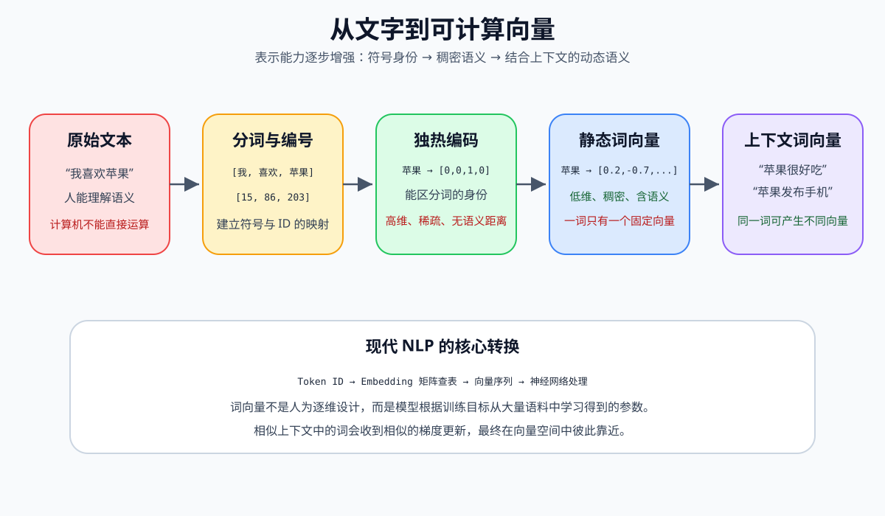
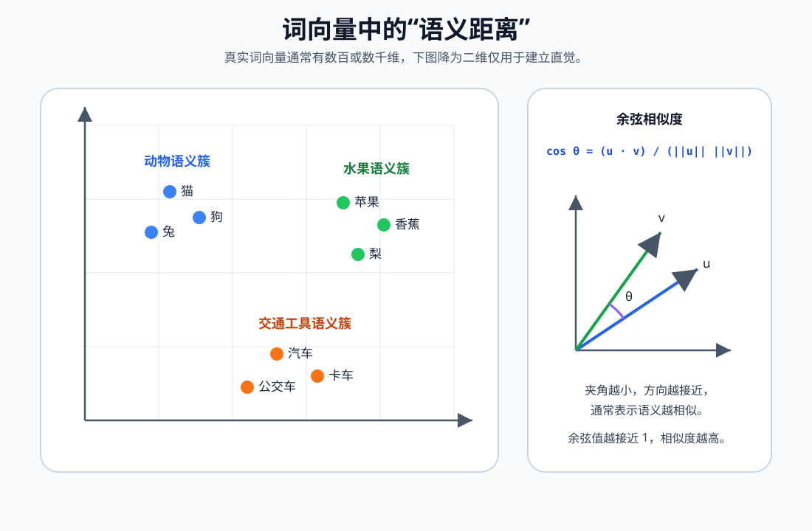

# 什么是词向量

词向量（Word Vector，也称 Word Embedding）是把自然语言中的词映射为实数向量的方法。

例如，模型不会直接把“猫”理解成一种动物，而是把它表示成一组数字：

```text
猫 → [0.21, -0.37, 0.84, 0.12, ...]
狗 → [0.25, -0.31, 0.79, 0.18, ...]
汽车 → [-0.62, 0.44, 0.05, -0.73, ...]
```

这些数字不是词典释义，而是词在向量空间中的坐标。由于“猫”和“狗”经常出现在相似语境中，它们的向量通常比较接近；“猫”和“汽车”的使用语境差别较大，向量通常相距较远。

词向量解决的核心问题是：

```text
如何把离散的语言符号转换成神经网络可以计算、比较和学习的连续数值表示？
```



## 1. 为什么计算机需要词向量

计算机擅长处理数字，但原始文本由字符和符号组成，不能直接参与矩阵乘法、梯度下降等数值运算。

假设有一句话：

```text
我喜欢自然语言处理
```

文本模型通常先将其切分为词或子词：

```text
["我", "喜欢", "自然", "语言", "处理"]
```

再将每个词或子词转换成编号：

```text
[15, 86, 120, 205, 309]
```

编号只能标识词的身份，编号之间的大小没有语义：

```text
“狗”的编号是 18，“猫”的编号是 200
```

这不代表“猫”比“狗”大，也不代表二者相差 `182` 个语义单位。因此，模型还需要把离散编号转换成能够表达语义关系的向量。

## 2. 从独热编码到词向量

### 2.1 独热编码

独热编码（One-Hot Encoding）为词表中的每个词分配一个维度。假设词表为：

```text
["猫", "狗", "苹果", "汽车"]
```

对应表示为：

```text
猫   → [1, 0, 0, 0]
狗   → [0, 1, 0, 0]
苹果 → [0, 0, 1, 0]
汽车 → [0, 0, 0, 1]
```

这种表示能区分词，但存在三个明显问题。

#### 维度过高

如果词表有 `100000` 个词，每个向量就有 `100000` 维。

#### 数据稀疏

向量中只有一个位置是 `1`，其余全是 `0`，存储和计算效率较低。

#### 无法表达语义相似性

任意两个不同词的独热向量都互相正交：

```text
猫 · 狗 = 0
猫 · 汽车 = 0
```

从独热编码看，“猫”和“狗”与“猫”和“汽车”同样不相似，这显然不符合语言直觉。

### 2.2 稠密词向量

词向量通常是几十维到数千维的稠密实数向量：

```text
猫 → [0.21, -0.37, 0.84, ...]
```

与独热编码相比，它具有以下特点：

| 对比项 | 独热编码 | 词向量 |
| --- | --- | --- |
| 维度 | 等于词表大小，通常很高 | 通常为几十到数千维 |
| 数据形式 | 稀疏，大部分为 `0` | 稠密，大部分维度有值 |
| 是否学习得到 | 通常不是 | 通常通过训练学习 |
| 语义关系 | 无法直接表达 | 可用距离或方向近似表达 |
| 未登录词处理 | 无法处理 | 可结合子词方法处理 |

## 3. 词向量的数学表示

设词表大小为 `V`，每个词向量的维度为 `d`，所有词向量可以组成一个嵌入矩阵：

```text
E ∈ R^(V×d)
```

其中：

- `V`：词表中的词或 Token 数量。
- `d`：每个向量的维度。
- `E`：嵌入矩阵（Embedding Matrix）。
- `E[i]`：第 `i` 个词对应的向量。

假设：

```text
V = 50000
d = 300
```

那么嵌入矩阵形状为：

```text
E.shape = (50000, 300)
```

当输入词的编号为 `203` 时，模型执行的核心操作就是查表：

```text
词向量 = E[203]
```

如果使用独热向量 `x` 表示该词，查表也可以写成矩阵乘法：

```text
v = xE
```

因为 `x` 只有第 `203` 个位置为 `1`，所以乘法结果正好取出 `E` 的第 `203` 行。实际工程通常直接使用索引查表，不会真的构造巨大的独热向量。

## 4. 词向量为什么能够表达语义

词向量背后的重要思想是分布假设（Distributional Hypothesis）：

> 一个词的含义，可以由它经常共同出现的上下文来刻画。

例如：

```text
小猫是一种可爱的宠物
小狗是一种忠诚的宠物
小猫喜欢吃鱼
小狗喜欢吃肉
```

“猫”和“狗”经常与“宠物”“可爱”“吃”等相似上下文共同出现。训练模型为了完成上下文预测任务，会对它们进行相似的参数更新，最终让二者的向量逐渐接近。

这并不意味着某个维度一定能直接解释为“可爱程度”或“动物程度”。语义通常分布在多个维度的组合中，这也是“分布式表示”名称的来源。



## 5. 如何衡量两个词是否相似

### 5.1 余弦相似度

词向量最常用的相似度指标是余弦相似度（Cosine Similarity）：

```text
cos(u, v) = (u · v) / (||u|| × ||v||)
```

其中：

- `u · v`：两个向量的点积。
- `||u||`：向量 `u` 的长度。
- `||v||`：向量 `v` 的长度。
- `cos(u, v)`：两个向量夹角的余弦值。

通常可以这样理解：

```text
接近 1  → 方向接近，语义通常较相似
接近 0  → 方向接近垂直，相关性通常较弱
接近 -1 → 方向相反
```

余弦相似度关注向量方向，而弱化向量长度的影响，适合比较文本向量的语义方向。

### 5.2 计算示例

```python
import numpy as np


def cosine_similarity(left: np.ndarray, right: np.ndarray) -> float:
    denominator = np.linalg.norm(left) * np.linalg.norm(right)
    if denominator == 0:
        raise ValueError("不能计算零向量的余弦相似度")
    return float(np.dot(left, right) / denominator)


cat = np.array([0.8, 0.6, 0.1], dtype=np.float64)
dog = np.array([0.75, 0.65, 0.12], dtype=np.float64)
car = np.array([-0.2, 0.1, 0.95], dtype=np.float64)

cat_dog_similarity = cosine_similarity(cat, dog)
cat_car_similarity = cosine_similarity(cat, car)

assert cat_dog_similarity > cat_car_similarity
```

这个例子中的向量是人工构造的，只用于说明计算过程。真实词向量应由模型从语料中学习。

### 5.3 欧氏距离

也可以使用欧氏距离：

```text
distance(u, v) = √Σ(ui - vi)²
```

距离越小，两个向量越接近。但欧氏距离会受到向量长度影响，因此文本检索中常先对向量做归一化，或直接使用余弦相似度。

## 6. Word2Vec 如何学习词向量

Word2Vec 是经典的静态词向量训练方法，主要包含两种架构：

- CBOW：根据上下文预测中心词。
- Skip-gram：根据中心词预测上下文。

### 6.1 训练样本如何产生

假设句子为：

```text
我 喜欢 学习 自然 语言 处理
```

窗口大小为 `2`，中心词为“自然”，它附近的上下文为：

```text
["学习", "语言"]
```

Skip-gram 会构造正样本：

```text
(自然, 学习)
(自然, 语言)
```

滑动窗口遍历整个语料，就能产生大量“中心词—上下文词”训练对。

### 6.2 CBOW

CBOW（Continuous Bag of Words）使用周围词预测中心词：

```text
输入：["我", "喜欢", "语言", "处理"]
目标："自然"
```

基本过程：

```text
上下文词向量
    ↓
求和或取平均
    ↓
预测中心词的概率分布
```

CBOW 通常训练较快，对高频词表现较好。

### 6.3 Skip-gram

Skip-gram 使用中心词预测周围词：

```text
输入："自然"
目标：["学习", "语言"]
```

给定中心词 `w`，预测上下文词 `c` 的概率可写为：

```text
P(c | w) = exp(u_c · v_w) / Σ exp(u_j · v_w)
```

其中：

- `v_w`：中心词 `w` 的输入向量。
- `u_c`：上下文词 `c` 的输出向量。
- `u_c · v_w`：二者的点积。
- 分母：对词表中所有候选词进行归一化。

当真实上下文词和中心词的点积变大时，其预测概率会提高。训练完成后，模型保留学到的向量作为词向量。

Skip-gram 对低频词和较小数据集通常更友好，但计算成本可能高于 CBOW。

## 7. Softmax 与负采样

### 7.1 完整 Softmax 的问题

Skip-gram 的完整 Softmax 需要计算词表中每个词的分数：

```text
Σ exp(u_j · v_w)
```

如果词表有几十万项，每个训练样本都遍历整个词表，计算成本非常高。

### 7.2 负采样

负采样（Negative Sampling）的思路是：

```text
不与词表中的所有词比较，
只选择一个真实上下文词和少量随机错误词进行训练。
```

对一个中心词 `w`、真实上下文词 `c` 和负样本 `n_i`，常见目标函数为：

```text
J = log σ(u_c · v_w)
  + Σ log σ(-u_ni · v_w)
```

其中 Sigmoid 函数为：

```text
σ(z) = 1 / (1 + e^(-z))
```

两部分作用分别是：

- `log σ(u_c · v_w)`：增大中心词与真实上下文词的点积。
- `log σ(-u_ni · v_w)`：减小中心词与随机负样本的点积。

直观上可以理解为：

```text
真实搭配拉近，随机搭配推远。
```

经过大量训练后，具有相似上下文的词会聚集到相近区域。

## 8. 其他经典静态词向量

### 8.1 GloVe

GloVe（Global Vectors for Word Representation）利用整个语料库中的词共现统计。

它关注的问题是：

```text
词 i 和词 j 在整个语料中共同出现了多少次？
```

简化后的优化目标可以写成：

```text
J = Σ f(Xij)(wi · wj + bi + bj - log Xij)²
```

其中：

- `Xij`：词 `i` 和词 `j` 的共现次数。
- `wi`、`wj`：两个词的向量。
- `bi`、`bj`：偏置项。
- `f(Xij)`：权重函数，避免极高频共现主导训练。

Word2Vec 更偏向局部上下文预测，GloVe 更显式地使用全局共现统计。

### 8.2 FastText

FastText 不只为完整词学习向量，还把词拆成字符级子串（Character N-gram）。

例如：

```text
“学习”可以由“学”“习”“学习”等子串共同表示
```

它的优势是：

- 能利用词内部结构。
- 对低频词更友好。
- 可以为部分未登录词组合出向量。
- 对形态变化丰富的语言尤其有效。

## 9. 静态词向量的主要局限

Word2Vec、GloVe、FastText 通常属于静态词向量：一个词在所有句子中只有一个固定向量。

### 9.1 一词多义

例如“苹果”出现在两个句子中：

```text
这个苹果很好吃。
苹果发布了新手机。
```

第一个“苹果”表示水果，第二个“苹果”表示公司。但静态词向量只能为它们提供同一个向量，通常会把多个义项混合在一起。

### 9.2 无法充分表示语序

单独的词向量不包含完整句子的顺序关系：

```text
狗咬人
人咬狗
```

两句话包含相同的词，但含义不同。仅对词向量求平均会得到相同或非常接近的句子表示。

### 9.3 训练语料中的偏见

词向量会学习语料中的统计规律，也可能同时学习性别、职业、地域和文化偏见。词向量反映的是语料分布，不等于客观事实。

### 9.4 领域迁移问题

同一个词在不同领域可能含义不同：

```text
“病毒”在医学、网络安全和社交传播中的含义不同。
```

在新闻语料上训练的词向量，不一定适合医疗、法律或安全领域。

## 10. 从静态词向量到上下文词向量

ELMo、BERT、GPT 等模型会根据上下文动态生成 Token 向量。

对于下面两个句子：

```text
这个苹果很好吃。
苹果发布了新手机。
```

上下文模型产生的“苹果”向量不同：

```text
Embedding("苹果" | 水果语境) ≠ Embedding("苹果" | 公司语境)
```

这是因为 Transformer 会让每个 Token 通过注意力机制读取句子中的其他 Token，从而把上下文信息融入表示。

### 静态与上下文词向量对比

| 对比项 | 静态词向量 | 上下文词向量 |
| --- | --- | --- |
| 代表方法 | Word2Vec、GloVe、FastText | ELMo、BERT、GPT |
| 一个词的向量数量 | 通常固定一个 | 随上下文变化 |
| 一词多义 | 表达能力有限 | 能根据语境区分 |
| 计算方式 | 查固定词向量表 | 需要经过神经网络 |
| 计算成本 | 较低 | 较高 |
| 语义表达能力 | 基础语义 | 上下文和句法语义更丰富 |

## 11. 词、Token 与子词向量

现代大语言模型通常不直接以完整“词”为最小单位，而是使用 Token。

Token 可能是：

- 一个完整汉字。
- 一个完整英文单词。
- 英文单词的一部分。
- 标点符号。
- 特殊控制符号。

例如英文单词可能被拆分为：

```text
unbelievable → ["un", "believ", "able"]
```

因此在现代大模型中，更准确的术语通常是 Token Embedding，而不是传统意义上的 Word Embedding。

子词方案的优势包括：

- 控制词表规模。
- 降低未登录词问题。
- 复用词根、前缀和后缀。
- 可以组合表示从未完整见过的新词。

## 12. 词向量、句向量和文本嵌入的区别

这些概念相关，但粒度不同。

| 名称 | 表示对象 | 常见用途 |
| --- | --- | --- |
| 词向量 | 一个词或 Token | 序列模型输入、词义分析 |
| 句向量 | 一个句子 | 句子相似度、语义匹配 |
| 段落向量 | 一个段落 | 聚类、分类、检索 |
| 文档向量 | 一篇文档 | 文档检索、推荐、去重 |
| 多模态向量 | 文本、图像等 | 跨模态搜索、图文匹配 |

不能简单地认为“把所有词向量取平均”就是高质量句向量。平均池化会丢失语序、否定关系和重点信息。

例如：

```text
我喜欢这部电影。
我不喜欢这部电影。
```

两句话只有一个词不同，简单平均后的向量可能仍然很接近，但实际语义相反。现代句向量模型会专门针对语义匹配任务进行训练。

## 13. 词向量中的类比关系

经典词向量常展示下面的向量关系：

```text
国王 - 男人 + 女人 ≈ 女王
北京 - 中国 + 日本 ≈ 东京
```

这表示某些语义关系可能近似对应向量空间中的方向。

但是需要注意：

- 类比关系不是严格代数定律。
- 结果依赖训练语料、分词方式和训练参数。
- 向量空间可能包含社会偏见。
- 并不是每种语义关系都能用简单加减表达。

因此，类比运算适合帮助建立直觉，不应被理解为模型真正掌握了形式逻辑。

## 14. 词向量的常见应用

### 14.1 语义相似度

比较两个词是否语义接近：

```text
相似词推荐、同义词发现、术语归一化
```

### 14.2 文本分类

词向量作为神经网络输入，用于：

```text
情感分析、垃圾邮件识别、主题分类、意图识别
```

### 14.3 信息检索

把查询和文档映射到向量空间，根据距离召回相关内容：

```text
用户问题 → 查询向量
知识库内容 → 文档向量
相似度搜索 → 返回相关文档
```

现代 RAG 系统通常使用句子或段落级 Embedding，而不是直接使用传统词向量。

### 14.4 推荐系统

可以把用户、商品、标签等映射到同一或相关向量空间，根据相似度进行召回和推荐。

### 14.5 聚类与可视化

对词向量进行聚类，可以发现语义群组。通过 PCA、t-SNE、UMAP 等降维方法，可以将高维向量投影到二维平面进行观察。

降维图只保留部分结构，二维位置不能完全代表原始高维空间中的真实距离。

## 15. 如何选择词向量或 Embedding 模型

选型时应先确定任务粒度，而不是只看向量维度。

| 需求 | 推荐方向 |
| --- | --- |
| 研究经典 NLP 原理 | Word2Vec、GloVe |
| 处理低频词和词形变化 | FastText |
| Token 级序列标注 | BERT 等上下文编码器 |
| 句子语义相似度 | 专用 Sentence Embedding 模型 |
| RAG 文档检索 | 检索型文本 Embedding 模型 |
| 多语言检索 | 多语言 Embedding 模型 |
| 图文互搜 | 多模态 Embedding 模型 |

工程上还需要评估：

- 是否适配中文和目标领域。
- 最大输入长度。
- 向量维度和存储成本。
- 推理速度和并发能力。
- 是否支持本地部署。
- 查询与文档是否需要不同编码方式。
- 在真实业务数据上的召回率和排序效果。

## 16. 常见误区

### 误区一：向量的每个维度都有明确名称

词向量的语义通常分散在多个维度中。某一维数值较大，不一定能直接解释成“积极”“动物”或“性别”。

### 误区二：向量越大，语义越重要

向量分量的绝对值不能单独解释为词的重要程度。比较语义通常需要使用完整向量和合适的相似度函数。

### 误区三：余弦相似度高就代表事实关系正确

向量相似只说明模型认为两段内容在训练分布中相近，不保证它们逻辑一致、事实正确或可以互相替换。

### 误区四：词向量和向量数据库是同一个概念

词向量是数值表示；向量数据库负责存储、索引和搜索向量。前者产生数据，后者管理和检索数据。

### 误区五：不同模型的向量可以直接比较

不同模型学习到的坐标系不同。即使向量维度相同，也不能直接计算来自不同模型的向量相似度。

```text
模型 A 生成的查询向量
必须与模型 A 生成的文档向量比较
```

## 17. 一条完整的现代文本向量化链路

以语义检索为例：

```text
原始文本
  ↓
清洗与切分
  ↓
Tokenizer 转为 Token ID
  ↓
Embedding 模型生成向量
  ↓
向量归一化
  ↓
写入向量索引
  ↓
查询向量与文档向量计算相似度
  ↓
召回最相关结果
```

需要特别区分两层 Embedding：

1. 模型内部的 Token Embedding：把 Token ID 变成向量序列。
2. 对外输出的文本 Embedding：把整个句子或段落压缩成一个用于检索的向量。

二者都叫 Embedding，但表示粒度和训练目标不同。

## 18. 总结

词向量的本质是：

```text
把离散语言符号映射到连续向量空间，
让语义关系能够通过数值计算近似表达。
```

其发展路线可以概括为：

```text
独热编码
  → 静态词向量
  → 子词向量
  → 上下文 Token 向量
  → 句子、段落和多模态 Embedding
```

理解词向量时应抓住四个核心点：

1. 向量是模型可计算的语言表示。
2. 相似上下文促使词获得相似表示。
3. 向量距离可以近似反映语义关系，但不等于逻辑或事实。
4. 现代 Embedding 已从固定词表示发展为上下文相关、任务相关的文本表示。

词向量连接了自然语言和数值计算，是理解 Word2Vec、Transformer、语义检索、向量数据库和 RAG 的重要基础。
