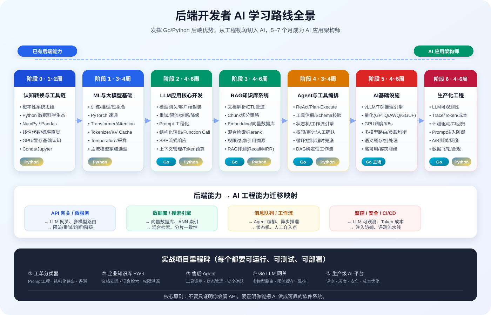
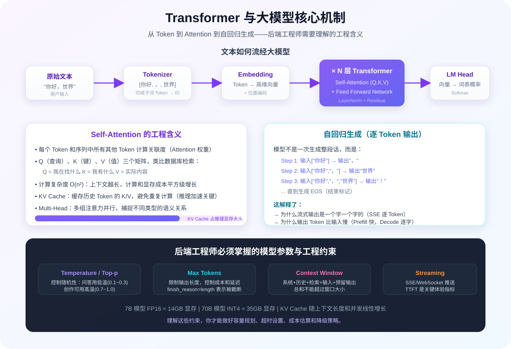
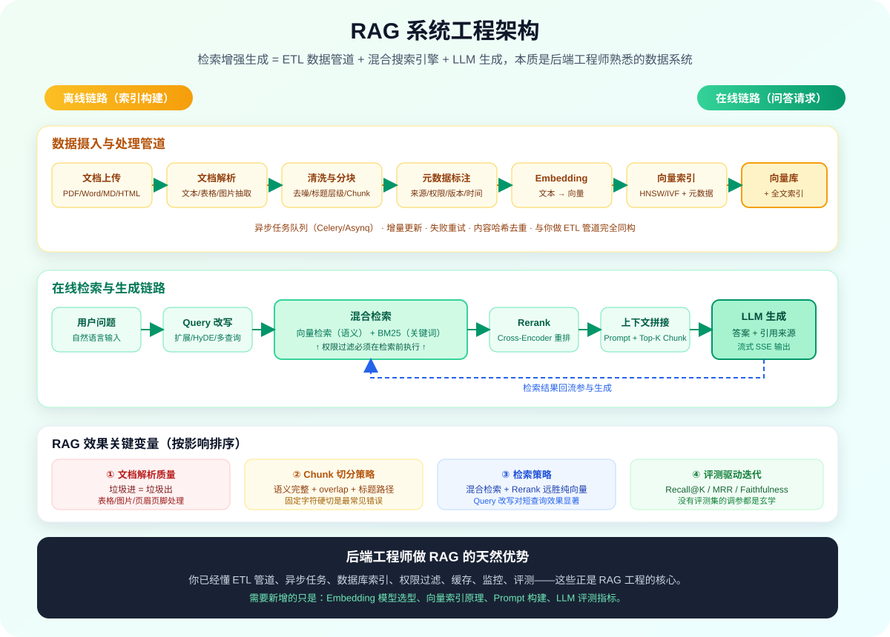
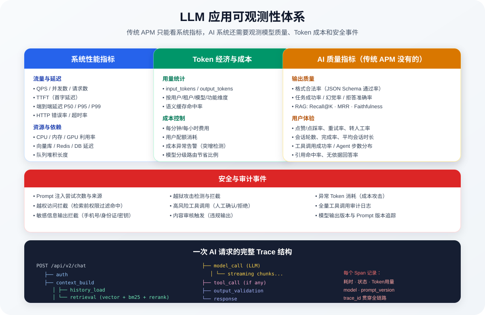
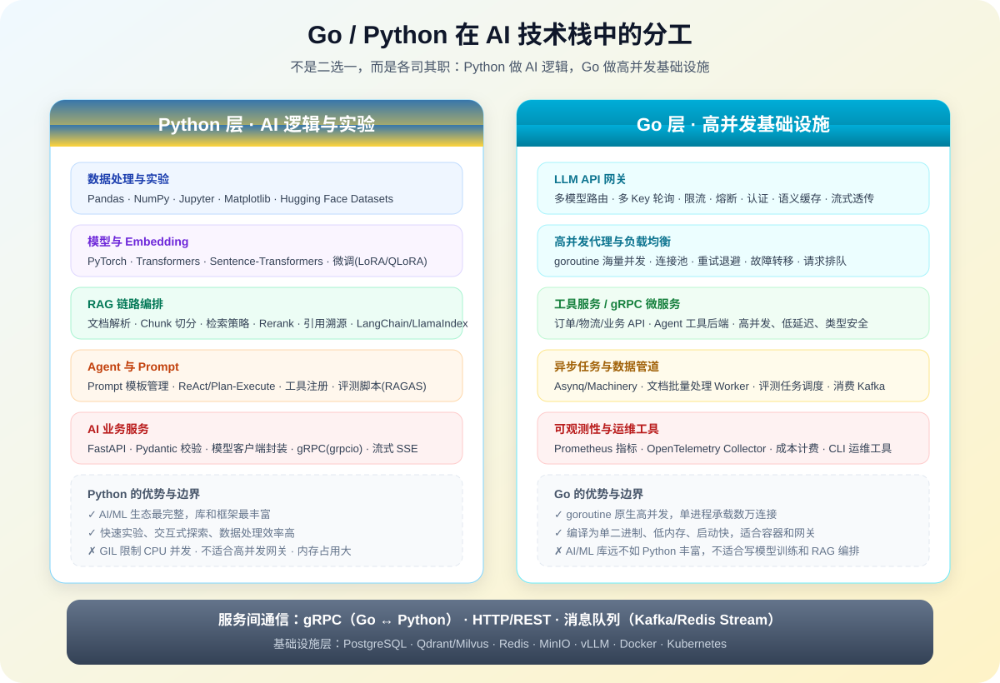

# 后端开发者的 AI 学习路线：从 Go/Python 工程师到 AI 应用架构师

## 写在前面：你不是从零开始

如果你是一名有经验的 Go/Python 后端开发者，你已经拥有转型 AI 工程最稀缺的底子：**设计可靠系统的能力**。

很多零基础路线会让你从 Python 语法、HTTP 协议、数据库开始学，但你已经跳过了这些。你需要的不是重新学编程，而是建立一张「后端能力 → AI 工程能力」的映射表，把已有的分布式、高并发、数据管道、可观测性经验迁移到 AI 系统中。

这条路线的核心逻辑是：

```text
你已经会的后端能力          →          AI 时代的新能力
─────────────────────────────────────────────────────
API 设计 / 网关             →          LLM 网关 / 模型路由
数据库 / 索引               →          向量数据库 / Embedding 检索
缓存 / 消息队列             →          语义缓存 / 异步推理管道
微服务编排 / 状态机         →          Agent 工作流 / 工具编排
监控 / 日志 / 追踪          →          LLM 可观测性 / Token 成本
安全 / 鉴权 / 审计          →          Prompt 注入防御 / AI 安全
CI/CD / 灰度发布            →          Prompt 版本 / 模型评测 / A/B
```



***

## 一、定位：后端工程师在 AI 时代的三种角色

不要把「学 AI」等同于「成为算法工程师」。对后端开发者来说，有三条高价值路径，按算法浓度从低到高排列：

| 角色                  | 核心职责                          | 算法要求     | 后端技能复用度 | 推荐优先级 |
| ------------------- | ----------------------------- | -------- | ------- | ----- |
| **AI 应用工程师**        | 用大模型 API + RAG + Agent 构建业务系统 | 理解概念即可   | 90%     | ⭐⭐⭐⭐⭐ |
| **AI 基础设施工程师**      | 模型网关、推理服务、向量库、GPU 调度          | 中等（系统优化） | 80%     | ⭐⭐⭐⭐  |
| **AI 平台/MLOps 工程师** | 训练平台、特征平台、评测平台、数据飞轮           | 中高       | 60%     | ⭐⭐⭐   |

这条路线主要覆盖前两种角色，也是后端开发者转型性价比最高的方向。如果你对模型训练和算法研究有强烈兴趣，可以在掌握工程链路后再向第三阶段深入。

**判断你是否走在正确的路上，看三个问题：**

1. 你能否把一个业务问题拆成「确定性代码 + 模型推理 + 数据检索」三部分，并说清楚每部分的边界？
2. 你能否设计一次 AI 请求的完整链路：入口、鉴权、上下文构建、检索、模型调用、工具执行、输出校验、日志、成本？
3. 当 AI 功能效果不好时，你能否通过评测、日志和实验定位问题出在 Prompt、检索、切分、模型还是数据，而不是靠「感觉」调参？

***

## 二、阶段 0：认知转换与工具链（1 \~ 2 周）

### 2.1 从确定性思维到概率性思维

后端开发习惯了「输入 A 必然输出 B」的确定性系统。大模型是概率性的——同样输入可能有不同输出，可能产生幻觉，可能格式错误。这不是 bug，而是模型的本质特性。

工程上的应对方式不是「让模型变确定」，而是用后端熟悉的手段兜底：

| 后端手段            | 在 AI 系统中的应用                       |
| --------------- | --------------------------------- |
| 输入校验（Validator） | Prompt 注入检测、敏感词过滤、参数 schema 校验    |
| 输出校验            | JSON Schema 校验、Pydantic 模型、业务规则检查 |
| 重试机制            | 格式错误自动重试、模型不可用切换备用模型              |
| 超时控制            | 模型调用、检索、工具执行分别设 timeout           |
| 降级兜底            | 模型不可用时返回模板答案、转人工、缓存命中             |
| 幂等设计            | Agent 工具调用幂等、写操作确认机制              |
| 断路器             | 模型服务商连续失败时熔断，保护整体系统               |

### 2.2 Python AI 工具链速通

你已经会 Python，但数据科学和 AI 生态有自己的工具集。不需要全部精通，先建立基本认知：

| 工具                  | 用途          | 学到什么程度                 |
| ------------------- | ----------- | ---------------------- |
| Conda / uv          | Python 环境管理 | 能创建隔离环境、安装包            |
| Jupyter Lab         | 交互式实验       | 能运行 Notebook、做数据探索     |
| NumPy               | 数值计算基础      | 理解 ndarray、广播、矩阵运算     |
| Pandas              | 数据处理        | 读取 CSV/JSON、过滤、聚合、基本分析 |
| Matplotlib / Plotly | 数据可视化       | 画折线图、柱状图、散点图           |
| Hugging Face Hub    | 模型和数据集仓库    | 能搜索模型、下载模型、看模型卡        |
| tqdm                | 进度条         | 简单循环显示进度               |

练习任务：用 Pandas 分析一个 CSV 数据集（比如客服对话记录），统计问题类型分布、平均响应长度，并用 Matplotlib 画图。

### 2.3 数学最小必要知识

不需要像算法工程师那样推导公式，但需要建立工程直觉。按需学习，用到再查：

| 数学领域 | 必须理解的概念             | 对工程的指导意义                          |
| ---- | ------------------- | --------------------------------- |
| 线性代数 | 向量、矩阵乘法、点积、余弦相似度、维度 | Embedding 是什么、向量检索为什么 work、高维诅咒   |
| 概率统计 | 概率分布、条件概率、贝叶斯、期望、采样 | Temperature/Top-p 的作用、模型评估、A/B 测试 |
| 微积分  | 导数、梯度、链式法则（概念层面）    | 反向传播是什么、梯度下降为什么能优化                |
| 信息论  | 熵、交叉熵、KL 散度（概念层面）   | 损失函数含义、困惑度指标                      |

**建议**：不要花一两个月刷数学书。先学线性代数的向量和矩阵部分（3 \~ 5 天），其他在后续阶段遇到时补。3Blue1Brown 的《线性代数的本质》视频系列是建立直觉的最佳材料。

### 2.4 GPU 基础认知

后端开发者大多熟悉 CPU 和内存，但 AI 离不开 GPU。不需要会写 CUDA 内核，但要理解约束：

| 概念                        | 工程含义                                       |
| ------------------------- | ------------------------------------------ |
| 显存（VRAM）                  | 模型参数、KV Cache、激活值都占显存，决定能跑多大模型             |
| FP32 / FP16 / BF16 / INT8 | 数值精度，精度越低显存占用越小、速度越快                       |
| KV Cache                  | Transformer 推理时缓存历史 Token 的 Key/Value，加速生成 |
| Batch Size                | 一次同时处理多少请求，影响吞吐量和延迟                        |
| CUDA                      | NVIDIA 的并行计算平台，大多数 AI 框架依赖它                |

***

## 三、阶段 1：机器学习与大模型基础（3 \~ 4 周）

### 3.1 机器学习核心概念

目标不是会调参训练模型，而是理解模型在做什么、为什么会出错、怎么评估好坏。

| 概念              | 工程视角的理解                            |
| --------------- | ---------------------------------- |
| 训练（Training）    | 用大量数据调整模型参数，让模型学会模式                |
| 推理（Inference）   | 训练好的模型接收输入、产生输出的过程                 |
| 监督学习            | 有标注数据的学习（分类、回归）                    |
| 过拟合 / 欠拟合       | 模型背了训练数据但泛化差 / 连训练数据都没学会           |
| 训练集 / 验证集 / 测试集 | 训练用、调参用、最终评估用，不能混用                 |
| 损失函数（Loss）      | 衡量模型预测和真实答案差距的数字                   |
| 梯度下降            | 根据 Loss 调整参数，让 Loss 变小             |
| 评估指标            | Accuracy、Precision、Recall、F1、AUC 等 |

用你熟悉的后端类比：

> 训练 ≈ 离线 ETL 任务跑批，推理 ≈ 在线服务处理请求。
> 过拟合 ≈ 服务只在测试环境正常，上线就挂。
> 验证集 ≈ 预发环境，测试集 ≈ 线上真实流量。

### 3.2 神经网络与深度学习直觉

必须掌握的最小知识集：

1. **感知机到神经网络**：多个神经元组合可以表示复杂函数。
2. **激活函数**（ReLU、Sigmoid、Softmax）：引入非线性，多分类概率输出。
3. **反向传播**：从输出层往回算梯度，更新每一层参数。
4. **深度学习为什么深**：层数越多，能表示的特征越抽象。
5. **常见网络结构**：CNN（图像）、RNN/LSTM（序列，已过时）、Transformer（当前主流）。

不需要从零手写神经网络。推荐用 PyTorch 跑一个官方的 MNIST 手写数字识别示例，理解「数据 → 模型 → 损失 → 反向传播 → 优化」的循环即可。

### 3.3 Transformer 架构精讲

这是大模型的基石，必须理解到能给同事讲清楚的程度：



| 组件                              | 作用                     | 工程含义                          |
| ------------------------------- | ---------------------- | ----------------------------- |
| Tokenizer                       | 把文本切分成 Token（子词单位）     | 中文/英文分词差异、Token 成本计算、特殊 Token |
| Embedding 层                     | 把每个 Token 映射成高维向量      | 语义相似的词向量接近                    |
| 位置编码（Positional Encoding）       | 告诉模型 Token 的顺序         | Transformer 本身不感知位置           |
| Self-Attention                  | 每个 Token 关注序列中其他 Token | 计算复杂度 O(n²)，长文本成本高            |
| Multi-Head Attention            | 多组注意力并行，捕捉不同关系         | 模型参数大头                        |
| Feed Forward Network            | 对每个位置独立做非线性变换          | 增加模型表达能力                      |
| LayerNorm / Residual Connection | 稳定训练、缓解梯度消失            | 深层网络必备                        |
| KV Cache                        | 缓存已计算的 Key/Value       | 推理加速的关键，占显存                   |

关键理解要点：

1. **自回归生成**：大模型一次生成一个 Token，把输出追加到输入再生成下一个，直到结束。这就是为什么流式输出是一个字一个字蹦的。
2. **上下文窗口**：Attention 能看到的最大 Token 数。超出需要截断或压缩。
3. **Temperature 和 Top-p**：控制采样随机性。Temperature 越低越确定（趋近贪心解码），越高越发散。
4. **预训练 + 微调**：预训练在海量文本上学语言能力，微调（SFT、RLHF、DPO）让模型学会对话和遵循指令。

### 3.4 主流大模型家族

建立对模型生态的基本认知：

| 模型系列             | 代表模型                            | 特点             | 接入方式            |
| ---------------- | ------------------------------- | -------------- | --------------- |
| OpenAI GPT       | GPT-4o、GPT-4 Turbo、o1           | 能力强、生态成熟、成本较高  | API             |
| Anthropic Claude | Claude 3.5 Sonnet、Claude 3 Opus | 长上下文、安全对齐好、代码强 | API             |
| Google Gemini    | Gemini 1.5 Pro/Flash            | 多模态强、长上下文      | API / Vertex AI |
| Meta LLaMA       | LLaMA 3.1 8B/70B/405B           | 开源、可商用、社区活跃    | 自部署 / 托管        |
| 阿里 Qwen          | Qwen2.5 系列                      | 中文好、尺寸全、开源     | API / 自部署       |
| DeepSeek         | DeepSeek-V3、DeepSeek-R1         | 推理能力强、开源、性价比高  | API / 自部署       |
| Mistral          | Mistral Large、Mixtral           | 欧洲代表、MoE 架构高效  | API / 自部署       |

选型时考虑维度：能力（任务匹配度）、成本（Token 价格）、延迟、上下文长度、数据合规（是否可出境）、部署方式（API vs 私有化）。

### 3.5 实战练习

1. 用 Hugging Face `transformers` 库在本地跑一个小模型（如 Qwen2.5-0.5B 或 GPT-2），观察文本生成。
2. 用 OpenAI SDK（或兼容 API）写一个脚本，对比不同 Temperature 下同一条 Prompt 的 20 次输出差异。
3. 手算：一个 7B 模型用 FP16 加载需要多少显存？（答案：约 14GB）

***

## 四、阶段 2：大模型应用开发核心（4 \~ 6 周）

这是后端开发者的主战场。你会发现大多数模式和你做后端服务高度同构。

### 4.1 LLM 客户端封装与模型网关

**不要在业务代码里到处直接调用厂商 SDK。** 这和你不会在每个 handler 里直接写数据库连接是一个道理。

必须封装统一的模型客户端，处理这些横切关注点：

```python
class ChatModel(ABC):
    @abstractmethod
    async def chat(
        self,
        messages: list[Message],
        *,
        temperature: float = 0.2,
        max_tokens: int | None = None,
        response_format: dict | None = None,
        tools: list[ToolSchema] | None = None,
    ) -> ChatResponse:
        ...

class ChatResponse:
    content: str
    tool_calls: list[ToolCall]
    usage: TokenUsage          # input_tokens, output_tokens
    finish_reason: str         # stop / length / tool_calls / content_filter
    model: str
    latency_ms: int
```

网关层必须处理：

| 能力     | 实现要点                              | 后端类比       |
| ------ | --------------------------------- | ---------- |
| 多供应商抽象 | 统一接口，OpenAI/Claude/国产模型可替换        | 数据库驱动抽象    |
| 超时控制   | connect timeout、read timeout 分别设置 | HTTP 客户端超时 |
| 重试策略   | 仅对可重试错误（429/5xx）重试，指数退避+抖动        | API 重试     |
| 限流     | 按用户、租户、模型维度做令牌桶/漏桶                | API 网关限流   |
| 熔断降级   | 供应商连续失败时切备用模型或返回降级响应              | 微服务熔断器     |
| 负载均衡   | 多 API Key 轮询、多供应商按权重路由            | L4/L7 负载均衡 |
| 成本统计   | 记录 input/output tokens、按模型计价      | 计费系统       |
| 日志脱敏   | 请求/响应日志中过滤手机号、身份证、密钥              | 数据安全       |
| 请求追踪   | 注入 trace\_id，贯穿 网关→检索→模型→工具       | 分布式追踪      |

Go 在这一层有天然优势：高并发、低内存、适合做网关。可以参考的开源项目：[one-api](https://github.com/songquanpeng/one-api)（Go 编写的 LLM 网关）。

### 4.2 Prompt 工程化

Prompt 不是写散文，而是像代码一样管理：

```text
Prompt 模板 = 角色 + 任务说明 + 上下文（变量注入） + 判断标准 + 输出格式 + 约束条件
```

Prompt 管理规范（和你管理配置/代码一样）：

| 要求   | 具体做法                                  |
| ---- | ------------------------------------- |
| 版本化  | 每个 Prompt 有版本号，变更记录写清楚改了什么            |
| 参数化  | 业务变量通过 `{{variable}}` 注入，不手动拼接字符串     |
| 可测试  | 每个 Prompt 有测试样例集，改完跑回归                |
| 可回滚  | 新版本效果差时能切回旧版（和灰度发布一样）                 |
| 可观测  | 日志记录 prompt\_version、model\_name、输出质量 |
| 环境隔离 | 开发/测试/生产用不同 Prompt，和配置管理同理            |

进阶技巧：

| 技巧                            | 适用场景                           |
| ----------------------------- | ------------------------------ |
| Few-shot                      | 给模型 2 \~ 5 个示例，比纯指令更能稳定格式和判断标准 |
| Chain-of-Thought              | 让模型先推理再给结论，适合数学、逻辑、复杂判断        |
| Self-Consistency              | 多次采样取多数结果，提高可靠性（成本翻倍）          |
| Structured Output / JSON Mode | 强制输出可解析 JSON，配合 schema 校验      |
| System Prompt 隔离              | 系统指令和用户输入物理隔离，降低注入风险           |

### 4.3 结构化输出与 Function Calling

这是把 LLM 接入业务系统的关键桥梁。模型负责「理解意图和生成参数」，代码负责「执行真实动作」。

Function Calling 的安全模型（**极其重要**）：

```text
用户输入 → 模型判断调用哪个工具、生成参数
                                    ↓
                          代码层做参数校验（Pydantic）
                                    ↓
                          权限检查（user_id/tenant_id 强制注入）
                                    ↓
                          高风险操作 → 人工确认
                                    ↓
                          执行真实动作（数据库/API/文件）
                                    ↓
                          结果返回给模型 → 模型组织自然语言回复
```

工具设计原则：

1. **工具粒度细且明确**：一个工具做一件事，有清晰的 description。
2. **绝对不要暴露万能工具**：`run_sql`、`execute_command` 这类工具是安全灾难。
3. **权限不能由模型决定**：`user_id`、`tenant_id` 必须由代码从鉴权上下文注入，不能让模型生成。
4. **参数必须校验**：用 Pydantic/JSON Schema 校验模型生成的参数。
5. **写操作要幂等且可审计**：所有工具调用记录日志，高风险动作需要二次确认。

### 4.4 流式响应与实时交互

大模型生成是逐 Token 的，流式响应能大幅降低首字延迟（TTFT, Time To First Token）：

| 技术                       | 适用场景                    | 后端实现要点                                      |
| ------------------------ | ----------------------- | ------------------------------------------- |
| SSE (Server-Sent Events) | 单向流式输出（聊天机器人）           | 设置 `Content-Type: text/event-stream`、处理断连重试 |
| WebSocket                | 双向实时通信（语音对话、Agent 过程推送） | 连接管理、心跳、消息顺序                                |
| 分块传输 (Chunked)           | 文件流式处理、简单流式             | HTTP/1.1 chunked encoding                   |

注意事项：

- 流式响应中无法提前知道最终 Token 数，需要在结束时统计。
- 错误处理：流中途出错要发送错误事件，不能直接断开。
- 代理/网关层需关闭响应缓冲，否则流不起来（Nginx `proxy_buffering off`）。

### 4.5 上下文工程

上下文窗口是稀缺资源，需要像管理内存一样管理：

```text
系统 Prompt（角色、规则、格式）
  + 对话历史（最近 N 轮 + 摘要压缩）
  + 检索到的知识片段（RAG）
  + 工具定义和工具返回结果
  + 当前用户输入
  ─────────────────────────
  ≤ 模型上下文窗口 - 预留输出 Token
```

上下文管理策略：

1. **滑动窗口**：只保留最近 N 轮对话。
2. **摘要压缩**：对较早的对话用模型生成摘要，替换原始消息。
3. **相关性过滤**：用 Embedding 检索历史中最相关的片段，而非全量保留。
4. **Token 预算**：给每部分分配预算（系统 10%、历史 20%、检索 50%、输入 10%、输出预留 10%），超出按优先级裁剪。

### 4.6 实战项目：智能工单分类与路由系统

用你熟悉的方式构建一个完整的服务：

**技术栈**：

- Python（FastAPI）做模型调用和业务逻辑
- Go（Gin）做高并发 API 网关和限流（可选，也可以纯 Python）
- PostgreSQL 存工单和分类结果
- Redis 做缓存和限流

**功能要求**：

1. 用户提交工单文本，模型判断分类（售前/售后/投诉/技术问题）、紧急程度、是否需要人工。
2. 输出结构化 JSON，后端用 Pydantic 校验，不合法自动重试一次。
3. 封装模型客户端，支持超时、重试、成本统计。
4. 准备 100 条测试工单，统计分类准确率、格式合法率、平均延迟、Token 成本。
5. 支持流式输出分类过程（展示模型思考步骤）。
6. 提供管理接口查看调用日志和指标。

***

## 五、阶段 3：RAG 知识库系统工程（4 \~ 6 周）

RAG 是 AI 应用工程师最核心的工程能力。它本质上是一个**带语义检索的 ETL + 搜索系统**——后端开发者做这个有天然优势。



### 5.1 RAG 全链路理解

```text
离线链路（索引构建）：
文档上传 → 文档解析 → 文本清洗 → 元数据提取 → Chunk 切分 → Embedding → 向量索引
                                                                          ↓
在线链路（问答）：                                                                    ├─→ 向量数据库
用户问题 → Query 改写/扩展 → Embedding → 混合检索（向量 + BM25） → Rerank → 上下文拼接 → LLM 生成 → 引用溯源
```

### 5.2 文档处理管道

这部分和你做数据 ETL 管道没有本质区别：

| 环节       | 关键点                                | 常用工具                                                      |
| -------- | ---------------------------------- | --------------------------------------------------------- |
| 文档解析     | PDF/Word/HTML/Markdown/Excel 文本抽取  | PyMuPDF、python-docx、BeautifulSoup、Unstructured、MarkItDown |
| 文本清洗     | 去页眉页脚、去乱码、保留标题层级、表格处理              | 正则、自定义规则                                                  |
| 元数据提取    | 文件 ID、标题、章节路径、页码、权限标签、更新时间         | 代码提取 + LLM 辅助                                             |
| Chunk 切分 | 按标题/段落/语义切分，保留 overlap，控制 Token 长度 | LangChain TextSplitter、LlamaIndex NodeParser              |
| 增量更新     | 文档变更只重建受影响的 chunk，不全量重刷            | 内容哈希、版本号                                                  |

Chunk 设计是 RAG 效果的关键变量之一：

1. 每个 chunk 要能独立表达完整语义，不要硬按字符数切。
2. 保留标题路径（如「产品手册 > 计费规则 > 退款」），帮助模型理解上下文。
3. overlap 一般 10% \~ 20%，过大会导致召回重复，过小会丢失边界信息。
4. 表格和代码块不要切断，整体作为一个 chunk。
5. 每个 chunk 必须带 source（文件、页码、章节），用于引用溯源。

### 5.3 Embedding 与向量数据库

| 方向           | 知识点                                                 |
| ------------ | --------------------------------------------------- |
| Embedding 模型 | 通用模型（bge-large-zh、text-embedding-3）、领域模型、多语言模型、维度选择 |
| 相似度计算        | Cosine（最常用）、Dot Product、Euclidean 的区别               |
| 向量索引         | HNSW（图索引，查询快内存大）、IVF（聚类，需训练）、Flat（暴力精确，小数据用）        |
| 元数据过滤        | tenant\_id、user\_id、doc\_id、权限标签等标量过滤               |
| 分布式          | 分片（Sharding）、副本（Replica）、一致性——和你理解的分布式数据库一样         |

向量数据库选型：

| 数据库           | 特点                         | 适用场景           |
| ------------- | -------------------------- | -------------- |
| pgvector      | PostgreSQL 扩展，和业务库在一起，运维简单 | 中小项目、已有 PG 技术栈 |
| Qdrant        | Rust 写的，性能好，支持过滤，云原生       | 中大型项目，需要丰富过滤   |
| Milvus        | 分布式架构，支持海量数据，生态成熟          | 大规模生产环境        |
| Weaviate      | 内置混合搜索、多模态                 | 需要一体化方案        |
| Chroma        | 轻量嵌入式，开发体验好                | 本地开发、原型        |
| Elasticsearch | 8.x 支持向量检索，同时有全文检索         | 已有 ES 栈，需要混合检索 |

**后端视角的关键理解**：向量库不是魔法，它就是一种支持「近似最近邻（ANN）」查询的数据库。你对索引、分片、副本、一致性、备份的理解全部适用。

### 5.4 检索策略进阶

只做纯向量检索在生产环境通常不够：

| 策略                     | 解决的问题                                                     |
| ---------------------- | --------------------------------------------------------- |
| 混合检索（Hybrid Search）    | 向量检索擅长语义匹配，BM25 擅长精确关键词（编号、专有名词、错误码），两者结合                 |
| Query Rewrite          | 用户问题太短或口语化时，用 LLM 改写成更适合检索的形式                             |
| Multi-Query            | 生成多个等价查询，并行检索后合并结果，扩大召回                                   |
| HyDE                   | 先让模型生成一个假设答案，用假设答案去检索（比原始问题更接近文档语言）                       |
| Rerank                 | 粗召回 20 \~ 50 条，用 Cross-Encoder 重排序取 Top 5 \~ 10，大幅提升上下文质量 |
| Metadata Filter        | 检索前按租户、权限、时间、文档类型过滤，**权限必须先过滤再召回**                        |
| Parent-Child Retrieval | 检索小块返回，给模型大块上下文，兼顾精度和完整性                                  |

### 5.5 RAG 评测体系

没有评测就没有优化。RAG 评测分两层：

**检索层评测**（不经过 LLM，单独评估检索质量）：

| 指标                         | 含义              | 合格参考线 |
| -------------------------- | --------------- | ----- |
| Recall\@K                  | 正确文档是否在前 K 条被召回 | ≥ 85% |
| MRR (Mean Reciprocal Rank) | 正确结果排得是否靠前      | ≥ 0.6 |
| Precision\@K               | 召回的前 K 条有多少是相关的 | ≥ 0.7 |
| NDCG\@K                    | 考虑排序位置的相关性指标    | ≥ 0.7 |

**生成层评测**（检索到的上下文 + LLM 生成的答案）：

| 指标                | 含义                 | 工具            |
| ----------------- | ------------------ | ------------- |
| Faithfulness（忠实度） | 答案是否忠于检索到的上下文，是否幻觉 | RAGAS、TruLens |
| Answer Relevancy  | 答案是否切题             | RAGAS         |
| Context Precision | 召回的上下文是否干净、相关      | RAGAS         |
| Citation Accuracy | 引用的来源是否真的支持答案      | 自研脚本          |
| 拒答准确率             | 知识中没有答案时是否正确拒答     | 自研评测集         |

评测集构建方法：

1. 从真实用户问题中抽样 50 \~ 200 条。
2. 人工标注：每条问题对应的标准文档片段、标准答案。
3. 覆盖：正常问题、模糊问题、多跳问题、越权问题、无答案问题、恶意问题。
4. 每次改 Prompt、切分策略、Embedding 模型、检索参数都跑一遍评测。
5. 保存每次结果，形成对比表——和后端做性能基准测试一个道理。

### 5.6 实战项目：企业级知识库问答系统

**技术栈**：

- Python（FastAPI）：RAG 链路、模型调用
- Go：文档上传服务、API 网关（可选）
- PostgreSQL + pgvector（入门）或 Qdrant（进阶）
- Redis：缓存、限流
- MinIO/S3：原始文件存储
- Celery/RQ：异步文档解析和索引任务

**必做功能**：

1. 上传 Markdown/PDF/Word，自动解析、清洗、切分、向量化。
2. 支持混合检索（向量 + BM25）和 Rerank。
3. 问答返回答案、引用片段、来源文件和章节。
4. 基于 `tenant_id` / `user_id` 的权限过滤（越权召回必须为 0）。
5. 检索调试页面：展示 Query、改写结果、召回 chunk、分数、Rerank 结果。
6. 评测脚本：输入评测集，输出召回率、忠实度、引用命中率、延迟、成本。
7. 文档增量更新。

***

## 六、阶段 4：Agent 与工具编排（3 \~ 4 周）

### 6.1 Agent 的本质

Agent 不是让模型「自由思考」，而是**在受控边界内，让模型做决策（选工具、填参数），由代码执行动作，并根据结果继续循环**。

```text
用户目标
  ↓
任务理解 → 计划生成（可选）
  ↓
┌─────────────────────────────┐
│  思考 → 选择工具 → 生成参数  │  ← LLM 负责
│  代码校验 → 权限检查 → 执行  │  ← 你的代码负责
│  观察结果 → 判断继续或结束   │
└─────────────────────────────┘
  ↓ (最多 N 步，超时 T 秒)
最终回复
```

后端开发者做 Agent 有天然优势，因为 Agent 本质上是一个**状态机 + 工作流引擎 + 工具 RPC 框架**。

### 6.2 Agent 架构模式

| 模式               | 工作方式                                        | 适用场景            |
| ---------------- | ------------------------------------------- | --------------- |
| ReAct            | Thought → Action → Observation 循环，边想边做      | 简单任务、工具少        |
| Plan-and-Execute | 先制定完整计划，再逐步执行                               | 复杂多步任务          |
| Router/Selector  | 分类后路由到不同子链或 Agent                           | 多意图分发           |
| Multi-Agent      | 多个 Agent 分工协作（如 Planner + Coder + Reviewer） | 复杂工作流，注意成本和延迟   |
| DAG 工作流          | 预定义节点和边，确定性流程                               | **生产环境首选**，可控可测 |

**重要建议**：生产环境优先用确定性 DAG 工作流，而非完全自主的 Agent。能用 if-else 和流程图解决的问题，不要交给 Agent 自由发挥。Agent 只用于真正需要动态决策的环节。

### 6.3 工具系统设计

工具注册和管理和你设计 RPC 接口一样：

```python
@tool(
    name="query_order",
    description="根据订单号查询订单状态和物流信息",
    risk_level="low",
)
async def query_order(order_id: str, ctx: RequestContext) -> OrderInfo:
    # ctx.user_id 从鉴权上下文获取，不能由模型传入
    order = await order_repo.get_by_id_and_user(order_id, ctx.user_id)
    if order is None:
        raise ToolError("订单不存在或无权查看")
    return order
```

工具安全清单：

| 风险    | 控制措施                                      |
| ----- | ----------------------------------------- |
| 越权访问  | user\_id/tenant\_id 强制从上下文注入，工具定义中不暴露这些参数 |
| 参数伪造  | Pydantic/JSON Schema 严格校验，拒绝模型生成的额外参数     |
| 高风险操作 | 删除、退款、改地址等需要人工确认（Human-in-the-loop）       |
| 无限循环  | max\_steps 限制、总超时、连续相同调用检测                |
| 提示注入  | 工具返回结果和系统指令隔离，工具结果中包裹明确边界标记               |
| 数据泄露  | 工具返回前脱敏，模型输出前敏感词检测                        |
| 成本失控  | 限制每会话最大工具调用次数和 Token 消耗                   |

### 6.4 状态管理与持久化

Agent 是多步的，状态管理至关重要：

1. **会话状态**：当前消息列表、已执行步骤、中间结果——存 Redis 或数据库。
2. **检查点（Checkpoint）**：长时间运行的 Agent 支持中断后恢复（类似工作流引擎的持久化）。
3. **幂等执行**：工具调用带唯一 ID，重试不重复执行写操作。
4. **人工介入点**：在需要确认的节点暂停，等待外部信号后继续。

### 6.5 实战项目：智能售后 Agent

**功能要求**：

1. 用户自然语言描述问题（如「订单 A123 为什么没发货」）。
2. Agent 调用订单查询、物流查询等工具获取信息。
3. 模型生成解释和解决方案。
4. 退款、改地址等高风险操作进入人工确认队列。
5. 全链路记录：每步思考、工具调用、参数、返回、耗时、Token。
6. 限制最多执行 8 步，总超时 60 秒。
7. 工具失败时有兜底话术，不暴露内部错误。

***

## 七、阶段 5：AI 基础设施与模型服务（4 \~ 6 周）

这是 Go 开发者最有竞争力的领域。AI 基础设施需要高并发、低延迟、资源调度——正是 Go 的主场。

### 7.1 模型部署方式对比

| 方式          | 优点                  | 缺点                | 适用场景      |
| ----------- | ------------------- | ----------------- | --------- |
| 公有云 API     | 简单、免运维、自动更新         | 成本高、数据出境风险、受限于供应商 | 初创、快速验证   |
| 私有化部署（开源模型） | 数据可控、长期成本低、可定制      | 需要 GPU、运维复杂、模型更新慢 | 企业内网、数据敏感 |
| 混合部署        | 敏感任务走私有模型，通用任务走 API | 架构复杂、需要路由层        | 中大型企业     |

### 7.2 推理引擎

| 引擎                              | 语言          | 特点                            | 适用场景            |
| ------------------------------- | ----------- | ----------------------------- | --------------- |
| vLLM                            | Python/C++  | PagedAttention、高吞吐、连续批处理、开源主流 | 生产级 LLM 服务      |
| TGI (Text Generation Inference) | Python/Rust | Hugging Face 官方、生态好           | HF 生态用户         |
| TensorRT-LLM                    | C++         | NVIDIA 官方、极致性能                | NVIDIA GPU 极致优化 |
| llama.cpp                       | C/C++       | CPU/端侧推理、GGUF 量化              | 本地、Mac、边缘设备     |
| Ollama                          | Go          | 一行命令跑模型、开发体验好                 | 本地开发、原型         |
| SGLang                          | Python      | 高性能、结构化生成优化                   | 需要快速结构化输出       |

**后端需要理解的关键概念**：

1. **连续批处理（Continuous Batching）**：不像传统批处理等整批完成，而是请求级动态加入和退出，大幅提升 GPU 利用率。
2. **PagedAttention**：vLLM 的核心技术，像操作系统管理虚拟内存一样管理 KV Cache，减少碎片。
3. **Prefill vs Decode**：Prefill 阶段处理输入 Prompt（计算密集型），Decode 阶段逐 Token 生成（内存带宽密集型），两阶段特性不同。
4. **投机解码（Speculative Decoding）**：用小模型快速生成草稿，大模型验证，加速推理。

### 7.3 模型量化

量化是降低模型显存和推理成本的关键手段：

| 精度              | 显存占用（7B 模型）   | 质量损失 | 说明                  |
| --------------- | ------------- | ---- | ------------------- |
| FP32            | \~28 GB       | 基准   | 训练用，推理几乎不用          |
| FP16/BF16       | \~14 GB       | 无损失  | 推理标准精度              |
| INT8            | \~7 GB        | 极小   | 常用生产精度              |
| INT4 (GPTQ/AWQ) | \~3.5 \~ 5 GB | 较小   | 大模型性价比之选            |
| GGUF (Q4\_K\_M) | \~4 GB        | 较小   | llama.cpp 生态，CPU 友好 |

选型建议：7B \~ 14B 模型用 INT4/AWQ 量化在单卡 24GB（如 3090/4090）上跑得很好；70B 模型需要多卡或 INT4。

### 7.4 GPU 调度与 K8s

如果需要自建模型服务，要了解：

1. **NVIDIA GPU Operator**：K8s 中管理 GPU 驱动和设备插件。
2. **GPU 共享**：MPS、MIG、vGPU 等技术让多个模型共享一张卡。
3. **节点池管理**：GPU 节点打污点和容忍，调度器按显存/GPU数分配。
4. **弹性伸缩**：根据队列长度和 GPU 利用率扩缩容——但 GPU 启动慢（模型加载几十秒到几分钟），需要预热。
5. **Spot GPU**：竞价实例便宜 70%，但可能被回收，需要容错和检查点。

### 7.5 Go 在 AI 基础设施中的应用

Go 不适合写模型训练代码，但极其适合写 AI 周边基础设施：

| 组件             | 为什么用 Go                    | 开源参考                           |
| -------------- | -------------------------- | ------------------------------ |
| LLM API 网关     | 高并发、低延迟、goroutine 处理海量并发连接 | one-api、Kong AI Gateway        |
| 向量数据库          | 性能关键型系统                    | Qdrant（Rust，但 Go 客户端完善）        |
| 模型代理/负载均衡      | 网络代理、连接池、重试                | <br />                         |
| 异步任务调度         | 文档处理、批量评测的 Worker          | Asynq、Machinery                |
| gRPC 微服务       | Agent 工具服务、内部服务间通信         | <br />                         |
| 可观测性 Collector | 日志/Trace/Metric 收集处理       | OpenTelemetry Collector（Go 编写） |

推荐的混合架构：

```text
┌─────────────────────────────────────────────┐
│              Go 服务（基础设施层）             │
│  API 网关 · 鉴权限流 · 路由 · 缓存 · 队列     │
└──────────────────┬──────────────────────────┘
                   │ gRPC / HTTP
┌──────────────────▼──────────────────────────┐
│           Python 服务（AI 逻辑层）            │
│  RAG 编排 · Agent · Prompt · 模型调用        │
└──────────────────┬──────────────────────────┘
                   │
┌──────────────────▼──────────────────────────┐
│           数据与模型层                        │
│  向量库 · PostgreSQL · Redis · vLLM · 对象存储 │
└─────────────────────────────────────────────┘
```

### 7.6 实战项目：多模型 LLM 网关

用 Go 实现一个生产级 LLM 网关（参考 one-api 但自己写核心逻辑）：

1. 统一 OpenAI 兼容 API，后端可路由到 OpenAI、Claude、国产模型、本地 vLLM。
2. 多 API Key 管理和轮询，按 Key 维度限流。
3. 按用户/租户维度的 Token 配额和计费。
4. 语义缓存：相似问题命中缓存直接返回（用 Embedding 相似度判断）。
5. 支持流式透传。
6. Prometheus 指标：QPS、延迟 P99、Token 消耗、错误率、缓存命中率。
7. 熔断和故障转移。

***

## 八、阶段 6：生产级 AI 系统工程（4 \~ 6 周）

### 8.1 LLM 可观测性

传统 APM 不够用了。你需要同时观测「系统指标」和「AI 质量指标」：



| 维度       | 指标                             | 工具                      |
| -------- | ------------------------------ | ----------------------- |
| 系统性能     | QPS、TTFT、端到端延迟 P50/P95/P99、错误率 | Prometheus、Grafana      |
| Token 经济 | input/output tokens、成本、缓存命中率   | 自研计费、OpenTelemetry      |
| 模型质量     | 格式合法率、幻觉率、任务成功率、拒答准确率          | LangSmith、Phoenix、RAGAS |
| 用户体验     | 点赞/点踩率、会话长度、重试率、转人工率           | 自研埋点                    |
| 安全       | 注入攻击次数、敏感信息拦截数、越权尝试            | 自研审计                    |

Trace 设计：一次 AI 请求的 Trace 应该包含这些 Span：

```text
POST /api/chat
  ├── auth (鉴权)
  ├── context_build (上下文构建)
  │     ├── history_load
  │     └── retrieval
  │           ├── query_rewrite (LLM)
  │           ├── vector_search
  │           ├── bm25_search
  │           └── rerank (LLM)
  ├── model_call (LLM)
  │     └── streaming chunks...
  ├── tool_call (如果有)
  ├── output_validation
  └── response
```

### 8.2 评测驱动开发

AI 应用最忌讳「改了 Prompt 感觉好了就上线」。必须像后端写测试一样建立评测体系：

1. **离线评测集**：50 \~ 500 条标注数据，覆盖核心场景和边界情况。
2. **CI 集成**：Prompt/模型/检索策略变更自动跑评测，低于阈值阻断发布。
3. **在线 A/B 测试**：新版本小流量，对比核心指标（成功率、延迟、成本、满意度）。
4. **回归测试**：每次发版前跑全量评测，确保旧能力不退化。
5. **数据飞轮**：收集线上 bad case，人工标注后加入评测集，持续迭代。

### 8.3 安全与合规

AI 系统的安全面比传统后端更大：

| 威胁               | 描述                         | 防御措施                      |
| ---------------- | -------------------------- | ------------------------- |
| Prompt Injection | 用户/文档中注入恶意指令，绕过系统 Prompt   | 指令隔离、输入标记、输出校验、最小权限工具     |
| 数据泄露             | 模型输出了其他租户的私有数据             | 检索前强制权限过滤、输出脱敏、审计日志       |
| 幻觉               | 模型编造事实（订单状态、政策条款）          | RAG 引用溯源、无依据拒答、关键字段走确定性系统 |
| 工具滥用             | 模型被诱导调用删除/退款等危险工具          | 工具白名单、参数校验、高风险人工确认        |
| 成本攻击             | 攻击者用长 Prompt 或循环调用消耗 Token | 限流、Token 上限、用户配额、异常检测     |
| 越狱（Jailbreak）    | 通过角色扮演等方式绕过安全对齐            | 输入检测、多层防御、输出审核            |
| 训练数据投毒           | 恶意文档进入知识库影响输出              | 文档来源审核、内容审核、版本回滚          |

安全底线（和你做后端安全的原则一致）：

1. **模型不能决定权限**——权限由代码基于鉴权上下文判断。
2. **模型不能直接执行写操作**——必须经过业务校验，高风险需人工确认。
3. **检索必须先过滤权限再召回**——不能先召回再过滤（可能通过侧信道泄露）。
4. **所有工具调用和模型输出可审计**——日志不可篡改。
5. **不信任模型的任何输出**——输出给用户前做业务规则校验和敏感信息过滤。

### 8.4 成本优化

LLM 调用成本可能是传统 API 的百倍，成本意识至关重要：

| 手段             | 做法                                       | 节省幅度       |
| -------------- | ---------------------------------------- | ---------- |
| 模型分级           | 简单任务用小模型/便宜模型，复杂任务才用 GPT-4               | 30% \~ 70% |
| Prompt 压缩      | 精简系统 Prompt、压缩历史、去除冗余上下文                 | 20% \~ 50% |
| 语义缓存           | 相似问题命中缓存，不调用模型                           | 视命中率而定     |
| Embedding 缓存   | 相同文本不重复 Embedding                        | 显著         |
| 批处理（Batch API） | 非实时任务用批量 API，价格通常低 50%                   | 50%        |
| 自部署开源模型        | 高频任务私有化，按量成本远低于 API                      | 长期大幅降低     |
| 输出 Token 控制    | 设 max\_tokens、用 stop sequences、简洁 Prompt | 10% \~ 30% |

### 8.5 高可用与容灾

| 模式     | 做法                            |
| ------ | ----------------------------- |
| 多供应商冗余 | 主供应商故障自动切备用，和数据库主从切换同理        |
| 降级策略   | LLM 不可用时返回缓存结果、模板答案、或转人工      |
| 异步化    | 非实时任务（文档索引、批量评测）走消息队列，削峰填谷    |
| 限流保护   | 多维度限流保护模型服务和下游系统不被打垮          |
| 幂等重试   | 网络超时重试要确保写操作幂等                |
| 容量规划   | 根据 GPU 显存、并发数、平均 Token 长度规划容量 |

***

## 九、Go/Python 技术栈选型指南



### 9.1 什么时候用 Python

Python 是 AI 领域的通用语，生态最成熟：

- 数据处理和实验（Pandas、NumPy、Jupyter）
- RAG 链路编排和 Prompt 管理
- 调用 Hugging Face 模型、Embedding 模型
- Agent 逻辑和工具编排
- 模型微调（PyTorch、Transformers、PEFT）
- 评测脚本和数据分析

### 9.2 什么时候用 Go

Go 在系统工程层面有不可替代的优势：

- 高并发 API 网关和代理
- 模型服务的负载均衡和路由
- 高性能数据管道（文档解析 Worker、批量任务）
- gRPC 微服务（工具服务、内部服务）
- 基础设施 Operator 和 Controller
- CLI 工具（运维工具、批量处理脚本）
- 对延迟要求极高的中间层

### 9.3 推荐混合架构

```text
客户端（Web/App/IM）
    ↓
Go API 网关（鉴权、限流、路由、日志、缓存）
    ↓
┌──────────────┬──────────────┬──────────────┐
│ Python RAG   │ Python Agent │ Go 工具服务   │
│ 服务          │ 服务          │ (订单/物流等) │
└──────┬───────┴──────┬───────┴──────┬───────┘
       │              │              │
       ▼              ▼              ▼
   向量数据库     模型服务(vLLM)   业务数据库
   (Qdrant)      /外部 API        (PostgreSQL)
```

服务间用 gRPC 通信，Python 服务可以用 `grpcio`，Go 服务用原生 `google.golang.org/grpc`。

***

## 十、学习节奏与里程碑

总周期约 **5 \~ 7 个月**（业余时间每天 1 \~ 2 小时，周末多一些）。你有后端基础，前两个阶段可以加速。

### 第 1 \~ 2 周：工具链与认知转换

- [ ] 搭建 Conda + Jupyter 开发环境
- [ ] 学会 NumPy/Pandas 基本操作
- [ ] 理解向量、矩阵乘法、余弦相似度
- [ ] 跑通第一个本地小模型
- [ ] 跑通第一个 OpenAI API 调用

### 第 3 \~ 6 周：ML 基础与大模型原理

- [ ] 理解机器学习核心概念（训练/推理/过拟合/评估）
- [ ] 用 PyTorch 跑通 MNIST 示例
- [ ] 能讲清楚 Transformer 的 Attention 机制
- [ ] 理解 Token、KV Cache、Temperature、上下文窗口
- [ ] 了解主流模型家族和选型维度

### 第 7 \~ 12 周：大模型应用开发

- [ ] 封装统一的 LLM 客户端（超时、重试、限流、成本统计）
- [ ] 实现结构化输出和 schema 校验
- [ ] 实现 Function Calling 和工具执行安全框架
- [ ] 实现 SSE 流式响应
- [ ] 完成工单分类器项目，含评测报告

### 第 13 \~ 18 周：RAG 知识库

- [ ] 实现文档解析、清洗、切分管道
- [ ] 接入 Embedding 模型和向量数据库
- [ ] 实现混合检索和 Rerank
- [ ] 实现引用溯源和权限过滤
- [ ] 建立 RAG 评测集，输出评测报告
- [ ] 完成企业知识库项目

### 第 19 \~ 22 周：Agent 系统

- [ ] 实现 ReAct Agent 循环
- [ ] 实现工具注册、校验、权限控制
- [ ] 实现人工确认和状态持久化
- [x] 完成售后 Agent 项目

### 第 23 \~ 28 周：基础设施与生产化

- [ ] 用 Go 实现 LLM 网关（多模型路由、限流、缓存、监控）
- [ ] 部署一个开源模型（vLLM/Ollama），理解推理参数
- [ ] 接入 Prometheus + Grafana 监控
- [ ] 实现 CI 评测流水线
- [ ] 完成安全审计清单

***

## 十一、推荐学习资源

### 11.1 系统性课程

| 资源                                                                                                                          | 类型    | 说明                        |
| --------------------------------------------------------------------------------------------------------------------------- | ----- | ------------------------- |
| [Andrej Karpathy - Neural Networks: Zero to Hero](https://www.youtube.com/playlist?list=PLAqhIrjkxbuWI23v9cThsA9GvCAUhRvKZ) | 视频    | 从零理解神经网络，质量极高，按需看         |
| [3Blue1Brown 线性代数的本质](https://www.bilibili.com/video/BV1ys411472E)                                                          | 视频    | 建立线性代数直觉，3 \~ 4 小时        |
| [Hugging Face 课程](https://huggingface.co/learn)                                                                             | 文档/互动 | NLP 和 Transformer 入门，有中文版 |
| [FastAPI 官方文档](https://fastapi.tiangolo.com/)                                                                               | 文档    | 你应该很快能上手                  |
| [LangChain 文档](https://python.langchain.com/)                                                                               | 文档    | **先理解原理再用框架**，不要一上来就依赖    |

### 11.2 必读论文（选读，按需）

| 论文                                                               | 为什么读                    |
| ---------------------------------------------------------------- | ----------------------- |
| Attention Is All You Need                                        | Transformer 原始论文，了解架构起源 |
| BERT: Pre-training of Deep Bidirectional Transformers            | 理解双向预训练                 |
| InstructGPT / RLHF 论文                                            | 理解指令微调                  |
| Retrieval-Augmented Generation for Knowledge-Intensive NLP Tasks | RAG 原始论文                |
| ReAct: Synergizing Reasoning and Acting in Language Models       | Agent 基础范式              |
| vLLM: Efficient Memory Management for LLM Serving                | 理解推理服务优化                |

不建议一开始硬啃论文。先建立工程认知，遇到需要深入理解原理时再回来读。

### 11.3 高质量信息源

- **Hugging Face Blog**：模型发布和技术解读
- **OpenAI Cookbook / Anthropic Docs**：官方最佳实践
- **Lilian Weng 的博客**：高质量 AI 技术综述
- **Latent Space Podcast**：AI 工程实践访谈
- **Papers With Code**：论文 + 代码 + 排行榜

***

## 十二、常见误区

| 误区                         | 正确认知                                              |
| -------------------------- | ------------------------------------------------- |
| 「我得先把数学和算法学透才能学 AI」        | 后端工程师走应用路线，先学工程链路，数学按需补                           |
| 「会调 OpenAI API 就是 AI 工程师了」 | API 调用只是起点，网关、评测、RAG、安全才是工程壁垒                     |
| 「RAG 就是接个向量库」              | RAG 包括解析、清洗、切分、Embedding、检索、重排、生成、引用、评测，每个环节都影响效果 |
| 「Agent 是万能的」               | 生产环境优先用确定性工作流，Agent 只用于需要动态决策的环节                  |
| 「Python 太慢，Go 不适合 AI」      | Python 做 AI 逻辑，Go 做基础设施，两者互补不是二选一                 |
| 「直接学 LangChain 就行」         | 先手写最小链路理解原理，再用框架提效，否则出问题不会调                       |
| 「不做评测，凭感觉调 Prompt」         | 必须有评测集，每次变更跑评测，用数据说话                              |
| 「忽略安全和权限」                  | 多租户 RAG 必须先过滤权限再召回，工具调用必须鉴权                       |
| 「一开始就追求完美架构」               | 先做能用的最小系统，再迭代优化——和你做后端项目一样                        |

***

## 十三、最终能力验收

学完这条路线，你应该能独立完成：

1. **模型网关**：用 Go/Python 实现支持多供应商、限流、重试、成本统计、可观测的 LLM 网关。
2. **RAG 系统**：从文档解析到问答引用的完整链路，带权限过滤和评测。
3. **Agent 系统**：安全的工具调用框架，带状态管理、人工确认和审计日志。
4. **模型服务**：部署开源模型，理解批处理、量化、显存和性能调优。
5. **生产化**：监控告警、CI 评测、灰度发布、安全合规、成本优化。
6. **架构文档**：写出系统架构图、链路分析、容量规划和故障预案。

一句话总结：

> **你不需要成为算法研究员。你最大的价值是把 AI 能力封装成可靠、可扩展、可观测、安全的工程系统——这正是后端工程师最擅长的事。**

***

## 术语对照表

| 中文             | English                                    | 缩写        | 含义                       |
| -------------- | ------------------------------------------ | --------- | ------------------------ |
| 大语言模型          | Large Language Model                       | LLM       | 基于 Transformer 的大规模语言模型  |
| 检索增强生成         | Retrieval-Augmented Generation             | RAG       | 检索外部知识后再生成答案             |
| 智能体            | Agent                                      | -         | 能自主规划、调用工具完成任务的系统        |
| 提示工程           | Prompt Engineering                         | -         | 设计和优化输入给模型的指令            |
| 词嵌入 / 向量表示     | Embedding                                  | -         | 将文本映射为高维向量               |
| 向量数据库          | Vector Database                            | Vector DB | 存储和检索向量的数据库              |
| 近似最近邻          | Approximate Nearest Neighbor               | ANN       | 高效查找相似向量的算法              |
| 分层导航小世界图       | Hierarchical Navigable Small World         | HNSW      | 常用向量索引算法                 |
| 重排序            | Reranking                                  | -         | 对粗召回结果重新排序               |
| 函数调用           | Function Calling / Tool Use                | -         | 模型调用外部工具的能力              |
| 思维链            | Chain-of-Thought                           | CoT       | 让模型分步推理                  |
| 少样本学习          | Few-shot Learning                          | FSL       | 给少量示例让模型学习               |
| Token          | Token                                      | -         | 模型处理文本的最小单位              |
| 上下文窗口          | Context Window                             | -         | 模型一次能处理的最大 Token 数       |
| 首字延迟           | Time To First Token                        | TTFT      | 流式输出第一个字的等待时间            |
| 有监督微调          | Supervised Fine-Tuning                     | SFT       | 用标注数据微调模型                |
| 基于人类反馈的强化学习    | Reinforcement Learning from Human Feedback | RLHF      | 用人类偏好对齐模型                |
| 低秩适应           | Low-Rank Adaptation                        | LoRA      | 高效微调技术，只训练少量参数           |
| 量化             | Quantization                               | -         | 降低参数精度减少显存占用             |
| 连续批处理          | Continuous Batching                        | -         | 推理服务动态拼批提升吞吐             |
| PagedAttention | PagedAttention                             | -         | vLLM 的显存管理技术             |
| 幻觉             | Hallucination                              | -         | 模型生成看似合理但错误的内容           |
| 提示注入           | Prompt Injection                           | -         | 通过恶意输入劫持模型行为             |
| 忠实度            | Faithfulness                               | -         | 答案是否忠于给定上下文              |
| 语义缓存           | Semantic Cache                             | -         | 基于语义相似度匹配缓存              |
| Key-Value 缓存   | Key-Value Cache                            | KV Cache  | Transformer 推理时缓存注意力中间结果 |

