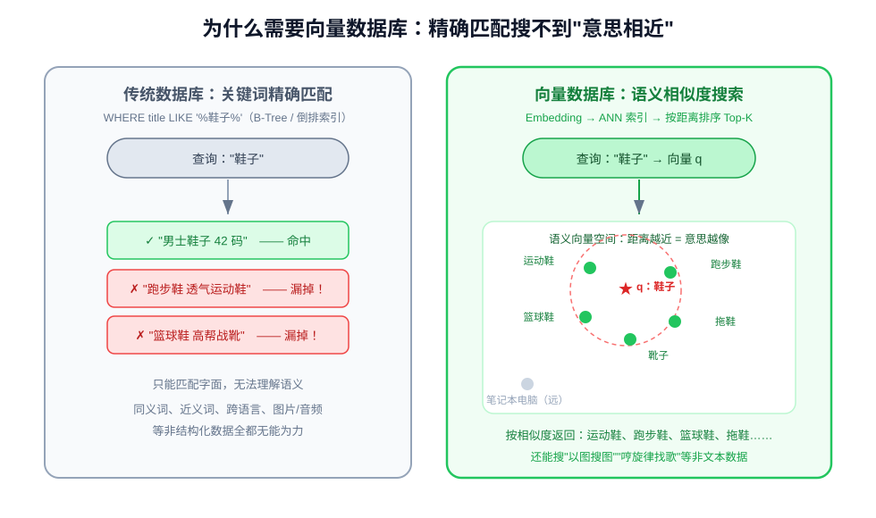
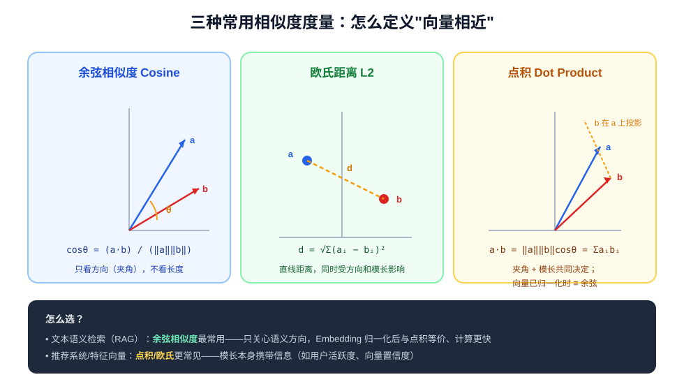
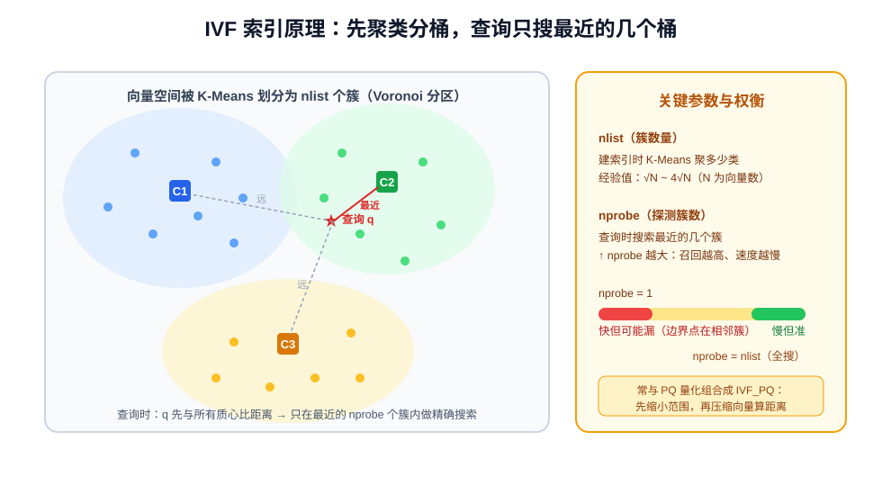
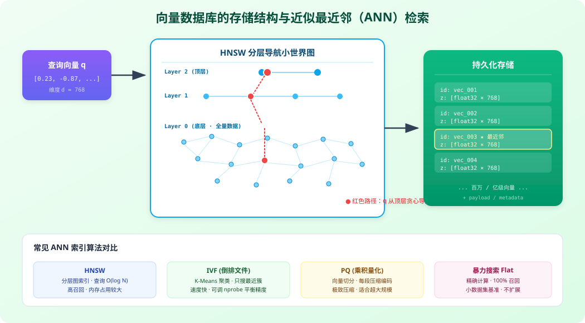
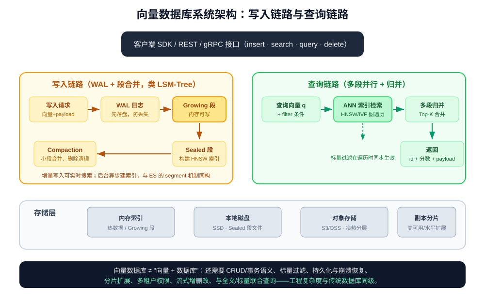
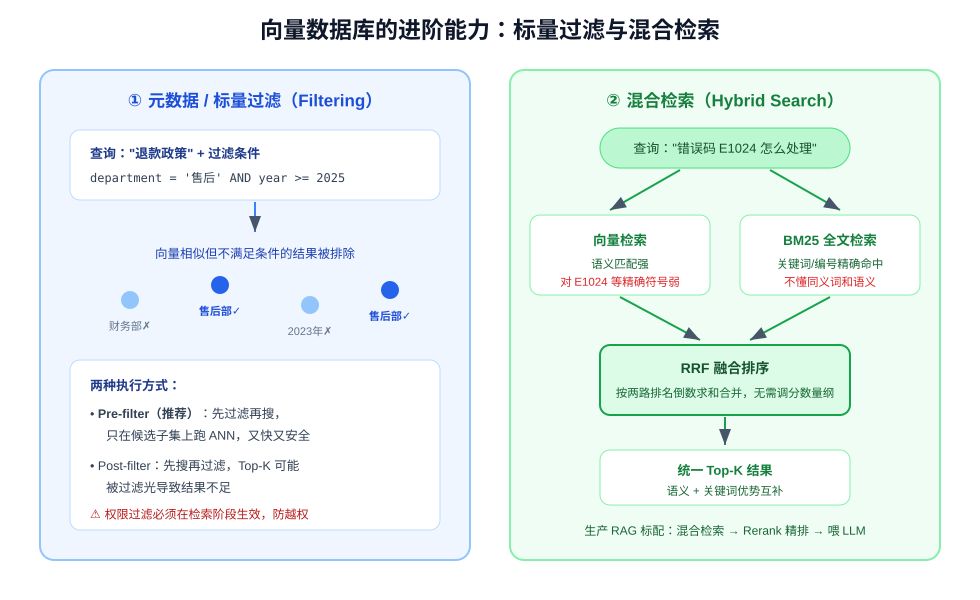

# 向量数据库：语义搜索的存储与检索引擎

> 向量数据库（Vector Database）是专门为存储、管理和检索 **Embedding 向量** 设计的数据库系统。
> 它解决一个传统数据库无法回答的问题：**"找出与这段内容意思最相近的 Top-K 条数据"**。
> 本文讲透：相似度度量、ANN 索引原理（IVF / HNSW / PQ）、核心能力、产品选型与实战调优。
> （RAG 的整体流程可参阅同目录《什么是RAG》，本文聚焦其中"向量存储与检索"这一层。）

---

## 一、什么是向量数据库

### 1.1 从一个需求说起

传统数据库建立在**精确匹配**之上：B-Tree 索引处理 `WHERE id = 1001`，倒排索引处理 `LIKE '%关键词%'`。
但在语义搜索场景中，用户搜"鞋子"，期望命中"运动鞋""跑步鞋""篮球鞋"；搜一张图片，期望找到视觉相似的图片——
这些内容**字面完全不同，但意思相近**，精确匹配全部失效。



Embedding 模型把任意文本、图片、音频映射为高维向量（如 768/1024/1536 维浮点数组），
**语义相近 = 向量距离相近**。向量数据库的职责就是：在百万、千万甚至十亿级向量中，**毫秒级找出距离查询向量最近的 K 个**，
并关联返回原文与元数据。

### 1.2 典型应用场景

| 场景 | 存什么向量 | 检索什么 |
| --- | --- | --- |
| RAG 知识库问答 | 文档 Chunk 的文本向量 | 与问题语义最相关的知识片段 |
| 以图搜图 / 商品推荐 | 图片/商品特征向量 | 视觉或描述相似的图片、商品 |
| 语义去重 / 近重复检测 | 内容向量 | 高度相似的重复文档、侵权内容 |
| 人脸 / 指纹识别 | 生物特征向量 | 同一身份的特征记录 |
| 推荐系统召回 | 用户向量 × 物品向量 | 用户可能感兴趣的物品（双塔模型） |
| 异常检测 | 日志/交易特征向量 | 远离正常簇的离群点 |

### 1.3 向量数据库 ≠ 向量检索库

FAISS、annoy、hnswlib 这类是**向量检索库（Library）**：提供 ANN 索引算法，但跑在应用进程内存里，
没有持久化、没有并发写入、没有分布式、没有权限。**向量数据库（Database）** 在检索内核之上补齐了数据库的完整能力：

- 向量与 payload（元数据）的持久化存储、崩溃恢复；
- 实时 CRUD（增删改查），而不是只能离线批量建索引；
- 标量过滤（`where department = '售后'`）与混合检索；
- 分片、副本、水平扩展与高可用；
- 多租户、权限控制、备份恢复、监控接口。

一句话：**FAISS 是"搜索引擎内核"，向量数据库是"围绕它建成的整套数据库系统"。**

---

## 二、数学基础：相似度度量

"最近邻"的前提是定义什么叫"近"。向量数据库支持三种主流度量方式：



| 度量 | 公式 | 几何含义 | 适用场景 |
| --- | --- | --- | --- |
| **余弦相似度** | `cosθ = (a·b) / (‖a‖·‖b‖)` | 向量夹角，只看**方向**不看长度 | 文本语义检索（RAG 最常用） |
| **欧氏距离 L2** | `d = √Σ(aᵢ−bᵢ)²` | 空间直线距离，方向与模长都影响 | 图像特征、坐标类数据 |
| **点积 Dot Product** | `a·b = Σaᵢbᵢ = ‖a‖‖b‖cosθ` | 夹角 + 模长共同决定 | 推荐系统（模长携带权重信息） |

关键结论：

1. **文本 Embedding 通常做 L2 归一化**（向量长度缩放为 1），此时余弦相似度与点积数学等价，
   而点积计算更快（省一次除法）——所以多数 RAG 系统底层直接用点积；
2. 距离度量**建索引时就要确定**，查询与入库必须一致；切换度量需要重建索引；
3. Embedding 模型对距离的"刻度"有自己的训练假设（如有的模型用余弦、有的用点积），选型时应查阅模型文档，不要混用。

---

## 三、核心难题：ANN 近似最近邻索引

### 3.1 暴力检索为什么不可行

最朴素的方案是 Flat 暴力检索：查询向量与库中**每一个**向量算一次距离，排序取 Top-K。

```text
单次查询计算量 ≈ N × d 次浮点运算
N = 1000 万，d = 1024 → 约 100 亿次运算/查询
即使 SIMD 优化到每秒数十亿次，单次查询也是秒级起步，QPS 无从谈起
```

而且 1000 万个 1024 维 float32 向量光存储就约 **38 GB**（1000 万 × 1024 × 4 字节），全内存暴力扫描代价极高。

**ANN（Approximate Nearest Neighbor，近似最近邻）** 的核心思想：**放弃 100% 精确，用可控的召回率损失换取数量级的速度提升**。
实践中 95%~99% 的召回率对语义搜索完全够用，而查询延迟可以从秒级降到毫秒级。主流算法有三类：IVF、HNSW、PQ（常组合使用）。

### 3.2 IVF：聚类分桶，只搜最近的桶

IVF（Inverted File，倒排文件索引）借用了 K-Means 聚类的思想：



- **建库时**：用 K-Means 把所有向量聚成 `nlist` 个簇，记录每个簇的质心（centroid），每个向量挂到最近质心的倒排列表中；
- **查询时**：查询向量 q 先与所有质心比距离，选出最近的 `nprobe` 个簇，**只在这些簇内部**做精确搜索。

参数权衡：

- `nlist`（簇数）：经验值 `√N ~ 4√N`。簇越多、每个簇越小、查询越快，但簇边界处的近邻越容易被漏；
- `nprobe`（探测簇数）：调大 → 召回率↑、延迟↑；调小 → 速度快但可能漏掉真实近邻。
  这是生产环境最常用的"旋钮"，通常从 8~32 开始按评测调整。

### 3.3 HNSW：分层小世界图，当前的事实标准

HNSW（Hierarchical Navigable Small World，分层可导航小世界图）是目前**召回率与延迟综合表现最好**的 ANN 算法，
Milvus、Qdrant、pgvector、Elasticsearch 均默认或推荐使用：



它借鉴了"六度分隔"的小世界现象与跳表（Skip List）的分层结构：

- **底层（Layer 0）** 包含全部向量，点之间建立稠密的近邻连接；
- **越往上的层节点越稀疏**，但每条边的"跨度"越大，类似高速公路网；
- **查询时从最顶层的入口点开始贪心导航**：在当前层找到离 q 最近的点后下降一层，继续搜索，直到 Layer 0，
  然后在底层近邻中精细扩展，返回 Top-K。这就像查地图：先走高速公路（顶层快速逼近目标区域），
  再走城市道路（底层精确定位）。

关键参数：

| 参数 | 含义 | 调大的影响 |
| --- | --- | --- |
| `M` | 每个节点的最大连边数（图的度数） | 召回↑、内存↑、建索引变慢；常用 16~48 |
| `efConstruction` | 建索引时的搜索宽度 | 索引质量↑、建库时间↑；常用 200~500 |
| `efSearch`（查询时 `ef`） | 查询时的动态搜索候选列表大小 | 召回↑、延迟↑；生产常取 64~256，需 ≥ K |

HNSW 的优点是召回高、查询快（图上"跳"几步就接近目标，复杂度约 O(log N)）；缺点是**内存占用大**
（要存图的邻接表，通常比原始向量多 20%~50% 内存）且增量删除较麻烦（通常用墓碑标记 + 后台合并清理）。

### 3.4 PQ：把向量压缩到原来的 1/10

PQ（Product Quantization，乘积量化）解决的是**存储和距离计算成本**问题：

- 把 d 维向量切成 m 段，每段单独做 K-Means 量化成一个 1 字节的编码（该段最接近的子质心编号）；
- 原本 1024 维 float32 = 4096 字节的向量，压缩后可能只有 m = 64 字节，**压缩 64 倍**；
- 查询时用预计算的距离查找表（Asymmetric Distance Computation）直接在编码上估算距离，无需解压。

PQ 是有损压缩，单独使用召回一般，因此常组合为 **IVF_PQ**（IVF 先缩小搜索范围，PQ 压缩簇内向量），
用于十亿级、单机内存放不下的超大规模场景。小规模场景（亿级以内）用 **HNSW + 全精度 float32** 即可，无需 PQ。

### 3.5 算法选型速查

| 算法 | 思路 | 召回 | 速度 | 内存 | 适用规模 |
| --- | --- | --- | --- | --- | --- |
| Flat 暴力 | 全量精确计算 | 100% | 慢 | 原始大小 | 万级以下 / 评测基准 |
| IVF | 聚类分桶 | 中~高（随 nprobe） | 快 | 低 | 千万~亿级 |
| **HNSW** | 分层近邻图 | **高** | **极快** | 较高 | 百万~亿级（首选） |
| PQ | 分段压缩量化 | 中 | 极快 | 极低 | 与 IVF 组合用于十亿级 |

---

## 四、向量数据库的核心能力

### 4.1 整体架构

生产级向量数据库的内部结构与 Elasticsearch 等搜索引擎高度相似（WAL + 段式存储 + 后台合并）：



- **写入链路**：写入先记 WAL（预写日志）保证崩溃不丢，进入内存中的 Growing 段可实时搜索；
  达到阈值后台将其密封（Seal）为不可变段并构建 HNSW 索引，Compaction 定期合并小段、清理删除；
- **查询链路**：查询并行下发到所有段分别做 ANN 检索，再归并出全局 Top-K；
- **存储分层**：热索引在内存，冷段落本地 SSD 或 S3/OSS 对象存储，配合分片副本实现水平扩展与高可用。

### 4.2 标量过滤（元数据过滤）

真实业务几乎不会"裸搜向量"，而是"语义相似**且**满足业务条件"：



```sql
-- 在 pgvector 中：向量距离 + 业务条件联合查询
SELECT id, title, embedding <=> $1 AS distance
FROM documents
WHERE department = '售后' AND year >= 2025   -- 标量过滤
ORDER BY embedding <=> $1                     -- 按向量距离排序
LIMIT 10;
```

- **Pre-filter（先过滤再搜）**：先按标量条件缩小候选集，再在子集上跑 ANN，性能和安全性都好，是推荐方式；
- **Post-filter（先搜再过滤）**：先 ANN 取 Top-K 再剔除不满足条件的，可能出现"Top-10 过滤后只剩 2 条"的问题；
- **权限过滤必须在检索阶段生效**（如 RAG 中用户只能搜自己有权限的文档），检索后再筛会导致越权泄露。

### 4.3 混合检索（Hybrid Search）

纯向量检索的软肋是**精确符号**：错误码 `E1024`、型号"iPhone 15 Pro Max"、人名、缩写——这些 token 的语义在
Embedding 中被模糊掉了。而 BM25 全文检索恰好擅长精确词匹配。生产 RAG 的标准做法是**两路召回 + RRF 融合**：

1. 向量检索返回 Top-50，BM25 全文检索返回 Top-50；
2. 用 **RRF（Reciprocal Rank Fusion，倒数排名融合）** 合并：`score = Σ 1/(k + rank_i)`，
   只看排名不看分数量纲，无需归一化，鲁棒性强；
3. 融合后再（可选）过 Rerank 模型精排，取 Top-5 喂给 LLM。

### 4.4 其他必备能力

- **实时增删改**：新文档入库后秒级可搜（Growing 段），删除以墓碑标记、合并时物理清除；
- **多向量字段**：一条记录可同时存文本向量、图片向量、多语言向量，分别检索；
- **距离阈值 / 分组聚合**：如"只返回距离 < 0.3 的结果"、按文档分组取最优块；
- **快照备份、RBAC 权限、审计日志、TLS** 等企业级特性。

---

## 五、主流产品选型

| 产品 | 类型 | 索引算法 | 部署方式 | 突出特点 | 适用场景 |
| --- | --- | --- | --- | --- | --- |
| **Chroma** | 向量库 | HNSW | 嵌入式（pip 装即用） | 零配置、API 极简、LangChain 集成最好 | 本地开发、原型、小规模应用 |
| **FAISS** | 检索库 | IVF/HNSW/PQ 全 | 进程内库 | Meta 开源、算法最全、性能极致 | 研究实验、离线批量检索 |
| **pgvector** | PG 扩展 | HNSW/IVFFlat | 随 PostgreSQL | **向量与业务数据同库**，可 JOIN、事务、SQL 过滤 | 已有 PG 技术栈、中小规模团队首选 |
| **Milvus / Zilliz** | 分布式向量库 | HNSW/IVF/DiskANN | 独立集群/云服务 | 十亿级、存算分离、云原生、生态完整 | 企业级大规模生产 |
| **Qdrant** | 向量库 | HNSW（Rust） | 单机/集群/云 | 性能强、过滤优秀、API 设计好、资源占用低 | 中大型生产系统 |
| **Weaviate** | 向量库 | HNSW | 单机/集群/云 | 内置混合检索、模块化集成 Embedding | 需要一体化 hybrid 的团队 |
| **Elasticsearch / OpenSearch** | 搜索引擎 | HNSW（dense_vector） | 独立集群 | 全文检索 + 向量一体、成熟运维体系 | 已有 ES、强混合检索需求 |

**选型建议**：

1. **学习/原型**：Chroma，5 分钟跑通；
2. **公司已经在用 PostgreSQL 且数据量在千万级以内**：pgvector，少维护一个系统，过滤/JOIN 白送；
3. **数据量上亿、需要独立扩展或多语言多团队**：Milvus（生态最大）或 Qdrant（轻量高性能）；
4. **团队已有成熟 ES 集群**：直接用 ES 的 kNN 向量检索，混合检索体验最顺；
5. **十亿级超大规模、内存敏感**：考虑 DiskANN / IVF_PQ 等磁盘索引方案（Milvus 支持）。

---

## 六、实战

### 6.1 pgvector：用 SQL 做向量检索

```sql
-- 1. 安装扩展
CREATE EXTENSION IF NOT EXISTS vector;

-- 2. 建表：embedding 列维度与模型输出一致（如 1024）
CREATE TABLE documents (
    id          BIGSERIAL PRIMARY KEY,
    title       TEXT,
    content     TEXT,
    department  TEXT,
    embedding   vector(1024)
);

-- 3. 建 HNSW 索引（余弦距离用 vector_cosine_ops）
CREATE INDEX ON documents USING hnsw (embedding vector_cosine_ops)
    WITH (m = 16, ef_construction = 200);

-- 4. 查询：先过滤再按距离排序（<=> 余弦距离，<-> L2，<#> 点积）
SELECT id, title, 1 - (embedding <=> $1) AS similarity
FROM documents
WHERE department = '售后'
ORDER BY embedding <=> $1
LIMIT 10;

-- 调大查询精度（会话级，默认 40，召回不足时调大）
SET hnsw.ef_search = 128;
```

### 6.2 Chroma：Python 嵌入式用法

```python
import chromadb
from chromadb.utils import embedding_functions

client = chromadb.PersistentClient(path="./chroma_db")  # 数据落盘
ef = embedding_functions.DefaultEmbeddingFunction()     # 默认 all-MiniLM，也可接 OpenAI/BGE

collection = client.get_or_create_collection(
    name="docs",
    embedding_function=ef,
    metadata={"hnsw:space": "cosine"},   # 距离度量：cosine / l2 / ip
)

# 写入（向量由 embedding function 自动生成）
collection.add(
    ids=["1", "2"],
    documents=["年假政策：正式员工 10 天……", "报销流程：出差后 10 个工作日内……"],
    metadatas=[{"dept": "人事"}, {"dept": "财务"}],
)

# 查询：向量检索 + 标量过滤一步到位
results = collection.query(
    query_texts=["入职 6 年有几天年假？"],
    n_results=5,
    where={"dept": "人事"},          # 元数据 pre-filter
)
print(results["documents"])
```

### 6.3 Milvus：核心建参与查询

```python
from pymilvus import MilvusClient, DataType

client = MilvusClient(uri="http://localhost:19530")

client.create_collection(
    collection_name="docs",
    dimension=1024,
    metric_type="COSINE",           # 与 Embedding 模型匹配
    index_params={
        "index_type": "HNSW",
        "params": {"M": 32, "efConstruction": 400},
    },
)

# 查询时调 ef（Milvus 中为 search_params.ef），平衡召回与延迟
results = client.search(
    collection_name="docs",
    data=[query_vector],
    limit=10,
    search_params={"metric_type": "COSINE", "params": {"ef": 128}},
    filter='dept == "售后" and year >= 2025',   # 标量过滤表达式
    output_fields=["title", "content"],
)
```

---

## 七、调优与评测

### 7.1 用 Recall@K 量化索引质量

ANN 是"近似"的，**必须用数字而不是感觉评估**。方法：

1. 准备一批标准查询集，用 **Flat 暴力检索**算出"标准答案"（精确 Top-K）；
2. 用 ANN 索引在同一批查询上检索，统计 **Recall@K = ANN 命中的正确近邻数 / K**；
3. 目标通常是 **Recall@10 ≥ 0.95**，再在满足召回的前提下压低延迟。

```text
经验：HNSW 中 efSearch 从 64 起调，每翻倍测一次召回/延迟；
     IVF 中 nprobe 从 16 起调。召回达标后立刻停止——继续调大只是浪费资源。
```

### 7.2 内存容量估算

```text
向量内存 ≈ 向量条数 N × 维度 d × 每维字节数
  float32：4 字节；float16/int8 量化：2 / 1 字节
HNSW 额外开销 ≈ M × 2 × N × 8~12 字节（邻接表），约为向量本体的 20%~50%
+ payload 元数据 + 图节点开销，规划时按理论值的 1.5~2 倍预留
```

### 7.3 维度与 Embedding 模型

- 维度不是越高越好：768/1024 维对多数中文场景已足够；1536 维比 768 维存储和检索成本翻倍，
  但召回提升往往只有几个百分点；
- **入库和查询必须用同一个 Embedding 模型**，模型升级需要全量重新生成向量并重建索引；
- 中文场景优先 BGE 系列（如 `bge-m3` 同时支持稠密/稀疏/多向量，天然适配混合检索）。

### 7.4 常见的坑

| 坑 | 后果 | 对策 |
| --- | --- | --- |
| 距离度量与模型不匹配 | 检索结果排序错乱 | 查模型文档，归一化向量、统一用 cosine/ip |
| 只看延迟不看召回 | 上线后"搜什么都不太对" | 建立 Recall@K 评测集，调参用数据说话 |
| 全量数据不加过滤 | 跨部门/越权数据泄露 | 过滤条件进查询，权限 pre-filter |
| 只用向量检索 | 错误码、型号、人名搜不准 | 上混合检索 + BM25 |
| HNSW 参数用默认到底 | 数据量上来后召回或延迟不达标 | 按 7.1 调 efSearch/M |
| 频繁单条写入后立即大批量查询 | 段碎片多、性能抖动 | 批量写入 + 预留 compaction 窗口 |
| 向量库当主库存业务数据 | 事务/一致性能力不足 | 向量库存向量与外键，业务数据仍在关系库 |

---

## 八、小结

| 知识点 | 一句话总结 |
| --- | --- |
| 向量数据库 | 存储 Embedding 并支持"按语义距离取 Top-K"的数据库系统 |
| 与检索库的区别 | FAISS 只有 ANN 算法；向量数据库补齐持久化、CRUD、过滤、分布式 |
| 相似度度量 | 文本用余弦（归一化后等价点积）、图像常用 L2、推荐用点积；建库后不可改 |
| 为什么需要 ANN | 暴力检索 O(Nd) 不可扩展；ANN 用少量召回损失换数量级提速 |
| IVF | K-Means 聚类分桶，只搜最近 nprobe 个簇，nprobe 是速度/召回旋钮 |
| HNSW | 分层小世界图，顶层快速逼近、底层精确定位；当前综合最优，内存略高 |
| PQ | 分段量化压缩向量数十倍，与 IVF 组合应对十亿级 |
| 标量过滤 | 业务条件必须 pre-filter；权限过滤在检索阶段生效防越权 |
| 混合检索 | 向量（语义）+ BM25（精确符号）经 RRF 融合，生产 RAG 标配 |
| 选型 | 原型 Chroma、有 PG 用 pgvector、大规模 Milvus/Qdrant、有 ES 用 ES |
| 评测 | Recall@K ≥ 0.95 为目标，调 efSearch / nprobe 平衡延迟 |

向量数据库是 RAG、推荐系统、多模态搜索的**基础设施层**。它的工程内核（段式存储、WAL、分片副本、过滤下推）
与传统搜索引擎/数据库一脉相承，真正新增的知识点只有三块：**Embedding 向量的特性、ANN 索引算法、
以及召回率与延迟的权衡方法**。掌握本文后，可继续学习 DiskANN（磁盘索引）、多向量/稀疏向量混合检索
（如 BGE-M3 + SPLADE）以及向量与图结构结合的 GraphRAG 检索等进阶方向。
