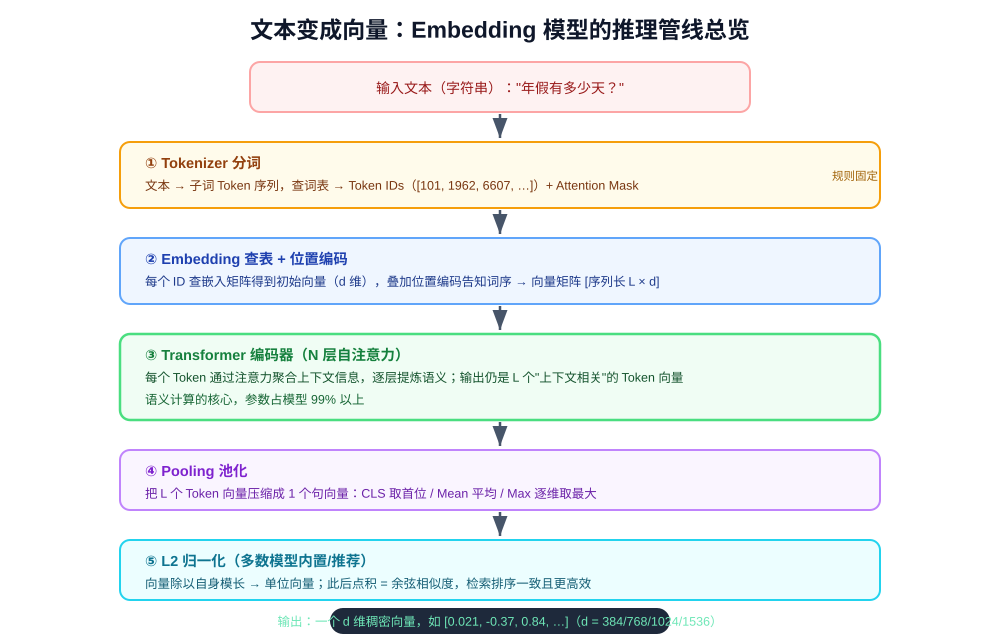
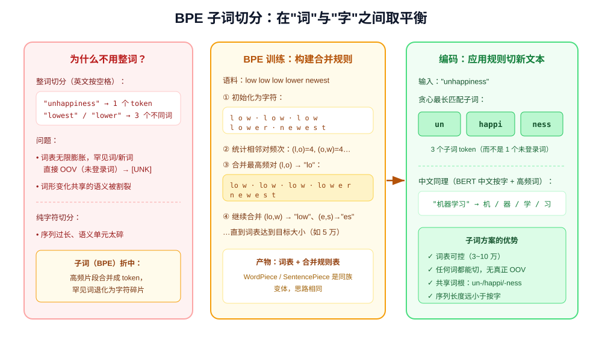
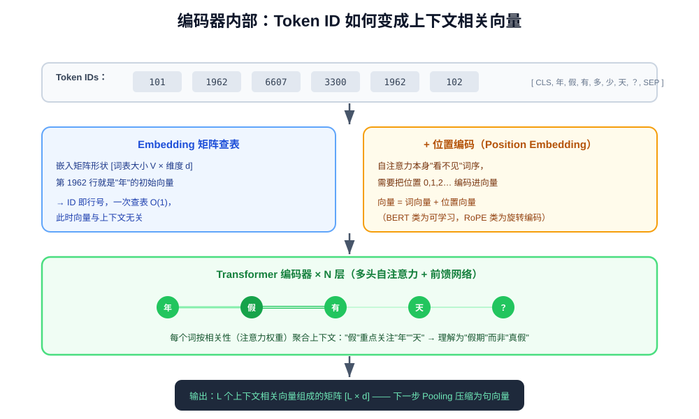
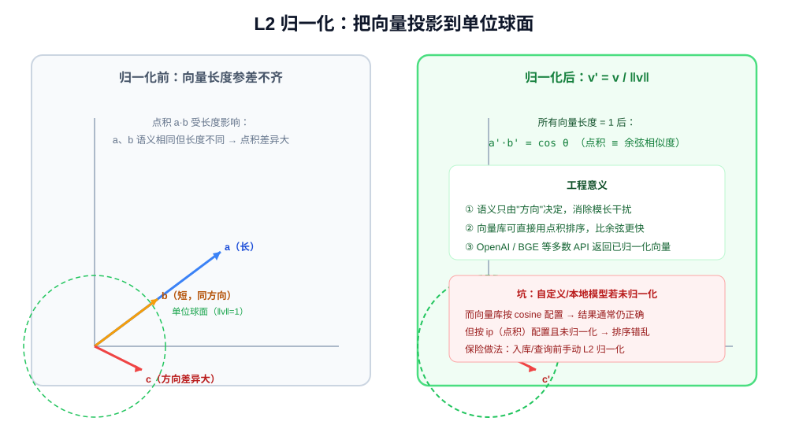

# 文本是如何变成向量的：Embedding 推理管线全解析

> 在 RAG 和语义搜索中，我们调用一次 Embedding API，就能把一段文本变成一串浮点数：
> `"年假有多少天？"` → `[0.021, -0.37, 0.84, …, 0.12]`。
> 这串数字为什么能代表"语义"？模型内部到底经历了什么？本文从**推理（inference）视角**完整拆解
> **文本 → Token IDs → 上下文向量 → 池化 → 归一化 → 句向量** 的五步管线，并给出实战代码与工程要点。
> （词向量的训练原理、语义空间几何可参阅同目录《什么是词向量》；向量如何被存储检索见《向量数据库》。）

---

## 一、为什么要把文本变成向量

计算机只认识数字。要让机器"理解"文字，第一步是把文字编码成数字。最朴素的方案是 **One-Hot（独热编码）**：

```text
词表 [猫, 狗, 汽车]
猫   → [1, 0, 0]
狗   → [0, 1, 0]
汽车 → [0, 0, 1]
```

它有三个致命问题：

1. **词汇鸿沟**：任意两个词的向量都正交（点积为 0），"猫"和"狗"的距离跟"猫"和"汽车"一样远——完全无法表达语义亲疏；
2. **维度灾难**：向量维度 = 词表大小，现代词表 5~50 万，且向量极度稀疏（几乎全是 0）；
3. **无法泛化**：没见过的词（OOV）没有位置。

**Embedding（稠密向量）** 换了个思路：用一个几百~几千维的**稠密浮点向量**表示文本，每一维都隐含某种语义特征，
让"意思相近的文本在几何空间中距离相近"。这不是人工设计的，而是模型在海量语料上训练后"涌现"出的表示能力。
今天我们使用的 Embedding 模型（OpenAI text-embedding-3、BGE、MiniLM……）本质都是一个**预训练好的编码器**，
输入文本、输出向量。本文拆解的就是这次前向计算的完整过程。

---

## 二、全景：五步推理管线



```text
文本字符串
  → ① Tokenizer：分词 + 查词表        → Token IDs（整数序列）
  → ② Embedding 查表 + 位置编码        → 初始向量矩阵 [L × d]
  → ③ Transformer 编码器（N 层注意力）  → 上下文相关向量矩阵 [L × d]
  → ④ Pooling 池化                    → 1 个句向量 [d]
  → ⑤ L2 归一化                       → 单位句向量 [d]，送入向量库
```

注意一个关键事实：**Tokenizer 规则和编码器权重都是模型训练时固定死的**。推理时文本必须走与训练时完全相同的
分词方式、相同的池化策略，才能得到落在同一语义空间中的向量——这也是后文所有工程约束的根源。

---

## 三、第 ① 步：Tokenizer——文本切成 Token

模型不认识字符串，只认识整数 ID。Tokenizer 负责把文本切成模型能处理的最小单元 **Token**，并映射为 ID。

### 3.1 为什么是"子词"而不是"整词"

英文按空格切词、中文按字切分，看似简单，但整词方案会导致词表无限膨胀：`unhappiness`、`unhappy`、`happier`
各占一个位置，罕见词和新词直接 OOV。现代模型统一采用 **BPE（Byte-Pair Encoding，字节对编码）** 等子词算法，
在"词"与"字符"之间取平衡：



- **训练阶段（离线，一次性）**：从字符序列开始，反复统计相邻符号对的频次，把最高频的对合并成新符号
  （`l`+`o` → `lo`，`lo`+`w` → `low`），直到词表达到目标大小（通常 3~10 万）；
- **编码阶段（每次推理）**：对新文本按合并规则做**贪心最长匹配**。`unhappiness` 被切成 `un / happi / ness`
  三个子词——即使整个词没出现过，也能由高频片段拼成，**理论上不存在真正的 OOV**（最差退化为字符/字节）；
- 中文 BERT 类模型以"字"为基础单元再合并高频词，如"机器学习" → `机 / 器 / 学 / 习`。

> WordPiece（BERT）、SentencePiece（多语言模型常用）是 BPE 的同族变体，核心思想一致。

### 3.2 特殊 Token 与长度截断

切分后还会补充特殊标记：

| 特殊 Token | 作用 |
| --- | --- |
| `<[BOS_never_used_51bce0c785ca2f68081bfa7d91973934]>`（CLS） | 句首标记，BERT/BGE 系用它的最终向量作为整句表示 |
| `[SEP]` | 句间分隔（如"问题 + 答案"成对输入时） |
| `[PAD]` | 批量处理时把不同长度的序列补齐到等长，配合 attention mask 屏蔽 |
| `[UNK]` | 兜底未登录词（子词方案下极少触发） |

同时序列会被**截断**到模型的最大长度 `max_seq_length`（常见 512 个 token）。注意中文一个字通常就是 1 个 token，
英文一个单词约 1~3 个 token——**超长文本不是报错而是被静默截断**，这是 RAG 中必须做 Chunk 切分的根本原因
（见《什么是RAG》）。

最终输出两样东西：**Token IDs**（整数序列）和 **Attention Mask**（标记哪些位置是真实文本、哪些是 padding）。

---

## 四、第 ② 步：Embedding 查表 + 位置编码



### 4.1 查表：ID 就是行号

模型内部有一个可训练的**嵌入矩阵**（Embedding Matrix），形状为 `[词表大小 V × 向量维度 d]`。
Token ID 直接作为行索引，一次查表就取出该 token 的初始向量：

```text
嵌入矩阵 E（训练好的参数，如 V=50000, d=768）
ID = 1962（"年"） → 取 E 的第 1962 行 → [0.12, -0.44, 0.77, …]（768 维）
```

这一步等价于一次"字典查值"，O(1) 完成。但此时每个词的向量**与上下文无关**——"苹果"在"吃苹果"和"苹果发布手机"
里取到的是同一个初始向量。

### 4.2 位置编码：告诉模型词序

自注意力机制本身是"无序"的（同时看到所有词，像一袋词），必须额外注入位置信息：

```text
最终输入向量 = Token 词向量 + 位置编码向量（第 0、1、2… 位各有一个向量）
```

BERT 系用**可学习的位置嵌入**（每个位置一个训练出来的向量）；现代模型（如 LLaMA、bge-m3）多用
**RoPE 旋转位置编码**（通过旋转矩阵把相对位置编码进注意力计算）。此外 BERT 还有 Segment Embedding
区分句子 A/B。

至此，序列变成一个 `[L × d]` 的向量矩阵，进入编码器。

---

## 五、第 ③ 步：Transformer 编码器——语义在注意力中涌现

向量矩阵进入 **N 层堆叠的 Transformer 编码器**，每层做两件事：

1. **多头自注意力（Multi-Head Self-Attention）**：每个词计算与句中所有词的相关性权重，
   按权重加权聚合其他词的信息来更新自己。"年假"的"假"会高权重关注"年""天""休假"等词，
   从而把语义从"真假"的"假"拉向"假期"的"假"；
2. **前馈网络（FFN）**：对每个位置独立做非线性变换，存储和提炼知识。

```text
attention(Q, K, V) = softmax(Q·Kᵀ / √d) · V
每个词的新表示 = Σ（注意力权重 × 其他词的表示）
```

经过多层迭代，**每个 token 的输出向量都已融合整句上下文**——这就是上下文相关表示（contextualized embedding）：
同一个词在不同语境下输出不同向量（一词多义的原理详见《什么是词向量》）。

RAG 使用的 Embedding 模型是**双向编码器**（BERT 架构，每个词能看到左右两侧的全部上下文），
与 GPT 类单向解码器不同——编码器的目标就是"理解整句"，比生成式模型更适合做向量表示。

---

## 六、第 ④ 步：Pooling——从词向量矩阵到一个句向量

编码器输出的仍是 `L 个词的向量矩阵 [L × d]`，而语义检索需要**一个**向量代表整段文本。这一步压缩叫 Pooling：


| 策略 | 做法 | 典型使用者 |
| --- | --- | --- |
| **CLS Pooling** | 直接取句首 `<[BOS_never_used_51bce0c785ca2f68081bfa7d91973934]>` token 的输出向量 | BGE 系列、BERT 微调句向量模型 |
| **Mean Pooling** | 所有真实 token 向量逐维求平均（用 mask 排除 padding） | sentence-transformers 默认、MiniLM、E5 |
| **Max Pooling** | 每一维取所有 token 中的最大值 | 较少单独使用，偶尔与 mean 拼接 |

⚠️ **池化方式在模型训练时就已固定，推理时必须严格遵循模型文档**：BGE 用 CLS、MiniLM 用 mean——
用错池化相当于把训练好的语义空间打乱，相似度会全面失真。一个常见误区是"直接拿原始 BERT 的 CLS 向量做检索"，
效果很差；必须使用经过**对比学习微调**的句向量模型（SimCSE、BGE、E5 等），它们的 CLS/mean 才被训练成
"整句语义表示"。

---

## 七、第 ⑤ 步：L2 归一化



最后通常对句向量做 **L2 归一化**：向量除以自身模长 `v' = v / ‖v‖`，所有向量被投影到半径为 1 的单位球面上。

- **语义只由方向决定**：归一化消除向量长度（模长）差异，相似度只看夹角；
- **点积 ≡ 余弦相似度**：两个单位向量的点积就等于余弦值，向量数据库可直接用更快的点积（`ip`）排序；
- OpenAI、BGE 等主流 API/模型**返回的向量默认已归一化**；但部分本地模型或自定义编码需要手动处理。

```python
# numpy 手动 L2 归一化
norms = np.linalg.norm(vectors, axis=1, keepdims=True)
vectors = vectors / np.clip(norms, 1e-12, None)
# sentence-transformers 则直接 model.encode(texts, normalize_embeddings=True)
```

至此，我们得到了最终的 d 维稠密向量（d 常见 384 / 768 / 1024 / 1536 / 3072），可以写入向量数据库，
等待与查询向量做相似度检索。

---

## 八、动手实践

### 8.1 调用 OpenAI Embedding API

```python
from openai import OpenAI
client = OpenAI()

def embed_texts(texts: list[str], dimensions: int | None = None) -> list[list[float]]:
    kwargs = {"model": "text-embedding-3-small", "input": texts}
    if dimensions:                       # Matryoshka 截断：可用更少维度降低存储/检索成本
        kwargs["dimensions"] = dimensions
    resp = client.embeddings.create(**kwargs)
    return [item.embedding for item in resp.data]

doc_vecs = embed_texts(["年假政策：正式员工 10 天……"])   # 入库文档
q_vec = embed_texts(["入职六年有几天年假？"])             # 查询问题 —— 必须同一模型
```

### 8.2 本地中文模型（BGE，免费离线）

```bash
pip install sentence-transformers
```

```python
from sentence_transformers import SentenceTransformer

# 中文轻量首选；更强可选 BAAI/bge-large-zh-v1.5 或多语言 bge-m3
model = SentenceTransformer("BAAI/bge-small-zh-v1.5")

# BGE 中文检索的关键：查询侧加指令前缀，文档侧不加！
query_instruction = "为这个句子生成表示以用于检索相关文章："

doc_vecs = model.encode(
    ["年假政策：正式员工每年 10 天……", "报销流程：出差后 10 个工作日内……"],
    normalize_embeddings=True,          # 内置归一化
    batch_size=32,
)
q_vec = model.encode(
    query_instruction + "入职六年有几天年假？",
    normalize_embeddings=True,
)
```

两个极易踩的细节：

1. **查询前缀指令**：BGE 等对比学习模型在训练时，查询端带固定指令、文档端不带。中文 BGE 的指令是
   `"为这个句子生成表示以用于检索相关文章："`；E5 模型则用 `"query: "` / `"passage: "` 前缀。
   前缀用反，检索质量会明显下降——务必查模型卡（Model Card）；
2. `normalize_embeddings=True` 后向量库距离度量可直接配 `ip`/`cosine`。

### 8.3 Tokenizer 实际长什么样

```python
from transformers import AutoTokenizer
tok = AutoTokenizer.from_pretrained("BAAI/bge-small-zh-v1.5")

out = tok("年假有多少天？", padding="max_length", max_length=16, truncation=True)
print(out["input_ids"])      # [101, 1962, 6607, 3300, 1914, 2207, 1962, 679, 102, 0, 0, ...]
print(out["attention_mask"]) # [1, 1, 1, 1, 1, 1, 1, 1, 1, 0, 0, ...]
print(tok.convert_ids_to_tokens(out["input_ids"]))  # ['<[BOS_never_used_51bce0c785ca2f68081bfa7d91973934]>', '年', '假', ..., '[SEP]', '[PAD]']
```

可以亲手验证：**Token 数 ≠ 字数/词数**，超长文本会被 `truncation=True` 静默截断。

---

## 九、工程要点与常见坑

| 要点/坑 | 说明 |
| --- | --- |
| **模型与 Tokenizer 必须配套** | 用 A 模型的 tokenizer 配 B 模型的权重，ID 映射全错；加载时用同一模型名 |
| **入库与查询同一模型** | 不同模型的向量空间完全不同，混存混查结果无意义；换模型必须全量重建向量 |
| **池化方式遵循模型文档** | BGE 用 CLS、MiniLM/E5 用 mean，用错则语义空间错位 |
| **长度截断** | 超过 max_length（常见 512 token）静默丢失尾部内容；长文档必须先 Chunk |
| **归一化与度量一致** | 未归一化向量配点积（ip）度量会排序错乱；建议 encode 时 `normalize_embeddings=True` |
| **查询指令前缀** | BGE/E5 查询端需要特定前缀，文档端不需要，用反效果打折 |
| **维度成本** | 维度翻倍 = 存储与检索成本翻倍；3-small 可用 `dimensions` 参数做 Matryoshka 截断 |
| **批量编码** | 入库用 `batch_size`（32/64）批量 encode，比逐条快一个数量级 |
| **不要拿 LLM 最后一层隐藏态当句向量** | 生成式解码器未经对比学习训练，直接取隐藏态做检索效果远不如专用 Embedding 模型 |
| **embedding 模型不需要自己训练** | 通用检索直接用 BGE/E5/text-embedding-3；仅领域极特殊时才考虑领域继续训练（finetune） |

---

## 十、小结

| 步骤 | 发生了什么 | 关键约束 |
| --- | --- | --- |
| ① Tokenizer | BPE 子词切分 → 查词表 → Token IDs + mask | 必须用模型配套 tokenizer；超长截断 |
| ② 查表 + 位置编码 | ID 查嵌入矩阵得初始向量，叠加位置编码 | ID 即行号；此时向量与上下文无关 |
| ③ Transformer 编码器 | N 层自注意力融合上下文 | 双向编码器（BERT 系）专为理解整句而生 |
| ④ Pooling | L 个词向量压缩为 1 个句向量 | CLS / mean 由模型训练时固定，不能混用 |
| ⑤ L2 归一化 | 投影到单位球面 | 归一化后点积 = 余弦；未归一化配 ip 会出错 |

**一句话概括**：文本变成向量的过程，就是"**用模型自己的词典把文本翻译成整数 ID，让预训练 Transformer 读懂
整句话的上下文，再把整句的语义压缩、归一化成一个方向向量**"。理解这五步后，RAG 中"为什么换模型必须重建索引"
"为什么文档要切块""为什么 BGE 查询要加前缀""为什么距离度量要和归一化配套"这些工程问题，都能追溯到这条管线上
的某个环节。下一步可结合《什么是RAG》《向量数据库》《Chroma 入门手册》串联完整的检索增强生成链路。
