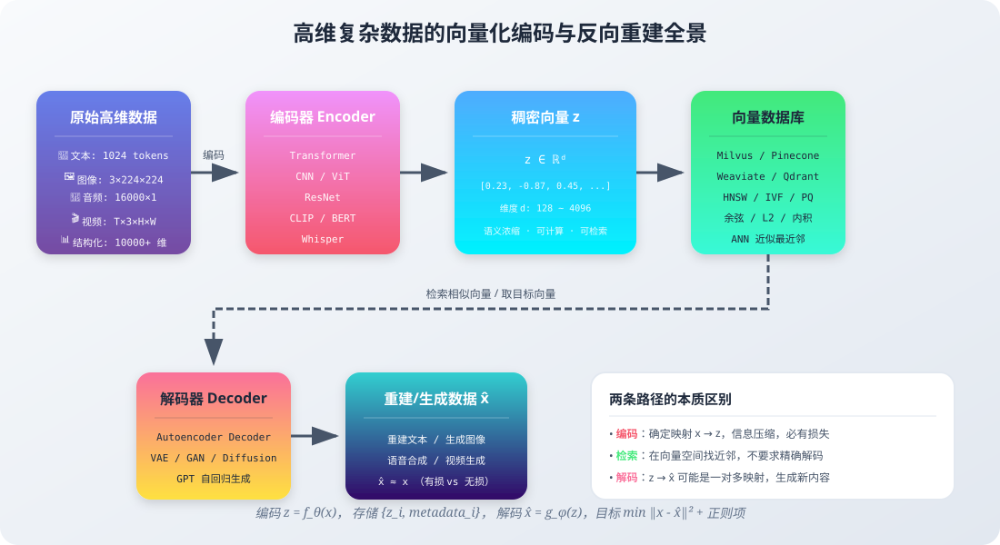
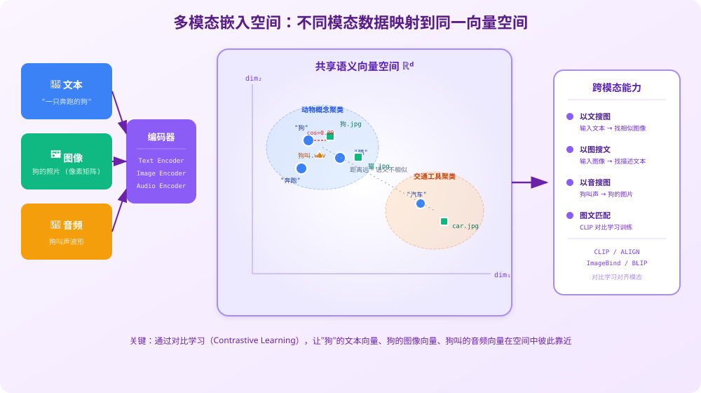
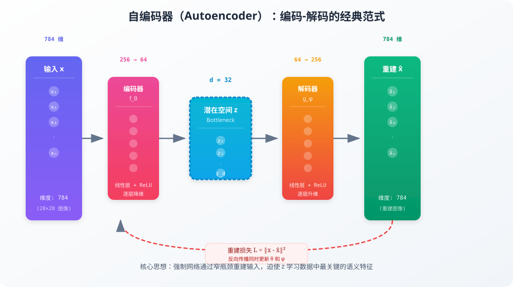
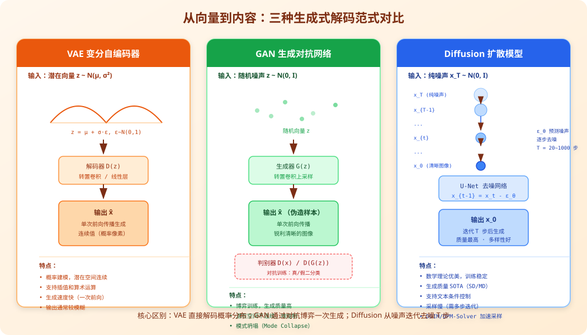
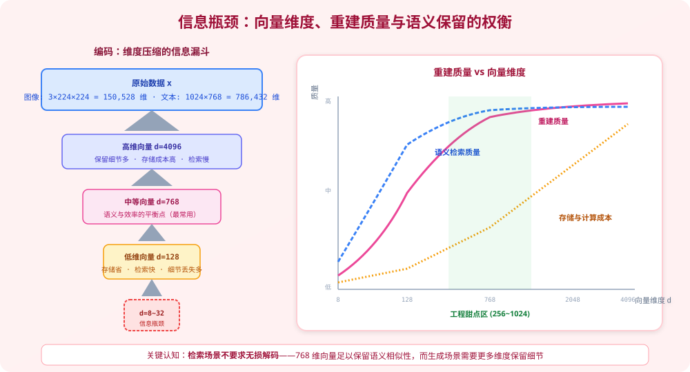

# 高维复杂数据的向量化与反向重建：从像素到向量，再从向量到内容

我们每天都在与人工智能系统交互：用文字搜索图片、让模型生成图像、通过语音指令控制设备、在海量文档中找到语义最相关的段落。这些能力的背后，都绕不开同一个核心问题：

```text
计算机无法直接"理解"文字、图像、声音，
它只能计算数字。

那么——
一张 1920×1080 的照片，是如何变成一串浮点数存进数据库的？
存进去之后，又怎么根据这串数字找回相似的图片，甚至生成一张全新的图片？
```

这就是**表示学习（Representation Learning）** 要解决的根本问题：在高维原始数据和低维稠密向量之间建立可计算的映射。本文将从**编码、存储、解码**三个阶段，系统拆解这一过程的数学原理、工程实现和前沿方法。



---

## 1. 问题的本质：为什么需要向量化

### 1.1 什么是"高维复杂数据"

在机器学习语境中，"高维复杂数据"指的是原始维度极高、包含丰富结构信息、无法用简单规则直接解析的数据模态：

| 数据模态 | 原始表示 | 原始维度（典型值） | 结构特征 |
| --- | --- | --- | --- |
| 文本 | Token ID 序列 | 1024 tokens × 词表 50000 | 离散、序列依赖、一词多义 |
| 图像 | RGB 像素矩阵 | 3 × 224 × 224 = 150,528 | 空间局部相关性、平移不变性 |
| 音频 | 波形采样点 | 16000 Hz × 10 秒 = 160,000 | 时序依赖、频率结构、相位 |
| 视频 | 帧序列 | 30帧 × 3 × 1080 × 1920 ≈ 1.86 亿 | 时空双重相关性 |
| 图结构 | 节点 + 边 | 百万节点 × 特征维度 | 非欧几里得、关系依赖 |
| 多模态 | 以上组合 | 各模态维度之和 | 模态间语义鸿沟 |

这些原始数据有两个共同问题：

1. **维度灾难（Curse of Dimensionality）**：维度越高，数据在空间中越稀疏，距离计算失去意义，索引和检索成本指数级增长。
2. **语义鸿沟（Semantic Gap）**：原始像素值或字符 ID 不包含"这是一只猫"这样的高层语义；两张都是猫的图片，像素值可能差异巨大。

向量化的目标，就是学习一个映射函数，把这些高维、冗余、无语义的数据，压缩成**低维、稠密、富含语义**的向量表示：

```text
f_θ: x ∈ ℝ^D  →  z ∈ ℝ^d

其中 D >> d，例如 D = 150,528，d = 768
```

这个向量 `z` 被称为**嵌入（Embedding）** 或**潜在表示（Latent Representation）**。

### 1.2 一个好的向量表示应该满足什么

不是随便把数据压成低维向量就行。高质量的嵌入需要满足以下性质：

| 性质 | 含义 | 反例 |
| --- | --- | --- |
| **语义相似性** | 语义相近的样本在向量空间中距离近 | 猫和狗的向量距离应该小于猫和汽车 |
| **解耦表示** | 不同语义因素对应不同方向/子空间 | "颜色"和"形状"不应纠缠在同一维度 |
| **平滑性** | 向量空间中的小变化对应数据的小变化 | 向量加一点噪声不应让"猫"变成"汽车" |
| **线性可分** | 简单分类器就能在该空间完成任务 | 复杂决策边界说明表示质量差 |
| **泛化性** | 未见过的样本也能映射到合理位置 | 只记住训练样本，新样本全是噪声 |
| **紧凑性** | 维度尽可能低，信息尽可能多 | 768 维能解决的问题不需要 4096 维 |

---

## 2. 编码阶段：从原始数据到稠密向量

### 2.1 文本编码：从 Token ID 到语义向量

文本向量化是最成熟的领域，经历了从独热编码到上下文嵌入的演进。关于词向量的完整流水线（分词、词表、Word2Vec、BERT 等），已有专门文章详述，这里聚焦于"最后一步：如何把整个输入变成一个用于存储和检索的向量"。

#### 2.1.1 Token 级嵌入

模型内部，每个 Token 先经过嵌入层查表得到基础向量：

```python
import torch
import torch.nn as nn

# 词表大小 V=50000，嵌入维度 d=768
token_embedding = nn.Embedding(num_embeddings=50000, embedding_dim=768)

# 输入 Token ID 序列
token_ids = torch.tensor([15, 86, 120, 205, 309])  # "我喜欢自然语言处理"

# 查表得到每个 Token 的向量：shape = (5, 768)
token_vectors = token_embedding(token_ids)
```

加上位置编码后，向量序列进入 Transformer 层。经过多层自注意力，每个位置的输出向量已经融合了上下文信息。

#### 2.1.2 句/段级嵌入：从序列到单向量

对于检索、聚类等任务，我们需要把整个句子或段落压缩成**一个向量**。常见的聚合策略有：

| 聚合方法 | 做法 | 适用场景 | 缺点 |
| --- | --- | --- | --- |
| **CLS 池化** | 取 BERT 第一个 `<[BOS_never_used_51bce0c785ca2f68081bfa7d91973934]>` Token 的输出 | BERT 系列分类/匹配任务 | 预训练目标与检索不完全对齐 |
| **均值池化** | 对所有 Token 向量取平均 | 通用句向量 | 忽略词的重要性差异 |
| **最大池化** | 每个维度取所有 Token 的最大值 | 突出显著特征 | 可能丢失全局信息 |
| **注意力加权** | 学习每个 Token 的权重再加权 | 质量较高 | 增加计算量和过拟合风险 |
| **专用 Sentence 模型** | 用对比学习端到端训练句向量 | 语义检索、RAG | 需要专门训练 |

现代检索系统通常使用专门的 Sentence Embedding 模型（如 `bge-large-zh`、`m3e`、`text-embedding-3-large`），它们通过**对比学习**训练：语义相近的句子向量拉近，不相关的推远。

```python
# 使用 FlagEmbedding 生成中文句向量（伪代码示例）
from FlagEmbedding import FlagModel

model = FlagModel('BAAI/bge-large-zh-v1.5')
query_vector = model.encode("什么是向量数据库？")
document_vector = model.encode("向量数据库专门用于存储和检索高维嵌入...")

# 余弦相似度
similarity = cosine_similarity(query_vector, document_vector)
# query_vector.shape = (1024,)
```

### 2.2 图像编码：从像素矩阵到视觉特征

#### 2.2.1 CNN 编码器

经典的图像编码器使用卷积神经网络（CNN），典型代表是 ResNet：

```text
输入图像 (3, 224, 224)
  ↓ Conv1 + BN + ReLU + MaxPool
  ↓ Layer1 (残差块 × 3)    →  (256, 56, 56)
  ↓ Layer2 (残差块 × 4)    →  (512, 28, 28)
  ↓ Layer3 (残差块 × 6)    →  (1024, 14, 14)
  ↓ Layer4 (残差块 × 3)    →  (2048, 7, 7)
  ↓ Global Average Pooling
  ↓
图像特征向量 (2048,)
```

全局平均池化（GAP）把 7×7 的空间维度压缩为 1，得到一个 2048 维的向量，代表整张图像的语义内容。

#### 2.2.2 Vision Transformer (ViT)

ViT 把图像切成 16×16 的小块（Patch），每个 Patch 线性投影后像 Token 一样输入 Transformer：

```text
图像 (3, 224, 224)
  ↓ 切分为 14×14 = 196 个 Patch
  ↓ 每个 Patch 展平并线性投影：(196, 768)
  ↓ 加上位置编码 + <[BOS_never_used_51bce0c785ca2f68081bfa7d91973934]> Token
  ↓ 12 层 Transformer Encoder
  ↓ 取 <[BOS_never_used_51bce0c785ca2f68081bfa7d91973934]> 输出
  ↓
图像向量 (768,)
```

#### 2.2.3 多粒度表示

实际系统中，图像不一定只压缩为一个向量：

```text
全局向量 (1, d)      —— 用于图搜图、图像分类
Patch 向量 (N, d)    —— 用于目标检测、图像分割、跨模态对齐
区域向量 (M, d)      —— 用于图文匹配（关注图中具体物体）
```

### 2.3 音频编码：从波形到时序语义向量

音频的原始形式是一维波形，采样率通常为 16kHz 或更高。直接对原始波形编码效率低，常见做法是先转换为**梅尔频谱图（Mel Spectrogram）**，将波形变成二维时频表示，再用 CNN 或 Transformer 编码。

Whisper 模型的编码流程：

```text
原始波形 (16000 × T 秒)
  ↓ 短时傅里叶变换 (STFT)
  ↓ 梅尔滤波器组
  ↓ 对数压缩
梅尔频谱 (80, T')
  ↓ 2 层卷积下采样
  ↓ 位置编码
  ↓ N 层 Transformer Encoder
音频特征序列 (T'', d_model)
  ↓ 可选：均值池化得到整段音频向量
音频向量 (d_model,)
```

### 2.4 多模态编码：对齐到同一个语义空间

更有趣的场景是**跨模态检索**：用文字搜图片、用图片搜音频、用视频搜文档。这需要文本、图像、音频等不同模态的编码器把各自的数据映射到**同一个向量空间**。



CLIP（Contrastive Language-Image Pre-training）是这一范式的开创者。它的训练方式非常直接：

```text
一个批次中包含 N 个 (图像, 文本) 配对：

1. 图像编码器输出 N 个图像向量：I_1, I_2, ..., I_N
2. 文本编码器输出 N 个文本向量：T_1, T_2, ..., T_N
3. 计算 N×N 相似度矩阵
4. 对角线是正确配对（正样本），其他都是错误配对（负样本）
5. 对比损失：让对角线相似度高，非对角线相似度低
```

用公式表示，给定图像 `I_i` 和文本 `T_j`，相似度为：

```text
sim(I_i, T_j) = I_i · T_j / τ    （τ 是温度系数）
```

损失函数为对称交叉熵：

```text
L = (1/2N) Σ_i [ -log exp(sim(I_i,T_i)/τ) / Σ_j exp(sim(I_i,T_j)/τ) ]
  + (1/2N) Σ_j [ -log exp(sim(I_j,T_j)/τ) / Σ_i exp(sim(I_i,T_j)/τ) ]
```

训练完成后，"一只奔跑的狗"这句话的向量、狗奔跑的照片向量、狗叫声的音频向量，会在共享空间中彼此靠近。这使得**零样本（Zero-shot）跨模态检索**成为可能。

### 2.5 自编码器：编码-解码的经典范式

如果目标是"既能把高维数据压成向量，又能从向量重建出原始数据"，最基础的架构是**自编码器（Autoencoder, AE）**。



自编码器由两部分组成：

- **编码器** `f_θ`：把高维输入 `x` 压缩为低维潜在向量 `z`
- **解码器** `g_φ`：从 `z` 重建出 `x̂`

```python
import torch
import torch.nn as nn

class Autoencoder(nn.Module):
    def __init__(self, input_dim=784, latent_dim=32):
        super().__init__()
        # 编码器：784 → 256 → 64 → 32
        self.encoder = nn.Sequential(
            nn.Linear(input_dim, 256),
            nn.ReLU(),
            nn.Linear(256, 64),
            nn.ReLU(),
            nn.Linear(64, latent_dim),
        )
        # 解码器：32 → 64 → 256 → 784
        self.decoder = nn.Sequential(
            nn.Linear(latent_dim, 64),
            nn.ReLU(),
            nn.Linear(64, 256),
            nn.ReLU(),
            nn.Linear(256, input_dim),
            nn.Sigmoid(),  # 输出像素值 [0,1]
        )

    def forward(self, x):
        z = self.encoder(x)
        x_hat = self.decoder(z)
        return x_hat, z

model = Autoencoder(input_dim=784, latent_dim=32)
```

训练目标是最小化重建误差：

```text
L(θ, φ) = (1/N) Σ ‖x_i - g_φ(f_θ(x_i))‖²
        = (1/N) Σ ‖x_i - x̂_i‖²
```

这里的关键是**潜在维度 `d` 远小于输入维度 `D`**。如果 `d = D` 甚至更大，网络可以简单地学会恒等映射，z 不包含任何有效压缩。瓶颈结构迫使网络学习数据中最本质的特征。

自编码器的变体包括：

| 变体 | 核心思想 | 特点 |
| --- | --- | --- |
| **稀疏自编码器** | 在损失中加稀疏惩罚，让 z 大部分维度为 0 | 可解释性更强 |
| **去噪自编码器（DAE）** | 输入加噪声，目标是重建干净原图 | 鲁棒性更好 |
| **变分自编码器（VAE）** | 对潜在空间施加概率分布约束 | 支持生成新样本 |
| **卷积自编码器** | 用卷积/转置卷积替代全连接 | 适合图像数据 |

---

## 3. 存储阶段：向量数据库与近似最近邻

编码得到的向量需要持久化存储，并支持高效的相似度检索。当向量规模达到百万、千万甚至上亿时，暴力计算每个查询与所有向量的距离在时间上不可接受。

### 3.1 向量的存储格式

一个向量条目通常包含三部分：

```json
{
  "id": "doc_20240315_0001",
  "vector": [0.23, -0.87, 0.45, 0.12, ...],  // float32 × d
  "metadata": {
    "text": "向量数据库使用 HNSW 索引...",
    "source": "knowledge_base.pdf",
    "page": 42,
    "timestamp": "2024-03-15T10:30:00Z"
  }
}
```

存储成本估算（以 float32、768 维为例）：

```text
单个向量：768 × 4 字节 = 3,072 字节 ≈ 3 KB
100 万向量：3 KB × 1,000,000 ≈ 3 GB
1 亿向量：≈ 300 GB（纯向量，不含元数据和索引开销）
```

实际工程中会使用：

- **float16 / bfloat16**：精度减半，存储减半，对检索效果影响通常很小
- **int8 量化**：进一步压缩到 1/4
- **PQ（乘积量化）**：把向量切分子空间分别压缩，可达 10~100 倍压缩率

### 3.2 近似最近邻搜索（ANN）

精确最近邻搜索需要计算查询向量与数据库中每个向量的距离，时间复杂度 `O(Nd)`。ANN 通过建立索引结构，牺牲少量召回率换取数量级的速度提升。


#### 3.2.1 HNSW：分层导航小世界图

HNSW（Hierarchical Navigable Small World）是目前最流行的 ANN 索引算法，被 Milvus、Qdrant、Weaviate 等广泛采用。

它的核心思想来自社交网络中的"六度分隔"理论：构建多层图结构，**顶层稀疏、连接长距离节点；底层稠密、包含所有节点**。

```text
查询流程（从顶层到底层贪心搜索）：

1. 从顶层的入口节点开始
2. 在当前层寻找距离查询向量最近的节点
3. 走到该节点，继续在其邻居中找更近的
4. 直到当前层找不到更近的节点，下降到下一层
5. 在底层（包含全部数据）做精细搜索
6. 返回 top-K 最近邻
```

复杂度约为 `O(log N)`，召回率通常可达 95% 以上。参数 `M`（每个节点的最大连接数）和 `ef_construction`（建图时搜索宽度）控制图的质量。

#### 3.2.2 IVF：倒排文件索引

IVF（Inverted File Index）使用 K-Means 把向量空间划分为 `nlist` 个簇：

```text
建库阶段：
1. 对所有向量做 K-Means 聚类，得到 nlist 个中心点
2. 每个向量分配到最近的中心点（倒排列表）

查询阶段：
1. 计算查询向量与 nlist 个中心点的距离
2. 选择最近的 nprobe 个簇
3. 只在这 nprobe 个簇内计算精确距离
4. 返回 top-K
```

通过调节 `nprobe`，可以在速度和精度之间灵活权衡：`nprobe=1` 最快但召回低，`nprobe=nlist` 等于暴力搜索。

#### 3.2.3 PQ：乘积量化

PQ（Product Quantization）通过压缩向量来大幅减少内存和计算量：

```text
假设 d = 768，切分为 m = 8 个子空间，每个子空间 96 维：

1. 对每个子空间独立做 K-Means，得到 256 个聚类中心
2. 每个子向量用 1 字节（0~255）表示最近中心的编号
3. 原始 768×4 = 3072 字节 → 压缩为 8 字节！

查询时使用非对称距离计算（ADC）：
  预计算查询子向量与每个子空间中心的距离，
  然后通过查表累加得到近似距离，无需解压。
```

实际系统中常组合使用，如 **IVF-PQ**：先用 IVF 缩小搜索范围，再用 PQ 压缩内存。

### 3.3 距离度量

向量之间的"相似度"有多种计算方式，选择取决于模型训练时使用的度量：

| 度量 | 公式 | 适用场景 |
| --- | --- | --- |
| **余弦相似度** | `cos(u,v) = (u·v) / (‖u‖·‖v‖)` | 文本嵌入、方向比大小重要 |
| **欧氏距离 L2** | `‖u - v‖₂ = √Σ(uᵢ-vᵢ)²` | 图像特征、需要绝对距离 |
| **内积 IP** | `u·v = Σuᵢvᵢ` | 已归一化的向量、推荐系统 |
| **曼哈顿距离 L1** | `Σ|uᵢ - vᵢ|` | 对异常值更鲁棒 |
| **杰卡德距离** | `1 - |A∩B|/|A∪B|` | 集合、二值向量 |

> **重要提醒**：向量必须由**同一个模型**（或同一训练目标下的兼容模型）生成，才能比较相似度。不同模型学习到的坐标系不同，即使维度相同，直接计算距离也没有意义。

---

## 4. 解码阶段：从向量重建/生成数据

编码把数据变成向量，但"反向变回来"并不是一个简单的逆运算。根据目标不同，有三类本质不同的"解码"：

1. **精确重建**：自编码器试图还原输入，`x̂ ≈ x`
2. **条件生成**：给定向量 + 条件，生成新的符合条件的内容
3. **检索映射**：向量本身不直接解码，而是通过检索找到对应的原始数据

### 4.1 自编码器解码：确定性重建

基础自编码器的解码是一个确定的前向传播过程：

```python
def decode(self, z):
    return self.decoder(z)

# 编码
z = model.encoder(x)        # shape: (batch, 32)

# 解码（重建）
x_reconstructed = model.decoder(z)  # shape: (batch, 784)
```

对于 MNIST 手写数字，32 维潜在向量足以重建出可辨认的数字。但对于复杂自然图像，基础自编码器的重建结果往往模糊，原因是：

- 逐像素 MSE 损失倾向于输出所有可能结果的**平均值**
- 一对一映射无法表达"一个模糊的轮廓可能是多种不同图像"的不确定性

### 4.2 VAE：概率式解码与潜在空间插值

VAE（Variational Autoencoder）对自编码器做了关键改进：编码器不输出确定的 `z`，而是输出概率分布的参数 `μ` 和 `log σ²`。



```python
class VAE(nn.Module):
    def __init__(self, input_dim=784, latent_dim=32):
        super().__init__()
        self.encoder_shared = nn.Sequential(
            nn.Linear(input_dim, 256),
            nn.ReLU(),
        )
        self.fc_mu = nn.Linear(256, latent_dim)
        self.fc_logvar = nn.Linear(256, latent_dim)

        self.decoder = nn.Sequential(
            nn.Linear(latent_dim, 256),
            nn.ReLU(),
            nn.Linear(256, input_dim),
            nn.Sigmoid(),
        )

    def reparameterize(self, mu, logvar):
        # 重参数化技巧：z = μ + σ·ε，ε~N(0,I)
        std = torch.exp(0.5 * logvar)
        eps = torch.randn_like(std)
        return mu + eps * std

    def forward(self, x):
        h = self.encoder_shared(x)
        mu = self.fc_mu(h)
        logvar = self.fc_logvar(h)
        z = self.reparameterize(mu, logvar)
        x_hat = self.decoder(z)
        return x_hat, mu, logvar
```

VAE 的损失函数由两部分组成：

```text
L = L_reconstruction + β · L_KL

L_reconstruction = -E[log p(x|z)]    （重建损失，通常用 BCE/MSE）
L_KL = -½ Σ(1 + log σ² - μ² - σ²)    （KL 散度，让潜在分布接近 N(0,I)）
```

因为潜在空间被约束为近似标准正态分布，VAE 支持：

- **随机采样生成**：从 `N(0,I)` 采样 `z`，直接通过解码器生成新图像
- **线性插值**：`z_interp = α·z₁ + (1-α)·z₂`，对应两张图像的平滑过渡
- **属性算术**：`z_smiling_woman - z_woman + z_man ≈ z_smiling_man`

### 4.3 GAN：对抗式生成

GAN（Generative Adversarial Network）用一个**生成器**和一个**判别器**的博弈来训练生成能力：

```text
生成器 G：接收随机噪声 z，输出假图像 G(z)
判别器 D：接收图像，判断是真实图像还是生成器伪造的

训练目标（极小极大博弈）：
min_G max_D  E[log D(x_real)] + E[log(1 - D(G(z)))]
```

与自编码器不同，GAN 没有编码器把真实图像映射到 `z`（后来的 BiGAN/ALI 才补上）。它的"解码"是纯生成式的：

```python
# 生成：随机噪声 → 图像
z = torch.randn(batch_size, latent_dim)  # 从标准正态采样
fake_images = generator(z)               # 一次前向生成
```

GAN 生成的图像通常更锐利清晰，但训练不稳定，且潜在空间不如 VAE 连续可控。

### 4.4 Diffusion 模型：从噪声中迭代"解码"

扩散模型（Diffusion Model）是当前图像生成的 SOTA 方法（Stable Diffusion、DALL·E 3、Midjourney 均基于此）。它的"解码"过程最为特殊：

```text
前向加噪过程（训练时）：
  x_0 → x_1 → x_2 → ... → x_T
  每一步加一点高斯噪声，最终 x_T 接近纯噪声

反向去噪过程（生成/解码时）：
  x_T → x_{T-1} → ... → x_1 → x_0
  训练一个 U-Net 预测每一步的噪声，逐步去噪得到清晰图像
```

生成（解码）一个新样本的流程：

```python
@torch.no_grad()
def generate(model, shape, num_steps=50):
    # 1. 从纯噪声开始
    x = torch.randn(shape)

    # 2. 逐步去噪
    for t in reversed(range(num_steps)):
        # 预测当前时刻的噪声
        noise_pred = model(x, t)

        # 根据调度器计算 x_{t-1}
        x = scheduler.step(noise_pred, t, x).prev_sample

    # 3. 返回生成的清晰图像
    return x
```

条件生成（如文本生成图像）则是在去噪过程中注入文本向量作为条件：

```text
文本 "一只戴着帽子的猫"
  ↓ Text Encoder (CLIP/T5)
文本条件向量 c
  ↓ 交叉注意力注入 U-Net
去噪轨迹被引导朝向"戴帽子的猫"
  ↓
生成图像
```

扩散模型的"潜在向量"可以是：
- 纯噪声 `x_T`（随机起点）
- 文本/图像条件向量 `c`（控制生成方向）
- Stable Diffusion 还在**压缩的潜在空间**中做扩散（而非像素空间），效率大幅提升

### 4.5 大语言模型中的"解码"：从 Hidden State 到 Token

在 LLM 中，还有一种特殊的"反向变回"：把 Transformer 最后一层的隐藏状态映射回自然语言 Token。

```text
输入 Token IDs
  ↓ Embedding 层
输入向量序列
  ↓ N 层 Transformer
最后一层隐藏状态 h: (seq_len, d_model)
  ↓ 输出投影（线性层 + Softmax）
词表上的概率分布 P(w|context): (seq_len, vocab_size)
  ↓ 采样/贪心/Beam Search
输出 Token IDs
  ↓ Detokenizer
自然语言文本
```

```python
# LLM 解码的核心计算（简化版）
hidden_states = transformer(input_ids)       # (seq_len, 4096)
logits = lm_head(hidden_states)              # (seq_len, 50000) 投影到词表
probs = softmax(logits / temperature, dim=-1)
next_token = torch.multinomial(probs, num_samples=1)
```

这里的 `lm_head` 权重通常与输入 Embedding 层权重**共享（Weight Tying）**，形成一个有趣的对称：

```text
编码：Token ID → Embedding 表查表 → 向量
解码：向量 → 与 Embedding 表每个行向量点积 → 最相似的 Token ID
```

### 4.6 检索 vs 生成：两种"从向量到数据"的范式

很多人混淆这两种范式，实际上它们的目标完全不同：

| 维度 | 检索范式（Retrieval） | 生成范式（Generation） |
| --- | --- | --- |
| **目标** | 找到数据库中已存在的真实数据 | 创造训练集中不存在的新内容 |
| **向量作用** | 作为索引键，通过相似度定位原始数据 | 作为生成起点或条件 |
| **输出** | 原文、原图、原音频（100% 真实） | 新文本、新图像、新音频（可能包含错误） |
| **典型系统** | RAG、以图搜图、推荐召回 | DALL·E、GPT、Sora |
| **信息保真** | 无损（返回的就是原始数据） | 有损（重建/生成，可能有幻觉） |
| **向量到数据** | `z → search → (z, x, metadata)` | `z → decoder/generator → x̂` |

在 RAG 系统中，向量本身**不需要被解码回文本**——它只用于计算相似度，匹配到的原文存在元数据里，直接取出返回即可。

```text
用户问题 → 编码为查询向量 q
q 在向量数据库中 ANN 搜索 → 返回 top-K 个最相似的 (id, text, score)
把 text 拼入 Prompt → LLM 生成答案
```

---

## 5. 信息论视角：有损压缩的本质

### 5.1 为什么编码必然有损

从信息论角度，把 `D` 维数据压缩到 `d` 维（`D >> d`），根据数据处理不等式和率失真理论，**不可能保证完全无损**。



```text
原始数据 x 包含的信息：I(x) ≈ D × 每维信息量
向量 z 的信息容量：≤ d × 每维精度

若 d < D 且精度有限，z 无法承载 x 的全部信息
→ 重建时必然有损失
```

但"有损"不一定是坏事：

- 去除噪声和冗余，保留**语义相关**的信息
- 降维后计算和存储成本大幅下降
- 对于检索任务，我们只需要"语义相似性"，不需要像素级一致

### 5.2 不同任务对损失的容忍度

| 任务 | 可接受损失 | 典型维度 | 评估指标 |
| --- | --- | --- | --- |
| 语义检索 | 高（只关心语义） | 128 ~ 1024 | Recall@K、MRR、NDCG |
| 图像分类 | 中（需要类别特征） | 512 ~ 2048 | Top-1 Accuracy |
| 图像压缩 | 低（视觉可接受即可） | 8 ~ 64 | PSNR、SSIM、LPIPS |
| 高质量生成 | 极低（细节要丰富） | 1024 ~ 8192 | FID、IS、人类评分 |
| 异常检测 | 中等（需要正常模式） | 32 ~ 256 | AUROC、AUPRC |

### 5.3 维度选择的工程经验

不是维度越高越好。实践中存在"甜点区"：

```text
d < 64:    语义信息严重不足，检索质量差
d = 256:   小规模应用、移动端部署的合理选择
d = 768:   BERT-base 级别，通用任务性价比最高
d = 1024:  大多数生产级 RAG 系统的主流选择
d = 1536:  OpenAI text-embedding-ada-002
d = 3072:  OpenAI text-embedding-3-large
d > 4096:  边际收益递减，存储成本翻倍
```

经验法则：
- 先用标准维度（768 或 1024）跑通 baseline
- 如果质量不达标，再尝试更高维度或更好的模型
- 向量维度应与数据复杂度匹配：短文本不需要 4096 维

---

## 6. 端到端架构示例

### 6.1 多模态搜索引擎

```text
入库阶段：
  图像 / 文档 / 音频
    ↓ 对应编码器
  统一维度向量 (768,)
    ↓ 归一化 + 元数据封装
  Milvus / Qdrant（HNSW 索引）

查询阶段：
  用户输入（文本或上传图像）
    ↓ 同一编码器
  查询向量 q
    ↓ ANN 搜索 top-10
  返回候选结果 + 相似度分数
    ↓ 重排序（可选 Cross-Encoder）
  最终结果
```

### 6.2 RAG 检索增强生成

```text
知识库文档
  ↓ 分块（Chunking，通常 256~512 字）
  ↓ Embedding 模型
  ↓
向量数据库

用户提问
  ↓ Embedding 模型
查询向量
  ↓ 向量检索
相关文档片段
  ↓ 拼入 Prompt
LLM 生成带引用的答案
```

### 6.3 文生图系统

```text
文本 Prompt："赛博朋克风格的猫，霓虹灯背景"
  ↓ Text Encoder (CLIP/T5)
文本条件向量 c
  ↓
随机噪声 x_T
  ↓ U-Net 迭代去噪（条件注入 via Cross-Attention）
潜在图像 x_0
  ↓ VAE Decoder
最终图像
```

---

## 7. 常见误区

### 误区一：向量就是数据的"无损压缩"

绝大多数机器学习嵌入是**有损语义压缩**，不是 ZIP 那样的无损压缩。你不能指望从 768 维向量精确重建出原始图像的每个像素。检索场景不需要重建，生成场景生成的是"新内容"而非"原内容"。

### 误区二：向量的每个维度都有明确含义

与人工设计的特征（"年龄""收入""点击次数"）不同，神经网络学到的维度通常**不可解释**。语义是分布式地编码在多个维度的组合模式中的。可视化某一维的含义往往得不到有意义的结论。

### 误区三：相似度 0.95 就代表"正确"

向量相似度衡量的是"模型认为它们有多相似"，不等于"事实正确"或"语义等价"。相似的句子可能有事实错误，不相似的表述也可能表达相同含义。阈值需要根据具体业务和评测来定。

### 误区四：向量数据库和生成模型是一回事

向量数据库负责**存储和检索**已有向量，生成模型负责**创造**新内容。RAG 系统中两者配合使用，但它们解决的是不同问题。

### 误区五：向量可以跨模型比较

不同模型、不同训练目标、甚至同一模型的不同版本，学习到的向量空间都不同。`bge-base` 生成的向量和 `text-embedding-3` 生成的向量不能直接计算余弦相似度。

### 误区六：维度越高效果越好

超过一定阈值后，增加维度带来的收益递减，但存储和计算成本线性增长。应该根据任务评测选择最合适的维度，而不是盲目追求大模型高维度。

---

## 8. 中英文术语对照表

| 中文 | 英文 | 缩写 | 简要说明 |
| --- | --- | --- | --- |
| 嵌入 / 词向量 | Embedding | - | 数据的稠密向量表示 |
| 编码器 | Encoder | - | 将原始数据映射为向量的网络 |
| 解码器 | Decoder | - | 从向量重建/生成数据的网络 |
| 自编码器 | Autoencoder | AE | 编码-解码对称结构 |
| 变分自编码器 | Variational Autoencoder | VAE | 概率化的自编码器 |
| 生成对抗网络 | Generative Adversarial Network | GAN | 生成器判别器博弈 |
| 扩散模型 | Diffusion Model | - | 迭代去噪生成 |
| 潜在空间 | Latent Space | - | 向量所在的低维空间 |
| 向量数据库 | Vector Database | - | 专门存储检索向量的数据库 |
| 近似最近邻 | Approximate Nearest Neighbor | ANN | 牺牲精度换速度的搜索 |
| 分层导航小世界 | Hierarchical Navigable Small World | HNSW | 一种图索引算法 |
| 倒排文件 | Inverted File | IVF | 基于聚类的索引 |
| 乘积量化 | Product Quantization | PQ | 向量压缩方法 |
| 对比学习 | Contrastive Learning | - | 通过正负样本学习表示 |
| 余弦相似度 | Cosine Similarity | - | 向量夹角余弦 |
| 欧氏距离 | Euclidean Distance | L2 | 向量间直线距离 |
| 检索增强生成 | Retrieval-Augmented Generation | RAG | 检索+生成组合架构 |
| 维度灾难 | Curse of Dimensionality | - | 高维空间数据稀疏问题 |
| 语义鸿沟 | Semantic Gap | - | 低级特征与高级语义的差距 |
| 信息瓶颈 | Information Bottleneck | IB | 压缩与保留信息的权衡 |

---

## 9. 总结

高维复杂数据向量化与反向重建的完整图景可以概括为三句话：

**编码阶段**，通过神经网络学习非线性映射 `f_θ: x → z`，把文本、图像、音频等原始数据压缩为富含语义的低维稠密向量。编码器可以是 Transformer、CNN、ViT，也可以通过对比学习实现多模态对齐。

**存储阶段**，向量连同元数据存入向量数据库，通过 HNSW、IVF-PQ 等 ANN 索引实现毫秒级百亿规模检索。向量本身是"索引键"而非"数据本身"，原始数据保存在元数据中。

**解码阶段**存在三种本质不同的路径：
1. **自编码器重建**：`z → x̂`，确定性映射，目标是还原输入
2. **生成模型创造**：VAE/GAN/Diffusion 从向量（或噪声+条件）生成全新内容，输出不保证与原始数据一致
3. **检索映射**：向量不直接解码，而是通过 ANN 找到对应的原始数据直接返回——这是 RAG 和搜索引擎采用的方式

理解这套机制的关键是认识到：**向量化不是无损压缩，而是语义蒸馏**。768 个浮点数无法保存一张 1080p 图片的全部像素，但它足以捕捉"这是一只在阳光下奔跑的金毛犬"这一语义——而这正是智能系统进行相似度计算、语义检索和内容生成所真正需要的。

从 Word2Vec 到 CLIP，从自编码器到 Stable Diffusion，从暴力搜索到 HNSW，这条技术链条仍在快速演进。但核心思想始终未变：**让离散、高维、非结构化的现实世界数据，映射到连续、低维、可计算的向量空间，再在这个空间中完成匹配、检索与生成**。
