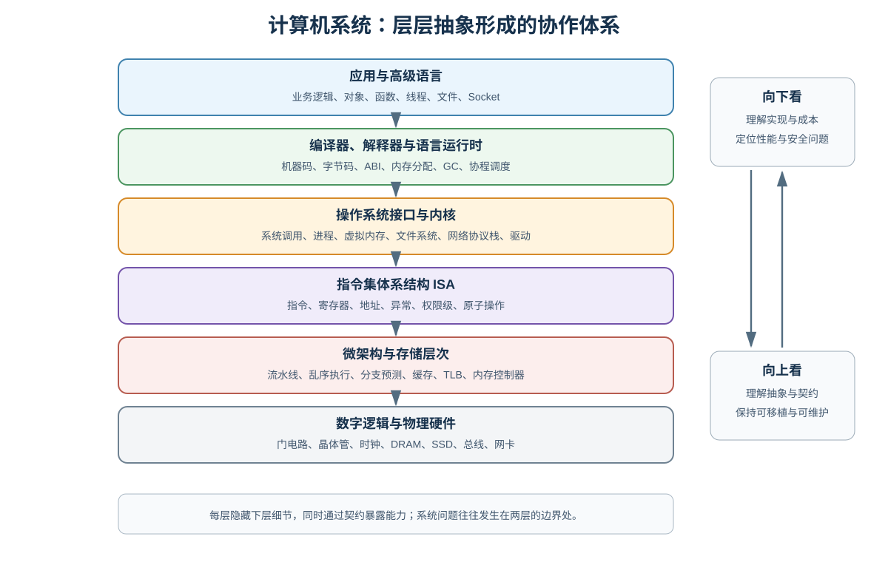
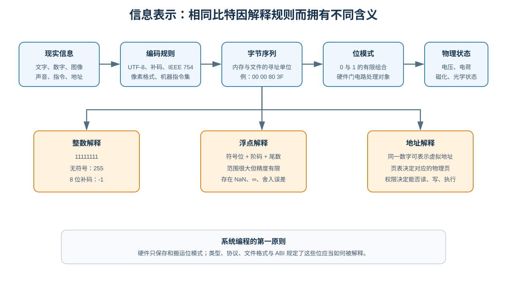
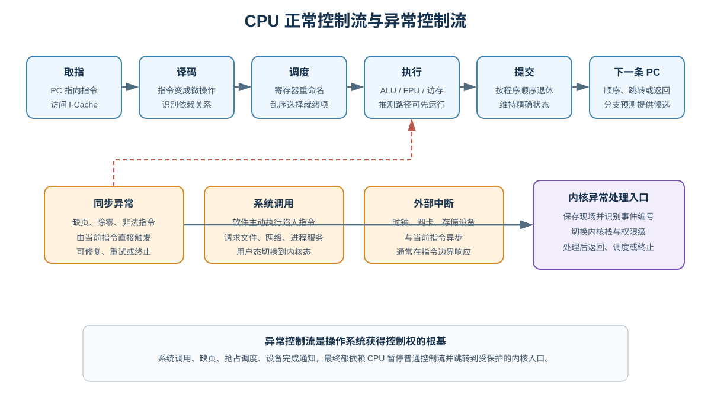
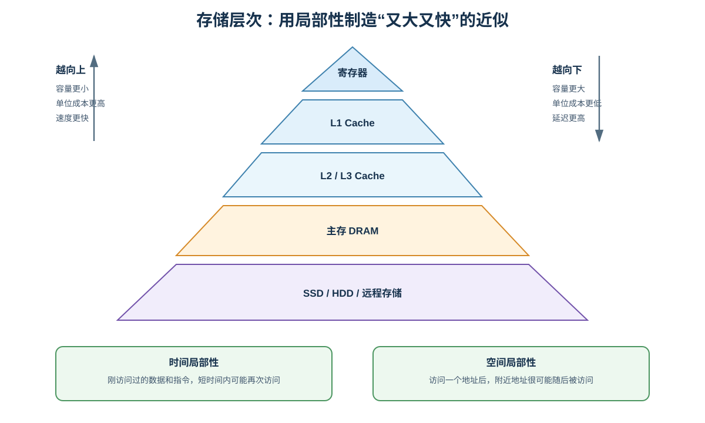
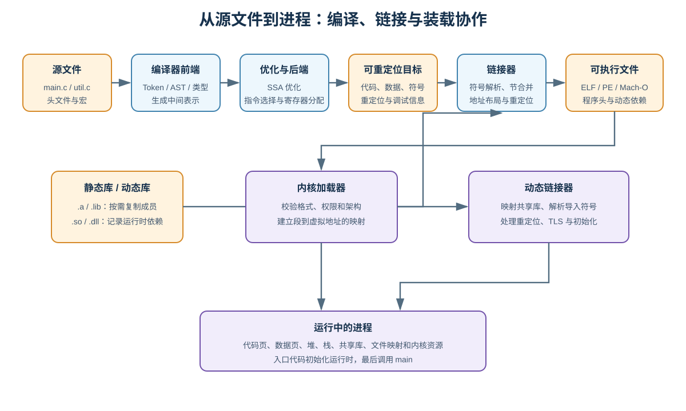
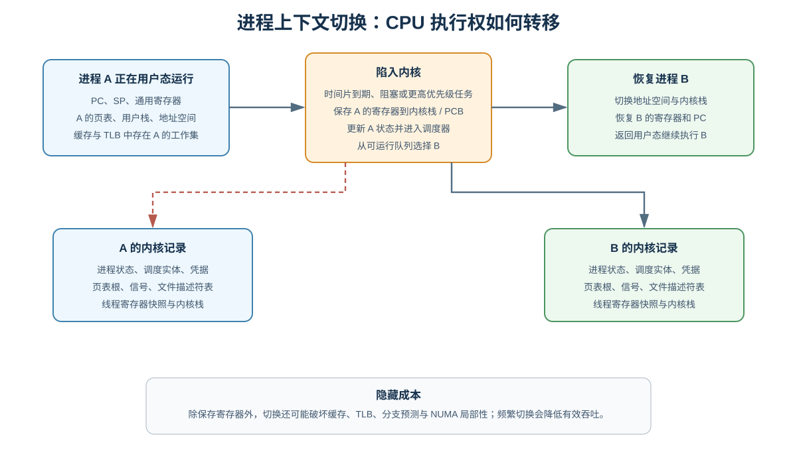
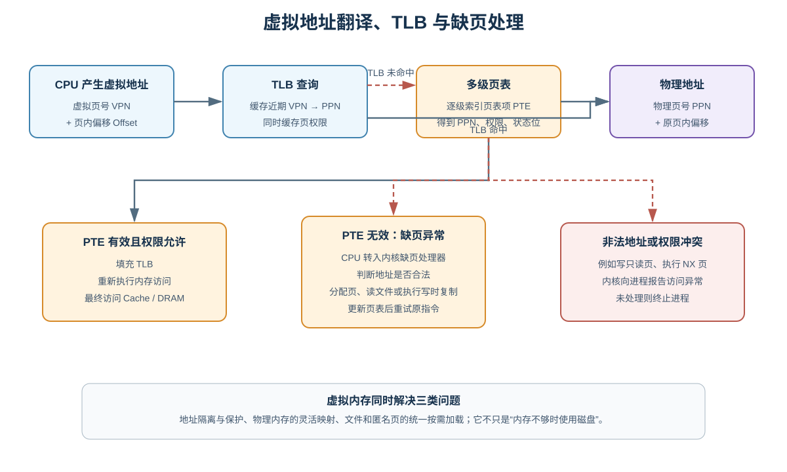
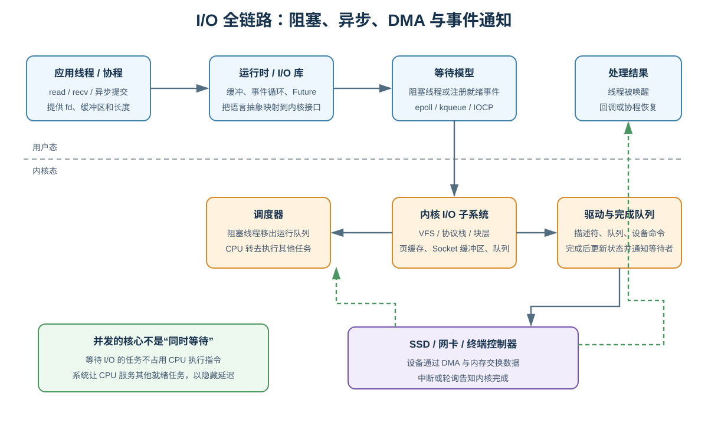

# 深入理解计算机系统

> 本文从系统程序员视角建立一张贯穿高级语言、编译器、指令集、处理器、存储层次、操作系统和网络的完整知识地图。重点不是孤立记忆术语，而是理解每一层提供什么抽象、隐藏什么成本、依赖什么契约，以及系统出现性能、正确性和安全问题时如何逐层验证。
>
> 示例主要采用现代 64 位 Linux、C 和 x86-64/AArch64 的通用概念。Windows、macOS 和其他体系结构在接口与实现上有所不同，但核心问题高度相似。所有具体地址、延迟和内部结构都可能随硬件、内核和工具链版本变化，应以当前平台文档与实测为准。

## 1. 为什么要从“系统”角度理解计算机

高级语言让我们可以写：

```c
result = query_database(request);
```

但这一行代码背后可能发生：

1. 编译器把函数调用翻译为符合 ABI 的机器指令。
2. CPU 从缓存取指、预测分支并乱序执行。
3. 程序从堆中申请请求对象，访问虚拟地址。
4. MMU 查询 TLB 和页表，把虚拟地址转换为物理地址。
5. 网络库调用 `send`，CPU 从用户态进入内核态。
6. 内核协议栈构造 TCP/IP 包，网卡通过 DMA 读取数据。
7. 当前线程等待响应，调度器切换到其他线程。
8. 网卡收包后触发通知，内核唤醒等待线程。
9. 数据库客户端解析响应，程序继续计算并释放资源。

如果只停留在语言语法层，下面这些问题很难解释：

- 为什么顺序扫描通常比随机访问快？
- 为什么程序有大量空闲内存仍会发生缺页？
- 为什么 `write` 成功不等于数据已经持久化？
- 为什么同一段代码 Debug 正常，开启优化后行为异常？
- 为什么线程越多吞吐反而越低？
- 为什么一个几 KB 的程序启动时映射了几十 MB 地址空间？
- 为什么内存泄漏、文件描述符泄漏和缓存增长要用不同方法诊断？
- 为什么系统调用、上下文切换、中断不是同一个概念？

系统知识的价值，是建立一套可验证的因果链。



### 1.1 抽象不是虚构，而是契约

每一层都通过抽象隐藏复杂性：

| 上层看到的抽象 | 下层实际机制 |
|---|---|
| 变量和对象 | 寄存器、栈、堆、字节与地址 |
| 函数 | 调用约定、栈帧、跳转与返回地址 |
| 线程 | 寄存器上下文、内核调度实体、栈 |
| 进程 | 页表、内核对象、凭据、资源表 |
| 文件 | inode/MFT、目录项、页缓存、磁盘块 |
| Socket | 协议状态机、缓冲区、包与网卡队列 |
| 虚拟机/容器 | 硬件虚拟化或内核资源隔离 |

抽象允许应用不关心硬盘型号和物理内存位置，但抽象不会消除成本。一次看似简单的对象访问可能导致缓存未命中、TLB 未命中甚至磁盘缺页。

### 1.2 三个贯穿全文的原则

1. **局部性**：缓存、虚拟内存、文件页缓存和数据库 Buffer Pool 都利用“近期或邻近数据更可能再次访问”。
2. **并发与重叠**：流水线重叠指令阶段，操作系统在 I/O 等待期间调度其他任务，网络通过窗口允许多个包在途。
3. **受控共享**：进程隔离减少意外共享；线程、共享库代码页、页缓存又在合适边界共享资源。

---

## 2. 信息表示：所有对象最终都是比特

计算机内存和存储设备只保存有限的位模式。所谓整数、字符串、图片、指令和地址，区别来自**解释规则**。



### 2.1 位、字节和机器字

- **位（bit）**：0 或 1。
- **字节（byte）**：通常为 8 位，是现代系统最常见的最小可寻址单位。
- **机器字（word）**：处理器自然处理的数据宽度，64 位平台通常以 64 位寄存器和地址为核心。

`sizeof(char) == 1` 表示一个 C 字节，不直接承诺它在所有历史机器上都是 8 位；现代通用平台通常是 8 位。

### 2.2 无符号整数与补码

一个 `w` 位无符号整数的范围是：

```text
0 ～ 2^w - 1
```

常见有符号整数采用二进制补码，范围是：

```text
-2^(w-1) ～ 2^(w-1) - 1
```

8 位模式 `11111111`：

- 按无符号解释是 `255`；
- 按 8 位补码解释是 `-1`。

补码让加法器无需为正负数设计两套逻辑。减法可转换为加上补码，溢出则截断高位。

### 2.3 整数溢出不是所有语言都相同

以 32 位为例，`INT_MAX + 1`：

- C/C++ 有符号溢出属于未定义行为，编译器可假设它不发生；
- 无符号整数按模 `2^32` 回绕；
- Java 整数按固定补码规则回绕；
- Rust Debug 构建常检查并 panic，Release 行为取决于操作与配置；
- Python 整数可自动扩展精度，代价是对象和运算开销。

安全相关长度计算应显式检查：

```c
if (count > SIZE_MAX / element_size) {
    return ERROR_OVERFLOW;
}
size_t bytes = count * element_size;
```

否则乘法先溢出成较小值，分配不足后再写入，可能造成堆越界。

### 2.4 大端序与小端序

多字节对象在内存中的字节排列称为字节序。数值 `0x12345678`：

```text
地址递增：  A     A+1   A+2   A+3
小端序：   78     56    34    12
大端序：   12     34    56    78
```

x86-64 通常是小端序；网络协议字段通常采用网络字节序（大端）。协议代码应使用标准转换函数或结构化序列化库，不要直接把内存结构体发送到网络，因为还存在对齐、填充、版本和 ABI 问题。

### 2.5 浮点数为什么“不精确”

IEEE 754 浮点数通常由符号、阶码和有效数字组成。它以有限位近似表示实数，许多十进制小数无法被二进制有限表示：

```text
0.1 + 0.2 ≠ 精确的十进制 0.3
```

浮点系统还包含：

- 正负零；
- 正负无穷；
- NaN；
- 非规格化数；
- 多种舍入模式。

金额通常使用定点整数或十进制定点类型。科学计算比较浮点数时，应根据业务误差模型选择绝对误差、相对误差或 ULP，而不是机械使用固定 `epsilon`。

### 2.6 字符与字符串

Unicode 定义码点，UTF-8/UTF-16 定义编码方式。必须区分：

- 字节数；
- Unicode 码点数；
- 用户感知字符（grapheme cluster）数；
- 屏幕显示宽度。

一个用户看到的字符可能由多个码点组成。按字节截断 UTF-8 可能产生非法序列，按码点截断也可能拆开组合字符。

### 2.7 对齐与填充

CPU 对某些对齐地址访问更高效，部分架构对未对齐访问有限制。编译器会在结构体字段间插入填充：

```c
struct Example {
    char flag;   // 1 字节
    int count;   // 常需要 4 字节对齐
};
```

该结构体常不止 5 字节。字段重排可能减少空间，但会改变 ABI 和序列化布局。使用 `#pragma pack` 或强制紧凑布局前，应评估未对齐访问和兼容性风险。

---

## 3. 程序的翻译过程

CPU 不理解 C、Go、Java 或 Python 源码，只执行机器指令。工具链负责把高级语义逐步降低为硬件可以执行的表示。

### 3.1 编译器的主要阶段

```text
源代码
  → 词法分析：字符变 Token
  → 语法分析：Token 变 AST
  → 语义分析：名称绑定与类型检查
  → 中间表示：CFG、SSA 等
  → 优化：删除、合并、重排、向量化
  → 代码生成：机器指令与目标文件
```

SSA 让每个变量版本只赋值一次，便于常量传播、死代码消除和数据流分析。后端还要解决指令选择、指令调度和寄存器分配。

### 3.2 编译器优化改变“源码直觉”

下面的循环：

```c
for (int i = 0; i < 1000; ++i) {
    sum += 2;
}
```

如果没有其他可观察效果，编译器可能直接计算结果，甚至完全删除循环。它还可能：

- 内联函数；
- 把变量只保存在寄存器中；
- 删除永远不读取的写入；
- 将多个标量操作改为 SIMD；
- 在语言内存模型允许范围内重排访问。

未定义行为会破坏优化器依赖的前提。越界、悬空指针、数据竞争和有符号溢出不是“可能得到一个奇怪结果”那么简单，编译器可能据此改写周边逻辑。

### 3.3 编译、解释与 JIT 是实现策略

| 模式 | 典型路径 | 特点 |
|---|---|---|
| AOT | 源码 → 原生机器码 | 启动直接，产物依赖平台 |
| 字节码 VM | 源码 → 字节码 → 解释/JIT | 可移植，可按运行热点优化 |
| 解释器 | 源码/字节码 → 解释循环 | 实现灵活，分派开销较高 |

解释型语言最终仍由 CPU 执行解释器机器码。JIT 可能根据类型反馈生成高度优化代码，假设失效时再去优化并退回较通用路径。

---

## 4. 机器级程序与 ABI

### 4.1 ISA 是软硬件接口

指令集体系结构（ISA）规定软件可见的：

- 指令编码与语义；
- 通用、向量和状态寄存器；
- 内存寻址方式；
- 权限级与异常模型；
- 原子指令和内存顺序；
- 可选扩展能力。

微架构负责“如何高效实现 ISA”。两颗 CPU 可以执行相同 x86-64 程序，但拥有不同流水线深度、缓存大小和执行单元。

### 4.2 汇编不等于机器码

汇编是机器指令的人类可读表示。不同汇编语法可表示同一机器码。反汇编器根据字节推断指令，但缺少符号和调试信息时，无法恢复原变量名、类型与高级控制结构。

### 4.3 ABI 让独立模块能够协作

应用二进制接口（ABI）通常约定：

- 参数放在哪些寄存器或栈位置；
- 返回值如何传递；
- 哪些寄存器由调用者/被调用者保存；
- 栈对齐；
- 结构体布局；
- 系统调用编号与参数；
- 目标文件格式、符号命名、异常展开。

同一门语言在不同平台可能使用不同 ABI。函数签名看起来一致，不代表二进制可以直接互调。

### 4.4 函数调用与栈帧

典型函数调用包含：

```text
调用者准备参数
  → 保存必要寄存器
  → 写入返回地址并跳转
  → 被调用者建立栈帧
  → 执行函数体
  → 恢复寄存器和栈指针
  → 跳回返回地址
```

栈帧可能保存局部变量、临时值、返回地址和用于回溯的信息。优化后函数可能被内联，局部变量可能被放入寄存器或完全消除，因此调试器显示的变量可能是“已优化掉”。

### 4.5 缓冲区越界为何可劫持控制流

传统栈上缓冲区与返回地址相邻时，越界写可能覆盖返回地址。现代防护包括：

- 栈保护值（canary）；
- 不可执行数据页（NX/DEP）；
- 地址空间布局随机化（ASLR）；
- 位置无关代码（PIE）；
- 控制流完整性（CFI）；
- 影子栈和指针认证；
- 内存安全语言与边界检查。

单项防护不是绝对安全。系统安全依赖编译器、操作系统、硬件和编码规范共同建立纵深防御。

---

## 5. 处理器如何执行指令



### 5.1 架构视角：取指、译码、执行

程序计数器（PC）指向下一条指令。CPU 取指、译码、读取操作数、执行、写回，再更新 PC。分支、调用和返回会改变 PC。

### 5.2 微架构视角：并行与推测

现代高性能 CPU 通常会：

1. 一次取多条指令。
2. 将复杂指令译为一个或多个微操作。
3. 重命名寄存器，消除写后读、写后写等伪依赖。
4. 把微操作放入调度窗口。
5. 操作数就绪后乱序派发到多个执行单元。
6. 在重排序缓冲区按程序顺序提交。

这种设计让等待内存的指令不必阻塞所有后续独立工作。

### 5.3 分支预测

CPU 必须在分支结果算出之前决定取哪条路径，否则深流水线会停顿。预测正确能维持吞吐，预测错误则清空错误路径，浪费已经执行的工作。

以下代码的性能可能受数据分布影响：

```c
if (values[i] > threshold) {
    total += values[i];
}
```

编译器可尝试无分支化或向量化，但是否更快应实测。为消除一个分支引入更多访存或依赖，也可能得不偿失。

### 5.4 数据依赖与指令级并行

```text
a = b + c
d = a * e
```

第二条依赖第一条结果，形成关键路径。多个相互独立的累加器有时比单一串行累加器更容易利用执行单元并行，但编译器通常会自动进行部分变换。

### 5.5 异常和中断

CPU 不会永远沿普通控制流执行。事件可分为：

| 类型 | 来源 | 示例 |
|---|---|---|
| 故障 | 当前指令，可尝试修复 | 缺页 |
| 陷阱 | 有意触发，处理后执行下一条 | 系统调用、断点 |
| 中止 | 严重且通常不可恢复 | 某些硬件错误 |
| 外部中断 | 与当前指令异步 | 时钟、网卡、存储设备 |

CPU 根据异常向量进入内核预设入口，切换权限和栈，保存足够现场。内核处理后可恢复原线程、调度其他线程或终止进程。

### 5.6 内存顺序

编译器和 CPU 都可能重排内存操作。单线程中只要保持可观察行为即可；多线程中必须依靠语言内存模型、锁、原子操作和内存屏障建立顺序。

`volatile` 常用于设备寄存器或阻止某些编译器优化，但在 C/C++ 中不等价于线程同步，也不自动提供复合操作原子性。

---

## 6. 存储层次与局部性

CPU 的计算速度远高于主存，更远高于持久化设备。系统使用多层缓存缓解速度差距。



### 6.1 缓存的基本组织

缓存按固定大小的**缓存行**传输数据，常见为 64 字节，但必须以硬件为准。一个地址通常拆分为：

```text
标记 Tag | 组索引 Set Index | 块内偏移 Offset
```

缓存通过组索引定位候选行，比较标记判断命中。组相联缓存允许同一组保留多个候选块。

### 6.2 命中、未命中与替换

缓存未命中常见原因：

- **强制未命中**：第一次访问；
- **容量未命中**：工作集大于缓存；
- **冲突未命中**：多个地址映射到有限的相同组；
- 多核系统中的一致性失效。

替换策略近似选择不再需要的行，但硬件无法知道未来，只能采用近似 LRU 等策略。

### 6.3 为什么按行遍历矩阵更快

C 二维数组按行连续存储：

```c
for (size_t i = 0; i < rows; ++i) {
    for (size_t j = 0; j < cols; ++j) {
        sum += matrix[i][j];
    }
}
```

连续访问利用同一缓存行和硬件预取。反过来按列访问可能每次跨越较大步长，导致更多缓存和 TLB 未命中。

### 6.4 写策略

- **写直达**：同时更新下一层，逻辑简单、流量较大。
- **写回**：先修改缓存行并标脏，替换时再写下一层。
- **写分配**：写未命中时先把整行取入缓存。

现代 CPU 数据缓存常采用写回和写分配的组合，但存在非临时写入等特殊机制。

### 6.5 多核缓存一致性

多个核心各有私有缓存。缓存一致性协议维护同一物理缓存行的可见状态。一个核心写入时，其他核心的副本需要失效或更新。

这引出**伪共享**：两个线程修改不同变量，但变量位于同一缓存行，缓存行仍会在核心间来回转移。可通过数据分片、适当填充和减少共享写缓解，但填充会增加内存占用。

### 6.6 NUMA

多路服务器中，内存物理上靠近某个 CPU 节点。访问本地内存通常比远端内存快。线程迁移后可能远程访问原工作集。高性能程序需要关注：

- 首次触碰分配策略；
- CPU 亲和性；
- 内存绑定；
- 跨节点共享；
- 中断和网卡队列亲和性。

---

## 7. 链接：把独立模块组合成程序



### 7.1 目标文件包含什么

可重定位目标文件通常包含：

- 机器代码；
- 只读和可写数据；
- 符号表；
- 重定位记录；
- 调试与异常展开信息；
- 各节的属性和对齐要求。

代码中调用外部函数时，编译阶段可能还不知道最终地址，于是留下符号引用和重定位项。

### 7.2 符号解析

链接器把引用绑定到定义。常见错误：

- 未定义符号；
- 重复强定义；
- 静态库顺序导致成员未被拉入；
- C/C++ 名字修饰或调用约定不匹配；
- 不同版本库导出符号不兼容。

### 7.3 静态库和动态库

静态链接从归档库中抽取需要的目标模块放入最终文件。动态链接则在可执行文件中记录依赖，运行时映射共享对象。

| 维度 | 静态链接 | 动态链接 |
|---|---|---|
| 文件体积 | 通常更大 | 主文件更小 |
| 部署依赖 | 较少 | 依赖兼容动态库 |
| 代码页共享 | 不同程序间有限 | 多进程可共享库代码页 |
| 升级 | 需重新链接/发布 | 可单独升级，但有兼容风险 |
| 启动工作 | 较少动态解析 | 需装载和重定位 |

### 7.4 位置无关代码与 ASLR

位置无关代码使用相对寻址和间接表，允许模块装载到不同地址。ASLR 随机化栈、堆、共享库和程序基址，提高利用内存破坏漏洞的难度。

### 7.5 符号插桩与动态绑定

ELF 系统常通过 GOT/PLT 支持外部符号和延迟绑定。第一次调用可能进入解析器，之后表项指向真实函数。立即绑定能在启动时完成全部解析，并配合只读重定位保护减少表项被篡改的风险。

### 7.6 装载不等于全部读取

内核根据程序头建立文件到虚拟地址的映射。真正访问某页时才可能从页缓存或存储设备取入，因此大型可执行文件不必在启动前完整读进物理内存。

---

## 8. 异常控制流

普通控制流由跳转、调用和返回构成；异常控制流让操作系统、运行时和应用可以响应外部事件。

### 8.1 系统调用

用户程序把系统调用号和参数放入约定寄存器，执行专用指令进入内核。内核必须验证：

- 系统调用号；
- 文件描述符或句柄；
- 用户指针是否位于可访问地址；
- 长度是否溢出；
- 当前凭据是否有权限；
- 资源限制是否允许操作。

系统调用是权限切换，但不必然发生调度意义上的线程上下文切换。立即完成的调用可以直接返回同一线程。

### 8.2 信号

Unix 信号是内核向进程报告事件的机制。信号可被默认处理、忽略、阻塞或交给处理函数，但 `SIGKILL` 和 `SIGSTOP` 不能被捕获。

信号处理函数异步打断普通代码，只能安全调用异步信号安全函数。复杂清理逻辑更适合通过自管道、`signalfd` 或设置原子标志转移到正常控制流。

### 8.3 非本地跳转与语言异常

`setjmp/longjmp`、C++ 异常、Java/Python 异常都能跨越普通调用返回路径。运行时可能依赖栈展开元数据执行清理并寻找处理器。异常不应被当作零成本机制；“正常路径零开销”通常意味着成本转移到抛出路径和元数据。

---

## 9. 进程：隔离的执行环境

进程不是“正在执行的文件”这么简单，而是内核管理的一组资源和保护边界。

### 9.1 进程包含什么

- 一个虚拟地址空间；
- 一个或多个线程；
- 文件描述符/句柄表；
- 当前目录、根目录和环境；
- 用户身份、组、能力与安全上下文；
- 信号状态；
- IPC 和命名空间关系；
- 资源限制、记账和调度信息。

程序是静态文件，进程是一次动态实例。同一程序可对应多个相互隔离的进程。

### 9.2 Linux 的 `fork` 与 `exec`

`fork` 创建与父进程近似相同的子进程。现代内核不会立即复制全部物理页，而是使用写时复制：

1. 父子页表指向相同物理页。
2. 共享页临时标记为只读。
3. 任一方写入触发缺页。
4. 内核复制该页并更新写入方页表。

`execve` 不创建新 PID，而是用新程序替换当前进程的地址空间和执行上下文。Shell 常先 `fork`，子进程设置重定向后再 `execve`。

### 9.3 文件描述符继承

`fork` 后父子描述符表项可指向同一个内核打开文件对象，因此共享文件偏移和状态。`exec` 默认保留未设置 close-on-exec 的描述符。

错误继承敏感描述符会造成：

- 子进程意外持有监听端口；
- 管道因仍有写端而永不 EOF；
- 凭据或密钥文件泄漏；
- 资源无法及时释放。

创建描述符时优先原子设置 `CLOEXEC`，避免多线程下先创建再设置之间的竞争窗口。

---

## 10. 线程与调度

线程是内核 CPU 调度的基本实体之一。同一进程线程共享地址空间和大部分资源，但拥有独立寄存器、用户栈、内核栈和线程局部存储。

### 10.1 线程状态

```text
新建 → 可运行 ⇄ 运行 → 睡眠/阻塞 → 可运行
                    └→ 退出
```

“可运行”表示具备执行条件，不代表正在 CPU 上执行。系统中可运行线程数远多于逻辑 CPU 时，会竞争时间片。

### 10.2 调度目标

通用调度器需要平衡：

- 吞吐量；
- 交互延迟；
- 公平性；
- 优先级；
- 实时截止期；
- 能耗；
- CPU 和 NUMA 亲和性。

不同目标会冲突。例如批处理追求吞吐，交互应用更重视尾延迟，实时系统关注最坏情况是否满足截止期。

### 10.3 上下文切换



上下文切换通常包括：

1. 当前线程通过中断、异常或系统调用进入内核。
2. 内核保存寄存器和调度状态。
3. 调度器选择另一个可运行线程。
4. 必要时切换页表、地址空间标识和内核栈。
5. 恢复目标线程寄存器。
6. 返回目标线程用户态。

成本不只在保存几十个寄存器，还包括缓存工作集被替换、TLB 状态变化和跨 NUMA 节点迁移。

### 10.4 用户态协程

协程由语言运行时调度，可在用户态保存少量上下文并复用少量内核线程。它适合大量 I/O 并发，但不是“没有线程”：

- 阻塞系统调用若未被运行时接管，可能阻塞承载线程；
- CPU 密集协程仍需要 CPU 核心；
- 调试和性能归因要同时观察协程与内核线程；
- 运行时调度不能绕过内核最终调度。

---

## 11. 虚拟内存：地址空间的核心抽象

虚拟内存不是简单的“内存不足时拿磁盘顶替”，它同时提供隔离、保护、映射和按需加载。



### 11.1 地址翻译

虚拟地址分为虚拟页号和页内偏移。页表把虚拟页号映射到物理页框号，偏移保持不变。

多级页表只为使用到的地址范围分配下级表，避免为巨大而稀疏的地址空间准备一张平坦大表。

### 11.2 TLB

每次访存都走多级页表成本过高，CPU 用 TLB 缓存近期翻译。TLB 未命中不一定是缺页：

- TLB 未命中：翻译缓存里没有，需要查页表；
- 缺页：页表项表明当前映射不存在、尚未装入或需特殊处理。

大页减少相同内存容量需要的页表项和 TLB 项，但会增加内部碎片、分配和迁移难度。

### 11.3 页表权限

页表项通常携带：

- 是否存在；
- 用户态能否访问；
- 可读、可写、可执行；
- 是否被访问、是否脏；
- 缓存属性；
- 物理页号。

W^X 原则尽量避免同一页面同时可写和可执行。JIT 运行时需要在生成代码和执行代码之间谨慎切换权限。

### 11.4 缺页的不同含义

**次缺页（minor fault）**可能只需：

- 分配零页；
- 建立已有页缓存的映射；
- 执行写时复制；
- 恢复先前已在内存中的页。

**主缺页（major fault）**通常需要等待存储 I/O，成本大得多。

### 11.5 内存映射

`mmap` 可以映射：

- 可执行文件和共享库；
- 普通文件；
- 匿名内存；
- 共享内存；
- 某些设备内存。

文件映射让文件 I/O 与虚拟内存统一到页缓存。访问映射区域像访问内存，但首次触碰、脏页回写和 I/O 错误仍可能在看似普通的读写指令中发生。

### 11.6 写时复制

写时复制用于：

- `fork` 后共享父子页面；
- 多进程共享只读代码页；
- 私有文件映射；
- 零页优化。

逻辑复制先变成共享，真正写入时才按页复制，适合“大部分不修改”的场景。

### 11.7 内存压力与换页

内核需要在匿名页、文件页缓存和内核内存间平衡。内存压力下可：

- 丢弃干净文件页，未来从文件重读；
- 回写脏文件页；
- 把匿名页换出；
- 压缩内存；
- 回收内核缓存；
- 在无法满足分配时触发 OOM 处理。

“free 很少”不一定异常，空闲内存可被页缓存利用。更应观察可回收缓存、可用内存、换页、工作集和内存压力。

---

## 12. 动态内存分配与垃圾回收

### 12.1 分配器为什么存在

每次 `malloc` 都直接向内核申请会很慢。用户态分配器通常：

- 从内核申请较大区域；
- 按大小类别维护空闲块；
- 为线程设置本地缓存；
- 合并相邻空闲块；
- 仅在合适时把部分内存归还内核。

因此 `free` 后 RSS 不立即下降并不必然是泄漏。

### 12.2 碎片

- **内部碎片**：分配块大于请求大小。
- **外部碎片**：空闲总量足够，但缺少连续的大块。

线程缓存提高并发性能，也可能让空闲内存分散在多个 arena 中，增加驻留内存。

### 12.3 常见内存错误

- 越界读写；
- use-after-free；
- double free；
- 未初始化读取；
- 分配大小整数溢出；
- 所有权不清导致泄漏；
- 跨分配器或跨模块释放不兼容对象。

可使用 AddressSanitizer、MemorySanitizer、Valgrind、堆分析器和语言运行时诊断工具，但测试环境中的插桩会改变内存布局和性能。

### 12.4 垃圾回收

追踪式 GC 从根对象出发标记可达对象，未被标记的对象可回收。常见设计维度：

- 标记-清除、标记-整理、复制；
- 分代；
- 并发或停止世界；
- 精确或保守扫描；
- 写屏障和读屏障；
- 吞吐、延迟和内存占用权衡。

GC 解决“何时释放托管内存”，不负责关闭文件、回滚事务或释放远程租约。外部资源仍应使用显式生命周期管理。

---

## 13. 文件与统一 I/O 抽象

Unix 把许多对象抽象为文件描述符：普通文件、管道、终端、Socket、设备和事件对象可以使用相似的读写接口。

### 13.1 描述符的层次

概念上：

```text
进程文件描述符表
  → 内核打开文件对象（偏移、状态标志）
  → inode / Socket / 管道 / 设备对象
```

多个描述符可通过 `dup` 或 `fork` 指向同一个打开文件对象，因此共享文件偏移。再次独立 `open` 通常创建新的打开文件对象。

### 13.2 短读和短写

`read(fd, buf, n)` 返回小于 `n` 不一定是错误；`write` 也可能只写入部分数据。网络、管道、非阻塞 I/O 和信号中断下必须循环处理。

```c
size_t written = 0;
while (written < length) {
    ssize_t n = write(fd, buffer + written, length - written);
    if (n > 0) {
        written += (size_t)n;
        continue;
    }
    if (n < 0 && errno == EINTR) {
        continue;
    }
    return ERROR_WRITE;
}
```

生产代码还需处理非阻塞的 `EAGAIN`、超时和取消。

### 13.3 用户态缓冲、页缓存与设备缓存

写文件可能经过多层：

```text
语言/标准库缓冲
  → write 系统调用
  → 内核页缓存
  → 文件系统
  → 块设备队列
  → 设备控制器缓存
  → 持久介质
```

`fflush` 只保证把标准库缓冲交给内核；`fsync` 试图把文件数据和必要元数据推进稳定存储，但断电语义还依赖文件系统、设备写缓存和屏障实现。

### 13.4 零拷贝是相对概念

`sendfile`、内存映射、DMA 和页引用传递可以减少用户态/内核态复制及上下文切换，但数据仍可能在缓存、内存控制器、设备与网络之间移动。“零拷贝”通常指减少某条路径中的 CPU 数据复制，不是没有数据移动。

---

## 14. 文件系统与持久化

### 14.1 文件系统解决什么

文件系统把块设备抽象为：

- 命名空间和目录；
- 文件内容与随机访问；
- 权限、所有者、时间戳；
- 空闲空间管理；
- 崩溃后可恢复的一致性结构。

### 14.2 inode 与目录项

典型 Unix 文件系统中：

- 目录项把名字映射到 inode 编号；
- inode 保存类型、权限、大小、时间和数据块映射；
- 硬链接是多个目录项指向同一 inode；
- 符号链接保存另一个路径字符串。

删除文件名只是移除目录项。只有链接计数为零且没有进程继续打开该文件时，数据空间才可回收。这解释了“日志文件已删除但磁盘空间未释放”的常见现象。

### 14.3 日志与写时复制

崩溃可能发生在多步元数据更新之间。日志文件系统先记录即将执行的事务，恢复时重放或撤销；写时复制文件系统写新块后再原子切换根指针。

它们主要保证文件系统结构一致，不自动保证应用业务一致性。应用仍需设计：

- 写临时文件；
- 刷新数据；
- 原子重命名；
- 必要时刷新目录；
- 版本号、校验和或事务日志。

### 14.4 RAID 不是备份

RAID 提高设备故障容忍或吞吐，但无法防止误删除、勒索软件、应用逻辑错误和整机灾难。备份需要独立故障域、版本保留和定期恢复演练。

---

## 15. I/O、DMA 与事件驱动



### 15.1 中断驱动与轮询

- **中断**：设备有事件时通知 CPU，低负载节能，但高频事件会产生中断开销。
- **轮询**：CPU 主动检查队列，高负载下可降低通知延迟，但空闲时浪费 CPU。

高性能网络常采用中断合并、预算轮询或忙轮询，在吞吐和延迟之间平衡。

### 15.2 DMA

CPU 配置描述符和设备寄存器后，DMA 控制器可在设备与内存之间搬运数据。完成后通过中断或完成队列通知 CPU。DMA 减少 CPU 逐字节复制，但仍需处理：

- 内存固定与映射；
- 缓存一致性；
- IOMMU 地址翻译和隔离；
- 队列所有权；
- 内存屏障。

### 15.3 五种常见 I/O 模型

| 模型 | 等待方式 | 典型特点 |
|---|---|---|
| 阻塞 I/O | 调用线程睡眠 | 简单，线程多时资源成本上升 |
| 非阻塞 I/O | 立即返回是否就绪 | 直接忙轮询会浪费 CPU |
| I/O 多路复用 | 等多个描述符就绪 | `select`/`poll`/`epoll`/`kqueue` |
| 信号驱动 | 信号通知就绪 | 编程复杂，使用较少 |
| 异步 I/O | 提交操作，完成后通知 | IOCP、`io_uring` 等实现各异 |

“就绪通知”表示现在读写大概率不会阻塞；“完成通知”表示具体 I/O 已完成。不同 API 的语义必须区分。

### 15.4 边缘触发与水平触发

- 水平触发：只要仍可读，就持续报告。
- 边缘触发：状态从不可读变为可读时通知，应用必须读到 `EAGAIN`。

边缘触发减少重复通知，但遗漏排空循环可能导致连接看似永久卡住。

### 15.5 背压

当生产速度持续高于消费速度时，缓冲区只能延迟失败，不能消除失败。系统必须通过：

- 限制队列长度；
- 阻塞或减慢生产者；
- 拒绝请求；
- 丢弃低价值数据；
- 动态调整并发；
- 超时与熔断；

把压力反馈到上游。无界队列往往把过载转化为内存耗尽和巨大尾延迟。

---

## 16. 并发与同步

### 16.1 三类并发问题

1. **竞态**：结果依赖不可控执行顺序。
2. **死锁**：参与者循环等待，无法前进。
3. **活锁/饥饿**：系统仍在动作，但特定任务长期无进展。

### 16.2 原子性、可见性、有序性

`counter++` 通常是读、加、写三个步骤，并非天然原子。正确同步要回答：

- 哪些操作必须作为一个整体？
- 一个线程的写何时对另一个线程可见？
- 哪些操作不能跨同步边界重排？

锁、原子变量、通道和事务是不同级别的解决方案。

### 16.3 互斥锁

无竞争锁可能只需用户态原子指令；竞争时线程进入内核等待队列。锁的主要风险：

- 临界区太大；
- 锁顺序不一致导致死锁；
- 持锁执行阻塞 I/O；
- 优先级反转；
- 热锁导致缓存行争用；
- 错误处理中忘记释放。

应先缩小共享状态和所有权边界，再考虑更复杂的锁优化。

### 16.4 条件变量

条件变量必须与谓词和互斥锁一起使用：

```c
pthread_mutex_lock(&mutex);
while (!condition_is_true()) {
    pthread_cond_wait(&condition, &mutex);
}
consume_state();
pthread_mutex_unlock(&mutex);
```

使用 `while` 是因为可能发生虚假唤醒，或条件在该线程真正获得锁前已被其他线程消费。

### 16.5 信号量、读写锁与屏障

- 信号量管理有限数量的许可；
- 读写锁允许多个读者或单个写者；
- 屏障让一组线程在某阶段会合；
- 闩锁常用于等待一次性完成事件。

读写锁并不必然比互斥锁快。临界区短、写频繁或核心数不高时，其状态管理和公平策略可能更贵。

### 16.6 原子操作与无锁结构

CAS 比较内存值，匹配时原子替换。无锁算法还需处理：

- ABA 问题；
- 内存回收安全；
- 内存顺序；
- 失败重试和高争用；
- 可证明的前进保证。

“无锁”不等于“无等待”，也不保证比成熟互斥锁更快。只有测量证明锁是瓶颈且团队能维护正确性时，才值得引入。

### 16.7 线程安全不等于业务正确

容器方法各自线程安全，多个方法组合仍可能不是原子事务：

```text
if key 不存在:
    插入 key
```

检查与插入之间可能被其他线程穿插。应使用原子 `put-if-absent`、事务或在更高层加锁。

---

## 17. 网络也是系统的一部分

### 17.1 发送数据的路径

```text
应用缓冲区
  → Socket API
  → TCP/UDP
  → IP 路由
  → 链路层帧
  → 网卡发送队列
  → 物理网络
```

接收路径反向进行。网卡通过 DMA 把帧放入内存，内核驱动和协议栈校验、解封装，再把数据交给 Socket 接收缓冲区。

### 17.2 TCP 提供什么

TCP 提供有序、可靠的字节流，不保留应用消息边界。一次 `send` 不对应一次 `recv`。应用协议必须定义：

- 固定长度；
- 分隔符；
- 长度前缀；
- 自描述格式。

TCP 可靠性来自序列号、确认、重传、流量控制和拥塞控制。`write` 成功通常只表示数据进入本机发送缓冲区，不表示对端应用已经处理。

### 17.3 延迟的组成

端到端延迟可能包含：

- DNS；
- TCP/TLS 握手；
- 排队；
- 传播；
- 序列化与反序列化；
- 服务端调度；
- 缓存、数据库和下游调用；
- 重传；
- GC 和上下文切换。

平均延迟无法代表尾部体验。生产系统应观察 P50、P95、P99、P99.9，并结合吞吐、错误率和并发量分析。

### 17.4 零拷贝和网卡卸载

TSO/GSO、GRO、校验和卸载、RSS、多队列等机制把部分分段、聚合和分流工作交给内核或网卡。抓包点不同，看到的数据包形态可能不同，不能简单认为抓包工具展示的每个“大包”都以相同形态出现在物理网络。

---

## 18. 启动：系统如何从断电状态运行起来

### 18.1 固件阶段

上电后 CPU 从规定复位向量开始执行固件。UEFI/固件初始化基本硬件、枚举设备、选择启动项并加载引导程序。

### 18.2 引导程序

引导程序加载内核和初始内存文件系统，准备启动参数和内存映射，把控制权交给内核入口。

### 18.3 内核初始化

内核逐步建立：

- 页表和内存管理；
- 中断与时钟；
- CPU 调度器；
- 设备驱动；
- VFS 和根文件系统；
- 网络栈；
- 第一个用户态进程。

### 18.4 用户空间

初始化系统启动服务管理器，挂载文件系统、配置网络、启动日志、守护进程和登录环境。容器或应用进程是在这条链路很后面才出现的。

---

## 19. 虚拟机与容器

### 19.1 虚拟机

虚拟机监控器利用硬件虚拟化让多个客户操作系统共享物理机。每个客户机拥有自己的内核，隔离边界较强，但需要处理：

- 客户虚拟地址到客户物理地址；
- 客户物理地址到宿主物理地址；
- 虚拟中断和设备；
- vCPU 调度；
- 内存超分与气球；
- 虚拟 I/O。

### 19.2 容器

容器通常共享宿主内核，依赖：

- namespace 隔离 PID、网络、挂载、用户等视图；
- cgroup 限制和统计 CPU、内存、I/O；
- capabilities 拆分 root 权限；
- seccomp 限制系统调用；
- 分层文件系统提供镜像。

容器不是轻量虚拟机。容器内看到的 CPU 数、内存和 PID 视图可能经过限制，应用运行时必须识别 cgroup 配额，否则可能创建过多线程或误判可用内存。

### 19.3 隔离不是绝对边界

共享内核意味着内核漏洞可能跨容器边界。高风险多租户场景可能采用虚拟机、轻量虚拟机、用户态内核等加强隔离，并结合最小权限和供应链控制。

---

## 20. 系统安全的底层基础

### 20.1 最小权限

程序只应获得完成任务所需的最小文件、网络、设备和系统调用权限。长期以 root 运行会放大任何内存破坏、命令注入和依赖漏洞的影响。

### 20.2 地址空间保护

页表权限、用户态/内核态、进程隔离和 IOMMU 构成内存保护基础。NX 阻止数据页直接执行，SMEP/SMAP 等机制进一步限制内核错误访问用户页。

### 20.3 输入验证的系统含义

所有跨边界数据都不可信：

- 系统调用参数；
- 网络包和应用协议；
- 文件格式；
- IPC 消息；
- 环境变量和命令行；
- 设备输入；
- 反序列化对象。

验证不仅是业务字段检查，还包括长度、整数溢出、递归深度、压缩比、资源配额和状态机合法性。

### 20.4 侧信道

缓存、分支预测、执行时间、页错误和共享资源竞争可能泄漏秘密。恒定时间算法、隔离核心、减少共享和硬件缓解可降低风险，但需要明确威胁模型，不能只看功能输出是否正确。

---

## 21. 性能分析：从测量开始

### 21.1 性能的基本量

- **延迟**：完成一次请求所需时间。
- **吞吐**：单位时间完成的工作量。
- **并发**：同时处于系统中的工作数量。
- **利用率**：资源忙碌程度。
- **饱和度**：等待该资源的工作量。

Little 定律在稳定系统中给出：

```text
系统中的平均任务数 L = 到达率 λ × 平均停留时间 W
```

延迟上升会让在途请求增加；如果继续无限接收请求，排队会进一步放大延迟。

### 21.2 Amdahl 定律

只优化程序的一部分，整体加速受该部分占比限制：

```text
Speedup = 1 / ((1 - P) + P / S)
```

其中 `P` 是可优化部分占比，`S` 是该部分加速倍数。把仅占 1% 的函数优化 100 倍，整体仍只改善约 1%。

### 21.3 CPU 分析

关注：

- 用户态与内核态 CPU 时间；
- 指令数、周期数和 IPC；
- 热点函数与调用栈；
- 分支预测失败；
- 前端/后端停顿；
- 缓存和 TLB 未命中；
- 锁竞争与运行队列。

不要根据源码行数猜热点。优化前后应使用一致负载、重复测量并报告方差。

### 21.4 内存分析

区分：

- 虚拟地址空间大小；
- RSS；
- 私有脏页；
- 共享页；
- 堆保留与实际对象；
- 页缓存；
- 换入换出；
- 分配速率和对象存活率。

单看进程 VSZ 或系统 `free` 很容易误判。

### 21.5 I/O 分析

观察：

- 请求吞吐和平均/尾延迟；
- 队列深度；
- 随机/顺序、读/写比例；
- 请求大小；
- 缓存命中；
- `fsync` 延迟；
- 设备利用率和错误；
- 网络丢包、重传和拥塞窗口。

高设备利用率可能是有效批量吞吐，也可能意味着长队列和尾延迟恶化，必须结合业务指标解释。

### 21.6 常用 Linux 工具

```bash
# 进程、线程与系统概览
ps -ef
top
pidstat -p <PID> 1

# 系统调用
strace -f -tt -T -o trace.log ./app

# CPU 计数器与采样
perf stat ./app
perf record -g -p <PID>
perf report

# 内存映射与状态
cat /proc/<PID>/maps
cat /proc/<PID>/smaps_rollup
cat /proc/<PID>/status

# 打开文件与网络
lsof -p <PID>
ss -tanp

# 系统级 CPU、内存和 I/O
vmstat 1
iostat -xz 1
sar -n DEV 1
```

这些工具会带来不同程度扰动。`strace` 尤其会改变系统调用时序，不应把其耗时直接当作无探针状态下的真实延迟。

---

## 22. 可靠性：故障是系统正常状态

### 22.1 部分失败

分布式系统中，调用方超时不代表服务端没执行。可能发生：

1. 服务端完成写入；
2. 响应在网络中丢失；
3. 客户端超时重试；
4. 操作被执行第二次。

因此重试必须与幂等键、去重、事务状态或可安全重复的操作结合。

### 22.2 超时、重试与退避

- 每个远程调用必须有超时；
- 超时预算应沿调用链递减；
- 重试应限制次数并采用指数退避和随机抖动；
- 只重试可恢复错误；
- 防止所有客户端同时重试形成重试风暴。

### 22.3 崩溃一致性

应用更新多个持久化对象时，要考虑任意一步后断电。常见方法：

- 预写日志；
- 数据库事务；
- 双写版本和校验；
- 临时文件 + 原子替换；
- append-only 日志；
- 幂等恢复流程。

### 22.4 可观测性

日志、指标和追踪回答不同问题：

- 日志记录离散事件及上下文；
- 指标聚合趋势、容量和告警；
- 追踪关联一次请求跨服务路径；
- Profiling 解释资源消耗落在哪段代码。

可观测性应围绕明确问题设计，避免无限制高基数标签、敏感数据泄漏和同步日志拖垮关键路径。

---

## 23. 一个网络请求的端到端旅程

假设浏览器请求一个运行在服务器上的 API：

```text
GET /orders/123
```

### 23.1 客户端准备

1. 应用构造 URL 和请求头。
2. DNS 缓存未命中时查询域名地址。
3. 创建 Socket，内核选择源端口和路由。
4. TCP 建立连接；HTTPS 还进行 TLS 握手和证书校验。
5. 应用序列化 HTTP 请求并写入 Socket。

### 23.2 客户端内核与网卡

1. TCP 将字节组织为序列空间，受发送窗口和拥塞窗口限制。
2. IP 层选择路由，链路层解析下一跳地址。
3. 数据进入队列，网卡通过 DMA 读取描述符和数据。
4. 网卡发送信号，交换机和路由器逐跳转发。

### 23.3 服务端接收

1. 网卡把帧 DMA 到接收缓冲并通知 CPU。
2. 驱动和协议栈处理 Ethernet、IP、TCP。
3. TCP 校验序列号，重组字节流，放入 Socket 缓冲区。
4. `epoll`/IOCP 等机制通知事件循环。
5. 运行时恢复对应协程或分配工作线程。

### 23.4 应用处理

1. HTTP 解析器验证请求行、头和长度限制。
2. 路由找到处理函数。
3. 鉴权代码读取缓存或数据库。
4. 数据库客户端通过另一个 Socket 发出查询。
5. 当前任务等待 I/O，CPU 去执行其他可运行任务。
6. 响应到达后，程序反序列化数据并执行业务逻辑。

### 23.5 内存与 CPU 层

整个过程中不断发生：

- 对象分配和释放；
- 指令与数据缓存访问；
- 虚拟地址翻译；
- 分支预测；
- 锁和原子操作；
- 系统调用；
- 上下文切换；
- GC 或内存回收。

### 23.6 返回响应

应用序列化响应，写入 Socket。`write` 成功只表示内核接受了一定字节，不保证客户端已收到。TCP 负责重传和有序交付，客户端协议栈最终唤醒浏览器任务。

### 23.7 任一层都可能形成瓶颈

| 现象 | 可能层次 |
|---|---|
| CPU 100%，吞吐不升 | 计算热点、锁、调度、缓存未命中 |
| CPU 不高但延迟大 | I/O 等待、下游、排队、限流 |
| P99 突刺 | GC、缺页、重传、队列、冷缓存 |
| 内存持续增长 | 对象泄漏、分配器保留、页缓存、队列积压 |
| 偶发连接失败 | 端口耗尽、队列满、DNS、NAT、超时 |
| 重启后数据丢失 | 用户缓冲、页缓存、错误持久化协议 |

---

## 24. 系统问题的分层诊断法

### 24.1 先定义现象

不要只说“系统很慢”，应明确：

- 哪个请求或任务？
- 从何时开始？
- P50/P99 分别怎样？
- 吞吐和错误率是否变化？
- 影响全部实例还是部分实例？
- 是否与发布、流量、数据规模或硬件事件相关？

### 24.2 判断瓶颈类型

1. CPU 是否饱和？运行队列是否积压？
2. 内存是否有压力、换页或频繁缺页？
3. 磁盘/网络是否高延迟或队列过长？
4. 线程在运行、等待 I/O 还是等待锁？
5. 下游延迟是否传导？
6. 应用内部队列是否无界增长？

### 24.3 从宏观到微观收集证据

```text
业务指标
  → 主机资源与容器限制
  → 进程/线程状态
  → 系统调用与等待点
  → Profile 和硬件计数器
  → 源码、汇编与数据布局
```

先判断资源和等待类型，再深入具体函数，避免在错误层次优化。

### 24.4 建立可证伪假设

错误方式：

> 我觉得是数据库慢。

更好方式：

> P99 上升期间，工作线程大部分阻塞在数据库 Socket 读取；数据库查询追踪显示相同时间段锁等待上升。若降低冲突事务或切换只读副本，线程等待和请求 P99 应同步下降。

每次只改变一个主要变量，保留对照并记录测量条件。

---

## 25. 常见误区

### 误区 1：CPU 一次只执行一条指令

ISA 提供顺序语义视图，现代 CPU 内部可同时取指、译码和执行多个微操作，并进行乱序和推测。

### 误区 2：内存地址就是物理内存位置

用户程序通常使用虚拟地址，经 TLB 和页表翻译。相同虚拟地址在不同进程可映射到不同物理页。

### 误区 3：程序启动时会完整加载进内存

可执行文件和动态库通常按页映射并按需调入。

### 误区 4：系统调用一定发生上下文切换

系统调用发生权限切换；只有调度到其他线程时才是调度意义的上下文切换。

### 误区 5：`free` 后内存必须立即下降

分配器可保留空闲块供复用，RSS 还受碎片、arena 和页面回收影响。

### 误区 6：多线程一定更快

串行比例、锁竞争、内存带宽、缓存一致性和调度开销都会限制扩展。

### 误区 7：异步 I/O 不使用线程

应用可能不为每个连接分配线程，但运行时、内核、驱动和设备仍有执行上下文及队列。

### 误区 8：磁盘写入成功就不会丢

数据可能仍在用户缓冲、页缓存或设备易失缓存中。持久化需要端到端保证。

### 误区 9：容器拥有独立内核

普通容器共享宿主内核，只隔离资源视图并施加限制。

### 误区 10：平均延迟低就代表系统健康

少量极慢请求会被平均值掩盖，应结合百分位、错误率、排队和负载观察。

---

## 26. 学习与实践路线

### 第一阶段：建立可执行模型

- 熟悉二进制、补码、浮点、字节序和对齐；
- 编写小型 C 程序并观察预处理、汇编和目标文件；
- 使用调试器观察寄存器、栈和内存；
- 理解函数调用与 ABI。

### 第二阶段：理解进程和内存

- 观察 `/proc/<PID>/maps`；
- 实验 `fork`、`exec`、管道和重定向；
- 比较匿名映射、文件映射与堆分配；
- 记录次缺页和主缺页；
- 使用内存检查器定位越界和泄漏。

### 第三阶段：理解并发与 I/O

- 实现线程池和有界队列；
- 分析互斥锁、条件变量和原子操作；
- 比较阻塞模型与事件循环；
- 观察短读、短写、背压和超时；
- 使用线程分析器验证数据竞争。

### 第四阶段：系统性能实验

- 改变数据布局，测量缓存未命中；
- 改变线程数，画出吞吐与延迟曲线；
- 比较顺序/随机 I/O 和不同请求大小；
- 使用 Flame Graph 和硬件计数器定位热点；
- 在容器配额下验证运行时线程与内存行为。

### 第五阶段：可靠性与安全

- 模拟进程在持久化各步骤崩溃；
- 验证重试幂等性；
- 对协议解析器做模糊测试；
- 启用编译器加固和 Sanitizer；
- 演练限流、过载、依赖超时和故障恢复。

---

## 27. 总结

计算机系统不是一组彼此孤立的知识点，而是一条连续协作链：

```text
高级语言与数据模型
  → 编译器、链接器和 ABI
  → 机器指令与处理器流水线
  → 缓存、TLB、主存和持久化设备
  → 异常、系统调用与操作系统内核
  → 进程、线程、虚拟内存和文件
  → I/O、网络、并发与分布式服务
```

真正“深入理解”的标志，不是记住某颗 CPU 的固定延迟或某个内核版本的数据结构，而是能够：

1. 明确当前讨论位于哪一层。
2. 说清这一层向上提供的契约。
3. 理解它向下依赖的机制与成本。
4. 用工具观测真实行为，而不是仅凭直觉。
5. 在性能、正确性、安全和复杂度之间做可解释的工程权衡。

当应用出现一次慢请求、一个内存异常或一次数据丢失时，这套跨层模型能把“现象”还原成可验证的事件链，也能让优化从局部技巧升级为系统工程。
