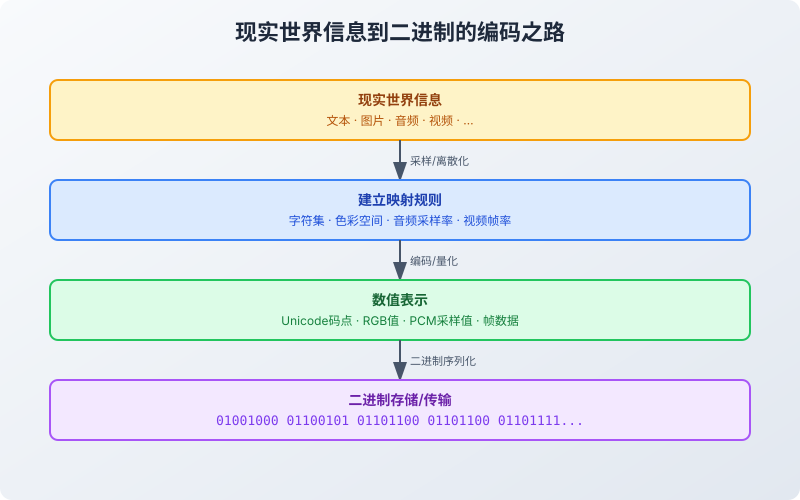
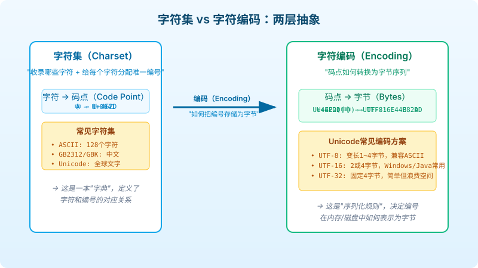
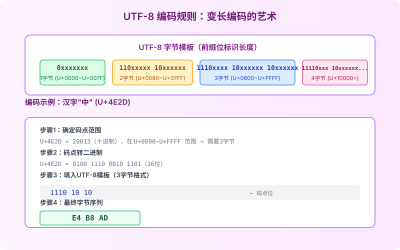
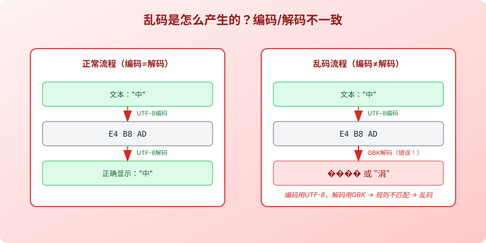
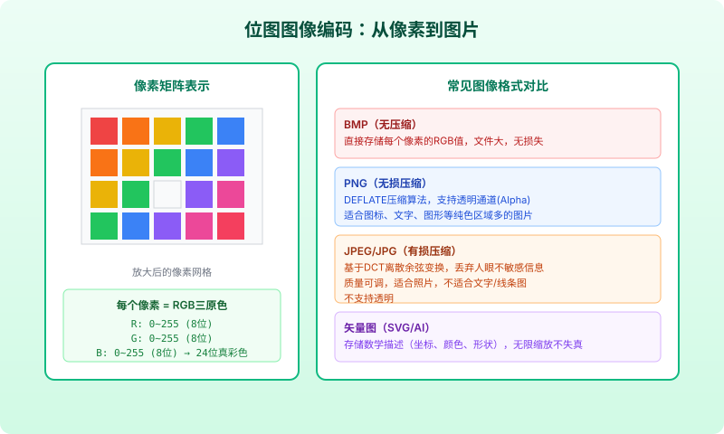
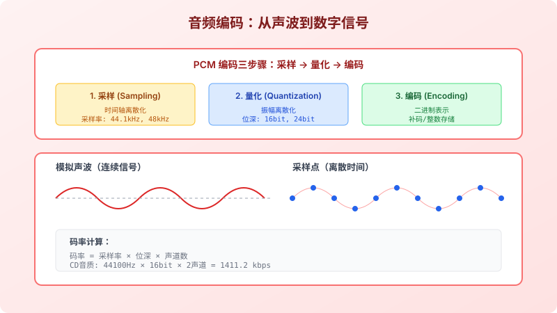
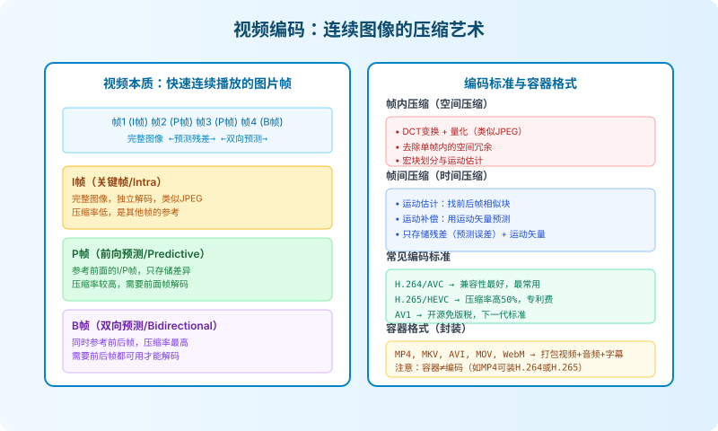

# 计算机是如何编码数据的

> 计算机只认识 0 和 1，但我们却能用它看电影、听音乐、写文章、聊天。这一切的魔法都源于**编码**——把现实世界的信息转换成二进制的规则，再从二进制还原回人类可感知形式的逆过程。本文将系统讲解文本、图片、音频、视频四大类数据的编码与解码原理。

## 一、编码的本质：建立现实世界与比特的映射

计算机的世界里只有两种状态：0 和 1。现实世界却是连续而丰富的——有文字、图像、声音、视频。要让计算机处理这些信息，必须先建立一套**约定规则**：



编码的核心思想可以归纳为三步：

1. **采样/离散化**：把连续的现实信息切割成离散的样本（如音频按时间采样，图像按像素采样）
2. **建立映射规则**：给每个离散样本分配一个唯一的数字编号
3. **二进制序列化**：把数字编号转换成计算机能存储的字节序列

解码则是编码的逆过程：读取字节 → 还原数字编号 → 根据规则还原成人类可感知的信息。

---

## 二、文本编码：从 ASCII 到 Unicode 的大一统之路

文本编码是计算机最早需要解决的问题，也是最容易产生"乱码"问题的领域。要彻底理解文本编码，必须先分清两个核心概念：**字符集（Charset）** 和 **字符编码（Character Encoding）**。

### 2.1 字符集与字符编码：两层抽象

很多人混淆了这两个概念，导致遇到乱码时无从下手：



| 概念 | 作用 | 比喻 | 例子 |
|------|------|------|------|
| **字符集** | 收录哪些字符，给每个字符分配唯一编号（码点 Code Point） | 一本字典，给每个字编了号 | ASCII 收录 128 个字符，A 编号为 65 |
| **字符编码** | 规定码点如何转换成字节序列存储 | 字典的运输打包规则 | UTF-8 把 U+4E2D 编码为 `E4 B8 AD` 三个字节 |

一句话总结：**字符集定义"字符→数字"的映射，字符编码定义"数字→字节"的转换规则**。

### 2.2 字符集的演进历史

#### ASCII：英语世界的起点

ASCII（American Standard Code for Information Interchange，美国信息交换标准代码）诞生于 1967 年，是最早的通用字符集：

- 使用 **7 位**二进制数表示一个字符，共能表示 \(2^7 = 128\) 个字符
- 包含：英文字母（大小写）、数字 0-9、标点符号、33 个控制字符（换行、回车、制表符等）

```text
ASCII 编码示例：
'A' → 65 → 01000001
'a' → 97 → 01100001
'0' → 48 → 00110000
换行符 → 10 → 00001010
```

ASCII 对英语足够了，但完全无法表示中文、日文、阿拉伯文等非拉丁文字。

#### GB2312 / GBK / GB18030：中文的解决方案

为了表示中文，中国制定了自己的编码标准：

| 标准 | 发布年 | 字符数 | 特点 |
|------|--------|--------|------|
| **GB2312** | 1980 | 6763 个汉字 | 双字节编码，兼容 ASCII |
| **GBK** | 1995 | 21886 个汉字 | GB2312 扩展，支持繁体字 |
| **GB18030** | 2000 | 70244 个汉字 | 最新国标，1/2/4 字节变长，兼容 Unicode |

> **术语说明**：GB = 国标，K = 扩展（扩展的拼音首字母）。

GB 系列编码在中文 Windows 系统时代被广泛使用，这也是为什么很多老文档在 UTF-8 环境下打开会乱码的原因。

同样，日本有 Shift_JIS，韩国有 EUC-KR，台湾有 Big5……世界各地都在做自己的编码，问题随之而来：**同一串字节，在不同编码下代表完全不同的字符**。这就是乱码的根源。

### 2.3 Unicode：全球文字的统一编号

为了结束编码混乱的局面，Unicode 联盟在 1991 年推出了 Unicode 标准——它的目标很简单：**收录全世界所有文字、符号、表情，给每个字符分配一个唯一的编号（码点）**。

Unicode 码点的表示方式为 `U+XXXX`，其中 `XXXX` 是十六进制数：

```text
U+0041   → 'A'
U+4E2D   → '中'
U+1F600  → '😀'（笑脸表情）
```

Unicode 的码点空间目前规划到 \(10FFFF_{16}\)，可容纳超过 110 万个字符，足以容纳人类有史以来所有文字和符号。

Unicode 字符集分为 17 个平面（Plane）：
- **基本多语言平面（BMP, U+0000 ~ U+FFFF）**：包含最常用的字符，英文、中文、日文等都在这里
- **辅助平面（SMP, SIP 等, U+10000 ~ U+10FFFF）**：包含表情符号、生僻汉字、历史文字等

但是，Unicode 只定义了字符到码点的映射，并没有直接规定码点如何存储为字节——这就是编码方案要解决的问题。

### 2.4 Unicode 的编码方案：UTF-8 / UTF-16 / UTF-32

针对 Unicode 码点，有多种编码方案（UTF = Unicode Transformation Format）。它们各有特点，适用于不同场景。

#### UTF-32：定长编码，简单但浪费

UTF-32 是最简单直接的编码：**每个码点固定用 4 字节（32 位）存储**。

- 优点：编解码极其简单，随机访问快（第 n 个字符就是第 4n 字节处）
- 缺点：极度浪费空间，即使是 ASCII 字符也要 4 字节，比 ASCII 体积大 4 倍
- 使用场景：主要在 Unix/Linux 系统内部 API 中使用，几乎不用于文件存储或网络传输

```text
'A' (U+0041) → UTF-32: 00 00 00 41
'中' (U+4E2D) → UTF-32: 00 00 4E 2D
```

#### UTF-16：折中方案，Windows/Java 的选择

UTF-16 使用 **2 或 4 字节**变长编码：
- BMP 内的字符（U+0000 ~ U+FFFF）：用 2 字节直接存储
- BMP 外的字符（U+10000 及以上）：用**代理对（Surrogate Pair）**——两个 2 字节合起来表示一个字符

- 优点：常用字符都是 2 字节，比 UTF-32 节省空间，随机访问比 UTF-8 容易
- 缺点：仍有字节序问题（需要 BOM），不兼容 ASCII 处理函数，代理对增加了复杂度
- 使用场景：Windows 内核、Java 字符串、JavaScript 内部、.NET

#### UTF-8：事实标准，互联网的选择

UTF-8 是目前互联网上使用最广泛的编码（占比超过 98%），它是一种 **1~4 字节变长编码**，设计极其精巧。



UTF-8 的编码规则如下：

| 码点范围 | 字节数 | 字节模板 |
|----------|--------|----------|
| U+0000 ~ U+007F | 1 字节 | `0xxxxxxx` |
| U+0080 ~ U+07FF | 2 字节 | `110xxxxx 10xxxxxx` |
| U+0800 ~ U+FFFF | 3 字节 | `1110xxxx 10xxxxxx 10xxxxxx` |
| U+10000 ~ U+10FFFF | 4 字节 | `11110xxx 10xxxxxx 10xxxxxx 10xxxxxx` |

UTF-8 的设计有几个天才之处：

1. **完全兼容 ASCII**：U+0000 ~ U+007F 的编码结果与 ASCII 完全相同，这意味着所有老的 ASCII 文档自动是合法的 UTF-8 文档
2. **无字节序问题**：UTF-8 以字节为单位编码，不存在大小端问题，不需要 BOM
3. **自同步特性**：从任意位置开始，都能快速定位到字符边界。每个字节的前缀位明确标识了它是单字节字符、首字节还是后续字节，不会因为局部损坏导致后面全部乱码
4. **鲁棒性强**：任何一个字节损坏，最多只影响一个字符，不会像 GBK 那样导致"多米诺骨牌"式的后续全乱码

编码示例：汉字"中"（U+4E2D）

```text
1. U+4E2D = 20013，在 U+0800~U+FFFF 范围 → 需要 3 字节
2. 二进制码点：0100 1110 0010 1101（16位）
3. 填入3字节模板：
   模板：1110xxxx 10xxxxxx 10xxxxxx
   填入：11100100 10111000 10101101
4. 最终字节：E4 B8 AD
```

**术语对照表**：

| 英文术语 | 中文 | 含义 |
|----------|------|------|
| Code Point | 码点 | 字符在字符集中的编号 |
| Character Set / Charset | 字符集 | 字符与码点的映射表 |
| Encoding | 编码 | 码点到字节的转换规则 |
| BOM (Byte Order Mark) | 字节序标记 | 文件开头的特殊字节（EF BB BF for UTF-8），用于标识编码和字节序 |
| Endianness | 字节序 | 多字节数据在内存中存储的顺序（大端/小端） |
| Surrogate Pair | 代理对 | UTF-16 中用两个 16 位值表示辅助平面字符的机制 |

### 2.5 乱码的根源



乱码的根本原因只有一个：**编码时使用的字符编码，与解码时使用的不一致**。

常见的乱码场景：

1. **文件声明编码与实际编码不符**：HTML 中写了 `<meta charset="GBK">` 但实际文件是 UTF-8 保存的
2. **数据库连接编码问题**：MySQL 表用 latin1 存储，但客户端按 UTF-8 解读
3. **HTTP 头未指定编码**：服务器没返回 `Content-Type: text/html; charset=utf-8`，浏览器错误猜测
4. **字节长度截断**：在多字节字符中间截断字节，导致后续字符错位

**解决乱码的黄金法则**：从输入、存储、处理到输出，**全链路统一使用 UTF-8**。

---

## 三、图片编码：像素与色彩的数字表示

### 3.1 位图（Bitmap）的基本原理

位图（也叫光栅图、点阵图）是最直观的图像表示方式：把图像分割成一个矩形网格，每个网格点就是一个**像素（Pixel）**，每个像素存储颜色值。



### 3.2 色彩模型：RGB 与 YUV

计算机中最常用的色彩模型是 **RGB**，用红（Red）、绿（Green）、蓝（Blue）三原色的强度来混合出任意颜色：

- 每个通道用 8 位（1 字节）表示，取值范围 0~255
- 三个通道组合：\(256 \times 256 \times 256 = 16,777,216\) 种颜色，即"24 位真彩色"
- 有时会加一个 **Alpha 通道** 表示透明度，变成 32 位（RGBA）

```text
纯红:   R=255, G=0,   B=0   → #FF0000
纯绿:   R=0,   G=255, B=0   → #00FF00
纯蓝:   R=0,   G=0,   B=255 → #0000FF
黄色:   R=255, G=255, B=0   → #FFFF00
白色:   R=255, G=255, B=255 → #FFFFFF
黑色:   R=0,   G=0,   B=0   → #000000
中灰:   R=128, G=128, B=128 → #808080
```

另一种重要的色彩模型是 **YUV**（亮度-色度模型）：
- **Y**：亮度（Luminance），表示明暗
- **U/V**：色度（Chrominance），表示颜色

YUV 的优势在于**人眼对亮度比色度敏感得多**，因此可以对色度分量进行降采样（如 YUV4:2:0）而不容易察觉质量损失，这是图像/视频压缩的重要基础。JPEG 和视频编码都大量使用 YUV。

### 3.3 未经压缩：BMP 格式

BMP（Bitmap）是 Windows 系统的原生位图格式，它的存储方式非常直接：

- 文件头（14 字节）：标识 "BM"、文件大小、像素数据偏移量
- 信息头（40/108/124 字节）：图像宽高、位深、压缩方式等
- 像素数据：按行存储每个像素的颜色值（可能有行对齐填充）

BMP 不做任何压缩，因此文件体积巨大：一张 1920×1080 的 24 位 BMP 图片大小约为 \(1920 \times 1080 \times 3 ≈ 6\ \text{MB}\)。

### 3.4 无损压缩：PNG 格式

PNG（Portable Network Graphics）使用 **DEFLATE 压缩算法**（与 ZIP 相同）实现无损压缩：

- 压缩原理：结合 LZ77 算法（用长度+距离指针替代重复出现的字节序列）和 Huffman 编码（高频字符用短编码）
- 支持 Alpha 透明通道
- 支持 256 色调色板模式（适合图标，体积更小）
- 适合场景：图标、logo、文字截图、UI 界面、纯色区域多的图片

PNG 压缩不会损失任何信息，但压缩率有限——对照片类内容压缩效果不佳。

### 3.5 有损压缩：JPEG 格式

JPEG（Joint Photographic Experts Group）是专为照片设计的有损压缩格式，压缩率极高，但会损失一些人眼不敏感的细节：

JPEG 压缩的核心步骤：

1. **RGB → YCbCr 转换**：把色彩转换为亮度-色度空间（与 YUV 类似）
2. **色度子采样**：对 Cb/Cr 色度通道降采样（通常 4:2:0，即水平垂直都减半），因为人眼对色度不敏感
3. **分块 DCT 变换**：把图像分成 8×8 的块，对每个块做离散余弦变换（DCT），把空间域数据转换为频率域数据
4. **量化**：用量化表除以 DCT 系数，高频分量（人眼不敏感的细节）大多变成 0——这是"有损"的来源
5. **熵编码**：对量化后的数据用 Huffman 或算术编码进一步压缩

JPEG 的关键设计哲学是：**利用人眼视觉系统的特性，丢弃那些人眼本来看不到或不敏感的信息**。质量参数（Q 值）控制量化步长，Q=100 几乎无损，Q=50 是常见平衡值，Q=10 则模糊严重。

### 3.6 矢量图：数学描述而非像素

与位图的存储方式完全不同，**矢量图（Vector Graphics）** 不存储像素，而是存储**数学描述**：

- 线条的起点、终点、宽度、颜色
- 曲线的贝塞尔控制点
- 填充颜色、渐变效果
- 文字的字体、大小、位置

常见矢量格式：**SVG**（Web 标准，XML 描述）、AI（Adobe Illustrator）、EPS、PDF（可包含矢量和位图）。

矢量图的最大优势是**无限缩放不失真**——无论放大多少倍，线条都是平滑的。适合 logo、图标、图表、插画等几何图形为主的场景。但矢量图无法表示照片这种复杂场景。

**术语对照表**：

| 英文术语 | 中文 | 含义 |
|----------|------|------|
| Pixel | 像素 | 图像的最小单位，一个颜色点 |
| Resolution | 分辨率 | 图像的像素数量（宽×高） |
| Bit Depth | 位深 | 每个颜色通道用多少位表示 |
| DCT | 离散余弦变换 | 将信号从空间域转换到频率域的数学变换 |
| Lossless | 无损压缩 | 解压后可完全还原原始数据 |
| Lossy | 有损压缩 | 压缩时丢弃部分信息，无法完全还原 |
| Chroma Subsampling | 色度子采样 | 降低色彩分辨率以减少数据量 |
| Raster / Bitmap | 位图/光栅图 | 基于像素阵列的图像 |
| Vector | 矢量图 | 基于数学描述的图形 |

---

## 四、音频编码：声波的数字化

声音本质是空气振动产生的**机械波**，是一种**连续的模拟信号**。要让计算机存储和处理声音，必须把它转换成数字形式。



### 4.1 PCM 编码三步骤

PCM（Pulse Code Modulation，脉冲编码调制）是音频数字化的基础方法，分为三步：

#### 步骤一：采样（Sampling）—— 时间轴离散化

按固定的时间间隔对声波进行"拍照"，测量每个时刻的振幅值。每秒钟采样的次数称为**采样率（Sample Rate）**。

常见采样率：
- **8 kHz**：电话音质
- **22.05 kHz**：广播音质
- **44.1 kHz**：CD 音质（最常用）
- **48 kHz**：专业音频/视频制作
- **96 kHz / 192 kHz**：Hi-Res 高解析度音频

> **奈奎斯特-香农采样定理**：要无损还原一个信号，采样率必须至少是信号最高频率的 2 倍。人耳能听到的最高频率约为 20 kHz，因此 CD 选择 44.1 kHz 作为标准（留了一点余量）。

#### 步骤二：量化（Quantization）—— 振幅轴离散化

把每个采样点的连续振幅值映射到有限个离散数值上。用多少位来存储一个采样值称为**位深（Bit Depth）**。

常见位深：
- **8 位**：256 个级别，老式电话/游戏音效，动态范围小
- **16 位**：65536 个级别，CD 标准，动态范围约 96 dB，日常听音乐足够
- **24 位**：1677 万个级别，专业录音/制作，动态范围约 144 dB

量化会引入**量化噪声**（原始值和量化值之间的误差），位深越大，噪声越小。

#### 步骤三：编码（Encoding）—— 二进制表示

把量化后的整数值用二进制方式存储。PCM 数据通常使用**补码**（有符号整数）表示。

单声道 PCM 数据是一串连续的采样值；双声道（立体声）则是按 LRLRLR... 交错存储左右声道的采样值。

### 4.2 码率计算

PCM 音频的数据率（码率）计算公式：

```text
码率(bps) = 采样率(Hz) × 位深(bit) × 声道数
```

CD 音质计算：
```text
44100 Hz × 16 bit × 2 声道 = 1,411,200 bps ≈ 1411 kbps
```

一分钟 CD 音质的 PCM 数据大小：
```text
1411 kbps × 60 s = 84.7 Mb ≈ 10.6 MB
```

这就是为什么 WAV 文件很大的原因。

### 4.3 音频压缩格式

原始 PCM 数据量太大，实际使用时几乎都会压缩：

| 格式 | 类型 | 典型码率 | 特点 |
|------|------|----------|------|
| **WAV** | 无压缩（PCM封装） | 1411 kbps | Windows 标准，音质最好，文件大 |
| **FLAC** | 无损压缩 | ~700-900 kbps | 压缩率约 50-60%，可完全还原，适合音乐收藏 |
| **MP3** | 有损压缩 | 128-320 kbps | 最普及的格式，利用人耳听觉掩蔽效应 |
| **AAC** | 有损压缩 | 96-256 kbps | MP3 的继任者，同码率音质更好，Apple/YouTube 使用 |
| **OGG Vorbis** | 有损压缩 | 96-256 kbps | 开源免专利，Spotify 使用 |
| **Opus** | 有损压缩 | 6-510 kbps | 最新标准，语音和音乐都好，WebRTC 默认 |

#### MP3/AAC 压缩的核心原理

有损音频压缩利用了**人耳听觉心理学（心理声学）**的特性：
1. **频域掩蔽（Frequency Masking）**：一个强音附近频率的弱音会被"盖住"听不见，可以丢弃
2. **时域掩蔽（Temporal Masking）**：强音前后很短时间内的弱音也听不见
3. **频率敏感度**：人耳对 2-5 kHz 频段最敏感，对极低/极高频率较不敏感

压缩时先把信号通过 MDCT（改进离散余弦变换）转换到频域，然后根据心理声学模型把人耳听不到的分量量化为 0 或用更少位表示，最后用 Huffman 编码压缩。

**术语对照表**：

| 英文术语 | 中文 | 含义 |
|----------|------|------|
| Sampling Rate | 采样率 | 每秒采集声音样本的次数，单位 Hz |
| Bit Depth | 位深/采样精度 | 每个采样值用多少位存储 |
| Sample | 采样值/样本 | 某个时刻声音振幅的量化值 |
| PCM | 脉冲编码调制 | 最基础的数字音频编码方式 |
| Nyquist Frequency | 奈奎斯特频率 | 采样率的一半，是可还原的最高频率 |
| Psychoacoustics | 心理声学 | 研究人耳听觉特性的学科 |
| Bitrate | 码率/比特率 | 每秒音频数据量，单位 bps/kbps |
| VBR | 可变码率 | 复杂段落用高码率，简单段落用低码率 |
| CBR | 恒定码率 | 全程码率不变 |

---

## 五、视频编码：连续图像的高效压缩

视频本质上就是**快速连续播放的图片序列**，利用人眼的**视觉暂留（Persistence of Vision）**特性产生运动的错觉。通常每秒播放 24~60 帧（fps，frames per second）。



### 5.1 视频数据量有多大？

先算一笔账，如果不压缩：
- 分辨率：1920×1080（1080p）
- 帧率：30 fps
- 每像素：24 位（3 字节，RGB）
- 每秒数据量：\(1920 \times 1080 \times 3 \times 30 ≈ 178\ \text{MB/s}\)
- 每分钟：\(178 \times 60 ≈ 10.4\ \text{GB/分钟}\)
- 一部 2 小时电影：约 **1.2 TB**！

不压缩的话，在线看视频、存储电影都是不可能的。视频编码就是解决如何把数据量压到原来的几十分之一甚至几百分之一，同时尽量保持视觉质量。

### 5.2 视频压缩的两大方向：去除冗余

视频压缩主要利用两种冗余：

#### 空间冗余（帧内压缩）

同一帧画面内，相邻像素往往颜色相近，存在大量重复。帧内压缩就是对单张图片进行压缩，原理与 JPEG 类似：
- DCT 变换 → 量化 → 熵编码
- 去除图像内部的空间相关性
- 帧内压缩后的帧称为 **I 帧（Intra-coded frame，关键帧）**

#### 时间冗余（帧间压缩）

相邻帧之间的画面变化很小（比如视频会议中人不动，背景不变），没必要每帧都完整存储。帧间压缩只存储**当前帧与参考帧的差异**：

1. **运动估计（Motion Estimation）**：在参考帧中搜索当前帧每个宏块（通常 16×16）的最佳匹配位置，得到**运动矢量（Motion Vector）**
2. **运动补偿（Motion Compensation）**：用运动矢量从参考帧"搬运"对应块来预测当前帧
3. **残差编码**：只存储预测值与实际值的差（残差），残差通常很小，压缩后体积极小

### 5.3 三种帧类型：I/P/B 帧

| 帧类型 | 全称 | 编码方式 | 压缩率 | 解码依赖 | 作用 |
|--------|------|----------|--------|----------|------|
| **I 帧** | Intra-frame | 帧内压缩（独立完整图像） | 最低（类似JPEG） | 无需参考其他帧 | 随机访问点、防止误差累积 |
| **P 帧** | Predictive-frame | 前向预测（参考前面的I/P帧） | 较高 | 需要前面的参考帧 | 提高压缩率 |
| **B 帧** | Bidirectional-frame | 双向预测（同时参考前后帧） | 最高 | 需要前面和后面的参考帧 | 最高压缩率，但增加延迟 |

典型的帧序列结构（GOP，图像组）：
```text
I P P B P B P I P P B P B P ...
|←─── 一个 GOP ──→|
```

GOP（Group of Pictures）是两个 I 帧之间的距离，GOP 越大压缩率越高，但随机访问越慢，错误传播越远。

### 5.4 主流视频编码标准

| 标准 | 别名 | 制定组织 | 发布年 | 压缩效率（相对H.264） | 专利/版权 |
|------|------|----------|--------|---------------------|-----------|
| **H.264** | AVC | ITU-T/MPEG | 2003 | 基准（100%） | 需专利授权 |
| **H.265** | HEVC | ITU-T/MPEG | 2013 | 约 50% 码率节省 | 专利费复杂，较贵 |
| **AV1** | AOMedia Video 1 | AOMedia（Google/Amazon/Netflix等） | 2018 | 约 30% 优于 H.265 | **开源免版权费** |
| **VP9** | - | Google | 2013 | 略优于 H.264 | 开源免版权费 |

H.264 目前仍是兼容性最好的编码（几乎所有设备都支持硬件解码）；AV1 是未来趋势，YouTube、Netflix 已在逐步切换。

### 5.5 容器格式 vs 编码标准

很多人分不清容器格式和编码：

- **视频编码（Codec）**：规定如何压缩和解压视频画面（H.264、H.265、AV1）
- **音频编码（Codec）**：规定如何压缩和解压声音（AAC、MP3、Opus）
- **容器格式（Container）**：把视频流、音频流、字幕、元数据打包到一个文件中

常见容器格式：

| 容器 | 扩展名 | 常见组合 | 特点 |
|------|--------|----------|------|
| **MP4** | .mp4 | H.264/H.265 + AAC | 最通用，兼容性最好 |
| **MKV** | .mkv | 任意编码 | 开源灵活，支持多音轨多字幕 |
| **WebM** | .webm | VP9/AV1 + Opus/Vorbis | Google 主推，Web 原生支持 |
| **AVI** | .avi | MPEG-4/DivX + MP3 | 老格式，不支持现代特性 |
| **MOV** | .mov | ProRes/H.264 + AAC | Apple 专业视频格式 |
| **FLV** | .flv | H.264 + AAC/MP3 | Flash 时代产物，已过时 |

> 重要：**MP4 不是编码，它只是容器**。MP4 文件里可以装 H.264 视频，也可以装 H.265 甚至 AV1 视频。

### 5.6 视频解码流程

解码器的工作流程与编码器相反：

1. **解析容器**：从 MP4/MKV 中分离出视频流、音频流
2. **熵解码**：把压缩的比特流还原成量化系数和运动矢量
3. **反量化 + 反变换（IDCT）**：还原残差数据
4. **运动补偿**：根据运动矢量从参考帧重建预测块
5. **帧重建**：预测块 + 残差 = 完整帧
6. **环路滤波**：去除块效应等压缩伪影
7. **送显示**：按时间戳顺序送帧到显示器

硬件解码（GPU 专用电路）比软件解码（CPU 运算）快得多且省电，这是手机看视频不发热的原因。

**术语对照表**：

| 英文术语 | 中文 | 含义 |
|----------|------|------|
| Frame | 帧 | 视频中的单张静态图像 |
| FPS | 帧率/每秒帧数 | 每秒播放多少帧画面 |
| GOP | 图像组 | 两个 I 帧之间的帧序列 |
| Macroblock | 宏块 | 运动估计的基本单元，通常 16×16 像素 |
| Motion Vector | 运动矢量 | 描述宏块在帧间移动位置的向量 |
| Motion Compensation | 运动补偿 | 利用运动矢量从参考帧预测当前帧 |
| Residual | 残差 | 预测值与真实值的差 |
| Codec | 编解码器 | 编码器+解码器的合称 |
| Container | 容器格式 | 封装多路流的文件格式 |
| Hardware Decoding | 硬件解码 | 用专用硬件电路解码，更快更省电 |

---

## 六、总结：编码的统一思想

回顾文本、图片、音频、视频的编码方式，可以发现它们背后的共同思想：

### 6.1 编码的通用流程

```text
现实世界连续信息
    ↓ 采样/离散化
离散的符号/样本
    ↓ 建立映射规则
数值化表示（码点/采样值/RGB值）
    ↓ 压缩编码（可选，但几乎都做）
二进制字节流 → 存储/传输
```

### 6.2 压缩的两种基本策略

所有数据压缩方法都可以归为两类：

1. **无损压缩（Lossless）**：解压后完全还原原始数据
   - 方法：统计冗余去除（Huffman 编码、算术编码、LZ77/LZ78 字典压缩）
   - 代表：PNG、FLAC、ZIP、UTF-8（本质也是一种编码优化）
   - 适用：文本、代码、程序文件，任何不允许信息丢失的场景

2. **有损压缩（Lossy）**：丢弃人不敏感的信息，获得更高压缩率
   - 方法：利用人类感知系统特性（视觉/听觉心理模型）+ 量化
   - 代表：JPEG、MP3、H.264/H.265
   - 适用：照片、音乐、视频——这些允许轻微失真且人眼/人耳难以察觉

### 6.3 为什么要理解编码？

理解编码原理不是为了自己写编码器，而是为了在实际工作中：

1. **处理乱码问题**：知道乱码是编码/解码不一致导致的，全链路统一 UTF-8
2. **选择合适的格式**：截图用 PNG，照片用 JPEG，图标用 SVG，音乐用 AAC/FLAC
3. **优化性能**：视频转码选 H.264 还是 AV1？图片用 WebP 还是 JPEG？理解原理才能做权衡
4. **排查问题**：为什么图片上传后变模糊？为什么视频播放卡顿？为什么音频文件这么大？
5. **避免低级错误**：不要在数据库里存 BMP，不要用记事本编辑 UTF-8 文件后存成 ANSI，不要在多字节字符中间截断字符串

计算机世界的一切，归根结底都是 0 和 1。编码就是我们为了让这两个数字承载无穷无尽的人类文明而发明的桥梁——从电报码到 Unicode，从 BMP 到 AV1，编码的演进史就是一部信息处理的进化史。

---

## 参考资料与延伸阅读

- Unicode 官方网站：https://unicode.org/
- UTF-8 与 Unicode 的设计历史：《The Absolute Minimum Every Software Developer Must Know About Unicode》by Joel Spolsky
- 《编码：隐匿在计算机软硬件背后的语言》by Charles Petzold
- JPEG 标准：ITU-T T.81 | ISO/IEC 10918-1
- H.264/AVC 标准：ITU-T H.264 | ISO/IEC 14496-10
- WebP/AV1 官方文档：Google Developers - AOMedia
