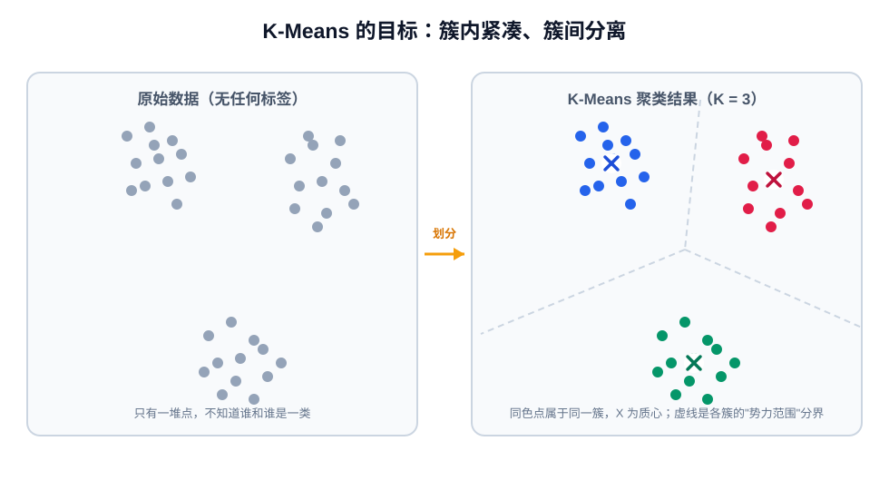
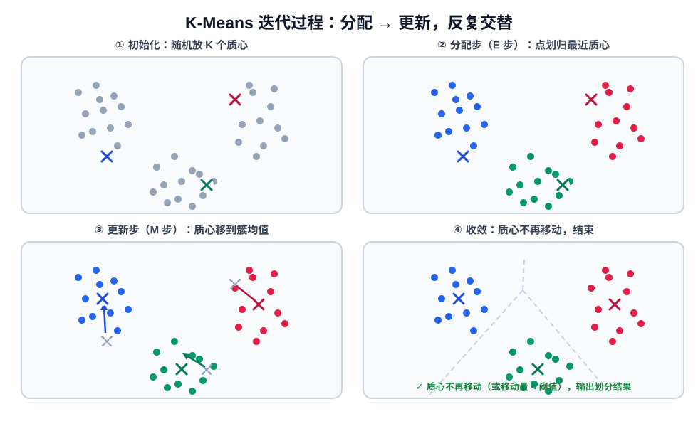
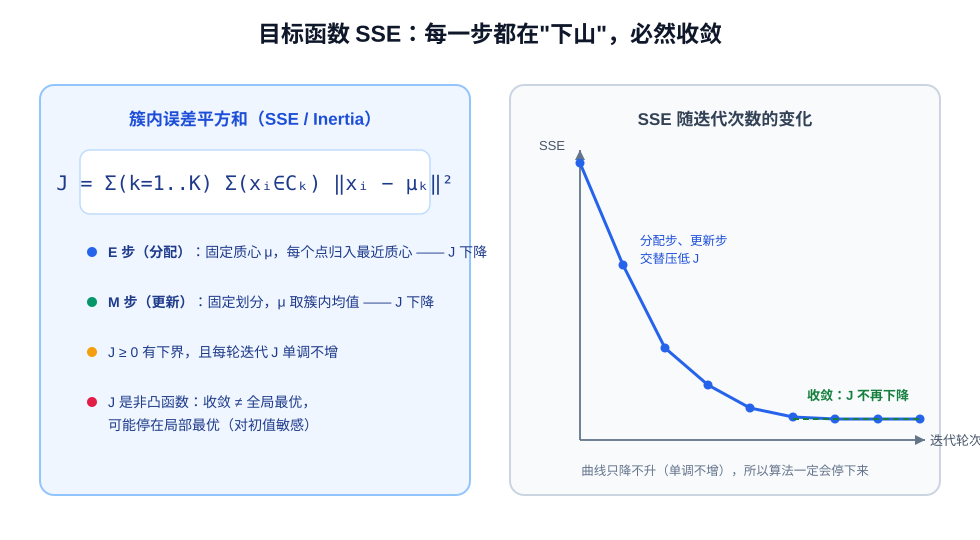
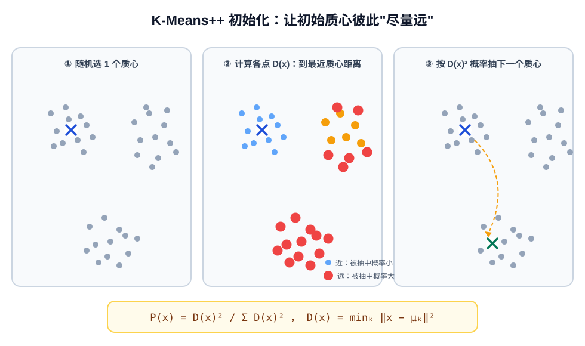
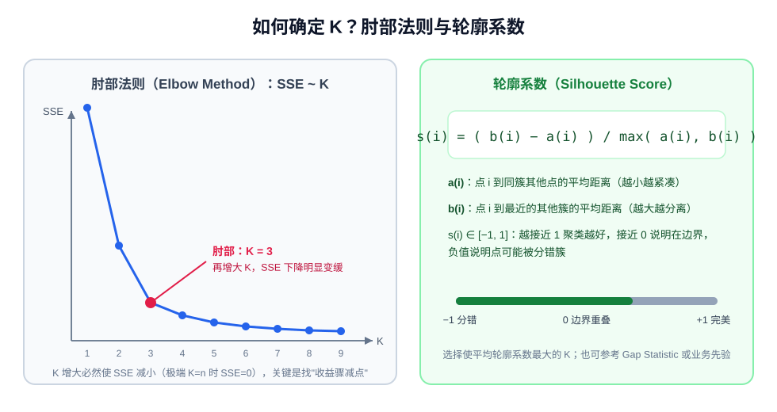
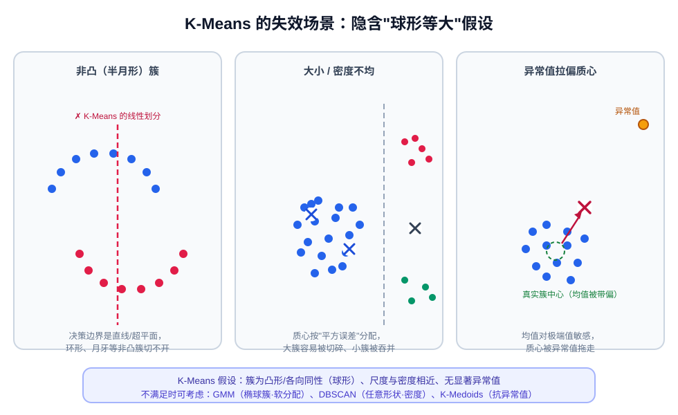

# K-Means 聚类算法

## 前言

在无监督学习（Unsupervised Learning）中，我们手里只有一堆没有标签的数据，却希望发现它们内部的"天然分组"。这类任务称为**聚类（Clustering）**：把相似的样本归为同一个**簇（Cluster）**，要求"簇内足够相似、簇间足够不同"。

**K-Means** 是最经典、应用最广泛的聚类算法。它思想极其朴素——先随便放 K 个"中心点"，然后反复做两件事：**把每个点划给最近的中心**、**把中心移动到所辖点的平均位置**——直到中心不再移动。尽管简单，K-Means 却是理解 EM 算法、向量量化、GMM 等更复杂模型的基石，在用户分群、图像压缩、异常检测、文本/Embedding 主题聚类等场景中随处可见。

本文将从算法流程讲到数学推导（目标函数、收敛性证明），再到 K-Means++、K 值选择、工程实现与常见变体，形成完整的知识闭环。

---

## 1. 核心思想：物以类聚

给定 $n$ 个样本点 $\{x_1, x_2, \dots, x_n\}$，K-Means 要把它们划分成 $K$ 个簇 $C_1, C_2, \dots, C_K$，每个簇用一个**质心（Centroid）** $\mu_k$ 代表。算法追求的目标是：

- **簇内紧凑**：每个点到自己簇质心的距离尽量小；
- **簇间分离**：不同簇的质心之间距离尽量大。



一句话概括：**K-Means 试图找到 K 个质心，使所有点到其所属质心的距离平方和最小。**

> **K 的含义**：K 是人为指定的超参数，表示"我认为数据中有 K 个群体"。K-Means 是**硬聚类（Hard Clustering）**——每个点只属于一个簇；与之相对的是软聚类（如 GMM、Fuzzy C-Means），点以概率归属于各个簇。

---

## 2. 算法流程

K-Means 的整个生命周期就是"初始化 → 交替迭代 → 收敛"：

1. **初始化**：随机选择 $K$ 个点作为初始质心 $\mu_1, \dots, \mu_K$（实践中用 K-Means++，见第 5 节）；
2. **分配步（Assignment / E 步）**：对每个点 $x_i$，计算它到所有质心的距离，划入最近的那个簇：

$$
c_i = \arg\min_k \; \lVert x_i - \mu_k \rVert^2
$$

3. **更新步（Update / M 步）**：对每个簇 $k$，把质心移动到该簇所有点的**均值**位置：

$$
\mu_k = \frac{1}{|C_k|} \sum_{x_i \in C_k} x_i
$$

4. **迭代**：重复步骤 2、3，直到质心不再变化（或变化量小于阈值、达到最大迭代次数）。



伪代码描述如下：

```text
输入：数据集 X，簇数 K
输出：K 个质心 μ、每个点的簇标签

1. 初始化 K 个质心（K-Means++）
2. repeat
3.     # E 步：分配
4.     for 每个点 x_i:
5.         c_i ← 距离最近的质心编号
6.     # M 步：更新
7.     for 每个簇 k:
8.         μ_k ← 簇 C_k 内所有点的均值
9. until 质心不再移动（或 SSE 变化 < tol）
```

**停止条件**通常有三种，满足任一即可：

- 质心完全不动（分配结果不再变化）；
- 质心移动距离小于容差 `tol`（sklearn 默认 $10^{-4}$）；
- 达到最大迭代次数 `max_iter`（防止病态数据下迭代过久）。

---

## 3. 数学原理

### 3.1 目标函数：簇内误差平方和 SSE

K-Means 优化的目标函数称为**簇内误差平方和**（Sum of Squared Errors），在 sklearn 中叫 **Inertia**：

$$
J = \sum_{k=1}^{K} \sum_{x_i \in C_k} \lVert x_i - \mu_k \rVert^2
$$

它衡量"所有点离自己簇中心有多远"。聚类越好，$J$ 越小。注意 $J$ 只关心**簇内**距离，不显式优化簇间距离——但簇内紧凑自然会导致簇间分离。

### 3.2 为什么"分配步"能最小化 J？

分配步中质心 $\mu_k$ 固定，每个点独立选择归属。$J$ 是所有点距离平方的加和，对单个点 $x_i$ 而言：

$$
\min_{c_i} \lVert x_i - \mu_{c_i} \rVert^2
$$

显然选择距离最近的质心即可让该项最小。所有点各自取最小，总和 $J$ 也就降到了当前质心下的最小值——**这一步一定让 $J$ 不增**。

### 3.3 为什么"更新步"质心取均值？——求导推导

更新步中划分固定，我们要找让 $J$ 最小的质心位置。把平方距离按维度展开（设维度为 $d$）：

$$
J = \sum_{k=1}^{K} \sum_{x_i \in C_k} \sum_{j=1}^{d} (x_{ij} - \mu_{kj})^2
$$

对第 $k$ 个质心的第 $j$ 维求偏导并令其为 0：

$$
\frac{\partial J}{\partial \mu_{kj}}
= \sum_{x_i \in C_k} -2(x_{ij} - \mu_{kj}) = 0
$$

整理得：

$$
\sum_{x_i \in C_k} x_{ij} = |C_k| \cdot \mu_{kj}
\quad\Longrightarrow\quad
\boxed{\mu_{kj} = \frac{1}{|C_k|} \sum_{x_i \in C_k} x_{ij}}
$$

即**质心的最优位置就是簇内所有点的均值**（这也是 K-Means 中 "Means" 的由来）。二阶导数为 $2|C_k| > 0$，说明这确实是极小值点。**这一步同样让 $J$ 不增。**

### 3.4 收敛性：为什么算法一定会停？

K-Means 的收敛性可以用"单调有界定理"严格保证：

1. **单调不增**：由 3.2、3.3 可知，每次分配步和更新步都不会让 $J$ 增大；
2. **有下界**：$J$ 是平方和，恒有 $J \ge 0$；
3. 分配方案的总数是有限的（$K^n$ 种），而 $J$ 在每轮迭代后严格下降或不变。

因此算法必然在有限步内到达某个稳定状态，$J$ 不再变化。



但要特别注意：**$J$ 是一个非凸函数，收敛 ≠ 收敛到全局最优**。不同的初始质心可能把算法带到不同的局部最优解，这正是 K-Means 对初始化敏感、需要 K-Means++ 和多次重启的原因。

### 3.5 EM 视角：K-Means 是 EM 算法的硬分配特例

K-Means 的两步交替与统计学中的 **EM 算法（Expectation-Maximization）** 完全同构：

| EM 算法 | K-Means |
|---------|---------|
| E 步：在固定参数下估计隐变量的后验分布 | 分配步：固定质心，确定每个点的簇标签 |
| M 步：在固定隐变量下最大化似然、更新参数 | 更新步：固定划分，把质心更新为簇均值 |

区别在于：标准 EM（如 GMM）的 E 步输出的是"属于各簇的概率"（软分配），而 K-Means 只保留最近的一个簇（硬分配，概率非 0 即 1）。可以证明，**K-Means 等价于"各簇协方差相同且各向同性、先验均匀"的高斯混合模型（GMM）用 EM 求解时取硬分配极限**。

---

## 4. 距离度量与数据预处理

### 4.1 为什么默认用欧氏距离？

标准 K-Means 使用**欧氏距离平方** $\lVert x - \mu \rVert^2$，这不是随意选择：3.3 节的推导表明，"质心取均值"恰好最小化欧氏距离平方和。若换用其他度量，"均值"就不再是最优中心，算法的收敛保证也会失效。

| 度量 | 能否用于标准 K-Means | 说明 |
|------|------------------|------|
| 欧氏距离 L2 | ✅ 默认 | 与"均值中心"严格配套 |
| 曼哈顿距离 L1 | ⚠️ 不严格 | 中位数才是 L1 的最优中心 → 应改用 K-Medians |
| 余弦相似度 | ⚠️ 需变体 | 使用**球面 K-Means**：先把向量归一化为单位向量，此时余弦相似度与欧氏距离等价，质心取归一化后的均值 |
| 核方法 | 🔁 换算法 | 非线性可分 → Kernel K-Means / 谱聚类 |

> **工程提示**：在 RAG / 文本 Embedding 聚类场景中，向量通常已归一化，用球面 K-Means（归一化 + 欧氏距离）等价于按余弦方向聚类，效果往往比直接 K-Means 更好。

### 4.2 必须做标准化/归一化

K-Means 基于距离，**特征量纲会直接决定聚类结果**。例如一个特征是"年龄（0~100）"，另一个是"收入（0~1,000,000）"，距离几乎被收入完全主导。正确做法是先做标准化：

$$
x'_{ij} = \frac{x_{ij} - \bar{x}_j}{\sigma_j}
\quad\text{（Z-Score 标准化）}
$$

或归一化到 $[0,1]$（Min-Max）。对长尾分布特征，可先做 `log1p` 变换再标准化。

---

## 5. 初始化问题与 K-Means++

### 5.1 随机初始化的两个坑

- **局部最优**：初始质心挤在一起，最终可能收敛到明显糟糕的划分（如把一个真簇劈成两半）；
- **空簇**：迭代中某个质心可能没有任何点归属（尤其初始质心落在数据稀疏区时），此时均值无定义，需要兜底处理（随机重置一个点，或把 SSE 最大的点分裂出去）。

### 5.2 K-Means++：让初始质心尽量分散

K-Means++（Arthur & Vassilvitskii, 2007）只改进初始化阶段，后续迭代完全不变，却能以极大概率得到优质解：

1. 从数据中**随机**选 1 个点作为第一个质心；
2. 对每个点 $x$，计算它到**最近的已选质心**的距离 $D(x)$；
3. 以概率 **$P(x) = \dfrac{D(x)^2}{\sum_{x'} D(x')^2}$** 轮盘赌选出下一个质心——离已有质心越远的点，被选中的概率越大；
4. 重复步骤 2~3，直到选出 $K$ 个质心。



直觉上：第一个质心随便放；之后的质心被"推"向尚未被覆盖的数据区域，从而保证初始质心彼此分散。论文证明该初始化使期望目标函数与最优解的近似比为 $O(\log K)$。

### 5.3 多次重启（n_init）

即便用 K-Means++，单次运行仍可能陷入局部最优。因此实践中会用不同随机种子跑多次（sklearn 的 `n_init`，旧版本默认 10，新版本默认 `auto`），取 SSE 最小的那次作为最终结果。

---

## 6. 如何确定 K 值？

K 是 K-Means 最重要也最让人头疼的超参数。常用三种判据：

### 6.1 肘部法则（Elbow Method）

画出不同 $K$ 下的 SSE 曲线：随着 $K$ 增大，SSE 必然单调下降（$K=n$ 时 SSE=0，每个点自成一簇）。但在某个 $K$ 之后，下降幅度会骤然变缓——曲线形似手肘，**肘部**对应的 $K$ 就是"性价比"最高的簇数。

### 6.2 轮廓系数（Silhouette Score）

轮廓系数同时衡量"簇内紧凑度 $a$"和"簇间分离度 $b$"，对单个样本 $i$：

$$
a(i) = \text{同簇其他点的平均距离}, \qquad
b(i) = \min_{k \ne c_i}\text{到簇 }k\text{ 所有点的平均距离}
$$

$$
s(i) = \frac{b(i) - a(i)}{\max(a(i), b(i))}, \qquad s(i) \in [-1, 1]
$$

- $s \to 1$：聚类很好，点既贴近本簇又远离他簇；
- $s \approx 0$：点在两个簇边界上，重叠严重；
- $s < 0$：点很可能被分错了簇。

取所有样本 $s(i)$ 的平均，选择使平均轮廓系数最大的 $K$（一般要求 $K \ge 2$）。



### 6.3 其他方法与业务先验

- **Gap Statistic**：比较实际 SSE 与"随机均匀分布数据"的期望 SSE，Gap 最大的 K 最优；
- **业务先验**：很多场景 K 由业务决定（如用户分层要 5 档、调色板要 16 色），此时量化指标只是辅助验证。

---

## 7. 复杂度分析

设样本数 $n$、簇数 $K$、维度 $d$、迭代轮数 $I$：

| 环节 | 时间复杂度 | 说明 |
|------|-----------|------|
| 一轮 E 步（算距离+分配） | $O(nKd)$ | 每个点与 $K$ 个质心算 $d$ 维距离 |
| 一轮 M 步（更新质心） | $O(nd)$ | 累加各簇点 |
| 整体 | $O(nKdI)$ | $I$ 通常很小（几十轮），可近似为线性 |
| 空间复杂度 | $O(n + K)$（存标签与质心）；若缓存距离矩阵为 $O(nK)$ | |

特点：

- 对 $n$ 近似线性，可扩展到百万级数据（配合 Mini-Batch K-Means）；
- $K$、$d$ 增大时代价线性增长；高维数据受"维度灾难"影响，距离区分度下降，建议先降维（PCA）；
- `n_init` 次重启会成倍放大开销。

---

## 8. 优缺点与适用边界

**优点**：

- 思想简单、易于实现，参数只有一个 $K$；
- 对大数据集可扩展，Mini-Batch 版本可流式/分布式训练；
- 结果可解释：每个质心就是一类的"典型代表"（如用户群的平均画像、调色板的代表色）。

**缺点**：

- 必须预先指定 $K$；
- 对初始化敏感，可能陷入局部最优；
- 隐含**凸形/球形、各簇尺度与密度相近**的假设，无法处理月牙形、环形等非凸簇；
- 质心是均值，对异常值敏感；
- 只适用于"均值有意义"的数值向量（类别变量需特殊编码或改用 K-Modes）。



不满足假设时的替代方案：

- 非凸/任意形状簇 → **DBSCAN**、谱聚类；
- 椭球形簇、想要软分配 → **GMM**；
- 异常值多、想用真实样本当中心 → **K-Medoids（PAM）**；
- 类别型数据 → **K-Modes**。

---

## 9. 代码实现

### 9.1 NumPy 从零实现（含 K-Means++ 与多次重启）

```python
import numpy as np


def kmeans_pp_init(X, k, rng):
    """K-Means++ 初始化：返回 k 个初始质心"""
    n = len(X)
    centers = [X[rng.integers(n)]]                       # ① 随机选第一个
    for _ in range(k - 1):
        dist_sq = ((X[:, None, :] - np.array(centers)[None, :, :]) ** 2).sum(axis=2)
        d2 = dist_sq.min(axis=1)                        # ② D(x)：到最近质心的距离平方
        probs = d2 / d2.sum()                           # ③ P(x) = D² / ΣD²
        centers.append(X[rng.choice(n, p=probs)])
    return np.array(centers)


def kmeans(X, k, n_init=10, max_iter=100, tol=1e-4, random_state=0):
    rng = np.random.default_rng(random_state)
    best = (np.inf, None, None)                         # (SSE, 质心, 标签)

    for _ in range(n_init):
        centers = kmeans_pp_init(X, k, rng)
        for _ in range(max_iter):
            # E 步：分配给最近质心
            dist = np.linalg.norm(X[:, None, :] - centers[None, :, :], axis=2)
            labels = dist.argmin(axis=1)

            # M 步：质心更新为簇均值；空簇则随机重置一个点兜底
            new_centers = np.array([
                X[labels == j].mean(axis=0) if np.any(labels == j) else X[rng.integers(len(X))]
                for j in range(k)
            ])

            shift = np.linalg.norm(new_centers - centers)
            centers = new_centers
            if shift < tol:                             # 收敛
                break

        inertia = ((X - centers[labels]) ** 2).sum()    # SSE / Inertia
        if inertia < best[0]:
            best = (inertia, centers, labels)

    return best[1], best[2], best[0]                    # 质心、标签、SSE


# 使用示例
if __name__ == "__main__":
    from sklearn.datasets import make_blobs

    X, _ = make_blobs(n_samples=1000, centers=3, n_features=2, random_state=42)
    X = (X - X.mean(axis=0)) / X.std(axis=0)            # 务必先标准化
    centers, labels, inertia = kmeans(X, k=3)
    print("SSE =", inertia)
    print("质心：\n", centers)
```

### 9.2 sklearn 调用与 K 值评估

```python
import matplotlib.pyplot as plt
from sklearn.cluster import KMeans
from sklearn.preprocessing import StandardScaler
from sklearn.metrics import silhouette_score

X_scaled = StandardScaler().fit_transform(X)

sse, sil = [], []
for k in range(2, 10):
    km = KMeans(n_clusters=k, init="k-means++", n_init=10, random_state=42)
    labels = km.fit_predict(X_scaled)
    sse.append(km.inertia_)
    sil.append(silhouette_score(X_scaled, labels))      # K=1 时无定义

# 画肘部曲线
plt.plot(range(2, 10), sse, "o-")
plt.xlabel("K"); plt.ylabel("SSE"); plt.show()
```

### 9.3 Mini-Batch K-Means：大数据集加速

每次迭代只用一个小批量数据更新质心，牺牲极小的精度换取数倍加速，适合样本量百万级或在线场景：

```python
from sklearn.cluster import MiniBatchKMeans

mbk = MiniBatchKMeans(n_clusters=100, batch_size=1024, n_init=3, random_state=42)
labels = mbk.fit_predict(X_scaled)
```

### 9.4 实战应用：图像颜色压缩（向量量化）

K-Means 天然是一种**向量量化（Vector Quantization）**方法。把每个像素的 RGB 三维向量聚类成 $K$ 个代表色，用质心颜色替换原像素，即可把真彩图压缩为 $K$ 色调色板：

```python
import numpy as np
from PIL import Image
from sklearn.cluster import KMeans

img = np.asarray(Image.open("demo.jpg"), dtype=np.float64) / 255.0
pixels = img.reshape(-1, 3)                            # (H*W, 3)

km = KMeans(n_clusters=16, n_init=4, random_state=0).fit(pixels)
quantized = km.cluster_centers_[km.labels_].reshape(img.shape)

Image.fromarray((quantized * 255).astype(np.uint8)).save("demo_16color.jpg")
```

同类应用还有：用户行为画像分群（质心即人群特征均值）、新闻/Embedding 主题发现、异常检测（到所属质心距离过大的点视为异常）等。

---

## 10. 常见变体与算法对比

| 算法 | 解决的问题 | 核心变化 |
|------|-----------|---------|
| **K-Means++** | 随机初始化差 | 加权抽样使初始质心分散 |
| **Mini-Batch K-Means** | 数据量大 | 每轮只用小批量更新质心 |
| **K-Medoids（PAM）** | 异常值敏感 | 中心必须是真实样本点，用绝对距离，结果更鲁棒但更慢 |
| **K-Modes** | 类别型数据 | 用众数代替均值、用匹配度代替欧氏距离 |
| **K-Medians** | L1 范数 | 中心取中位数，对异常值更鲁棒 |
| **Bisecting K-Means** | 层次结构 | 自顶向下反复二分 SSE 最大的簇，产生层次聚类树 |
| **Fuzzy C-Means** | 软分配 | 每个点以隶属度 $[0,1]$ 属于所有簇 |
| **球面 K-Means** | 文本/Embedding | 向量归一化后聚类，等价余弦相似度 |
| **GMM（EM）** | 椭球簇/软分配 | 概率模型，输出归属概率与协方差 |

**与 KNN 的区别（面试高频）**：二者名字相似但本质完全不同：

| 维度 | K-Means | KNN |
|------|---------|-----|
| 学习方式 | 无监督，无需标签 | 有监督，需要标签 |
| 任务 | 聚类（发现分组） | 分类/回归（预测标签） |
| K 的含义 | 簇的个数 | 投票时参考的最近邻居数 |
| 训练过程 | 有迭代训练，输出质心 | 惰性学习，不训练，预测时才计算 |

---

## 11. 实战 Checklist

1. **先标准化**：数值特征量纲差异大时，K-Means 结果几乎一定错误；
2. **先看数据形态**：画散点图/降维（PCA、t-SNE）确认簇是否近似凸形、密度是否均衡，否则考虑 DBSCAN/GMM；
3. **K 值**：肘部法则 + 轮廓系数双指标，再结合业务先验；
4. **初始化**：始终使用 `init="k-means++"` 并保持 `n_init ≥ 10`；
5. **异常值**：聚类前做截断/分箱，或改用 K-Medoids；
6. **高维数据**：先 PCA 降维再聚类，既加速又缓解维度灾难；
7. **结果验证**：观察质心的业务含义（画像可解释性），并抽样检查轮廓系数为负的点；
8. **大数据**：超过百万样本用 Mini-Batch 版本或分布式实现（Spark MLlib）。

---

## 12. 面试高频问题速答

**Q1：K-Means 一定收敛吗？能保证全局最优吗？**
一定收敛：目标函数 SSE 每步单调不增且有下界 0。但 SSE 非凸，只保证收敛到局部最优，所以需要 K-Means++ 和多次重启。

**Q2：为什么质心取均值？**
固定划分后对 SSE 求偏导令其为 0，解析解就是簇内均值（欧氏距离平方下均值是最优中心点）。

**Q3：出现空簇怎么办？**
常见策略：随机选一个点重新作为该簇质心；或选择当前 SSE 贡献最大（离质心最远）的点分裂为新质心。

**Q4：K-Means 和 GMM 的关系？**
K-Means 可视为 GMM 的硬分配特例：当各簇协方差相同且各向同性、先验均匀、E 步输出退化为 0/1 硬标签时，GMM 的 EM 迭代就等价于 K-Means。GMM 更灵活（椭球簇、软标签）但计算更贵。

**Q5：K-Means 能用曼哈顿距离吗？**
不能直接用——均值不再最小化 L1 距离，收敛性失效。L1 下最优中心是中位数，应使用 K-Medians。

**Q6：时间复杂度？为什么适合大数据？**
$O(nKdI)$，迭代轮数 $I$ 通常很小，对样本数近似线性；Mini-Batch 版本可进一步降为每轮 $O(bKd)$，支持流式与分布式。
