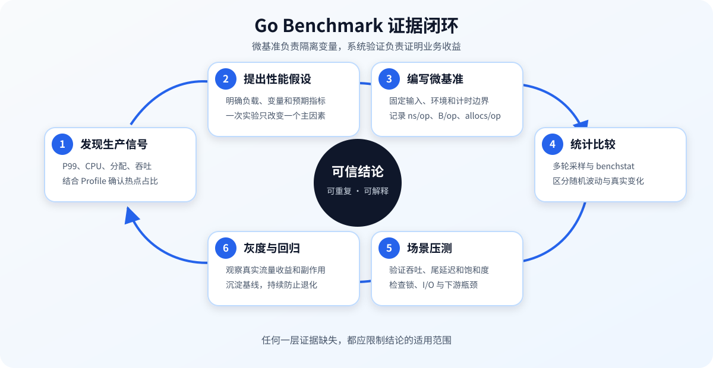
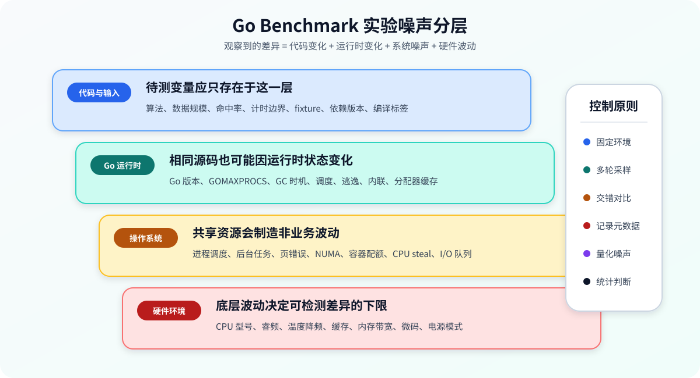

# Go Benchmark 最佳实战

> Benchmark 的价值不是生成一个更小的 `ns/op`，而是通过可重复、可解释的实验回答：某个改动是否真的改善了目标负载，以及这种改善是否足以覆盖复杂度和风险。

本文以 **Go 1.24 及以上版本**为主要环境，优先使用 `testing.B.Loop`。旧版 Go 可将其替换为传统的 `for i := 0; i < b.N; i++`。文中的命令以 Bash 风格展示，在 PowerShell 中应按对应语法设置环境变量和重定向。

## 目录

- [1. Benchmark 能回答什么](#1-benchmark-能回答什么)
- [2. 第一个可信的基准测试](#2-第一个可信的基准测试)
- [3. 理解 testing.B 的计时模型](#3-理解-testingb-的计时模型)
- [4. 设计有代表性的实验](#4-设计有代表性的实验)
- [5. 子基准与参数矩阵](#5-子基准与参数矩阵)
- [6. 指标与结果解读](#6-指标与结果解读)
- [7. 并行与并发 Benchmark](#7-并行与并发-benchmark)
- [8. 用 benchstat 做统计比较](#8-用-benchstat-做统计比较)
- [9. 用 pprof 解释差异](#9-用-pprof-解释差异)
- [10. 常见失真与修正方法](#10-常见失真与修正方法)
- [11. 完整优化案例](#11-完整优化案例)
- [12. CI 性能回归](#12-ci-性能回归)
- [13. 命令速查](#13-命令速查)
- [14. 实战检查清单](#14-实战检查清单)

---

## 1. Benchmark 能回答什么

Go Benchmark 是由 `testing` 包提供的微基准测试机制。它擅长隔离并测量一段代码的：

- 单次操作耗时；
- 每次操作的堆分配字节数和分配次数；
- 单位时间吞吐量；
- 不同输入规模下的复杂度变化；
- 串行与并行场景中的资源竞争；
- 优化前后的统计差异。

它不能直接证明：

- 服务的 P99 延迟一定下降；
- 数据库、网络和第三方依赖在生产中表现相同；
- 更高的微基准吞吐能带来更高的系统吞吐；
- 在开发机上成立的结果能跨 CPU、操作系统和 Go 版本成立；
- 一个统计显著的差异具有足够大的工程价值。

因此应区分三层验证：

| 层次 | 主要问题 | 常用工具 |
| --- | --- | --- |
| 微基准 | 某个函数或数据结构本身是否更快 | `go test -bench`、`benchstat` |
| 组件/场景压测 | 多个模块协作后吞吐和延迟如何 | 自建负载程序、HTTP/gRPC 压测工具 |
| 生产验证 | 真实流量、资源限制和依赖抖动下是否有效 | 指标、链路追踪、灰度、Profile |



一个完整的性能结论应形成以下证据链：

1. 从生产指标、Profile 或复杂度分析中提出性能假设；
2. 用微基准隔离变量，验证热点代码是否按预期改善；
3. 用统计工具确认差异不是随机噪声；
4. 用场景压测确认改动没有被 I/O、锁或下游瓶颈抵消；
5. 灰度上线，检查尾延迟、错误率、CPU、内存和成本。

---

## 2. 第一个可信的基准测试

假设需要为缓存构建键：

```go
package cachekey

import (
	"strconv"
	"strings"
)

func Build(tenant string, id int64) string {
	var builder strings.Builder
	builder.Grow(len(tenant) + 1 + 20)
	builder.WriteString(tenant)
	builder.WriteByte(':')
	builder.WriteString(strconv.FormatInt(id, 10))
	return builder.String()
}
```

对应的基准测试文件必须以 `_test.go` 结尾，函数名以 `Benchmark` 开头，并接收 `*testing.B`：

```go
package cachekey

import "testing"

var benchmarkResult string

func BenchmarkBuild(b *testing.B) {
	tenant := "tenant-a"
	const id int64 = 42

	b.ReportAllocs()
	for b.Loop() {
		benchmarkResult = Build(tenant, id)
	}
}
```

运行：

```bash
go test -run='^$' -bench='^BenchmarkBuild$' -benchmem -count=10 .
```

参数含义：

| 参数 | 作用 |
| --- | --- |
| `-run='^$'` | 不运行普通单元测试，避免额外耗时和环境干扰 |
| `-bench='^BenchmarkBuild$'` | 只运行名称完全匹配的基准 |
| `-benchmem` | 输出每次操作的分配字节数和分配次数 |
| `-count=10` | 独立重复 10 轮，为统计比较提供样本 |
| `.` | 测试当前包 |

典型输出：

```text
goos: linux
goarch: amd64
pkg: example.com/project/cachekey
cpu: AMD EPYC 7B13
BenchmarkBuild-8    18324567    64.31 ns/op    24 B/op    1 allocs/op
```

可读作：

- `BenchmarkBuild-8`：基准名称；`8` 是本次测试的 `GOMAXPROCS`，不是请求并发数；
- `18324567`：测试框架在该轮执行的操作次数；
- `64.31 ns/op`：平均每次操作耗时约 64.31 纳秒；
- `24 B/op`：每次操作平均产生 24 字节堆分配；
- `1 allocs/op`：每次操作平均发生 1 次堆分配。

这里的 `benchmarkResult` 是包级结果槽，用于让旧版编译器难以证明结果无用并删除整个计算。对 Go 1.24+ 的 `b.Loop`，测试框架和编译器已对循环体优化提供更稳健的保护，但显式消费结果仍能表达测试意图，并兼容旧版写法。

### 2.1 兼容旧版 Go

Go 1.24 以前使用 `b.N`：

```go
func BenchmarkBuildLegacy(b *testing.B) {
	tenant := "tenant-a"
	const id int64 = 42

	b.ReportAllocs()
	b.ResetTimer()
	for i := 0; i < b.N; i++ {
		benchmarkResult = Build(tenant, id)
	}
}
```

`b.N` 不是固定值。测试框架会先试运行，再逐步增加迭代次数，直到测量时间达到目标。不要把 `b.N` 当作业务输入规模，也不要在循环内修改它。

### 2.2 Benchmark 不是正确性测试

基准循环中不要反复做完整断言，否则测到的主要是断言成本。正确做法是：

1. 用单元测试覆盖正确性和边界条件；
2. 在 Benchmark 计时前做一次必要的前置校验；
3. 循环内只执行必须纳入测量的业务逻辑。

```go
func BenchmarkBuildWithSanityCheck(b *testing.B) {
	const want = "tenant-a:42"
	if got := Build("tenant-a", 42); got != want {
		b.Fatalf("Build() = %q, want %q", got, want)
	}

	for b.Loop() {
		benchmarkResult = Build("tenant-a", 42)
	}
}
```

---

## 3. 理解 `testing.B` 的计时模型

### 3.1 `b.Loop` 如何工作

标准写法：

```go
func BenchmarkLookup(b *testing.B) {
	table := newTable()

	for b.Loop() {
		_ = table.Lookup("key")
	}
}
```

`b.Loop()` 第一次调用时开始计时，在返回 `false` 时停止计时。因此，第一次调用前的准备工作默认不计入耗时，更不容易误把 fixture 构造成本算进目标操作。

它还减少了传统 `b.N` 写法中常见的两个错误：

- 忘记在昂贵初始化后调用 `b.ResetTimer()`；
- 循环体被编译器过度优化，导致测到的不是目标逻辑。

但 `b.Loop` 不会自动修正错误的实验设计。循环内的日志、随机数生成、fixture 重建和磁盘访问仍会真实计入结果。

### 3.2 `ResetTimer`、`StopTimer` 与 `StartTimer`

传统 `b.N` 模式中，初始化之后通常需要重置：

```go
func BenchmarkParseLegacy(b *testing.B) {
	payload := loadFixture()

	b.ReportAllocs()
	b.ResetTimer()
	for i := 0; i < b.N; i++ {
		_ = Parse(payload)
	}
}
```

如果每轮都必须执行一些不属于目标操作的准备工作，可以暂停计时：

```go
func BenchmarkConsume(b *testing.B) {
	for i := 0; i < b.N; i++ {
		b.StopTimer()
		queue := newQueueWithOneItem()
		b.StartTimer()

		_ = queue.Consume()
	}
}
```

但不要频繁使用这种模式：

- 启停计时本身有开销，特别容易污染纳秒级基准；
- 每轮重建状态会改变缓存、分配和 GC 行为；
- 排除准备成本后，结果可能不再代表真实业务操作。

更好的方式通常是批量预构造输入，或将“纯处理成本”和“端到端成本”拆成两个基准。

### 3.3 `-benchtime` 控制测量时间

默认情况下，框架会自动选择迭代次数。可以显式设置目标时长：

```bash
go test -run='^$' -bench='BenchmarkBuild$' -benchtime=3s -count=10 .
```

也可以固定操作次数：

```bash
go test -run='^$' -bench='BenchmarkBuild$' -benchtime=100000x .
```

适用建议：

- 纳秒级纯 CPU 操作：适当延长到 `2s` 或 `3s`，降低调度和时钟噪声；
- 昂贵操作：默认时间通常足够，先避免测试耗时失控；
- 外部服务或限额 API：不要盲目延长，以免触发限流或产生费用；
- 固定次数模式：适合诊断、Profile 或复现固定工作量，不适合直接替代稳定性采样。

---

## 4. 设计有代表性的实验



基准结果同时受到代码、运行时、操作系统和硬件影响。可信实验的核心是：只让待研究变量发生变化。

### 4.1 固定实验环境

至少记录：

```bash
go version
go env GOOS GOARCH GOAMD64 CGO_ENABLED
git rev-parse HEAD
```

同时尽量固定：

- 同一台机器、同一 CPU 型号和微码；
- 同一 Go 工具链、依赖版本和构建标签；
- 相同 `GOMAXPROCS`、环境变量和容器 CPU 配额；
- 相同电源模式，避免笔记本电池模式和温度降频；
- 相同数据集、输入分布和随机种子；
- 关闭无关的编译、同步、杀毒扫描等后台高负载任务。

虚拟机、共享 CI Runner 和突发型云主机会引入明显的 CPU steal、邻居竞争与频率波动。它们适合发现数量级退化，不适合判断 1%～3% 的微小变化。

### 4.2 选择代表性输入

只测 `"hello"`、空切片或 1 个元素通常会掩盖真实复杂度。输入矩阵至少考虑：

- 小、中、大数据规模；
- 常见路径与最坏路径；
- 命中与未命中；
- ASCII 与 Unicode；
- 已排序、随机和逆序数据；
- 稀疏与稠密数据；
- 正常输入和接近限制的输入。

输入应来自业务分布，而不是为了让某个实现赢得测试。若线上 95% 的请求小于 2 KiB，测试只使用 1 MiB 数据并据此优化，结论可能毫无业务价值。

### 4.3 把输入规模和迭代次数分开

错误示例：

```go
func BenchmarkSortWrong(b *testing.B) {
	values := make([]int, b.N) // 错误：b.N 是迭代次数，不是数据规模
	for b.Loop() {
		slices.Sort(values)
	}
}
```

输入规模应由子基准参数明确控制：

```go
func BenchmarkSort(b *testing.B) {
	for _, size := range []int{10, 1000, 100000} {
		b.Run(fmt.Sprintf("size=%d", size), func(b *testing.B) {
			source := newRandomInts(size, 42)
			work := make([]int, size)

			for b.Loop() {
				copy(work, source)
				slices.Sort(work)
			}
		})
	}
}
```

这里测量的是“复制输入并排序”的成本。如果只想比较排序算法，应单独说明复制是否计时，并确保每次排序面对相同的未排序数据。

### 4.4 冷缓存与热缓存

连续运行同一循环通常测到热缓存表现：

- 指令已进入 CPU 指令缓存；
- 数据可能留在 L1/L2/L3 缓存；
- 分支预测器已学习稳定模式；
- map、连接池和对象池已经预热。

热缓存并非错误，它适合描述高频常驻路径。但冷启动、低频 CLI、首次正则编译或首次建立连接需要单独测试。不要把两者混为一个数字。

### 4.5 随机输入应固定种子

使用时间作为随机种子会令每轮样本不同，降低可重复性：

```go
func newRandomInts(size int, seed int64) []int {
	rng := rand.New(rand.NewSource(seed))
	values := make([]int, size)
	for i := range values {
		values[i] = rng.Int()
	}
	return values
}
```

随机数据的生成一般放在计时区间外。若研究目标本身就是随机数生成器，则生成过程当然应计时。

---

## 5. 子基准与参数矩阵

### 5.1 用 `b.Run` 表达变量

不要复制多个仅参数不同的 Benchmark：

```go
func BenchmarkEncode(b *testing.B) {
	cases := []struct {
		name string
		size int
	}{
		{name: "small", size: 128},
		{name: "medium", size: 4 << 10},
		{name: "large", size: 1 << 20},
	}

	for _, tc := range cases {
		b.Run(tc.name, func(b *testing.B) {
			payload := bytes.Repeat([]byte("a"), tc.size)
			dst := make([]byte, base64.StdEncoding.EncodedLen(len(payload)))

			b.SetBytes(int64(len(payload)))
			b.ReportAllocs()
			for b.Loop() {
				base64.StdEncoding.Encode(dst, payload)
			}
		})
	}
}
```

运行某个子基准：

```bash
go test -run='^$' -bench='^BenchmarkEncode/medium$' -benchmem .
```

`-bench` 使用正则表达式，并按 `/` 分段匹配。给名称加入 `size=4096`、`hit=true` 之类的参数，可以让输出自解释，也方便筛选和统计。

### 5.2 比较多个实现

通过同一输入比较实现：

```go
func BenchmarkJoin(b *testing.B) {
	parts := []string{"tenant", "region", "resource", "42"}

	b.Run("Builder", func(b *testing.B) {
		for b.Loop() {
			benchmarkResult = joinWithBuilder(parts)
		}
	})

	b.Run("Join", func(b *testing.B) {
		for b.Loop() {
			benchmarkResult = strings.Join(parts, ":")
		}
	})
}
```

比较必须保证语义等价。一个实现若省略转义、边界校验或错误处理，即使更快也不是合法替代品。先用共享测试用例证明等价，再比较性能。

### 5.3 Benchmark 也要表驱动

参数多时使用表驱动，但不要一次展开几十个次要维度。基准矩阵过大将导致：

- 运行时间过长；
- 样本难以阅读；
- 多重比较增加偶然显著结果；
- CI 资源被低价值组合占用。

优先选择能代表生产分布、复杂度拐点和已知风险的组合。

---

## 6. 指标与结果解读

### 6.1 时间指标

`ns/op` 是总计时时间除以操作次数。它是墙钟时间，不等于纯 CPU 时间。锁等待、调度、系统调用和 I/O 等待都会进入结果。

常用换算：

```text
1 s  = 1,000 ms
1 ms = 1,000 μs
1 μs = 1,000 ns
```

不要用 `1 / ns/op` 简单推导服务 QPS，除非操作完全串行且不存在其他开销。真实吞吐还受并发、排队、资源竞争和下游容量影响。

### 6.2 分配指标

开启方式：

```go
b.ReportAllocs()
```

或命令行统一开启：

```bash
go test -run='^$' -bench=. -benchmem .
```

指标含义：

- `B/op`：每次操作分配到堆上的平均字节数；
- `allocs/op`：每次操作的平均堆分配次数。

它们不包括所有内存成本，例如栈空间、运行时内部缓存、操作系统页缓存和 CGO 管理的内存。`0 allocs/op` 也不意味着函数不使用内存，只表示测量中没有观察到每次操作的堆分配。

分配减少通常能降低 GC 压力，但不能脱离耗时判断。为消除一次分配而引入复杂池化、锁竞争或对象生命周期错误，可能得不偿失。

### 6.3 吞吐指标

`SetBytes` 声明每次操作处理的字节数：

```go
func BenchmarkHash(b *testing.B) {
	payload := make([]byte, 1<<20)
	b.SetBytes(int64(len(payload)))

	for b.Loop() {
		_ = sha256.Sum256(payload)
	}
}
```

输出会增加类似：

```text
1650.23 MB/s
```

这比单看 `ns/op` 更容易比较不同数据规模下的处理效率。

### 6.4 自定义指标

使用 `ReportMetric` 报告业务相关指标：

```go
func BenchmarkBatch(b *testing.B) {
	const itemsPerBatch = 100

	for b.Loop() {
		processBatch(itemsPerBatch)
	}

	b.ReportMetric(float64(itemsPerBatch), "items/op")
}
```

常见单位：

- `items/op`：每次操作处理多少条记录；
- `requests/s`：每秒请求数；
- `ns/item`：每条记录耗时；
- `hit/op`：每次操作命中次数。

单位应保持一致且可比较。不要把只对单次运行有效的总数伪装成每次操作指标。

### 6.5 使用 `-json` 保存机器可读结果

```bash
go test -json -run='^$' -bench=. -benchmem ./... > benchmark.json
```

`-json` 适合流水线采集测试事件，但性能统计工具通常直接消费标准 benchmark 文本。应根据后续工具链选择格式，不要依赖脆弱的正则从人类可读输出中自行提取字段。

---

## 7. 并行与并发 Benchmark

### 7.1 `RunParallel`

并行基准用于研究多个 goroutine 同时调用目标代码时的吞吐和竞争：

```go
func BenchmarkCounterParallel(b *testing.B) {
	var counter atomic.Int64

	b.RunParallel(func(pb *testing.PB) {
		for pb.Next() {
			counter.Add(1)
		}
	})
}
```

运行时固定 CPU 并行度：

```bash
go test -run='^$' -bench='^BenchmarkCounterParallel$' \
  -cpu=1,2,4,8 -count=10 .
```

`RunParallel` 会让多个 goroutine 分摊总操作数。默认并行度与 `GOMAXPROCS` 相关，但它不是“同时 1000 个用户”的负载模型。

### 7.2 `SetParallelism`

需要增加每个 P 上的 goroutine 数量时：

```go
func BenchmarkPoolParallel(b *testing.B) {
	pool := newPool()
	b.SetParallelism(4)

	b.RunParallel(func(pb *testing.PB) {
		for pb.Next() {
			item := pool.Get()
			pool.Put(item)
		}
	})
}
```

`SetParallelism(4)` 使并行 goroutine 数大致变为 `4 * GOMAXPROCS`。它适用于高等待比例或研究竞争的场景，不应为了让数字更好看而调整。

### 7.3 并行基准的状态边界

明确哪些状态共享、哪些状态属于 goroutine：

```go
func BenchmarkParserParallel(b *testing.B) {
	payload := []byte(`{"id":42,"name":"alice"}`) // 只读，可安全共享

	b.RunParallel(func(pb *testing.PB) {
		var dst Record // 每个 worker 独占
		for pb.Next() {
			dst = Record{}
			if err := json.Unmarshal(payload, &dst); err != nil {
				// FailNow/Fatal 只能由运行 Benchmark 的主 goroutine 调用。
				// 固定合法输入在此不应失败，panic 用于暴露 fixture 损坏。
				panic(err)
			}
		}
	})
}
```

如果目标代码只在 Benchmark 中出现数据竞争，结果没有解释价值。先运行：

```bash
go test -race ./...
```

但不要用 `-race` 的耗时作为性能基线，因为竞态检测会显著改变内存访问、调度和执行时间。

### 7.4 吞吐扩展性

并行度从 1 增加到 8，不代表吞吐应线性提升 8 倍。扩展受以下因素限制：

- 临界区和原子操作竞争；
- 内存带宽与缓存一致性；
- 伪共享；
- GC 和分配器竞争；
- 下游连接池、文件描述符与网络带宽；
- CPU 配额和操作系统调度。

应同时比较每操作耗时、总吞吐、CPU 利用率和 Profile，而不是只看一个并行结果。

---

## 8. 用 `benchstat` 做统计比较

### 8.1 为什么不能比较单次结果

两次运行可能得到：

```text
old: 63.2 ns/op
new: 61.9 ns/op
```

1.3 ns 的变化可能来自代码，也可能来自：

- CPU 睿频和温度；
- 操作系统调度；
- 后台进程；
- 地址空间布局；
- GC 触发时机；
- 缓存与分支预测状态。

单次数字没有提供样本分布，不能支持可靠结论。

### 8.2 采集样本

安装 `benchstat` 时应在项目工具模块中锁定 `golang.org/x/perf` 的明确版本，保证团队与 CI 使用相同工具。采集改动前后结果：

```bash
go test -run='^$' -bench='^BenchmarkBuild$' \
  -benchmem -benchtime=2s -count=15 . > old.txt

# 应用待验证改动后，在相同环境再次执行
go test -run='^$' -bench='^BenchmarkBuild$' \
  -benchmem -benchtime=2s -count=15 . > new.txt

benchstat old.txt new.txt
```

示意输出：

```text
                 │   old.txt   │              new.txt               │
                 │   sec/op    │    sec/op     vs base               │
Build-8            64.20n ± 2%   51.80n ± 1%  -19.31% (p=0.000 n=15)

                 │    old.txt    │              new.txt               │
                 │     B/op      │     B/op       vs base              │
Build-8             24.00 ± 0%      8.00 ± 0%  -66.67% (p=0.000 n=15)
```

重点阅读：

- 中心值：两组典型表现；
- 波动范围：实验是否稳定；
- 变化百分比：工程收益有多大；
- `p` 值：现有样本下，差异由随机波动解释的可能性；
- 样本数：统计判断的基础。

统计显著不等于工程显著。一个稳定的 `-0.8%` 可能不值得增加复杂度；一个 `-20%` 的热点优化通常更有价值，但仍要验证端到端收益。

### 8.3 交错采样降低时间漂移

先连续跑完 old，再跑 new，可能把温度和后台负载的时间漂移误认为版本差异。更严格的实验可：

1. 在同一提交中保留 `Old` 和 `New` 两个语义等价实现；
2. 用子基准在同一次进程中运行；
3. 多轮交错 old/new 构建或执行；
4. 保证每组样本覆盖相似的时间区间。

若两个实现无法共存，应在可控环境中多次交替切换提交，并记录完整元数据。

### 8.4 回归阈值要考虑噪声

不要简单规定“`ns/op` 增加 1% 就阻断合并”。稳定的性能门禁需要：

- 专用或足够稳定的 Runner；
- 足够样本数；
- 与机器噪声匹配的阈值；
- 对关键基准和次要基准分级；
- 保留原始样本供人工复核；
- 对明显回归自动告警，对边界结果重新采样。

---

## 9. 用 `pprof` 解释差异

Benchmark 告诉你“变快或变慢了多少”，Profile 用于解释“时间和内存花在哪里”。

### 9.1 CPU Profile

```bash
go test -run='^$' -bench='^BenchmarkEncode/large$' \
  -benchtime=10s -cpuprofile=cpu.out .

go tool pprof -http=:0 cpu.out
```

分析时关注：

- `flat`：函数自身消耗；
- `cum`：函数及其下游累计消耗；
- 热点是否位于目标业务代码；
- 测试 fixture、随机生成、日志或断言是否意外成为热点；
- 优化后热点是否转移。

Profile 有采样开销，带 Profile 的结果不要与普通基准数字直接混用。延长 `-benchtime` 可以收集更多样本，使热点更清晰。

### 9.2 内存 Profile

```bash
go test -run='^$' -bench='^BenchmarkEncode/large$' \
  -benchmem -benchtime=10s -memprofile=mem.out .

go tool pprof -http=:0 -alloc_space mem.out
```

常用视角：

| 视角 | 适合回答 |
| --- | --- |
| `alloc_space` | 整个运行期间哪些调用路径累计分配最多 |
| `alloc_objects` | 哪些路径创建对象数量最多 |
| `inuse_space` | Profile 时仍存活的内存主要在哪里 |
| `inuse_objects` | Profile 时仍存活的对象数量主要在哪里 |

微基准优化分配通常优先看 `alloc_space` 和 `alloc_objects`。`inuse_*` 受采样时机、GC 和对象生命周期影响，更适合分析存活集。

### 9.3 编译器诊断

查看内联和逃逸分析：

```bash
go test -run='^$' -bench='^BenchmarkBuild$' \
  -gcflags='all=-m=2' . 2> compiler.txt
```

诊断信息用于提出假设，不应机械追求“零逃逸”：

- 合理的返回值可能必须逃逸；
- 内联决策会随 Go 版本变化；
- 消除分配可能增加复制或锁竞争；
- 只有 Benchmark 和 Profile 证明它是主要成本时，才值得优化。

---

## 10. 常见失真与修正方法

### 10.1 把初始化算进目标操作

错误：

```go
func BenchmarkSearchWrong(b *testing.B) {
	for b.Loop() {
		index := buildIndex(largeDataset)
		_ = index.Search("go")
	}
}
```

如果目标是搜索性能，应把建索引移到循环外：

```go
func BenchmarkSearch(b *testing.B) {
	index := buildIndex(largeDataset)
	for b.Loop() {
		_ = index.Search("go")
	}
}
```

如果生产中每次请求确实都会建索引，则原写法才代表真实路径。计时边界取决于问题，不取决于哪个结果更漂亮。

### 10.2 重复使用已被修改的输入

错误：

```go
func BenchmarkSortWrong(b *testing.B) {
	values := newRandomInts(10000, 42)
	for b.Loop() {
		slices.Sort(values)
	}
}
```

第一次之后输入已经有序，后续测到的是“重复排序有序切片”。修正方式：

```go
func BenchmarkSort(b *testing.B) {
	source := newRandomInts(10000, 42)
	work := make([]int, len(source))

	for b.Loop() {
		copy(work, source)
		slices.Sort(work)
	}
}
```

此时复制成本属于结果的一部分。若只研究排序本身，可将复制放在暂停计时区间，但必须在文档中明确计时边界，并意识到频繁启停计时会影响短基准。

### 10.3 循环内生成随机数或日志

错误：

```go
for b.Loop() {
	input := randString(128)
	result := Parse(input)
	slog.Info("parsed", "result", result)
}
```

除非目标就是测随机生成或日志，否则应提前构建输入，并删除循环内日志。日志不仅增加 I/O 和格式化成本，还可能改变分配、锁竞争和调度。

### 10.4 忽略返回值

传统 `b.N` 写法中，如果编译器证明结果不可观察，可能删除部分甚至全部工作：

```go
for i := 0; i < b.N; i++ {
	strings.Repeat("x", 10)
}
```

消费结果：

```go
var benchmarkBytes []byte

func BenchmarkEncodeLegacy(b *testing.B) {
	input := []byte("payload")
	for i := 0; i < b.N; i++ {
		benchmarkBytes = Encode(input)
	}
}
```

不要为了防优化而在循环内做文件写入、打印或复杂断言，它们会制造更大的测量偏差。

### 10.5 使用不等价实现

典型问题：

- 一个版本校验 UTF-8，另一个不校验；
- 一个版本复制返回数据，另一个暴露内部缓冲区；
- 一个版本线程安全，另一个仅支持单 goroutine；
- 一个版本处理错误，另一个假设永不失败；
- 一个版本复用对象，但调用方未按要求归还。

性能比较的第一前提是契约等价。应使用相同测试用例、模糊测试或属性测试验证语义。

### 10.6 只测最佳输入

哈希表全命中、正则固定短文本、解析器只处理合法小输入，都会让结果偏离生产。至少把高频路径、慢路径和失败路径分开命名测试。

### 10.7 在共享机器上判断微小差异

如果同一版本连续运行的波动已经达到 ±5%，就不能根据 2% 的版本差异下结论。先量化噪声基线，再决定最小可检测变化。

### 10.8 同时修改多个变量

升级 Go、修改算法、调整 `GOMAXPROCS` 并更换机器后，无法归因。一次实验只改变一个主要变量；多个必要改动应逐步采样。

### 10.9 用 `-race`、覆盖率或调试构建比较性能

这些工具会插桩并改变代码特征：

```bash
go test -race -bench=.       # 用于发现竞态，不作为性能结论
go test -cover -bench=.      # 覆盖率插桩会污染性能
go test -bench=.             # 性能采样使用普通构建
```

正确性检查和性能采样都要做，但应分开运行。

### 10.10 将微基准直接外推到生产

字符串拼接快 30%，但如果它只占请求 CPU 的 1%，端到端收益上限也很小。可用近似的 Amdahl 定律判断：

```text
总加速比 = 1 / ((1 - 热点占比) + 热点占比 / 热点加速比)
```

若热点占总耗时 10%，热点本身提升 2 倍：

```text
总加速比 = 1 / (0.9 + 0.1 / 2) ≈ 1.053
```

理论端到端提升只有约 5.3%。这能帮助判断优化是否值得进入生产验证。

---

## 11. 完整优化案例

### 11.1 问题：构建批量资源键

初始实现：

```go
func BuildKeysV1(tenant string, ids []int64) []string {
	keys := make([]string, 0)
	for _, id := range ids {
		keys = append(keys, fmt.Sprintf("%s:%d", tenant, id))
	}
	return keys
}
```

优化假设：

1. 输出长度已知，切片可以预分配；
2. `fmt.Sprintf` 是通用格式化路径，固定格式可用 `strconv.AppendInt`；
3. 每个字符串最终仍需独立存储，不能仅追求零分配而改变返回值契约。

优化实现：

```go
func BuildKeysV2(tenant string, ids []int64) []string {
	keys := make([]string, len(ids))
	buf := make([]byte, 0, len(tenant)+1+20)

	for i, id := range ids {
		buf = buf[:0]
		buf = append(buf, tenant...)
		buf = append(buf, ':')
		buf = strconv.AppendInt(buf, id, 10)
		keys[i] = string(buf)
	}
	return keys
}
```

这里 `string(buf)` 必须产生稳定字符串。不能使用不安全的零复制转换，因为下一轮会复用并修改 `buf`，而且公开契约没有要求调用方接受可变别名。

### 11.2 语义测试

```go
func TestBuildKeysImplementations(t *testing.T) {
	tests := []struct {
		name   string
		tenant string
		ids    []int64
	}{
		{name: "empty", tenant: "t", ids: nil},
		{name: "single", tenant: "t", ids: []int64{42}},
		{name: "negative", tenant: "tenant-a", ids: []int64{-1, 0, 1}},
		{name: "unicode", tenant: "租户", ids: []int64{7, 8}},
	}

	for _, tt := range tests {
		t.Run(tt.name, func(t *testing.T) {
			gotV1 := BuildKeysV1(tt.tenant, tt.ids)
			gotV2 := BuildKeysV2(tt.tenant, tt.ids)
			if !slices.Equal(gotV1, gotV2) {
				t.Fatalf("V1 = %v, V2 = %v", gotV1, gotV2)
			}
		})
	}
}
```

### 11.3 参数化 Benchmark

```go
var benchmarkKeys []string

func BenchmarkBuildKeys(b *testing.B) {
	implementations := []struct {
		name string
		fn   func(string, []int64) []string
	}{
		{name: "v1_fmt", fn: BuildKeysV1},
		{name: "v2_append", fn: BuildKeysV2},
	}

	for _, size := range []int{1, 10, 1000} {
		ids := make([]int64, size)
		for i := range ids {
			ids[i] = int64(i)
		}

		for _, impl := range implementations {
			b.Run(fmt.Sprintf("%s/size=%d", impl.name, size), func(b *testing.B) {
				b.ReportAllocs()
				for b.Loop() {
					benchmarkKeys = impl.fn("tenant-a", ids)
				}
			})
		}
	}
}
```

运行和比较：

```bash
go test -run='^TestBuildKeysImplementations$' .

go test -run='^$' -bench='^BenchmarkBuildKeys$' \
  -benchmem -benchtime=2s -count=15 . > result.txt

benchstat result.txt
```

该输出会分别汇总各个子基准的样本分布。若要获得严格的“改动前/改动后”差异百分比，应让公开的 `BuildKeys` 在两个提交中分别指向 V1 和 V2，保持同一个 `BenchmarkBuildKeysProduction` 名称，再生成 `old.txt`、`new.txt` 交给 `benchstat old.txt new.txt`。即使结果显示 V2 明显更快，也还需检查：

- 大输入是否造成更高峰值内存；
- Profile 是否确认收益来自预期路径；
- 真实请求中该函数占比是否足够；
- 新实现的可读性和维护成本是否可接受；
- Go 版本升级后优势是否仍存在。

---

## 12. CI 性能回归

### 12.1 分层执行

建议把性能验证分成三层：

| 层级 | 触发时机 | 范围 | 目的 |
| --- | --- | --- | --- |
| 快速检查 | 每次提交 | 少量关键 Benchmark，短时运行 | 捕获数量级退化 |
| 稳定回归 | 合并请求或每日定时 | 专用机器，多轮采样 | 统计比较 |
| 场景压测 | 发布前或关键改动 | 接近生产的服务与依赖 | 验证 SLO 和容量 |

普通共享 CI 适合检查“是否从 100 ns 退化到 10 μs”，不应轻易对 2% 差异做硬门禁。

### 12.2 保存实验元数据

每次结果至少关联：

- Git 提交 SHA；
- Go 版本；
- 操作系统、架构和 CPU 型号；
- `GOMAXPROCS` 与容器 CPU 配额；
- Benchmark 命令及环境变量；
- 依赖锁文件；
- 原始输出，而不仅是汇总百分比；
- Runner 标识和采样时间。

没有元数据的历史曲线很难解释：变化可能来自业务代码，也可能来自工具链、机器迁移或配置调整。

### 12.3 门禁策略

稳健策略示例：

1. 只对少量关键路径设置阻断门禁；
2. 同时评估 `ns/op`、`B/op` 和 `allocs/op`；
3. 性能下降超过阈值且统计显著时重新采样；
4. 第二次仍确认回归才阻断；
5. 允许带原因、期限和负责人进行基线更新；
6. 定期清理失去业务价值的基准。

不要将所有 Benchmark 都变成硬门禁。过多不稳定告警会让团队习惯忽略真正的回归。

### 12.4 基准代码也是生产资产

Benchmark 应接受与普通代码相同的审查：

- 名称是否表达场景和参数；
- fixture 是否代表生产；
- 是否无意共享可变状态；
- 是否把 setup 算入计时；
- 结果是否被消费；
- 是否记录关键分配指标；
- 是否能在合理时间内稳定执行；
- 实现契约变化时是否同步更新。

---

## 13. 命令速查

### 13.1 运行范围

```bash
# 当前包全部 Benchmark
go test -run='^$' -bench=. .

# 所有包全部 Benchmark
go test -run='^$' -bench=. ./...

# 精确匹配一个 Benchmark
go test -run='^$' -bench='^BenchmarkBuild$' .

# 匹配一个子基准
go test -run='^$' -bench='^BenchmarkEncode/large$' .
```

### 13.2 稳定性与内存

```bash
# 输出分配指标并重复 15 轮
go test -run='^$' -bench=. -benchmem -count=15 .

# 每轮目标测量 3 秒
go test -run='^$' -bench=. -benchtime=3s -count=10 .

# 固定执行 100000 次
go test -run='^$' -bench=. -benchtime=100000x .
```

### 13.3 CPU 并行度

```bash
# 分别使用 1、2、4、8 个 P 运行
go test -run='^$' -bench='Parallel$' -cpu=1,2,4,8 -count=10 .
```

### 13.4 Profile 与 Trace

```bash
# CPU Profile
go test -run='^$' -bench='BenchmarkX$' \
  -benchtime=10s -cpuprofile=cpu.out .
go tool pprof -http=:0 cpu.out

# 内存 Profile
go test -run='^$' -bench='BenchmarkX$' \
  -benchtime=10s -memprofile=mem.out .
go tool pprof -http=:0 -alloc_space mem.out

# 执行追踪
go test -run='^$' -bench='BenchmarkX$' \
  -benchtime=5s -trace=trace.out .
go tool trace trace.out
```

### 13.5 编译器诊断

```bash
# 查看逃逸与内联决策
go test -run='^$' -bench='BenchmarkX$' \
  -gcflags='all=-m=2' . 2> compiler.txt
```

### 13.6 统计比较

```bash
go test -run='^$' -bench=. -benchmem -count=15 . > old.txt
# 修改代码
go test -run='^$' -bench=. -benchmem -count=15 . > new.txt
benchstat old.txt new.txt
```

---

## 14. 实战检查清单

### 编写前

- [ ] 已明确要验证的性能假设，而不是先写基准再寻找结论。
- [ ] 已确认目标代码在生产中占有足够的 CPU、分配或延迟比例。
- [ ] 已定义主要指标：耗时、分配、吞吐还是扩展性。
- [ ] 输入规模和数据分布能代表真实业务。
- [ ] 对比实现语义等价，并已有正确性测试。

### 编写时

- [ ] Benchmark 文件以 `_test.go` 结尾，函数名以 `Benchmark` 开头。
- [ ] 初始化、fixture 和目标操作的计时边界清晰。
- [ ] 未误用 `b.N` 作为输入规模。
- [ ] 可变输入在每轮调用前恢复到预期状态。
- [ ] 循环内没有无关日志、随机生成和断言。
- [ ] 结果被合理消费，避免无效工作被优化。
- [ ] 使用 `b.ReportAllocs()` 或 `-benchmem` 记录分配。
- [ ] 处理字节流时使用 `b.SetBytes()` 报告吞吐。
- [ ] 并行基准明确共享状态和 worker 私有状态。

### 采样时

- [ ] 固定机器、Go 版本、依赖、环境变量和 `GOMAXPROCS`。
- [ ] 不使用 `-race`、覆盖率或调试插桩采集性能基线。
- [ ] 运行多轮样本，而不是比较单次输出。
- [ ] 记录 Git SHA、命令、CPU 和工具链信息。
- [ ] 同一版本自身的噪声小于待判断差异。
- [ ] 必要时交错采样，降低温度和时间漂移。

### 下结论前

- [ ] 使用 `benchstat` 检查分布、变化幅度和统计显著性。
- [ ] 同时检查 `ns/op`、`B/op`、`allocs/op` 和自定义指标。
- [ ] 使用 Profile 证明变化来自预期调用路径。
- [ ] 评估收益是否值得新增复杂度和维护成本。
- [ ] 用场景压测检查吞吐、P99、错误率和资源饱和度。
- [ ] 在灰度环境验证真实流量收益与副作用。

---

## 总结

高质量 Go Benchmark 的核心不是 API，而是实验方法：

1. **先提出问题**：从业务指标和 Profile 中找到值得优化的热点。
2. **隔离变量**：固定环境、输入和计时边界，只改变一个主要因素。
3. **正确测量**：使用 `b.Loop`、子基准、分配指标和并行基准表达真实场景。
4. **统计比较**：多轮采样并使用 `benchstat`，不凭单次数字下结论。
5. **解释原因**：结合 CPU、内存 Profile 和编译器诊断建立因果证据。
6. **回到系统**：用场景压测和生产灰度验证端到端收益。

最终应追求的不是“Benchmark 看起来更快”，而是目标业务在可接受的复杂度、正确性和资源成本下稳定变得更好。
