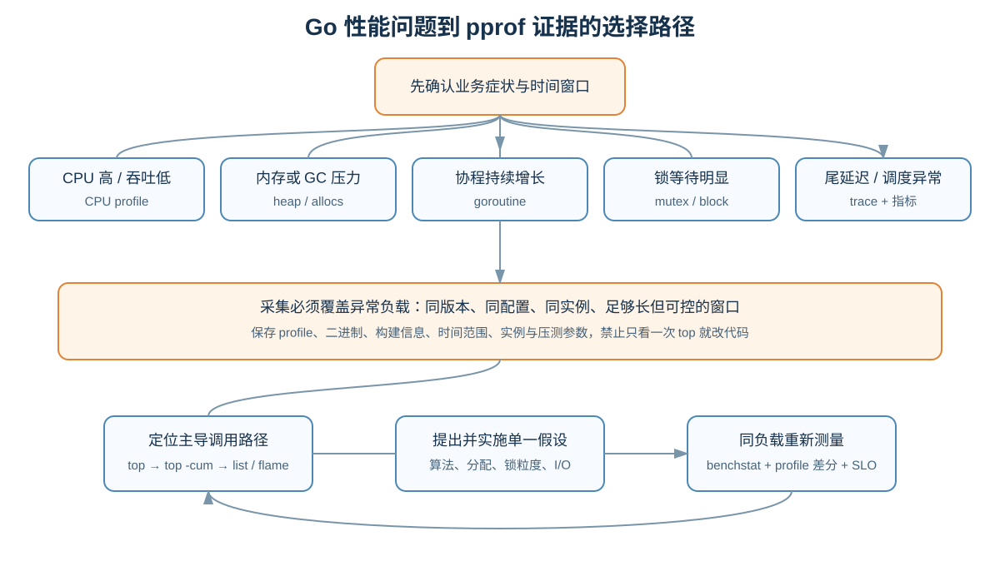
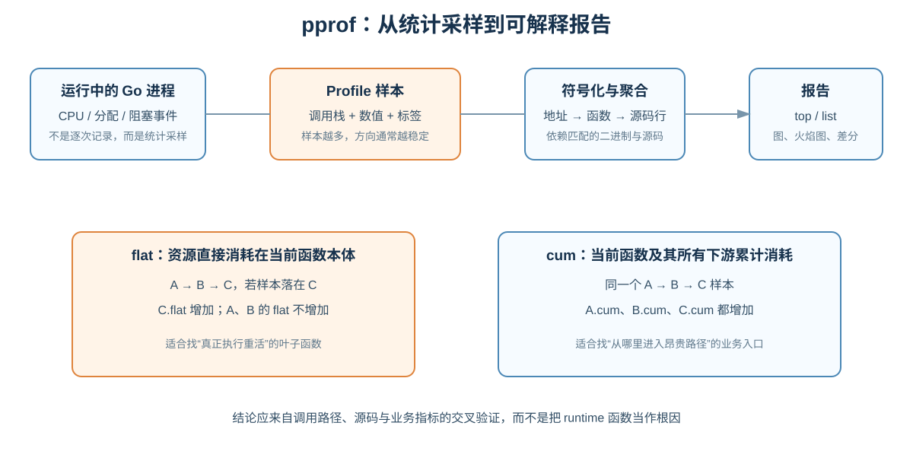
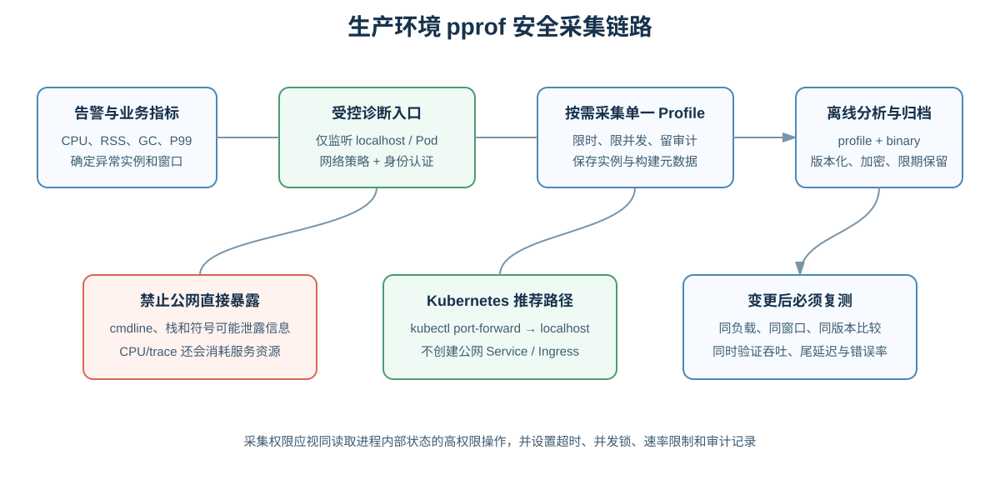

# Go pprof 最佳实战：从开发诊断到生产调优

> `pprof` 不是“生成一张火焰图”的工具，而是一套统计采样、符号化、聚合、过滤和对比性能数据的方法。真正可靠的调优必须形成闭环：**定义问题 → 复现负载 → 采集正确的 profile → 解释调用路径 → 修改一个关键因素 → 在相同条件下复测**。
>
> 本文以现代 Go 工具链为背景。不同 Go 版本可能增加 profile 类型或调整实现细节，生产使用前应以当前版本的 [`net/http/pprof`](https://pkg.go.dev/net/http/pprof)、[`runtime/pprof`](https://pkg.go.dev/runtime/pprof) 文档为准。

## 目录

- [1. pprof 能解决什么问题](#1-pprof-能解决什么问题)
- [2. 采样模型与 flat、cum](#2-采样模型与-flatcum)
- [3. Profile 类型速查](#3-profile-类型速查)
- [4. 开发阶段接入](#4-开发阶段接入)
- [5. Benchmark 与离线程序采集](#5-benchmark-与离线程序采集)
- [6. go tool pprof 完整操作](#6-go-tool-pprof-完整操作)
- [7. CPU 瓶颈定位](#7-cpu-瓶颈定位)
- [8. 内存、分配与 GC 调优](#8-内存分配与-gc-调优)
- [9. Goroutine 泄漏定位](#9-goroutine-泄漏定位)
- [10. Mutex 与 Block 竞争定位](#10-mutex-与-block-竞争定位)
- [11. 线程、调度和尾延迟](#11-线程调度和尾延迟)
- [12. Profile 标签与业务维度](#12-profile-标签与业务维度)
- [13. Profile 差分与优化验证](#13-profile-差分与优化验证)
- [14. 生产环境安全接入](#14-生产环境安全接入)
- [15. Kubernetes 采集方案](#15-kubernetes-采集方案)
- [16. 常见误判与高级技巧](#16-常见误判与高级技巧)
- [17. 标准排障剧本](#17-标准排障剧本)
- [18. 生产检查清单](#18-生产检查清单)

---

## 1. pprof 能解决什么问题



先根据**症状**选证据，不能习惯性只抓 CPU：

| 症状 | 首选证据 | 要回答的问题 |
| --- | --- | --- |
| CPU 高、吞吐下降 | `profile` | CPU 时间消耗在哪条调用路径 |
| RSS/堆持续增长 | `heap` + 两个时间点差分 | 哪些仍存活的对象在增长 |
| GC 频繁、CPU 花在 GC | `allocs` / `heap -alloc_space` | 谁在制造大量短命对象 |
| goroutine 数持续增长 | `goroutine` | 哪类栈不断累积、为什么不能退出 |
| 锁竞争、CPU 利用不足 | `mutex` | 谁持锁使其他 goroutine 等待 |
| channel、锁、WaitGroup 阻塞 | `block` | goroutine 在哪里发生阻塞 |
| OS 线程异常增长 | `threadcreate` | 哪些调用路径触发线程创建 |
| P99 抖动、调度/GC 时序问题 | `go tool trace` | 某段时间内 goroutine 如何被调度 |

`pprof` 擅长回答“资源归属于哪些调用栈”，但它不能单独说明：

- 用户请求为何跨多个服务变慢：结合分布式 tracing。
- CPU 为何被容器节流：结合 cgroup 指标、`container_cpu_cfs_throttled_*`。
- RSS 为何高于 Go heap：结合 `runtime/metrics`、`/proc`、mmap、cgo 和系统工具。
- 某个瞬间的运行时调度因果：使用 execution trace。

## 2. 采样模型与 flat、cum



pprof profile 本质上是若干样本，每个样本通常包含：

1. 一条调用栈；
2. 一个或多个数值，如 CPU 时间、对象数、字节数、阻塞纳秒；
3. 可选标签，如租户、接口或任务类型。

它是**统计采样**，不是每次事件的完整审计。短任务或稀有路径可能没有被采到；采样窗口太短时，排名容易抖动。应让目标工作至少运行数秒，线上 CPU profile 通常取 15～30 秒，并重复采集验证稳定性。

假设调用链为 `HTTPHandler → Encode → json.Marshal`：

- `flat`：函数自身直接消耗，不包含被调函数。`json.Marshal` 很高，说明重活在这里执行。
- `cum`：函数自身及全部下游的累计消耗。`HTTPHandler` 的 `flat` 可能接近零，但 `cum` 很高，说明它是昂贵路径的业务入口。

`top` 找叶子热点，`top -cum` 找入口，再用 `list` 和调用图连接两者。看到 `runtime.mallocgc`、`runtime.gcBgMarkWorker`、`sync.(*Mutex).Lock` 时，不要把 runtime 当根因，要沿调用栈回到业务分配点、共享状态或算法。

## 3. Profile 类型速查

| 类型/端点 | 默认含义 | 关键参数与前置条件 |
| --- | --- | --- |
| `/profile` | 指定窗口内 CPU 样本 | `seconds=N`，默认 30 秒 |
| `/heap` | 最近一次 GC 后仍存活对象的分配栈 | `gc=1` 可先强制 GC；支持 `seconds=N` 差量 |
| `/allocs` | 从进程启动以来的累计分配 | 适合找分配吞吐；支持差量 |
| `/goroutine` | 当前全部 goroutine 栈 | `debug=1/2` 可读文本，`debug=2` 常用于现场看栈 |
| `/mutex` | 造成其他 goroutine 等待的持锁/解锁栈 | 先调用 `runtime.SetMutexProfileFraction` |
| `/block` | 发生同步阻塞的位置 | 先调用 `runtime.SetBlockProfileRate` |
| `/threadcreate` | 导致创建 OS 线程的栈 | 关注 cgo、阻塞 syscall、`LockOSThread` |
| `/trace` | 运行时执行事件 | `seconds=N`，用 `go tool trace` 分析 |
| `/cmdline`、`/symbol` | 命令行和地址符号化辅助接口 | 具有信息泄露风险 |

### 3.1 四种内存视角

同一个 heap profile 可以切换四个 `sample_index`：

| 视角 | 含义 | 典型用途 |
| --- | --- | --- |
| `inuse_space` | 当前存活字节数，默认 | 大对象保留、缓存膨胀、内存泄漏 |
| `inuse_objects` | 当前存活对象数 | 海量小对象、对象级泄漏 |
| `alloc_space` | 历史累计分配字节数 | 分配速率、GC 压力、复制开销 |
| `alloc_objects` | 历史累计分配对象数 | 高频小对象、装箱和临时结构 |

`heap` 不是 RSS。Go heap 之外还可能有 goroutine 栈、runtime 元数据、二进制映射、共享库、cgo 内存和内核缓冲。`inuse_space` 高说明 Go 对象仍可达；`alloc_space` 高但 `inuse_space` 低说明对象大多已回收，问题更可能是分配吞吐和 GC 成本，而非泄漏。

## 4. 开发阶段接入

### 4.1 最短接入方式

仅适合本地开发，并且业务已使用默认 `http.DefaultServeMux`：

```go
import (
    "log/slog"
    "net/http"
    _ "net/http/pprof"
)

func startDebugServer() {
    go func() {
        err := http.ListenAndServe("127.0.0.1:6060", nil)
        if err != nil {
            slog.Error("pprof server stopped", "error", err)
        }
    }()
}
```

`net/http/pprof` 通过副作用把 `/debug/pprof/` 注册到默认 mux。自 Go 1.22 起这些端点要求使用 `GET`。生产代码不建议采用这种隐式注册，因为它可能意外出现在业务监听端口。

### 4.2 推荐的显式独立管理端口

```go
package diagnostics

import (
    "context"
    "errors"
    "log/slog"
    "net"
    "net/http"
    "net/http/pprof"
    "runtime"
    "time"
)

type Server struct {
    httpServer *http.Server
}

func New(address string, enableContentionProfiles bool) *Server {
    mux := http.NewServeMux()
    mux.HandleFunc("GET /debug/pprof/", pprof.Index)
    mux.HandleFunc("GET /debug/pprof/cmdline", pprof.Cmdline)
    mux.HandleFunc("GET /debug/pprof/profile", pprof.Profile)
    mux.HandleFunc("GET /debug/pprof/symbol", pprof.Symbol)
    mux.HandleFunc("GET /debug/pprof/trace", pprof.Trace)
    for _, name := range []string{
        "allocs", "block", "goroutine", "heap", "mutex", "threadcreate",
    } {
        mux.Handle("GET /debug/pprof/"+name, pprof.Handler(name))
    }

    if enableContentionProfiles {
        // 1 表示记录每个事件，开销较高；生产应先压测再选择更稀疏的采样率。
        runtime.SetBlockProfileRate(1)
        runtime.SetMutexProfileFraction(5)
    }

    return &Server{httpServer: &http.Server{
        Addr:              address,
        Handler:           mux,
        ReadHeaderTimeout: 5 * time.Second,
        ReadTimeout:       65 * time.Second, // 必须大于允许的 CPU profile 窗口
        WriteTimeout:      65 * time.Second,
        IdleTimeout:       60 * time.Second,
    }}
}

func (s *Server) Run() error {
    listener, err := net.Listen("tcp", s.httpServer.Addr)
    if err != nil {
        return err
    }
    err = s.httpServer.Serve(listener)
    if errors.Is(err, http.ErrServerClosed) {
        return nil
    }
    return err
}

func (s *Server) Shutdown(ctx context.Context) error {
    return s.httpServer.Shutdown(ctx)
}

func Start(ctx context.Context) {
    server := New("127.0.0.1:6060", true)
    go func() {
        if err := server.Run(); err != nil {
            slog.Error("diagnostics server stopped", "error", err)
        }
    }()
    go func() {
        <-ctx.Done()
        shutdownCtx, cancel := context.WithTimeout(context.Background(), 5*time.Second)
        defer cancel()
        if err := server.Shutdown(shutdownCtx); err != nil {
            slog.Error("diagnostics server shutdown failed", "error", err)
        }
    }()
}
```

关键点：

- 诊断端口与业务端口分离，默认监听 `127.0.0.1`。
- 显式注册端点，便于认证、网络策略和审计。
- CPU profile 是长请求，`WriteTimeout` 不能小于采样时长。
- block 的参数是平均每多少纳秒阻塞时间采一个样本；`1` 记录全部阻塞事件，`0` 关闭。
- mutex 参数 `rate` 约平均每 `rate` 个竞争事件采一个；`1` 全采，`0` 关闭。
- 竞争采样有开销，不应未经压测永久全量开启。

### 4.3 验证端点

```bash
curl http://127.0.0.1:6060/debug/pprof/
curl "http://127.0.0.1:6060/debug/pprof/goroutine?debug=1"
go tool pprof "http://127.0.0.1:6060/debug/pprof/profile?seconds=20"
```

## 5. Benchmark 与离线程序采集

### 5.1 对 benchmark 采集

```bash
go test ./internal/codec \
  -run '^$' \
  -bench '^BenchmarkEncode$' \
  -benchmem \
  -count=5 \
  -benchtime=3s \
  -cpuprofile=cpu.out \
  -memprofile=mem.out \
  -mutexprofile=mutex.out \
  -blockprofile=block.out
```

`-run '^$'` 跳过普通测试；`-count` 适合后续用 `benchstat` 判断噪声。profile 会增加开销，因此基准数值与 profile 分析最好分两次跑：一次不采 profile 得到可信耗时，一次延长负载用于定位热点。

### 5.2 独立 CLI/批处理程序

```go
f, err := os.Create("cpu.pprof")
if err != nil {
    return fmt.Errorf("create cpu profile: %w", err)
}
defer f.Close()

if err := pprof.StartCPUProfile(f); err != nil {
    return fmt.Errorf("start cpu profile: %w", err)
}
defer pprof.StopCPUProfile() // 会等待缓冲数据写完

runWorkload()
```

内存快照：

```go
runtime.GC() // 仅在明确需要“当前存活对象”快照时调用
f, err := os.Create("heap.pprof")
if err != nil {
    return err
}
defer f.Close()
return pprof.WriteHeapProfile(f)
```

不要在正常请求路径频繁 `runtime.GC()`；它会改变被观测系统。一个进程同一时间只能进行一次 CPU profile。

## 6. go tool pprof 完整操作

### 6.1 采集与启动 Web UI

```bash
curl -o cpu.pprof "http://127.0.0.1:6060/debug/pprof/profile?seconds=30"
curl -o heap.pprof "http://127.0.0.1:6060/debug/pprof/heap?gc=1"

go tool pprof -http=127.0.0.1:0 cpu.pprof
go tool pprof -http=127.0.0.1:0 -sample_index=alloc_space heap.pprof
```

`-http=127.0.0.1:0` 让系统选择空闲端口。Web UI 可查看 Graph、Flame Graph、Top、Source 和 Peek。Graphviz 是生成部分图形报告所需的外部依赖。

### 6.2 交互命令

```text
top                 # 按 flat 排序
top -cum            # 按累计成本排序
top 30              # 展示前 30 项
list Encode         # 正则匹配函数，显示逐行源码成本
weblist Encode      # 源码与汇编结合
peek Handler        # 看调用者与被调用者
tree                # 文本调用树
traces              # 展开原始样本栈，输出可能很大
tags                # 查看 profile 标签分布
focus=my/module     # 仅保留包含该正则的调用栈
ignore=runtime      # 排除匹配路径，仅用于降噪，不能代替根因分析
help
```

典型 `top` 列：

```text
flat  flat%  sum%   cum   cum%   name
```

- `sum%` 是当前列表自上而下的 `flat%` 累计值，不是函数的累计成本。
- `Dropped Nodes` 表示图为可读性裁剪了节点，不代表样本丢失；调低阈值或使用 `nodecount`。
- `list` 无法显示源码时，应提供采集时对应的二进制和源码；容器构建应保留构建产物与 build ID。

### 6.3 非交互报告

```bash
go tool pprof -top cpu.pprof
go tool pprof -top -cum cpu.pprof
go tool pprof -list='Encode|Marshal' cpu.pprof
go tool pprof -svg -output=cpu.svg cpu.pprof
go tool pprof -sample_index=inuse_objects -top heap.pprof
```

## 7. CPU 瓶颈定位

### 7.1 标准步骤

1. 确认 CPU 真正繁忙，而不是容器节流或宿主机争用。
2. 在异常负载持续期间采集 15～30 秒，必要时采三次。
3. `top` 找直接消耗，`top -cum` 找业务入口。
4. 用 Flame Graph 沿“宽”路径向下钻取。
5. `list 函数名` 定位到源码行，检查算法、序列化、正则、复制、哈希和分配。
6. 修改后在相同负载、实例规格和 Go 版本下重测。

火焰图中：

- 每个框代表函数；宽度代表该函数出现在样本中的比例。
- 纵向表示调用关系，不代表时间轴。
- 顶部宽框通常是直接执行热点；底部宽框通常是入口或公共框架。
- 颜色通常不代表“更慢”，不要按颜色判断热点。

### 7.2 常见热点与行动

| 热点 | 常见原因 | 优先检查 |
| --- | --- | --- |
| `runtime.mallocgc` / GC worker | 高频分配导致 GC | `alloc_space`、逃逸分析、容量预估 |
| `encoding/json` / 反射 | 序列化和动态类型 | 是否重复编码、字段模型、替代协议前先 benchmark |
| map 哈希函数 | 大量 map 查找 | 算法复杂度、是否可用切片/索引、键类型 |
| `runtime.memmove` | 大量复制 | 字节转换、切片扩容、重复拼接 |
| regexp | 复杂匹配或重复编译 | 预编译、缩小输入、改为专用解析 |
| syscall/cgo | 内核或外部代码 | pprof 可能不完整，结合 `perf`、系统指标 |

不要优化 1% 的函数而忽略 40% 的调用路径。Amdahl 定律决定了优化收益受目标路径占比上限约束。

## 8. 内存、分配与 GC 调优

### 8.1 判断“泄漏”还是“分配过快”

```bash
go tool pprof -sample_index=inuse_space heap.pprof
go tool pprof -sample_index=inuse_objects heap.pprof
go tool pprof -sample_index=alloc_space heap.pprof
go tool pprof -sample_index=alloc_objects heap.pprof
```

- `inuse_space` 随时间单调增长：可能存在对象保留、无界缓存或引用泄漏。
- `alloc_space` 很高而 `inuse_space` 稳定：大量短命对象，重点降低分配率。
- `inuse_objects` 高、`inuse_space` 不高：大量小对象，元数据与 GC 扫描成本可能突出。
- RSS 高但 heap 不高：检查 goroutine 栈、cgo、mmap、文件缓存和内存归还行为。

### 8.2 两点差分定位增长

```bash
curl -o heap-t0.pb.gz "http://127.0.0.1:6060/debug/pprof/heap?gc=1"
sleep 300
curl -o heap-t1.pb.gz "http://127.0.0.1:6060/debug/pprof/heap?gc=1"

go tool pprof -http=127.0.0.1:0 \
  -sample_index=inuse_space \
  -base=heap-t0.pb.gz \
  heap-t1.pb.gz
```

`gc=1` 会影响延迟，仅在可接受的实例上执行。差分显示窗口内净增长，比单张快照更适合找泄漏。仍需在多个时间点重复，排除缓存预热和正常工作集增长。

### 8.3 典型优化

- `make([]T, 0, expected)` 预估容量，避免扩容复制。
- 用 `strings.Builder` / `bytes.Buffer` 替代循环字符串拼接。
- 避免无意义的 `string` 与 `[]byte` 往返转换。
- 流式处理大响应，避免一次性读取全部数据。
- 给 map、缓存、队列设置容量、TTL、淘汰和可观测指标。
- 检查大切片的小视图是否仍引用整个底层数组；必要时复制需要保留的小段。
- `sync.Pool` 只适合可复用临时对象；它不是缓存，GC 可随时清空，错误使用可能增加常驻内存。
- 先优化对象生命周期和算法，再调整 `GOGC`、`GOMEMLIMIT`；运行时参数不能修复无界保留。

## 9. Goroutine 泄漏定位

先监控 `runtime.NumGoroutine()` 或 `/sched/goroutines:goroutines`。数量增长只是信号，真正证据是同类栈持续累积：

```bash
curl -o goroutine.txt \
  "http://127.0.0.1:6060/debug/pprof/goroutine?debug=2"
go tool pprof -http=127.0.0.1:0 \
  "http://127.0.0.1:6060/debug/pprof/goroutine"
```

常见栈状态：

- `[chan send]`：发送端没有消费者、消费者退出或队列无背压策略。
- `[chan receive]`：生产者结束但 channel 未关闭，或退出信号没有传播。
- `[select]`：缺少 `ctx.Done()` 分支，生命周期失控。
- `[semacquire]`：锁、WaitGroup 或连接池长时间等待。
- `[IO wait]`：网络调用缺少 deadline，连接永不结束。

对比两个时间点的 goroutine profile；如果某个业务栈的数量持续增加，就沿栈找到创建点和退出条件。修复通常不是“减少 goroutine”，而是建立所有权：谁创建、谁取消、谁等待、谁关闭资源。测试中可记录操作前后数量，但必须给 runtime 后台 goroutine 留余量，并优先断言业务 goroutine 能随 context 退出。

## 10. Mutex 与 Block 竞争定位

### 10.1 两者不要混淆

- `mutex` 栈通常指向 `Unlock` 附近，即**谁持有锁并导致别人等待**。
- `block` 栈指向发生阻塞的位置，即**谁在等待**，覆盖 mutex、channel、select、WaitGroup、Cond 等。

```bash
curl -o mutex.pb.gz \
  "http://127.0.0.1:6060/debug/pprof/mutex?seconds=30"
curl -o block.pb.gz \
  "http://127.0.0.1:6060/debug/pprof/block?seconds=30"

go tool pprof -top -cum mutex.pb.gz
go tool pprof -top block.pb.gz
```

mutex 的累计等待时间可能大于墙钟时间：一个锁持有 1 秒且 5 个 goroutine 同时等待，可累计约 5 秒竞争时间。

优化顺序：

1. 缩短临界区，锁内禁止网络、磁盘和慢序列化。
2. 降低共享状态，按租户、哈希或 CPU 分片。
3. 检查是否把一个全局锁用于互不相关的数据。
4. 读多写少时再评估 `RWMutex`；它并非天然快，写竞争下可能更差。
5. 用原子操作或 channel 前先 benchmark，复杂同步常把问题换成其他成本。

## 11. 线程、调度和尾延迟

`threadcreate` 适合调查 OS 线程异常增长，但 goroutine 多不等于线程多。常见诱因包括 cgo、长时间阻塞 syscall、频繁 `runtime.LockOSThread`。

当 CPU profile 没有明显热点，但 P99 抖动明显时，采短 trace：

```bash
curl -o trace.out \
  "http://127.0.0.1:6060/debug/pprof/trace?seconds=5"
go tool trace trace.out
```

trace 可观察 goroutine 调度、GC、网络阻塞、syscall、处理器利用率和用户 region。它记录事件更细，文件与开销增长更快，生产窗口应短且受控。诊断资料可能互相扰动；精确 CPU、block 和 trace 最好分开采集。

## 12. Profile 标签与业务维度

同一个函数服务多个租户或任务时，仅看函数名无法归因。可使用 `runtime/pprof` 标签：

```go
func Handle(ctx context.Context, tenant, operation string) error {
    labels := pprof.Labels(
        "tenant", tenant,
        "operation", operation,
    )
    var err error
    pprof.Do(ctx, labels, func(ctx context.Context) {
        err = execute(ctx)
    })
    return err
}
```

分析：

```bash
go tool pprof -tags cpu.pprof
go tool pprof -tagfocus='operation=export' cpu.pprof
go tool pprof -http=127.0.0.1:0 -tagfocus='tenant=tier-premium' cpu.pprof
```

当前标签主要被 CPU 和 goroutine profile 使用。标签值必须低基数，禁止放 user ID、request ID 等无限增长维度，也不要写入敏感数据。`pprof.Do` 内启动的 goroutine 会继承标签；手工切换 goroutine 标签时才考虑更底层的 `SetGoroutineLabels`。

## 13. Profile 差分与优化验证

### 13.1 两种差分

```bash
# 比较优化前后两个独立窗口，可能出现负值
go tool pprof -diff_base=before-cpu.pb.gz after-cpu.pb.gz

# 累计 profile 的时间差，例如同一进程先后两个 heap/allocs 快照
go tool pprof -base=heap-t0.pb.gz heap-t1.pb.gz
```

- `-diff_base` 适合“版本 A 与版本 B”；负值表示新版本在该路径减少。
- `-base` 适合从后一个累计 profile 中减去同进程较早快照。
- 两份 profile 必须类型兼容；负载、时长、实例规格和采样设置也应一致。
- `-normalize` 可归一化总样本后比较占比，但可能掩盖“总 CPU 已整体上升”，必须同时看绝对业务指标。

### 13.2 完整验证标准

一次优化只有同时满足以下条件才可接受：

- benchmark 多轮结果具有统计意义；
- CPU/分配/竞争 profile 中目标路径确实下降；
- 生产式压测下吞吐、P95/P99、错误率符合目标；
- 没把 CPU 换成内存、把平均延迟换成尾延迟；
- 代码复杂度、正确性和可维护性代价可接受。

## 14. 生产环境安全接入



`/debug/pprof` 可能暴露命令行参数、包名、函数名、源码路径、goroutine 栈和内部拓扑；CPU profile 与 trace 还可消耗服务资源。它应被视为高权限诊断接口。

生产要求：

- 只监听 loopback、Unix socket 或受控管理网络，禁止直接配置公网 Ingress。
- 使用独立端口、mTLS/身份代理、网络策略和最小权限。
- 限制采集时长、请求并发和频率；同一实例同一时间只采一个重型 profile。
- 记录操作者、实例、类型、起止时间和工单，敏感 profile 加密并设置保留期。
- 自动采集随机少量副本，避免同时冲击整个服务。
- 采集前观察实例余量，采集中监控错误率与 P99，异常立即停止。
- 保存 `profile + 精确二进制 + Go 版本 + commit/build ID + 配置摘要 + 负载信息`。

一个简单的 HTTP Basic Auth 不是充分边界，尤其当入口仍暴露在公网。认证应位于成熟的管理平面或 sidecar 代理中；应用内中间件还应增加超时、并发信号量和审计。

## 15. Kubernetes 采集方案

推荐不创建对外 Service，直接端口转发：

```bash
kubectl -n payments get pods -l app=payment-api
kubectl -n payments port-forward pod/payment-api-7d9c 6060:6060

curl -o payment-cpu.pb.gz \
  "http://127.0.0.1:6060/debug/pprof/profile?seconds=30"
go tool pprof -http=127.0.0.1:0 payment-cpu.pb.gz
```

若进程只监听 `127.0.0.1:6060`，`kubectl port-forward pod/...` 通常可用于访问 Pod 内端口；具体取决于集群实现和网络限制。大规模持续剖析可采用集中式 continuous profiling 平台，但仍需控制采样、标签基数、数据权限和保留周期。

容器调查必须同步记录：

```bash
kubectl -n payments top pod payment-api-7d9c --containers
kubectl -n payments describe pod payment-api-7d9c
```

CPU 达到 limit 可能是节流而非代码热点；发生 OOMKill 时，上一进程的 HTTP profile 已不可取，应在告警阶段提前采集，或由平台周期性保存 profile。

## 16. 常见误判与高级技巧

1. **只看一次 5 秒 profile**：样本太少。延长稳定负载并重复采集。
2. **把 flat 最高当唯一根因**：库函数只是执行点；结合 `cum` 找业务入口。
3. **看到内存高只看 allocs**：泄漏应先看 `inuse_*` 和时间差；GC 压力看 `alloc_*`。
4. **强制 GC 后认为生产常态如此**：`gc=1` 改变现场；同时保留未强制 GC 的快照和运行时指标。
5. **用百分比比较不同总量**：10% of 100 cores 比 30% of 10 cores 更大；看绝对值和吞吐。
6. **profile 与二进制不匹配**：源码行、内联和符号会失真；按 build ID 归档。
7. **调试构建替代生产构建**：`-N -l` 会改变内联和性能，仅用于调试器，不应用于生产 profile。
8. **忽视内联**：必要时使用 `-noinlines` 辅助归因，但最终仍以生产构建为准。
9. **忽视采样开销**：先在压测环境量化每类 profile 的 CPU、延迟和文件增长。
10. **直接调 GOGC 掩盖分配问题**：先减少分配；再依据内存预算权衡 GC CPU 与堆空间。

PGO 可使用代表性生产 CPU profile：

```bash
cp representative-cpu.pprof default.pgo
go build -pgo=default.pgo ./cmd/server
```

PGO 不是手工调优替代品。profile 必须覆盖代表性负载；构建后仍要 benchmark、压测并验证二进制版本。过于偏向单一接口的 profile 可能让其他工作负载退化。

## 17. 标准排障剧本

### 剧本 A：CPU 90%，QPS 下降

1. 排除 cgroup throttling，确认负载持续。
2. 抓 30 秒 CPU profile，同时记录 QPS/P99。
3. `top`、`top -cum`、Flame Graph、`list` 定位路径。
4. 若 `mallocgc`/GC 高，转抓 `alloc_space`。
5. 优先修算法、重复计算和大量分配。
6. 同条件复测并用 `-diff_base` 对比。

### 剧本 B：内存每小时增长

1. 同一进程在稳定流量下每 5～10 分钟抓 `heap?gc=1`。
2. 用 `inuse_space` 和 `inuse_objects` 做相邻差分。
3. 检查缓存、map、队列、订阅者、timer、切片底层数组和 goroutine。
4. 验证对象增长是否与业务基数一致。
5. 修复后长时间 soak test，确认斜率归零或进入稳定平台。

### 剧本 C：CPU 不高但 P99 很差

1. 查下游延迟、连接池、容器节流和运行队列。
2. 开启经压测的 mutex/block 采样，分别抓窗口 profile。
3. 若无明显竞争，抓 1～5 秒 trace。
4. 检查锁内 I/O、连接池等待、channel 背压、GC 和调度空洞。

### 剧本 D：goroutine 数持续增加

1. 每隔数分钟保存 goroutine profile。
2. 找数量增长最快的同类栈。
3. 检查 context 传播、超时、channel 关闭、响应体关闭和 WaitGroup。
4. 加生命周期测试与 goroutine 指标告警。

## 18. 生产检查清单

### 接入

- [ ] pprof 使用独立管理端口和显式 mux。
- [ ] 默认只监听 loopback/受控网络，不经公网 Ingress。
- [ ] 具备认证授权、网络策略、超时、限并发和审计。
- [ ] block/mutex 采样率经过压测，可配置和关闭。
- [ ] profile 时长不被 HTTP `WriteTimeout` 截断。

### 采集

- [ ] 明确症状、实例、异常时间窗口和成功标准。
- [ ] 一次只采集一个高开销诊断数据。
- [ ] 保存原始 profile、二进制、build ID、Go 版本和负载信息。
- [ ] CPU 窗口足够长，内存泄漏使用多时间点差分。
- [ ] 采集过程中监控服务错误率和尾延迟。

### 分析与优化

- [ ] 同时看 `flat`、`cum`、调用图和源码行。
- [ ] 内存明确选择 `inuse_*` 或 `alloc_*`。
- [ ] 将 runtime 热点追溯到业务调用点。
- [ ] 每次修改对应明确假设，避免一次改多个变量。
- [ ] 用 benchmark、profile 差分和生产式压测共同验证。
- [ ] 检查 CPU、内存、延迟、吞吐、错误率之间的代价转移。

---

## 参考资料

- [Go 官方 Diagnostics](https://go.dev/doc/diagnostics)
- [`net/http/pprof` 官方文档](https://pkg.go.dev/net/http/pprof)
- [`runtime/pprof` 官方文档](https://pkg.go.dev/runtime/pprof)
- [Google pprof 使用手册](https://github.com/google/pprof/blob/main/doc/README.md)
- [Go Blog：Profiling Go Programs](https://go.dev/blog/pprof)

> 最可靠的 pprof 使用方式不是背命令，而是始终问四个问题：**正在解释哪一种资源？采样覆盖了哪段真实负载？这条调用栈为何产生资源消耗？修改后如何证明整体 SLO 变好？**
