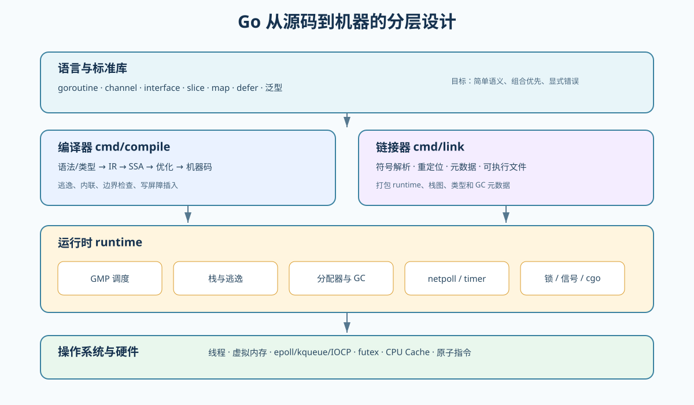
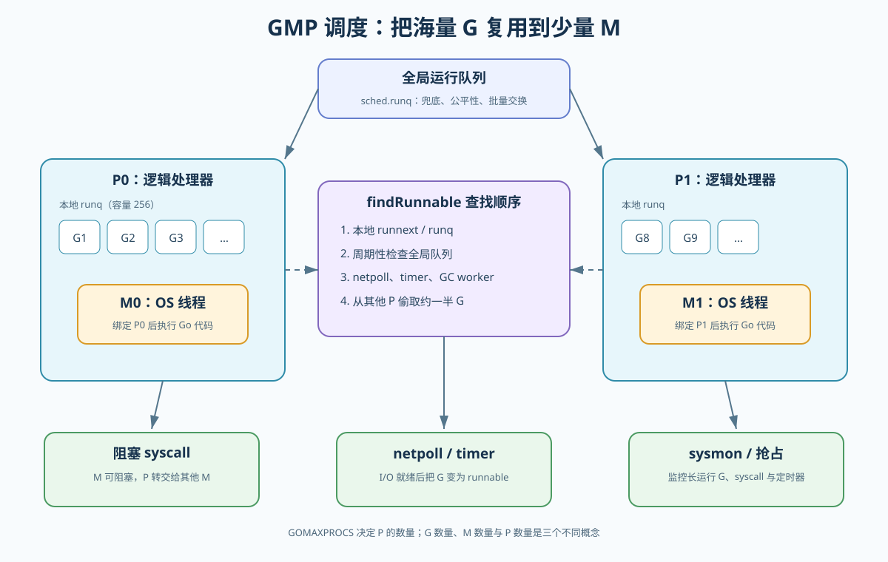
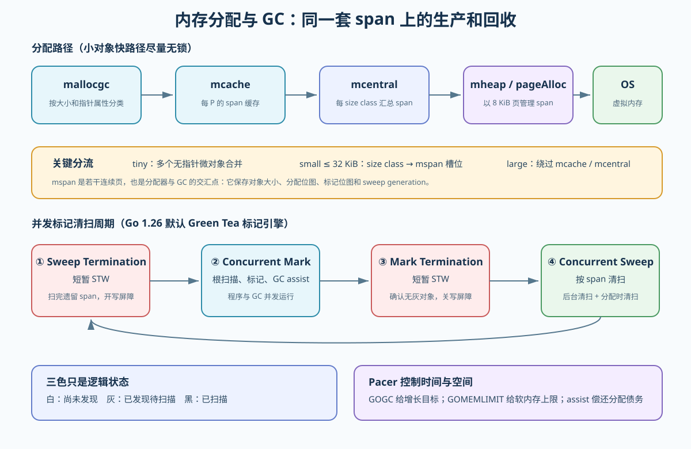
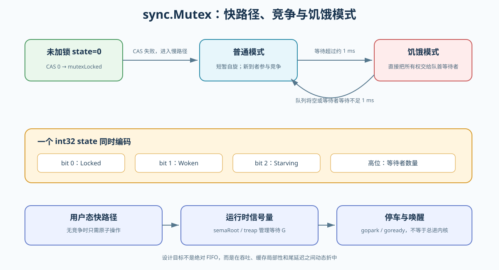

# Go 语言设计与实现：从历史选择到 Go 1.26.5 运行时源码

> 本文面向已经掌握 Go 基础语法、希望真正理解“为什么这样设计”的读者。内容以 **Go 1.26.5（2026-07-07 发布）**为源码基线，重点分析编译器、GMP 调度器、栈、内存分配器、Green Tea GC、`sync.Pool`、锁、channel、map 与网络轮询等模块。
>
> 运行时内部结构不是 Go 1 兼容承诺的一部分，字段和算法可能继续演进。生产代码不应通过 `unsafe` 或 `//go:linkname` 依赖这些细节；本文中的简化结构只用于建立心智模型。

## 目录

- [1. 先理解 Go 在解决什么问题](#1-先理解-go-在解决什么问题)
- [2. Go 的发展历史：每次演进都在偿还什么成本](#2-go-的发展历史每次演进都在偿还什么成本)
- [3. 从源代码到运行中的程序](#3-从源代码到运行中的程序)
- [4. GMP 调度模型](#4-gmp-调度模型)
- [5. goroutine 栈、逃逸与抢占](#5-goroutine-栈逃逸与抢占)
- [6. 内存分配器：mcache、mcentral、mheap](#6-内存分配器mcachemcentralmheap)
- [7. GC：从三色标记到 Green Tea](#7-gc从三色标记到-green-tea)
- [8. 写屏障、GC Assist 与 Pacer](#8-写屏障gc-assist-与-pacer)
- [9. MP 与对象复用：sync.Pool](#9-mp-与对象复用syncpool)
- [10. 锁：从原子快路径到 goroutine 停车](#10-锁从原子快路径到-goroutine-停车)
- [11. channel、select 与 sudog](#11-channelselect-与-sudog)
- [12. 网络轮询器、timer 与 syscall](#12-网络轮询器timer-与-syscall)
- [13. map、slice、string 与 interface](#13-mapslicestring-与-interface)
- [14. defer、panic 与 recover](#14-deferpanic-与-recover)
- [15. Go 内存模型](#15-go-内存模型)
- [16. cgo 与运行时边界](#16-cgo-与运行时边界)
- [17. 如何阅读和验证 Go 源码](#17-如何阅读和验证-go-源码)
- [18. 生产问题如何映射到运行时原理](#18-生产问题如何映射到运行时原理)
- [19. 总结](#19-总结)

---

## 1. 先理解 Go 在解决什么问题

Go 并不是为了在语法层面“比 C++ 更强”，而是为了降低大型软件工程的总体成本。它诞生时，Google 面临的是多核硬件、网络服务、大规模代码库和漫长构建时间共同带来的问题：

1. C/C++ 能力很强，但构建、依赖和语言复杂度不断上升。
2. 线程适合操作系统，却不是编写百万连接服务的理想抽象。
3. 手工内存管理容易把局部性能收益变成全局可靠性风险。
4. 动态语言开发快，但静态检查、部署和持续性能不够理想。

Go 的核心选择可以概括为：

| 选择 | 得到什么 | 付出什么 |
| --- | --- | --- |
| 垃圾回收 | 内存安全、简化所有权 | GC CPU、内存余量和尾延迟 |
| goroutine + channel | 低成本并发、同步通信 | 仍需处理泄漏、竞争和背压 |
| 小而稳定的语言 | 易学、易读、工具容易统一 | 少一些表达自由，抽象更克制 |
| 静态链接和快速编译 | 部署直接、构建反馈快 | 二进制较大，运行时被链接进程序 |
| 组合而非继承 | 依赖关系简单 | 某些框架式抽象写起来不够“魔法” |
| 显式错误值 | 控制流可见 | 错误处理代码较多 |



一个关键认知是：

> Go 的简洁主要来自把复杂度集中到编译器、运行时和工具链，而不是让复杂度消失。

开发者写一条 `go f()` 很简单，但运行时要完成 G 的创建、入队、工作线程唤醒、栈管理、抢占、GC 扫描和退出回收。理解 Go 的本质，就是理解这些隐藏成本如何被控制。

---

## 2. Go 的发展历史：每次演进都在偿还什么成本

### 2.1 关键时间线

| 时间/版本 | 重要变化 | 背后的问题 |
| --- | --- | --- |
| 2007 | Robert Griesemer、Rob Pike、Ken Thompson 开始设计 Go | 大型 C++ 工程构建慢、复杂度高，多核与网络编程困难 |
| 2009 | Go 开源 | 公开验证语言、工具链与并发模型 |
| 2012，Go 1 | 发布兼容性承诺 | 生态需要稳定语义，而不是持续破坏式创新 |
| Go 1.1 | 新调度器逐步确立 G-M-P 模型 | 旧调度器全局锁重、线程亲和性和 syscall 处理不足 |
| Go 1.3 | goroutine 栈改为连续、可复制栈 | 分段栈容易出现 hot split，调用边界反复扩缩 |
| Go 1.5 | 编译器和运行时由 C 重写为 Go；并发 GC 大幅推进 | 降低自举维护成本，缩短 GC 停顿 |
| Go 1.8 | GC 停顿进一步下降 | 服务端程序对尾延迟越来越敏感 |
| Go 1.14 | 基于信号的异步抢占 | 无函数调用的长循环也应被抢占 |
| Go 1.18 | 泛型正式加入 | 在保持语言克制的同时减少容器、算法的重复实现 |
| Go 1.19 | 修订内存模型；加入 `GOMEMLIMIT` | 明确原子操作语义，并让 GC 感知容器内存约束 |
| Go 1.21 | PGO 正式可用，工具链管理增强 | 用真实 Profile 指导编译优化，降低升级成本 |
| Go 1.22 | `for` 循环变量语义修正 | 消除闭包捕获循环变量的高频陷阱 |
| Go 1.23 | range-over-func 迭代器 | 为自定义集合提供语言级迭代协议 |
| Go 1.24 | map 切换到 Swiss Table 系列设计 | 提升局部性、查询效率和大 map 扩展能力 |
| Go 1.25 | Green Tea GC 作为实验；容器感知的 `GOMAXPROCS` | 提升小对象扫描局部性，适配 CPU quota |
| Go 1.26 | Green Tea GC 默认启用 | 降低 GC 密集应用的标记扫描开销 |

### 2.2 Go 1 兼容承诺的意义

Go 1 的核心承诺是：按规范编写的旧代码，通常应继续在新的 Go 1.x 工具链上编译运行。它并不保证：

- 编译器每次都做相同的逃逸、内联或去虚化决策；
- `runtime` 私有结构的字段和地址不变；
- map 迭代顺序稳定；
- GC 算法、调度顺序和性能特征完全不变；
- 使用 `unsafe`、汇编或 `//go:linkname` 的代码自动兼容。

因此应区分三层结论：

1. **语言规范保证**：可以作为程序正确性的依据。
2. **标准库 API 保证**：通常受 Go 1 兼容承诺保护。
3. **当前实现细节**：只能用于解释、诊断和优化，升级时必须重新验证。

---

## 3. 从源代码到运行中的程序

### 3.1 编译流水线

Go 编译器位于 `src/cmd/compile`，可以把主要过程简化为：

```text
.go 源文件
   ↓ 词法、语法解析
AST
   ↓ 名字解析、类型检查、泛型实例化
类型化 IR
   ↓ walk：语义展开、逃逸分析、闭包/defer 等转换
SSA
   ↓ 内联、常量传播、死代码消除、边界检查消除、去虚化
目标机器码与 GC 元数据
   ↓ cmd/link 链接
可执行文件
```

编译器不只是“翻译语法”，它还要与运行时订立契约：

- 在可能增长栈的函数入口插入栈检查；
- 在 GC 标记期需要的位置插入写屏障；
- 为每个安全点生成栈上的指针位图；
- 把 `make(chan T, n)` 降低为 `runtime.makechan`；
- 把 `go f(x)` 降低为创建 goroutine 的运行时调用；
- 在适合时把 `defer` 改写成开放编码，避免通用链表开销；
- 决定变量位于栈还是堆，但不改变语言可观察语义。

### 3.2 启动过程

操作系统加载可执行文件后，并不是直接调用用户的 `main.main`。运行时大致经历：

```text
平台入口 _rt0_*
  → runtime.rt0_go
  → 建立 m0、g0，检查 CPU，初始化 TLS
  → runtime.schedinit
  → 创建 main goroutine
  → runtime.mstart
  → runtime.main
  → 包初始化
  → main.main
```

几个特殊对象：

- `m0`：进程启动时的第一个 M。
- `g0`：每个 M 都有的系统 goroutine，使用固定的系统栈执行调度、栈扩张和部分运行时工作。
- `gsignal`：处理信号的专用 G。

普通 G 不能在自己的可移动栈上完成“复制自己的栈”等操作，所以会通过 `mcall` 切换到 `g0` 的系统栈。

### 3.3 编译器与运行时为何紧密耦合

例如一条普通指针赋值：

```go
node.next = child
```

非 GC 标记期可以直接写；并发标记期则可能需要调用写屏障。编译器生成类似的概念逻辑：

```go
if runtime.writeBarrier.enabled {
    runtime.gcWriteBarrier(...)
} else {
    node.next = child
}
```

这说明 Go 的性能不能只看语法。相同的一行源码，可能因为逃逸、内联、GC 阶段或动态类型不同而生成不同路径。

---

## 4. GMP 调度模型

### 4.1 G、M、P 到底是什么



| 对象 | 含义 | 持有什么 |
| --- | --- | --- |
| G（goroutine） | 一段可暂停、可恢复的 Go 执行任务 | 栈、寄存器现场、状态、等待原因、关联的 `sudog` |
| M（machine） | 操作系统线程的运行时表示 | 当前 G、`g0`、绑定的 P、线程状态、信号栈 |
| P（processor） | 执行 Go 代码所需的逻辑资源 | 本地运行队列、`mcache`、timer、GC work cache |

最容易混淆的三件事：

- `GOMAXPROCS` 决定 P 的数量，不是 G 数量；
- M 是 OS 线程，但 M 的数量不等于 P；
- 一个 M 必须绑定 P 才能执行普通 Go 代码，但阻塞 syscall 中的 M 可以暂时没有 P。

可以把它们类比为：

> G 是待处理订单，M 是工人，P 是包含工作台、工具和本地待办队列的工位。工人必须站在工位上才能处理 Go 订单；工人去外部办事时，工位可以交给另一名工人。

### 4.2 核心结构

Go 1.26.5 的定义主要位于 [`runtime/runtime2.go`](https://github.com/golang/go/blob/go1.26.5/src/runtime/runtime2.go)。下面是删去大量字段后的概念结构：

```go
type g struct {
    stack       stack
    stackguard0 uintptr
    sched       gobuf
    atomicstatus atomic.Uint32
    m           *m
    goid        uint64
    waitreason  waitReason
    preempt     bool
    schedlink   guintptr
    waiting     *sudog
}

type m struct {
    g0       *g
    curg     *g
    p        puintptr
    nextp    puintptr
    oldp     puintptr
    spinning bool
    locks    int32
    lockedg  guintptr
}

type p struct {
    id         int32
    status     uint32
    m          muintptr
    mcache     *mcache
    runqhead   uint32
    runqtail   uint32
    runq       [256]guintptr
    runnext    guintptr
    timers     timers
    gcw        gcWork
}
```

这里能看到两个重要设计：

1. 把高频可变状态放到 P 本地，减少所有线程争抢一个全局锁。
2. 调度、分配器、timer 和 GC 都围绕 P 做局部化，以获得 CPU Cache 局部性。

### 4.3 G 的生命周期

主要状态可简化为：

```text
           newproc
 _Gidle ───────────→ _Grunnable
                         │
                         │ execute
                         ▼
                     _Grunning
                     /    |    \
          gopark    /     |     \ goexit
                   ▼      |      ▼
              _Gwaiting   |    _Gdead
                   │      |
            goready│      │抢占
                   └────→ _Grunnable
```

还存在 `_Gsyscall`、`_Gcopystack` 和带 `_Gscan` 标志的 GC 扫描状态。状态转换通常通过原子操作完成，运行时会严格检查非法转换。

创建路径的关键入口位于 [`runtime/proc.go`](https://github.com/golang/go/blob/go1.26.5/src/runtime/proc.go)：

```text
go f()
  → runtime.newproc
  → newproc1：取得或创建 G，初始化入口 PC 与栈
  → runqput：放入当前 P 的 runnext 或本地队列
  → wakep：必要时唤醒/创建 M
```

`go` 语句只保证新 G 会被安排执行，不保证它立即执行，更不保证先于下一行代码执行。

### 4.4 调度循环

M 在 `schedule` 中反复寻找可运行 G，核心是 `findRunnable`：

```text
schedule
  → findRunnable
      → GC worker
      → 当前 P 的 runnext / 本地 runq
      → 周期性查看全局 runq
      → netpoll 已就绪 G
      → 到期 timer
      → 从其他 P work stealing
  → execute(gp)
  → gogo(&gp.sched)
```

查找顺序会随版本调整，不应依赖精确顺序。但可以依赖这些设计原则：

- **本地优先**：减少锁竞争和缓存迁移。
- **全局兜底**：处理本地队列溢出并提供公平性。
- **工作窃取**：空闲 P 从繁忙 P 窃取任务。
- **I/O 融合**：网络就绪事件直接转化为 runnable G。
- **GC 融合**：调度器可以安排 GC worker。

当前实现会周期性检查全局队列，避免两个 G 在同一个 P 上不断相互唤醒而使全局任务饥饿。历史上常见的源码细节是每隔约 61 个调度 tick 检查一次；这是实现策略，不是 API 契约。

### 4.5 本地队列、全局队列与 runnext

每个 P 有容量为 256 的环形本地运行队列，并有一个特殊的 `runnext`：

- 普通 G 进入本地队列尾部；
- `runnext` 倾向于让刚唤醒的相关 G 接着运行，并可继承当前时间片；
- 本地队列满时，一部分 G 会批量转移到全局队列；
- P 无任务时可从其他 P 窃取约一半任务。

`runnext` 改善生产者/消费者、锁交接等场景的局部性，但调度器不会承诺严格 FIFO。Go 调度器追求的是吞吐、公平性和局部性的折中。

### 4.6 为什么不直接“新 G 对应新线程”

一对一线程模型的问题包括：

- 线程栈通常更大，百万线程不可行；
- 创建、销毁和内核调度开销高；
- 线程阻塞会占用内核资源；
- 很难在语言运行时层配合 GC、timer 和网络轮询。

GMP 是 M:N 调度：大量 G 复用到较少 M，再由操作系统调度 M。它既没有绕过 OS 调度，也不是一个固定大小的传统线程池。

### 4.7 M 的自旋与休眠

当有空闲 P，却暂时找不到 G 时，M 可能短暂处于 spinning 状态。设计难点在于：

- 立即休眠：新任务到来时需要唤醒线程，增加延迟；
- 一直自旋：浪费 CPU 和电量；
- 每提交一个 G 都唤醒 M：造成线程频繁抖动。

当前策略大意是：有空闲 P 且没有其他 spinning M 时，才唤醒一个额外 M；最后一个 spinning M 找到工作后，还要确保必要时补充新的 spinning M。`proc.go` 文件开头对此有非常详细的设计注释。

### 4.8 系统监控 sysmon

`sysmon` 是不需要 P 的系统监控线程，主要协助：

- 检查长时间运行的 G 并请求抢占；
- 从长时间 syscall 中夺回 P；
- 处理 timer 与 netpoll；
- 在长期没有 GC 时触发强制 GC；
- 协助 scavenger 等运行时任务。

它不是“万能后台线程”，也不会替应用修复无界并发和锁竞争。

---

## 5. goroutine 栈、逃逸与抢占

### 5.1 为什么 goroutine 可以很轻

goroutine 的初始栈较小，并按需扩张。具体初始大小与平台有关，常见 Unix 64 位平台通常是 2 KiB，Windows 64 位平台可能更大。相比为每个线程预留很大的地址空间，这更适合大量并发任务。

每个可增长栈函数入口都会检查：

```text
SP 是否接近 stackguard0
  否 → 正常执行
  是 → morestack → 切到 g0 → newstack → 扩栈/抢占
```

扩栈时，运行时申请更大的连续栈、复制旧栈，并调整栈内指针。编译器生成的精确栈图告诉 GC 和栈复制器哪些字是指针。

### 5.2 从分段栈到连续可复制栈

早期 Go 使用分段栈：空间不足就链接一个新栈段。它的典型问题是 hot split：

```text
函数 A 在循环中调用 B
→ B 入口刚好触发扩段
→ B 返回又释放段
→ 下一轮再次扩段
```

Go 1.3 后采用连续、可复制栈。扩张单次更贵，但摊销更好，调用路径也更简单。这是典型的“用偶发批量成本换取稳定快路径”。

### 5.3 逃逸分析

编译器会判断一个值能否安全放在当前栈帧。常见逃逸原因：

- 返回后仍被引用；
- 被闭包捕获且生命周期更长；
- 放入接口后流向未知调用；
- 大小在编译时未知或对象过大；
- 编译器无法证明指针不会越过当前作用域。

```go
type Config struct {
    Timeout int
}

func newConfig() *Config {
    // 返回指针并不必然意味着程序设计差。
    // 编译器根据完整数据流决定是否逃逸。
    return &Config{Timeout: 3}
}
```

观察命令：

```bash
go build -gcflags="all=-m=2" ./...
```

不要为了“零逃逸”把代码改得复杂。逃逸是成本信号，不是错误；应先用 benchmark 和 allocation profile 证明它处于热路径。

### 5.4 协作式与异步抢占

早期抢占主要依赖函数调用处的栈检查。如果 G 在没有函数调用的紧循环中运行，其他 G 和 GC 可能长时间等待。

Go 1.14 引入基于信号的异步抢占。运行时可向目标 M 发送信号，在安全的异步抢占点把执行流转到抢占处理逻辑。仍有不可抢占区，例如：

- 正在运行某些运行时关键代码；
- 持有禁止抢占的内部状态；
- cgo 或外部系统调用中；
- 指令位置不满足安全条件。

抢占保证系统最终能取得执行权，不保证实时调度。Go 调度器不是硬实时调度器。

---

## 6. 内存分配器：mcache、mcentral、mheap

### 6.1 总体结构



Go 分配器最初借鉴 TCMalloc，但已长期独立演进。核心源码包括：

- [`runtime/malloc.go`](https://github.com/golang/go/blob/go1.26.5/src/runtime/malloc.go)：分配器总览与 `mallocgc`；
- [`runtime/mcache.go`](https://github.com/golang/go/blob/go1.26.5/src/runtime/mcache.go)：每 P 缓存；
- [`runtime/mcentral.go`](https://github.com/golang/go/blob/go1.26.5/src/runtime/mcentral.go)：同 size class 的 span 集合；
- [`runtime/mheap.go`](https://github.com/golang/go/blob/go1.26.5/src/runtime/mheap.go)：页堆、arena、`mspan`；
- `runtime/mpagealloc.go`：页分配器；
- `runtime/mgcscavenge.go`：向 OS 归还物理页。

层级关系：

```text
对象
  ↓ 槽位
mspan（若干连续页，被切为同尺寸对象）
  ↓
mcache（每 P 持有各 span class 的当前 mspan）
  ↓
mcentral（每 span class 的全局 span 集合）
  ↓
mheap / pageAlloc（管理页）
  ↓
arena / 操作系统虚拟内存
```

### 6.2 为什么分层

如果每次 `new(T)` 都获取全局锁并向 OS 申请内存，分配会成为全程序瓶颈。分层设计把不同成本摊薄：

- P 从本地 `mcache` 分配对象槽位，常见路径不加全局锁；
- `mcache` 一次从 `mcentral` 取得整个 span，摊薄中心锁；
- `mcentral` 一次从 `mheap` 取得若干页；
- `mheap` 批量向 OS 保留或提交内存。

这与 GMP 使用本地运行队列是同一种思想：**分布式快路径，集中式慢路径**。

### 6.3 tiny、小对象和大对象

当前源码把分配大致分为：

| 类型 | 路径 | 目的 |
| --- | --- | --- |
| tiny，无指针且很小 | tiny allocator 合并到 16 字节块 | 降低大量微对象的元数据成本 |
| 小对象，最大 32 KiB | 归入约 70 个 size class，通过 `mcache` 分配 | 用少量内部碎片换高速分配 |
| 大对象，超过 32 KiB | 直接从 `mheap` 分配 span | 避免不适合 size class 的浪费 |

32 KiB 是 Go 1.26.5 当前实现边界，不是语言规范。

### 6.4 mspan 是关键交汇点

`mspan` 表示一段连续页。一个用于小对象的 span 通常只服务一个 size class，并保存：

- 起始地址与页数；
- 对象数量和对象大小；
- 已分配数量；
- 下一个空闲槽位；
- 分配位图、GC 标记位图；
- sweep generation；
- 是否含指针、是否需要清零；
- finalizer、profile 等 special 记录。

分配器负责把空槽交给程序；GC 负责判断哪些已分配槽不再存活；sweeper 再把死亡槽变回可分配状态。因此分配和回收不是两套独立系统。

### 6.5 arena、页与物理内存

运行时以 arena 组织虚拟地址空间。Go 1.26.5 的典型 64 位非 Windows arena 是 64 MiB，Windows 64 位通常是 4 MiB；运行时页当前是 8 KiB。每个 arena 有堆外元数据，记录页到 `mspan` 的映射和标记信息。

必须区分：

- **HeapAlloc/heap live**：Go 堆中对象占用；
- **HeapInuse**：已交给 span 使用的页；
- **HeapIdle**：已保留但当前空闲的页；
- **HeapReleased**：已提示 OS 可回收物理内存的页；
- **RSS**：操作系统观察到的常驻物理页，还包括栈、代码、共享库、运行时元数据等。

所以 RSS 大于存活堆不是自动等于泄漏。应结合 `runtime/metrics`、heap profile 和时间趋势分析。

### 6.6 scavenger 不等于 GC

GC 找到不再可达的对象；sweeper 回收 span 中的对象槽位；scavenger 再把长期空闲的物理页归还给 OS。三者职责不同：

```text
不可达对象
  → 标记阶段认定死亡
  → 清扫阶段槽位可复用
  → 整页空闲后进入 page heap
  → scavenger 视压力与空闲情况归还物理页
```

程序释放对象后，RSS 不一定立即下降，这是正常现象。

---

## 7. GC：从三色标记到 Green Tea

### 7.1 当前 GC 的基本属性

Go 1.26.5 的 GC 仍然是：

- 并发；
- 精确（知道哪些位置是指针）；
- 并行标记；
- 非分代；
- 非压缩、对象不移动；
- 以并发标记清扫为总体框架；
- 使用写屏障维持并发标记正确性。

“Green Tea 是新 GC”不意味着这些属性全部改变。它主要重构了标记扫描引擎的工作组织方式。

### 7.2 三色标记是逻辑模型

从根集合出发，可以把对象理解为：

- **白色**：本轮尚未证明可达；
- **灰色**：已经发现，但其指针字段尚未扫描完；
- **黑色**：已经发现，且指针字段已经扫描完。

基本过程：

```text
根（全局变量、各 G 的栈、运行时根）
  → 标灰直接引用对象
  → 取一个灰对象，扫描其指针
  → 新对象标灰，当前对象变黑
  → 没有灰对象后，剩余白对象不可达
```

颜色并不一定是对象头中的三个真实枚举值，而是标记位和工作队列共同表达的逻辑状态。

### 7.3 一轮 GC 的四个阶段

[`runtime/mgc.go`](https://github.com/golang/go/blob/go1.26.5/src/runtime/mgc.go) 文件头给出了权威流程：

1. **Sweep Termination**
   - 短暂 STW；
   - 完成上一轮遗留清扫；
   - 所有 P 到达安全点。
2. **Concurrent Mark**
   - STW 中切换 `_GCmark`、启用写屏障和 GC assist；
   - 恢复世界；
   - 扫描全局变量、G 栈和运行时根；
   - 后台 mark worker 与应用并发标记。
3. **Mark Termination**
   - 再次短暂 STW；
   - 确认分布式标记工作结束；
   - 刷新缓存并关闭标记阶段。
4. **Concurrent Sweep**
   - 恢复世界；
   - 后台 sweeper 和分配路径按 span 清扫；
   - scavenger 处理空闲物理页。

“并发 GC”不等于完全没有 STW，而是把绝大多数工作移到并发阶段，只保留短暂的全局状态切换和终止确认。

### 7.4 根扫描

根主要包括：

- 全局变量和 BSS 中的指针；
- 每个 goroutine 栈中的活跃指针；
- runtime 自己维护的堆外结构中的堆指针；
- finalizer 等特殊根。

扫描某个 G 的栈时，需要短暂停止该 G，依据编译器生成的栈图识别指针，完成后恢复它。精确栈图避免把普通整数误认为指针，因此能降低保守 GC 的误保留。

### 7.5 Green Tea 改变了什么

旧标记器更偏向“对象工作队列”：发现对象后，把对象加入队列，工作线程逐个取出扫描。对于大量小对象，这会造成：

- 工作项粒度小，队列操作和元数据访问比例高；
- 对象地址跳跃，CPU Cache 和内存带宽利用不佳；
- 多核扩展时，工作分发成本更明显。

Green Tea 的关键方向是**以 span 为中心组织标记工作**：

- 将同一 span 中小对象的标记和扫描批量处理；
- 更连续地访问对象与位图，提升空间局部性；
- 减少细粒度工作队列操作；
- 让多个处理器更有效地协作；
- 在支持的新型 amd64 CPU 上，可用向量指令加速小对象扫描。

Go 1.26 发布说明给出的预期是：对 GC 使用较重的真实程序，GC 开销可能降低约 10%～40%，具体取决于对象大小、指针密度、存活率和硬件；这不是对所有程序的固定保证。

如果程序主要分配少量大字节数组、几乎不触发 GC，收益自然有限。反之，大量小型指针对象构成的图结构更容易受益。

### 7.6 为什么 Go 仍不是分代 GC

分代 GC 利用“多数对象朝生夕死”的规律，频繁扫描年轻代、较少扫描老年代。它通常需要 remembered set 和更复杂的跨代写屏障。

Go 长期更重视：

- 可预测的低停顿；
- 与 goroutine 栈和并发运行时的简单协作；
- 较低的写屏障负担；
- 面向服务端工作负载的稳定性；
- 控制实现复杂度。

非分代并不意味着永远不会变化，只表示 Go 1.26.5 当前仍选择全堆并发标记。Green Tea 优先优化全堆标记的局部性和并行效率。

### 7.7 为什么不压缩堆

压缩能降低碎片，却需要移动对象并修正所有指针。Go 允许使用指针、`unsafe.Pointer`、cgo，并强调低停顿；移动对象会显著提高运行时、编译器和互操作复杂度。

当前不移动带来的优点：

- 对象地址在生命周期内稳定；
- cgo 与系统调用交互相对简单；
- 无需为压缩引入较长停顿或复杂并发转发。

代价是需要 size class、span 和 scavenger 管理碎片，RSS 也可能高于存活对象大小。

---

## 8. 写屏障、GC Assist 与 Pacer

### 8.1 并发标记为什么需要写屏障

GC 标记时，业务 goroutine 还在修改对象图。假设：

1. 黑对象 A 原来指向白对象 B；
2. GC 已扫描 A；
3. 程序删除最后一条能让 GC 发现 B 的路径，并把 B 挂到已扫描区域；
4. GC 可能错误回收仍被程序使用的 B。

写屏障是在指针写入时执行的一小段运行时逻辑，用来维持“可达对象不会漏标”的不变量。

Go 当前采用混合写屏障思想：对被覆盖的旧指针和写入的新指针进行必要的 shading。它避免在并发标记结束前重新扫描所有 goroutine 栈，但增加标记期指针写入成本。

注意：

- 写屏障主要关心堆上的指针写；
- GC 关闭时有非常短的检查快路径；
- bulk copy、typed move 等有专门的批量屏障；
- `uintptr` 不是 GC 可追踪指针，不能用它长期保存对象地址。

### 8.2 GC Assist：分配越快，越要帮忙

如果业务分配速度超过 GC 标记速度，堆会失控增长。GC Assist 把一部分标记工作按“债务”分给正在分配的 G：

```text
G 分配内存
  → 产生 assist debt
  → 债务超过额度
  → G 暂停业务分配，执行一部分标记工作
  → 偿还后继续运行
```

这形成反馈控制：制造垃圾越快的 goroutine，通常承担越多回收工作。线上看到延迟尖峰时，不能只看 STW；大量 assist 也会把业务 CPU 转为 GC CPU。

### 8.3 Pacer：用 CPU 换内存

`GOGC` 控制相对于上一轮存活堆的增长目标。简化理解：

```text
目标堆 ≈ 上一轮存活堆 + 上一轮存活堆 × GOGC / 100
```

实际控制器还会考虑扫描工作量、栈和全局根、当前进度、内存上限等，不能把公式当作精确实现。

| 设置 | 效果 | 风险 |
| --- | --- | --- |
| 降低 `GOGC` | 更早 GC，堆更小 | GC CPU 增加 |
| 提高 `GOGC` | GC 更少，CPU 可能下降 | 内存和单轮扫描量增加 |
| `GOGC=off` | 关闭按增长比例触发 | 仍可能受 `GOMEMLIMIT` 约束，极易吃满内存 |
| 设置 `GOMEMLIMIT` | 给运行时软内存预算 | 设置过低会造成 GC thrashing |

`GOMEMLIMIT` 是软上限，不是进程 RSS 的硬限制，也不覆盖所有非 Go 堆内存。容器中仍需保留代码、线程栈、mmap、cgo 和内核页缓存等余量。

推荐通过 API 或环境配置：

```bash
GOGC=100
GOMEMLIMIT=1536MiB
GODEBUG=gctrace=1
```

运行中可用 `runtime/debug.SetGCPercent` 和 `debug.SetMemoryLimit` 调整，但必须通过压测和监控验证。

---

## 9. MP 与对象复用：sync.Pool

“MP”不是 Go 官方命名的独立运行时模型。中文资料中它有时指 memory pool。应区分两种完全不同的“池”：

1. **运行时分配器池化**：`mcache → mcentral → mheap`，自动服务所有堆对象。
2. **应用对象复用**：`sync.Pool`，由业务代码临时缓存可重用对象。

### 9.1 sync.Pool 的设计

`sync.Pool` 不是带容量的通用对象池，也不保证放入的对象一定能取回。其源码位于 [`sync/pool.go`](https://github.com/golang/go/blob/go1.26.5/src/sync/pool.go)，核心思想是每 P 局部化：

```text
Pool
  ├─ P0 poolLocal：private + shared
  ├─ P1 poolLocal：private + shared
  └─ PN poolLocal：private + shared
```

- `private`：当前 P 独占的单个槽位，访问最快；
- `shared`：当前 P 优先从头部取，其他 P 可从尾部偷；
- `pin`：短暂禁止当前 G 被抢占，确保访问的 local 与 P 一致；
- victim cache：一轮 GC 时把 primary pool 变成 victim，再下一轮仍未使用就丢弃。

GC 可以随时清理池内容，所以 `Pool` 只能保存“没有也能重新创建”的临时对象。

### 9.2 正确用法

适合：高并发共享、创建成本可观、生命周期短且尺寸相对稳定的缓冲对象。

```go
package bufferpool

import (
    "bytes"
    "sync"
)

const maxRetainedCapacity = 64 << 10

var buffers = sync.Pool{
    New: func() any {
        return bytes.NewBuffer(make([]byte, 0, 4096))
    },
}

func Acquire() *bytes.Buffer {
    b := buffers.Get().(*bytes.Buffer)
    b.Reset()
    return b
}

func Release(b *bytes.Buffer) {
    if b == nil || b.Cap() > maxRetainedCapacity {
        return
    }
    b.Reset()
    buffers.Put(b)
}
```

必须控制大对象滞留。一次异常大请求把 buffer 扩到 20 MiB，如果继续放回池中，少量逻辑对象就可能长期引用大量底层内存。

### 9.3 不适合的场景

- 数据库连接、文件句柄等必须显式关闭的资源；
- 需要固定容量和背压的连接池；
- 保存请求级状态或秘密数据；
- 很便宜且本来就不逃逸的对象；
- 希望 `Put` 后一定能 `Get` 回来的缓存。

使用 `sync.Pool` 前后要对比 `allocs/op`、堆存活量、GC CPU 和 P99。降低分配次数不一定降低总成本，清零、重置和大对象保留都可能抵消收益。

---

## 10. 锁：从原子快路径到 goroutine 停车

### 10.1 sync.Mutex 的状态机



Go 1.26.5 的 `sync.Mutex` 实际实现位于 [`internal/sync/mutex.go`](https://github.com/golang/go/blob/go1.26.5/src/internal/sync/mutex.go)，对外 `sync.Mutex` 复用该实现：

```go
type Mutex struct {
    state int32
    sema  uint32
}
```

`state` 的低位编码：

- `mutexLocked`：已经加锁；
- `mutexWoken`：已有等待者被唤醒，避免重复唤醒；
- `mutexStarving`：进入饥饿模式；
- 更高位：等待者数量。

### 10.2 快路径

无竞争加锁的核心是一次 CAS：

```go
if atomic.CompareAndSwapInt32(&m.state, 0, mutexLocked) {
    return
}
```

解锁快路径是原子减去 locked 位。只有结果表明存在等待者或其他状态，才进入慢路径。因此“使用 Mutex”不等于“每次都陷入内核”。

### 10.3 慢路径：自旋还是停车

CAS 失败后，运行时会根据条件决定短暂主动自旋，例如：

- 机器有多个 P；
- 当前 P 本地队列为空；
- 自旋次数还少；
- 锁不在饥饿模式。

短临界区可能很快释放，自旋可避免停车、唤醒和调度切换。但单核、队列繁忙或临界区较长时，自旋只会浪费 CPU，于是等待 G 通过运行时信号量排队并 `gopark`。

这里的“信号量”是 runtime 的等待机制，上层最终可能使用 OS futex、semaphore 等原语让线程睡眠，但很多竞争可以先在 goroutine 调度层处理。

### 10.4 普通模式与饥饿模式

普通模式下，等待者按 FIFO 排队，但被唤醒后仍需和新到 G 竞争。新到者已经在 CPU 上，通常更有优势，这提升吞吐和缓存局部性，却可能让旧等待者连续失败。

当等待超过约 1 ms，Mutex 可进入饥饿模式：

- 解锁者直接把所有权交给队首等待者；
- 新到 G 不再抢锁，也不自旋；
- 队列将空，或接收者等待不足 1 ms 时，退出饥饿模式。

这不是严格公平锁，而是自适应折中：

> 普通模式优化吞吐；饥饿模式限制极端尾延迟。

### 10.5 runtime 内部锁与 sync.Mutex

`runtime.mutex` 不是公开的 `sync.Mutex`。运行时锁可能用于调度器、堆和信号等底层结构，必须满足：

- 某些路径不能触发栈增长；
- 某些锁必须在系统栈上获取；
- 不能依赖自身正在实现的高层调度机制；
- 使用 lock rank 检查内部锁顺序，避免运行时死锁。

不要把阅读到的 runtime 锁实现复制到业务代码。

### 10.6 RWMutex

`sync.RWMutex` 允许多个读者或一个写者。实现通过读者计数、写锁和信号量协调。写者到来后会阻止新读者持续插队，以避免写者永久饥饿。

`RWMutex` 不一定比 `Mutex` 快：

- 临界区很短时，额外原子操作可能更贵；
- 写比例较高时并发读优势消失；
- 读临界区长会显著拖延写者；
- Cache Line 在多个核心间抖动仍有成本。

应按真实读写比例做并发 benchmark，而不是见到“读多”就机械替换。

### 10.7 原子操作与锁怎么选

适合原子操作：

- 单个计数器；
- 独立状态位；
- 指向不可变快照的指针替换；
- 有清晰线性化点的小状态机。

适合锁：

- 多字段必须保持共同不变量；
- 修改过程有多个步骤；
- 需要和条件变量配合；
- 可读性和可证明性比极小快路径收益更重要。

无锁代码不等于无等待，也不自动更快。CAS 在高竞争下不断失败，会造成缓存行争用和 CPU 空转。

### 10.8 常见锁问题

```go
type Store struct {
    mu    sync.Mutex
    items map[string]string
}

func (s *Store) Update(key, value string) {
    s.mu.Lock()
    defer s.mu.Unlock()

    // 临界区只维护共享状态，不在锁内做网络、磁盘或回调。
    s.items[key] = value
}
```

生产原则：

- 用锁保护不变量，不要只说“保护某个变量”；
- 不复制已经使用过的锁；
- 明确统一加锁顺序；
- 不在锁内执行未知回调和慢 I/O；
- 热锁应考虑分片、批处理、不可变快照或缩小共享状态；
- 使用 `go test -race ./...` 查数据竞争，但它不能证明无死锁。

---

## 11. channel、select 与 sudog

### 11.1 hchan 的核心

channel 源码位于 [`runtime/chan.go`](https://github.com/golang/go/blob/go1.26.5/src/runtime/chan.go)，简化结构：

```go
type hchan struct {
    qcount   uint
    dataqsiz uint
    buf      unsafe.Pointer
    elemsize uint16
    closed   uint32
    sendx    uint
    recvx    uint
    recvq    waitq
    sendq    waitq
    lock     mutex
}
```

它既有环形缓冲区，也有发送/接收等待队列。无缓冲 channel 的容量为 0，发送者和接收者直接会合。

### 11.2 发送过程

简化后的发送：

```text
加 hchan.lock
  ├─ recvq 有等待接收者
  │    → 直接把值复制给接收者，goready
  ├─ buffer 有空位
  │    → 写入 sendx，更新索引和 qcount
  ├─ 非阻塞发送
  │    → 返回失败
  └─ 需要阻塞
       → 创建 sudog，挂入 sendq
       → goparkunlock
```

接收过程对称：先找等待发送者，再读缓冲区，否则进入 `recvq`。

### 11.3 sudog 是什么

`sudog` 表示“某个 G 在某个同步对象上的一次等待”。一个 G 可能同时出现在多个等待关系里，例如 `select` 同时等待多个 case，所以不能只在 G 上放一个简单队列节点。

它通常保存：

- 等待的 G；
- channel 中元素地址；
- 前后队列节点；
- 关联的 channel；
- `select` 成功标记；
- 等待时间等信息。

`sudog` 由运行时缓存复用，减少同步操作自身的分配压力。

### 11.4 channel 的直接传值

当接收者已经等待时，发送者可把元素直接复制到接收 G 的栈槽中，跳过 channel buffer。运行时必须在锁和栈安全规则下完成这种“一个 G 写另一个 G 栈”的特殊操作。

这解释了为什么 channel 不是普通用户态队列：它与 G 状态、栈、调度器和 GC 都有直接联系。

### 11.5 close 的语义

关闭 channel 时：

- 所有等待接收者被唤醒；没有剩余值时收到元素零值和 `ok=false`；
- 所有等待发送者被唤醒，继续执行时触发 `send on closed channel`；
- 再次关闭触发 panic；
- 向只读引用无法关闭，这是类型系统约束；
- 从 `nil` channel 收发会永久阻塞，关闭 `nil` channel 会 panic。

通常应由生产者或明确的协调者关闭 channel。接收方随意关闭很容易与仍在发送的 G 竞争。

### 11.6 select

`select` 的实现要解决：

- 多个 case 同时就绪时避免固定偏序；
- 对多个 channel 加锁时避免死锁；
- 阻塞时把一个 G 同时登记到多个等待队列；
- 任一 case 成功后清理其余登记。

运行时会随机化轮询顺序，并按稳定的 channel 地址顺序加锁。随机选择提供统计公平性，不是严格轮转。

### 11.7 channel 还是 Mutex

使用 channel：

- 传递任务或结果；
- 表达所有权转移；
- 需要阻塞、取消和背压；
- 组织 goroutine 生命周期。

使用 Mutex：

- 多个 G 共享一个内存内状态；
- 临界区短；
- 不需要任务队列语义；
- 直接访问比消息传递更自然。

“不要通过共享内存来通信”是一种设计建议，不是禁止使用锁。Go 标准库和 runtime 大量使用锁与原子操作。

---

## 12. 网络轮询器、timer 与 syscall

### 12.1 为什么网络 I/O 不需要一连接一线程

Go 在不同平台封装高效事件机制：

- Linux：epoll；
- BSD/macOS：kqueue；
- Windows：IOCP；
- 其他平台使用相应实现。

当 socket 操作暂时不能完成时：

```text
业务 G 调用 net 包
  → fd 进入非阻塞等待
  → G 挂到 pollDesc 的读/写等待位
  → gopark 当前 G
  → M 继续运行其他 G
  → epoll/kqueue/IOCP 报告就绪
  → netpoll 找到等待 G
  → goready，重新进入运行队列
```

阻塞的是 G，不必让 M 一直阻塞。这是 Go 高并发网络服务的重要基础。

### 12.2 netpoll 不是 goroutine

netpoll 是 runtime 与 OS 事件机制的组合，会被调度器、sysmon 和无工作 M 在不同位置调用。它不是一个简单的“全局 epoll goroutine”。

普通文件 I/O 在许多系统上不能像 socket 一样完全利用 epoll，仍可能阻塞 OS 线程。Go 会通过 GMP 的 P 交接维持其他 G 的执行，但大量慢文件 I/O 仍可产生很多 M。

### 12.3 timer 为什么放到 P

现代 Go 的 timer 按 P 管理，减少单一全局 timer heap 的竞争。调度器查找任务时也会检查当前 P 的到期 timer，并让 netpoll 最长等待时间受最近 timer 限制。

`time.After`、`Timer`、`Ticker` 的上层语义简单，底层却和 P、netpoll、唤醒机制紧密配合。高频创建 timer 仍有管理成本，应按场景复用 `Timer`。

### 12.4 阻塞 syscall 时 P 去哪里

G 进入可能阻塞的系统调用时，状态变为 `_Gsyscall`，M 可能继续被 syscall 占住，但 P 可以被交给其他 M。sysmon 也会从长 syscall 中 retake P。

syscall 返回后：

- 原 P 空闲时，M 可快速重新取得它；
- 否则尝试获取其他空闲 P；
- 仍无 P 时，把 G 放回运行队列，M 进入空闲或其他状态。

因此线程数可能超过 `GOMAXPROCS`。`GOMAXPROCS` 限制同时执行 Go 代码的 P，不限制阻塞 syscall、cgo 和运行时线程总数。

---

## 13. map、slice、string 与 interface

### 13.1 Go 1.24+ 的 Swiss Table map

Go 1.24 起，内置 map 的实现转向 Swiss Table 系列设计，主要代码位于 `internal/runtime/maps`。核心概念是：

- 槽位按小组（group）处理，当前通常每组 8 个槽；
- control bytes 记录空闲、删除和哈希指纹；
- 查询先并行匹配一组 control bytes，再核对候选键；
- 数据更紧凑，能减少指针跳转和 Cache Miss；
- 大 map 使用 directory + 多 table 的可扩展哈希思路，table 过大时可分裂。

概念查找过程：

```text
hash(key)
  → H1 决定 table / 探测起点
  → H2 作为短指纹匹配 control bytes
  → 对候选槽做真正 key equality
  → 未命中则继续探测，遇到空槽停止
```

这类设计利用 CPU 一次加载和比较多个元数据字节，比逐 bucket 指针追踪更符合现代 CPU。

重要语义没有改变：

- map 零值可读，写入前必须 `make`；
- 迭代顺序不保证；
- 未同步的并发读写是数据竞争；
- 并发写可能被 runtime 检测并 fatal，但不能把这个检测当作同步机制；
- 取地址后不能依赖 map 元素地址稳定。

### 13.2 slice

slice 是三字段描述符的概念模型：

```go
type slice struct {
    array unsafe.Pointer
    len   int
    cap   int
}
```

复制 slice 只复制描述符，不复制底层数组。`append` 容量足够时复用数组，否则调用类似 `growslice` 的逻辑分配新数组并复制。

扩容倍数是实现细节，并非永远 2 倍。运行时会综合旧容量、目标容量、元素大小、size class 和溢出检查决定。

典型内存滞留：

```go
func header(packet []byte) []byte {
    return packet[:64] // 64 字节切片仍引用整个大 packet
}
```

需要独立生命周期时：

```go
func header(packet []byte) []byte {
    n := min(64, len(packet))
    result := make([]byte, n)
    copy(result, packet[:n])
    return result
}
```

### 13.3 string

字符串概念上是数据指针和长度，内容不可变。`len` 返回字节数，不是 rune 数。切出短子串也可能继续引用大字符串底层数据；需要断开引用时可用 `strings.Clone`。

`[]byte(s)` 和 `string(b)` 在语言语义上产生独立值。编译器只会在能证明不可观察时消除某些临时复制，不能默认所有转换都零拷贝。

### 13.4 interface

空接口可概念化为：

```text
eface = (动态类型指针, 数据指针)
```

非空接口还需要方法表：

```text
iface = (itab, 数据指针)
```

因此：

```go
var p *MyError = nil
var err error = p
```

`err != nil`，因为动态类型是 `*MyError`，只是动态值中的指针为 nil。接口只有类型和值两部分都为空时才等于 nil。

接口调用可能阻碍内联和逃逸分析，但现代编译器会在可证明动态类型时去虚化。是否产生性能问题必须看当前版本编译诊断和 Profile。

---

## 14. defer、panic 与 recover

### 14.1 defer 的参数何时求值

`defer` 注册时就计算函数值和参数，函数返回时才调用：

```go
func example() {
    value := 1
    defer audit(value) // 注册时捕获 1
    value = 2
}
```

多个 defer 后进先出。它适合把资源释放紧邻资源取得处，降低遗漏概率。

### 14.2 defer 的实现演进

历史上 defer 可能需要堆对象和通用链表，后来逐步加入栈上 defer 与 open-coded defer。对控制流简单、数量可静态确定的场景，编译器可用位图和直接调用展开，显著降低成本。

仍不应在极端热循环里盲目创建大量 defer：

```go
for rows.Next() {
    // defer 在外层函数退出时才执行，不是本轮循环结束时执行。
}
```

可以提取成小函数，让每轮资源在小函数返回时释放。

### 14.3 panic 展开

发生 panic 后，运行时沿当前 G 的调用栈执行 defer：

```text
panic(value)
  → 记录 _panic 链
  → 当前帧 defer 逆序执行
  → 上一帧 defer
  → recover 成功则恢复
  → 否则打印栈并终止进程
```

`recover` 只有在正在展开的 defer 中直接调用才有效。panic 不应代替普通业务错误；它更适合不可恢复的程序不变量破坏或包边界内的受控中止。

---

## 15. Go 内存模型

### 15.1 数据竞争意味着什么

如果两个 goroutine 并发访问同一内存位置，至少一个是写，并且没有同步关系，就发生数据竞争。含数据竞争的程序不能靠“在我的机器上一直正确”证明行为可靠。

必须建立 happens-before：

- `Mutex.Unlock` 同步于后续成功的 `Lock`；
- channel 发送与对应接收建立同步；
- channel 关闭先于观察到关闭的接收；
- `Once.Do(f)` 中 `f` 返回先于任意 `Do` 返回；
- 原子操作按文档提供顺序保证；
- goroutine 的创建先于新 goroutine 开始，但 goroutine 退出本身不会自动与其他 G 同步。

### 15.2 编译器和 CPU 都会重排

没有同步时，下面的代码不可靠：

```go
var data int
var ready bool

// goroutine A
data = 42
ready = true

// goroutine B
if ready {
    use(data)
}
```

即使源码先写 `data` 再写 `ready`，编译器优化、CPU Store Buffer 和 Cache 一致性都可能使另一个核心观察到不符合直觉的顺序。应使用 channel、锁或原子发布不可变数据。

### 15.3 race detector

```bash
go test -race ./...
go test -race -run TestName ./path/to/pkg
go build -race ./cmd/server
```

Race detector 通过插桩观察实际执行到的内存访问。它的局限：

- 只能发现测试或运行负载覆盖到的竞争；
- 有明显 CPU 和内存开销；
- 不检测所有逻辑竞态；
- 不证明没有死锁、活锁或 goroutine 泄漏。

---

## 16. cgo 与运行时边界

cgo 调用跨越 Go ABI、C ABI、栈和指针规则。调用 C 时，当前 M 可能长时间阻塞；运行时会让 P 去服务其他 M。C 回调 Go 时还需要为外部线程建立运行时上下文。

关键规则：

- C 不应在调用结束后长期持有含 Go 指针的 Go 内存；
- Go 指针不能指向包含其他未固定 Go 指针、却交由 C 长期保存的区域；
- 必要时使用 `runtime.Pinner` 按 API 约束固定对象；
- C 分配的内存不受 Go GC 管理，必须显式释放；
- cgo 调用虽在 Go 1.26 降低了基线开销，仍不适合无测量地用于极细粒度热循环。

Go 1.26 还在 64 位平台随机化堆基址，提高使用 cgo 时攻击者预测内存地址的难度。这是安全增强，不改变 Go 指针规则。

---

## 17. 如何阅读和验证 Go 源码

### 17.1 固定版本

不要直接阅读会持续变化的 `master` 后就断言生产版本行为。先固定本机工具链：

```bash
go version
go env GOROOT GOOS GOARCH GOEXPERIMENT
```

在线源码链接也应使用标签：

```text
https://github.com/golang/go/blob/go1.26.5/src/runtime/proc.go
```

### 17.2 推荐阅读路径

| 主题 | 首要文件 | 关键入口 |
| --- | --- | --- |
| 启动 | `runtime/asm_*.s`、`runtime/proc.go` | `rt0_go`、`schedinit`、`runtime.main` |
| GMP | `runtime/runtime2.go`、`runtime/proc.go` | `newproc`、`schedule`、`findRunnable`、`execute` |
| 栈 | `runtime/stack.go` | `morestack`、`newstack`、`copystack` |
| 分配 | `runtime/malloc.go` | `mallocgc` |
| span/页 | `runtime/mheap.go`、`runtime/mpagealloc.go` | `mheap.alloc` |
| GC | `runtime/mgc.go`、`runtime/mgcmark.go` | `gcStart`、`gcMarkDone` |
| 写屏障 | `runtime/mbarrier.go`、`runtime/asm_*.s` | `gcWriteBarrier` |
| channel | `runtime/chan.go` | `makechan`、`chansend`、`chanrecv`、`closechan` |
| select | `runtime/select.go` | `selectgo` |
| 锁 | `internal/sync/mutex.go`、`runtime/sema.go` | `lockSlow`、`semacquire1` |
| Pool | `sync/pool.go` | `Get`、`Put`、`pin`、`poolCleanup` |
| map | `internal/runtime/maps` | `get`、`putSlot`、table grow/split |
| 网络 | `runtime/netpoll.go`、`runtime/netpoll_epoll.go` 等 | `netpoll`、`netpollblock`、`netpollready` |
| timer | `runtime/time.go` | `addHeap`、`check`、`run` |

### 17.3 用工具验证，而不是背源码

```bash
# 逃逸和内联
go build -gcflags="all=-m=2" ./...

# 汇编
go build -gcflags="-S" ./path/to/pkg
go tool objdump -s 'package.function' ./binary

# 调度与 GC 日志，仅用于诊断
GODEBUG=schedtrace=1000,scheddetail=1 ./server
GODEBUG=gctrace=1 ./server

# 竞争
go test -race ./...

# 执行追踪
go test -trace=trace.out ./...
go tool trace trace.out

# CPU、堆、阻塞与锁 Profile
go tool pprof cpu.pprof
go tool pprof heap.pprof
go tool pprof mutex.pprof
go tool pprof block.pprof
```

`GODEBUG` 输出格式和字段可能变化，不应把文本解析器作为稳定生产接口。长期监控优先使用 `runtime/metrics` 和可观测性系统。

---

## 18. 生产问题如何映射到运行时原理

### 18.1 CPU 高

检查顺序：

1. CPU profile 判断业务计算、runtime GC、锁还是 syscall。
2. 看 runnable G、P 利用率与容器 throttling。
3. GC CPU 高时再看分配速率、存活堆和 assist。
4. `runtime.futex`、`semacquire` 高时结合 mutex/block profile。
5. 不要仅凭 goroutine 数量判断调度器有问题。

### 18.2 P99 抖动

可能来源：

- GC assist，而非只有 STW；
- 锁进入高竞争或饥饿模式；
- runnable G 远多于 P；
- syscall/cgo 长阻塞导致线程扩张；
- timer 风暴；
- 下游慢造成 goroutine 堆积；
- 容器 CPU quota 被节流。

用 execution trace 把 G 的 Running、Runnable、Waiting、Syscall 状态与业务延迟对齐。

### 18.3 内存持续增长

分三类：

1. **存活堆增长**：heap profile 看谁仍持有对象。
2. **分配速率高但存活稳定**：优化热路径分配和对象生命周期，关注 GC CPU。
3. **RSS 高但 Go 堆不高**：检查空闲未归还页、goroutine 栈、cgo、mmap、共享库。

常见根因：

- 无界 map/cache；
- goroutine 被 channel 或锁永久阻塞；
- 小切片/子串引用大对象；
- timer、context、响应体未释放；
- `sync.Pool` 保留异常大 buffer；
- finalizer 或 cleanup 延迟；
- cgo 内存未释放。

Go 1.26 提供实验性的 `goroutineleak` profile，需要构建时启用：

```bash
GOEXPERIMENT=goroutineleakprofile go test ./...
```

它基于 GC 可达性识别一部分“不可能再被唤醒”的阻塞 G，不可能发现所有泄漏；例如同步对象仍被全局变量引用时可能无法判定。

### 18.4 goroutine 很多

先按栈聚合，而不是逐条阅读：

- 大量 `chan send`：消费者退出或吞吐不足；
- 大量 `chan receive`：生产者退出、未关闭或生命周期缺失；
- 大量 `semacquire`：锁竞争；
- 大量 `IO wait`：可能正常，也可能缺少超时；
- 大量 `select`：检查取消信号能否到达；
- 大量相同业务栈：检查是否无界创建 G。

goroutine 轻量不等于免费。每个 G 都有栈、描述符、调度和 GC 扫描成本。

### 18.5 运行时调优底线

- 先修无界队列、算法、I/O 和生命周期，再改 `GOGC`；
- 用 `GOMEMLIMIT` 留足非 Go 堆与突发余量；
- `GOMAXPROCS` 以实际 CPU quota 和 throttling 验证；
- `sync.Pool` 必须限制可保留对象尺寸；
- 不通过 `unsafe` 修改 runtime 私有结构；
- 升级 Go 后重新跑 benchmark、压测、race 和关键 Profile；
- 所有性能结论记录 Go 版本、GOOS、GOARCH、CPU、负载和配置。

---

## 19. 总结

Go 的主要设计不是彼此孤立的功能，而是一组互相配合的取舍：

1. goroutine 用小型可增长栈降低并发任务的初始成本。
2. GMP 用 P 的本地队列、缓存和工作窃取，把大量 G 复用到 OS 线程。
3. netpoll 把网络等待转化为 G 的停车与唤醒，避免一连接一线程。
4. 分配器用 `mcache → mcentral → mheap` 把常见小对象分配变成每 P 快路径。
5. GC 与调度器、栈图、写屏障和分配器共同工作，而不是一个独立后台模块。
6. Green Tea 没有推翻三色并发标记清扫，而是用 span 局部性和批量扫描降低小对象标记成本。
7. Mutex 用原子快路径、有限自旋、运行时信号量和饥饿模式平衡吞吐与公平。
8. channel 是建立在锁、`sudog`、G 状态和内存复制之上的高级同步语义。
9. `sync.Pool` 是允许被 GC 清空的临时复用缓存，不是资源池。
10. Go 1 兼容承诺保护语言和 API，不保护 runtime 私有结构及性能细节。

最有效的学习方式不是背诵 `g`、`m`、`p` 的全部字段，而是始终追问三个问题：

> 快路径如何避免全局竞争？慢路径如何保证正确性？极端竞争下如何限制尾延迟和资源增长？

这三个问题贯穿 Go 的调度器、分配器、GC、锁、channel 和网络栈，也正是理解 Go 语言设计与实现的主线。

---

## 参考资料

- [Go 版本历史](https://go.dev/doc/devel/release)
- [Go 1.26 发布说明](https://go.dev/doc/go1.26)
- [Go 语言规范](https://go.dev/ref/spec)
- [Go 内存模型](https://go.dev/ref/mem)
- [Go 1.26.5 runtime 源码](https://github.com/golang/go/tree/go1.26.5/src/runtime)
- [Go 调度器设计文档](https://go.dev/s/go11sched)
- [Getting to Go: The Journey of Go's Garbage Collector](https://go.dev/blog/ismmkeynote)
- [A Guide to the Go Garbage Collector](https://go.dev/doc/gc-guide)
- [Profiling Go Programs](https://go.dev/blog/pprof)
- [Go Execution Tracer](https://go.dev/blog/execution-traces-2024)
