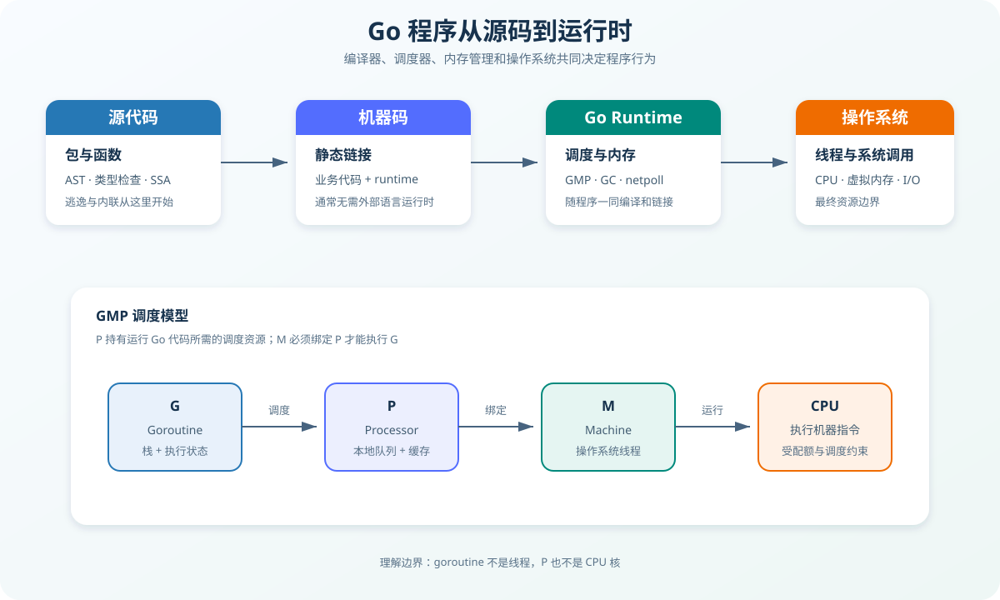
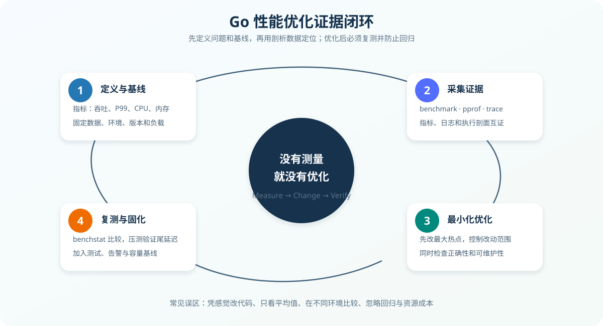

# Go 底层原理与工程化实践

> 本文面向已经掌握 Go 基础语法、希望理解“代码为何这样运行”以及“生产项目应如何落地”的开发者。内容以 Go 1.22 及之后的现代工具链为背景；运行时结构会随版本演进，结论应以当前版本源码、编译器输出和实际测量为准。

## 1. 建立正确的认知模型

Go 的简洁并不意味着底层简单。一段 Go 代码最终会穿过四层：

1. **语言层**：类型系统、接口、切片、`defer`、`panic` 等语义。
2. **编译器层**：类型检查、SSA 优化、内联、逃逸分析和机器码生成。
3. **运行时层**：GMP 调度、栈增长、垃圾回收、内存分配和网络轮询。
4. **操作系统层**：线程、虚拟内存、文件描述符、系统调用和 CPU 调度。



分析问题时必须先判断它属于哪一层。例如：

- “接口是否为 `nil`”主要是语言的数据表示问题；
- “变量为什么分配到堆上”是编译器的逃逸决策；
- “goroutine 为什么长时间不运行”可能涉及运行时调度；
- “容器内 `GOMAXPROCS` 是否合理”还受到操作系统 CPU 配额影响。

不要把当前编译器实现当成语言规范保证。可以依赖规范定义的行为，但性能结论必须通过当前工具链验证。

---

## 2. 编译、链接与初始化

### 2.1 从源码到可执行文件

一个包大致会经历：

```text
源码
  ↓ 词法与语法分析
AST
  ↓ 类型检查
带类型的中间表示
  ↓ SSA 构建与优化
机器码
  ↓ 链接业务包、依赖和 runtime
可执行文件
```

常用观察命令：

```bash
# 查看逃逸和内联决策
go build -gcflags="all=-m=2" ./...

# 查看汇编。-S 输出较多，通常应限定到具体包
go build -gcflags="-S" ./path/to/pkg

# 查看依赖和构建过程
go build -x ./cmd/server

# 检查二进制符号
go tool nm ./server
```

`go build` 会利用构建缓存。排查“为什么没有重新编译”时，可用 `go clean -cache` 清理缓存，但不应把清缓存当作日常构建步骤。

### 2.2 包初始化顺序

包级初始化遵循依赖关系：

```text
导入的依赖包
  → 当前包的包级变量
  → 当前包的 init 函数
  → main.main
```

同一个包中的初始化顺序由文件和声明规则共同决定，但工程代码不应依赖脆弱的文件排列。`init` 无法显式传参、返回错误或方便测试，因此只适合轻量且确定性的注册行为。

不推荐：

```go
var db = mustConnectDatabase() // 导入包时产生网络副作用
```

推荐显式装配：

```go
func main() {
    cfg, err := LoadConfig()
    if err != nil {
        log.Fatal(err)
    }

    db, err := OpenDatabase(cfg.Database)
    if err != nil {
        log.Fatal(err)
    }
    defer db.Close()

    app := NewApplication(db)
    if err := app.Run(context.Background()); err != nil {
        log.Fatal(err)
    }
}
```

---

## 3. 数据布局与值语义

理解 Go 的值语义，是避免共享状态、内存滞留和并发错误的基础。

### 3.1 数组与切片

数组是包含全部元素的值：

```go
a := [3]int{1, 2, 3}
b := a
b[0] = 99

fmt.Println(a[0]) // 1，数组被复制
```

切片不是数组本身，可以近似理解为一个描述符：

```go
type sliceHeader struct {
    Data unsafe.Pointer
    Len  int
    Cap  int
}
```

这是帮助理解的概念模型，不应使用 `unsafe` 手工操作运行时结构。复制切片只会复制描述符，底层数组仍可能共享：

```go
a := []int{1, 2, 3}
b := a
b[0] = 99

fmt.Println(a[0]) // 99
```

`append` 是否影响原切片，取决于容量是否足够：

```go
base := make([]int, 2, 4)
alias := base[:1]
alias = append(alias, 7) // 复用底层数组
fmt.Println(base)        // [0 7]
```

需要隔离所有权时应显式复制：

```go
dst := append([]byte(nil), src...)
// 或 Go 1.21+
cloned := slices.Clone(src)
```

#### 小切片引用大数组

```go
func firstKB(data []byte) []byte {
    return data[:1024]
}
```

返回的小切片仍引用整个底层数组，可能使大对象无法被 GC 回收。应复制真正需要的数据：

```go
func firstKB(data []byte) []byte {
    n := min(1024, len(data))
    result := make([]byte, n)
    copy(result, data[:n])
    return result
}
```

### 3.2 字符串

字符串是只读字节序列，概念上由数据指针和长度组成。`len(s)` 返回字节数，不是 Unicode 字符数：

```go
s := "Go语言"
fmt.Println(len(s))         // 8：字节数
fmt.Println(utf8.RuneCountInString(s)) // 4：码点数
```

遍历方式决定语义：

```go
for i := 0; i < len(s); i++ {
    fmt.Printf("%x ", s[i]) // 按字节
}

for index, r := range s {
    fmt.Printf("%d:%c ", index, r) // index 仍是字节偏移
}
```

字符串和 `[]byte` 的转换通常会产生复制。性能敏感路径先用 benchmark 证明转换是热点，再考虑优化；不要为消除一次复制而贸然引入 `unsafe`。

### 3.3 map

`map` 是引用型数据结构。几个工程上必须牢记的性质：

- 读取不存在的键会返回元素类型零值；
- 必须使用 `value, ok := m[key]` 区分“不存在”和“值恰好为零值”；
- 遍历顺序未定义，不能用于协议稳定输出；
- 普通 `map` 不支持并发读写；
- 向未初始化的 `nil map` 写入会 panic。

```go
count, ok := counters["success"]
if !ok {
    // 键不存在
}
```

需要稳定输出时先排序键：

```go
keys := make([]string, 0, len(m))
for key := range m {
    keys = append(keys, key)
}
slices.Sort(keys)

for _, key := range keys {
    fmt.Println(key, m[key])
}
```

并发场景通常优先使用 `map + sync.RWMutex`，因为类型清晰、复合操作容易保持原子性。`sync.Map` 更适合键集合相对稳定、写少读多，或不同 goroutine 操作互不相交键集合的场景。

### 3.4 接口与 nil 陷阱

接口值可以抽象为：

```text
(动态类型, 动态值)
```

只有二者都为空时，接口才等于 `nil`：

```go
type AppError struct {
    Message string
}

func (e *AppError) Error() string { return e.Message }

func load() error {
    var err *AppError = nil
    return err // 返回的接口包含动态类型 *AppError，因此不等于 nil
}
```

正确方式是在没有错误时直接返回无类型的 `nil`：

```go
func load() error {
    var err *AppError
    if err != nil {
        return err
    }
    return nil
}
```

接口应由使用方定义，并保持最小：

```go
type UserFinder interface {
    FindByID(ctx context.Context, id string) (User, error)
}
```

“接受接口，返回具体类型”是有用的默认原则，但不是机械规则。公共 API 的核心是最小依赖、清晰契约和可演进性。

---

## 4. 栈、堆与逃逸分析

### 4.1 变量为何逃逸

变量在栈上还是堆上，不由 `new`、`make` 或是否使用指针单独决定，而由编译器证明对象生命周期的结果决定。

```go
func newCounter() *int {
    value := 0
    return &value
}
```

`value` 离开函数后仍被引用，因此通常逃逸到堆。另一种常见逃逸来自接口装箱、闭包捕获、尺寸过大或编译器无法证明生命周期。

检查方式：

```bash
go test -gcflags="all=-m=2" ./...
```

输出中的 `moved to heap`、`escapes to heap` 是诊断线索，不是必须消灭的错误。优化顺序应是：

1. benchmark 证明分配影响目标指标；
2. `pprof` 找到主要分配路径；
3. 结合逃逸报告修改热点；
4. 重新测量，确认收益没有被复杂度抵消。

### 4.2 goroutine 栈

goroutine 初始栈较小，并可按需增长。栈增长时运行时可能搬迁栈并修正指针，因此 Go 不允许随意进行指针算术。

递归深度不可控时仍有风险：

```go
func walk(node *Node) {
    for _, child := range node.Children {
        walk(child)
    }
}
```

处理不可信输入时，应限制深度或改为显式栈，防止超深结构耗尽资源。

---

## 5. 内存分配与垃圾回收

### 5.1 分配器的基本思路

Go 分配器会按对象大小分级管理内存。可以用以下简化模型理解：

```text
P 的本地缓存 mcache
       ↓ 不足时补充
中心缓存 mcentral
       ↓ 管理 span
堆页管理 mheap
       ↓
操作系统虚拟内存
```

小对象通常走本地缓存路径以降低锁竞争，大对象直接从更高层级分配。具体阈值和结构属于运行时实现细节，不能写死为业务逻辑。

减少分配的常见手段：

- 已知容量时使用 `make([]T, 0, n)`；
- 使用 `strings.Builder` 构建字符串；
- 避免热路径中的无意义接口装箱；
- 批量处理数据，减少临时对象；
- 复用确实昂贵且生命周期明确的缓冲区。

`sync.Pool` 中的对象可能在任意一次 GC 后被清除，它是降低临时对象分配压力的缓存，不是连接池、对象仓库或可靠存储。

### 5.2 并发标记清扫 GC

现代 Go GC 可以概括为：

1. 短暂 STW，开启标记阶段；
2. 与业务 goroutine 并发标记存活对象；
3. 写屏障维护并发标记的正确性；
4. 短暂 STW，完成标记；
5. 清扫不可达对象并回收空间。

GC 的核心权衡是 CPU、内存和延迟：

- GC 越频繁，堆更小，但 GC 消耗的 CPU 更多；
- GC 越少，CPU 开销可能下降，但进程持有内存增加；
- 大量短命对象会推高分配速率，间接增加 GC 压力。

常用环境变量：

```bash
# 相对于上一轮存活堆的增长百分比，默认通常为 100
GOGC=100

# 设置运行时软内存上限，例如 1 GiB
GOMEMLIMIT=1GiB

# 输出 GC 诊断信息
GODEBUG=gctrace=1
```

`GOMEMLIMIT` 是软限制，不是操作系统的强制内存隔离。容器内应给 Go 堆、goroutine 栈、运行时元数据、内存映射、cgo 和内核缓冲留出余量，不能直接等于容器内存上限。

### 5.3 “内存泄漏”通常是什么

GC 只能回收不可达对象。以下对象仍然可达，所以不会被回收：

- 无上限增长的全局 `map`；
- 未停止的 `time.Ticker`；
- 永久阻塞的 goroutine 及其引用；
- 未关闭或未消费的响应体；
- 被小切片引用的大数组；
- 无淘汰策略的缓存；
- 注册后从不注销的回调。

排查时重点比较：

```text
inuse_space：当前仍存活的内存
alloc_space：进程生命周期内累计分配
inuse_objects：当前存活对象数量
alloc_objects：累计分配对象数量
```

---

## 6. GMP 调度模型

### 6.1 G、M、P 分别是什么

- **G（Goroutine）**：待执行任务，包含栈、指令位置和状态等。
- **M（Machine）**：操作系统线程。
- **P（Processor）**：执行 Go 代码所需的调度资源，维护本地运行队列和缓存。

一个 M 必须绑定一个 P 才能执行 Go 代码。`GOMAXPROCS` 控制可同时执行 Go 代码的 P 数量，不等于 goroutine 数量，也不严格等于进程可创建的线程数。

### 6.2 调度从哪里取任务

P 通常从以下位置获取 G：

1. 当前 P 的本地运行队列；
2. 全局运行队列；
3. 网络轮询器返回的就绪任务；
4. 从其他 P 的队列窃取任务；
5. 定时器到期任务。

工作窃取能够改善多核利用率。遇到系统调用时：

- 可与网络轮询器集成的非阻塞网络 I/O，通常不会长期占住线程；
- 阻塞系统调用可能使 M 阻塞，运行时会尽量让 P 与其他 M 继续执行；
- cgo、锁线程和大量阻塞调用仍可能制造线程膨胀或调度压力。

### 6.3 抢占与调度延迟

Go 支持协作式和异步抢占，避免某个 G 长时间独占 P。但调度公平不是实时保证。长时间占用 CPU、极端锁竞争、过量 goroutine 和容器 CPU 限流都可能放大尾延迟。

诊断工具：

```bash
# 在测试期间生成执行跟踪
go test -trace trace.out ./path/to/pkg

# 打开跟踪界面
go tool trace trace.out

# 定期输出调度器状态
GODEBUG=schedtrace=1000,scheddetail=1 ./server
```

---

## 7. channel、锁与 Go 内存模型

### 7.1 channel 不是队列的同义词

channel 的核心价值是 goroutine 间的同步和所有权传递。

- 无缓冲 channel：发送与接收必须会合；
- 有缓冲 channel：缓冲区未满时发送方可继续执行；
- 关闭 channel：表示不会再发送新值；
- 从已关闭且排空的 channel 接收，立即得到零值和 `ok == false`；
- 向已关闭 channel 发送会 panic；
- 关闭已关闭 channel 会 panic；
- `nil channel` 的发送和接收会永久阻塞。

通常由发送方关闭 channel，因为发送方知道数据何时结束。接收方不能仅因“不想接收了”就关闭公共 channel。

```go
for item := range jobs {
    process(item)
}
```

缓冲区会改变背压出现的时机，却不会自动提高吞吐。容量应来自可接受的排队时间、生产消费速率和内存预算，而不是随意设置一个大数。

### 7.2 happens-before

没有同步关系时，一个 goroutine 的写入不保证何时对另一个 goroutine 可见。以下代码存在数据竞争：

```go
var ready bool
var value int

go func() {
    value = 42
    ready = true
}()

for !ready {
}
fmt.Println(value)
```

正确做法是用 channel、锁、原子操作或其他明确同步原语：

```go
done := make(chan struct{})

go func() {
    value = 42
    close(done)
}()

<-done
fmt.Println(value)
```

必须使用竞态检测器验证并发测试：

```bash
go test -race ./...
```

`-race` 有明显运行开销，适合测试和预发布验证，不应默认在生产二进制中启用。

### 7.3 什么时候用锁

选择同步原语时，从数据所有权出发：

| 场景 | 优先选择 |
| --- | --- |
| 保护内存中的共享状态 | `sync.Mutex` |
| 读远多于写，且测量证明有收益 | `sync.RWMutex` |
| 一次性初始化 | `sync.Once` |
| 等待一组任务结束 | `sync.WaitGroup` |
| 传递任务、结果或所有权 | channel |
| 简单计数器或状态位 | `sync/atomic` |
| 取消和截止时间传播 | `context.Context` |

不要为了“更 Go”而用 channel 包装所有共享状态。锁保护临界区通常更直接；channel 更适合通信和生命周期编排。

复制包含 `sync.Mutex`、`sync.Once`、`atomic` 类型的结构体通常是错误。此类结构体初始化后应通过指针传递，并使用 `go vet` 检查复制锁问题。

### 7.4 防止 goroutine 泄漏

每启动一个 goroutine，都应回答：

1. 它在等待什么？
2. 谁会让它退出？
3. 调用方取消或下游变慢时会怎样？
4. 退出前由谁释放资源？

可取消的工作循环：

```go
func consume(ctx context.Context, jobs <-chan Job) error {
    for {
        select {
        case <-ctx.Done():
            return context.Cause(ctx)
        case job, ok := <-jobs:
            if !ok {
                return nil
            }
            if err := handle(ctx, job); err != nil {
                return err
            }
        }
    }
}
```

发送端同样需要感知取消，否则接收方退出后它可能永久阻塞：

```go
select {
case results <- result:
case <-ctx.Done():
    return context.Cause(ctx)
}
```

---

## 8. context、错误与资源生命周期

### 8.1 context 的使用边界

`context.Context` 用于传递取消信号、截止时间和请求范围元数据。

约定：

- 作为函数第一个参数，命名为 `ctx`；
- 不存入长期存活的结构体；
- 不传 `nil`，无上下文时使用 `context.Background()`；
- `WithCancel`、`WithTimeout` 返回的 `cancel` 必须调用；
- 业务必需参数应使用显式参数，不塞进 `Context`；
- 只有跨 API 边界传播的请求范围元数据才使用 `WithValue`。

```go
ctx, cancel := context.WithTimeout(parent, 2*time.Second)
defer cancel()

result, err := repository.Find(ctx, id)
```

超时预算应逐层收紧并给上层留出处理空间。下游超时等于整个请求超时，会导致上层没有时间记录结果、执行降级或返回响应。

### 8.2 错误链

使用 `%w` 保留错误链：

```go
user, err := repo.FindByID(ctx, id)
if err != nil {
    return User{}, fmt.Errorf("查询用户 %q: %w", id, err)
}
```

调用方使用 `errors.Is` 和 `errors.As` 判断：

```go
if errors.Is(err, sql.ErrNoRows) {
    // 转换为领域层的“用户不存在”
}

var timeout net.Error
if errors.As(err, &timeout) && timeout.Timeout() {
    // 超时处理
}
```

错误信息应逐层增加上下文，但避免重复打印同一错误。通常在能够决定“重试、降级、转换协议错误或终止请求”的边界记录一次日志。

### 8.3 defer、panic 与 recover

`defer` 适合表达“获取成功后必定释放”：

```go
resp, err := client.Do(req)
if err != nil {
    return err
}
defer resp.Body.Close()
```

循环中使用 `defer` 时要注意释放时机是函数返回，而不是本轮循环结束。可抽取为函数：

```go
func fetchOne(ctx context.Context, url string) error {
    request, err := http.NewRequestWithContext(ctx, http.MethodGet, url, nil)
    if err != nil {
        return err
    }

    resp, err := httpClient.Do(request)
    if err != nil {
        return err
    }
    defer resp.Body.Close()
    return consume(resp.Body)
}
```

`panic` 适用于程序不变量被破坏、无法合理恢复的情况，不应用于普通业务错误。`recover` 只能捕获同一 goroutine 调用栈中的 panic，通常放在 HTTP 中间件、任务执行器等进程边界：

```go
defer func() {
    if recovered := recover(); recovered != nil {
        logger.Error("请求处理发生 panic",
            "panic", recovered,
            "stack", string(debug.Stack()),
        )
    }
}()
```

恢复后必须让当前操作明确失败，不能在状态可能损坏时假装成功。

---

## 9. 工程化项目结构

Go 项目应围绕依赖方向组织，而不是为了“标准目录”堆砌层级。一个中型服务可以采用：

```text
.
├── cmd/
│   └── server/
│       └── main.go          # 组合根：配置、依赖装配、启动
├── internal/
│   ├── user/
│   │   ├── domain.go       # 实体、值对象、领域错误
│   │   ├── service.go      # 用例编排
│   │   ├── repository.go   # 使用方定义的端口
│   │   └── handler.go      # HTTP/RPC 适配
│   ├── platform/
│   │   ├── database/
│   │   └── observability/
│   └── config/
├── migrations/
├── go.mod
└── go.sum
```

依赖方向：

```text
HTTP / RPC / CLI
       ↓
应用用例
       ↓
领域模型与端口
       ↑
数据库、消息队列等适配器实现端口
```

工程原则：

- `main` 只负责装配和生命周期，不承载业务规则；
- 接口靠近使用方定义，避免“万能 repository”；
- 领域层不依赖 HTTP、ORM 或具体数据库；
- 包名表达业务能力，避免 `common`、`utils` 无限膨胀；
- 只在需要被外部模块复用时使用 `pkg/`，否则优先 `internal/`；
- 配置在启动时完成解析和校验，运行期间保持只读。

### 9.1 优雅关闭

服务停止是一个有截止时间的状态迁移：

```go
func run() error {
    server := &http.Server{
        Addr:              ":8080",
        Handler:           routes(),
        ReadHeaderTimeout: 5 * time.Second,
        ReadTimeout:       15 * time.Second,
        WriteTimeout:      15 * time.Second,
        IdleTimeout:       60 * time.Second,
    }

    ctx, stop := signal.NotifyContext(
        context.Background(),
        os.Interrupt,
        syscall.SIGTERM,
    )
    defer stop()

    errCh := make(chan error, 1)
    go func() {
        errCh <- server.ListenAndServe()
    }()

    select {
    case err := <-errCh:
        if !errors.Is(err, http.ErrServerClosed) {
            return err
        }
        return nil
    case <-ctx.Done():
    }

    shutdownCtx, cancel := context.WithTimeout(
        context.Background(),
        20*time.Second,
    )
    defer cancel()
    return server.Shutdown(shutdownCtx)
}
```

完整流程通常是：

1. 收到停止信号；
2. readiness 变为失败，从流量入口摘除；
3. 停止接收新请求；
4. 等待在途请求和后台任务；
5. 刷新必要缓冲并关闭外部连接；
6. 超时后强制退出。

### 9.2 HTTP 客户端必须复用并设置超时

不要为每个请求创建新的 `http.Client` 或 `Transport`。它们管理连接池，应长期复用：

```go
var httpClient = &http.Client{
    Timeout: 10 * time.Second,
    Transport: &http.Transport{
        MaxIdleConns:        100,
        MaxIdleConnsPerHost: 20,
        IdleConnTimeout:     90 * time.Second,
    },
}
```

服务端和客户端都必须有超时。只有 `context` 而没有客户端超时，或者只有总超时而缺少连接、TLS、响应头阶段限制，都可能留下资源风险。具体配置应基于调用链预算和压测结果。

---

## 10. 测试体系

### 10.1 表驱动测试

```go
func TestParseLevel(t *testing.T) {
    tests := []struct {
        name    string
        input   string
        want    Level
        wantErr bool
    }{
        {name: "info", input: "info", want: LevelInfo},
        {name: "trim spaces", input: " warn ", want: LevelWarn},
        {name: "invalid", input: "verbose", wantErr: true},
    }

    for _, tt := range tests {
        tt := tt
        t.Run(tt.name, func(t *testing.T) {
            t.Parallel()

            got, err := ParseLevel(tt.input)
            if (err != nil) != tt.wantErr {
                t.Fatalf("ParseLevel() error = %v, wantErr %v", err, tt.wantErr)
            }
            if got != tt.want {
                t.Errorf("ParseLevel() = %v, want %v", got, tt.want)
            }
        })
    }
}
```

并行子测试不能共享可变夹具。循环变量捕获的具体行为与 Go 版本及 `go.mod` 中的语言版本有关；维护跨版本代码时，显式 `tt := tt` 仍能清楚表达每轮独立绑定。

### 10.2 测试分层

- **单元测试**：纯业务规则，速度快、定位准确；
- **组件测试**：数据库仓储、消息适配器等真实组件；
- **契约测试**：验证服务间请求和响应兼容性；
- **集成测试**：验证多个组件的协作；
- **端到端测试**：覆盖少量关键业务路径；
- **模糊测试**：发现解析器、协议和边界输入问题。

模糊测试示例：

```go
func FuzzDecodeToken(f *testing.F) {
    f.Add("valid-seed")

    f.Fuzz(func(t *testing.T, input string) {
        token, err := DecodeToken(input)
        if err != nil {
            return
        }
        if token.Subject == "" {
            t.Fatalf("成功解码后 Subject 为空")
        }
    })
}
```

常用质量命令：

```bash
go test ./...
go test -race ./...
go test -coverprofile=coverage.out ./...
go tool cover -func=coverage.out
go vet ./...
go test -fuzz=Fuzz -fuzztime=30s ./path/to/pkg
```

覆盖率是发现未测试区域的信号，不是测试质量目标。关键是覆盖错误路径、边界条件、并发取消和资源释放。

---

## 11. 性能分析与优化



### 11.1 benchmark

```go
func BenchmarkEncode(b *testing.B) {
    input := newFixture()

    b.ReportAllocs()
    b.ResetTimer()
    for i := 0; i < b.N; i++ {
        result, err := Encode(input)
        if err != nil {
            b.Fatal(err)
        }
        runtime.KeepAlive(result)
    }
}
```

运行并保存基线：

```bash
go test -run='^$' -bench='BenchmarkEncode$' -benchmem -count=10 ./... > old.txt
# 修改后再次执行，输出到 new.txt
benchstat old.txt new.txt
```

benchmark 应固定输入和环境，执行多轮并进行统计比较。只比较一次 `ns/op` 很容易受到 CPU 频率、后台进程和缓存状态影响。

### 11.2 pprof

测试中生成剖面：

```bash
go test -run='^$' -bench=. \
  -cpuprofile=cpu.out \
  -memprofile=mem.out \
  ./path/to/pkg

go tool pprof -http=:0 cpu.out
go tool pprof -http=:0 -alloc_space mem.out
```

服务中可在受保护的管理端口注册 `net/http/pprof`。生产环境不能将 pprof 无鉴权暴露到公网，因为剖面和命令行信息可能泄露内部实现及敏感数据。

常见剖面：

| 剖面 | 回答的问题 |
| --- | --- |
| CPU | CPU 时间主要消耗在哪些调用栈 |
| heap | 当前存活或累计分配主要来自哪里 |
| goroutine | goroutine 在哪里等待，是否存在泄漏 |
| mutex | 锁竞争时间主要发生在哪里 |
| block | channel、锁等阻塞发生在哪里 |
| allocs | 哪些路径制造了大量分配 |

### 11.3 trace

`pprof` 擅长聚合热点，`trace` 擅长时间线和调度因果。以下问题更适合 trace：

- goroutine 为什么迟迟没有被调度；
- GC、系统调用和网络等待如何交错；
- 并行度是否真正发挥；
- 哪个任务造成长尾；
- goroutine 在处理器之间如何迁移。

### 11.4 优化优先级

常见收益顺序通常是：

1. 改进算法和数据结构；
2. 减少外部 I/O 次数和往返延迟；
3. 控制锁竞争和过量并发；
4. 减少主要分配热点；
5. 改善数据局部性和批处理；
6. 最后才考虑微小语法级优化。

这不是固定定律。真正的优先级由剖析数据、业务指标和改动风险共同决定。

---

## 12. 可观测性与生产诊断

### 12.1 三类信号

- **Metrics**：回答“系统是否异常、影响多大”；
- **Tracing**：回答“一次请求在哪一段变慢”；
- **Logging**：回答“具体发生了什么以及关键上下文”。

建议从 RED 指标开始：

- Rate：请求速率；
- Errors：错误率和错误码分布；
- Duration：延迟分布，重点观察 P95/P99；

同时监控资源饱和度：CPU 限流、内存、GC、goroutine、线程、文件描述符、连接池和队列长度。

### 12.2 标签基数

指标标签不能直接使用用户 ID、订单 ID、完整 URL、错误文本等高基数字段，否则时间序列数量会失控。

错误示例：

```text
http_requests_total{user_id="...", path="/users/12345"}
```

推荐：

```text
http_requests_total{method="GET", route="/users/:id", status="200"}
```

高基数上下文放日志或 trace，需要聚合的有限维度才放 metrics。

### 12.3 线上问题诊断顺序

#### CPU 持续升高

1. 判断是业务流量增长、GC、锁自旋还是异常循环；
2. 获取同一时间窗口的 CPU profile；
3. 对照请求量、延迟、GC 和容器限流；
4. 从最大累计热点开始验证。

#### 内存持续升高

1. 区分 Go heap、进程 RSS 和容器工作集；
2. 对比多个时间点的 heap profile；
3. 查看 `inuse_space` 的增长调用栈；
4. 检查缓存、goroutine、切片引用和响应体；
5. 确认是存活对象增长还是分配速率过高。

#### goroutine 持续增长

1. 保存不同时间点的 goroutine profile；
2. 按栈聚合，识别增长最快的等待位置；
3. 检查 channel、锁、网络 I/O 和缺失的取消逻辑；
4. 修复后通过压测确认 goroutine 能回落到稳态。

#### P99 升高但平均值稳定

重点检查：

- 锁竞争和排队；
- GC 暂停与高分配速率；
- 下游偶发慢请求；
- 连接池耗尽；
- CPU throttling；
- goroutine 调度延迟；
- 重试放大和队头阻塞。

---

## 13. 常见反模式

### 13.1 无界并发

```go
for _, item := range items {
    go process(item)
}
```

输入规模不可信时，这会同时放大 goroutine、连接、内存和下游压力。应使用有界并发：

```go
group, ctx := errgroup.WithContext(ctx)
group.SetLimit(16)

for _, item := range items {
    item := item
    group.Go(func() error {
        return process(ctx, item)
    })
}

if err := group.Wait(); err != nil {
    return err
}
```

`errgroup` 位于 `golang.org/x/sync/errgroup`，依赖版本应在 `go.mod` 中明确锁定。

### 13.2 盲目重试

重试必须同时满足：

- 错误是瞬时且可重试的；
- 操作幂等，或有幂等键；
- 有最大次数和总时间预算；
- 使用指数退避与抖动；
- 尊重 `context` 取消；
- 有指标观察重试次数和最终结果。

对参数错误、权限错误和确定性业务拒绝进行重试，只会增加延迟和下游负载。

### 13.3 过度抽象

只有一个实现、一个方法却提前定义多层接口，通常不会自动提升可测试性，反而增加导航成本。接口应在调用方确实需要替换行为或隔离依赖时出现。

### 13.4 在热路径无条件记录大日志

序列化大对象、格式化堆栈和同步写日志都可能成为热点。日志应：

- 使用结构化字段；
- 控制级别和采样；
- 避免记录令牌、密码和完整请求体；
- 在边界记录一次，避免错误链逐层重复；
- 用 metrics 统计，不用海量日志代替计数器。

---

## 14. 生产发布检查清单

### 正确性

- [ ] `go test ./...` 通过。
- [ ] `go test -race ./...` 在可覆盖的并发路径通过。
- [ ] `go vet ./...` 通过。
- [ ] 错误使用 `%w` 包装，并通过 `errors.Is/As` 判断。
- [ ] 所有 goroutine 都有明确退出条件。
- [ ] channel 的关闭方和所有权清晰。

### 资源与并发

- [ ] HTTP、RPC、数据库调用均设置合理超时。
- [ ] 响应体、文件、数据库行迭代器等资源及时关闭。
- [ ] 并发度、队列和缓存都有上限。
- [ ] 重试有预算、退避、抖动和幂等保障。
- [ ] 容器内存为非堆内存留出余量。

### 服务生命周期

- [ ] readiness、liveness 和 startup 探针职责分离。
- [ ] 收到终止信号后先摘流量，再停止服务。
- [ ] 优雅关闭有明确超时。
- [ ] 后台任务和缓冲数据能在退出前收敛。

### 可观测性与安全

- [ ] 关键路径有 RED 指标和 trace。
- [ ] 日志字段可关联请求，但不泄露敏感数据。
- [ ] 指标标签经过基数审查。
- [ ] pprof 和管理端点未暴露到公网。
- [ ] 发布前有容量基线，发布后观察 P99、错误率和资源饱和度。

---

## 15. 学习与排障路线

建议按以下顺序建立能力：

1. **值语义**：数组、切片、字符串、map、接口和 `nil`；
2. **编译器**：逃逸、内联、SSA 和汇编观察；
3. **运行时**：GMP、栈、分配器、GC 和 netpoll；
4. **并发正确性**：内存模型、channel、锁、原子操作和取消；
5. **工程边界**：错误、超时、依赖方向和优雅关闭；
6. **质量保障**：单元测试、竞态检测、模糊测试和集成测试；
7. **性能闭环**：benchmark、pprof、trace 和生产指标。

遇到问题时始终遵循：

```text
定义现象 → 建立基线 → 收集证据 → 提出假设
→ 最小改动 → 复测验证 → 固化测试与监控
```

Go 工程能力的核心，不是记住某个运行时阈值或背诵调度器名词，而是能够跨越语言、编译器、运行时和操作系统边界，用证据解释行为，并把结论落实为可测试、可观测、可维护的工程约束。

## 参考资料

- [The Go Programming Language Specification](https://go.dev/ref/spec)
- [The Go Memory Model](https://go.dev/ref/mem)
- [Go Documentation](https://go.dev/doc/)
- [Diagnostics](https://go.dev/doc/diagnostics)
- [Profile-guided optimization](https://go.dev/doc/pgo)
- [Go Runtime Source](https://github.com/golang/go/tree/master/src/runtime)
