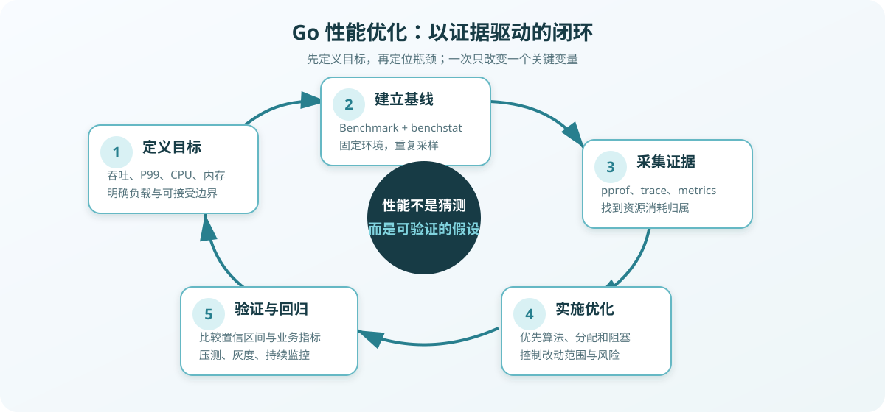
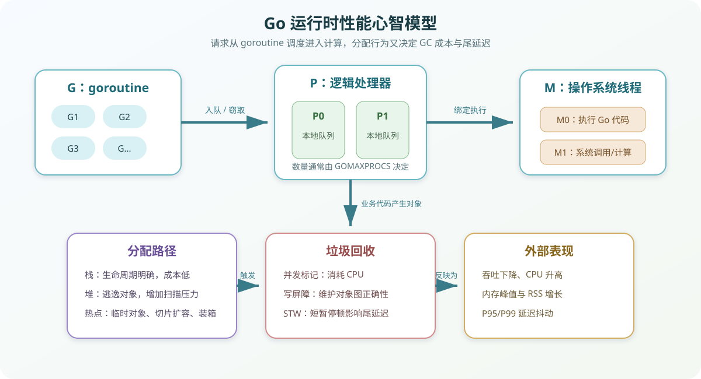

# Go 语言高效编程：原理、可观测性与优化

> 高性能不是“写出更聪明的代码”，而是在明确负载和服务等级目标（SLO）的前提下，用数据识别主要矛盾，以最小风险消除瓶颈，并证明优化在真实环境中仍然成立。

本文示例以 **Go 1.24 及以上版本**为基准；使用旧版本工具链时，可将 `b.Loop()` 改为传统的 `for i := 0; i < b.N; i++`。

## 目录

- [1. 性能优化的基本原则](#1-性能优化的基本原则)
- [2. 建立 Go 运行时心智模型](#2-建立-go-运行时心智模型)
- [3. 建立可信的性能基线](#3-建立可信的性能基线)
- [4. 用 pprof 定位资源消耗](#4-用-pprof-定位资源消耗)
- [5. 用 trace 和运行时指标解释延迟](#5-用-trace-和运行时指标解释延迟)
- [6. 内存分配与 GC 优化](#6-内存分配与-gc-优化)
- [7. CPU 与算法优化](#7-cpu-与算法优化)
- [8. 并发与同步优化](#8-并发与同步优化)
- [9. I/O、网络与序列化优化](#9-io网络与序列化优化)
- [10. 生产环境中的性能工程](#10-生产环境中的性能工程)
- [11. 常见误区](#11-常见误区)
- [12. 排障清单](#12-排障清单)

---

## 1. 性能优化的基本原则

### 1.1 先把“快”定义清楚

性能不是单一指标。不同系统的主要目标可能完全不同：

| 场景 | 核心指标 | 常见约束 |
| --- | --- | --- |
| 在线 API | P50、P95、P99 延迟，请求吞吐量 | CPU、内存、下游容量 |
| 批处理任务 | 总完成时间、单位数据处理成本 | 内存峰值、并行度 |
| 网关/代理 | QPS、连接数、转发延迟 | 文件描述符、网络带宽 |
| CLI 工具 | 启动时间、峰值内存 | 本地磁盘、输入规模 |
| 消息消费者 | 每秒消费数、积压量 | 分区数、下游写入能力 |

平均延迟不能代表用户体验。例如，99 次请求耗时 10 ms，1 次请求耗时 1 s，平均值约为 20 ms，但最慢的 1% 用户已经明显受损。因此在线服务通常至少同时观察：

- 吞吐量：`requests/s`、`MB/s`、`items/s`。
- 延迟分位数：P50 反映常态，P95/P99 反映尾部抖动。
- 饱和度：CPU 利用率、运行队列、连接池等待、磁盘队列。
- 错误率：超时、限流、重试、业务失败比例。
- 成本：每百万请求 CPU 时间、每实例吞吐量、内存占用。

### 1.2 优化必须形成闭环



一次可靠的优化通常包含以下步骤：

1. **定义目标**：明确负载、指标和成功标准，例如“在 8 核、并发 200 时，P99 小于 80 ms，错误率低于 0.1%”。
2. **建立基线**：固定代码、配置、数据集、硬件和 Go 版本，多次测量。
3. **采集证据**：使用 benchmark、pprof、trace 和业务指标找到资源归属。
4. **提出假设**：例如“切片反复扩容导致分配增加，进而提高 GC CPU”。
5. **实施单一关键改动**：缩小变量范围，降低归因难度。
6. **验证和回归**：比较置信区间，在压测与灰度环境检查副作用。

优化优先级一般遵循：

> 架构和算法 > I/O 与阻塞 > 内存分配 > 锁竞争 > 局部微优化。

把 `O(n²)` 改为 `O(n log n)`，通常比消除一个边界检查更有价值。性能工程首先是建模和测量，其次才是代码技巧。

---

## 2. 建立 Go 运行时心智模型



### 2.1 G-M-P 调度模型

Go 调度器用 G、M、P 协作执行 goroutine：

- **G（goroutine）**：待执行任务，包含栈、程序计数器和调度状态。
- **M（machine）**：操作系统线程，真正接受操作系统调度。
- **P（processor）**：执行 Go 代码所需的逻辑处理器，持有本地运行队列和分配缓存。

`GOMAXPROCS` 控制能够同时执行 Go 代码的 P 数量。它不是 goroutine 上限，也不是线程池大小。现代 Go 在容器环境中通常能够更合理地感知 CPU 配额，但生产部署仍应检查运行时实际值、容器配额和节流指标是否一致。

调度器会使用本地队列、全局队列和 work stealing 平衡任务。当 goroutine 进入网络轮询等待时，线程可以执行其他任务；当线程陷入阻塞系统调用时，P 可以与其他 M 结合继续调度。以下情况仍可能造成调度压力：

- 创建数量失控的 goroutine，增加栈、调度和 GC 扫描成本。
- 大量可运行 goroutine 争夺少量 P，造成运行队列和尾延迟增长。
- 频繁锁竞争、channel 争用或 `runtime.Gosched` 导致切换成本。
- CGO 调用或不可抢占的外部阻塞占用线程。
- CPU 密集任务与延迟敏感请求共用相同执行资源。

### 2.2 栈、堆与逃逸

goroutine 的栈从较小空间开始，按需增长和收缩。函数局部变量优先放在栈上；如果编译器无法证明对象不会在函数返回后继续使用，对象就可能逃逸到堆。

```go
type User struct {
	ID   int64
	Name string
}

func newUser(id int64, name string) *User {
	// 返回指针不等于一定“性能差”，是否逃逸由编译器分析决定。
	return &User{ID: id, Name: name}
}
```

使用 `-gcflags=-m=2` 查看逃逸和内联决策：

```bash
go build -gcflags="-m=2" ./...
go test -gcflags="-m=2" ./path/to/package
```

不要为了“零逃逸”盲目改写代码。堆分配本身通常很快，真正的累计成本包括：

- 分配路径消耗 CPU。
- 对象增加 GC 标记扫描工作。
- 存活对象提高堆基线和 RSS。
- 短命对象提高分配速率，使 GC 更频繁。

### 2.3 垃圾回收如何影响延迟

Go 使用并发、三色标记清扫垃圾回收器。大部分标记工作与业务 goroutine 并发进行，但仍存在短暂 STW（Stop The World）阶段和写屏障成本。

理解 GC 时应区分：

- **分配速率**：每秒新分配多少字节，影响 GC 触发频率。
- **存活堆**：一轮 GC 后仍可达的对象大小，影响每轮扫描量。
- **堆目标**：下一轮 GC 预期触发位置，受 `GOGC` 和内存限制影响。
- **RSS**：操作系统看到的驻留内存，不等于 Go 堆；还包含栈、代码、mmap、CGO 等。

`GOGC=100` 大致表示堆相对上一轮存活堆增长 100% 时触发下一轮 GC。增大 `GOGC` 通常用更多内存换更少 GC CPU；减小则相反。

```bash
# 仅作为实验，不应脱离压测直接用于生产
GOGC=200 go test -bench=. -benchmem ./...
```

Go 还提供软内存限制：

```go
import "runtime/debug"

func configureMemoryLimit(limit int64) {
	previous := debug.SetMemoryLimit(limit)
	_ = previous
}
```

也可通过环境变量设置：

```bash
GOMEMLIMIT=1536MiB ./server
```

`GOMEMLIMIT` 是运行时软限制，不是容器 OOM 的硬防线。应给非 Go 堆内存、内核页缓存和突发流量预留空间；设置过低会造成 GC 频繁运行，出现 CPU 上升但可用吞吐下降的“GC 抖动”。

---

## 3. 建立可信的性能基线

### 3.1 编写可重复的 Benchmark

```go
package encode

import (
	"strconv"
	"strings"
	"testing"
)

func BuildKey(tenant string, id int64) string {
	var b strings.Builder
	b.Grow(len(tenant) + 1 + 20)
	b.WriteString(tenant)
	b.WriteByte(':')
	b.WriteString(strconv.FormatInt(id, 10))
	return b.String()
}

func BenchmarkBuildKey(b *testing.B) {
	tenant := "tenant-a"

	b.ReportAllocs()
	b.ResetTimer()
	for b.Loop() {
		result := BuildKey(tenant, 123456789)
		if result == "" {
			b.Fatal("unexpected empty key")
		}
	}
}
```

运行基准：

```bash
go test -run='^$' -bench='^BenchmarkBuildKey$' -benchmem -count=10 ./...
```

常见输出指标：

```text
BenchmarkBuildKey-8    21000000    55.2 ns/op    24 B/op    1 allocs/op
```

- `ns/op`：每次操作的平均墙钟时间。
- `B/op`：每次操作平均分配的字节数。
- `allocs/op`：每次操作平均堆分配次数。
- `-8`：执行基准时的 `GOMAXPROCS` 值，不是并发请求数。

基准测试应遵循以下规则：

- 使用固定且有代表性的数据，避免只测空输入。
- 将初始化、随机数据生成和日志排除在计时区间外。
- 防止编译器完全消除待测结果。
- I/O 基准明确使用真实设备、内存缓冲还是 mock。
- 同机、同电源模式、同 Go 版本重复执行。
- 不在启用竞态检测器时比较性能；`-race` 会显著改变执行特征。

### 3.2 使用 benchstat 比较结果

分别保存改动前后的多轮结果：

```bash
go test -run='^$' -bench=. -benchmem -count=15 ./pkg/encode > old.txt
go test -run='^$' -bench=. -benchmem -count=15 ./pkg/encode > new.txt
benchstat old.txt new.txt
```

`benchstat` 会报告样本分布、变化百分比和统计显著性。不要根据单次运行中 2% 的变化宣称优化成功；现代 CPU 的频率调节、后台进程、缓存状态都可能制造噪声。

### 3.3 区分微基准与系统压测

微基准回答“这个函数在隔离环境中是否更快”，但不能直接回答：

- 数据库连接池是否等待。
- 下游超时是否引发重试放大。
- GC 是否与流量峰值叠加。
- 单实例吞吐提高后，数据库是否成为新瓶颈。

因此优化至少需要两级验证：

1. **微基准**：证明局部改动确实改变了目标指标。
2. **系统压测**：在接近生产的数据量、并发、依赖延迟和资源限制下验证 SLO。

---

## 4. 用 pprof 定位资源消耗

### 4.1 在 HTTP 服务中暴露 pprof

推荐把诊断端点放在独立管理端口，并通过网络策略、身份认证或本机监听进行保护。pprof 可能暴露函数名、路径、请求参数和内存内容，绝不能无保护地暴露到公网。

```go
package diagnostic

import (
	"context"
	"errors"
	"log/slog"
	"net"
	"net/http"
	_ "net/http/pprof"
	"time"
)

func Serve(ctx context.Context, logger *slog.Logger) error {
	server := &http.Server{
		Addr:              "127.0.0.1:6060",
		Handler:           http.DefaultServeMux,
		ReadHeaderTimeout: 3 * time.Second,
	}

	listener, err := net.Listen("tcp", server.Addr)
	if err != nil {
		return err
	}

	go func() {
		<-ctx.Done()
		shutdownCtx, cancel := context.WithTimeout(context.Background(), 5*time.Second)
		defer cancel()
		if err := server.Shutdown(shutdownCtx); err != nil {
			logger.Error("关闭诊断服务失败", "error", err)
		}
	}()

	err = server.Serve(listener)
	if errors.Is(err, http.ErrServerClosed) {
		return nil
	}
	return err
}
```

更严格的工程实践是使用独立 `http.ServeMux`，只显式注册所需诊断处理器，避免业务与管理路由共享默认 mux。

### 4.2 选择正确的 Profile

| Profile | 回答的问题 | 典型症状 |
| --- | --- | --- |
| CPU | CPU 时间花在哪里 | CPU 高、吞吐低 |
| `allocs` | 历史累计分配由谁产生 | GC 频繁、分配速率高 |
| `heap` | 当前存活对象由谁持有 | 堆持续增长、疑似泄漏 |
| goroutine | goroutine 在哪里等待 | goroutine 数增长、请求卡住 |
| mutex | 锁竞争损失多少时间 | CPU 不高但延迟高 |
| block | goroutine 在何处阻塞 | channel、锁、条件变量等待 |
| threadcreate | 哪些调用导致线程创建 | 线程数异常、CGO/系统调用多 |

采集 30 秒 CPU Profile：

```bash
go tool pprof -http=:8080 \
  "http://127.0.0.1:6060/debug/pprof/profile?seconds=30"
```

采集当前存活堆：

```bash
go tool pprof -http=:8080 \
  "http://127.0.0.1:6060/debug/pprof/heap?gc=1"
```

采集阻塞和互斥锁数据前，需要根据诊断需求开启采样：

```go
runtime.SetBlockProfileRate(10_000) // 以纳秒为单位采样阻塞事件
runtime.SetMutexProfileFraction(10) // 平均采样约 1/10 的锁竞争事件
```

采样本身有成本。生产环境应按需开启、限制时间，并在结束后恢复配置。

### 4.3 正确阅读 CPU 火焰图

火焰图中：

- 横向宽度表示采样占比，不表示时间先后。
- 纵向表示调用栈深度。
- 宽而平的顶部函数通常是直接消耗 CPU 的热点。
- 宽的底部函数可能只是调用入口，需继续向上看具体工作。

pprof 文本界面常用命令：

```text
top
top -cum
list FunctionName
web
peek regexp
```

- `flat`：函数自身占用的采样时间。
- `cum`：函数及其所有下游调用累计时间。

例如 `encoding/json` 的 `cum` 很高但 `flat` 不高，说明成本可能分布在反射、字符串转换和内存分配中，而不是入口函数本身。

### 4.4 分析内存增长

先判断问题属于哪一种：

1. **累计分配高但存活堆稳定**：短命对象过多，重点看 `allocs`、`alloc_space`。
2. **存活堆持续增长**：对象被长期引用，重点看 `heap`、`inuse_space`。
3. **Go 堆稳定但 RSS 增长**：检查 goroutine 栈、mmap、CGO、页归还和内核缓存。

对两个时点的 Profile 做差分：

```bash
curl -o heap-base.pb.gz "http://127.0.0.1:6060/debug/pprof/heap?gc=1"
# 运行稳定负载一段时间
curl -o heap-now.pb.gz "http://127.0.0.1:6060/debug/pprof/heap?gc=1"
go tool pprof -http=:8080 -base heap-base.pb.gz heap-now.pb.gz
```

差分结果可以突出增长来源，但仍需确认采集时负载、GC 状态和业务阶段相近。

---

## 5. 用 trace 和运行时指标解释延迟

pprof 擅长回答“资源消耗在哪里”，`go tool trace` 更适合回答“goroutine 为什么没有及时运行”。

### 5.1 采集执行追踪

```bash
curl -o trace.out \
  "http://127.0.0.1:6060/debug/pprof/trace?seconds=5"
go tool trace trace.out
```

trace 可以观察：

- goroutine 创建、运行、阻塞和唤醒。
- P 的使用率和调度延迟。
- 网络、系统调用、锁、channel 的等待。
- GC 周期及其与业务执行的重叠。

Trace 数据量和运行开销高于常规指标，不适合长时间持续采集。通常选择数秒且覆盖问题窗口的样本。

### 5.2 用 `runtime/metrics` 获取运行时指标

```go
package runtimemetrics

import (
	"fmt"
	"runtime/metrics"
)

func ReadUint64(names ...string) (map[string]uint64, error) {
	samples := make([]metrics.Sample, len(names))
	for i, name := range names {
		samples[i].Name = name
	}
	metrics.Read(samples)

	result := make(map[string]uint64, len(samples))
	for _, sample := range samples {
		if sample.Value.Kind() != metrics.KindUint64 {
			return nil, fmt.Errorf("指标 %q 不是 uint64 类型", sample.Name)
		}
		result[sample.Name] = sample.Value.Uint64()
	}
	return result, nil
}
```

常用指标包括：

```text
/sched/goroutines:goroutines
/sched/gomaxprocs:threads
/gc/heap/live:bytes
/gc/heap/objects:objects
/gc/cycles/total:gc-cycles
/memory/classes/total:bytes
```

指标名称和语义以当前 Go 版本的 `metrics.All()` 文档为准。业务监控还应包含：

- 请求速率、错误率和延迟直方图。
- goroutine 数、进程 CPU、RSS、文件描述符。
- 连接池使用量、等待次数和等待时长。
- 队列深度、任务年龄、拒绝或丢弃数量。
- GC CPU 占比、存活堆、分配速率。

不要将高基数值放入指标标签，例如用户 ID、完整 URL、订单号。高基数会迅速增加时序数据库成本；这些字段应进入结构化日志或 Trace。

### 5.3 用分布式追踪定位跨服务延迟

单进程 Profile 不能解释下游数据库、缓存和 RPC 的延迟。分布式追踪应记录：

- 服务端和客户端 span。
- 下游目标、操作类型、状态码。
- 连接池等待和重试次数。
- 超时预算与取消传播。

性能分析时先看关键路径，而不是把所有 span 耗时简单相加。并行调用的总延迟取决于最慢分支；串行调用的延迟才会沿调用链累积。

---

## 6. 内存分配与 GC 优化

### 6.1 预分配切片和 Map

已知或能够估计容量时，预分配可以避免扩容和复制：

```go
func ActiveIDs(users []User) []int64 {
	ids := make([]int64, 0, len(users))
	for _, user := range users {
		if user.Active {
			ids = append(ids, user.ID)
		}
	}
	return ids
}

func IndexUsers(users []User) map[int64]User {
	index := make(map[int64]User, len(users))
	for _, user := range users {
		index[user.ID] = user
	}
	return index
}
```

容量是估计值，不需要绝对准确。过度预分配会提高内存峰值和存活堆，尤其要警惕由不可信输入直接决定超大容量。

```go
const maxBatchSize = 10_000

capacity := min(len(input), maxBatchSize)
items := make([]Item, 0, capacity)
```

### 6.2 减少字符串拼接和转换

循环中反复使用 `+` 可能产生中间字符串。可使用 `strings.Builder` 或 `bytes.Buffer`：

```go
func JoinPath(parts []string) string {
	total := max(0, len(parts)-1)
	for _, part := range parts {
		total += len(part)
	}

	var builder strings.Builder
	builder.Grow(total)
	for i, part := range parts {
		if i > 0 {
			builder.WriteByte('/')
		}
		builder.WriteString(part)
	}
	return builder.String()
}
```

`string(bytes)` 和 `[]byte(text)` 通常需要复制。不要使用 `unsafe` 强行零拷贝，除非已经证明复制是主要瓶颈，并能严格保证生命周期、只读约束和 Go 版本兼容性。

### 6.3 避免无意的接口装箱和指针滥用

接口值可能引入逃逸或装箱，但接口不是天然低效。应通过 benchmark 和逃逸报告确认问题。

同样，“使用指针避免复制”也不总是更快：

- 小结构体按值传递可能更利于局部性和逃逸分析。
- 指针增加间接访问、对象数量和 GC 扫描工作。
- 包含 `sync.Mutex` 等不可复制字段的类型必须使用指针。
- 大对象或需要共享修改语义时，指针通常更合适。

选择值还是指针，先保证语义正确，再用测量决定性能取舍。

### 6.4 谨慎使用 `sync.Pool`

`sync.Pool` 适合复用创建频繁、生命周期短、可完全重置的临时对象：

```go
var bufferPool = sync.Pool{
	New: func() any {
		return bytes.NewBuffer(make([]byte, 0, 4<<10))
	},
}

func encode(dst io.Writer, value any) error {
	buffer := bufferPool.Get().(*bytes.Buffer)
	buffer.Reset()
	defer func() {
		// 防止偶发大对象长期滞留在池中。
		if buffer.Cap() <= 64<<10 {
			bufferPool.Put(buffer)
		}
	}()

	if err := json.NewEncoder(buffer).Encode(value); err != nil {
		return err
	}
	_, err := buffer.WriteTo(dst)
	return err
}
```

注意：

- 池中的对象可能在任意 GC 周期被清除，不能把它当缓存或资源池。
- 放回前必须重置，不能保留敏感数据和外部引用。
- 不要池化廉价小对象，池管理和类型断言也有成本。
- 对象容量应设上限，避免一次大请求污染整个池。

### 6.5 识别“内存泄漏”

Go 中常见的泄漏不是对象永远无法释放，而是对象仍被意外引用：

- 无界 Map、缓存和去重集合。
- `time.Ticker`、goroutine 或 channel 没有退出路径。
- 切片截取后仍引用巨大的底层数组。
- 队列消费速度低于生产速度。
- `context` 未取消，相关任务和定时器持续存在。
- `time.After` 在高频循环中反复创建定时器。

小切片引用大数组的修复示例：

```go
func copyHeader(packet []byte) []byte {
	const headerSize = 64
	n := min(len(packet), headerSize)
	header := make([]byte, n)
	copy(header, packet[:n])
	return header
}
```

这里主动复制 64 字节，是为了允许整个大包尽快回收。零拷贝和低内存占用有时互相冲突，应根据对象生命周期选择。

---

## 7. CPU 与算法优化

### 7.1 从复杂度和数据结构开始

典型高收益改动包括：

- 用 Map 索引替代循环中的线性查找。
- 合并重复扫描，单次遍历完成过滤和聚合。
- 避免在循环内重复编译正则表达式或解析模板。
- 对批量数据排序后线性合并，替代嵌套循环。
- 将 N 次数据库查询改为一次批量查询。

```go
var orderIDPattern = regexp.MustCompile(`^[A-Z0-9]{8,32}$`)

func ValidOrderID(value string) bool {
	return orderIDPattern.MatchString(value)
}
```

预编译对象必须并发安全且不依赖请求级状态。

### 7.2 理解内联与边界检查

编译器会自动内联适合的小函数，并消除能够证明安全的切片边界检查。可通过以下命令检查决策：

```bash
go build -gcflags="-m=2" ./...
go build -gcflags="-d=ssa/check_bce/debug=1" ./...
```

不要为了内联把可读函数手工展开，也不要为了消除边界检查写晦涩代码。只有在 CPU Profile 明确指向热点循环时，这类优化才可能值得。

### 7.3 避免反射热路径

反射提供通用能力，但涉及类型检查、间接访问和额外分配。高频序列化、字段映射或校验场景可考虑：

- 使用具体类型和泛型。
- 启动阶段预计算元数据并缓存。
- 对稳定协议采用代码生成。
- 批量处理，摊薄固定成本。

先确认热点来自反射本身，而不是 I/O、压缩或业务转换。用复杂代码生成替代非热点反射，会增加维护成本却没有实际收益。

---

## 8. 并发与同步优化

### 8.1 并发不是越多越快

对 CPU 密集任务，并行度通常不应远大于可用 CPU；对 I/O 密集任务，可以适当提高并发，但必须受下游容量、连接池和内存约束。

有界 worker pool 示例：

```go
func ProcessAll(
	ctx context.Context,
	workers int,
	jobs <-chan Job,
	process func(context.Context, Job) error,
) error {
	if workers <= 0 {
		return fmt.Errorf("workers 必须大于 0")
	}

	group, ctx := errgroup.WithContext(ctx)
	for range workers {
		group.Go(func() error {
			for {
				select {
				case <-ctx.Done():
					return ctx.Err()
				case job, ok := <-jobs:
					if !ok {
						return nil
					}
					if err := process(ctx, job); err != nil {
						return err
					}
				}
			}
		})
	}
	return group.Wait()
}
```

真实系统还需决定：

- 队列满时阻塞、拒绝、降级还是丢弃。
- 单任务超时和整体超时如何组合。
- 一个任务失败是否取消其他任务。
- 如何监控队列长度、等待时间和 worker 利用率。

### 8.2 降低锁竞争

发现 mutex Profile 热点后，依次考虑：

1. 缩短临界区，将 I/O、序列化和日志移到锁外。
2. 减少共享状态，通过所有权转移或消息传递隔离数据。
3. 按稳定键分片，降低所有请求争夺同一把锁的概率。
4. 读多写少时评估 `sync.RWMutex`。
5. 极小且简单的状态再考虑原子操作。

`RWMutex` 并不一定优于 `Mutex`。临界区很短、写入频繁或并发不高时，其管理成本可能更大，必须通过竞争负载验证。

不要在持锁期间调用未知回调：

```go
func (s *Store) Notify(id string) {
	s.mu.RLock()
	callbacks := append([]func(string){}, s.callbacks...)
	s.mu.RUnlock()

	for _, callback := range callbacks {
		callback(id)
	}
}
```

复制回调列表增加了一次分配，却避免了回调重入、长时间持锁和死锁风险。这是正确性与吞吐之间更合理的交换。

### 8.3 防止 goroutine 泄漏

每次启动 goroutine 都应回答三个问题：

- 谁拥有它？
- 它在什么条件下退出？
- 上游取消或下游阻塞时如何结束？

channel 发送必须考虑接收方提前退出：

```go
func sendResult(ctx context.Context, output chan<- Result, result Result) error {
	select {
	case output <- result:
		return nil
	case <-ctx.Done():
		return ctx.Err()
	}
}
```

不要通过定期“重启服务”掩盖 goroutine 增长。结合 goroutine Profile、创建速率和业务队列定位持有路径。

### 8.4 识别伪共享与缓存局部性

当多个 CPU 核频繁写入同一缓存行中的不同变量时，会发生缓存行争用。它通常只出现在高频计数器、无锁结构等极端热点中。优化前必须有硬件计数器、基准或清晰的扩展性曲线作为证据。

更普遍的局部性优化是：

- 使用连续切片而不是大量小对象和指针链。
- 按访问顺序组织数据。
- 批量读取和处理，减少跨层往返。

---

## 9. I/O、网络与序列化优化

### 9.1 缓冲与批处理

小块高频 I/O 会增加系统调用和协议开销。常用方式包括：

- 使用 `bufio.Reader`、`bufio.Writer`。
- 数据库批量插入或批量查询。
- 消息按大小或时间窗口聚合。
- 使用 `io.Copy` 流式传输，避免整块读入内存。

```go
func CopyWithBuffer(dst io.Writer, src io.Reader) (int64, error) {
	buffer := make([]byte, 32<<10)
	return io.CopyBuffer(dst, src, buffer)
}
```

标准库 `io.Copy` 已会利用部分对象实现的优化路径。自定义缓冲前先做基准，不要默认手工缓冲一定更快。

### 9.2 正确配置 HTTP 客户端

每次请求创建新的 `http.Client` 或 `Transport` 会失去连接复用。客户端应长期复用，并设置分层超时：

```go
var httpClient = &http.Client{
	Transport: &http.Transport{
		MaxIdleConns:        200,
		MaxIdleConnsPerHost: 50,
		IdleConnTimeout:     90 * time.Second,
		TLSHandshakeTimeout: 5 * time.Second,
	},
	Timeout: 10 * time.Second,
}
```

这些值必须根据目标主机数、并发量、下游延迟和文件描述符限制调整。重点监控：

- DNS、建连、TLS、首字节和响应读取耗时。
- 空闲连接命中率和新建连接速率。
- `MaxConnsPerHost` 限制导致的等待。
- 超时后重试造成的流量放大。

服务端也应设置 `ReadHeaderTimeout`、`ReadTimeout`、`WriteTimeout` 和 `IdleTimeout`，但流式接口需单独评估 `WriteTimeout`。

### 9.3 数据库连接池不是越大越好

```go
db.SetMaxOpenConns(50)
db.SetMaxIdleConns(25)
db.SetConnMaxIdleTime(5 * time.Minute)
db.SetConnMaxLifetime(30 * time.Minute)
```

连接池过小会让请求排队，过大则可能压垮数据库并增加上下文切换。结合 `DB.Stats()` 观察：

- `OpenConnections`、`InUse`、`Idle`。
- `WaitCount`、`WaitDuration`。
- `MaxIdleClosed`、`MaxLifetimeClosed`。

如果池等待不高而 SQL 很慢，继续扩大连接池不会解决问题，反而可能使数据库拥塞恶化。

### 9.4 序列化优化

序列化优化顺序通常是：

1. 减少不必要字段和重复编码。
2. 避免中间 Map、`any` 和多次结构转换。
3. 流式编码，避免同时保留对象和完整字节副本。
4. 评估协议和压缩算法。
5. 热点明确后再考虑生成式序列化库。

压缩通过 CPU 换网络带宽和存储空间。小响应通常不值得压缩；大响应应根据内容类型、网络成本和延迟目标选择压缩级别。

---

## 10. 生产环境中的性能工程

### 10.1 让性能变化可回归

建议在 CI 中建立分层门禁：

- 单元测试保证语义正确。
- Benchmark 记录关键路径的 `ns/op`、`B/op`、`allocs/op`。
- 稳定专用机器运行性能回归，避免共享 CI Runner 噪声。
- 场景压测验证吞吐、尾延迟、错误率和资源利用率。
- 版本灰度对比真实流量指标。

微基准阈值不宜过严。通常只阻断显著回退，并人工判断环境噪声、编译器版本变化和性能收益是否交换了其他资源。

### 10.2 观察资源曲线而非单点

压测应逐步提高负载，绘制：

- QPS 与并发数。
- P50/P95/P99 与并发数。
- CPU、GC CPU、RSS 与 QPS。
- 错误率和超时率。

系统在低负载下延迟正常，不代表接近饱和点时仍稳定。关键是找出“膝点”：负载继续增加后，吞吐增长放缓而排队和尾延迟快速上升的位置。生产容量应与膝点保持余量。

### 10.3 优化后检查副作用

任何优化都可能转移成本：

| 优化手段 | 可能的副作用 |
| --- | --- |
| 增大缓存 | 内存上升、失效复杂、数据陈旧 |
| 批处理 | 单条延迟上升、失败重试粒度变大 |
| 提高并发 | 下游过载、连接数和内存增加 |
| 增大 `GOGC` | RSS 和 OOM 风险上升 |
| 对象池化 | 大对象滞留、数据未清理 |
| 无锁/原子操作 | 正确性和维护难度上升 |
| 压缩 | CPU 增加、尾延迟抖动 |

因此验收标准不能只包含“目标指标提高”，还要包含错误率、内存、下游负载和代码复杂度没有越界。

### 10.4 保存可复现实验信息

性能报告至少记录：

```text
提交版本：
Go 版本：
操作系统/架构：
CPU 与内存：
GOMAXPROCS/GOGC/GOMEMLIMIT：
容器 CPU、内存限制：
数据集与请求分布：
预热时间与测试时长：
命令及参数：
改动前结果：
改动后结果：
Profile 证据：
结论与副作用：
```

没有这些上下文，几个月后很难复现结果，也无法判断 Go 编译器或硬件变化是否使旧结论失效。

---

## 11. 常见误区

### 误区 1：凭经验直接优化

经验适合提出假设，不适合作为结论。优化错方向不仅浪费时间，还可能增加复杂度。

### 误区 2：分配次数越少越好

分配是成本之一，不是唯一目标。为了零分配引入全局可变状态、`unsafe` 或复杂对象池，可能损害正确性和维护性。

### 误区 3：goroutine 很轻，可以无限创建

goroutine 比线程轻，但仍消耗栈、调度和 GC 扫描资源。无界并发还会把压力传递到数据库和外部服务。

### 误区 4：CPU 没跑满，所以还能提高并发

服务可能受锁、连接池、网络、磁盘或下游限流约束。此时提高并发只会增加排队和 P99。

### 误区 5：RSS 高就是内存泄漏

先区分 Go 堆、goroutine 栈、CGO、mmap、内核页缓存以及运行时尚未归还给操作系统的空闲页。

### 误区 6：单次 Benchmark 更快就是优化成功

单次结果无法排除噪声。应多次采样、使用 `benchstat`，并在系统压测中验证。

### 误区 7：升级序列化库一定有收益

如果主要耗时是数据库或网络等待，替换 JSON 库对端到端延迟影响可能微乎其微。

---

## 12. 排障清单

### CPU 持续升高

- [ ] 确认负载、错误和重试是否同步增长。
- [ ] 采集覆盖高 CPU 窗口的 CPU Profile。
- [ ] 区分业务计算、GC、运行时、系统调用和 CGO。
- [ ] 检查算法复杂度、重复序列化和正则编译。
- [ ] 优化后用相同负载重新采样。

### 内存或 RSS 持续增长

- [ ] 对比 `allocs` 与 `heap`，区分分配速率和存活对象。
- [ ] 多时点采集 heap Profile 并做差分。
- [ ] 检查无界缓存、Map、队列和大切片引用。
- [ ] 检查 goroutine、定时器和未取消 context。
- [ ] 对比 Go 堆与进程 RSS，检查 CGO/mmap。

### P99 延迟抖动

- [ ] 对齐请求延迟、GC、CPU 节流和下游延迟时间线。
- [ ] 采集 trace，检查调度、锁、channel 和系统调用等待。
- [ ] 检查连接池等待、超时和重试风暴。
- [ ] 检查是否接近 CPU、网络或下游容量膝点。
- [ ] 分离冷启动、缓存未命中和少量超大请求。

### goroutine 数量持续增长

- [ ] 多次采集 goroutine Profile，按栈聚合增长点。
- [ ] 检查 channel 发送/接收是否缺少取消分支。
- [ ] 检查后台任务、Ticker 和响应体是否正确关闭。
- [ ] 检查 worker 队列是否有界，生产速度是否长期高于消费速度。
- [ ] 为 goroutine 明确所有者、退出条件和关闭顺序。

---

## 总结

Go 已经提供了高效调度器、并发垃圾回收器和成熟的诊断工具，但语言层面的“高效”不能替代应用层面的性能工程。真正可靠的方法是：

1. 用 SLO 和真实负载定义问题。
2. 用 benchmark、pprof、trace、metrics 建立证据链。
3. 优先解决算法、I/O、分配和竞争中的主要矛盾。
4. 用统计比较、系统压测和生产灰度证明收益。
5. 持续监控副作用，把性能回归纳入工程流程。

当每项优化都能回答“瓶颈是什么、证据在哪里、为什么有效、代价是什么”，性能就不再依赖直觉，而成为可重复、可审计的工程能力。
