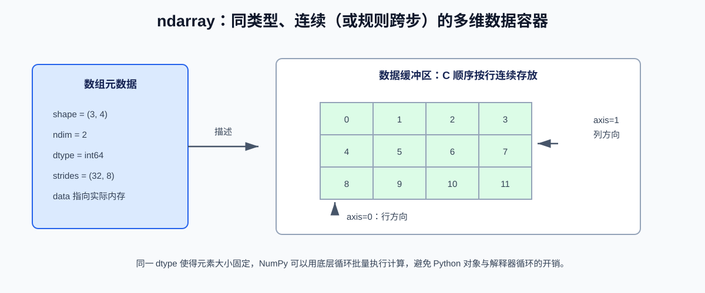
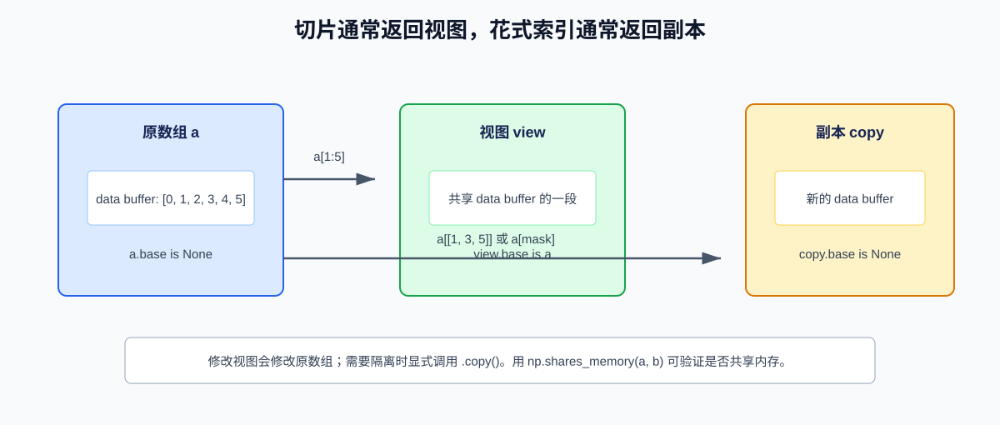
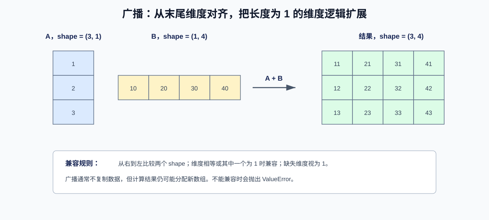

# NumPy 使用指南：从 ndarray 到数值计算实践

> NumPy（Numerical Python）是 Python 科学计算的基础库。它以多维同类型数组 `ndarray` 为核心，提供向量化运算、广播、随机数、线性代数和文件读写能力。pandas、SciPy、scikit-learn、PyTorch 等工具都在不同程度上与它互操作。

## 一、NumPy 解决什么问题

Python 的 `list` 灵活，但每个元素都是独立 Python 对象；对大量数值逐个执行 Python 循环时，解释器调度和对象操作会成为瓶颈。NumPy 数组将同类型元素存放在连续或按固定跨步访问的内存中，并将循环下沉到经过优化的底层实现。

```python
import numpy as np

values = np.array([1.0, 2.0, 3.0])
result = values * 2 + 1
print(result)  # [3. 5. 7.]
```

这不是“让 Python 循环自动消失”的魔法：NumPy 的优势主要来自**规则、批量、数值密集型**计算。若逻辑包含复杂分支、字符串处理或频繁创建小数组，纯 Python、pandas、Numba 或专用库可能更合适。

## 二、安装与基本约定

### 2.1 安装

建议在虚拟环境中固定依赖版本：

```bash
python -m venv .venv

# Windows PowerShell
.venv\Scripts\Activate.ps1

python -m pip install "numpy==2.3.2"
```

```python
import numpy as np

print(np.__version__)
```

社区惯例是 `import numpy as np`。不要使用 `from numpy import *`，它会污染命名空间并使来源不清晰。

### 2.2 ndarray 的核心属性



```python
matrix = np.array([[1, 2, 3], [4, 5, 6]], dtype=np.int64)

print(matrix)
# [[1 2 3]
#  [4 5 6]]

print(matrix.ndim)    # 2：维度数量
print(matrix.shape)   # (2, 3)：每个轴的长度
print(matrix.size)    # 6：元素总数
print(matrix.dtype)   # int64：元素数据类型
print(matrix.itemsize)  # 8：每个元素字节数
print(matrix.nbytes)  # 48：数据区字节数，等于 size * itemsize
```

| 属性         | 含义          | 示例                       |
| ---------- | ----------- | ------------------------ |
| `ndim`     | 轴（维度）的数量    | 矩阵为 `2`                  |
| `shape`    | 每个轴上的长度     | `(2, 3)` 表示 2 行 3 列      |
| `size`     | 元素总数        | `2 * 3 = 6`              |
| `dtype`    | 元素的二进制类型    | `float64`、`int32`、`bool` |
| `itemsize` | 单个元素占用字节数   | `float64` 为 8            |
| `nbytes`   | 数组数据区占用字节数  | 不含 Python 对象开销           |
| `T`        | 转置视图（二维及以上） | `(2, 3)` 变为 `(3, 2)`     |

### 2.3 轴 `axis` 应如何理解

对形状为 `(2, 3)` 的二维数组：

```text
[[1, 2, 3],   <- axis=0 方向：沿行向下聚合，得到每一列的结果
 [4, 5, 6]]

axis=1 方向：沿列向右聚合，得到每一行的结果
```

```python
scores = np.array([[80, 90, 70], [60, 75, 85]])

print(scores.sum(axis=0))  # [140 165 155]，每一列求和
print(scores.sum(axis=1))  # [240 220]，每一行求和
```

一个实用心智模型：`axis` 指定“要消失的轴”。`sum(axis=0)` 让第 0 个轴消失，因此保留列；`sum(axis=1)` 让第 1 个轴消失，因此保留行。

## 三、创建数组

### 3.1 从 Python 对象创建

```python
import numpy as np

one_dimensional = np.array([1, 2, 3])
two_dimensional = np.array([[1, 2], [3, 4]])

# 显式数据类型，避免依赖推断
prices = np.array([19.9, 25.5, 30.0], dtype=np.float64)
```

嵌套序列的每层长度应相同。若传入长短不一的列表，现代 NumPy 通常会报错；不要用 `dtype=object` 勉强包装不规则数据，因为它会失去大部分数值计算优势。

### 3.2 常用初始化函数

```python
zeros = np.zeros((2, 3), dtype=np.float32)
ones = np.ones((2, 3), dtype=np.int32)
filled = np.full((2, 3), fill_value=7)

identity = np.eye(3, dtype=np.float64)
empty = np.empty((2, 3))  # 未初始化，内容不可预测，填满前不要读取

numbers = np.arange(0, 10, 2)  # [0 2 4 6 8]
points = np.linspace(0, 1, num=5)  # [0.   0.25 0.5  0.75 1.  ]
```

| 函数                     | 适合场景      | 注意事项            |
| ---------------------- | --------- | --------------- |
| `np.zeros` / `np.ones` | 初始化累计器、掩码 | 指定 `dtype`      |
| `np.full`              | 用固定哨兵值填充  | 如 `np.nan`、`-1` |
| `np.empty`             | 后续必然完整覆盖  | 不会清零，速度快但易误用    |
| `np.arange`            | 整数步长序列    | 浮点步长可能积累误差      |
| `np.linspace`          | 均匀采样闭区间   | 明确指定样本数，更适合浮点   |
| `np.eye`               | 单位矩阵      | 可用 `k` 指定对角线偏移  |

### 3.3 数据类型与转换

数值类型决定精度、取值范围和内存占用：

```python
raw = np.array([1, 2, 3], dtype=np.int64)
as_float32 = raw.astype(np.float32)

print(as_float32.dtype)  # float32
print(np.iinfo(np.int32).min, np.iinfo(np.int32).max)
print(np.finfo(np.float32).eps)
```

| 类型                      | 典型用途         | 说明            |
| ----------------------- | ------------ | ------------- |
| `np.int32` / `np.int64` | 整数索引、计数      | 注意溢出          |
| `np.float32`            | 深度学习、图像、节省内存 | 约 7 位十进制有效数字  |
| `np.float64`            | 科学计算默认精度     | 约 16 位十进制有效数字 |
| `np.bool_`              | 条件掩码         | 每个元素只表示真假     |
| `np.complex128`         | 频域、信号处理      | 复数实部与虚部       |

`astype()` 默认创建新数组。若确实无需转换，可使用 `astype(dtype, copy=False)`，但不要把“是否复用内存”的细节作为业务逻辑依据。

## 四、索引、切片与形状变换

### 4.1 基础索引和切片

```python
data = np.arange(12).reshape(3, 4)
# [[ 0,  1,  2,  3],
#  [ 4,  5,  6,  7],
#  [ 8,  9, 10, 11]]

print(data[1, 2])      # 6：推荐使用逗号分隔的多维索引
print(data[1])         # [4 5 6 7]：第 1 行
print(data[:, 1])      # [1 5 9]：第 1 列
print(data[0:2, 1:3])  # [[1 2] [5 6]]
print(data[::-1])      # 行倒序
```

与列表类似，切片末尾不包含在结果中。不同的是，多维切片可以在每个轴上独立指定范围。

### 4.2 布尔索引和花式索引

```python
temperatures = np.array([18.5, 21.0, 26.3, 19.8, 30.1])
hot_mask = temperatures >= 25

print(hot_mask)                   # [False False  True False  True]
print(temperatures[hot_mask])     # [26.3 30.1]

values = np.array([10, 20, 30, 40])
print(values[[3, 0, 0]])          # [40 10 10]
```

布尔索引尤其适合筛选和原地赋值：

```python
temperatures[temperatures < 20] = 20
```

### 4.3 视图与副本：最重要的内存语义



基础切片通常返回**视图**，与原数组共享数据；布尔索引和整数数组索引通常产生**副本**。这是性能优势，也是修改数据时的常见错误来源。

```python
source = np.arange(6)
view = source[1:4]
view[0] = 99
print(source)  # [ 0 99  2  3  4  5]，原数组被修改

selected = source[[1, 3, 5]]
selected[0] = -1
print(source)  # 原数组不会因 selected 的修改而变化

isolated = source[1:4].copy()
isolated[:] = 0

print(np.shares_memory(source, view))      # True
print(np.shares_memory(source, selected))  # False
```

链式索引容易隐藏副本问题，应避免：

```python
# 不推荐：第一步可能生成临时副本，赋值未必写回原数组
data[data < 0][0] = 0

# 推荐：一次构造掩码后直接赋值
data[data < 0] = 0
```

### 4.4 reshape、展平和维度扩展

```python
flat = np.arange(12)

matrix = flat.reshape(3, 4)
auto_shape = flat.reshape(3, -1)  # -1 让 NumPy 推导该维长度
flattened_copy = matrix.flatten()  # 总是副本
flattened_view = matrix.ravel()    # 可行时返回视图

row = np.array([10, 20, 30])
print(row.shape)            # (3,)
print(row[:, np.newaxis].shape)  # (3, 1)
print(row[None, :].shape)   # (1, 3)
```

`reshape()` 在内存布局兼容时返回视图，否则可能产生副本。若数组必须连续存储后再传给底层库，可使用 `np.ascontiguousarray(array)`。

## 五、向量化、通用函数与广播

### 5.1 向量化表达式

NumPy 的算术、比较和多数数学函数会逐元素工作：

```python
x = np.array([1.0, 4.0, 9.0])

print(x + 2)          # [ 3.  6. 11.]
print(x * x)          # [ 1. 16. 81.]
print(np.sqrt(x))     # [1. 2. 3.]
print(np.sin(x))      # 逐元素正弦
print(x > 3)          # [False  True  True]
```

这类函数称为 **ufunc（universal function，通用函数）**。它们支持广播、`out=` 输出参数以及 `where=` 条件计算：

```python
numerator = np.array([10.0, 20.0, 30.0])
denominator = np.array([2.0, 0.0, 5.0])

result = np.zeros_like(numerator)
np.divide(numerator, denominator, out=result, where=denominator != 0)
print(result)  # [5. 0. 6.]
```

使用 `where=` 能避免无效除法和告警；使用 `out=` 可在高频路径减少临时数组分配。

### 5.2 广播规则



广播会从最后一个维度开始比较两个形状。每个维度满足以下任一条件即可兼容：

1. 两个维度长度相等；
2. 其中一个维度长度为 `1`；
3. 一方缺少该维度，按长度 `1` 对待。

```python
matrix = np.array([[1], [2], [3]])      # shape: (3, 1)
offset = np.array([[10, 20, 30, 40]])   # shape: (1, 4)

print(matrix + offset)
# [[11 21 31 41]
#  [12 22 32 42]
#  [13 23 33 43]]
```

标准化每一列时，可保留被聚合的维度：

```python
features = np.array([[1.0, 10.0], [2.0, 20.0], [3.0, 30.0]])
mean = features.mean(axis=0, keepdims=True)
std = features.std(axis=0, keepdims=True)

standardized = (features - mean) / np.maximum(std, 1e-12)
```

`keepdims=True` 让均值形状保留为 `(1, 2)`，因此可以与 `(3, 2)` 的原数据稳定广播，避免维度变化导致的错误。

### 5.3 聚合与条件选择

```python
sales = np.array([[120, 80, 100], [90, 110, 130]])

print(sales.sum())
print(sales.mean(axis=0))
print(sales.max(axis=1))
print(sales.argmax(axis=1))

labels = np.where(sales >= 100, "达标", "未达标")
clipped = np.clip(sales, 90, 120)
```

处理缺失值时使用 `np.nan` 与 `nan*` 系列函数：

```python
measurements = np.array([1.0, np.nan, 3.0])
print(np.mean(measurements))     # nan
print(np.nanmean(measurements))  # 2.0
```

`np.nanmean` 适合明确以 NaN 表示缺失的浮点数据；业务上仍应确认“缺失”和“无穷大”“非法值”是否需要不同规则。

## 六、排序、去重与集合操作

```python
values = np.array([3, 1, 2, 1])

print(np.sort(values))       # [1 1 2 3]，返回新数组
print(np.argsort(values))    # [1 3 2 0]，排序后的原始下标
print(np.unique(values))     # [1 2 3]

unique, counts = np.unique(values, return_counts=True)
print(unique, counts)        # [1 2 3] [2 1 1]
```

常见集合操作：

```python
a = np.array([1, 2, 3, 3])
b = np.array([3, 4, 5])

print(np.intersect1d(a, b))  # [3]
print(np.union1d(a, b))      # [1 2 3 4 5]
print(np.setdiff1d(a, b))    # [1 2]
```

这些函数通常会排序和去重；若需保留原始顺序或处理二维行，应明确设计处理逻辑。

## 七、线性代数与矩阵乘法

### 7.1 `*` 与 `@` 的区别

```python
a = np.array([[1, 2], [3, 4]])
b = np.array([[5, 6], [7, 8]])

print(a * b)
# [[ 5 12]
#  [21 32]]  # 逐元素相乘

print(a @ b)
# [[19 22]
#  [43 50]]  # 矩阵乘法
```

### 7.2 常用 `numpy.linalg` 操作

```python
import numpy as np

coefficient = np.array([[2.0, 1.0], [1.0, 3.0]])
constant = np.array([8.0, 13.0])

solution = np.linalg.solve(coefficient, constant)
print(solution)  # [2.2 3.6]

inverse = np.linalg.inv(coefficient)
determinant = np.linalg.det(coefficient)
norm = np.linalg.norm(constant)
```

解方程组时优先使用 `np.linalg.solve(A, b)`，不要先计算逆矩阵再做 `inv(A) @ b`：后者通常更慢且数值稳定性更差。

最小二乘问题使用：

```python
x, residuals, rank, singular_values = np.linalg.lstsq(
    coefficient,
    constant,
    rcond=None,
)
```

## 八、随机数：使用 Generator 而不是全局状态

推荐创建独立随机数生成器，便于可复现和测试隔离：

```python
import numpy as np

rng = np.random.default_rng(seed=42)

uniform = rng.random((2, 3))
integers = rng.integers(low=0, high=10, size=5)
normal = rng.normal(loc=0.0, scale=1.0, size=1000)
sample = rng.choice(np.arange(10), size=3, replace=False)
```

| 方法                              | 分布或行为             |
| ------------------------------- | ----------------- |
| `rng.random(size)`              | `[0, 1)` 均匀分布     |
| `rng.integers(low, high, size)` | 整数均匀分布，`high` 不包含 |
| `rng.normal(loc, scale, size)`  | 正态分布              |
| `rng.choice(a, size, replace)`  | 抽样                |
| `rng.permutation(x)`            | 随机排列，返回新对象        |
| `rng.shuffle(x)`                | 原地打乱              |

不要在每个函数内部都固定 `seed`，否则每次调用会得到相同结果。更好的方式是在程序入口创建 `Generator`，再将它作为依赖传入需要随机性的函数。

## 九、文件读写和内存映射

### 9.1 NumPy 原生格式

```python
array = np.arange(12).reshape(3, 4)

np.save("matrix.npy", array)
loaded = np.load("matrix.npy")

np.savez_compressed("dataset.npz", features=array, labels=np.array([0, 1, 1]))
with np.load("dataset.npz") as archive:
    features = archive["features"]
    labels = archive["labels"]
```

`.npy` 保留数组的形状和类型，适合 NumPy 内部交换；`.npz` 是多个 `.npy` 文件组成的归档。加载不可信 `.npy/.npz` 时保持默认 `allow_pickle=False`，不要启用 pickle 反序列化。

### 9.2 文本数据与大文件

```python
data = np.array([[1.2, 3.4], [5.6, 7.8]])
np.savetxt("data.csv", data, delimiter=",", fmt="%.3f")

loaded = np.loadtxt("data.csv", delimiter=",")
```

CSV 有复杂字段、表头、缺失值、日期或混合类型时，优先考虑 pandas。仅有规则数值列时，`np.loadtxt` 或 `np.genfromtxt` 更直接。

对大于内存的数据，可使用内存映射按需访问：

```python
shape = (10_000, 1_000)
memmap = np.memmap(
    "large.dat",
    dtype=np.float32,
    mode="w+",
    shape=shape,
)
memmap[0] = 1.0
memmap.flush()
del memmap
```

`memmap` 不会让任意算法“无需内存”；它只是把数组页映射到磁盘。应按块处理，并注意磁盘 I/O 和并发写入的协调。

## 十、贯穿案例：清洗传感器读数并统计

设有 4 个设备连续 6 次读数，`-999` 表示设备未上报：

```python
import numpy as np

readings = np.array(
    [
        [20.1, 20.5, -999.0, 21.0, 20.8, 20.6],
        [18.2, 18.4, 18.7, 50.0, 18.5, 18.3],
        [25.0, 25.1, 25.2, 25.1, 25.3, -999.0],
        [19.0, 19.2, 19.1, 19.3, 19.2, 19.1],
    ],
    dtype=np.float64,
)

# 1. 将业务哨兵值转换为 NaN，保留原数组供审计
clean = readings.copy()
clean[clean == -999.0] = np.nan

# 2. 每台设备均值与标准差，axis=1 表示沿时间轴聚合
device_mean = np.nanmean(clean, axis=1, keepdims=True)
device_std = np.nanstd(clean, axis=1, keepdims=True)

# 3. 标记离均值超过 3 个标准差的异常值
z_score = np.abs(clean - device_mean) / np.maximum(device_std, 1e-12)
outlier_mask = z_score > 3

# 4. 把异常值设为 NaN 后重新统计
filtered = clean.copy()
filtered[outlier_mask] = np.nan
final_mean = np.nanmean(filtered, axis=1)

print(final_mean)
```

该案例体现了几个工程要点：

1. 不原地污染原始读数，保留数据血缘。
2. 使用 `keepdims=True` 稳定形状，利用广播计算每行 Z-Score。
3. 对分母使用极小值下限，避免标准差为零时除零。
4. 缺失值和异常值规则应由领域定义；这里的阈值只作演示。

## 十一、性能与内存实践

### 11.1 优先向量化，但避免无节制临时数组

```python
# 简洁，通常足够好
result = np.sqrt(a * a + b * b)

# 在超大数组和热点路径中，可复用输出缓冲区以减少分配
result = np.empty_like(a, dtype=np.result_type(a, b, np.float64))
b_squared = np.empty_like(result)
np.multiply(a, a, out=result)
np.multiply(b, b, out=b_squared)
np.add(result, b_squared, out=result)
np.sqrt(result, out=result)
```

可读性优先。只有在性能剖析确认临时数组造成压力时，再使用 `out=` 或拆分表达式优化。

### 11.2 预分配，避免循环中反复追加

```python
# 不推荐：每次 np.append 都会创建新数组
result = np.array([], dtype=np.float64)
for value in range(1_000):
    result = np.append(result, value)

# 推荐：已知长度时预分配
result = np.empty(1_000, dtype=np.float64)
for index in range(1_000):
    result[index] = index

# 长度未知时先收集到 list，再一次性转换
result = np.array([value for value in range(1_000)], dtype=np.float64)
```

### 11.3 性能测量

Jupyter 中使用 `%timeit`；常规 Python 脚本使用 `timeit`：

```python
import timeit
import numpy as np

setup = "import numpy as np; a = np.arange(1_000_000, dtype=np.float64)"
elapsed = timeit.timeit("np.sqrt(a).sum()", setup=setup, number=100)
print(elapsed)
```

测量时固定输入规模、预热一次、比较等价算法，并避免把数组创建时间混入计算时间。

## 十二、常见陷阱

| 问题             | 原因              | 建议                             |
| -------------- | --------------- | ------------------------------ |
| `a * b` 结果不对   | `*` 是逐元素乘法      | 矩阵乘法用 `a @ b`                  |
| `axis` 写反      | 不清楚被消失的轴        | 先写出 `shape` 和期望输出形状            |
| 修改切片影响原数据      | 切片通常是视图         | 需隔离时显式 `.copy()`               |
| 浮点相等判断失败       | 二进制浮点无法精确表示多数小数 | 用 `np.isclose` / `np.allclose` |
| 整数运算溢出         | `dtype` 范围不足    | 预先选择足够宽的 dtype                 |
| 广播报错           | 对齐后维度既不相等也不为 1  | 检查 `shape`，使用 `None` 扩维        |
| `np.append` 很慢 | 每次都分配复制新数组      | 预分配或先使用 list                   |
| 误用 `np.matrix` | 语义特殊且不推荐        | 始终使用 `ndarray`                 |
| 随机结果不可复现       | 使用隐式全局随机状态      | 显式使用 `default_rng(seed)`       |

浮点比较示例：

```python
actual = np.array([0.1 + 0.2])
expected = np.array([0.3])

print(actual == expected)                 # [False]
print(np.allclose(actual, expected))      # True
```

## 十三、进一步学习路径

1. 熟练掌握 `shape`、`dtype`、索引、切片、`reshape` 和 `axis`。
2. 练习用向量化、掩码和广播替代简单 Python 循环。
3. 学习 `np.linalg`、随机模拟、FFT 与统计函数。
4. 将 NumPy 与 pandas、SciPy、scikit-learn、Matplotlib 配合使用。
5. 进入高性能场景后，学习 Numba、CuPy、JAX 或 PyTorch，并始终先进行性能剖析。

## 参考资料

- [NumPy 官方文档](https://numpy.org/doc/stable/)
- [NumPy 用户指南：数组基础](https://numpy.org/doc/stable/user/absolute_beginners.html)
- [NumPy 用户指南：广播](https://numpy.org/doc/stable/user/basics.broadcasting.html)
- [NumPy API 参考：随机数 Generator](https://numpy.org/doc/stable/reference/random/generator.html)

