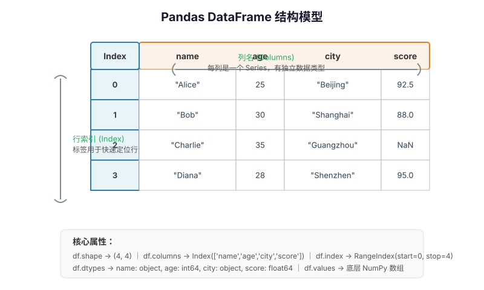
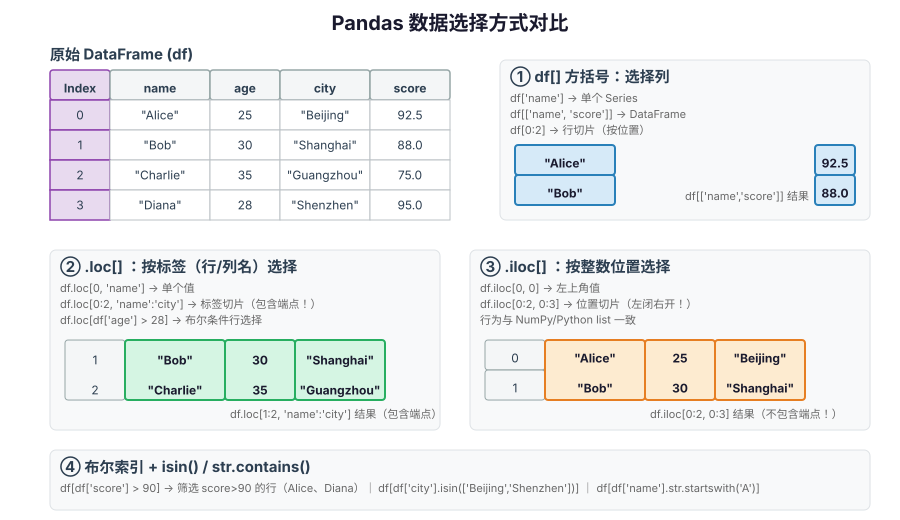
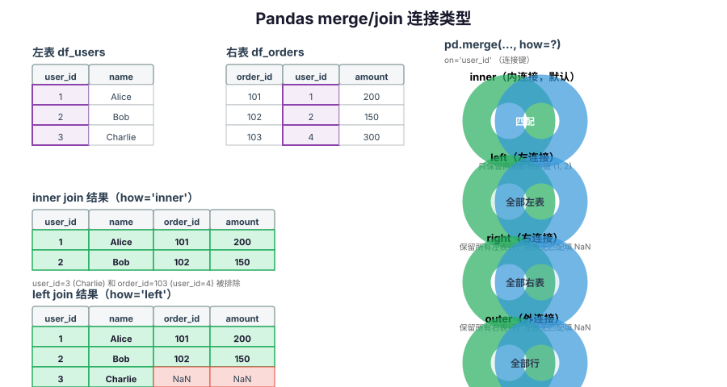
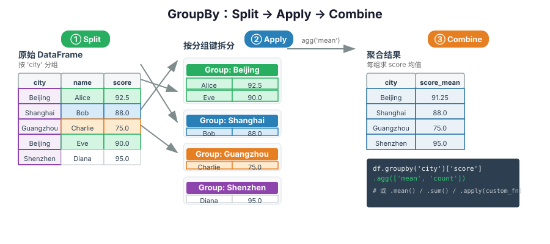

# Pandas 使用指南：从 Series/DataFrame 到数据分析实践

> Pandas 是 Python 生态中最核心的数据分析与处理库。它构建在 NumPy 之上，提供 `Series`（一维带标签数组）和 `DataFrame`（二维带标签表格）两种核心数据结构，支持数据清洗、变换、聚合、合并、时间序列处理以及多种格式的文件 I/O。数据科学、机器学习、金融分析、业务报表等场景几乎离不开它。

## 一、Pandas 解决什么问题

用 Python 原生 `list` + `dict` 处理表格数据时，需要手动管理列名、类型、缺失值、对齐等问题；SQL 虽然强大但无法在 Python 进程内灵活做复杂变换与可视化。Pandas 把"带标签的表格"抽象为一等公民，让你用几行代码完成筛选、分组聚合、表连接、透视表、滚动窗口等操作。

```python
import pandas as pd

df = pd.DataFrame({
    "name": ["Alice", "Bob", "Charlie", "Diana"],
    "age": [25, 30, 35, 28],
    "city": ["Beijing", "Shanghai", "Guangzhou", "Shenzhen"],
    "score": [92.5, 88.0, None, 95.0],
})
print(df.groupby("city")["score"].mean())
```

## 二、安装与基本约定

### 2.1 安装

建议在虚拟环境中固定依赖版本：

```bash
python -m venv .venv
source .venv/bin/activate  # macOS/Linux
# .venv\Scripts\Activate.ps1  # Windows PowerShell

python -m pip install "pandas==2.2.3" "numpy>=2.0" "openpyxl>=3.1"
```

`openpyxl` 是读写 Excel `.xlsx` 文件的可选依赖，需要操作 Excel 时安装。

```python
import pandas as pd
import numpy as np

print(pd.__version__)
```

社区惯例是 `import pandas as pd`。不要使用 `from pandas import *`。

### 2.2 核心数据结构：Series 与 DataFrame



- **Series**：一维带标签数组，由一组同类型（或 `object`）数据 + 一组索引（Index）组成，类似于带行名的 NumPy 一维数组。
- **DataFrame**：二维带标签表格，由多个 Series 按列拼接而成，既有行索引（Index）也有列名（Columns）。每列可以是不同的数据类型。

```python
s = pd.Series([10, 20, 30, 40], index=["a", "b", "c", "d"], name="numbers")
print(s)
# a    10
# b    20
# c    30
# d    40
# Name: numbers, dtype: int64

df = pd.DataFrame({
    "x": [1, 2, 3],
    "y": [4.0, 5.5, 6.1],
}, index=["row1", "row2", "row3"])
```

| 结构 | 维度 | 索引 | 类比 |
|------|------|------|------|
| Series | 1 | 只有行索引 | 带标签的一列 |
| DataFrame | 2 | 行索引 + 列名 | Excel 工作表 / SQL 表 |

### 2.3 常用属性一览

```python
df = pd.DataFrame({"a": [1, 2], "b": [3.0, 4.0]})
print(df.shape)      # (2, 2)
print(df.columns)    # Index(['a', 'b'], dtype='object')
print(df.index)      # RangeIndex(start=0, stop=2, step=1)
print(df.dtypes)     # a      int64; b    float64
print(df.values)     # 底层 NumPy 数组（不推荐，推荐 .to_numpy()）
print(df.T)          # 转置
print(df.info())     # 类型、非空值数量、内存占用摘要
print(df.describe()) # 数值列的统计摘要（count/mean/std/min/max/分位数）
```

## 三、创建数据

### 3.1 从 Python 对象创建

```python
# 从 dict 创建：key 为列名，value 为等长序列
df = pd.DataFrame({
    "name": ["Alice", "Bob", "Charlie"],
    "age": [25, 30, 35],
    "city": ["Beijing", "Shanghai", "Guangzhou"],
})

# 从列表的列表（二维数组）创建，需指定 columns
df2 = pd.DataFrame(
    [[1, 4.0], [2, 5.5], [3, 6.1]],
    columns=["id", "value"],
    index=["r1", "r2", "r3"],
)

# 从列表的 dict 创建（每行是一条记录）
df3 = pd.DataFrame([
    {"name": "Alice", "age": 25},
    {"name": "Bob", "age": 30},
])

# 从 NumPy 数组创建
arr = np.arange(12).reshape(3, 4)
df4 = pd.DataFrame(arr, columns=["a", "b", "c", "d"])
```

### 3.2 常用初始化构造函数

| 函数 | 作用 |
|------|------|
| `pd.DataFrame(dict/list/ndarray)` | 通用构造函数 |
| `pd.Series(data, index, name, dtype)` | 创建 Series |
| `pd.read_csv(path)` | 从 CSV 文件读取 |
| `pd.read_excel(path, sheet_name)` | 从 Excel 文件读取 |
| `pd.read_json(path_or_buf)` | 从 JSON 读取 |
| `pd.read_sql(query, con)` | 从 SQL 查询读取 |
| `pd.date_range(start, end, periods, freq)` | 生成日期范围索引 |

```python
dates = pd.date_range("2026-01-01", periods=5, freq="D")
# DatetimeIndex(['2026-01-01', '2026-01-02', ..., '2026-01-05'])
```

## 四、数据查看与初步探查

```python
df = pd.DataFrame({
    "name": ["Alice", "Bob", "Charlie", "Diana", "Eve"],
    "age": [25, 30, 35, 28, np.nan],
    "city": ["Beijing", "Shanghai", "Guangzhou", "Shenzhen", "Beijing"],
    "score": [92.5, 88.0, 75.0, 95.0, 90.0],
})

df.head(3)      # 前 3 行，默认 5
df.tail(2)      # 后 2 行
df.sample(2)    # 随机抽 2 行
df.shape        # (5, 4)
df.dtypes       # 各列类型
df.info()       # 总览：非空计数、类型、内存
df.describe()   # 数值列统计摘要
df.describe(include="object")  # 字符串/分类列的统计（unique/top/freq）
df["city"].value_counts()      # 列值频次统计
df["city"].unique()            # 去重后的列值数组
df["city"].nunique()           # 不同值的个数
df.nlargest(2, "score")        # 按 score 取最大的 2 行
df.nsmallest(2, "age")         # 按 age 取最小的 2 行
```

## 五、索引与选择数据



Pandas 提供多套索引 API，**必须明确区分**，否则会遇到 `SettingWithCopyWarning` 或意外结果。

| 方式 | 语法 | 行/列选择依据 | 切片端点 |
|------|------|--------------|----------|
| `[]` 方括号 | `df[col]` / `df[[c1,c2]]` | 选列（标量/列表）；切片选行 | 行切片为位置切片，**左闭右开** |
| `.loc[]` | `df.loc[row, col]` | **按标签**（索引名/列名） | 标签切片**包含两端** |
| `.iloc[]` | `df.iloc[row_pos, col_pos]` | **按整数位置** | 位置切片**左闭右开** |
| `.at[]` / `.iat[]` | `df.at[label, col]` | 快速取单个值 | 按标签/位置 |
| 布尔索引 | `df[mask]` / `df.loc[mask]` | 按条件筛选行 | — |

```python
df = pd.DataFrame({
    "name": ["Alice", "Bob", "Charlie", "Diana"],
    "age": [25, 30, 35, 28],
    "city": ["Beijing", "Shanghai", "Guangzhou", "Shenzhen"],
    "score": [92.5, 88.0, 75.0, 95.0],
}, index=["r0", "r1", "r2", "r3"])

# ---- 选列 ----
df["name"]              # Series
df[["name", "score"]]   # DataFrame
df.name                 # 简写，仅当列名是合法标识符且不与方法重名时可用（不推荐用于生产）

# ---- .loc 按标签 ----
df.loc["r1", "name"]                 # "Bob"
df.loc["r0":"r2", "name":"city"]     # 标签切片，包含 r2 和 city！
df.loc[["r0", "r3"], ["name", "score"]]

# ---- .iloc 按位置 ----
df.iloc[0, 0]            # "Alice"
df.iloc[0:2, 0:3]        # 位置切片，左闭右开（不包含第2行/第3列）
df.iloc[[0, 3], [0, 3]]

# ---- 布尔索引 ----
df[df["age"] > 28]
df.loc[df["city"].isin(["Beijing", "Shenzhen"])]
df.loc[df["name"].str.startswith("A")]
df.loc[(df["age"] > 25) & (df["score"] > 90)]  # 多条件必须用 & | ~ 且加括号
```

### 5.1 SettingWithCopyWarning 的本质

链式索引（先选列再选行，或两次 `[]`）可能在**副本**而非视图上赋值，修改不会落回原 DataFrame。

```python
# 不推荐：可能触发 SettingWithCopyWarning
df[df["age"] > 28]["score"] = 0  # 可能无效

# 推荐：一次性用 .loc 定位并赋值
df.loc[df["age"] > 28, "score"] = 0
```

需要明确隔离修改时，显式调用 `.copy()`：

```python
subset = df.loc[df["city"] == "Beijing"].copy()
subset["new_col"] = 1  # 安全，不影响 df
```

## 六、数据清洗

### 6.1 缺失值处理

Pandas 用 `np.nan`（或 `pd.NA` 在扩展类型中）表示缺失值。`None` 在数值列中也会被转换为 `NaN`。

```python
df = pd.DataFrame({
    "name": ["Alice", "Bob", "Charlie", "Diana"],
    "age": [25, None, 35, 28],
    "score": [92.5, 88.0, np.nan, 95.0],
})

df.isna()           # 逐元素布尔，True 表示缺失
df.isnull()         # isna 的别名
df.notna()          # 反义
df["age"].isna()    # Series 级别的缺失掩码

df.dropna()                      # 删除含缺失值的行
df.dropna(axis=1)                # 删除含缺失值的列
df.dropna(subset=["age"])        # 只看 age 列的缺失
df.dropna(how="all")             # 全行都为 NaN 才删

df.fillna(0)                                   # 统一填充为 0
df.fillna({"age": 0, "score": df["score"].mean()})  # 按列指定填充值
df["age"] = df["age"].fillna(df["age"].median())     # 用中位数填充
df.ffill()   # 前向填充（用上一个非空值填充）
df.bfill()   # 后向填充（用下一个非空值填充）
df.interpolate(method="linear")  # 线性插值填充
```

### 6.2 重复值处理

```python
df.duplicated()                # 每行是否是前面行的重复
df.duplicated(subset=["name"]) # 按指定列判断重复
df.drop_duplicates()                           # 删除整行重复（保留首次出现）
df.drop_duplicates(subset=["city"], keep="last")  # 按 city 去重，保留最后出现
```

### 6.3 数据类型转换

```python
df["age"] = df["age"].astype("Int64")  # 可空整数类型（Pandas 扩展类型）
df["city"] = df["city"].astype("category")  # 分类类型，节省内存
df["score"] = pd.to_numeric(df["score"], errors="coerce")  # 转数值，失败变 NaN
df["date"] = pd.to_datetime(df["date_str"], errors="coerce")  # 转日期时间
```

`errors="coerce"` 会把无法解析的值变为 `NaN`/`NaT`，避免整个转换失败。

### 6.4 替换与字符串处理

```python
df["city"] = df["city"].replace({"Beijing": "北京", "Shanghai": "上海"})
df["city"] = df["city"].str.replace("i", "I", regex=False)

# .str 访问器：向量化字符串方法
df["name"].str.lower()
df["name"].str.upper()
df["name"].str.len()
df["name"].str.contains("li")
df["name"].str.startswith("A")
df["name"].str.strip()
df["name"].str.split(" ", expand=True)  # expand=True 返回 DataFrame
```

## 七、列操作、赋值与变换

### 7.1 增加/删除列

```python
# 新增列
df["double_score"] = df["score"] * 2
df["age_band"] = pd.cut(df["age"], bins=[0, 25, 35, 100], labels=["young", "mid", "senior"])
df = df.assign(
    score_z = (df["score"] - df["score"].mean()) / df["score"].std(),
    is_pass = df["score"] >= 60,
)

# 删除列
df = df.drop(columns=["double_score"])
df.drop(columns=["age_band"], inplace=True)  # inplace=True 直接修改原对象（谨慎使用）

# 插入列到指定位置
df.insert(loc=1, column="id", value=range(1, len(df) + 1))
```

`assign` 返回新对象，不修改原数据，适合链式调用：

```python
result = (
    df
    .assign(score_sqrt=np.sqrt(df["score"]))
    .query("score_sqrt > 9")
    .sort_values("score", ascending=False)
)
```

### 7.2 重命名

```python
df = df.rename(columns={"name": "姓名", "age": "年龄"})
df = df.rename(index={"r0": "row_0"})
df.columns = ["A", "B", "C", "D"]  # 整体替换列名
```

### 7.3 排序

```python
df.sort_values(by="age", ascending=True)
df.sort_values(by=["city", "score"], ascending=[True, False])
df.sort_index()
df.sort_index(axis=1, ascending=False)  # 按列名排序
```

### 7.4 映射与自定义变换

```python
df["city_code"] = df["city"].map({"Beijing": 1, "Shanghai": 2, "Guangzhou": 3, "Shenzhen": 4})
df["age"] = df["age"].apply(lambda x: x + 1 if pd.notna(x) else x)  # 逐元素
df[["age", "score"]] = df[["age", "score"]].apply(np.sqrt)          # 对列逐元素应用 ufunc

# 行级处理（谨慎，性能较低）
df["info"] = df.apply(lambda row: f"{row['name']}({row['city']})", axis=1)
```

行级 `apply(axis=1)` 本质是 Python 循环，数据量大时优先使用向量化操作或 `np.where`、`np.select`、`pd.cut`。

```python
df["level"] = np.select(
    [df["score"] >= 90, df["score"] >= 75, df["score"] >= 60],
    ["A", "B", "C"],
    default="D",
)
```

## 八、合并、连接与拼接



### 8.1 merge（数据库风格 join）

```python
users = pd.DataFrame({"user_id": [1, 2, 3], "name": ["Alice", "Bob", "Charlie"]})
orders = pd.DataFrame({"order_id": [101, 102, 103], "user_id": [1, 2, 4], "amount": [200, 150, 300]})

pd.merge(users, orders, on="user_id", how="inner")  # 默认 inner
pd.merge(users, orders, on="user_id", how="left")
pd.merge(users, orders, on="user_id", how="right")
pd.merge(users, orders, on="user_id", how="outer")

# 两边列名不同时用 left_on / right_on
pd.merge(users, orders, left_on="user_id", right_on="uid", how="inner")

# 按索引合并
pd.merge(users, orders, left_index=True, right_index=True)

# 处理重复列名后缀
pd.merge(df1, df2, on="key", suffixes=("_left", "_right"))
```

| `how` 参数 | 含义 |
|-----------|------|
| `"inner"` | 只保留两边键都匹配的行（默认） |
| `"left"` | 保留左表全部行，右表无匹配填 NaN |
| `"right"` | 保留右表全部行，左表无匹配填 NaN |
| `"outer"` | 保留两边所有行，无匹配填 NaN |
| `"cross"` | 笛卡尔积（慎用） |

### 8.2 join（按索引合并的快捷方式）

```python
users.set_index("user_id").join(orders.set_index("user_id"), how="left")
```

### 8.3 concat（轴向拼接）

```python
# 纵向拼接（行方向，类似 SQL UNION ALL）
pd.concat([df1, df2], axis=0, ignore_index=True)

# 横向拼接（列方向）
pd.concat([df1, df2], axis=1)

# 拼接时标明来源
pd.concat([df1, df2], keys=["source_a", "source_b"])
```

### 8.4 append（已废弃，用 concat 替代）

`df.append()` 在 Pandas 2.0 已移除，请使用 `pd.concat([df, new_row], ignore_index=True)`。

## 九、分组与聚合：groupby



`groupby` 的核心思想是"拆分-应用-合并"（Split-Apply-Combine）：先按一个或多个键拆成多个子组，对每个子组独立应用聚合/变换/过滤，最后合并结果。

```python
df = pd.DataFrame({
    "city": ["Beijing", "Shanghai", "Beijing", "Guangzhou", "Shenzhen", "Beijing"],
    "name": ["Alice", "Bob", "Eve", "Charlie", "Diana", "Frank"],
    "age": [25, 30, 28, 35, 28, 40],
    "score": [92.5, 88.0, 90.0, 75.0, 95.0, 85.0],
})

# 单聚合
df.groupby("city")["score"].mean()
df.groupby("city")["score"].agg(["mean", "sum", "count", "max", "min", "std"])

# 多列聚合
df.groupby("city").agg(
    avg_score=("score", "mean"),
    total_score=("score", "sum"),
    avg_age=("age", "mean"),
    n=("name", "count"),
)

# 多键分组
df.groupby(["city", "age_band"])["score"].mean()

# 过滤：保留组成员满足条件的整个组
df.groupby("city").filter(lambda g: g["score"].mean() > 88)

# 变换：返回与原表等长的结果（组内标准化）
df["city_score_mean"] = df.groupby("city")["score"].transform("mean")
df["score_z"] = df.groupby("city")["score"].transform(
    lambda s: (s - s.mean()) / s.std()
)
```

常用内置聚合函数：`sum`、`mean`、`median`、`min`、`max`、`std`、`var`、`count`（非 NaN 计数）、`size`（含 NaN 计数）、`first`、`last`、`nunique`。

## 十、透视表与交叉表

```python
# 透视表
df.pivot_table(
    values="score",
    index="city",
    columns="age_band",
    aggfunc="mean",
    fill_value=0,
    margins=True,  # 加合计行/列
)

# 交叉表：频次统计
pd.crosstab(df["city"], df["age_band"], margins=True)
pd.crosstab(df["city"], df["age_band"], values=df["score"], aggfunc="mean")
```

## 十一、时间序列处理

Pandas 对时间序列提供强大支持：

```python
# 生成时间索引
dates = pd.date_range("2026-01-01", periods=10, freq="D")
ts = pd.Series(np.random.randn(10), index=dates)

# 字符串转时间
df["date"] = pd.to_datetime(df["date_str"], format="%Y-%m-%d", errors="coerce")

# 从 datetime 列提取属性
df["year"] = df["date"].dt.year
df["month"] = df["date"].dt.month
df["day"] = df["date"].dt.day
df["weekday"] = df["date"].dt.weekday  # 0=周一
df["quarter"] = df["date"].dt.quarter

# 重采样（类似 groupby，但按时间桶聚合）
ts.resample("W").mean()   # 按周求均值
ts.resample("ME").sum()   # 按月求和（月末标签）
ts.resample("QE").last()  # 按季度取最后值

# 滚动窗口
ts.rolling(window=3).mean()     # 3 期移动平均
ts.rolling(window=3, min_periods=1).mean()

# 偏移与差
df["prev_value"] = df["value"].shift(1)
df["diff"] = df["value"].diff(1)        # 一阶差分
df["pct_change"] = df["value"].pct_change()  # 百分比变化
```

常用 `freq` 别名：

| 别名 | 含义 |
|------|------|
| `D` | 日历日 |
| `B` | 工作日 |
| `W` | 周（周日为结束） |
| `ME` / `M` | 月末 |
| `QE` / `Q` | 季末 |
| `YE` / `A` | 年末 |
| `h` / `H` | 小时 |
| `min` / `T` | 分钟 |
| `s` / `S` | 秒 |

## 十二、文件读写

### 12.1 CSV

```python
df = pd.read_csv(
    "data.csv",
    sep=",",
    header=0,           # 第 0 行为表头
    index_col=None,
    usecols=["a", "b"], # 只读指定列
    dtype={"id": "Int64"},
    parse_dates=["date"],
    na_values=["N/A", "missing"],
    encoding="utf-8",
    chunksize=10_000,   # 分块读取，返回迭代器
)

df.to_csv(
    "out.csv",
    index=False,        # 不写行索引
    encoding="utf-8-sig",  # Windows 下 Excel 打开不乱码
    na_rep="",
)
```

### 12.2 Excel

```python
df = pd.read_excel(
    "data.xlsx",
    sheet_name="Sheet1",  # 或 0，或 ["Sheet1", "Sheet2"]
    header=0,
    usecols="A:D",        # 也可以用列字母
)

df.to_excel("out.xlsx", sheet_name="data", index=False)

# 写多个 sheet
with pd.ExcelWriter("out.xlsx") as writer:
    df1.to_excel(writer, sheet_name="users", index=False)
    df2.to_excel(writer, sheet_name="orders", index=False)
```

### 12.3 JSON

```python
df = pd.read_json("data.json", orient="records")
df.to_json("out.json", orient="records", force_ascii=False, indent=2)
```

常用 `orient`：`"records"`（列表的对象）、`"columns"`（列名→列值对象）、`"split"`（分离 index/columns/data）、`"index"`。

### 12.4 SQL

```python
from sqlalchemy import create_engine

engine = create_engine("sqlite:///data.db")
df = pd.read_sql("SELECT * FROM users WHERE age > 20", con=engine)
df.to_sql("users_copy", con=engine, if_exists="replace", index=False)
```

`if_exists` 可选 `"fail"`（默认）、`"replace"`（删表重建）、`"append"`（追加）。

### 12.5 大文件分块读取

```python
chunk_iter = pd.read_csv("huge.csv", chunksize=100_000)
total = 0
for chunk in chunk_iter:
    total += chunk["amount"].sum()
print(total)
```

## 十三、贯穿案例：用户订单数据清洗与分析

下面通过一个完整示例串联前面的知识点：

```python
import pandas as pd
import numpy as np

users = pd.DataFrame({
    "user_id": [1, 2, 3, 4, 5],
    "name": ["Alice", "Bob", "Charlie", "Diana", "Eve"],
    "age": [25, 30, None, 28, 35],
    "city": ["Beijing", "Shanghai", "Beijing", "Shenzhen", "Beijing"],
    "reg_date": ["2025-03-01", "2025-03-15", "2025-04-01", "bad-date", "2025-05-01"],
})

orders = pd.DataFrame({
    "order_id": range(101, 110),
    "user_id": [1, 1, 2, 2, 3, 4, 4, 5, 2],
    "amount": [200, 150, 300, 50, np.nan, 400, 250, 100, 90],
    "status": ["paid", "paid", "paid", "refund", "paid", "paid", "paid", "paid", "paid"],
})

# 1. 类型转换与缺失值处理
users["reg_date"] = pd.to_datetime(users["reg_date"], errors="coerce")
users["age"] = users["age"].fillna(users["age"].median()).astype(int)

# 2. 过滤有效订单，填充金额缺失为 0，剔除退款
valid_orders = orders.dropna(subset=["amount"]).query("status == 'paid'").copy()

# 3. 聚合：每个用户总消费、订单数
user_stats = valid_orders.groupby("user_id").agg(
    total_spend=("amount", "sum"),
    order_count=("order_id", "count"),
    avg_order=("amount", "mean"),
).reset_index()

# 4. 与用户信息左连接，无订单用户保留
report = users.merge(user_stats, on="user_id", how="left")
report[["total_spend", "order_count", "avg_order"]] = report[
    ["total_spend", "order_count", "avg_order"]
].fillna(0)

# 5. 分级
report["level"] = np.select(
    [report["total_spend"] >= 500, report["total_spend"] >= 200],
    ["VIP", "Normal"],
    default="New",
)

# 6. 城市维度分析
city_report = report.groupby("city").agg(
    user_count=("user_id", "count"),
    vip_count=("level", lambda s: (s == "VIP").sum()),
    total_spend=("total_spend", "sum"),
).sort_values("total_spend", ascending=False)

print(report)
print(city_report)
report.to_excel("user_report.xlsx", index=False)
```

## 十四、性能与最佳实践

1. **优先向量化**：能用 Series/NumPy 运算就别用 `apply(axis=1)` 或 Python 循环。
2. **选好 `dtype`**：字符串列优先考虑 `category`（基数不太大时），可空整数用 `"Int64"`，布尔用 `"boolean"` 扩展类型以支持 `pd.NA`。
3. **避免频繁 append**：循环中不要反复 `df = pd.concat([df, row])`，先收集到 `list` 再一次性构造 DataFrame。
4. **只读取需要的列**：`read_csv(usecols=...)`、指定 `dtype` 能显著降低内存。
5. **链式索引不要赋值**：统一用 `.loc[mask, col] = value`，避免 `SettingWithCopyWarning`。
6. **`inplace=True` 不总是高效**：很多情况下它仍然创建副本，而且不利于链式调用；推荐赋值给新变量。
7. **`groupby` 后列选择**：`df.groupby("k")["v"].mean()` 比 `df.groupby("k").mean()["v"]` 更高效（先选列再聚合，少算无关列）。
8. **大文件分块**：用 `chunksize` 迭代处理，或考虑 `dask.dataframe`、`polars`、`pyarrow` 等工具。

### 14.1 内存优化示例

```python
def reduce_mem_usage(df: pd.DataFrame) -> pd.DataFrame:
    for col in df.columns:
        col_type = df[col].dtype
        if col_type != "object" and not pd.api.types.is_categorical_dtype(col_type):
            c_min, c_max = df[col].min(), df[col].max()
            if pd.api.types.is_integer_dtype(col_type):
                if c_min >= 0:
                    if c_max < 2**8: df[col] = df[col].astype("uint8")
                    elif c_max < 2**16: df[col] = df[col].astype("uint16")
                    elif c_max < 2**32: df[col] = df[col].astype("uint32")
                else:
                    if c_min > -2**7 and c_max < 2**7: df[col] = df[col].astype("int8")
                    elif c_min > -2**15 and c_max < 2**15: df[col] = df[col].astype("int16")
                    elif c_min > -2**31 and c_max < 2**31: df[col] = df[col].astype("int32")
            elif pd.api.types.is_float_dtype(col_type):
                df[col] = df[col].astype("float32")
    return df
```

## 十五、常见陷阱

| 问题 | 原因 | 建议 |
|------|------|------|
| `SettingWithCopyWarning` | 链式索引返回副本，赋值可能丢失 | 用 `.loc[row, col] = x` 或先 `.copy()` |
| 切片端点搞错 | `.loc` 标签切片**包含两端**；`.iloc` 位置切片**左闭右开** | 写完用 `head()`/切片打印验证 |
| 缺失值比较永远为 False | `np.nan != np.nan` | 用 `isna()`/`notna()` 判断 |
| `count()` 与 `size()` 差异 | `count` 不计 NaN；`size` 计 NaN | 按需求选用 |
| 多条件 `and`/`or` 报错 | Python `and/or` 无法作用于 Series | 用 `&` `\|` `~`，每个条件加括号 |
| `apply(axis=1)` 超慢 | 行级 Python 循环 | 改写为向量化或 `np.select` |
| 字符串列默认 `object` 类型 | 内存高、操作慢 | 低基数字符串转为 `"category"` |
| `read_csv` 数字被识别为字符串 | 存在千分位、货币符号或脏值 | 用 `converters`、`pd.to_numeric(errors="coerce")` |
| `merge` 后行数暴涨 | 连接键不唯一导致笛卡尔积 | merge 前检查两边键的唯一性（`duplicated`） |
| 时间序列时区混乱 | 无时区 vs 有时区混合 | 统一用 `tz_localize`/`tz_convert` |
| `inplace=True` 不生效 | 某些操作返回新对象，`inplace` 可能无效或被未来版本移除 | 优先用赋值式：`df = df.xxx()` |

## 十六、附录：Pandas 函数/属性汇总表

下表先列出全文涉及的核心函数、方法与属性，后面第 17 节给出每个条目的详细用法、参数、返回值与注意事项。

### 16.1 数据创建与 I/O

| 名称 | 类型 | 作用简述 |
|------|------|----------|
| `pd.Series` | 构造函数 | 创建一维带标签数组 |
| `pd.DataFrame` | 构造函数 | 创建二维带标签表格 |
| `pd.date_range` | 构造函数 | 生成固定频率的 DatetimeIndex |
| `pd.read_csv` | I/O | 读取 CSV/文本分隔文件 |
| `pd.read_excel` | I/O | 读取 Excel 文件 |
| `pd.read_json` | I/O | 读取 JSON 数据 |
| `pd.read_sql` | I/O | 从 SQL 查询/表读取 |
| `DataFrame.to_csv` | I/O | 导出为 CSV |
| `DataFrame.to_excel` | I/O | 导出为 Excel |
| `DataFrame.to_json` | I/O | 导出为 JSON |
| `DataFrame.to_sql` | I/O | 写入 SQL 数据库 |
| `pd.ExcelWriter` | 上下文管理器 | 多 Sheet 写入 Excel |

### 16.2 属性与整体信息

| 名称 | 类型 | 作用简述 |
|------|------|----------|
| `DataFrame.shape` | 属性 | (行数, 列数) 元组 |
| `DataFrame.columns` | 属性 | 列名 Index |
| `DataFrame.index` | 属性 | 行索引 Index |
| `DataFrame.dtypes` | 属性 | 各列数据类型 |
| `DataFrame.values` | 属性 | 底层 NumPy 数组（不推荐） |
| `DataFrame.T` | 属性 | 转置 |
| `DataFrame.info()` | 方法 | 打印结构、非空计数、内存 |
| `DataFrame.describe()` | 方法 | 数值列/分类列统计摘要 |

### 16.3 数据查看与探查

| 名称 | 类型 | 作用简述 |
|------|------|----------|
| `DataFrame.head(n)` | 方法 | 前 n 行 |
| `DataFrame.tail(n)` | 方法 | 后 n 行 |
| `DataFrame.sample(n)` | 方法 | 随机抽 n 行 |
| `Series.value_counts()` | 方法 | 列值频次统计 |
| `Series.unique()` | 方法 | 列去重值数组 |
| `Series.nunique()` | 方法 | 去重值个数 |
| `DataFrame.nlargest(n, col)` | 方法 | 按列取最大的 n 行 |
| `DataFrame.nsmallest(n, col)` | 方法 | 按列取最小的 n 行 |

### 16.4 索引与选择

| 名称 | 类型 | 作用简述 |
|------|------|----------|
| `df[col]` / `df[[cols]]` | 索引器 | 选单列/多列 |
| `df.loc[row, col]` | 索引器 | 按标签选择 |
| `df.iloc[r, c]` | 索引器 | 按整数位置选择 |
| `df.at[lbl, col]` / `df.iat[r, c]` | 索引器 | 快速取单个值 |
| `df.query(expr)` | 方法 | 用字符串表达式筛选行 |
| `Series.isin(values)` | 方法 | 元素是否在给定集合中 |
| `Series.str` | 访问器 | 向量化字符串方法 |

### 16.5 缺失值、重复值与类型

| 名称 | 类型 | 作用简述 |
|------|------|----------|
| `isna()` / `isnull()` | 方法 | 判断缺失 |
| `notna()` / `notnull()` | 方法 | 判断非缺失 |
| `dropna()` | 方法 | 删除含缺失的行/列 |
| `fillna(x)` | 方法 | 填充缺失值 |
| `ffill()` / `bfill()` | 方法 | 前向/后向填充 |
| `interpolate()` | 方法 | 插值填充 |
| `duplicated()` | 方法 | 检测重复行 |
| `drop_duplicates()` | 方法 | 删除重复行 |
| `astype(dtype)` | 方法 | 类型转换 |
| `pd.to_numeric()` | 函数 | 转数值类型 |
| `pd.to_datetime()` | 函数 | 转日期时间类型 |
| `Series.replace()` | 方法 | 值替换 |

### 16.6 列操作与变换

| 名称 | 类型 | 作用简述 |
|------|------|----------|
| `df[new_col] = ...` | 赋值 | 新增/覆盖列 |
| `DataFrame.assign(**kwargs)` | 方法 | 链式新增列，返回新对象 |
| `DataFrame.drop(columns=)` | 方法 | 删除列 |
| `DataFrame.insert(loc, column, value)` | 方法 | 在指定位置插入列 |
| `DataFrame.rename()` | 方法 | 重命名行/列 |
| `DataFrame.sort_values()` | 方法 | 按值排序 |
| `DataFrame.sort_index()` | 方法 | 按索引排序 |
| `pd.cut()` | 函数 | 连续值分箱（按区间边界） |
| `pd.qcut()` | 函数 | 按分位数分箱 |
| `Series.map()` | 方法 | 映射/逐元素函数 |
| `DataFrame.apply()` / `Series.apply()` | 方法 | 应用自定义函数（逐列/逐行/逐元素） |
| `np.where()` / `np.select()` | 函数 | 向量化条件赋值 |

### 16.7 合并与拼接

| 名称 | 类型 | 作用简述 |
|------|------|----------|
| `pd.merge()` | 函数 | 数据库风格 join |
| `DataFrame.merge()` | 方法 | merge 的方法形式 |
| `DataFrame.join()` | 方法 | 按索引 join 的快捷方式 |
| `pd.concat()` | 函数 | 轴向拼接（纵向/横向） |

### 16.8 分组、聚合、透视

| 名称 | 类型 | 作用简述 |
|------|------|----------|
| `DataFrame.groupby()` | 方法 | 按键分组，返回 GroupBy 对象 |
| `GroupBy.agg()` / `GroupBy.aggregate()` | 方法 | 聚合（支持多函数/命名聚合） |
| `GroupBy.transform()` | 方法 | 组内变换，返回等长结果 |
| `GroupBy.filter()` | 方法 | 按组条件过滤整个组 |
| `GroupBy.size()` | 方法 | 组大小（含 NaN） |
| `GroupBy.count()` | 方法 | 组非 NaN 计数 |
| `DataFrame.pivot_table()` | 方法 | 透视表 |
| `pd.crosstab()` | 函数 | 交叉频次表 |

### 16.9 时间序列

| 名称 | 类型 | 作用简述 |
|------|------|----------|
| `Series.dt` | 访问器 | 日期时间属性访问（year/month/...） |
| `Series.shift(n)` | 方法 | 按周期平移 |
| `Series.diff(n)` | 方法 | n 阶差分 |
| `Series.pct_change(n)` | 方法 | 百分比变化 |
| `Series.rolling(w)` | 方法 | 滚动窗口 |
| `Series.resample(freq)` | 方法 | 时间重采样 |

## 十七、附录：Pandas 函数/属性详细用法

### 17.1 数据创建

#### `pd.Series(data=None, index=None, dtype=None, name=None, copy=False)`

**作用**：创建一维带标签数组，是 DataFrame 的列单位。

**核心参数**：
- `data`：类数组（list、ndarray、dict、标量）
- `index`：索引标签数组，长度与 data 一致；缺省时为 `RangeIndex(0, n)`
- `dtype`：显式指定类型，如 `"int64"`、`"float64"`、`"string"`、`"category"`
- `name`：Series 名称，在作为 DataFrame 列时自动成为列名

**返回**：`Series`。

```python
pd.Series([1, 2, 3])                          # 默认 RangeIndex
pd.Series([1, 2, 3], index=["a", "b", "c"])  # 自定义索引
pd.Series({"x": 1, "y": 2})                   # dict 键成为索引
pd.Series(5, index=["a", "b", "c"])           # 标量广播
```

**注意**：从 dict 创建时若显式传 `index`，将按 `index` 顺序取值，缺失的键填 NaN。

---

#### `pd.DataFrame(data=None, index=None, columns=None, dtype=None, copy=None)`

**作用**：创建二维带标签表格，是 Pandas 最核心的对象。

**核心参数**：
- `data`：ndarray、dict（列名→列值）、list of dict（每行一条记录）、另一个 DataFrame
- `index`：行索引
- `columns`：列名顺序/筛选
- `dtype`：统一指定类型（一般由数据推断）

```python
pd.DataFrame({"a": [1, 2], "b": [3.0, 4.0]})
pd.DataFrame([[1, 2], [3, 4]], columns=["x", "y"])
pd.DataFrame(np.arange(6).reshape(2, 3), columns=["a", "b", "c"])
```

**注意**：从 list of dict 创建时，缺失键自动填 NaN；dict 值长度必须一致（标量会广播）。

---

#### `pd.date_range(start=None, end=None, periods=None, freq=None, tz=None, ...)`

**作用**：生成等间距的 `DatetimeIndex`。

**核心参数**：
- `start` / `end`：起止时间
- `periods`：生成点数（与 `end` 二选一或结合使用）
- `freq`：频率字符串，如 `"D"`、`"h"`、`"ME"`、`"W-MON"`
- `tz`：时区，如 `"Asia/Shanghai"`

```python
pd.date_range("2026-01-01", periods=5, freq="D")
pd.date_range("2026-01-01", "2026-01-31", freq="W")
pd.date_range("2026-01-01", periods=3, freq="ME", tz="Asia/Shanghai")
```

---

### 17.2 文件 I/O

#### `pd.read_csv(filepath_or_buffer, sep=',', delimiter=None, header='infer', index_col=None, usecols=None, dtype=None, parse_dates=None, na_values=None, encoding=None, chunksize=None, ...)`

**作用**：读取分隔符文本文件为 DataFrame，是最常用的数据入口。

**核心参数**：
- `sep`：分隔符，默认 `,`；正则如 `r"\s+"` 支持多空白
- `header`：作为列名的行号，默认 `0`；无表头传 `None` 并配合 `names=`
- `index_col`：作为行索引的列号/列名/列表
- `usecols`：只读指定列（列名列表、列号列表或函数）
- `dtype`：`dict` 指定列类型，如 `{"id": "Int64"}`
- `parse_dates`：要解析为日期的列名/列号列表
- `na_values`：额外识别为 NaN 的字符串集合
- `encoding`：文本编码，常用 `"utf-8"`、`"utf-8-sig"`（带 BOM）、`"gbk"`
- `chunksize`：分块大小，传此参数返回迭代器

**返回**：`DataFrame`；若指定 `chunksize` 返回 `TextFileReader` 迭代器。

```python
pd.read_csv("data.csv", usecols=["id", "name"], dtype={"id": "Int64"})
for chunk in pd.read_csv("huge.csv", chunksize=100_000):
    process(chunk)
```

**注意**：日期解析优先用 `parse_dates` 而不是读完后再 `pd.to_datetime`；但多列组合日期、自定义格式更适合读完后用 `pd.to_datetime(df[["y","m","d"]])` 或指定 `format`。

---

#### `pd.read_excel(io, sheet_name=0, header=0, usecols=None, dtype=None, ...)`

**作用**：读取 Excel 文件（`.xlsx`/`.xls`）。需要 `openpyxl`（xlsx）或 `xlrd`（旧 xls）。

**核心参数**：
- `sheet_name`：`0` 默认第一个；字符串为 sheet 名；列表读多个 sheet 返回 `dict`；`None` 读全部
- `usecols`：列字母范围（如 `"A:D"`）或列名列表
- `dtype`、`header` 等同 `read_csv`

```python
pd.read_excel("data.xlsx", sheet_name="Sheet1", usecols="A:C")
sheets = pd.read_excel("data.xlsx", sheet_name=None)  # dict of DataFrames
```

---

#### `pd.read_sql(sql, con, index_col=None, ...)` / `pd.read_sql_table` / `pd.read_sql_query`

**作用**：从 SQL 数据库读取。
- `read_sql` 自动判断是表名还是 SQL 语句；
- 需要 SQLAlchemy `connectable`（`Engine`/`Connection`）或 SQLite DB API 连接。

```python
from sqlalchemy import create_engine
engine = create_engine("sqlite:///data.db")
df = pd.read_sql("SELECT * FROM users WHERE age > 20", engine)
```

---

#### `DataFrame.to_csv(path_or_buf=None, sep=',', na_rep='', index=True, encoding=None, columns=None, ...)`

**作用**：导出为 CSV。

**核心参数**：
- `na_rep`：缺失值表示，默认空字符串
- `index`：是否写行索引，通常 `False`
- `encoding`：Windows Excel 打开建议 `"utf-8-sig"`
- `columns`：指定输出列顺序

```python
df.to_csv("out.csv", index=False, encoding="utf-8-sig")
```

---

#### `DataFrame.to_excel(excel_writer, sheet_name='Sheet1', index=True, ...)`

**作用**：导出为 Excel。多 sheet 请配合 `pd.ExcelWriter`。

```python
with pd.ExcelWriter("out.xlsx") as writer:
    df1.to_excel(writer, sheet_name="a", index=False)
    df2.to_excel(writer, sheet_name="b", index=False)
```

---

#### `DataFrame.to_sql(name, con, if_exists='fail', index=True, index_label=None, chunksize=None, ...)`

**作用**：写入 SQL 表。

**核心参数**：
- `if_exists`：`"fail"`（默认，表存在报错）、`"replace"`（删表重建）、`"append"`（追加）
- `index`：是否写索引为列

```python
df.to_sql("users_copy", engine, if_exists="append", index=False)
```

**注意**：`"replace"` 会 DROP TABLE 再重建，可能丢失约束/索引，生产环境慎用。

---

#### `pd.ExcelWriter(path, engine=None, mode='w', ...)`

**作用**：上下文管理器，用于向同一个 Excel 文件写入多个 sheet。

---

### 17.3 属性与整体信息

#### `DataFrame.shape` / `DataFrame.ndim` / `DataFrame.size`

- `shape`：`(行数, 列数)` 元组
- `ndim`：维度数，DataFrame 恒为 2
- `size`：元素总数 = 行数 × 列数

---

#### `DataFrame.columns` / `DataFrame.index`

- `columns`：列标签 `Index` 对象，可整体赋值替换
- `index`：行标签 `Index` 对象

```python
df.columns = ["A", "B", "C"]
df.index = pd.date_range("2026-01-01", periods=len(df))
```

---

#### `DataFrame.dtypes`

**作用**：返回每列数据类型的 Series。注意 Pandas 扩展类型（`Int64`、`boolean`、`string`、`category`、`datetime64[ns, tz]`）。

---

#### `DataFrame.values`

**作用**：返回底层 NumPy 数组。**不推荐**——若有扩展类型会产生 `object` 数组。推荐 `DataFrame.to_numpy(dtype=None, copy=False)`，更清晰可控。

---

#### `DataFrame.T`

**作用**：转置，行变列、列变行，返回视图或副本视情况。非数值列转置后类型可能变为 `object`。

---

#### `DataFrame.info(verbose=None, buf=None, max_cols=None, memory_usage=None, show_counts=None)`

**作用**：打印 DataFrame 摘要：索引类型、列名、非空计数、dtype、内存占用。是排查数据问题的首选命令。

```python
df.info(memory_usage="deep")  # 更精确计算 object 列内存
```

---

#### `DataFrame.describe(percentiles=None, include=None, exclude=None)`

**作用**：生成统计摘要。默认只描述数值列；`include="all"` 或 `include="object"`/`"category"` 可输出列的 `unique/top/freq`。

```python
df.describe(percentiles=[0.1, 0.5, 0.9])
df.describe(include=["object", "category"])
```

---

### 17.4 数据查看

#### `DataFrame.head(n=5)` / `DataFrame.tail(n=5)`

返回前/后 n 行，默认 5。

---

#### `DataFrame.sample(n=None, frac=None, replace=False, weights=None, random_state=None, axis=None)`

**作用**：随机抽样。
- `n`：抽多少行
- `frac`：抽比例（如 `0.1` 为 10%）
- `replace`：是否有放回
- `random_state`：随机种子，便于复现

```python
df.sample(frac=0.1, random_state=42)
```

---

#### `Series.value_counts(normalize=False, sort=True, ascending=False, bins=None, dropna=True)`

**作用**：统计列值频次。
- `normalize=True` 返回比例而非次数
- `dropna=False` 包含 NaN 的计数
- `bins` 对数值列按区间分组计数

```python
df["city"].value_counts(normalize=True)
df["score"].value_counts(bins=5)
```

---

#### `Series.unique()` / `Series.nunique(dropna=True)`

- `unique()`：返回去重值的 NumPy 数组（顺序为首次出现顺序）
- `nunique()`：返回不同值的个数；`dropna=False` 时把 NaN 也计数

---

#### `DataFrame.nlargest(n, columns, keep='first')` / `DataFrame.nsmallest(n, columns, keep='first')`

**作用**：按指定列取最大/最小的 n 行，比 `sort_values().head(n)` 性能更好。`keep` 决定相同值取前/后。

```python
df.nlargest(5, "score")
df.nsmallest(3, ["age", "score"])
```

---

### 17.5 索引与选择

#### `df.loc[row_selector, col_selector]`

**作用**：按**标签**选择，是最推荐的索引器。`row_selector`/`col_selector` 可以是：
- 单个标签（如 `"r1"`、`"name"`）
- 标签列表（`["r1", "r3"]`、`["name", "score"]`）
- 标签切片（**包含两端**）
- 布尔数组/Series（同长度）
- `callable(df)` 返回上述任意一种

```python
df.loc["r1", "name"]
df.loc["r0":"r2", "name":"score"]  # 包含 r2 和 score
df.loc[df["age"] > 28, ["name", "score"]]
df.loc[:, "a":"c"] = 0            # 批量赋值
```

---

#### `df.iloc[row_pos, col_pos]`

**作用**：按**整数位置**选择，与 NumPy 索引行为一致，切片左闭右开。

```python
df.iloc[0, 0]
df.iloc[0:2, 0:3]  # 不包含第 2 行和第 3 列
df.iloc[[0, 3], [0, -1]]
df.iloc[:, -1]     # 最后一列
```

---

#### `df.at[label, col]` / `df.iat[r, c]`

**作用**：快速访问单个标量值，性能优于 `loc`/`iloc` 的单值访问。`at` 按标签，`iat` 按位置。

```python
df.at["r1", "name"]
df.iat[0, 0] = "NewName"  # 可赋值
```

---

#### `df[col]` 方括号索引器

**作用**：
- 传字符串：选单列，返回 Series
- 传列表：选多列，返回 DataFrame
- 传布尔 Series：筛选行
- 传切片：按位置/标签切片行（不推荐，语义模糊）

```python
df["name"]               # Series
df[["name", "score"]]    # DataFrame
df[df["age"] > 28]       # 行筛选
```

**注意**：`df[0:2]` 对 RangeIndex 按位置切；若索引是字符串标签则按标签切，容易混淆，**推荐优先用 `.loc`/`.iloc`**。

---

#### `DataFrame.query(expr, inplace=False, **kwargs)`

**作用**：用字符串表达式筛选行，适合长链式写法和动态列名。可用 `@var` 引用 Python 变量。

```python
threshold = 90
df.query("age > 25 and score > @threshold")
df.query("city in ['Beijing', 'Shenzhen']")
```

**注意**：列名含空格或特殊字符时用反引号包裹：`` `col name` ``。

---

#### `Series.isin(values)`

**作用**：逐元素判断值是否在 `values`（list、set、Series、dict 等）中，返回布尔 Series。

```python
df.loc[df["city"].isin(["Beijing", "Shenzhen"])]
```

**注意**：用 `set` 传入可提高大集合的查找性能。

---

#### `Series.str`（StringMethods 访问器）

**作用**：向量化字符串方法集合。Series 的 dtype 为 `object` 或 `string` 时可用。常用方法：

| 方法 | 作用 |
|------|------|
| `.lower()` / `.upper()` | 大小写转换 |
| `.strip()` / `.lstrip()` / `.rstrip()` | 去空白 |
| `.contains(pat, case=True, regex=True, na=None)` | 是否包含模式 |
| `.startswith(s)` / `.endswith(s)` | 开头/结尾匹配 |
| `.replace(pat, repl, regex=True)` | 替换 |
| `.split(pat, n=-1, expand=False)` | 分割，`expand=True` 返回 DataFrame |
| `.extract(pat, expand=True)` | 正则提取分组为 DataFrame |
| `.len()` | 长度 |
| `.slice(start, stop)` | 按位置切片 |
| `.cat(sep=None, na_rep=None)` | 字符串拼接 |

```python
df["name"].str.contains("li", case=False, na=False)
df["code"].str.extract(r"(\d{3})-(\d{4})")
```

**注意**：默认 `regex=True`；固定字符串替换请传 `regex=False` 避免正则特殊字符误解析。

---

### 17.6 缺失值处理

#### `isna()` / `isnull()` / `notna()` / `notnull()`

**作用**：逐元素判断是否为缺失值。`isna` 与 `isnull` 互为别名；`notna`/`notnull` 是它们的反义。

```python
df.isna()
df["age"].isna().sum()  # 缺失数量
df[df["age"].notna()]
```

**注意**：Pandas 中 `np.nan`、`None`（在数值列中）、`pd.NaT`（时间缺失）、`pd.NA`（扩展类型缺失）都被视为缺失；**`np.nan != np.nan`**，因此不要用 `== np.nan` 判断。

---

#### `DataFrame.dropna(axis=0, how='any', thresh=None, subset=None, inplace=False)`

**作用**：删除含缺失值的行或列。

**核心参数**：
- `axis`：`0` 删行（默认），`1` 删列
- `how`：`"any"` 只要有一个缺失就删（默认）；`"all"` 全行/列全缺失才删
- `thresh`：要求非缺失值至少有多少个（保留阈值），覆盖 `how`
- `subset`：只在指定列判断缺失

```python
df.dropna(subset=["age", "score"], thresh=2)
df.dropna(axis=1, how="all")
```

---

#### `DataFrame.fillna(value=None, method=None, axis=None, inplace=False, limit=None, downcast=None)`

**作用**：填充缺失值。

**核心参数**：
- `value`：标量、dict/Series（按列指定填充值）、DataFrame
- `method`：已弃用，建议用 `ffill()`/`bfill()`
- `limit`：连续填充的最大个数
- `downcast`：尝试向下转型以节省内存

```python
df.fillna(0)
df.fillna({"age": 0, "score": df["score"].mean()})
```

---

#### `DataFrame.ffill(axis=0, limit=None, inplace=False)` / `bfill()`

**作用**：前向（forward fill）/后向（backward fill）填充缺失值，用最近的非缺失值填充。

```python
df["value"] = df["value"].ffill()
```

---

#### `DataFrame.interpolate(method='linear', axis=0, limit=None, inplace=False, ...)`

**作用**：插值填充。`method="linear"` 线性插值；还支持 `"time"`（时间加权）、`"nearest"`、`"spline"`、`"polynomial"` 等。

---

### 17.7 重复值与类型转换

#### `DataFrame.duplicated(subset=None, keep='first')`

**作用**：返回布尔 Series，标记是否是重复行。
- `subset`：按哪些列判断重复（默认全部列）
- `keep`：`"first"` 第一次出现标记为 False（默认）；`"last"` 最后一次标记为 False；`False` 所有重复都标记 True

---

#### `DataFrame.drop_duplicates(subset=None, keep='first', inplace=False, ignore_index=False)`

**作用**：删除重复行。`ignore_index=True` 会重置索引为 `RangeIndex`。

```python
df.drop_duplicates(subset=["city"], keep="last", ignore_index=True)
```

---

#### `Series/DataFrame.astype(dtype, copy=True, errors='raise')`

**作用**：类型转换。
- `dtype`：目标类型，如 `"float32"`、`"Int64"`、`"string"`、`"category"`
- `errors`：`"raise"`（默认）报错；`"ignore"` 忽略；**注意**没有 `"coerce"`，`coerce` 请用 `pd.to_numeric`/`pd.to_datetime`

```python
df["age"] = df["age"].astype("Int64")
df["city"] = df["city"].astype("category")
```

---

#### `pd.to_numeric(arg, errors='raise', downcast=None)`

**作用**：将参数转换为数值类型。
- `errors`：`"raise"`、`"ignore"`、`"coerce"`（失败变 NaN）
- `downcast`：`"integer"`/`"signed"`/`"unsigned"`/`"float"` 尝试缩小类型

```python
df["amt"] = pd.to_numeric(df["amt"], errors="coerce")
```

---

#### `pd.to_datetime(arg, errors='raise', format=None, utc=False, ...)`

**作用**：转换为 `datetime64[ns]`。
- `errors`：同上
- `format`：显式格式字符串（如 `"%Y-%m-%d"`）可大幅加速解析
- `utc=True`：转换为 UTC 时区时间

```python
df["date"] = pd.to_datetime(df["date_str"], format="%Y/%m/%d", errors="coerce")
```

**注意**：默认 `format=None` 会推断格式，慢且可能误判；数据量大或格式明确时一定要指定 `format`。

---

#### `Series.replace(to_replace=None, value=None, inplace=False, limit=None, regex=False)`

**作用**：替换值。支持：
- 标量到标量
- dict：`{old: new}` 或 `{col: {old: new}}`
- list：多个 old 映射到同一个 value

```python
df["city"] = df["city"].replace({"Beijing": "BJ", "Shanghai": "SH"})
df["s"] = df["s"].replace(r"\s+", " ", regex=True)
```

---

### 17.8 列操作与变换

#### `df[new_col] = value` 赋值

**作用**：新增或覆盖列。`value` 可以是标量（广播）、Series/list/ndarray（等长）。

```python
df["double"] = df["score"] * 2
df["flag"] = True
```

**注意**：赋值时 Pandas 按索引对齐——若赋值的 Series 索引不同，会按 df 的索引对齐，不匹配位置填 NaN。

---

#### `DataFrame.assign(**kwargs)`

**作用**：返回新 DataFrame，新增/覆盖指定列，不修改原对象，适合链式调用。`kwargs` 的值可以是标量、Series、或**接受 df 作为参数的 callable**。

```python
df2 = df.assign(
    score2=df["score"] * 2,
    score_mean=lambda d: d["score"].mean(),
)
```

---

#### `DataFrame.drop(labels=None, axis=0, index=None, columns=None, level=None, inplace=False, errors='raise')`

**作用**：删除行或列。推荐用 `columns=`/`index=` 关键字避免 `axis` 混淆。

```python
df = df.drop(columns=["tmp"])
df = df.drop(index=[0, 3])
```

---

#### `DataFrame.insert(loc, column, value, allow_duplicates=False)`

**作用**：在指定位置插入列（原地修改）。

```python
df.insert(0, "id", range(1, len(df) + 1))
```

---

#### `DataFrame.rename(mapper=None, index=None, columns=None, axis=None, inplace=False, errors='ignore')`

**作用**：重命名行/列标签。支持 dict 映射或函数。

```python
df = df.rename(columns=str.upper)
df = df.rename(columns={"name": "姓名"})
```

---

#### `DataFrame.sort_values(by, axis=0, ascending=True, inplace=False, kind='quicksort', na_position='last', ignore_index=False, key=None)`

**作用**：按值排序。

**核心参数**：
- `by`：字符串或列名列表
- `ascending`：布尔或布尔列表（对应每列）
- `na_position`：`"last"`（默认）NaN 放最后；`"first"` 放最前
- `ignore_index`：True 时重置索引
- `key`：对每个排序键应用的向量化函数（类似 Python `sorted` 的 key）

```python
df.sort_values(["city", "score"], ascending=[True, False], na_position="first", ignore_index=True)
df.sort_values(by="name", key=lambda s: s.str.len())
```

---

#### `DataFrame.sort_index(axis=0, ascending=True, inplace=False, na_position='last', ...)`

**作用**：按索引排序。对时间索引、层级索引尤其有用。

---

#### `pd.cut(x, bins, right=True, labels=None, retbins=False, precision=3, include_lowest=False, duplicates='raise', ordered=True)`

**作用**：将连续值离散化为区间（"bin"），返回 `Categorical` 或 Series。

**核心参数**：
- `bins`：整数（等宽分箱个数）或区间边界列表
- `right`：区间是否右闭，默认 True
- `labels`：自定义箱标签
- `include_lowest`：第一个区间是否包含左端点

```python
pd.cut(df["age"], bins=[0, 25, 35, 100], labels=["young", "mid", "senior"])
pd.cut(df["score"], bins=3)  # 等宽 3 箱
```

---

#### `pd.qcut(x, q, labels=None, retbins=False, precision=3, duplicates='raise')`

**作用**：按样本分位数分箱，保证每箱样本数大致相同。`q` 为分位数个数或分位点列表。

```python
pd.qcut(df["score"], q=4, labels=["D", "C", "B", "A"])  # 四分位
```

---

#### `Series.map(arg, na_action=None)`

**作用**：根据映射关系（dict、Series、函数）替换 Series 中的每个值。

**核心参数**：
- `arg`：dict/Series/function
- `na_action=None` 默认传播 NaN；传 `"ignore"` 时函数不会作用于 NaN

```python
df["city_code"] = df["city"].map({"Beijing": 1, "Shanghai": 2})
df["name_len"] = df["name"].map(len)
```

**注意**：dict 映射中找不到的键会变为 NaN，而不是保持原值；需保持原值可用 `replace` 或 `map` + `fillna`。

---

#### `DataFrame.apply(func, axis=0, raw=False, result_type=None, args=(), **kwargs)` / `Series.apply(func, convert_dtype=True, args=(), **kwargs)`

**作用**：
- DataFrame：`axis=0`（默认）对每列应用函数；`axis=1` 对每行应用函数（性能敏感）
- Series：对每个元素应用函数

```python
df[["age", "score"]].apply(np.mean)            # 每列均值
df["name"].apply(lambda x: x.upper())          # 逐元素
df.apply(lambda row: row["a"] + row["b"], axis=1)
```

**⚠️ 注意**：`axis=1` 是 Python 层逐行循环，大数据量（>10 万行）优先向量化，否则性能会差数十倍。

---

#### `np.where(condition, x, y)` / `np.select(condlist, choicelist, default=0)`

**作用**：向量化条件赋值。`np.where` 相当于三元表达式；`np.select` 多分支。

```python
df["pass"] = np.where(df["score"] >= 60, "yes", "no")
df["grade"] = np.select(
    [df["score"] >= 90, df["score"] >= 75, df["score"] >= 60],
    ["A", "B", "C"],
    default="D",
)
```

---

### 17.9 合并与拼接

#### `pd.merge(left, right, how='inner', on=None, left_on=None, right_on=None, left_index=False, right_index=False, sort=False, suffixes=('_x', '_y'), indicator=False, validate=None)`

**作用**：数据库风格表连接。

**核心参数**：
- `how`：`"inner"`、`"left"`、`"right"`、`"outer"`、`"cross"`
- `on`：连接列名（两边相同）；不同时用 `left_on`/`right_on`
- `left_index`/`right_index`：按索引连接
- `suffixes`：重名列的后缀元组，默认 `("_x", "_y")`
- `indicator`：True 时添加 `_merge` 列标记来源（`left_only`/`right_only`/`both`）
- `validate`：`"1:1"`、`"1:m"`、`"m:1"`、`"m:m"` 检查唯一性，不满足报错（推荐用于防止笛卡尔积爆炸）

```python
pd.merge(users, orders, on="user_id", how="left", validate="1:m")
pd.merge(a, b, left_on="id", right_on="uid", how="inner", suffixes=("_a", "_b"))
```

**最佳实践**：生产代码尽量指定 `validate`，能第一时间发现键不唯一导致行数暴涨的问题。

---

#### `DataFrame.join(other, on=None, how='left', lsuffix='', rsuffix='', sort=False, validate=None)`

**作用**：按索引连接的便捷方法。`other` 可以是 DataFrame 或 DataFrame 列表。

```python
users.set_index("user_id").join(orders.set_index("user_id"), how="left", rsuffix="_o")
```

---

#### `pd.concat(objs, axis=0, join='outer', ignore_index=False, keys=None, levels=None, names=None, verify_integrity=False, sort=False, copy=True)`

**作用**：沿指定轴拼接多个 DataFrame/Series。

**核心参数**：
- `objs`：DataFrame/Series 的 list 或 dict
- `axis`：`0` 纵向拼接行（默认）；`1` 横向拼接列
- `join`：`"outer"`（默认，列并集）、`"inner"`（列交集）
- `ignore_index`：True 时重置索引为 `RangeIndex`
- `keys`：给每个片段打标签，形成层级索引
- `verify_integrity`：True 时检查新索引是否唯一，重复则报错

```python
pd.concat([df1, df2], axis=0, ignore_index=True)  # 纵向
pd.concat([df1, df2], axis=1)                     # 横向
pd.concat({"a": df1, "b": df2}, names=["source"])
```

**注意**：纵向拼接时列对齐按标签进行，列名稍有不同（空格/大小写）会产生多余列和 NaN；横向拼接按行索引对齐。

---

### 17.10 分组与聚合

#### `DataFrame.groupby(by=None, axis=0, level=None, as_index=True, sort=True, group_keys=True, observed=False, dropna=True)`

**作用**：按一个或多个键拆分，返回 `DataFrameGroupBy`/`SeriesGroupBy` 对象。

**核心参数**：
- `by`：列名、列名列表、映射、函数、Series、数组（长度等 df 行数）
- `as_index`：默认 True，分组键成为结果索引；False 时分组键作为普通列
- `sort`：默认 True 按组键排序；False 保持首次出现顺序，性能略高
- `observed`：对于分类分组键，True 只显示观测到的类别；False 显示所有类别（默认）
- `dropna`：默认 True，分组键为 NA 的组会被丢弃；False 时 NA 作为一个组

```python
df.groupby("city")
df.groupby(["city", "age_band"], as_index=False)["score"].mean()
df.groupby(pd.cut(df["score"], bins=3))  # 用 bin 作为分组键
```

---

#### `GroupBy.agg(func=None, *args, **kwargs)` / `GroupBy.aggregate()`

**作用**：聚合，返回每组一个值。支持以下写法：
- 单个函数字符串：`.agg("mean")`
- 函数列表：`.agg(["mean", "sum"])`
- dict（按列指定）：`.agg({"score": "mean", "age": "max"})`
- **命名聚合**：`.agg(out_name=(col, func))`（推荐，Pandas 0.25+）

```python
df.groupby("city")["score"].agg(["mean", "sum", "count"])
df.groupby("city").agg(
    avg_score=("score", "mean"),
    n=("name", "count"),
)
```

可用内置聚合字符串：`"sum"`、`"mean"`、`"median"`、`"min"`、`"max"`、`"std"`、`"var"`、`"count"`、`"size"`、`"first"`、`"last"`、`"nunique"`。

**注意**：`count` 统计非 NaN 个数；`size` 统计组大小（含 NaN）。

---

#### `GroupBy.transform(func, *args, **kwargs)`

**作用**：对每个组应用函数，返回与原 DataFrame/Series **等长**的结果（索引与原对象对齐），常用于组内标准化、组内填充。

```python
df["city_mean"] = df.groupby("city")["score"].transform("mean")
df["score_z"] = df.groupby("city")["score"].transform(
    lambda s: (s - s.mean()) / s.std()
)
df["score_filled"] = df.groupby("city")["score"].transform(
    lambda s: s.fillna(s.mean())
)
```

`func` 可以是函数字符串（如 `"mean"`、`"rank"`）或可调用对象。

---

#### `GroupBy.filter(func, dropna=True, *args, **kwargs)`

**作用**：按组级条件过滤整个组，保留满足条件的组的所有行。`func(group_df) -> bool`。

```python
df.groupby("city").filter(lambda g: g["score"].mean() > 88)
```

---

#### `GroupBy.size()` / `GroupBy.count()`

- `size()`：每组行数（包含 NaN 的行），返回 Series
- `count()`：每组每列非 NaN 个数，返回 DataFrame

---

#### `DataFrame.pivot_table(values=None, index=None, columns=None, aggfunc='mean', fill_value=None, margins=False, margins_name='All', dropna=True, observed=False)`

**作用**：创建透视表。

**核心参数**：
- `values`：要聚合的列
- `index`：行分组键
- `columns`：列分组键
- `aggfunc`：聚合函数，可传 list/dict 实现多聚合
- `fill_value`：填充缺失单元格
- `margins`：是否加合计行/列

```python
df.pivot_table("score", index="city", columns="age_band", aggfunc="mean", fill_value=0, margins=True)
```

---

#### `pd.crosstab(index, columns, values=None, rownames=None, colnames=None, aggfunc=None, margins=False, margins_name='All', dropna=True, normalize=False)`

**作用**：计算两（多）因子的交叉频次表。当提供 `values` 和 `aggfunc` 时等价于按频次聚合的透视表。

```python
pd.crosstab(df["city"], df["age_band"], margins=True)
pd.crosstab(df["city"], df["age_band"], values=df["score"], aggfunc="mean")
```

---

### 17.11 时间序列

#### `Series.dt`（DatetimeProperties / TimedeltaProperties 访问器）

**作用**：对 datetime 类型 Series 访问时间属性：

| 属性/方法 | 含义 |
|-----------|------|
| `.year`/`.month`/`.day` | 年/月/日 |
| `.hour`/`.minute`/`.second` | 时/分/秒 |
| `.date`/`.time` | 日期/时间部分 |
| `.dayofweek`/`.weekday` | 周几（0=周一） |
| `.day_name()`/`.month_name()` | 星期/月份名称 |
| `.quarter` | 季度 |
| `.isocalendar()` | ISO 年/周/星期 |
| `.days_in_month` | 当月天数 |
| `.tz_localize(tz)` | 设时区（naive → tz-aware） |
| `.tz_convert(tz)` | 转换时区 |
| `.to_period(freq)` | 转为 Period |

```python
df["date"].dt.year
df["date"].dt.tz_localize("UTC").dt.tz_convert("Asia/Shanghai")
```

---

#### `Series.shift(periods=1, freq=None, axis=0, fill_value=None)`

**作用**：将数据沿轴平移 `periods` 个位置，常用于计算滞后值/领先值。`freq` 用于时间索引时可直接移动时间。

```python
df["prev"] = df["value"].shift(1)
df["next"] = df["value"].shift(-1)
```

---

#### `Series.diff(periods=1)`

**作用**：计算当前值与前第 `periods` 个值的差（一阶差分）。常用于去趋势。

```python
df["delta"] = df["value"].diff()
```

---

#### `Series.pct_change(periods=1, fill_method='pad', limit=None, freq=None)`

**作用**：百分比变化：`(x - x.shift(n)) / x.shift(n)`。

```python
df["ret"] = df["price"].pct_change()
```

---

#### `Series.rolling(window, min_periods=None, center=False, win_type=None, on=None, axis=0, closed=None, step=None)`

**作用**：创建滚动窗口对象，可调用聚合方法（`mean`、`sum`、`std`、`apply` 等）。

**核心参数**：
- `window`：窗口大小（整数）或 offset（时间窗口如 `"7D"`）
- `min_periods`：窗口内至少需要的非 NaN 个数
- `center`：True 时窗口中心对齐标签
- `on`：使用某列而非索引作为时间

```python
df["ma7"] = df["price"].rolling(7, min_periods=1).mean()
df["vol30"] = df["ret"].rolling(30).std()
```

---

#### `Series.resample(rule, axis=0, closed=None, label=None, convention='start', kind=None, on=None, level=None, origin='start_day', ...)`

**作用**：时间重采样（降采样/升采样）。`rule` 是频率字符串。调用聚合方法（`mean`、`sum`、`ohlc`、`agg` 等）得到结果。

```python
ts.resample("D").sum()           # 按天求和
ts.resample("W-MON").mean()      # 按周（周一切点）求均值
ts.resample("ME").last()         # 月末最后值
ts.resample("h").ffill()         # 升采样到小时并前向填充
```

---

## 十八、中英文术语对照表

| 英文 | 中文 | 说明 |
|------|------|------|
| Series | 序列 | 一维带标签数组 |
| DataFrame | 数据框 | 二维带标签表格 |
| Index | 索引 | 行/列标签对象 |
| label | 标签 | 索引中的元素（行名/列名） |
| position | 位置 | 整数下标（0-based） |
| missing value / NaN | 缺失值 | `np.nan`/`pd.NA`/`NaT` |
| categorical | 分类（类型） | 有限离散取值类型 |
| group by | 分组 | 按键拆分 |
| aggregate | 聚合 | 组内多个值归约为一个 |
| transform | 变换 | 组内变换，返回等长结果 |
| filter (groupby) | 组过滤 | 按组级条件保留/丢弃整组 |
| join / merge | 连接 / 合并 | 表之间按键关联 |
| pivot table | 透视表 | 行×列二维聚合 |
| crosstab | 交叉表 | 列联表/频次表 |
| resample | 重采样 | 时间维度的桶聚合 |
| rolling window | 滚动窗口 | 固定长度滑窗聚合 |
| forward fill / ffill | 前向填充 | 用前值填 NaN |
| backward fill / bfill | 后向填充 | 用后值填 NaN |
| chained indexing | 链式索引 | 连续用 `[][]` 可能产生副本 |
| view / copy | 视图 / 副本 | 是否共享内存 |
| dtype | 数据类型 | NumPy/Pandas 类型 |
| downcast | 向下转型 | 缩小类型位宽以省内存 |
| time zone / tz | 时区 | `datetime64[ns, tz]` |
| method chaining | 方法链 | `.xxx().yyy().zzz()` 连续调用 |

## 十九、进一步学习路径

1. 熟练掌握 `shape/dtypes/index/columns`、`loc/iloc`、布尔索引、`isna/fillna/dropna` 等基础。
2. 练习"读入 → 清洗 → 变换 → 聚合 → 导出"的完整工作流。
3. 深入 `groupby`（`agg/transform/filter/apply` 的差异）、`merge/join/concat` 与 `pivot_table`。
4. 掌握时间序列：`pd.to_datetime`、`dt` 访问器、`resample`、`rolling`、`shift/diff/pct_change`。
5. 学习性能优化：类型转换（`category`、`Int64`、`string`）、分块读写、避免 `apply(axis=1)`。
6. 处理更大数据时了解 `pyarrow` dtype（Pandas 2.0+ 的 `dtype_backend="pyarrow"`）、`polars`、`dask.dataframe`、`duckdb`。

## 参考资料

- [Pandas 官方文档](https://pandas.pydata.org/docs/)
- [Pandas User Guide](https://pandas.pydata.org/docs/user_guide/index.html)
- [Pandas API Reference](https://pandas.pydata.org/docs/reference/index.html)
- [Python for Data Analysis（Wes McKinney 著）](https://wesmckinney.com/book/) — Pandas 作者撰写
