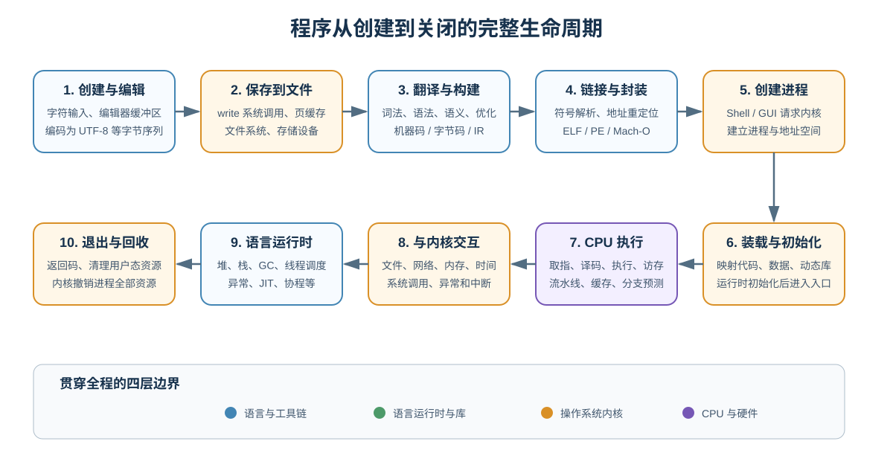
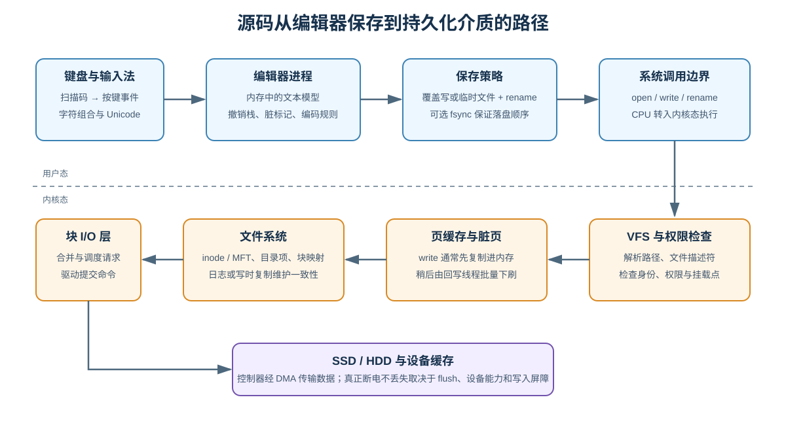
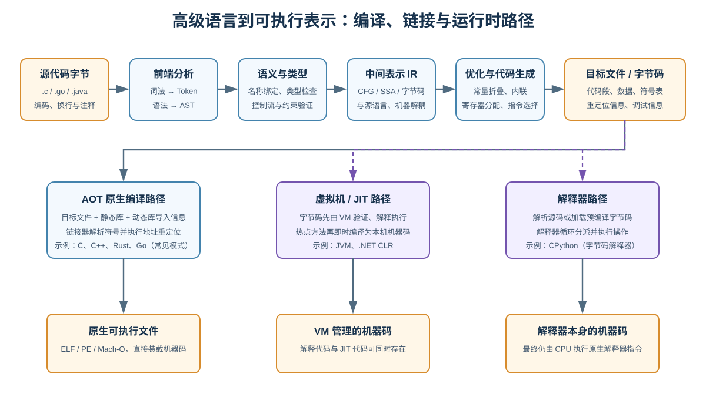
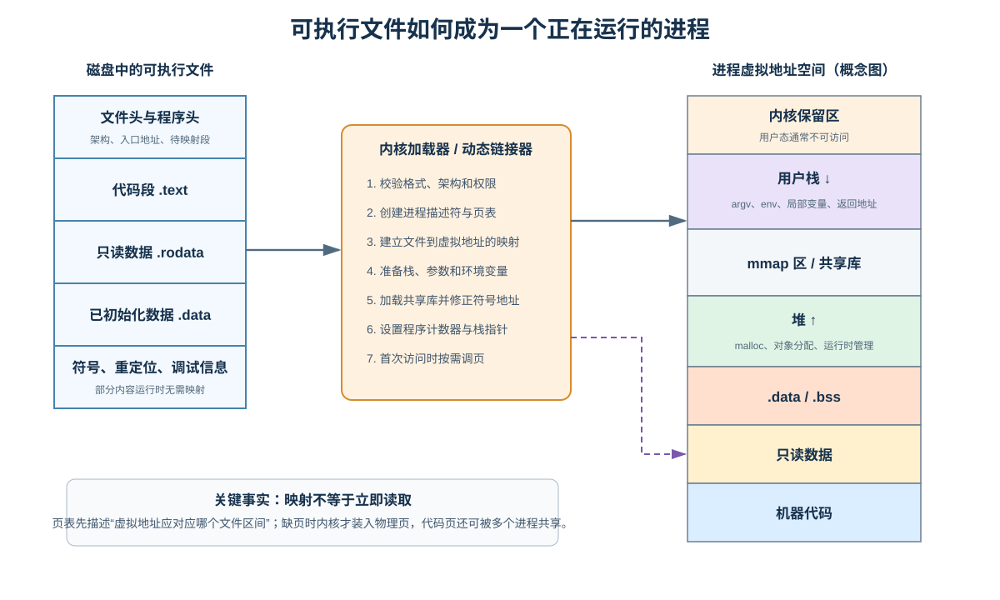
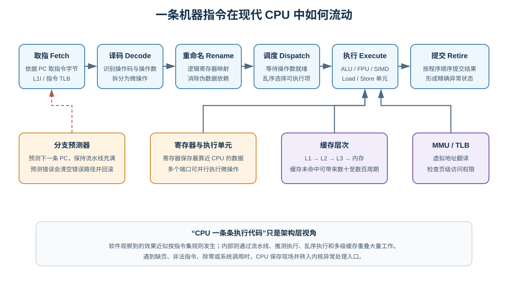
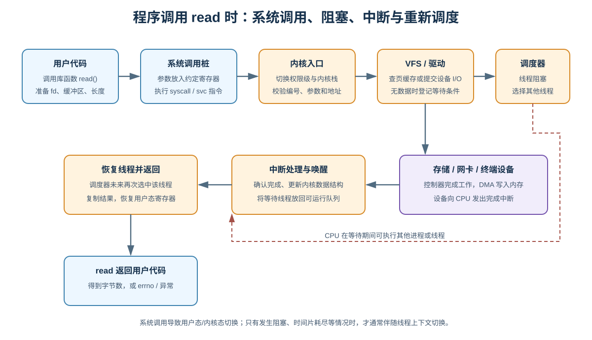
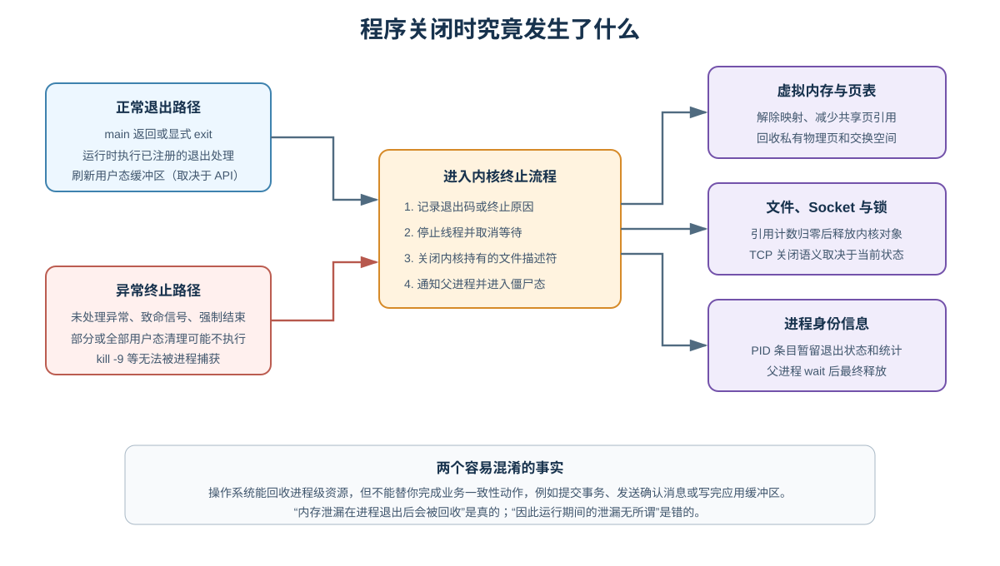

# 程序底层执行原理：从一行源码到进程退出

> 本文试图回答一个看似简单、实际横跨整个计算机系统的问题：我们创建一个源代码文件，按下保存和运行按钮之后，计算机究竟做了什么？
>
> 内容以现代 64 位计算机为背景，主要使用 C 程序说明原生编译路径，同时对比 Java/JVM 与 Python/CPython。Linux 中常见的 ELF、`fork`、`execve` 和 Windows 中常见的 PE、`CreateProcess` 实现细节并不完全相同，但背后的抽象——文件、进程、虚拟内存、指令、系统调用和资源回收——高度一致。

## 1. 先建立全局心智模型

“程序”这个词在不同阶段指代不同对象：

| 阶段 | 程序以什么形式存在 | 位于哪里 |
|---|---|---|
| 编辑中 | 编辑器维护的字符、语法树、撤销记录 | 编辑器进程的内存 |
| 已保存 | 按字符编码排列的字节 | 文件系统与存储设备 |
| 编译中 | Token、AST、中间表示、目标代码 | 编译器进程的内存与临时文件 |
| 已构建 | 可执行文件、字节码、动态库 | 文件系统 |
| 已启动 | 进程、线程、虚拟地址空间、内核对象 | 内存与内核数据结构 |
| 执行中 | CPU 指令、寄存器状态、缓存行 | CPU、缓存与内存 |
| 已退出 | 退出码、统计信息，短暂保留的进程记录 | 内核；随后被回收 |

因此：

- **源代码不是 CPU 能直接理解的东西**，它首先只是有特定编码的文件字节。
- **可执行文件不是进程**，前者是静态文件，后者是操作系统管理的一次运行实例。
- **虚拟地址不是物理内存地址**，CPU 和操作系统通过页表完成转换。
- **高级语言的一条语句通常不对应一条机器指令**，可能被优化掉、展开成多条指令，或变成运行时函数调用。
- **不同语言的中间路径不同，但最后一定有机器码在 CPU 上执行**。解释型语言只是由解释器的机器码读取并执行另一种表示。



可以把全过程划分为四层：

1. **语言与工具链层**：源代码、编译器、解释器、链接器、构建系统。
2. **语言运行时与库层**：标准库、堆分配器、垃圾回收器、虚拟机、协程调度器。
3. **操作系统层**：文件、进程、线程、虚拟内存、系统调用、设备驱动。
4. **硬件层**：CPU 指令集、寄存器、缓存、内存、SSD、网卡等。

定位问题时先判断它属于哪一层，往往比立即阅读业务代码更重要。

---

## 2. 创建源代码：从按键到编辑器内存

假设我们创建 `hello.c`：

```c
#include <stdio.h>

int main(void) {
    puts("Hello, world!");
    return 0;
}
```

### 2.1 键盘输入不是直接产生字符

按下一个按键大致经历：

1. 键盘控制器检测按键状态变化，产生硬件扫描码。
2. USB 或其他总线将事件传给主机控制器。
3. 设备通过中断通知 CPU，操作系统键盘驱动读取事件。
4. 窗口系统把按键事件发送给当前获得焦点的编辑器。
5. 输入法结合键盘布局、组合键和候选状态，将事件转换为 Unicode 字符。
6. 编辑器把字符插入自己的文本模型，并重新执行语法高亮、诊断等增量计算。

物理按键、按键事件和字符不是一回事。例如同一个按键受 Shift、Caps Lock、键盘布局和输入法影响，可以产生不同字符。

### 2.2 编辑器中的文件首先是内存对象

编辑器一般不会在每次按键后直接改磁盘。它可能使用连续数组、piece table、rope 或 gap buffer 等数据结构维护文本，并额外保存：

- 光标与选区；
- 撤销/重做历史；
- 文件编码与换行格式；
- “内容已修改但未保存”的脏标记；
- 语言服务器返回的符号、诊断和补全信息。

此时突然断电，未保存内容通常会消失。某些编辑器的自动恢复功能，本质上是周期性地把恢复副本写入另一个文件，并不是内存天然持久化。

### 2.3 字符最终要编码成字节

内存中的抽象字符在写文件前必须按某种编码转换为字节。UTF-8 中：

| 字符 | Unicode 码点 | UTF-8 字节 |
|---|---:|---|
| `A` | U+0041 | `41` |
| `中` | U+4E2D | `E4 B8 AD` |
| 换行 | U+000A | `0A` |

编码错误会发生在“字节如何解释为字符”这一边界。编译器实际读取的是字节，再按约定的源码编码解码。UTF-8 BOM、Windows 的 CRLF（`0D 0A`）与 Unix 的 LF（`0A`）也都是文件字节的一部分。

---

## 3. 保存源码：从用户态缓冲区到 SSD



### 3.1 保存按钮触发了什么

一种简化的保存过程是：

```text
文本模型
  → 按 UTF-8 编码
  → open 打开文件
  → write 写入字节
  → close 关闭文件描述符
```

为了避免覆盖到一半崩溃造成原文件损坏，成熟编辑器常采用更稳健的原子替换策略：

```text
写入同目录临时文件
  → 刷新临时文件
  → 保留权限等元数据
  → rename 原子替换目标文件
  → 必要时刷新父目录
```

实际策略会受到编辑器配置、文件系统和操作系统影响。原子 `rename` 保证观察者不会看到“半个文件”，但它不自动等价于断电后一定持久化。

### 3.2 `write` 返回不代表已经写进闪存

应用调用 `write` 时，CPU 从用户态切入内核态。内核通常先把数据复制或映射到**页缓存**，将相应页面标为脏页，然后就可以向应用返回成功。之后，内核回写线程再批量将脏页提交给文件系统和设备驱动。

这有三个重要后果：

1. 第二次读取文件很可能直接命中内存页缓存，比 SSD 更快。
2. `close` 通常不保证设备已经完成持久化。
3. 真正要求断电一致性时，需要正确使用 `fsync`/`fdatasync`、目录同步、写入屏障，并考虑设备自身缓存行为。

### 3.3 文件系统保存的不只是内容

文件系统还管理：

- 文件名到 inode（Linux 常见概念）或 MFT 记录（NTFS）的映射；
- 所有者、权限、时间戳和扩展属性；
- 文件逻辑偏移到物理块的映射；
- 空闲空间；
- 崩溃一致性日志或写时复制元数据。

文件名通常属于目录项，文件内容属于另一个对象。因此重命名往往只修改目录元数据，不需要搬运全部内容。

### 3.4 最终写入硬件

块 I/O 层合并和调度请求，驱动向存储控制器提交命令。控制器可通过 DMA 直接在设备与内存之间传输数据，CPU 不必逐字节搬运。完成后设备发送中断，内核更新请求状态并唤醒等待者。

对 SSD 而言，“写入某个文件偏移”还会经过闪存转换层：

- 逻辑块地址映射到实际 NAND 页；
- NAND 通常按页写、按块擦除；
- 控制器执行磨损均衡、垃圾回收和纠错；
- 因此文件系统看到的块地址并不等同于固定的物理闪存位置。

---

## 4. 从源码到可执行表示

保存的 `hello.c` 还只是文本。执行：

```bash
gcc -O2 -Wall -Wextra hello.c -o hello
```

会启动编译器驱动程序。驱动程序协调预处理器、编译器、汇编器和链接器；它本身也只是另一个正在运行的进程。



### 4.1 预处理：以 C 为例

C 预处理器处理：

- `#include`：把头文件内容纳入当前翻译单元；
- `#define`：宏替换；
- `#if`：条件编译；
- 删除注释并维护源码位置映射。

观察结果：

```bash
gcc -E hello.c -o hello.i
```

头文件通常只提供声明、宏和类型定义，不会因为 `#include <stdio.h>` 就把整个 C 标准库机器码复制进源码。

### 4.2 词法分析：字节流变成 Token

编译器前端将字符序列识别为 Token：

```text
int main(void) { return 0; }
```

可被识别为：

```text
关键字(int) 标识符(main) 左括号 关键字(void)
右括号 左花括号 关键字(return) 整数字面量(0) 分号 右花括号
```

空白和注释大多只用于分隔 Token 或保留源码位置信息。

### 4.3 语法分析：Token 变成 AST

解析器根据语言文法构建抽象语法树（AST）。它表达的是结构而不是排版。例如：

```c
result = a + b * 2;
```

树结构会体现乘法优先于加法：

```text
赋值
├── result
└── 加法
    ├── a
    └── 乘法
        ├── b
        └── 2
```

少括号、少分号等错误通常在这一阶段报告。

### 4.4 语义分析与类型检查

语法正确不代表程序有意义。编译器还要执行：

- 名称绑定：变量名到底指向哪个声明；
- 作用域检查：局部变量是否在可见范围内；
- 类型检查：操作数和返回值是否兼容；
- 重载解析、泛型实例化、访问控制；
- 构建控制流图并检查某些不可达路径。

“未声明变量”或“不能把字符串赋给整数”属于语义问题。

### 4.5 中间表示与优化

编译器通常不会直接从 AST 生成最终指令，而会转换为一种或多种 IR。常见 SSA（Static Single Assignment）形式要求每个变量版本只赋值一次，便于进行数据流分析。

典型优化包括：

- 常量折叠：`3 * 4` 在编译期变成 `12`；
- 死代码消除：删除永远不会产生可观察效果的代码；
- 公共子表达式消除：避免重复计算；
- 函数内联：用函数体替换调用；
- 循环展开与向量化；
- 逃逸分析：判断对象是否必须放到堆上；
- 寄存器分配：把高频数据放入有限的 CPU 寄存器。

优化必须保持语言规定的**可观察行为**，但调试时的语句顺序、变量位置可能与源码不再一一对应。

### 4.6 机器码生成与目标文件

后端针对具体指令集选择指令，例如 x86-64 或 AArch64，并生成目标文件：

```bash
gcc -c hello.c -o hello.o
```

目标文件通常包含：

- `.text`：机器代码；
- `.rodata`：字符串字面量等只读数据；
- `.data`：已初始化的全局或静态变量；
- `.bss`：未显式初始化、运行时应清零的数据，只需记录大小；
- 符号表：函数和全局对象的名字与属性；
- 重定位记录：尚不能确定的地址；
- 可选的调试信息。

### 4.7 链接：解决“名字最终在哪里”

`hello.o` 中调用了 `puts`，但它的实现不在当前目标文件。链接器负责：

1. 合并多个目标文件的节；
2. 解析符号定义与引用；
3. 为代码和数据规划地址；
4. 应用重定位；
5. 引入静态库内容，或记录动态库依赖；
6. 生成 ELF、PE 或 Mach-O 可执行文件。

**静态链接**把所需库代码复制进可执行文件，文件更大、部署更独立。  
**动态链接**在运行时映射共享库，多个进程可共享只读代码页，也便于单独升级库，但会引入版本和搜索路径问题。

常见错误可按阶段区分：

| 错误 | 典型阶段 |
|---|---|
| 缺少分号、括号不匹配 | 语法分析 |
| 类型不兼容、名称未声明 | 语义分析 |
| `undefined reference` / 未解析外部符号 | 链接 |
| 缺少 `.so` / `.dll` | 装载或动态链接 |
| 非法内存访问 | 运行期 |

---

## 5. 编译型、虚拟机型与解释型程序

“编译”和“解释”不是互斥的语言标签，而是实现策略。

### 5.1 AOT 原生编译

C、C++、Rust 和常见 Go 工具链主要提前生成目标平台机器码：

```text
源码 → IR → 机器码 → 原生可执行文件 → 操作系统装载
```

优势是启动路径直接、运行时不必逐条解释；代价是产物与 CPU 架构、操作系统 ABI 相关。

### 5.2 字节码与虚拟机

Java 常见路径：

```text
.java → javac → .class 字节码 → JVM 验证与解释 → 热点 JIT 编译 → 机器码
```

JVM 本身是原生程序。字节码具有平台无关性，JVM 负责把它映射到当前机器。JIT 可以利用真实运行数据做热点内联和推测优化，但也带来预热、代码缓存和去优化等机制。

### 5.3 解释器

以 CPython 为例：

```text
.py → 解析 AST → 编译为 Python 字节码 → CPython 解释循环分派执行
```

当字节码表达“两个对象相加”时，解释器需要检查对象类型并调用对应实现。最终执行的仍是 CPython 解释器及扩展模块的机器指令。

因此，“Python 不编译”并不准确；它通常会编译到字节码，只是不会像 C 那样直接产生独立的原生机器码程序。

---

## 6. 点击运行：谁请求操作系统创建进程

运行程序的入口可以是：

- Shell 输入 `./hello`；
- IDE 的运行/调试按钮；
- 桌面环境双击；
- Web 服务器启动工作进程；
- 容器运行时启动容器内进程；
- 操作系统服务管理器启动服务。

这些入口最终都要请求内核创建或替换进程映像。

### 6.1 Linux 的典型路径

Shell 常见行为是：

1. 解析命令行、变量、重定向和管道。
2. 通过 `fork`/`clone` 创建子进程，或使用 `posix_spawn`。
3. 子进程设置文件描述符、工作目录、用户身份等。
4. 调用 `execve(path, argv, envp)`，用新程序替换当前进程映像。
5. 父 Shell 调用 `wait` 等待前台任务，或把后台任务加入作业表。

`execve` 成功后不会返回原程序，因为原地址空间已经被新程序替换。PID 通常保持不变。

如果文件以 `#!` 开头，例如：

```python
#!/usr/bin/env python3
```

内核会按规则启动指定解释器，并把脚本路径作为参数传入。此时真正被直接装载执行的是 Python 解释器。

### 6.2 Windows 的典型路径

Windows 常通过 `CreateProcess` 一次完成创建进程对象、初始线程、地址空间和映像装载。PE 加载器处理 DLL、导入表和重定位。接口形态与 Linux 不同，但仍要解决：

- 找到并验证可执行文件；
- 创建内核进程与线程对象；
- 建立虚拟地址空间；
- 映射映像及动态库；
- 准备参数、环境与句柄；
- 让初始线程从启动入口运行。

### 6.3 权限与安全检查

内核不会无条件执行任意文件。它会考虑：

- 当前用户是否有执行或读取权限；
- 文件系统是否以 `noexec` 等选项挂载；
- 文件格式、目标架构是否支持；
- 代码签名、安全策略、应用控制；
- Linux capabilities、SELinux/AppArmor，或 Windows 访问令牌与完整性级别；
- 容器命名空间、seccomp 和 cgroup 限制。

---

## 7. 装载：文件如何变成虚拟地址空间



### 7.1 读取文件头

加载器先读取 ELF/PE/Mach-O 文件头，获得：

- 文件格式与位数；
- 目标 CPU 架构；
- 程序入口虚拟地址；
- 哪些文件区间要映射到哪些虚拟地址；
- 每个映射的读、写、执行权限；
- 动态链接器和依赖信息。

装载主要关注“段”（segment），链接和调试工具更多关注“节”（section）。二者有关联但不是完全相同的概念。

### 7.2 建立映射，不等于一次性读入全部文件

内核创建页表项，描述某段虚拟地址对应可执行文件的哪个区间。第一次真正访问某页时可能产生缺页异常，内核再：

1. 判断访问是否合法；
2. 在页缓存中查找该文件页；
3. 必要时从存储设备读取；
4. 分配或复用物理页；
5. 更新页表；
6. 恢复导致缺页的指令。

这称为**按需调页**。大型程序可以快速启动，因为从未触及的代码页不必加载。

### 7.3 典型虚拟地址空间

一个进程常包含：

- 代码区：通常可读、可执行，不可写；
- 只读数据区：字符串和常量；
- `.data` / `.bss`：全局、静态数据；
- 堆：动态分配对象，增长方式由分配器和系统决定；
- `mmap` 区：共享库、映射文件、大块匿名内存；
- 每线程栈：局部变量、返回地址、保存的寄存器；
- 内核保留区域。

具体地址和排列受操作系统、链接方式与 ASLR 影响，不能依赖示意图中的固定顺序。

### 7.4 页表、MMU 与 TLB

程序发出的地址是虚拟地址。CPU 的 MMU 根据当前进程页表转换为物理地址，并检查页权限。转换结果会缓存在 TLB 中：

```text
虚拟地址 = 虚拟页号 + 页内偏移
虚拟页号 --页表/TLB--> 物理页框号
物理地址 = 物理页框号 + 页内偏移
```

页表让每个进程看起来都拥有独立连续内存，并实现：

- 进程隔离；
- 只读、可写、可执行权限；
- 共享库代码页共享；
- 写时复制；
- 文件映射；
- 换页与按需分配。

### 7.5 动态链接与重定位

动态链接器映射所需共享库，解析导入符号，并把调用点关联到最终地址。为了支持 ASLR 和位置无关代码，实际装载基址可能每次不同。

有些符号采用懒绑定：第一次调用时才解析，减少启动工作；也可以启用立即绑定，提前暴露缺失符号并强化某些安全属性。

---

## 8. 从入口点到 `main`

可执行文件入口通常不是源码中的 `main`。内核把控制权交给启动代码后，启动流程大致为：

1. 读取内核放在初始栈上的 `argc`、`argv`、环境变量和辅助向量。
2. 完成动态链接器初始化。
3. 初始化线程局部存储、运行时和标准库。
4. 执行全局构造器、模块初始化或包初始化。
5. 调用用户的 `main`。
6. `main` 返回后，把返回值交给退出流程。

不同生态还会做更多工作：

| 运行时 | 进入用户代码前的典型工作 |
|---|---|
| C/C++ | C 运行库初始化、构造全局对象 |
| Go | 初始化 runtime、GC、调度器，创建主 goroutine |
| JVM | 初始化 JVM、堆、GC、类加载器，定位主类 |
| CPython | 初始化解释器、模块系统、内存管理器，编译/加载字节码 |

“Hello World 启动慢”可能不是那一行输出慢，而是运行时初始化、动态库装载、类加载或安全检查占据了主要时间。

---

## 9. 进程、线程与调度

### 9.1 进程是资源容器

操作系统为进程维护的典型信息包括：

- PID、父子关系和生命周期状态；
- 虚拟地址空间与页表；
- 打开的文件描述符或句柄；
- 凭据、权限、命名空间；
- 信号处理方式；
- 一个或多个线程；
- CPU 时间、内存等资源统计。

### 9.2 线程是 CPU 调度实体

线程通常拥有：

- 程序计数器；
- 通用寄存器和状态寄存器；
- 独立用户栈与内核栈；
- 线程局部存储；
- 调度状态和优先级。

同一进程的线程共享代码、全局数据、堆和打开的文件，因此通信便宜，也容易产生数据竞争。

### 9.3 上下文切换

当时间片用完、线程阻塞或更高优先级任务就绪时，调度器可能：

1. 保存当前线程的寄存器和执行位置；
2. 更新线程状态；
3. 选择另一个可运行线程；
4. 切换地址空间（如果跨进程）和内核栈；
5. 恢复目标线程寄存器；
6. 返回用户态继续执行。

上下文切换不仅有保存寄存器的直接成本，还可能扰动 CPU 缓存、TLB 和分支预测状态。

语言级协程不一定对应内核线程。Go goroutine、异步任务等可由用户态运行时调度到少量系统线程上。

---

## 10. CPU 如何执行机器指令



### 10.1 指令集是软硬件契约

x86-64、AArch64 等 ISA 规定：

- 指令编码；
- 寄存器集合；
- 数据类型和寻址方式；
- 异常与权限模型；
- 软件可观察到的执行语义。

编译器按 ISA 生成机器码，CPU 实现该 ISA。相同 x86-64 程序能在不同厂商 CPU 上运行，是因为它们遵守共同契约，而内部微架构可以不同。

### 10.2 经典的取指、译码、执行

从架构视角，一条指令经历：

1. **取指**：根据程序计数器 PC 取得指令字节。
2. **译码**：识别操作码、寄存器和立即数。
3. **取操作数**：从寄存器或内存获得数据。
4. **执行**：算术逻辑单元、浮点单元或访存单元工作。
5. **写回**：结果进入寄存器或内存。
6. **更新 PC**：继续下一条或跳转目标。

### 10.3 现代 CPU 实际更复杂

为了提高吞吐量，现代 CPU 使用：

- 多级流水线；
- 超标量并行发射；
- 分支预测和推测执行；
- 寄存器重命名；
- 乱序执行；
- 按程序顺序提交；
- L1/L2/L3 多级缓存；
- 硬件预取。

一条较早指令等待内存时，后面没有依赖的指令可以先执行。但 CPU 在提交阶段维持 ISA 要求的可观察结果，并在分支预测错误或异常时回滚错误路径。

### 10.4 性能经常受数据移动限制

粗略理解访问成本：

```text
寄存器 < L1 缓存 < L2 缓存 < L3 缓存 < 主内存 < SSD < 网络
```

具体延迟随硬件变化，不应死记固定数字。真正重要的是数量级差异。连续访问数组通常比随机追逐指针更利于缓存行和硬件预取。

---

## 11. 函数调用与栈帧

调用函数不只是“跳到另一段代码”。调用约定规定参数、返回值和寄存器如何传递。

概念上：

```text
调用者：
  准备参数
  保存约定要求保存的寄存器
  写入返回地址并跳转

被调用者：
  建立栈帧
  保存需要保存的寄存器
  为局部变量预留空间
  执行函数体
  恢复现场并返回
```

在 64 位平台上，前几个参数通常优先通过寄存器传递，更多参数或特定对象才放到栈上。返回值也常放在约定寄存器中。

典型栈帧可能包含：

- 返回地址；
- 旧帧指针；
- 保存的寄存器；
- 无法放入寄存器的局部变量；
- 临时值；
- 传给其他函数的栈参数。

但优化器可能内联函数、消除栈帧，或让局部变量始终留在寄存器中。所以“每次函数调用必定创建源码可见的完整栈帧”并不总成立。

栈溢出通常来自过深递归、过大的栈上对象或受限线程栈。某些语言运行时使用可增长栈或分段栈，但最终仍必须管理调用现场。

---

## 12. 变量和对象放在哪里

“局部变量在栈、对象在堆”只是入门近似，不是语言定律。

### 12.1 寄存器

活跃且适合的值会被编译器放进寄存器。源码变量甚至可能没有固定内存地址。

### 12.2 栈

栈分配通常只需移动栈指针，释放随函数返回自然发生，成本低且局部性好。但对象不能在其栈帧失效后继续被引用。

### 12.3 堆

生命周期跨越函数、大小动态或被共享的对象常在堆上。分配器通常从较大的内存区域切出对象，并按大小分类管理。申请堆对象不一定每次都直接触发系统调用。

### 12.4 静态存储区

全局变量、静态变量的存储期通常覆盖进程生命周期，放在 `.data`、`.bss` 或相关区域。

### 12.5 回收方式

| 方式 | 常见语言 | 特点 |
|---|---|---|
| 显式释放 | C | 可控，但易泄漏、重复释放、悬空引用 |
| RAII / 所有权 | C++ / Rust | 生命周期与作用域或所有权规则结合 |
| 垃圾回收 | Java / Go / C# | 自动识别不可达对象，有运行时成本 |
| 引用计数 + 循环 GC | CPython | 多数对象及时回收，循环引用另行处理 |

GC 只管理语言运行时知道的内存对象，文件、Socket、数据库事务等外部资源仍应显式关闭。

---

## 13. 程序如何访问文件、网络和屏幕

普通用户程序不能随意操作磁盘控制器、页表或网卡寄存器。它通过系统调用请求内核服务。

### 13.1 从库函数到系统调用

源码中的：

```c
puts("Hello, world!");
```

可能经历：

```text
puts
  → C 标准库管理 stdout 缓冲区
  → write 系统调用封装
  → 特权切换进入内核
  → 内核根据文件描述符找到终端或管道
  → 驱动/终端子系统处理字节
```

库函数不等于系统调用。库函数可以完全在用户态完成，也可以调用一个或多个系统调用。

### 13.2 系统调用的权限切换

系统调用桩通常：

1. 按 ABI 将系统调用号和参数放入寄存器；
2. 执行 `syscall`、`svc` 等特殊指令；
3. CPU 切换到更高权限级和内核入口；
4. 内核校验参数，尤其是用户指针；
5. 执行服务并返回结果；
6. CPU 恢复用户态。

系统调用边界是安全边界。内核不能信任用户传入的地址和长度，否则一个进程可能读取内核或其他进程内存。

### 13.3 系统调用不等于上下文切换

系统调用必然涉及用户态/内核态转换，但如果请求立即完成，可以返回同一线程，不必换成另一个线程。只有阻塞、抢占等情况下才发生调度意义上的上下文切换。



### 13.4 阻塞 I/O

如果 `read` 等待网络数据：

1. 内核登记该线程等待的 Socket 事件；
2. 把线程标记为睡眠；
3. 调度其他可运行线程；
4. 网卡收到数据，通过 DMA 放入内存并触发中断；
5. 协议栈处理数据并唤醒等待线程；
6. 线程重新获得 CPU 后，`read` 返回。

异步 I/O、`epoll`、IOCP、`io_uring` 等机制改变了等待和通知模型，但硬件完成、内核处理与用户态消费的基本层次仍存在。

---

## 14. 异常、中断和信号

这三个概念容易混淆：

| 机制 | 来源 | 是否与当前指令同步 | 示例 |
|---|---|---|---|
| 异常 | CPU 执行当前指令 | 通常同步 | 缺页、除零、非法指令 |
| 硬件中断 | 外部设备或定时器 | 异步 | 网卡收包、时钟中断 |
| 信号（Unix） | 内核抽象 | 对进程异步投递 | `SIGTERM`、`SIGSEGV` |

缺页不一定是错误。按需调页和写时复制都会故意利用缺页异常。内核能修复时，处理后重试原指令；非法地址无法修复时，才向进程报告访问违规或信号。

语言异常又是更高层机制。Java `throw`、Python `raise` 通常由语言运行时展开调用栈、寻找处理器，不等同于硬件异常；不过栈溢出、空指针陷阱等场景可能与操作系统异常机制结合。

---

## 15. 并发程序为何更复杂

多个线程共享内存时，源码中的一行操作未必是不可分割的。例如 `count++` 概念上包含读取、加一、写回。两个线程交错执行会丢失更新。

### 15.1 原子性、可见性与有序性

- **原子性**：操作是否不可被观察为中间状态。
- **可见性**：一个核心的写入何时被另一个核心看到。
- **有序性**：编译器和 CPU 是否允许重排操作。

锁、原子指令、内存屏障和语言内存模型共同建立 happens-before 关系。仅使用 `volatile` 在多数语言里不能自动解决所有复合并发问题。

### 15.2 缓存一致性不等于没有数据竞争

多核 CPU 的缓存一致性协议会让各核心最终对缓存行达成一致，但它不保证多个高级语言操作组成事务，也不替程序定义正确的同步顺序。

### 15.3 伪共享

两个线程修改逻辑上无关、物理上位于同一缓存行的数据，会导致缓存行在核心间频繁转移。程序没有锁竞争，仍可能因缓存一致性流量而变慢。

---

## 16. 程序如何退出

程序退出有多种路径：

- `main` 正常返回；
- 调用 `exit`；
- 未处理语言异常；
- 收到终止信号；
- 非法指令或不可恢复的内存错误；
- 被操作系统、管理员或资源限制强制结束；
- 机器断电或内核崩溃。



### 16.1 正常退出

以常见 C 运行时为例，`main` 返回大致等价于把返回值交给 `exit`。运行时可能：

1. 调用 `atexit` 注册的处理函数；
2. 执行语言规定的终结逻辑；
3. 刷新并关闭 C 标准 I/O 流；
4. 调用内核退出系统调用。

不同语言中 `finally`、`defer`、析构函数和 shutdown hook 的语义不同，不能笼统认为“退出时一定执行所有清理代码”。

### 16.2 强制终止

未处理崩溃或强制杀死可能绕过用户态清理。尤其 Unix `SIGKILL` 无法被捕获、屏蔽或处理。此时：

- 未刷新的应用缓冲区可能丢失；
- 数据库事务通常由连接断开机制回滚，但需依赖数据库保证；
- 业务级“发送完成消息”不会由操作系统代做；
- 临时文件和外部租约可能残留。

因此关键业务状态需要事务、幂等、日志和超时租约，而不能只依赖退出回调。

### 16.3 内核回收什么

不论正常还是异常终止，内核通常会：

- 停止进程内线程；
- 解除虚拟内存映射并回收私有页；
- 关闭文件描述符或句柄；
- 释放 Socket、管道和多数内核对象引用；
- 记录退出码和资源统计；
- 通知父进程。

Unix 中已退出进程可能短暂成为**僵尸进程**。僵尸不再执行，也没有原来的地址空间，只保留 PID、退出状态和统计信息，等待父进程 `wait` 回收。

### 16.4 退出码

退出码是程序与调用者之间的最小结果协议：

```bash
./hello
echo $?
```

通常 `0` 表示成功，非零表示某类失败，但具体含义由程序定义。Shell、CI、服务管理器会根据退出码判断后续行为。

---

## 17. 用一个小程序串起完整链路

考虑：

```c
#include <stdio.h>
#include <stdlib.h>

int main(int argc, char **argv) {
    const char *name = argc > 1 ? argv[1] : "world";
    char *buffer = malloc(128);
    if (buffer == NULL) {
        return 1;
    }

    int length = snprintf(buffer, 128, "Hello, %s!\n", name);
    if (length > 0) {
        fwrite(buffer, 1, (size_t)length, stdout);
    }

    free(buffer);
    return 0;
}
```

执行：

```bash
gcc -O2 demo.c -o demo
./demo Alice
```

完整链路可以概括为：

1. 编辑器把字符保存在自身内存中。
2. 保存时，字符编码为字节，经系统调用进入页缓存并最终写入存储设备。
3. Shell 启动 GCC；GCC 读取源码，完成分析、优化、汇编和链接。
4. 链接器生成包含入口、代码、数据和动态库依赖的可执行文件。
5. Shell 创建子进程并请求内核执行 `demo`，传入 `argv = {"./demo", "Alice"}`。
6. 内核校验文件，建立虚拟地址空间，映射程序和动态链接器。
7. 动态链接器映射 C 标准库并解析 `malloc`、`snprintf`、`fwrite`、`free` 等符号。
8. 启动代码初始化运行库，然后调用 `main`。
9. `argv` 位于初始进程栈关联的数据中，`name` 指向参数字符串。
10. `malloc` 从用户态分配器获得 128 字节；必要时分配器通过 `brk`/`mmap` 等向内核申请更多虚拟内存。
11. `snprintf` 在用户缓冲区格式化字节；这一步通常不需要系统调用。
12. `fwrite` 先处理 C 库缓冲，最终通过 `write` 将字节交给终端、管道或重定向文件。
13. `free` 把内存归还分配器；分配器不一定立即归还操作系统。
14. `main` 返回 0，运行时刷新输出并进入内核退出流程。
15. 内核释放进程资源，把退出状态交给等待的 Shell。

这也解释了为什么同一程序：

```bash
./demo Alice
./demo Alice > output.txt
./demo Alice | another_program
```

无需修改源码就能把输出送到终端、普通文件或管道。Shell 在程序启动前改变了标准输出文件描述符指向的内核对象，程序仍只看到 `stdout`。

---

## 18. 如何亲自观察底层过程

下面的命令应在隔离测试环境中执行；工具名称和参数随平台、版本变化。

### 18.1 查看文件与字节

```bash
# 查看文件类型、架构和动态链接信息
file ./demo

# 十六进制查看源码或二进制
xxd demo.c | head

# 查看文件元数据
stat demo.c
```

Windows 可使用 PowerShell：

```powershell
Format-Hex .\demo.c
Get-Item .\demo.c | Format-List *
```

### 18.2 查看编译中间结果

```bash
gcc -E demo.c -o demo.i       # 预处理结果
gcc -S -O2 demo.c -o demo.s   # 汇编文本
gcc -c -O2 demo.c -o demo.o   # 目标文件
```

### 18.3 查看可执行文件

```bash
readelf -h -l -S ./demo       # ELF 头、段和节
readelf -d ./demo             # 动态链接信息
nm -C ./demo                  # 符号
objdump -d -Mintel ./demo     # 反汇编
ldd ./demo                    # 运行时共享库依赖
```

对不可信二进制不要随意执行 `ldd`；优先使用只解析文件的工具或在隔离环境分析。Windows 可使用 Visual Studio 工具链中的 `dumpbin /headers`、`dumpbin /imports`。

### 18.4 查看系统调用与进程

```bash
strace -f -o trace.log ./demo Alice
ps -ef
cat /proc/<PID>/maps
cat /proc/<PID>/status
lsof -p <PID>
```

`strace` 会改变时序，不能直接拿其运行耗时代表生产性能。Windows 可用 Process Explorer、Process Monitor、WinDbg 或 ETW 观察对应信息。

### 18.5 查看调度与硬件性能

```bash
perf stat ./demo Alice
perf record -g ./demo Alice
perf report
```

可关注：

- 指令数与 CPU 周期；
- IPC；
- 分支与分支预测失败；
- 缓存引用与缓存未命中；
- 缺页；
- 上下文切换。

性能数据必须在接近真实负载的环境中重复测量，单次结果很容易受到缓存预热、频率调节和后台任务影响。

---

## 19. 常见误区

### 误区 1：保存成功就是已经写入 SSD

保存通常先成功写入内核页缓存。要求抗断电持久化时，需要更强的同步和一致性协议。

### 误区 2：可执行文件被完整复制进内存后才开始运行

现代系统通常通过内存映射和按需调页，只在访问时装入需要的页。

### 误区 3：解释型语言不经过编译，CPU 能理解源码

解释器可能先把源码编译成字节码；CPU 执行的是解释器或 JIT 生成的机器码。

### 误区 4：一个源码语句对应一条 CPU 指令

优化可删除、合并、重排或展开操作。机器指令与源码通常是多对多关系。

### 误区 5：系统调用一定产生线程上下文切换

它一定产生权限级转换，但请求立即完成时，不一定切换到其他线程。

### 误区 6：局部变量必定在栈上

变量可能位于寄存器、栈、堆，甚至被优化掉。具体由语言语义和编译器决定。

### 误区 7：释放内存就一定立即归还操作系统

`free` 或 GC 常先归还给用户态分配器，供进程后续复用。是否退还内核取决于分配器和内存区域。

### 误区 8：进程退出会自动完成所有清理

内核会回收进程资源，但不能保证应用缓冲区、业务事务和远程状态完成收尾。

---

## 20. 从底层视角排查问题

遇到问题时可以按生命周期提问：

### 源码与保存阶段

- 文件实际编码和换行符是什么？
- 编辑器保存的是目标文件还是临时副本？
- 权限、剩余磁盘空间、挂载模式是否允许写入？
- 数据只进入页缓存，还是已满足持久化要求？

### 构建阶段

- 错误发生在预处理、语法、类型、代码生成还是链接？
- 编译目标架构、ABI 和运行环境是否一致？
- 优化级别、宏、依赖版本是否可复现？
- 动态库依赖和符号版本是否正确？

### 启动阶段

- 谁启动程序，传入了什么参数、环境变量、工作目录和权限？
- 可执行格式与 CPU 架构是否兼容？
- 动态库搜索路径和加载策略是什么？
- 启动慢是 I/O、缺页、运行时初始化还是安全检查造成？

### 运行阶段

- 问题属于 CPU、内存、磁盘、网络还是锁等待？
- 是用户态热点、系统调用过多，还是频繁上下文切换？
- 是否存在页错误、缓存未命中、GC 暂停或分配压力？
- 多线程代码是否建立了明确的同步关系？

### 退出阶段

- 是正常返回、未处理异常、信号还是强制终止？
- 退出码和日志是否保留了根因？
- 哪些清理依赖用户态代码，哪些由内核保证？
- 父进程是否正确等待子进程，是否产生僵尸进程？

---

## 21. 总结

一份程序从诞生到消失，穿过的是一条连续链路：

```text
按键事件
  → 编辑器内存中的字符
  → 编码后的文件字节
  → 页缓存、文件系统与存储设备
  → Token、AST、IR、机器码或字节码
  → 可执行文件与动态库
  → 进程、线程和虚拟地址空间
  → CPU 指令、寄存器、缓存和内存
  → 系统调用、驱动、中断与外部设备
  → 退出状态与操作系统资源回收
```

高级语言、编译器、运行时和操作系统共同把硬件复杂性封装成开发者可使用的抽象。真正理解程序执行，不是抛弃这些抽象，而是知道每层抽象解决了什么问题、边界在哪里，以及出现性能、正确性和安全问题时如何向下一层验证。
