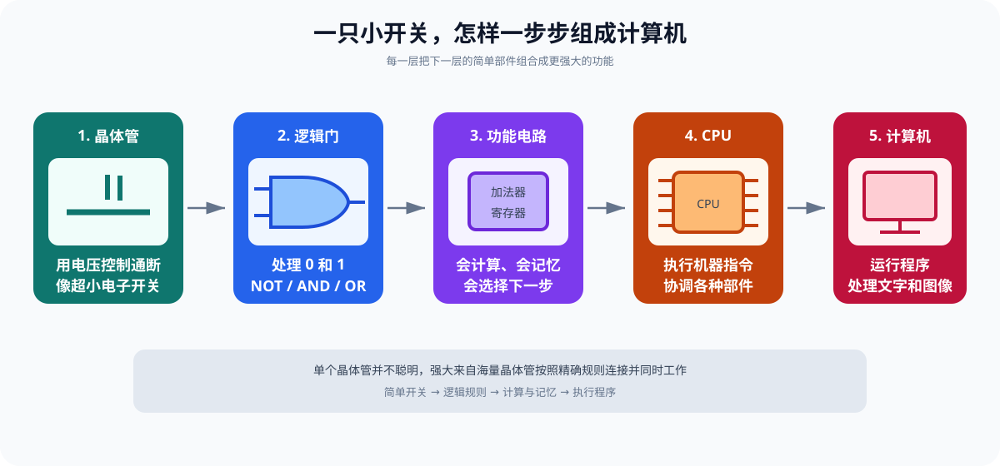
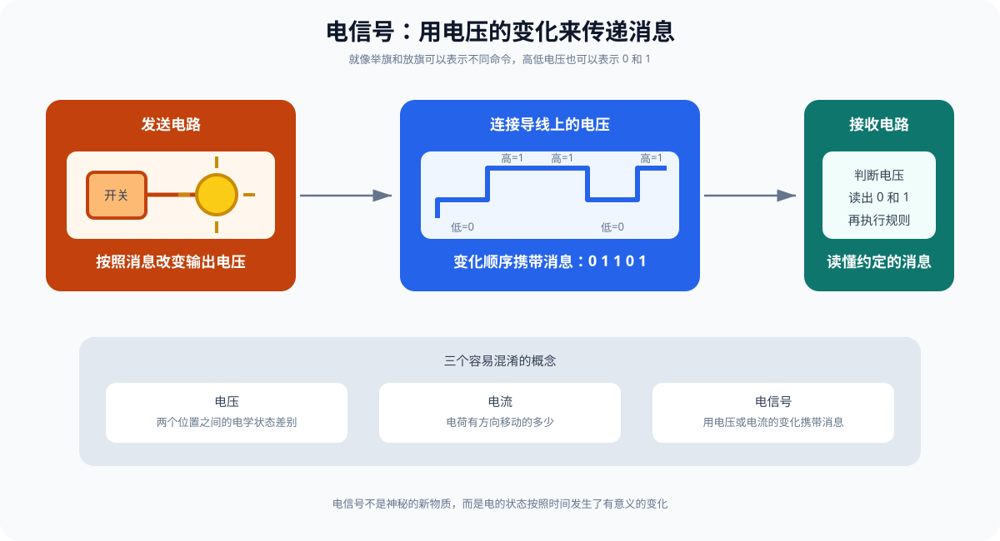
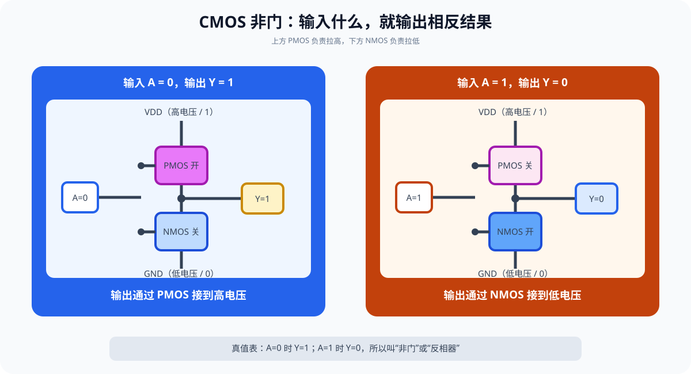
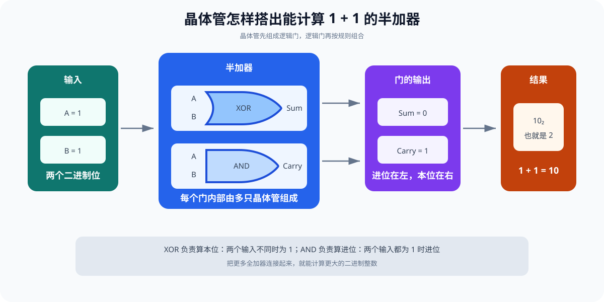
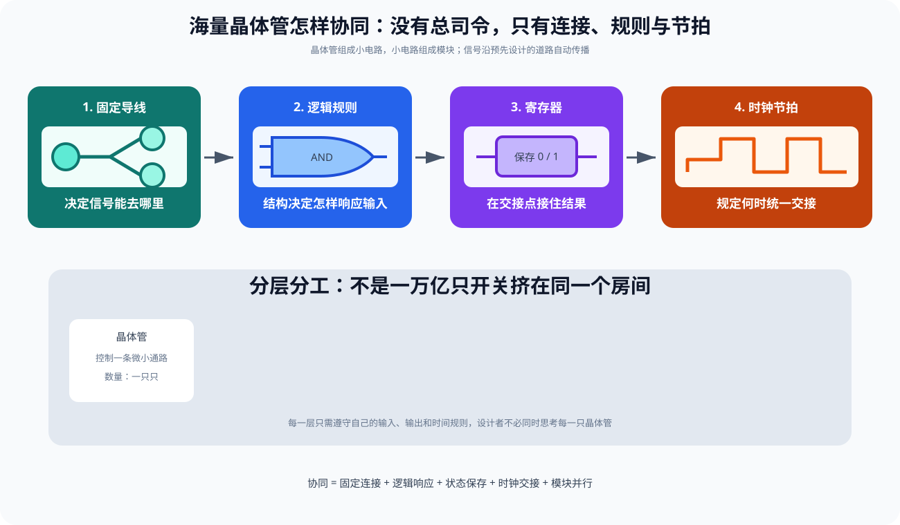
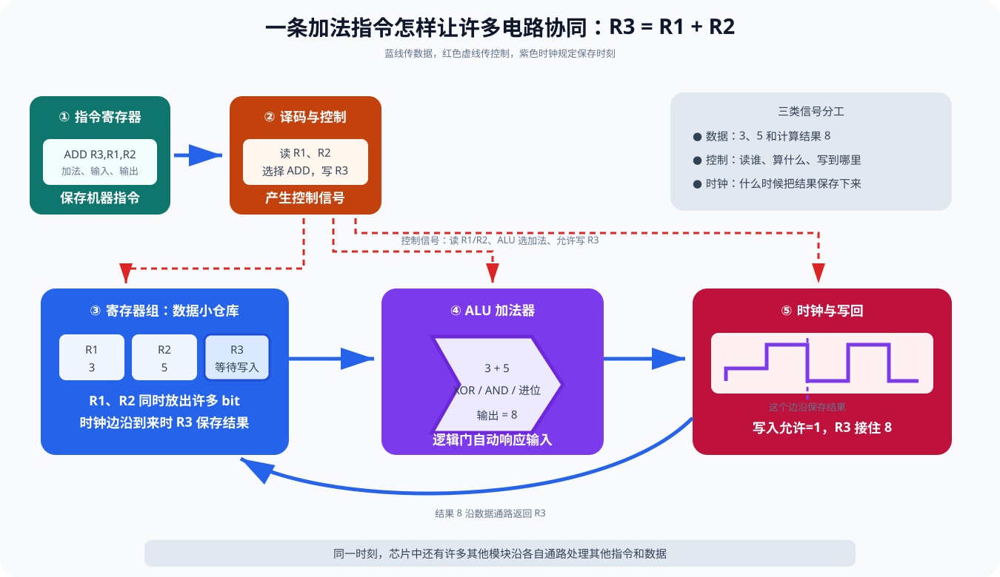
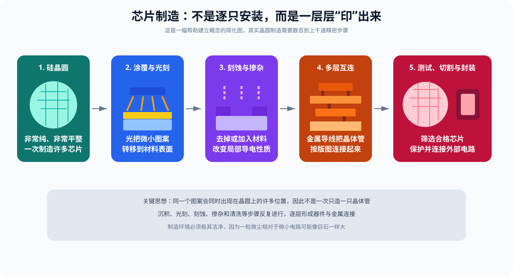

# 晶体管：小学生也能看懂的计算机“小开关”

你有没有想过：

- 手机为什么会播放动画？
- 计算器为什么一按就能算出答案？
- 电脑里面没有人在拨算盘，它是怎样计算的？
- 一块指甲大小的芯片，为什么能做那么多事情？

答案要从一种非常小的电子零件讲起，它叫作 **晶体管**。

> 晶体管就像一个用电的变化来控制的超小开关。  
> 一个晶体管能做的事情很简单，几十亿个晶体管一起工作，就能组成 CPU、内存和整台计算机。

这里的“用电的变化”有一个正式名字，叫 **电信号**。例如：

```text
导线上的电压较低
→ 过了一会儿，电压变高
→ 电路把这次变化当成一条消息
```

就像人可以用“灯灭、灯亮”传递两种消息，计算机可以用“低电压、高电压”传递 `0` 和 `1`。电信号不是一种新的神秘物质，而是**会随时间变化、可以携带消息的电压或电流**。



本文分成三段旅程：

```text
第一站：先认识开关、电流和 0、1
第二站：看看晶体管怎样开门和关门
第三站：把许多晶体管组合成计算机
```

阅读时不需要背公式。只要一直记住一个问题：

> 现在是谁在控制谁？

---

## 第零课、先认识“电”和“电信号”

晶体管是一种电子零件。如果完全不知道电、电子和信号是什么，直接读“栅极电压控制沟道”就像还没学认字便开始读小说。

所以，我们先用最简单的话认识几个基础概念。

### 0.1 物体里面有非常小的粒子

桌子、水、空气和我们的身体都是由原子组成的。原子内部还有更小的部分，其中一种叫 **电子**。

在金属导线中，有些电子比较容易移动。电池接入完整电路后，会让这些电荷开始有方向地移动。

暂时可以这样记：

```text
原子：组成物体的微小单位
电子：原子中的一种微小粒子
电荷：粒子带有的一种电学性质
```

“电荷”有正、负两类。电子带负电荷。这里不需要研究它们为什么存在，只需知道：**电荷的分布和移动会产生各种电现象。**

### 0.2 “电”不是一种装在电线里的液体

日常说的“电”，可能指好几件不同的事：

- 电荷；
- 电荷的移动；
- 电压造成的推动趋势；
- 电场；
- 电能。

所以“电”是一个方便的总称，不是一种像水一样装在电线里、从电池一路流完的液体。

### 0.3 电流是什么

**电流**表示电荷有规律地移动了多少。可以先把它想象成水管中的水流量：

```text
单位时间流过的水越多 → 水流越大
单位时间通过的电荷越多 → 电流越大
```

这只是类比。电荷和水的运动规律并不完全相同。

### 0.4 电压是什么

**电压**表示两个位置之间推动电荷移动的“差别”。它有点像：

- 水塔高处与低处的高度差；
- 滑梯顶端与底端的高度差；
- 绷紧的弹簧与放松弹簧之间的状态差。

有差别，才有推动变化的可能。电压的单位叫伏特，写作 `V`。一节常见干电池会标出大约 `1.5 V`。

### 0.5 信号是什么

**信号**就是按照约定携带消息的变化。

例如在操场上约定：

```text
老师举红旗 → 开始跑
老师放下红旗 → 停下来
```

红旗本身不是“开始”和“停止”，但大家提前约好了它的含义，所以旗子的状态成了信号。

声音、灯光和手势都可以成为信号：

| 载体 | 两种变化 | 可以表示的消息 |
| --- | --- | --- |
| 手电筒 | 灭、亮 | 否、是 |
| 铃铛 | 不响、响 | 等待、出发 |
| 手臂 | 放下、举起 | 0、1 |
| 导线 | 低电压、高电压 | 0、1 |

### 0.6 电信号到底是什么

**电信号就是用电压或电流的变化携带消息。**

在简单数字电路中，可以约定：

```text
低电压 → 表示 0
高电压 → 表示 1
```

假设一根导线上的电压按下面顺序变化：

```text
低 → 高 → 高 → 低
```

电路便可以把它读成：

```text
0 → 1 → 1 → 0
```

这和用手电筒“灭、亮、亮、灭”传消息是同一个思路，只不过芯片中的电压变化极快，而且由电子电路自动产生和读取。



### 0.7 信号是谁发出的，又是谁读懂的

在芯片中，一个电路的输出通常连接到另一个电路的输入：

```text
前一个电路改变输出电压
→ 电压变化沿连接线到达后一个电路
→ 后一个电路判断这是 0 还是 1
→ 后一个电路再决定自己的输出
```

没有一个小人在芯片里看数字。电路的物理结构决定了它怎样响应高低电压。

### 0.8 电能和电信号不是同一回事

- **电能**让设备能够工作，像汽车需要能量行驶；
- **电信号**携带消息，像交通灯告诉汽车停或走。

同一套电路既需要能量，也要传递信号，但这两个概念不能混为一谈。

> **第零课只记一句话：**电信号就是用电压或电流的变化来传递消息。

---

## 一、先从电灯开关说起

家里的电灯开关通常有两种状态：

```text
开关断开 → 电路不通 → 灯不亮
开关闭合 → 电路接通 → 灯亮
```

我们可以给这两种状态起一个简单名字：

```text
关 → 0
开 → 1
```

这就是 **二进制** 最基本的想法。二进制是一种只使用 `0` 和 `1` 记数和表达信息的方法。`0` 和 `1` 不一定只表示数量，它们也可以表示：

- 灯灭和灯亮；
- 门关和门开；
- 否和是；
- 低电压和高电压；
- 晶体管截止和导通。

### 1.1 计算机为什么喜欢两个状态

假设老师让你听铃声做动作：

- 没响：坐下；
- 响了：站起。

这很容易判断。

如果规定 100 种不同音量分别代表 100 个动作，教室里稍微有一点噪声，大家就可能听错。

电路也一样。真实电压会受到温度、噪声和制造误差影响。这里的 **噪声** 是不想要的电压小变化，就像打电话时混进来的杂音。只区分“较低”和“较高”两个范围，更容易做对：

```text
较低电压 → 当作 0
较高电压 → 当作 1
中间电压 → 不希望长时间停留的模糊区域
```

所以，计算机使用二进制不是因为它只能数到 1，而是因为两个状态**简单、稳定、容易分辨**。

> **记住一句话：**计算机用 0 和 1，是为了让电路可靠地分清两种状态。

### 1.2 0 并不一定表示“完全没电”

在数字电路里，`0` 和 `1` 是电压范围的名字，并不一定分别等于精确的 `0 V` 和某个固定电压。

不同芯片使用的电压标准可能不同。某个电路会把一段低电压看成 `0`，把一段高电压看成 `1`。只要电信号落在规定范围内，稍微抖动一点也不会被认错。

---

## 二、电流、电压和电路是什么

理解晶体管之前，先认识三个词。

### 2.1 电流：电荷的有方向移动

可以暂时把电流想象成水管里的水流：

- 水在水管中流动，像电荷在导体中移动。**导体**就是比较容易让电荷移动的材料，例如铜；
- 水流大小，像电流大小；
- 水管断开，水不能继续流；
- 电路断开，电流也不能形成完整通路。

但这只是帮助入门的类比。电子不是水，电路也不是真的水管。

### 2.2 电压：推动电荷的“差”

可以把电压暂时想象成水塔两端的高度差。高度差越明显，水越有流动的趋势。

更准确地说，电压是两个位置在电学状态上的差别，正式名称是 **电势差**。就像问“这里有多高”时，需要说明相对于地面还是海平面；测量电压也要选择一个参考点。

### 2.3 电路：完整的工作路径

最简单的电灯电路包括：

```text
电源 → 导线 → 开关 → 灯泡 → 回到电源
```

电源提供能量，导线连接路径，开关控制通断，灯泡把电能转换成光和热。**电路**就是让电荷和能量能够按照设计工作的完整连接。


### 2.4 水龙头类比有什么用，又有什么限制

水龙头很像晶体管：

- 手柄控制水能不能流；
- 晶体管的控制端控制电流能不能通过；
- 用很小的控制动作，可以控制更大的水流或电流。

但要注意：

- 晶体管里没有真的小门；
- 电子不是一颗颗水珠沿同样路线冲过去；
- 晶体管的开关不是绝对完美，会有电阻、漏电和切换时间；**电阻**表示电流通过时受到阻碍的程度，**漏电**表示关闭时仍有极少电流通过；
- 现代芯片主要利用电场改变半导体的导电能力。**电场**可以先理解成电荷在周围形成的、能够影响其他电荷的无形作用范围。

类比是学习用的地图，不是物体本身。

---

## 三、晶体管到底是什么

“晶体管”的英文是 `transistor`。它是一种用 **半导体** 材料制造、能够控制电信号的电子零件。半导体是一类导电能力可以被人们精细控制的材料，常见代表是硅。

晶体管有很多种。现代 CPU 和内存芯片中最常见的一大类叫：

```text
MOSFET
```

全称是“金属—氧化物—半导体场效应晶体管”。名字很长，不必急着背。先抓住“场效应”：

> 它利用控制端产生的电场，决定另一条通路容易导电还是不容易导电。  
> **导电**就是允许电荷比较容易地移动并形成电流。

### 3.1 MOSFET 的三个重要端子

为了入门，可以先认识三个端子：

| 中文 | 英文 | 符号 | 作用 |
| --- | --- | --- | --- |
| 栅极 | Gate | G | 控制端，像水龙头手柄 |
| 源极 | Source | S | 通路的一端 |
| 漏极 | Drain | D | 通路的另一端 |

实际 MOSFET 还有体端（Bulk/Body），很多简化图会暂时不画。

最关键的关系是：

```text
栅极 G 控制源极 S 和漏极 D 之间是否容易导电
```

### 3.2 栅极为什么不用直接碰到通路

栅极与下面的半导体之间隔着很薄的 **绝缘层**，也就是很难让电流直接通过的材料层。栅极电压产生电场，电场改变半导体中可以移动的电荷数量，从而形成或消除一条导电 **沟道**。沟道不是真正挖出的水沟，而是电荷比较容易移动的一小片区域。

就像你不必伸手到水管里面，而是在外面转动手柄来控制水流。不过，晶体管真正依靠的是电场，不是机械转动。

### 3.3 NMOS：高电压打开的开关

先看常见的增强型 NMOS。简化理解：

```text
栅极为低电压 → 沟道没有形成 → 源漏之间不容易导通
栅极足够高     → 形成沟道     → 源漏之间可以导通
```

不是“只要有一点电压就立刻打开”。栅极与源极之间的电压需要达到一定条件，这个重要界限叫 **阈值电压**。“阈值”就是从“不满足”变成“满足”所需跨过的界限，像身高达到游乐设施规定线后才可以乘坐。

### 3.4 PMOS：控制规律大致相反

PMOS 与 NMOS 可以互相配合。用数字逻辑的简化说法：

```text
PMOS 栅极较低 → 容易导通
PMOS 栅极较高 → 不容易导通
```

因此：

- NMOS 擅长在输入高时接通下方路径；
- PMOS 擅长在输入低时接通上方路径。

把它们互补组合，就得到了现代数字芯片常用的 CMOS 电路。`CMOS` 可以先理解为“让 NMOS 和 PMOS 配成一队的电路做法”，不用背它的完整英文名。


> **记住一句话：**晶体管不是自己决定开关，而是由控制端的电压决定导电状态。

---

## 四、半导体为什么既不像导线，也不像塑料

### 4.1 三类材料

可以按导电能力粗略分成：

| 类型 | 特点 | 例子 |
| --- | --- | --- |
| 导体 | 电荷比较容易移动 | 铜、铝 |
| 绝缘体 | 电荷很难移动 | 玻璃、橡胶 |
| 半导体 | 导电能力可以被精细控制 | 硅 |

硅本来不等于一个好开关。工程师需要通过极其精密的制造过程，改变局部材料特性并做出微小结构。

### 4.2 掺杂是什么

向纯硅中加入极少量特定原子，叫作 **掺杂**。它能改变材料中可参与导电的电荷数量。物理学把能够移动并帮助形成电流的粒子或“空位”统称为 **载流子**，意思就是“运载电流的成员”。

可以把纯硅想象成座位刚刚排好的教室。加入极少量不同“同学”后，可能多出容易移动的电子，也可能出现像“空座位”一样能传递移动效果的空穴。

- 以电子作为多数载流子的区域，称为 N 型；
- 以空穴作为多数载流子的区域，称为 P 型。

“空穴”不是一颗真的正粒子挖出的洞，而是一种描述电子缺位及其移动效果的方便方法。

### 4.3 电场怎样形成沟道

以 NMOS 为例，栅极电压改变下面半导体表面的电荷分布，也就是改变电荷在各处“聚集得多还是少”。当条件足够时，源极和漏极之间形成可导电的沟道。

这个过程非常快，因为没有机械门需要移动，主要是电场和电荷分布在变化。

### 4.4 晶体管不是完美开关

入门时常说晶体管只有“开”和“关”，但真实情况更像：

```text
关：电流很小，但通常不是绝对为零
过渡：部分导通
开：电流容易通过，但仍有电阻
```

数字电路会把连续变化设计成两个稳定的逻辑范围，因此上层可以放心地把它看成 `0` 和 `1`。

---

## 五、两个晶体管怎样组成“不是门”

**逻辑**就是按照明确规则进行判断。**逻辑门**则是按照固定规则处理 `0` 和 `1` 的小电路。它不是房间的门，而是数字信息要经过的一道“判断关卡”。

最简单、最重要的逻辑门之一是 NOT 门，也叫非门或反相器。

它的规则是：

```text
输入 0 → 输出 1
输入 1 → 输出 0
```

下面这种列出所有输入和对应输出的表格叫 **真值表**。它像逻辑门的“规则说明书”：

| 输入 A | 输出 Y |
| ---: | ---: |
| 0 | 1 |
| 1 | 0 |

### 5.1 CMOS 反相器

一个基本 CMOS 反相器由一只 PMOS 和一只 NMOS 配合：

```text
电源 VDD
  │
PMOS
  ├── 输出 Y
NMOS
  │
地 GND
```

两只晶体管的栅极连在一起，作为输入 A。

**输入为 0 时**

```text
PMOS 导通，NMOS 截止
输出被连接到高电压
所以输出是 1
```

**输入为 1 时**

```text
PMOS 截止，NMOS 导通
输出被连接到低电压
所以输出是 0
```



### 5.2 为什么要一上一下两只晶体管

它们像一支合作队：

- 上面的 PMOS 负责把输出拉高；
- 下面的 NMOS 负责把输出拉低；
- 稳定状态下，理想情况不会同时形成从电源直通地的大电流路径。

这就是 `CMOS` 中“互补”的含义：两类晶体管互相配合。

### 5.3 切换时为什么会耗电

输出导线和晶体管结构具有电容效应。输出从 `0` 变成 `1` 时需要充电，从 `1` 变成 `0` 时需要放电。

切换的瞬间，两只晶体管还可能短暂地同时部分导通。因此晶体管翻转越频繁，通常动态 **功耗** 越大，芯片也越容易发热。功耗表示设备每一秒消耗能量的快慢。

一个常见的粗略关系是：

```text
动态功耗 ≈ 活动率 × 电容 × 电压² × 频率
```

这里的 **频率** 表示一秒钟发生多少次，**电容** 可以暂时理解为电路某个位置储存少量电荷的能力。小学生阶段不需要计算这个式子，只需记住：

> 开关切换需要搬动电荷；切换越多、越快，通常越耗电、越发热。

---

## 六、逻辑门怎样做判断

除了 NOT 门，还有几种基本逻辑门。

### 6.1 AND 门：两个条件都满足

AND 的意思是“并且”：

```text
只有 A 和 B 都是 1，输出才是 1
```

| A | B | A AND B |
| ---: | ---: | ---: |
| 0 | 0 | 0 |
| 0 | 1 | 0 |
| 1 | 0 | 0 |
| 1 | 1 | 1 |

生活例子：

```text
有门票 AND 到了开放时间 → 可以进入
```

### 6.2 OR 门：至少一个条件满足

```text
A 或 B 只要有一个是 1，输出就是 1
```

| A | B | A OR B |
| ---: | ---: | ---: |
| 0 | 0 | 0 |
| 0 | 1 | 1 |
| 1 | 0 | 1 |
| 1 | 1 | 1 |

### 6.3 XOR 门：两个输入不一样

```text
A 和 B 不同时，输出为 1
```

| A | B | A XOR B |
| ---: | ---: | ---: |
| 0 | 0 | 0 |
| 0 | 1 | 1 |
| 1 | 0 | 1 |
| 1 | 1 | 0 |

XOR 对二进制加法很重要。

### 6.4 NAND 门：一种“万能积木”

NAND 是 AND 后再取反：

```text
A 和 B 都为 1 时输出 0，其他情况输出 1
```

只使用 NAND 门，就可以搭出 NOT、AND、OR 等所有布尔逻辑。因此 NAND 常被称为通用逻辑门。

真实 CMOS 逻辑门会用多只 NMOS 和 PMOS 串联或并联。串联很像“所有开关都接通才形成通路”，并联很像“任意一条支路接通即可形成通路”。

---

## 七、逻辑门怎样计算 `1 + 1`

十进制中：

```text
1 + 1 = 2
```

二进制没有单个数字 `2`，所以写成：

```text
1 + 1 = 10
```

右边的 `0` 是本位结果，左边的 `1` 是进位。

### 7.1 半加器

一个半加器接收 A、B 两个 bit，输出：

- `Sum`：本位的和；
- `Carry`：向高位的进位。

刚好可以用两个门：

```text
Sum   = A XOR B
Carry = A AND B
```

当 `A=1，B=1`：

```text
XOR 输出 0
AND 输出 1
组合起来就是二进制 10
```

### 7.2 从一位加法到很多位加法

真正的加法器还要接收低一位传来的进位，这叫全加器。把许多全加器连接起来，就可以计算 8 位、32 位或 64 位整数。



CPU 的加法器比这复杂得多，会想办法让进位更快传播。但最根本的规则仍来自 AND、OR、XOR 等逻辑。

> **记住一句话：**CPU 不是“理解了数学”，而是电路按照提前设计好的逻辑规则改变输出。

---

## 八、晶体管怎样记住一个 0 或 1

计算不仅需要得到答案，还要保存答案。

### 8.1 反馈：让结果回到输入

把逻辑门的输出以合适方式接回输入，可以形成两个稳定状态：

```text
状态 0 可以维持自己
状态 1 也可以维持自己
```

外部信号可以把它设成 `0` 或 `1`，之后电路在持续供电时保持该状态。这类电路可组成锁存器和触发器。

### 8.2 一个 bit 的记忆

能保持一个二进制状态，就能记住 `1 bit`。`bit` 读作“比特”，中文叫“位”，它是一个只能为 `0` 或 `1` 的小格子。

```text
8 bit       = 1 Byte（字节）
1024 Byte   ≈ 1 KB（按常见近似说法）
许多字节    = 文字、图片、程序和其他数据
```

严格来说，`1 KiB = 1024 Byte`，而国际单位制中的 `1 kB = 1000 Byte`。日常产品和软件有时会混用这两种表示。

### 8.3 寄存器、SRAM 和 DRAM 不完全一样

- CPU **寄存器** 是 CPU 手边保存少量数据的超快小格子；SRAM 常用多个晶体管形成稳定电路，速度快但占面积；
- DRAM 是电脑通常所说的“运行内存”，常用一个晶体管和一个小电容保存状态，能装更多数据，但电荷会慢慢漏掉，需要反复补充，这叫刷新；
- SSD 是保存文件的固态硬盘，它使用另一类晶体管结构保存电荷，断电后仍能保留数据。

所以不能简单地说“所有存储都是相同的晶体管开关”。它们使用晶体管的方式不同。

### 8.4 为什么内存断电会忘记

寄存器、SRAM 和 DRAM 都依赖持续供电维持状态。断电后，反馈停止或电荷消失，数据就丢失。

SSD 的闪存会把电荷困在特殊绝缘结构中，断电后仍可保留较长时间，因此属于非易失性存储。

---

## 九、晶体管怎样变成 CPU

一个晶体管只能做很简单的控制。把晶体管逐层组合，能力会不断增长：

```text
晶体管
  ↓
NOT、AND、OR、XOR 等逻辑门
  ↓
加法器、比较器、多路选择器
  ↓
寄存器、计数器、控制器
  ↓
算术逻辑单元 ALU
  ↓
CPU 核心
  ↓
完整计算机
```

### 9.1 ALU：负责算术和逻辑

`ALU` 的中文名是 **算术逻辑单元**，可以把它看成 CPU 中负责“算一算、比一比”的小工厂。它可以完成：

- 加法和减法；
- AND、OR、XOR 等位运算；
- 比较两个数；
- 左移和右移；
- 根据控制信号选择某一种操作。

### 9.2 控制器：告诉部件下一步做什么

**机器指令**是直接告诉 CPU 做什么的命令，例如“把两个数相加”或“读取一个数据”。机器指令也被编码成 `0` 和 `1`。控制器读出指令，产生许多控制信号：

```text
从哪个寄存器读取？
ALU 做加法还是比较？
是否读取内存？
结果写回哪里？
下一条指令在哪里？
```

### 9.3 时钟：让大家按节拍交接

芯片里的 **时钟** 不是显示几点钟的钟，而是持续发出规律电信号的节拍器：

```text
这一个阶段计算
→ 时钟边沿到来
→ 寄存器接住结果
→ 下一阶段继续
```

它并不直接“命令每只晶体管翻转”，而是帮助同步大量时序电路的状态更新。

### 9.4 一次加法的简化过程

程序要求计算 `3 + 5` 时，可能经历：

1. 指令和数字已经编码成二进制；
2. CPU 从缓存或内存取得指令；**缓存**是放在 CPU 附近、用来暂存常用内容的高速小仓库；
3. 控制器认出这是一条加法指令；
4. 操作数进入加法电路；
5. 晶体管组成的逻辑门改变电信号；
6. 加法器输出二进制 `1000`；
7. 时钟边沿到来，寄存器保存结果；
8. CPU 继续执行下一条指令。

实际高性能 CPU 会同时处理许多指令，还会使用流水线、缓存、分支预测和乱序执行，但最底层仍是物理电路在变化。

### 9.5 最关键的问题：这么多晶体管由谁统一指挥

答案可能和你想的不一样：

> 没有一个“晶体管总司令”逐个喊话，也没有一张写着所有晶体管名字的值班表。

几十亿、几百亿，甚至大型系统中合计数万亿只晶体管，主要依靠下面三件事协同：

1. **固定连接**：制造芯片时，金属导线已经决定谁的输出连接到谁的输入；
2. **信号传播**：前一个电路的输出一变化，后一个电路便会按照物理规律自动响应；
3. **时钟交接**：到了规定节拍，寄存器把已经算好的结果保存下来，交给下一阶段。

可以把它想成一座自动化很高的城市：

- 道路早已铺好，决定车辆能够去哪里；
- 红绿灯按规则变化，不需要市长逐盏拨动；
- 工厂收到原料便自动加工；
- 每个车间只负责自己的小任务；
- 货物沿道路进入下一个车间；
- 全城许多地方同时工作。

不过，芯片比城市更严格。它的“道路”是金属导线，“货物”是电信号，“车间”是各种逻辑电路。

### 9.6 第一种协同：导线决定信号去哪里

假设逻辑门 A 的输出用导线连接到逻辑门 B 和 C 的输入：

```text
逻辑门 A ──┬──→ 逻辑门 B
           └──→ 逻辑门 C
```

当 A 的输出从低电压变成高电压：

1. 连接线上的电压开始变化；
2. 变化传播到 B 和 C；
3. B、C 内部的晶体管受到输入电压影响；
4. B、C 根据各自结构产生新的输出。

没有软件临时决定“这一次去 B，下一次去 C”。大部分连接在芯片制造出来时便固定了。

若需要在多条道路中选择一条，芯片会使用一种叫 **多路选择器** 的电路。它像铁路道岔，根据控制信号选择让哪一路数据通过：

```text
选择信号 = 0 → 让数据 A 通过
选择信号 = 1 → 让数据 B 通过
```

多路选择器自己也由晶体管组成。

### 9.7 第二种协同：电路结构就是工作规则

一只 AND 门不需要先读取一本《AND 工作手册》。它内部晶体管的连接方式已经决定：

```text
输入都是高电压 → 输出高电压
其他情况       → 输出低电压
```

就像滑梯的形状决定小球会向下滚，逻辑门的结构决定它收到输入后会产生什么输出。

所以“晶体管知道该做什么”这句话并不准确。晶体管没有思想：

- 输入电压改变电场；
- 电场改变导电情况；
- 电流给某些位置充电或放电；
- 输出电压随之改变；
- 下一级电路继续响应。

整个过程由物理规律和预先设计的连接共同决定。

### 9.8 第三种协同：组合电路负责算，寄存器负责等

芯片中可以先分出两类重要角色。

**组合电路：收到输入就开始计算**

例如加法器、比较器和多路选择器。输入变化后，电信号经过一层层逻辑门，输出也跟着变化。信号走完这些门需要一点时间。

**寄存器：在时钟边沿保存结果**

寄存器像接力赛中的交接区。它不会把中间还在变化的结果随时交出去，而是在约定的时钟边沿把最终稳定的结果接住。

```text
寄存器 A
  ↓ 放出旧数据
组合电路开始计算
  ↓ 结果逐渐稳定
时钟边沿到来
  ↓
寄存器 B 保存新结果
```

这样，一个很长的工作就能被切成许多短阶段。每个阶段只需在下一个时钟边沿前完成自己的计算。



### 9.9 时钟不是命令，而是统一的交接时刻

时钟信号会在低、高电压之间规律变化：

```text
低 → 高 → 低 → 高 → 低……
```

从低变高或从高变低的瞬间叫 **时钟边沿**。许多寄存器被设计为在特定边沿保存输入。

这像学校统一的下课铃：

- 铃声不会告诉每名学生具体写哪道题；
- 每个教室早已有自己的课程和老师；
- 铃声只让大家在同一时刻结束这一节并进入下一节。

同样：

- 数据内容决定电路算什么；
- 控制信号决定选择哪种操作；
- 时钟主要规定什么时候接住结果。

而且，并非所有晶体管都直接连接时钟。时钟主要进入寄存器等需要保存状态的电路。加法器中的大量组合逻辑会在输入变化后自然传播，不需要每经过一个逻辑门就等一次时钟。

### 9.10 时钟怎样送到芯片各处

如果芯片左边先听到“铃声”，右边很久以后才听到，交接就可能出错。因此芯片会设计专门的 **时钟网络**：

- 主干像树干一样分叉；
- 分支尽量均衡地到达不同区域；
- 中途加入缓冲电路增强信号；
- 设计人员努力缩小各处到达时间的差异。

时钟到达不同位置仍不可能绝对同时。这个细小差异叫 **时钟偏斜**。设计芯片时会给它预留安全时间。

类似的还有电源网络。大量晶体管工作需要稳定供电，因此芯片中有粗细不同、层层分布的电源线，就像城市中的输电网。

### 9.11 控制器究竟怎样“发命令”

控制器不是坐在控制室里的人，它本身也是逻辑门和寄存器组成的电路。

假设机器指令中有几位表示操作：

```text
0001 → 加法
0010 → 减法
0011 → 比较
```

译码电路看到 `0001` 后，会自动形成一组控制信号，例如：

```text
读取寄存器 R1 = 1
读取寄存器 R2 = 1
ALU 选择加法     = 1
写回寄存器 R3    = 1
访问内存         = 0
```

这些 `0` 和 `1` 沿着专用导线到达各部件：

- 寄存器组根据编号放出正确的数据；
- 多路选择器打开正确通路；
- ALU 选择加法电路的结果；
- 写入允许信号决定哪个寄存器在时钟边沿保存结果。

所谓“控制”，其实仍然是电压变化驱动晶体管。控制信号和普通数据在物理上都是电信号，区别只在用途：

- **数据信号**表示要处理的内容，例如数字 `3`；
- **控制信号**表示怎样处理，例如“选择加法”；
- **时钟信号**规定何时保存结果。

### 9.12 用 `R3 = R1 + R2` 看完整协同过程

假设：

```text
R1 中保存 3
R2 中保存 5
指令要求把 R1 + R2 写入 R3
```

一次简化执行可以分成以下步骤。

**第 1 步：取出指令**

程序计数器保存下一条指令的位置。指令存储电路根据这个地址放出机器指令。

**第 2 步：译码**

译码器识别出：

```text
操作 = 加法
输入 = R1、R2
输出 = R3
```

**第 3 步：产生控制信号**

控制电路打开 R1、R2 的读取通路，让 ALU 选择加法，并准备稍后写入 R3。

**第 4 步：数据沿导线流动**

R1 的二进制位和 R2 的二进制位同时沿多根导线进入加法器。64 位 CPU 可以有许多根线并排传送 64 个 bit，并不是一位传完才传下一位。

**第 5 步：加法器自动响应**

电信号经过 XOR、AND 等门。低位产生的进位会影响更高位。经过短暂传播后，输出稳定为 `8` 的二进制表示。

**第 6 步：等待时钟交接**

在结果尚未稳定的短暂时间里，R3 不应保存它。设计者保证加法器能在规定时间内完成。

**第 7 步：时钟边沿到来**

写入允许信号已经打开 R3。时钟边沿到来时，R3 中的存储电路一起接住结果。

**第 8 步：进入下一阶段**

R3 现在保存 `8`。其他流水线阶段和其他执行单元也可能在同一时间完成各自的交接。



### 9.13 不是所有晶体管每一刻都在做同一件事

“几万亿只晶体管协同工作”不等于它们同时翻转，也不等于它们组成一个巨大加法器。

它们被分成许多区域：

```text
一部分组成 CPU 核心
一部分组成 GPU 计算单元
一部分组成缓存
一部分组成内存控制器
一部分组成输入输出接口
一部分负责时钟、电源和通信
```

在某一时刻：

- 有些晶体管正在切换；
- 有些正在保持一个 bit；
- 有些所在模块暂时没有任务；
- 有些被关闭时钟或电源来节省能量。

暂停某个区域的时钟，使它不再无意义地翻转，叫 **时钟门控**。进一步切断闲置区域的供电，叫 **电源门控**。

### 9.14 并行：许多小团队同时做不同工作

海量晶体管的价值之一是能组成大量并行电路。

**位级并行**

一个 64 位加法器同时处理许多位。

**指令级并行**

一条指令正在执行时，下一条可以译码，再下一条可以取出，这叫流水线。

**多执行单元**

整数加法、浮点运算、访存和向量运算可以由不同单元同时进行。

**多核心**

多个 CPU 核心同时运行不同线程。

**GPU 大规模并行**

大量相似计算单元同时处理许多像素或数字。

所以速度来自“很多团队同时工作”，而不是让一只晶体管以不可思议的速度包办全部任务。

### 9.15 模块之间怎样交流

相邻小电路通过导线直接连接。更大的模块之间常通过 **总线** 或 **片上网络** 传递消息。

- 总线像多条车辆共用的一组道路；
- 片上网络像缩小版城市路网，有路由节点和不同通道；
- 请求中会包含“要读哪里”“要写什么”“由谁发出”等信息；
- 接收方完成后再返回数据或完成信号。

例如 CPU 核心读取缓存：

```text
核心发出地址
→ 缓存检查有没有该数据
→ 有：返回数据
→ 没有：继续向下一级缓存或内存请求
```

这些交流仍由状态机、缓冲区、仲裁器和导线完成。**状态机**是“根据当前状态和输入决定下一状态”的电路；**仲裁器**是在多个请求同时到来时决定谁先通过的电路。

### 9.16 谁设计这么多晶体管的连接

工程师不会手工绘制每一只晶体管。

设计通常也分层进行：

```text
晶体管与标准单元
  ↓
加法器、寄存器等小模块
  ↓
ALU、缓存、处理器核心等大模块
  ↓
完整芯片
```

工程师会使用硬件描述语言描述电路规则，再由电子设计自动化工具完成许多工作：

- 把规则转换成逻辑门；
- 选择具体电路单元；
- 决定摆放位置；
- 连接金属导线；
- 检查信号能否按时到达；
- 检查功耗、供电和制造规则；
- 通过模拟和形式验证寻找错误。

因此，协同不仅来自芯片运行时的时钟和信号，也来自设计阶段严格建立并检查的层次和接口。

### 9.17 “几万亿只”该怎样准确理解

单颗普通 CPU 不一定真的拥有几万亿只晶体管。不同芯片差异很大：

- 一颗芯片可能有几十亿到数百亿只晶体管；
- 大型 GPU、AI 加速器或多芯粒封装可能更多；
- 一台服务器或数据中心把许多芯片相加，数量可以达到万亿级甚至更高。

数量无论是几十亿还是几万亿，协同原则都没有改变：

```text
分层组成模块
＋ 固定导线连接
＋ 控制信号选择
＋ 组合电路计算
＋ 寄存器保存状态
＋ 时钟协调交接
＋ 大量模块并行运行
```

> **这一章只记一句话：**晶体管不是听从一个总司令逐个行动，而是被连接成许多分工明确的自动电路，在数据、控制信号和时钟的共同作用下并行工作。

---

## 十、为什么几十亿个晶体管能放进小芯片

### 10.1 芯片不是人工焊出来的

芯片制造不是工人拿镊子逐个放置晶体管，而是在一整片非常纯的 **硅晶圆** 上，通过许多轮精密工艺同时制造大量微小结构。硅晶圆是一片经过特别处理、表面非常平整的圆形硅片，像制造芯片的“大地基”。

简化流程：

```text
制备硅晶圆
→ 覆盖材料
→ 涂光刻胶
→ 用光刻图形曝光
→ 显影和刻蚀
→ 掺杂或沉积新材料
→ 重复许多层
→ 制作金属互连
→ 测试、切割、封装
```



### 10.2 光刻像“把图案印到硅片上”

可以把光刻想成非常精密的印刷：

1. 设计人员先画出电路版图；
2. 制造设备通过光学系统把图案转移到晶圆；
3. 后续工艺只处理图案指定的区域；
4. 一层一层叠加出晶体管和连接导线。

真实光刻远比普通印刷复杂，需要极高精度的光源、掩模、镜头、化学材料和位置控制。

### 10.3 晶体管必须用金属导线连接

做出晶体管还不够，必须把它们按设计连接起来。芯片上方会堆叠多层金属互连：

- 较低层连接附近晶体管；
- 较高层传送电源、时钟和较远信号；
- 层与层之间用很小的通孔连接。

在现代芯片中，怎样布线和供电与怎样制造晶体管同样重要。

### 10.4 “几纳米”不等于某个部位正好几纳米

芯片制程中的“5 nm”“3 nm”等名称是工艺代际的综合称呼，不能简单理解成“每只晶体管的长度恰好就是 3 nm”。

晶体管缩小通常可以放入更多电路，但也带来：

- 漏电增加；
- 散热困难；
- 制造波动更难控制；
- 量子效应更明显；
- 研发和设备成本迅速上升。

### 10.5 晶体管形状也在进化

为了继续控制更小的沟道，晶体管结构从平面 MOSFET 发展到：

- FinFET：栅极包住鳍状沟道的多个侧面；
- GAAFET：栅极更完整地环绕纳米片或纳米线沟道。

可以把它理解为：开关越来越小以后，控制把手需要从更多方向“抱住”通道，才能更牢地控制开和关。

---

## 十一、晶体管为什么能切换得这么快

### 11.1 没有机械部件来回移动

普通墙壁开关需要手和机械触点移动。晶体管主要依靠电场和微小电荷变化，没有宏观机械部件，所以能快速切换。

### 11.2 距离非常短

芯片内部许多连接只有微小尺度。信号不必跑过长电线，也不用等待齿轮或磁头移动。

### 11.3 大量电路并行工作

不是一只晶体管独自完成几十亿件事，而是海量晶体管同时工作：

- 一部分取指令；
- 一部分做加法；
- 一部分访问缓存；
- 一部分预测接下来执行哪里；
- 不同 CPU 核心处理不同任务。

### 11.4 快仍然需要时间

电信号传播、晶体管充放电和逻辑门响应都需要时间。如果一个时钟周期内要经过的逻辑太多，结果来不及稳定，下一组寄存器就可能接到错误值。

芯片设计者需要保证：

```text
组合逻辑最长延迟 + 安全余量 < 一个时钟周期
```

这也是 CPU 频率不能无限提高的原因之一。

---

## 十二、晶体管为什么会发热

### 12.1 充电和放电消耗能量

芯片内的导线和晶体管节点具有电容。每次从 `0` 切到 `1` 都要充电，从 `1` 切到 `0` 又要放电，能量最终大多变成热。

### 12.2 切换瞬间的电流

CMOS 门切换时，上下晶体管可能短暂同时部分导通，形成瞬时电流。

### 12.3 关掉也会漏一点

真实晶体管在“关”状态仍可能有微小漏电。单只晶体管漏得很少，几十亿只加起来就不可忽视。

### 12.4 为什么手机会降频

芯片温度过高时，系统可能降低频率和电压，以减少功耗和发热，这叫热节流或降频。否则可能影响稳定性、寿命，甚至损坏器件。

散热器、风扇、导热材料和手机外壳都在帮助热量离开芯片。

---

## 十三、晶体管只在电脑里吗

当然不是。晶体管几乎遍布现代电子设备：

- 手机、平板、游戏机；
- 电视、路由器和音箱；
- 汽车控制系统；
- 洗衣机和空调；
- 医疗设备；
- 卫星和机器人；
- 充电器和电源管理芯片。

晶体管也不只作为数字开关使用。在收音机、麦克风和音响中，它还可以放大连续变化的模拟信号。

### 13.1 开关与放大

晶体管有两个常见角色：

**开关**

工作在数字电路中，重点区分“开”和“关”。

**放大器**

小的输入变化控制较大的输出变化，用于声音、无线通信和传感器等模拟电路。

同一种器件可以因电路连接和工作区域不同而承担不同任务。

---

## 生词卡片：忘记时回来看

不需要一次背完这张表。遇到不熟悉的词时，再回来查找即可。

| 词语 | 小学生版解释 |
| --- | --- |
| 原子 | 组成普通物体的微小单位 |
| 电子 | 原子中的一种微小粒子，带负电荷 |
| 电荷 | 粒子具有的一种电学性质，有正、负两类 |
| 电流 | 电荷有方向移动的多少 |
| 电压 | 两个位置之间推动电荷变化的电学差别 |
| 电信号 | 用电压或电流的变化携带的消息 |
| 电场 | 电荷在周围形成的、能够影响其他电荷的作用范围 |
| 导体 | 比较容易让电荷移动的材料，如铜 |
| 绝缘体 | 很难让电荷移动的材料，如玻璃和橡胶 |
| 半导体 | 导电能力可以被精细控制的材料，如硅 |
| 导通 | 通路变得比较容易让电流通过 |
| 截止 | 通路很难让电流通过，相当于接近关闭 |
| 沟道 | 晶体管内让电荷比较容易移动的区域，不是真的水沟 |
| 阈值 | 从不满足条件变成满足条件需要跨过的界限 |
| 二进制 | 只用 `0` 和 `1` 表达数字与信息的方法 |
| bit / 位 | 一个只能保存 `0` 或 `1` 的小格子 |
| Byte / 字节 | 通常由 8 个 bit 组成的一组数据 |
| 逻辑 | 按照明确规则作出判断 |
| 逻辑门 | 按固定规则处理 `0` 和 `1` 的小电路 |
| 组合电路 | 输入一变化便开始计算、不负责长期记忆结果的电路 |
| 多路选择器 | 根据控制信号，从多条数据道路中选择一条的电路 |
| 数据信号 | 表示要处理的内容，例如数字 `3` |
| 控制信号 | 表示怎样处理数据，例如“选择加法” |
| 频率 | 一件事每秒发生多少次 |
| 功耗 | 设备消耗能量的快慢 |
| 寄存器 | CPU 手边保存少量数据的超快小格子 |
| 缓存 | 暂存常用内容、减少等待的高速小仓库 |
| 指令 | 告诉 CPU 下一步做什么的命令 |
| 时钟 | 为芯片电路提供规律节拍的电信号，不是显示时间的钟 |
| 时钟边沿 | 时钟信号从低变高或从高变低的交接瞬间 |
| 流水线 | 把任务分阶段，让多项任务在不同阶段同时进行 |
| 总线 | 多个模块共用的一组数据传输线路 |
| 片上网络 | 芯片内部连接多个大模块的通信网络 |
| 状态机 | 根据当前状态和输入，决定下一状态的电路 |
| 仲裁器 | 多个请求同时到达时，决定谁先通过的电路 |
| 芯片 | 在一小片半导体上制造并连接大量微型电路的器件 |
| CPU | 执行程序指令、计算并协调其他部件的核心芯片 |

---

## 十四、容易误解的地方

### 14.1 “晶体管里面有一扇小门”

没有。门和水龙头只是类比。MOSFET 使用栅极电场控制半导体沟道。

### 14.2 “0 就是完全没有电，1 就是有电”

不准确。`0` 和 `1` 是逻辑状态，通常对应不同电压范围；具体范围由电路标准决定。

### 14.3 “电子从电源以光速冲到灯泡”

不准确。导体中的电子漂移速度通常并不快。电磁场和能量变化沿电路传播得很快，使各处电子开始响应。

### 14.4 “晶体管开着就完全没有阻力”

不准确。导通的晶体管仍有电阻和压降；关闭时也可能存在漏电。

### 14.5 “CPU 有 100 亿个晶体管，所以一次能算 100 亿次”

不准确。不同晶体管分别用于缓存、控制、运算、预测、连接等结构。完成一次操作通常需要许多晶体管共同工作。

### 14.6 “晶体管越小，CPU 一定越快”

不一定。实际性能还受电路设计、缓存、功耗、散热、指令并行度、内存速度和软件影响。

### 14.7 “CPU 只由逻辑门组成，不需要记忆”

不准确。CPU 内有大量寄存器、缓存和状态电路。计算和记忆必须配合。

### 14.8 “晶体管只会表示 0 和 1”

作为物理器件，晶体管的电流和电压可以连续变化。数字电路特意把它设计和使用为稳定的逻辑状态。

---

## 十五、动手想一想

### 15.1 人肉扮演 NOT 门

规则：

```text
同学举左手表示输入 1，不举表示输入 0。
你必须做相反动作作为输出。
```

试一试四次，观察你是否一直遵守：

```text
输入 0 → 输出 1
输入 1 → 输出 0
```

### 15.2 用两个开关理解 AND

把两个普通开关串联控制一盏低压实验灯：

```text
两个开关都闭合，灯才亮。
```

这很像 AND。实际动手只能使用安全的电池低压实验套件，并由老师或家长指导，绝不能拆接家庭市电。

### 15.3 用岔路理解 OR

两条并联支路各有一个开关。任意一条支路接通，都能形成路径，这很像 OR。

### 15.4 二进制手指游戏

规定四根手指从右到左分别代表：

```text
1、2、4、8
```

手指伸出记作 `1`，收起记作 `0`：

```text
0101 = 4 + 1 = 5
1010 = 8 + 2 = 10
1111 = 8 + 4 + 2 + 1 = 15
```

这能帮助理解：同样的开关状态组合，可以代表不同数字。

---

## 十六、知识小测验

先自己回答，再看后面的答案。

1. 计算机为什么喜欢用两个逻辑状态？
2. MOSFET 的哪个端子主要负责控制？
3. NMOS 的栅极电压足够高时，源漏之间通常更容易导通还是更难导通？
4. NOT 门输入 `1` 时输出什么？
5. AND 门在什么情况下输出 `1`？
6. 二进制 `1 + 1` 为什么写成 `10`？
7. 为什么 CMOS 电路切换越频繁通常越耗电？
8. 内存为什么通常会在断电后丢失？
9. CPU 为什么不能只靠一只特别厉害的晶体管？
10. “晶体管就是一扇微小机械门”对吗？

### 参考答案

1. 两种状态容易区分，抗噪声能力强，电路更可靠。
2. 栅极 Gate。
3. 更容易导通。
4. `0`。
5. 所有输入都为 `1` 时。
6. 本位结果是 `0`，并向高位进 `1`。
7. 电路节点需要反复充放电，切换瞬间也会产生电流。
8. 常见内存依赖供电维持电路状态或电荷。
9. 复杂计算需要大量开关同时组成逻辑、存储和控制电路。
10. 不对。机械门只是类比，MOSFET 用电场控制半导体沟道。

---

## 十七、全文总结

现在把整篇文章压缩成一条路线：

```text
电压可以表示 0 和 1
  ↓
栅极电压控制晶体管导通或截止
  ↓
NMOS 和 PMOS 组成 CMOS 逻辑门
  ↓
逻辑门组成加法器、选择器和记忆电路
  ↓
这些部件组成 ALU、寄存器和控制器
  ↓
它们共同组成 CPU、内存和完整计算机
```

最重要的三个结论：

1. **晶体管是可控制电信号的半导体器件。**
2. **数字电路把它主要当成高速电子开关使用。**
3. **计算机的强大不是因为单个开关聪明，而是因为海量开关按照精确规则连接并一起工作。**

最后再记住一句话：

> 软件中的每一次点击、每一个数字和每一幅画面，走到计算机最底层，都是许多晶体管在极短时间内共同改变电信号。
