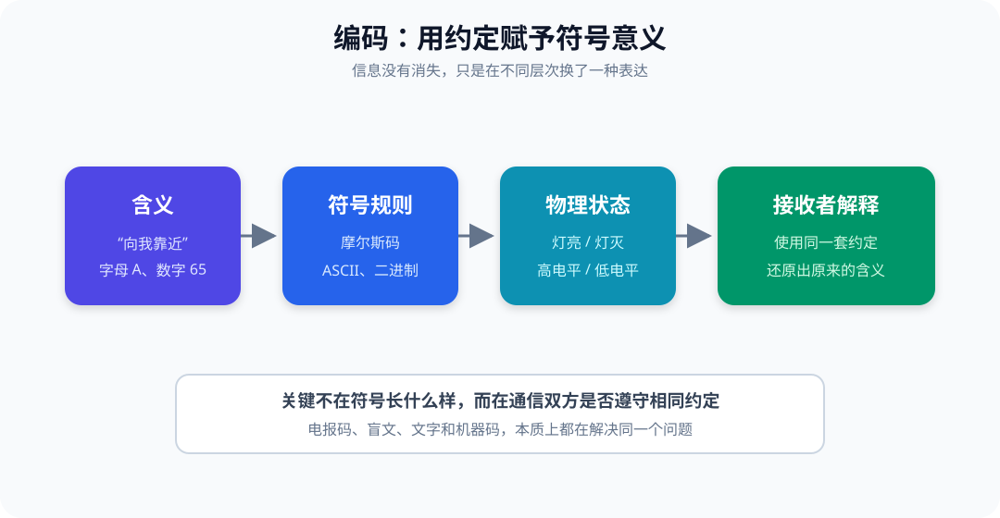
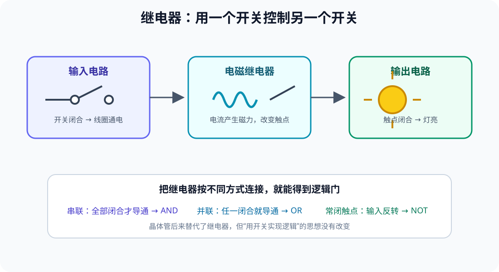
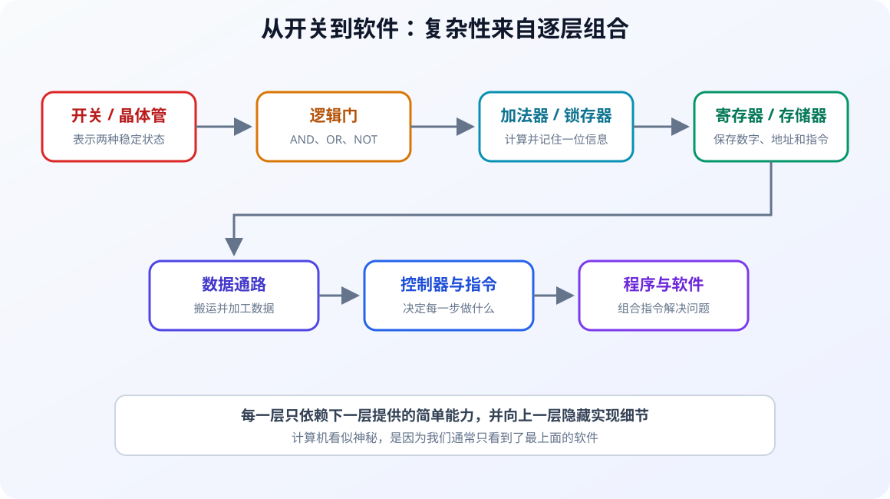

# 《编码》：从手电筒到计算机

> 本文复述 Charles Petzold《编码：隐匿在计算机软硬件背后的语言》的核心思想：复杂的计算机并非凭空出现，而是从“如何传递信息”这个简单问题开始，由编码、开关、逻辑和存储逐层搭建而成。

## 一、全书真正想回答什么

当我们使用电脑时，看到的是文字、图片、窗口和程序；而计算机内部只有大量电路状态。

《编码》试图回答：

> 人类的思想，怎样一步步变成机器可以保存、传输和处理的信号？

这本书不从现成的 CPU 开始讲，而是从两个人如何隔着一段距离交流开始。它逐层引出：

```text
交流需要约定
  ↓
约定形成编码
  ↓
信息可以表示成两种状态
  ↓
开关可以处理这两种状态
  ↓
开关组成逻辑门、加法器和存储器
  ↓
运算器、存储器和控制器组成计算机
  ↓
机器指令组成程序
```

全书最重要的不是记住某个电路，而是理解一种方法：

> 把复杂系统拆成简单部件，再用清晰的规则把它们组合起来。

---

## 二、编码就是一套共同约定

假设两个孩子住在相邻的房子里，夜晚想隔着窗户交流。他们可以约定：

- 手电筒短亮表示“点”；
- 手电筒长亮表示“划”；
- 不同的点划组合表示不同字母。

这就是摩尔斯电码。

灯光本身并不携带“字母 A”的天然含义。只有发送者和接收者都知道规则时：

```text
短亮 + 长亮 → ·— → A
```

这串信号才变成信息。



### 2.1 编码无处不在

- 文字用字形编码语言；
- 盲文用凸点组合编码字符；
- 摩尔斯码用点和划编码字符；
- 十进制用十个数字符号编码数量；
- 二进制用 `0` 和 `1` 编码数量；
- ASCII 和 Unicode 用数字编码字符；
- 机器指令用位模式编码操作。

因此，编码不是“加密”的同义词。编码主要解决**如何表示信息**；加密主要解决**如何限制信息被理解**。

### 2.2 好的编码依赖上下文

没有一种编码适合所有场景：

- 摩尔斯码适合用声音、电流或灯光传输；
- 盲文适合用触觉读取；
- 二进制适合由开关电路处理；
- Unicode 适合统一表示世界各地的文字。

评价编码时，需要看它是否容易产生、传输、区分、保存和解释。

---

## 三、为什么二进制如此重要

十进制对人类很自然，但电路要稳定区分十种状态并不容易。区分两种状态则简单得多：

```text
关 / 开
无电流 / 有电流
低电平 / 高电平
0 / 1
```

这两种状态都可以表示一个 **bit（位）**。

### 3.1 位能表示多少信息

一个位有两种组合：

```text
0
1
```

两个位有四种组合：

```text
00  01  10  11
```

三个位有八种组合。一般来说，\(n\) 个位可以产生：

```text
2^n 种不同组合
```

因此：

- 4 位可以表示 16 种状态；
- 8 位可以表示 256 种状态；
- 16 位可以表示 65536 种状态。

位数越多，不是因为每一位变复杂了，而是简单状态的组合数量迅速增长。

### 3.2 二进制如何表示数量

十进制每一位的权重是 10 的幂：

```text
325 = 3×10² + 2×10¹ + 5×10⁰
```

二进制每一位的权重是 2 的幂：

```text
1101₂ = 1×2³ + 1×2² + 0×2¹ + 1×2⁰
      = 8 + 4 + 0 + 1
      = 13₁₀
```

二进制并不是另一种数学，只是另一种记数规则。

### 3.3 二进制也能表示文字

只要约定数字和字符的对应关系即可。例如 ASCII 规定：

```text
65 → A
66 → B
97 → a
```

于是：

```text
A → 65 → 01000001
```

对计算机而言，数字 `65` 和字母 `A` 都是一串位。当前程序采用什么编码和数据类型，决定了这串位应被怎样解释。

---

## 四、从电报码到继电器

早期电报系统使用电流控制远处的电磁装置。电流通过线圈时产生磁力，可以吸动金属触点。

这就是**继电器**：

> 用一条电路的通断，控制另一条电路的通断。



继电器的重要性不只在于远程控制。把多个继电器按不同方式连接，可以让输出遵守明确的逻辑规则。

### 4.1 与、或、非

**与（AND）**

两个开关串联，只有 A 和 B 都闭合，灯才亮：

| A | B | 输出 |
| --- | --- | --- |
| 0 | 0 | 0 |
| 0 | 1 | 0 |
| 1 | 0 | 0 |
| 1 | 1 | 1 |

**或（OR）**

两个开关并联，只要有一个闭合，灯就亮：

| A | B | 输出 |
| --- | --- | --- |
| 0 | 0 | 0 |
| 0 | 1 | 1 |
| 1 | 0 | 1 |
| 1 | 1 | 1 |

**非（NOT）**

使用常闭触点，可以让输出与输入相反：

```text
输入 0 → 输出 1
输入 1 → 输出 0
```

这些简单电路就是逻辑门的原型。后来，真空管和晶体管取代了缓慢、耗电且容易磨损的继电器，但逻辑关系没有改变。

---

## 五、逻辑门如何完成加法

计算机并不“理解”加法，它只是让电路按照二进制加法规则产生输出。

一位二进制加法：

| A | B | 本位和 | 进位 |
| --- | --- | --- | --- |
| 0 | 0 | 0 | 0 |
| 0 | 1 | 1 | 0 |
| 1 | 0 | 1 | 0 |
| 1 | 1 | 0 | 1 |

观察这张表可以发现：

```text
本位和 = A XOR B
进位   = A AND B
```

这构成一个**半加器**。

真正的多位加法还要接收低位传来的进位，因此需要**全加器**。把多个全加器首尾连接，就能计算多位二进制数：

```text
   0101  (5)
 + 0011  (3)
 -------
   1000  (8)
```

这揭示了全书的一个关键转折：

> 数学规则可以改写成逻辑规则，逻辑规则可以由开关电路实现。

减法可以借助补码转换为加法，乘法可以拆成移位与多次加法。复杂运算最终仍建立在少量基本操作之上。

---

## 六、计算机还必须记住信息

只有逻辑门，电路的输出只取决于当前输入。输入一消失，结果也随之消失。

计算机还需要保存：

- 正在处理的数据；
- 上一步的结果；
- 下一条指令的位置；
- 程序本身。

### 6.1 反馈产生记忆

如果把逻辑门的输出适当地接回输入，就能让电路维持先前状态。这类电路称为**锁存器**或**触发器**。

一个锁存器可以保存 1 位：

```text
写入 1 → 即使写入信号消失，仍保持 1
写入 0 → 改为保持 0
```

把多个锁存器并排组合：

- 8 个可以保存 1 字节；
- 一组锁存器可以构成寄存器；
- 大量存储单元配合地址选择电路，可以构成存储器。

### 6.2 地址解决“存在哪里”

存储器中的每个位置都有编号，也就是地址。

```text
地址 0000 → 数据 10110110
地址 0001 → 数据 00101101
地址 0010 → 数据 11100010
```

访问存储器需要回答两个问题：

1. 访问哪个地址？
2. 是读取，还是写入？

地址译码器负责从许多存储单元中选中目标位置，读写控制信号决定数据流动方向。

---

## 七、时钟让电路有序工作

复杂电路不能让所有部件随意改变状态，否则新旧数据会互相干扰。计算机通常使用周期性时钟信号协调步骤：

```text
一个时钟周期
  ↓
组合电路根据当前输入计算
  ↓
在约定时刻把结果写入寄存器
  ↓
进入下一个周期
```

时钟像节拍器，而不是思考者。它只规定什么时候推进状态，并不决定要计算什么。

时钟频率表示每秒产生多少个周期，但频率高不等于计算机必然更快。每个周期能完成多少工作、存储器是否及时提供数据，同样重要。

---

## 八、从计算器到可编程计算机

加法器能够计算，存储器能够记忆，但还缺少一个关键能力：让机器自动决定下一步做什么。

为此，需要给基本操作编号：

```text
0001 → 从存储器读取数据
0010 → 把数据写入存储器
0011 → 两个数相加
0100 → 根据条件跳转
```

这些编号就是**操作码**。操作码再加上数据或地址，就形成机器指令。

### 8.1 控制器

控制器反复执行：

```text
取指令 → 解释指令 → 执行指令 → 取下一条指令
```

它根据指令产生控制信号，决定：

- 哪个寄存器输出数据；
- ALU 执行哪种运算；
- 是否读写存储器；
- 结果写到哪里；
- 下一条指令地址是什么。

### 8.2 程序也是数据

当指令也以二进制形式存入存储器后，计算机就获得了“存储程序”能力。

同一套硬件不需要重新接线，只需换一组指令，就能执行不同任务：

```text
相同硬件 + 绘图程序 → 处理图像
相同硬件 + 文本程序 → 编辑文章
相同硬件 + 游戏程序 → 运行游戏
```

这正是通用计算机和固定功能计算器之间的根本差别。

---

## 九、软件是继续向上的编码

机器码仍然很难由人直接编写，于是人们不断建立新的抽象层：

```text
机器码
  ↓ 用助记符表示
汇编语言
  ↓ 用变量、表达式和控制结构表示
高级语言
  ↓ 封装常用能力
库、操作系统和应用程序
```

汇编器把助记符编码成机器指令；编译器把高级语言翻译成低级指令；操作系统把硬件能力组织成文件、进程和窗口等更方便的概念。



每增加一层，使用者就不必重复理解下一层的全部细节。例如程序员可以调用“写文件”，不必亲自控制磁盘电路。

但抽象没有消灭底层：

- 字符最终仍要编码成位；
- 加法最终仍由逻辑电路完成；
- 变量最终仍保存在寄存器或存储器中；
- 程序最终仍要转换成机器可以执行的指令。

---

## 十、这本书最值得带走的五个认识

### 10.1 信息依赖约定

符号本身没有固定意义。发送者与接收者共享同一套规则，物理信号才能成为信息。

### 10.2 二进制简单，但组合能力极强

一个位只有两种状态，许多位却能编码数字、文字、声音、图像和指令。复杂性来自组合，而不是基本单元本身复杂。

### 10.3 计算可以还原为逻辑

加法表可以变成布尔逻辑，布尔逻辑可以变成开关连接方式，因此抽象的数学运算能够落到物理电路上。

### 10.4 记忆来自状态

反馈电路使系统不只响应当前输入，还能保留过去。拥有状态以后，电路才能形成寄存器、存储器和按步骤执行的机器。

### 10.5 软件没有脱离硬件

高级语言、操作系统和应用只是层次更高的编码。它们隐藏了底层细节，却始终建立在二进制、逻辑门和机器指令之上。

---

## 十一、一句话总结

《编码》用一条非常朴素的路线拆除了计算机的神秘感：

> 人类先约定符号来表达信息，再把符号化为两种物理状态；开关处理这些状态，逻辑门组合成运算和存储电路，控制器按照存储器中的指令驱动电路，最终形成可以运行软件的通用计算机。

读完这本书真正获得的，不是一张需要背诵的计算机结构图，而是一种确定感：

```text
再复杂的计算机，
也能沿着“编码 → 开关 → 逻辑 → 状态 → 指令 → 软件”
一层一层解释清楚。
```
